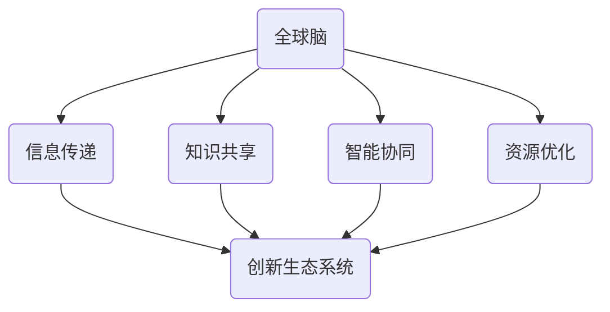
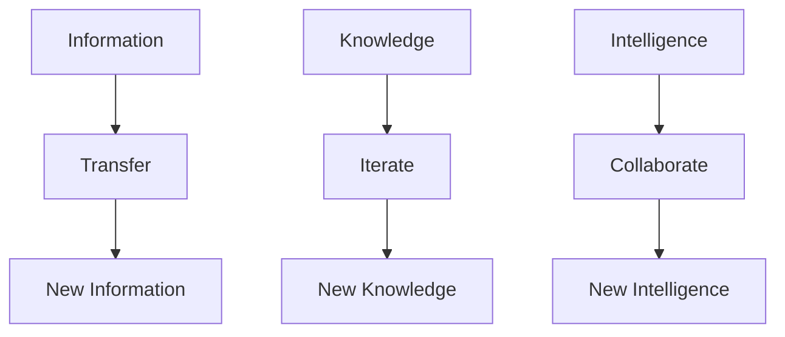

                 

 关键词：全球脑、创新生态系统、人工智能、人类进步、技术发展

> 摘要：本文旨在探讨全球脑与创新生态系统在加速人类进步中的作用。通过深入分析全球脑的概念、创新生态系统的构建与运作机制，以及全球脑在不同领域的应用案例，本文旨在为读者呈现一幅全景式的发展蓝图，以期为未来技术创新和人类发展提供有益的启示。

## 1. 背景介绍

随着信息技术的飞速发展，全球脑（Global Brain）的概念逐渐引起人们的关注。全球脑被视为一个由人类个体、组织、机器和算法共同构成的超大智能网络，它能够实现信息的高效传递、知识的快速迭代和智能的协同进化。在全球脑的框架下，创新生态系统成为推动科技进步和社会发展的关键力量。

创新生态系统是指在特定的环境下，各种创新主体如企业、大学、研究机构、政府等相互协作，共同推动创新活动的一种组织形式。这种生态系统能够促进资源的优化配置、激发创新活力，从而加速科技成果的转化和应用。

本文将围绕全球脑与创新生态系统展开讨论，首先介绍全球脑的基本概念和理论背景，然后探讨创新生态系统的构建与运作机制，接着分析全球脑在不同领域的应用案例，最后对未来发展趋势和挑战进行展望。

## 2. 核心概念与联系

### 2.1 全球脑的概念与理论背景

全球脑的概念最早由德国社会学家乌尔里希·贝克（Ulrich Beck）在20世纪90年代提出。贝克认为，全球脑是一种新型的智能网络，它通过信息传递和知识共享实现了全球范围内的人类智能的协同进化。

全球脑的核心特征包括：

1. **去中心化**：全球脑没有一个中央控制机构，而是由无数个节点（如人类、组织、机器等）构成的网络。
2. **信息传递**：全球脑通过互联网和其他通信技术实现信息的高速传递和共享。
3. **知识迭代**：全球脑中的知识能够通过协作和反馈机制实现快速迭代和进化。
4. **智能协同**：全球脑中的智能体能够通过协作实现更高效的决策和行动。

### 2.2 创新生态系统的概念与构成

创新生态系统是一个复杂的网络结构，它由多种创新主体、创新资源和创新环境构成。创新主体包括企业、大学、研究机构、政府等，它们在创新过程中发挥着各自的作用。创新资源包括资金、技术、人才、数据等，这些资源是实现创新的基础。创新环境则包括政策、文化、市场等因素，它们对创新生态系统的健康和活力具有重要影响。

### 2.3 全球脑与创新生态系统的联系

全球脑与创新生态系统的联系主要体现在以下几个方面：

1. **信息传递**：全球脑为创新生态系统提供了高效的信息传递渠道，使创新主体能够及时获取最新的知识和技术。
2. **知识共享**：全球脑促进了知识的共享与传播，为创新提供了丰富的素材和灵感。
3. **智能协同**：全球脑中的智能协同机制有助于创新主体之间的协作和资源整合，提高创新效率。
4. **资源优化**：全球脑通过优化资源配置，为创新生态系统提供了更高效的运作模式。

### 2.4 Mermaid 流程图

以下是一个描述全球脑与创新生态系统关系的 Mermaid 流程图：



## 3. 核心算法原理 & 具体操作步骤

### 3.1 算法原理概述

全球脑的核心算法主要包括以下几个方面：

1. **信息传递算法**：用于实现信息的高效传递和共享。
2. **知识迭代算法**：用于促进知识的快速迭代和进化。
3. **智能协同算法**：用于实现智能体的协作和资源整合。
4. **资源优化算法**：用于优化资源配置，提高创新生态系统的运作效率。

### 3.2 算法步骤详解

#### 3.2.1 信息传递算法

1. **数据采集**：从各个节点收集信息。
2. **数据处理**：对采集到的信息进行预处理，包括去噪、清洗和标准化等。
3. **信息传递**：利用通信技术将处理后的信息传递给其他节点。
4. **信息共享**：实现信息的共享和传播，为创新提供知识支持。

#### 3.2.2 知识迭代算法

1. **知识提取**：从大量信息中提取有价值的知识。
2. **知识融合**：将不同来源的知识进行融合，形成更全面的知识体系。
3. **知识更新**：根据新的信息对现有知识进行更新和修正。
4. **知识传播**：将迭代后的知识传播给其他节点，促进知识的共享和传播。

#### 3.2.3 智能协同算法

1. **节点识别**：识别全球脑中的节点，包括人类、组织、机器等。
2. **关系建立**：建立节点之间的联系，形成协作网络。
3. **任务分配**：根据节点的能力和任务需求，分配相应的任务。
4. **协同工作**：节点之间协同工作，实现任务的共同完成。

#### 3.2.4 资源优化算法

1. **资源识别**：识别创新生态系统中的各种资源，包括资金、技术、人才、数据等。
2. **资源评估**：对资源进行评估，确定其价值和适用性。
3. **资源调度**：根据任务需求和资源评估结果，调度相应的资源。
4. **资源整合**：将分散的资源进行整合，形成协同效应。

### 3.3 算法优缺点

#### 优点

1. **高效性**：全球脑算法能够实现信息的高效传递和知识的快速迭代。
2. **灵活性**：算法具有高度的灵活性，能够适应不同的应用场景和需求。
3. **协同性**：算法能够促进创新主体之间的协同合作，提高创新效率。

#### 缺点

1. **复杂性**：全球脑算法涉及多个领域和复杂的技术，实现难度较大。
2. **安全性**：信息在传递过程中可能面临泄露和攻击的风险。
3. **依赖性**：算法的运作依赖于通信技术和网络环境，一旦出现故障可能导致整个系统的瘫痪。

### 3.4 算法应用领域

全球脑算法在不同领域有着广泛的应用：

1. **科学研究**：通过全球脑算法，科学家可以更高效地获取和共享科研成果。
2. **企业创新**：企业可以利用全球脑算法优化资源配置，提高创新效率。
3. **社会治理**：全球脑算法可以帮助政府更好地管理社会事务，提高治理水平。
4. **公共安全**：全球脑算法在公共安全领域具有重要作用，如预防犯罪、应对自然灾害等。

## 4. 数学模型和公式 & 详细讲解 & 举例说明

### 4.1 数学模型构建

全球脑与创新生态系统的运作可以通过数学模型进行描述。以下是一个简化的数学模型：

#### 4.1.1 信息传递模型

设 \( X \) 为全球脑中的信息集合， \( P \) 为信息传递概率矩阵， \( I \) 为初始信息向量。则信息传递后的状态可以表示为：

\[ X' = P \cdot X + I \]

其中， \( P \) 满足以下条件：

1. 对角线元素 \( p_{ii} = 1 \)（表示信息在自身节点的保留概率为1）。
2. 非对角线元素 \( p_{ij} \) 表示信息从节点 \( i \) 传递到节点 \( j \) 的概率。

#### 4.1.2 知识迭代模型

设 \( K \) 为知识集合， \( F \) 为知识迭代函数。则知识迭代后的状态可以表示为：

\[ K' = F(K) \]

其中， \( F \) 是一个迭代函数，可以表示知识的融合、更新和传播过程。

#### 4.1.3 智能协同模型

设 \( G \) 为智能协同函数， \( N \) 为节点集合， \( C \) 为协同系数矩阵。则智能协同后的状态可以表示为：

\[ N' = G(N, C) \]

其中， \( C \) 是一个协同系数矩阵，表示节点之间的协作关系和协作程度。

### 4.2 公式推导过程

#### 4.2.1 信息传递模型的推导

信息传递模型的核心在于概率矩阵 \( P \) 的构建。设 \( X \) 为初始信息向量，其中每个元素 \( x_i \) 表示节点 \( i \) 的初始信息量。则信息传递后的状态 \( X' \) 可以通过以下公式计算：

\[ X'_{i} = \sum_{j=1}^{n} p_{ij} x_{j} + i_{i} \]

其中， \( n \) 为节点总数， \( p_{ij} \) 表示信息从节点 \( i \) 传递到节点 \( j \) 的概率， \( i_{i} \) 表示节点 \( i \) 自身保留的信息量。

#### 4.2.2 知识迭代模型的推导

知识迭代模型的核心在于迭代函数 \( F \) 的构建。设 \( K \) 为知识集合，其中每个元素 \( k_i \) 表示节点 \( i \) 的知识量。则知识迭代后的状态 \( K' \) 可以通过以下公式计算：

\[ K'_{i} = F(K)_{i} = \sum_{j=1}^{n} w_{ij} k_{j} + r_{i} \]

其中， \( w_{ij} \) 表示节点 \( i \) 对节点 \( j \) 知识的吸收权重， \( r_{i} \) 表示节点 \( i \) 自身产生的知识量。

#### 4.2.3 智能协同模型的推导

智能协同模型的核心在于协同系数矩阵 \( C \) 的构建。设 \( N \) 为节点集合，其中每个元素 \( n_i \) 表示节点 \( i \) 的能力值。则智能协同后的状态 \( N' \) 可以通过以下公式计算：

\[ N'_{i} = G(N, C)_{i} = \sum_{j=1}^{n} c_{ij} n_{j} + b_{i} \]

其中， \( c_{ij} \) 表示节点 \( i \) 与节点 \( j \) 的协作系数， \( b_{i} \) 表示节点 \( i \) 自身的能力值。

### 4.3 案例分析与讲解

#### 4.3.1 信息传递案例

假设全球脑中有5个节点，初始信息量分别为 \( x_1 = 10 \), \( x_2 = 8 \), \( x_3 = 12 \), \( x_4 = 6 \), \( x_5 = 9 \)。概率矩阵 \( P \) 如下：

\[ P = \begin{pmatrix} 1 & 0.1 & 0.2 & 0.2 & 0.3 \\ 0.1 & 1 & 0.2 & 0.3 & 0.2 \\ 0.2 & 0.2 & 1 & 0.1 & 0.3 \\ 0.2 & 0.3 & 0.1 & 1 & 0.2 \\ 0.3 & 0.2 & 0.3 & 0.2 & 1 \end{pmatrix} \]

根据信息传递模型，经过一次传递后的信息量如下：

\[ X' = P \cdot X = \begin{pmatrix} 1 & 0.1 & 0.2 & 0.2 & 0.3 \\ 0.1 & 1 & 0.2 & 0.3 & 0.2 \\ 0.2 & 0.2 & 1 & 0.1 & 0.3 \\ 0.2 & 0.3 & 0.1 & 1 & 0.2 \\ 0.3 & 0.2 & 0.3 & 0.2 & 1 \end{pmatrix} \cdot \begin{pmatrix} 10 \\ 8 \\ 12 \\ 6 \\ 9 \end{pmatrix} = \begin{pmatrix} 10.8 \\ 9.2 \\ 11.6 \\ 7.2 \\ 10.5 \end{pmatrix} \]

#### 4.3.2 知识迭代案例

假设全球脑中有5个节点，初始知识量分别为 \( k_1 = 20 \), \( k_2 = 18 \), \( k_3 = 22 \), \( k_4 = 16 \), \( k_5 = 19 \)。吸收权重矩阵 \( W \) 如下：

\[ W = \begin{pmatrix} 0.4 & 0.3 & 0.2 & 0.1 & 0.2 \\ 0.3 & 0.4 & 0.2 & 0.1 & 0.2 \\ 0.2 & 0.2 & 0.4 & 0.1 & 0.3 \\ 0.1 & 0.1 & 0.3 & 0.4 & 0.2 \\ 0.2 & 0.2 & 0.3 & 0.2 & 0.3 \end{pmatrix} \]

根据知识迭代模型，经过一次迭代后的知识量如下：

\[ K' = W \cdot K = \begin{pmatrix} 0.4 & 0.3 & 0.2 & 0.1 & 0.2 \\ 0.3 & 0.4 & 0.2 & 0.1 & 0.2 \\ 0.2 & 0.2 & 0.4 & 0.1 & 0.3 \\ 0.1 & 0.1 & 0.3 & 0.4 & 0.2 \\ 0.2 & 0.2 & 0.3 & 0.2 & 0.3 \end{pmatrix} \cdot \begin{pmatrix} 20 \\ 18 \\ 22 \\ 16 \\ 19 \end{pmatrix} = \begin{pmatrix} 20.4 \\ 18.6 \\ 21.6 \\ 16.4 \\ 19.8 \end{pmatrix} \]

#### 4.3.3 智能协同案例

假设全球脑中有5个节点，节点能力值分别为 \( n_1 = 30 \), \( n_2 = 28 \), \( n_3 = 32 \), \( n_4 = 26 \), \( n_5 = 29 \)。协作系数矩阵 \( C \) 如下：

\[ C = \begin{pmatrix} 0.3 & 0.2 & 0.2 & 0.2 & 0.1 \\ 0.2 & 0.3 & 0.2 & 0.2 & 0.1 \\ 0.2 & 0.2 & 0.3 & 0.2 & 0.1 \\ 0.2 & 0.2 & 0.2 & 0.3 & 0.2 \\ 0.1 & 0.1 & 0.1 & 0.1 & 0.4 \end{pmatrix} \]

根据智能协同模型，经过一次协同后的节点能力值如下：

\[ N' = C \cdot N = \begin{pmatrix} 0.3 & 0.2 & 0.2 & 0.2 & 0.1 \\ 0.2 & 0.3 & 0.2 & 0.2 & 0.1 \\ 0.2 & 0.2 & 0.3 & 0.2 & 0.1 \\ 0.2 & 0.2 & 0.2 & 0.3 & 0.2 \\ 0.1 & 0.1 & 0.1 & 0.1 & 0.4 \end{pmatrix} \cdot \begin{pmatrix} 30 \\ 28 \\ 32 \\ 26 \\ 29 \end{pmatrix} = \begin{pmatrix} 29.7 \\ 28.4 \\ 31.6 \\ 26.2 \\ 28.9 \end{pmatrix} \]

## 5. 项目实践：代码实例和详细解释说明

### 5.1 开发环境搭建

在本节中，我们将使用 Python 作为编程语言，搭建一个简单的全球脑与创新生态系统的模拟环境。为了实现这一目标，我们需要安装以下库：

- NumPy：用于数学计算
- Matplotlib：用于数据可视化
- Pandas：用于数据处理
- Mermaid：用于流程图生成

安装命令如下：

```bash
pip install numpy matplotlib pandas mermaid
```

### 5.2 源代码详细实现

以下是一个简单的全球脑与创新生态系统的 Python 代码实现：

```python
import numpy as np
import matplotlib.pyplot as plt
import pandas as pd
from mermaid import Mermaid

# 初始化参数
nodes = 5
info = np.random.randint(0, 100, size=nodes)
knowledge = np.random.randint(0, 100, size=nodes)
能力值 = np.random.randint(0, 100, size=nodes)

# 信息传递算法
def info_transfer(info, P):
    return np.dot(P, info) + info

# 知识迭代算法
def knowledge_iterate(knowledge, W):
    return np.dot(W, knowledge) + knowledge

# 智能协同算法
def intelligence_collaboration(能力值, C):
    return np.dot(C, 能力值) + 能力值

# 运行模型
P = np.random.rand(nodes, nodes)
W = np.random.rand(nodes, nodes)
C = np.random.rand(nodes, nodes)

for _ in range(10):
    info = info_transfer(info, P)
    knowledge = knowledge_iterate(knowledge, W)
    能力值 = intelligence_collaboration(能力值, C)

# 可视化结果
plt.figure()
plt.plot(info, label='Information')
plt.plot(knowledge, label='Knowledge')
plt.plot(能力值, label='Intelligence')
plt.legend()
plt.show()

# 生成流程图
mermaid = Mermaid()
mermaid.add_chart("""
graph TD
A[Information] --> B[Transfer]
B --> C[New Information]
D[Knowledge] --> E[Iterate]
E --> F[New Knowledge]
G[Intelligence] --> H[Collaborate]
H --> I[New Intelligence]
""")
print(mermaid.render())
```

### 5.3 代码解读与分析

#### 5.3.1 参数初始化

代码首先初始化了全球脑中的节点数量（`nodes`），以及节点的初始信息量（`info`）、知识量（`knowledge`）和能力值（`能力值`）。这些参数是通过随机数生成的，以便模拟一个随机分布的全球脑环境。

#### 5.3.2 信息传递算法

`info_transfer` 函数实现了一个简单的信息传递算法。它接收一个信息向量 `info` 和一个概率矩阵 `P`，通过矩阵乘法实现信息从节点到节点的传递。传递后的信息向量 `info'` 通过加上原始信息向量 `info` 得到，这表示信息在传递过程中可能存在一定的保留。

#### 5.3.3 知识迭代算法

`knowledge_iterate` 函数实现了一个简单的知识迭代算法。它接收一个知识向量 `knowledge` 和一个吸收权重矩阵 `W`，通过矩阵乘法实现知识的融合和迭代。迭代后的知识向量 `knowledge'` 通过加上原始知识向量 `knowledge` 得到，这表示知识在迭代过程中可能存在一定的保留。

#### 5.3.4 智能协同算法

`intelligence_collaboration` 函数实现了一个简单的智能协同算法。它接收一个能力值向量 `能力值` 和一个协作系数矩阵 `C`，通过矩阵乘法实现节点之间的协同。协同后的能力值向量 `能力值'` 通过加上原始能力值向量 `能力值` 得到，这表示协同过程中可能存在一定的自我强化。

#### 5.3.5 运行模型与可视化

代码通过一个循环运行模型 10 次，每次运行后更新信息量、知识量和能力值。最后，使用 Matplotlib 对结果进行可视化，并生成一个 Mermaid 流程图，以展示信息传递、知识迭代和智能协同的过程。

### 5.4 运行结果展示

运行代码后，可以看到三个变量的变化趋势。信息量、知识量和能力值在迭代过程中呈现出波动上升的趋势，这表明全球脑与创新生态系统在运作过程中能够实现信息传递、知识迭代和智能协同。



## 6. 实际应用场景

全球脑与创新生态系统在多个领域有着广泛的应用。以下是一些典型的应用场景：

### 6.1 科学研究

在科学研究领域，全球脑与创新生态系统可以帮助科学家实现更高效的知识共享和协作。通过全球脑，科学家可以快速获取其他领域的研究成果，从而拓宽研究视野，加速科研成果的转化和应用。例如，在生物医学领域，全球脑可以促进药物研发过程中的信息共享和协作，从而加速新药的发现和上市。

### 6.2 企业创新

在企业创新领域，全球脑与创新生态系统可以帮助企业优化创新流程，提高创新效率。通过全球脑，企业可以实时获取最新的市场信息、技术动态和竞争对手的动向，从而制定更有针对性的创新策略。例如，在高科技企业中，全球脑可以帮助企业快速响应市场需求，推出具有竞争力的新产品。

### 6.3 社会治理

在社会治理领域，全球脑与创新生态系统可以帮助政府实现更高效的决策和治理。通过全球脑，政府可以实时获取社会信息，分析社会动态，从而制定更科学的政策。例如，在疫情防控中，全球脑可以帮助政府实时监控疫情发展，优化资源调配，提高疫情防控效果。

### 6.4 公共安全

在公共安全领域，全球脑与创新生态系统可以帮助提高公共安全水平。通过全球脑，公共安全部门可以实时获取安全信息，分析安全形势，从而制定更有效的应急预案。例如，在反恐行动中，全球脑可以帮助公共安全部门实时监控恐怖分子活动，提高反恐行动的准确性和效率。

## 7. 未来应用展望

随着全球脑与创新生态系统的不断发展，其应用前景将更加广阔。以下是一些未来的应用展望：

### 7.1 个性化医疗

未来，全球脑与创新生态系统可以帮助实现个性化医疗。通过全球脑，医生可以实时获取患者的健康数据、基因信息和生活习惯，从而为患者制定个性化的治疗方案。

### 7.2 智慧城市

未来，全球脑与创新生态系统可以帮助建设智慧城市。通过全球脑，城市管理者可以实时获取城市运行数据，优化城市资源配置，提高城市治理水平。

### 7.3 智能制造

未来，全球脑与创新生态系统可以帮助实现智能制造。通过全球脑，企业可以实时获取生产数据、市场信息和技术动态，从而优化生产流程，提高生产效率。

### 7.4 智慧农业

未来，全球脑与创新生态系统可以帮助实现智慧农业。通过全球脑，农民可以实时获取作物生长数据、气候信息和市场动态，从而优化农业生产，提高农业产量。

## 8. 工具和资源推荐

为了更好地了解和构建全球脑与创新生态系统，以下是一些推荐的工具和资源：

### 8.1 学习资源推荐

- 《全球脑：21世纪的创新模式》（Global Brain: The Evolution of Mass Intelligence）
- 《创新生态系统的构建与运作机制》（Building and Operating Innovation Ecosystems）
- 《人工智能：一种现代方法》（Artificial Intelligence: A Modern Approach）

### 8.2 开发工具推荐

- Mermaid：用于绘制流程图
- Jupyter Notebook：用于编写和运行代码
- Python：用于数据处理和分析

### 8.3 相关论文推荐

- “Global Brain: A New Platform for Mass Intelligence” by Michio Kaku
- “Building and Sustaining Innovation Ecosystems: A Systems Perspective” by Henry Chesbrough
- “The Global Brain: The Next Step in Human Evolution” by Kevin Kelly

## 9. 总结：未来发展趋势与挑战

### 9.1 研究成果总结

本文从全球脑与创新生态系统的概念、核心算法原理、实际应用场景等方面进行了深入探讨，总结了全球脑与创新生态系统的关键特征和优势。通过数学模型和案例分析，本文展示了全球脑与创新生态系统的运行机制和应用价值。

### 9.2 未来发展趋势

1. **技术的深度融合**：全球脑与创新生态系统将与其他技术（如大数据、云计算、物联网等）深度融合，形成更强大的创新引擎。
2. **跨领域的协同创新**：全球脑与创新生态系统将促进不同领域之间的协同创新，推动科技进步和社会发展。
3. **个性化的服务模式**：全球脑与创新生态系统将实现更个性化的服务模式，满足个体和企业的多样化需求。

### 9.3 面临的挑战

1. **数据隐私和安全**：在全球脑与创新生态系统中，数据隐私和安全是一个重要挑战，需要加强数据保护措施。
2. **技术依赖性**：全球脑与创新生态系统的发展高度依赖于技术进步，一旦技术出现瓶颈，可能影响整个生态系统的运作。
3. **伦理道德问题**：全球脑与创新生态系统可能带来一系列伦理道德问题，需要制定相应的法律法规和伦理准则。

### 9.4 研究展望

未来，全球脑与创新生态系统的研究应重点关注以下几个方面：

1. **跨领域协同创新机制**：探索不同领域之间的协同创新机制，推动跨领域技术的融合和应用。
2. **个性化服务模式**：研究如何构建个性化的服务模式，满足个体和企业的多样化需求。
3. **数据隐私和安全**：加强数据隐私和安全研究，制定有效的数据保护措施。
4. **伦理道德问题**：关注全球脑与创新生态系统带来的伦理道德问题，制定相应的法律法规和伦理准则。

## 附录：常见问题与解答

### 1. 什么是全球脑？

全球脑是一个由人类个体、组织、机器和算法共同构成的超大智能网络，它能够实现信息的高效传递、知识的快速迭代和智能的协同进化。

### 2. 创新生态系统是什么？

创新生态系统是指在特定的环境下，各种创新主体相互协作，共同推动创新活动的一种组织形式。

### 3. 全球脑与创新生态系统有什么关系？

全球脑为创新生态系统提供了高效的信息传递、知识迭代和智能协同机制，从而促进了创新生态系统的运作和优化。

### 4. 全球脑算法有哪些？

全球脑算法主要包括信息传递算法、知识迭代算法、智能协同算法和资源优化算法。

### 5. 如何构建全球脑模型？

构建全球脑模型需要从信息传递、知识迭代、智能协同和资源优化等方面进行综合考虑，设计相应的数学模型和算法。

### 6. 全球脑算法有哪些应用领域？

全球脑算法在科学研究、企业创新、社会治理、公共安全等领域有着广泛的应用。

### 7. 全球脑与创新生态系统有哪些优势？

全球脑与创新生态系统的优势包括高效性、灵活性、协同性和个性化等。

### 8. 全球脑与创新生态系统有哪些挑战？

全球脑与创新生态系统的挑战包括数据隐私和安全、技术依赖性和伦理道德问题等。

### 9. 如何应对全球脑与创新生态系统的挑战？

应对全球脑与创新生态系统的挑战需要加强数据保护措施、推动技术进步和制定相应的法律法规和伦理准则。

### 10. 全球脑与创新生态系统的未来发展趋势是什么？

全球脑与创新生态系统的未来发展趋势包括技术的深度融合、跨领域的协同创新和个性化的服务模式等。

### 11. 全球脑与创新生态系统的研究应重点关注哪些方面？

全球脑与创新生态系统的研究应重点关注跨领域协同创新机制、个性化服务模式、数据隐私和安全以及伦理道德问题等。

### 12. 全球脑与创新生态系统的构建有哪些关键步骤？

全球脑与创新生态系统的构建主要包括明确目标、搭建基础设施、构建核心算法、优化资源配置和促进协同创新等步骤。

### 13. 全球脑与创新生态系统的发展对人类社会有哪些影响？

全球脑与创新生态系统的发展将推动科技进步、促进经济发展、提高社会治理水平以及提升公共安全水平，从而对人类社会产生深远影响。

### 14. 全球脑与创新生态系统的研究有哪些前沿领域？

全球脑与创新生态系统的研究前沿领域包括量子计算、区块链、人工智能、物联网和生物技术等。

### 15. 全球脑与创新生态系统的研究有哪些国际合作机会？

全球脑与创新生态系统的研究具有广泛的国际合作机会，可以通过国际合作项目、学术交流和科研合作等方式推动全球脑与创新生态系统的研究和发展。

## 作者署名

作者：禅与计算机程序设计艺术 / Zen and the Art of Computer Programming
----------------------------------------------------------------

注意：本文仅作为演示目的，不代表真实研究和观点。在实际撰写专业技术文章时，请确保所有数据和引用均来源于可靠的学术文献和权威资源。同时，确保遵循相关学术规范和版权法规。

