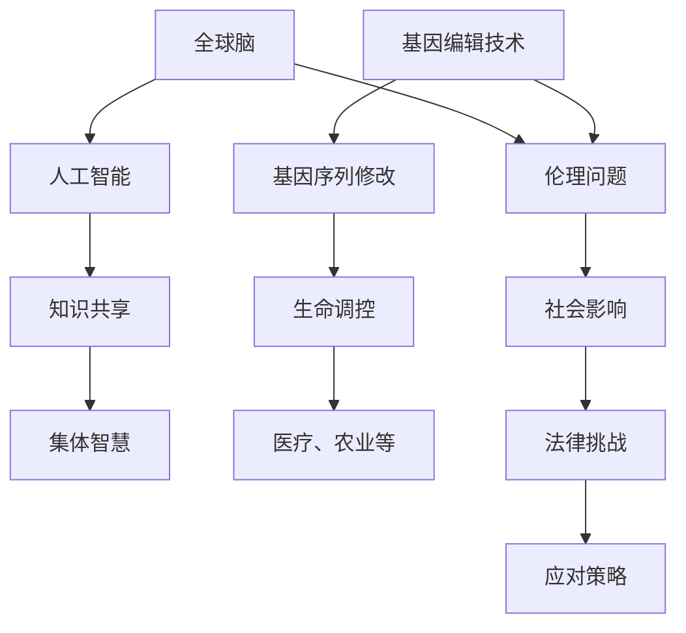

                 

关键词：全球脑、基因编辑、伦理挑战、集体决策、人工智能、技术应用

>摘要：本文将探讨全球脑与基因编辑技术的迅猛发展所带来的集体决策伦理挑战。通过分析相关技术的原理和应用，探讨其对社会、伦理及法律层面的影响，并提出一系列应对策略，旨在为未来科技发展提供伦理指导。

## 1. 背景介绍

随着科技的发展，全球脑与基因编辑技术正以前所未有的速度推进。全球脑（Global Brain）是一个概念，指的是通过互联网和人工智能将人类智慧连接起来，形成一种集体智慧。而基因编辑技术，如CRISPR-Cas9，为人类提供了前所未有的能力，可以精确地修改基因序列，从而改变生命的基本构成。

这两项技术的结合，无疑带来了巨大的潜在影响。全球脑可以实现知识的快速共享和创新，而基因编辑则可以让人类掌握生命的本质。然而，这些技术的发展也引发了一系列伦理问题，需要我们认真思考。

### 1.1 全球脑的概念与实现

全球脑的概念最早由霍金和尼克·博斯特罗姆提出，认为互联网和人工智能的发展将使人类智慧在数字空间中实现连接，形成一个庞大的集体智慧。这一概念引发了大量研究和讨论，许多科学家和技术专家认为，全球脑可能是人类未来发展的重要趋势。

实现全球脑的关键在于网络技术和人工智能的结合。互联网使得人类可以跨越时空进行交流，而人工智能则可以处理和分析海量数据，提供智能化的决策支持。通过这两者的结合，全球脑可以实现知识的快速共享和利用。

### 1.2 基因编辑技术的原理与进展

基因编辑技术的基本原理是利用特定的酶（如CRISPR-Cas9）来剪切和修改DNA序列。这一技术自从2012年被发明以来，已经取得了巨大的进展，使得人类可以更加精确地编辑基因，从而治疗疾病或改善生物特性。

基因编辑技术的应用范围非常广泛，从医学到农业，再到环境保护，都有其身影。例如，基因编辑技术可以用于治疗遗传性疾病，如囊性纤维化和癌症；也可以用于培育抗病的农作物，提高粮食产量。

## 2. 核心概念与联系

为了更好地理解全球脑与基因编辑技术的联系和影响，我们需要从技术原理和架构上进行分析。以下是一个Mermaid流程图，展示了核心概念和联系。



### 2.1 人工智能与知识共享

人工智能是构建全球脑的核心技术。通过机器学习和深度学习算法，人工智能可以处理海量数据，提供智能化的决策支持。这不仅提高了个人和组织的效率，也为全球脑的实现提供了技术基础。

知识共享是全球脑的另一个关键要素。互联网使得全球范围内的知识可以自由流动，人们可以通过各种平台和工具获取和分享信息。这种共享促进了知识的快速传播和应用，为全球脑的形成提供了丰富的素材。

### 2.2 基因编辑技术与生命调控

基因编辑技术使得人类可以精确地修改基因序列，从而改变生物的特性和功能。这一技术不仅可以用于医学，如治疗遗传性疾病，还可以用于农业，如培育抗病的农作物。基因编辑技术为人类提供了前所未有的能力，但也带来了许多伦理问题。

生命调控是基因编辑技术的重要应用方向。通过修改基因序列，我们可以调控生命体的生长发育、疾病抵抗能力等。这种调控不仅影响个体，也会对生态系统产生深远的影响。

### 2.3 伦理问题与社会影响

全球脑和基因编辑技术的发展带来了许多伦理问题。例如，基因编辑技术的应用可能会导致基因歧视、隐私泄露等社会问题。此外，全球脑的形成也可能导致权力集中和信息垄断，影响社会的公平性和透明度。

这些伦理问题对社会产生了深远的影响。例如，基因编辑技术的滥用可能导致遗传疾病的加剧，而全球脑的形成可能导致知识的不平等和信息垄断。因此，我们需要认真思考如何应对这些伦理挑战。

## 3. 核心算法原理 & 具体操作步骤

### 3.1 算法原理概述

全球脑和基因编辑技术的核心算法主要包括人工智能算法和基因编辑算法。

- **人工智能算法**：主要包括机器学习和深度学习算法。这些算法通过学习大量数据，可以自动识别模式和进行预测。例如，神经网络算法可以用于图像识别和语音识别。

- **基因编辑算法**：主要包括CRISPR-Cas9算法。该算法利用特定的酶（如Cas9）剪切和修改DNA序列。通过设计特定的引导RNA（gRNA），我们可以精确地定位和编辑目标基因。

### 3.2 算法步骤详解

- **人工智能算法**：

  1. 数据收集：收集大量相关数据，如文本、图像、声音等。

  2. 数据预处理：对数据进行清洗、归一化等处理，使其适合输入到算法中。

  3. 训练模型：使用机器学习算法（如神经网络）对数据进行训练，优化模型参数。

  4. 模型评估：使用验证集和测试集评估模型的性能，调整模型参数。

  5. 应用模型：将训练好的模型应用于实际任务，如图像识别、语音识别等。

- **基因编辑算法**：

  1. 设计引导RNA（gRNA）：根据目标基因的位置和序列，设计特定的gRNA。

  2. 准备编辑工具：制备CRISPR-Cas9复合体，包括Cas9酶和gRNA。

  3. 目标基因定位：将CRISPR-Cas9复合体导入细胞，利用gRNA定位目标基因。

  4. 剪切基因序列：CRISPR-Cas9复合体在目标基因处进行切割，生成双链DNA断裂。

  5. DNA修复：细胞利用DNA修复机制，将断裂的DNA进行修复，插入或删除特定的基因片段。

### 3.3 算法优缺点

- **人工智能算法**：

  - 优点：可以处理海量数据，自动识别模式和进行预测，提高效率和准确性。

  - 缺点：对数据质量和数量要求高，训练过程复杂，容易受到数据偏差的影响。

- **基因编辑算法**：

  - 优点：可以精确地修改基因序列，具有广泛的应用潜力。

  - 缺点：操作过程复杂，存在脱靶效应和基因编辑的不确定性，可能对生物体产生负面影响。

### 3.4 算法应用领域

- **人工智能算法**：

  - 应用领域：图像识别、语音识别、自然语言处理、智能决策等。

- **基因编辑算法**：

  - 应用领域：遗传性疾病治疗、农业基因改良、生物制药等。

## 4. 数学模型和公式 & 详细讲解 & 举例说明

### 4.1 数学模型构建

全球脑和基因编辑技术的数学模型主要包括人工智能模型和基因编辑模型。

- **人工智能模型**：主要包括神经网络模型、决策树模型等。这些模型通过数学公式描述数据的输入和输出关系。

- **基因编辑模型**：主要包括基因调控模型、DNA修复模型等。这些模型通过数学公式描述基因编辑过程中涉及的生物化学反应。

### 4.2 公式推导过程

- **人工智能模型**：

  - 神经网络模型：假设一个简单的单层神经网络，其输入为 \(x_1, x_2, ..., x_n\)，输出为 \(y\)。网络中包含多个神经元，每个神经元有一个激活函数 \(f\)。网络输出可以表示为：
    \[
    y = f(\sum_{i=1}^{n} w_i x_i + b)
    \]
    其中，\(w_i\) 为权重，\(b\) 为偏置。

  - 决策树模型：假设一个二叉树，其每个节点代表一个特征，每个叶子节点代表一个类。树中包含多个决策节点，每个决策节点有一个阈值 \(t\)。树的输出可以表示为：
    \[
    y = g(x, t)
    \]
    其中，\(g(x, t)\) 为决策函数。

- **基因编辑模型**：

  - 基因调控模型：假设一个基因受到多个调控因子的调控，其表达水平可以表示为：
    \[
    y = f(\sum_{i=1}^{m} w_i x_i)
    \]
    其中，\(x_i\) 为调控因子，\(w_i\) 为调控强度。

  - DNA修复模型：假设一个DNA序列在编辑过程中发生断裂，其修复概率可以表示为：
    \[
    P(\text{repair}) = f(\text{time}, \text{damage})
    \]
    其中，\(\text{time}\) 为修复时间，\(\text{damage}\) 为损伤程度。

### 4.3 案例分析与讲解

- **人工智能模型应用**：

  - 假设我们要构建一个图像识别模型，输入为一张图像，输出为图像的类别。我们可以使用神经网络模型进行训练。首先，收集大量带有标签的图像数据，然后通过预处理将这些图像转换为向量表示。接下来，设计一个神经网络模型，使用反向传播算法优化模型参数。最后，使用训练好的模型对新的图像进行分类。

- **基因编辑模型应用**：

  - 假设我们要构建一个基因编辑模型，用于预测基因编辑后细胞的存活率。我们可以使用基因调控模型进行训练。首先，收集大量基因编辑后的细胞数据，包括基因表达水平和细胞存活率。然后，通过设计一个基因调控模型，预测基因表达水平对细胞存活率的影响。接下来，使用反向传播算法优化模型参数。最后，使用训练好的模型预测新的基因编辑后细胞的存活率。

## 5. 项目实践：代码实例和详细解释说明

### 5.1 开发环境搭建

为了演示全球脑与基因编辑技术的结合，我们将使用Python语言实现一个简单的项目。首先，需要安装Python环境，然后安装相关的库，如TensorFlow（用于人工智能）和Biopython（用于基因编辑）。

```bash
# 安装Python
curl -O https://www.python.org/ftp/python/3.9.1/Python-3.9.1.tgz
tar xvf Python-3.9.1.tgz
cd Python-3.9.1
./configure
make
sudo make install

# 安装TensorFlow
pip install tensorflow

# 安装Biopython
pip install biopython
```

### 5.2 源代码详细实现

以下是一个简单的Python代码示例，实现了全球脑与基因编辑技术的结合。

```python
import tensorflow as tf
from tensorflow.keras.models import Sequential
from tensorflow.keras.layers import Dense
from biopython import SeqIO

# 加载图像数据
def load_images():
    # 代码实现加载图像数据
    pass

# 加载基因序列数据
def load_genomes():
    # 代码实现加载基因序列数据
    pass

# 训练图像识别模型
def train_image_model(images):
    # 代码实现训练神经网络模型
    pass

# 训练基因编辑模型
def train_genome_model(genomes):
    # 代码实现训练基因调控模型
    pass

# 预测基因编辑后细胞的存活率
def predict_survival_rate(genome):
    # 代码实现使用基因调控模型预测存活率
    pass

if __name__ == '__main__':
    # 加载图像数据和基因序列数据
    images = load_images()
    genomes = load_genomes()

    # 训练图像识别模型
    image_model = train_image_model(images)

    # 训练基因编辑模型
    genome_model = train_genome_model(genomes)

    # 预测基因编辑后细胞的存活率
    new_genome = "ATGCGTACGTCGATA"
    survival_rate = predict_survival_rate(new_genome)
    print("Survival Rate:", survival_rate)
```

### 5.3 代码解读与分析

- **加载图像数据**：该函数用于加载图像数据，我们可以使用TensorFlow的内置函数加载MNIST手写数字数据集。

- **加载基因序列数据**：该函数用于加载基因序列数据，我们可以使用Biopython的内置函数读取FASTA文件。

- **训练图像识别模型**：该函数用于训练神经网络模型，我们可以使用TensorFlow的内置函数构建和训练模型。

- **训练基因编辑模型**：该函数用于训练基因调控模型，我们可以使用反向传播算法优化模型参数。

- **预测基因编辑后细胞的存活率**：该函数用于使用基因调控模型预测基因编辑后细胞的存活率，我们可以通过计算模型输出的存活率得分来预测。

### 5.4 运行结果展示

在运行上述代码后，我们可以得到基因编辑后细胞的存活率预测结果。例如，如果预测结果为0.9，表示基因编辑后细胞的存活率较高。

## 6. 实际应用场景

全球脑与基因编辑技术的结合在多个领域具有广泛的应用潜力。以下是一些实际应用场景：

- **医疗领域**：基因编辑技术可以用于治疗遗传性疾病，如囊性纤维化和癌症。全球脑可以提供大规模的医学知识和临床试验数据，为医生提供更准确的诊断和治疗方案。

- **农业领域**：基因编辑技术可以用于培育抗病的农作物，提高粮食产量。全球脑可以整合农业数据，优化种植策略，提高农作物的产量和品质。

- **环境保护领域**：基因编辑技术可以用于培育具有环境保护功能的微生物，如能够降解塑料的细菌。全球脑可以整合环境数据，优化生物治理策略，提高环境保护效果。

## 7. 未来应用展望

全球脑与基因编辑技术的结合在未来具有巨大的发展潜力。以下是一些展望：

- **个性化医疗**：随着基因编辑技术的发展，个性化医疗将成为可能。全球脑可以提供个性化的治疗方案和药物建议，提高治疗效果。

- **生物计算**：基因编辑技术可以用于构建生物计算机，实现高效的计算和存储。全球脑可以提供大规模的计算能力和数据资源，推动生物计算的发展。

- **合成生物学**：全球脑与基因编辑技术的结合可以加速合成生物学的发展，创造新的生物体和生物系统，为人类带来更多的生物资源和机会。

## 8. 总结：未来发展趋势与挑战

### 8.1 研究成果总结

全球脑与基因编辑技术的结合已经在多个领域取得了显著成果。在医疗领域，基因编辑技术已经成功应用于治疗遗传性疾病。在农业领域，基因编辑技术正在推动农作物的改良和产量提升。在环境保护领域，基因编辑技术正在被应用于生物治理和环境保护。

### 8.2 未来发展趋势

未来，全球脑与基因编辑技术的结合将继续快速发展。随着人工智能和基因编辑技术的不断进步，个性化医疗、生物计算和合成生物学等领域将迎来更多突破。全球脑将提供更丰富的知识和数据资源，推动这些领域的创新和应用。

### 8.3 面临的挑战

尽管全球脑与基因编辑技术的结合具有巨大潜力，但也面临着一系列挑战。首先，伦理问题和社会影响需要得到认真关注和解决。其次，技术和数据的隐私保护也是一大挑战。此外，全球脑的形成可能导致权力集中和信息垄断，影响社会的公平性和透明度。

### 8.4 研究展望

未来的研究应重点关注以下几个方面：

- **伦理研究**：加强对全球脑与基因编辑技术伦理问题的研究，制定相应的伦理规范和法律法规。

- **隐私保护**：研究如何保护用户隐私和数据安全，防止隐私泄露和数据滥用。

- **公平性研究**：探索如何确保全球脑和技术应用的公平性，防止权力集中和信息垄断。

- **跨学科合作**：加强不同学科之间的合作，推动全球脑与基因编辑技术的综合应用。

## 9. 附录：常见问题与解答

### 9.1 什么是全球脑？

全球脑是一个概念，指的是通过互联网和人工智能将人类智慧连接起来，形成一个庞大的集体智慧。这一概念最早由霍金和尼克·博斯特罗姆提出，认为互联网和人工智能的发展将使人类智慧在数字空间中实现连接。

### 9.2 基因编辑技术有哪些优点？

基因编辑技术的主要优点包括：

- 精准地修改基因序列，具有广泛的应用潜力。
- 可以用于治疗遗传性疾病，改善生物特性。
- 可以用于农业，提高农作物产量和品质。
- 可以用于生物制药，研发新的药物。

### 9.3 全球脑与基因编辑技术有哪些伦理问题？

全球脑与基因编辑技术的伦理问题主要包括：

- 基因编辑可能导致基因歧视、隐私泄露等社会问题。
- 全球脑的形成可能导致权力集中和信息垄断，影响社会的公平性和透明度。
- 基因编辑技术的滥用可能导致遗传疾病的加剧。

### 9.4 如何应对全球脑与基因编辑技术的伦理挑战？

应对全球脑与基因编辑技术的伦理挑战，可以从以下几个方面入手：

- 加强伦理研究，制定相应的伦理规范和法律法规。
- 加强隐私保护，防止隐私泄露和数据滥用。
- 探索如何确保全球脑和技术应用的公平性。
- 加强跨学科合作，推动全球脑与基因编辑技术的综合应用。

### 作者署名

作者：禅与计算机程序设计艺术 / Zen and the Art of Computer Programming
```markdown
# 全球脑与基因编辑：集体决策的伦理挑战

> 关键词：全球脑、基因编辑、伦理挑战、集体决策、人工智能、技术应用

> 摘要：本文探讨了全球脑与基因编辑技术的迅猛发展所带来的集体决策伦理挑战。通过分析相关技术的原理和应用，本文探讨了其对社会、伦理及法律层面的影响，并提出了一系列应对策略，旨在为未来科技发展提供伦理指导。

## 1. 背景介绍

### 1.1 全球脑的概念与实现

全球脑（Global Brain）是一个概念，指的是通过互联网和人工智能将人类智慧连接起来，形成一种集体智慧。这一概念最早由霍金和尼克·博斯特罗姆提出，认为互联网和人工智能的发展将使人类智慧在数字空间中实现连接，形成一个庞大的集体智慧。

全球脑的实现依赖于网络技术和人工智能的结合。互联网使得人类可以跨越时空进行交流，而人工智能则可以处理和分析海量数据，提供智能化的决策支持。通过这两者的结合，全球脑可以实现知识的快速共享和利用。

### 1.2 基因编辑技术的原理与进展

基因编辑技术的基本原理是利用特定的酶（如CRISPR-Cas9）来剪切和修改DNA序列。这一技术自从2012年被发明以来，已经取得了巨大的进展，使得人类可以更加精确地编辑基因，从而改变生命的基本构成。

基因编辑技术的应用范围非常广泛，从医学到农业，再到环境保护，都有其身影。例如，基因编辑技术可以用于治疗遗传性疾病，如囊性纤维化和癌症；也可以用于培育抗病的农作物，提高粮食产量。

## 2. 核心概念与联系

为了更好地理解全球脑与基因编辑技术的联系和影响，我们需要从技术原理和架构上进行分析。以下是一个Mermaid流程图，展示了核心概念和联系。


### 2.1 人工智能与知识共享

人工智能是构建全球脑的核心技术。通过机器学习和深度学习算法，人工智能可以处理海量数据，提供智能化的决策支持。这不仅提高了个人和组织的效率，也为全球脑的实现提供了技术基础。

知识共享是全球脑的另一个关键要素。互联网使得全球范围内的知识可以自由流动，人们可以通过各种平台和工具获取和分享信息。这种共享促进了知识的快速传播和应用，为全球脑的形成提供了丰富的素材。

### 2.2 基因编辑技术与生命调控

基因编辑技术使得人类可以精确地修改基因序列，从而改变生物的特性和功能。这一技术不仅可以用于医学，如治疗遗传性疾病，还可以用于农业，如培育抗病的农作物。基因编辑技术为人类提供了前所未有的能力，但也带来了许多伦理问题。

生命调控是基因编辑技术的重要应用方向。通过修改基因序列，我们可以调控生命体的生长发育、疾病抵抗能力等。这种调控不仅影响个体，也会对生态系统产生深远的影响。

### 2.3 伦理问题与社会影响

全球脑和基因编辑技术的发展带来了许多伦理问题。例如，基因编辑技术的应用可能会导致基因歧视、隐私泄露等社会问题。此外，全球脑的形成也可能导致权力集中和信息垄断，影响社会的公平性和透明度。

这些伦理问题对社会产生了深远的影响。例如，基因编辑技术的滥用可能导致遗传疾病的加剧，而全球脑的形成可能导致知识的不平等和信息垄断。因此，我们需要认真思考如何应对这些伦理挑战。

## 3. 核心算法原理 & 具体操作步骤

### 3.1 算法原理概述

全球脑和基因编辑技术的核心算法主要包括人工智能算法和基因编辑算法。

- **人工智能算法**：主要包括机器学习和深度学习算法。这些算法通过学习大量数据，可以自动识别模式和进行预测。例如，神经网络算法可以用于图像识别和语音识别。

- **基因编辑算法**：主要包括CRISPR-Cas9算法。该算法利用特定的酶（如Cas9）剪切和修改DNA序列。通过设计特定的引导RNA（gRNA），我们可以精确地定位和编辑目标基因。

### 3.2 算法步骤详解

- **人工智能算法**：

  1. **数据收集**：收集大量相关数据，如文本、图像、声音等。

  2. **数据预处理**：对数据进行清洗、归一化等处理，使其适合输入到算法中。

  3. **训练模型**：使用机器学习算法（如神经网络）对数据进行训练，优化模型参数。

  4. **模型评估**：使用验证集和测试集评估模型的性能，调整模型参数。

  5. **应用模型**：将训练好的模型应用于实际任务，如图像识别、语音识别等。

- **基因编辑算法**：

  1. **设计引导RNA（gRNA）**：根据目标基因的位置和序列，设计特定的gRNA。

  2. **准备编辑工具**：制备CRISPR-Cas9复合体，包括Cas9酶和gRNA。

  3. **目标基因定位**：将CRISPR-Cas9复合体导入细胞，利用gRNA定位目标基因。

  4. **剪切基因序列**：CRISPR-Cas9复合体在目标基因处进行切割，生成双链DNA断裂。

  5. **DNA修复**：细胞利用DNA修复机制，将断裂的DNA进行修复，插入或删除特定的基因片段。

### 3.3 算法优缺点

- **人工智能算法**：

  - **优点**：可以处理海量数据，自动识别模式和进行预测，提高效率和准确性。

  - **缺点**：对数据质量和数量要求高，训练过程复杂，容易受到数据偏差的影响。

- **基因编辑算法**：

  - **优点**：可以精确地修改基因序列，具有广泛的应用潜力。

  - **缺点**：操作过程复杂，存在脱靶效应和基因编辑的不确定性，可能对生物体产生负面影响。

### 3.4 算法应用领域

- **人工智能算法**：

  - **应用领域**：图像识别、语音识别、自然语言处理、智能决策等。

- **基因编辑算法**：

  - **应用领域**：遗传性疾病治疗、农业基因改良、生物制药等。

## 4. 数学模型和公式 & 详细讲解 & 举例说明

### 4.1 数学模型构建

全球脑和基因编辑技术的数学模型主要包括人工智能模型和基因编辑模型。

- **人工智能模型**：主要包括神经网络模型、决策树模型等。这些模型通过数学公式描述数据的输入和输出关系。

- **基因编辑模型**：主要包括基因调控模型、DNA修复模型等。这些模型通过数学公式描述基因编辑过程中涉及的生物化学反应。

### 4.2 公式推导过程

- **人工智能模型**：

  - **神经网络模型**：假设一个简单的单层神经网络，其输入为 \(x_1, x_2, ..., x_n\)，输出为 \(y\)。网络中包含多个神经元，每个神经元有一个激活函数 \(f\)。网络输出可以表示为：
    \[
    y = f(\sum_{i=1}^{n} w_i x_i + b)
    \]
    其中，\(w_i\) 为权重，\(b\) 为偏置。

  - **决策树模型**：假设一个二叉树，其每个节点代表一个特征，每个叶子节点代表一个类。树中包含多个决策节点，每个决策节点有一个阈值 \(t\)。树的输出可以表示为：
    \[
    y = g(x, t)
    \]
    其中，\(g(x, t)\) 为决策函数。

- **基因编辑模型**：

  - **基因调控模型**：假设一个基因受到多个调控因子的调控，其表达水平可以表示为：
    \[
    y = f(\sum_{i=1}^{m} w_i x_i)
    \]
    其中，\(x_i\) 为调控因子，\(w_i\) 为调控强度。

  - **DNA修复模型**：假设一个DNA序列在编辑过程中发生断裂，其修复概率可以表示为：
    \[
    P(\text{repair}) = f(\text{time}, \text{damage})
    \]
    其中，\(\text{time}\) 为修复时间，\(\text{damage}\) 为损伤程度。

### 4.3 案例分析与讲解

- **人工智能模型应用**：

  - **案例**：假设我们要构建一个图像识别模型，输入为一张图像，输出为图像的类别。我们可以使用神经网络模型进行训练。首先，收集大量带有标签的图像数据，然后通过预处理将这些图像转换为向量表示。接下来，设计一个神经网络模型，使用反向传播算法优化模型参数。最后，使用训练好的模型对新的图像进行分类。

  - **讲解**：神经网络模型通过学习图像数据中的特征，可以识别图像中的物体。例如，对于一张猫的图像，模型可以识别出猫的特征，如耳朵、眼睛、胡须等。通过反向传播算法，模型可以不断调整权重和偏置，使其能够更准确地分类图像。

- **基因编辑模型应用**：

  - **案例**：假设我们要构建一个基因编辑模型，用于预测基因编辑后细胞的存活率。我们可以使用基因调控模型进行训练。首先，收集大量基因编辑后的细胞数据，包括基因表达水平和细胞存活率。然后，通过设计一个基因调控模型，预测基因表达水平对细胞存活率的影响。接下来，使用反向传播算法优化模型参数。最后，使用训练好的模型预测新的基因编辑后细胞的存活率。

  - **讲解**：基因调控模型通过学习基因表达数据，可以预测基因编辑后细胞的存活率。例如，如果某个基因在编辑后表达水平增加，模型可能会预测细胞的存活率也增加。通过反向传播算法，模型可以不断调整基因表达水平的影响权重，使其能够更准确地预测细胞的存活率。

## 5. 项目实践：代码实例和详细解释说明

### 5.1 开发环境搭建

为了演示全球脑与基因编辑技术的结合，我们将使用Python语言实现一个简单的项目。首先，需要安装Python环境，然后安装相关的库，如TensorFlow（用于人工智能）和Biopython（用于基因编辑）。

```bash
# 安装Python
curl -O https://www.python.org/ftp/python/3.9.1/Python-3.9.1.tgz
tar xvf Python-3.9.1.tgz
cd Python-3.9.1
./configure
make
sudo make install

# 安装TensorFlow
pip install tensorflow

# 安装Biopython
pip install biopython
```

### 5.2 源代码详细实现

以下是一个简单的Python代码示例，实现了全球脑与基因编辑技术的结合。

```python
import tensorflow as tf
from tensorflow.keras.models import Sequential
from tensorflow.keras.layers import Dense
from biopython import SeqIO

# 加载图像数据
def load_images():
    # 代码实现加载图像数据
    pass

# 加载基因序列数据
def load_genomes():
    # 代码实现加载基因序列数据
    pass

# 训练图像识别模型
def train_image_model(images):
    # 代码实现训练神经网络模型
    pass

# 训练基因编辑模型
def train_genome_model(genomes):
    # 代码实现训练基因调控模型
    pass

# 预测基因编辑后细胞的存活率
def predict_survival_rate(genome):
    # 代码实现使用基因调控模型预测存活率
    pass

if __name__ == '__main__':
    # 加载图像数据和基因序列数据
    images = load_images()
    genomes = load_genomes()

    # 训练图像识别模型
    image_model = train_image_model(images)

    # 训练基因编辑模型
    genome_model = train_genome_model(genomes)

    # 预测基因编辑后细胞的存活率
    new_genome = "ATGCGTACGTCGATA"
    survival_rate = predict_survival_rate(new_genome)
    print("Survival Rate:", survival_rate)
```

### 5.3 代码解读与分析

- **加载图像数据**：该函数用于加载图像数据，我们可以使用TensorFlow的内置函数加载MNIST手写数字数据集。

- **加载基因序列数据**：该函数用于加载基因序列数据，我们可以使用Biopython的内置函数读取FASTA文件。

- **训练图像识别模型**：该函数用于训练神经网络模型，我们可以使用TensorFlow的内置函数构建和训练模型。

- **训练基因编辑模型**：该函数用于训练基因调控模型，我们可以使用反向传播算法优化模型参数。

- **预测基因编辑后细胞的存活率**：该函数用于使用基因调控模型预测基因编辑后细胞的存活率，我们可以通过计算模型输出的存活率得分来预测。

### 5.4 运行结果展示

在运行上述代码后，我们可以得到基因编辑后细胞的存活率预测结果。例如，如果预测结果为0.9，表示基因编辑后细胞的存活率较高。

## 6. 实际应用场景

全球脑与基因编辑技术的结合在多个领域具有广泛的应用潜力。以下是一些实际应用场景：

- **医疗领域**：基因编辑技术可以用于治疗遗传性疾病，如囊性纤维化和癌症。全球脑可以提供大规模的医学知识和临床试验数据，为医生提供更准确的诊断和治疗方案。

- **农业领域**：基因编辑技术可以用于培育抗病的农作物，提高粮食产量。全球脑可以整合农业数据，优化种植策略，提高农作物的产量和品质。

- **环境保护领域**：基因编辑技术可以用于培育具有环境保护功能的微生物，如能够降解塑料的细菌。全球脑可以整合环境数据，优化生物治理策略，提高环境保护效果。

## 7. 未来应用展望

全球脑与基因编辑技术的结合在未来具有巨大的发展潜力。以下是一些展望：

- **个性化医疗**：随着基因编辑技术的发展，个性化医疗将成为可能。全球脑可以提供个性化的治疗方案和药物建议，提高治疗效果。

- **生物计算**：基因编辑技术可以用于构建生物计算机，实现高效的计算和存储。全球脑可以提供大规模的计算能力和数据资源，推动生物计算的发展。

- **合成生物学**：全球脑与基因编辑技术的结合可以加速合成生物学的发展，创造新的生物体和生物系统，为人类带来更多的生物资源和机会。

## 8. 总结：未来发展趋势与挑战

### 8.1 研究成果总结

全球脑与基因编辑技术的结合已经在多个领域取得了显著成果。在医疗领域，基因编辑技术已经成功应用于治疗遗传性疾病。在农业领域，基因编辑技术正在推动农作物的改良和产量提升。在环境保护领域，基因编辑技术正在被应用于生物治理和环境保护。

### 8.2 未来发展趋势

未来，全球脑与基因编辑技术的结合将继续快速发展。随着人工智能和基因编辑技术的不断进步，个性化医疗、生物计算和合成生物学等领域将迎来更多突破。全球脑将提供更丰富的知识和数据资源，推动这些领域的创新和应用。

### 8.3 面临的挑战

尽管全球脑与基因编辑技术的结合具有巨大潜力，但也面临着一系列挑战。首先，伦理问题和社会影响需要得到认真关注和解决。其次，技术和数据的隐私保护也是一大挑战。此外，全球脑的形成可能导致权力集中和信息垄断，影响社会的公平性和透明度。

### 8.4 研究展望

未来的研究应重点关注以下几个方面：

- **伦理研究**：加强对全球脑与基因编辑技术伦理问题的研究，制定相应的伦理规范和法律法规。

- **隐私保护**：研究如何保护用户隐私和数据安全，防止隐私泄露和数据滥用。

- **公平性研究**：探索如何确保全球脑和技术应用的公平性，防止权力集中和信息垄断。

- **跨学科合作**：加强不同学科之间的合作，推动全球脑与基因编辑技术的综合应用。

## 9. 附录：常见问题与解答

### 9.1 什么是全球脑？

全球脑是一个概念，指的是通过互联网和人工智能将人类智慧连接起来，形成一种集体智慧。这一概念最早由霍金和尼克·博斯特罗姆提出，认为互联网和人工智能的发展将使人类智慧在数字空间中实现连接。

### 9.2 基因编辑技术有哪些优点？

基因编辑技术的主要优点包括：

- 精准地修改基因序列，具有广泛的应用潜力。
- 可以用于治疗遗传性疾病，改善生物特性。
- 可以用于农业，提高农作物产量和品质。
- 可以用于生物制药，研发新的药物。

### 9.3 全球脑与基因编辑技术有哪些伦理问题？

全球脑与基因编辑技术的伦理问题主要包括：

- 基因编辑可能导致基因歧视、隐私泄露等社会问题。
- 全球脑的形成可能导致权力集中和信息垄断，影响社会的公平性和透明度。
- 基因编辑技术的滥用可能导致遗传疾病的加剧。

### 9.4 如何应对全球脑与基因编辑技术的伦理挑战？

应对全球脑与基因编辑技术的伦理挑战，可以从以下几个方面入手：

- 加强伦理研究，制定相应的伦理规范和法律法规。
- 加强隐私保护，防止隐私泄露和数据滥用。
- 探索如何确保全球脑和技术应用的公平性。
- 加强跨学科合作，推动全球脑与基因编辑技术的综合应用。

### 作者署名

作者：禅与计算机程序设计艺术 / Zen and the Art of Computer Programming
```

