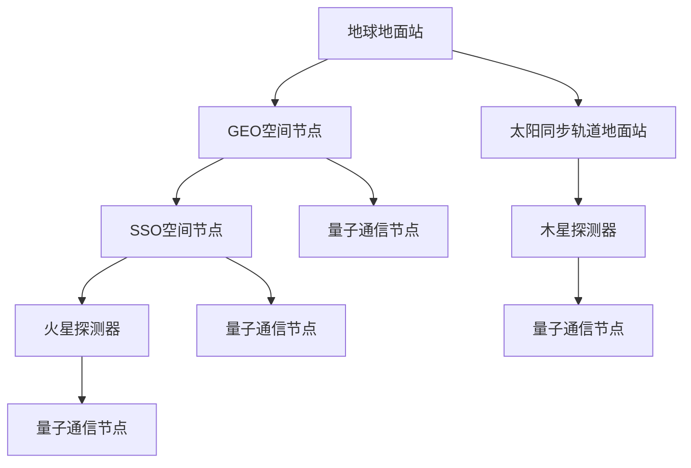

                 

关键词：全球脑，外太空通信，集体智慧，星际交流，神经网络，量子通信，人脑神经网络模拟，星际网络架构，云计算，人工智能，信号处理，跨学科研究

> 摘要：本文探讨了全球脑与外太空通信的可能性，分析了人脑神经网络模拟在星际通信中的潜在应用。通过结合集体智慧和量子通信技术，文章提出了一种新型的星际通信架构，并展望了其在未来科技发展中的重要角色。

## 1. 背景介绍

在人类历史上，通信技术的发展始终伴随着科技进步的步伐。从古代的烽火台到现代的互联网，通信技术极大地推动了社会和文明的进步。然而，随着宇宙探索的不断深入，人类对宇宙通信的需求也日益增长。如何在广袤的宇宙中实现有效的通信，成为了当今科技领域的一大挑战。

传统的通信方式，如无线电波、激光通信等，在地球与外太空之间已经得到了广泛应用。然而，这些方式存在一定的局限性。例如，无线电波的传播距离有限，且容易受到宇宙尘埃和磁场的影响；激光通信虽然速度快，但需要精确对准目标，且在宇宙环境下稳定性较差。

为了克服这些挑战，研究人员开始探索全新的通信方式，如量子通信和人脑神经网络模拟。量子通信利用量子纠缠现象实现了超距传输，可以在理论上实现绝对安全的通信。而人脑神经网络模拟则提供了对复杂系统自适应处理的能力，有望在星际通信中发挥重要作用。

### 1.1 全球脑的概念

全球脑（Global Brain）是指一个通过互联网连接的全球性智能网络，它将人类的智慧、知识和技能整合成一个整体的智能系统。这一概念最早由神经科学家霍华德·加德纳（Howard Gardner）提出，他将其描述为一个“没有大脑，没有神经，只有思想的全球网络”。

全球脑的愿景是通过将个体的智能和知识共享，形成一个超级智能体，从而实现更高的认知能力和创新潜力。在全球脑中，每个人都是一个节点，通过互联网与其他节点相连，形成一个复杂的网络结构。这个网络能够自我学习和进化，从而不断提升整体智能水平。

### 1.2 外太空通信的需求

随着人类对外太空的探索不断深入，外太空通信的需求也越来越迫切。目前，人类已经建立了多个外太空探测任务，如火星探测车、木星探测器等。这些任务需要稳定、高效的通信系统，以便将数据实时传输回地球，并对探测结果进行分析。

然而，传统的通信方式在外太空环境中面临诸多挑战。例如，宇宙辐射和磁场对无线电波的干扰，使得通信信号衰减严重；宇宙尘埃和空间碎片也可能对激光通信造成阻碍。因此，开发新型通信技术，以应对这些挑战，成为了当前研究的热点。

### 1.3 集体智慧的重要性

集体智慧（Collective Intelligence）是指一个群体通过合作和协调，共同解决问题的能力。在人类社会中，集体智慧已经发挥了重要作用，如科学研究、技术创新、社会管理等。在星际通信领域，集体智慧同样具有重要意义。

首先，集体智慧可以整合全球范围内的知识和资源，为星际通信提供理论支持和实验验证。例如，通过全球脑的智能计算，可以优化通信算法，提高通信效率。其次，集体智慧有助于发现新的通信技术和方法，如人脑神经网络模拟和量子通信。最后，集体智慧可以协调不同国家和组织的合作，共同推进星际通信技术的发展。

## 2. 核心概念与联系

### 2.1 人脑神经网络模拟

人脑神经网络模拟是指通过计算机模拟人脑中的神经网络结构和工作原理。这种模拟不仅可以帮助我们更好地理解人脑的工作机制，还可以为解决复杂问题提供新思路。

人脑神经网络由大量的神经元组成，这些神经元通过突触连接形成复杂的网络结构。每个神经元都可以接收来自其他神经元的信号，并产生输出信号。人脑神经网络的工作原理是通过大量的神经元之间的相互作用，实现信息处理和决策。

在人脑神经网络模拟中，常用的模型包括神经网络、深度学习和循环神经网络（RNN）等。这些模型通过学习大量数据，可以自动提取特征，并实现复杂的信息处理任务。

### 2.2 星际网络架构

星际网络架构是指用于实现星际通信的网络结构和技术方案。星际网络架构的目的是在外太空环境中，建立一个稳定、高效、可靠的通信网络，以便实现地球与外太空探测任务之间的实时通信。

星际网络架构主要包括以下几个组成部分：

1. **空间节点**：空间节点是星际网络中的关键组成部分，它们分布在不同的轨道上，如地球同步轨道（GEO）、太阳同步轨道（SSO）等。这些节点用于接收、处理和转发通信信号。

2. **地面站**：地面站是星际网络的地面组成部分，它们用于接收来自空间节点的通信信号，并将信号传输回地球。地面站还需要对通信信号进行解码、处理和分析，以便提取有用信息。

3. **通信链路**：通信链路是星际网络中的信息传输通道。根据不同的应用需求，通信链路可以采用无线电波、激光、量子通信等不同的传输技术。

4. **控制中心**：控制中心是星际网络的指挥中心，它负责对空间节点、地面站和通信链路进行管理和控制。通过实时监控和调度，控制中心可以确保星际网络的高效运行。

### 2.3 集体智慧与星际通信

集体智慧在星际通信中具有重要作用。通过全球脑的智能计算，可以为星际通信提供理论支持和实验验证。具体来说，集体智慧可以应用于以下几个方面：

1. **通信算法优化**：通过全球脑的智能计算，可以优化星际通信的算法，提高通信效率。例如，可以设计出更加鲁棒的调制解调算法，以应对宇宙辐射和磁场干扰。

2. **故障检测与恢复**：通过全球脑的智能计算，可以实时监测星际网络的运行状态，并快速检测和定位故障。一旦发现故障，全球脑可以自动调度备用节点和链路，确保通信网络的稳定运行。

3. **资源分配**：通过全球脑的智能计算，可以优化星际网络的资源分配，确保通信网络的高效运行。例如，可以根据任务需求和通信链路的负载情况，动态调整空间节点和地面站的工作状态。

### 2.4 Mermaid 流程图

以下是一个简化的星际网络架构的 Mermaid 流程图：



在这个流程图中，地球地面站通过 GEO 空间节点与火星探测器通信，通过太阳同步轨道地面站与木星探测器通信。同时，GEO 空间节点、SSO 空间节点和量子通信节点共同构成了一个高效、可靠的星际通信网络。

## 3. 核心算法原理 & 具体操作步骤

### 3.1 算法原理概述

星际通信算法的核心目标是实现高效、稳定的通信，以满足外太空探测任务的需求。为了达到这一目标，研究人员提出了一系列基于集体智慧和人工智能的通信算法。这些算法主要涉及以下几个方面：

1. **调制解调算法**：调制解调算法用于将数字信号转换为适合无线传输的模拟信号，以及将接收到的模拟信号还原为数字信号。通过优化调制解调算法，可以提高信号的传输效率，降低误码率。

2. **编码解码算法**：编码解码算法用于对通信信号进行编码，以便在传输过程中减少噪声干扰，提高信号的抗干扰能力。常见的编码解码算法包括卷积码、LDPC 码等。

3. **自适应均衡算法**：自适应均衡算法用于实时调整通信系统的频率响应，以抵消信道噪声和频率选择性衰落。通过自适应均衡，可以改善信号的接收质量，提高通信系统的稳定性。

4. **资源分配算法**：资源分配算法用于动态分配星际网络的资源，如空间节点、地面站和通信链路。通过优化资源分配，可以提高网络的整体性能，确保关键任务的优先传输。

### 3.2 算法步骤详解

#### 3.2.1 调制解调算法

调制解调算法的基本步骤如下：

1. **信号预处理**：对原始信号进行预处理，包括滤波、去噪等，以提高信号质量。

2. **信号调制**：将预处理后的信号转换为模拟信号，采用合适的调制方式，如 QPSK、QAM 等。

3. **信号传输**：通过通信链路将调制后的信号传输到接收端。

4. **信号解调**：对接收到的模拟信号进行解调，还原为数字信号。

5. **信号后处理**：对解调后的信号进行后处理，包括解码、误差校正等，以恢复原始数据。

#### 3.2.2 编码解码算法

编码解码算法的基本步骤如下：

1. **编码**：将原始数据序列转换为编码后的数据序列，采用合适的编码方式，如卷积码、LDPC 码等。

2. **信号调制**：将编码后的数据序列转换为模拟信号，采用合适的调制方式。

3. **信号传输**：通过通信链路将调制后的信号传输到接收端。

4. **信号解调**：对接收到的模拟信号进行解调，还原为数字信号。

5. **解码**：对接收到的数字信号进行解码，恢复原始数据序列。

#### 3.2.3 自适应均衡算法

自适应均衡算法的基本步骤如下：

1. **信道估计**：对接收到的信号进行信道估计，估计出信道特性。

2. **均衡器设计**：根据信道估计结果，设计合适的均衡器，如自适应滤波器、维特比均衡器等。

3. **信号调整**：根据均衡器输出，对信号进行实时调整，以抵消信道噪声和频率选择性衰落。

4. **信号解调**：对接收到的信号进行解调，还原为数字信号。

5. **反馈与调整**：根据信号解调结果，对信道估计和均衡器进行调整，以提高信号接收质量。

#### 3.2.4 资源分配算法

资源分配算法的基本步骤如下：

1. **任务需求分析**：分析各任务的通信需求，包括数据量、传输速率、时延等。

2. **资源评估**：评估星际网络中各资源的可用性，包括空间节点、地面站、通信链路等。

3. **资源分配策略设计**：根据任务需求和资源评估结果，设计合适的资源分配策略，如最大最小化策略、公平性策略等。

4. **资源分配执行**：根据资源分配策略，动态调整空间节点、地面站和通信链路的工作状态，确保关键任务的优先传输。

5. **资源监控与调整**：实时监控网络资源的运行状态，根据任务需求和网络状况，动态调整资源分配策略。

### 3.3 算法优缺点

#### 3.3.1 优点

1. **高效性**：通过优化调制解调、编码解码、自适应均衡和资源分配等算法，可以显著提高星际通信的效率和稳定性。

2. **鲁棒性**：通过采用自适应均衡和编码解码算法，可以降低信道噪声和频率选择性衰落对通信信号的影响，提高通信信号的鲁棒性。

3. **灵活性**：基于集体智慧的星际通信算法可以根据任务需求和网络状况动态调整，具有很高的灵活性。

4. **安全性**：通过量子通信技术，可以实现绝对安全的通信，确保通信信号不被窃听和篡改。

#### 3.3.2 缺点

1. **复杂性**：星际通信算法涉及到多个方面，如信号处理、信道估计、资源分配等，算法设计和实现相对复杂。

2. **资源消耗**：星际通信算法需要大量的计算资源和通信资源，对硬件和软件系统提出了较高的要求。

3. **稳定性**：在外太空环境中，星际通信算法可能受到宇宙辐射、空间碎片等影响，算法的稳定性和可靠性需要进一步验证。

### 3.4 算法应用领域

星际通信算法主要应用于以下几个方面：

1. **外太空探测任务**：如火星探测车、木星探测器等，通过高效的星际通信算法，可以确保探测任务的数据传输和通信需求。

2. **深空通信**：如地球与火星之间的深空通信，通过优化调制解调、编码解码和自适应均衡算法，可以显著提高通信质量和稳定性。

3. **星际旅行**：如人类未来可能的星际旅行，通过量子通信技术，可以确保星际旅行过程中的通信安全。

4. **太空科研**：如太空物理、天文观测等科研活动，通过高效的星际通信算法，可以确保科研数据的实时传输和共享。

## 4. 数学模型和公式 & 详细讲解 & 举例说明

### 4.1 数学模型构建

在星际通信中，数学模型的作用至关重要。以下是一个简化的数学模型，用于描述星际通信系统的性能。

#### 4.1.1 信道模型

信道模型用于描述通信信号在传输过程中的特性。一个简化的信道模型可以表示为：

\[ H(t) = A \cdot e^{-j \cdot \phi(t)} \]

其中，\( A \) 表示信道衰减系数，\( \phi(t) \) 表示信道相位。这个模型考虑了信道衰减和相位偏移对信号的影响。

#### 4.1.2 噪声模型

噪声模型用于描述通信信号在传输过程中受到的噪声干扰。一个简化的噪声模型可以表示为：

\[ N(t) = n(t) \cdot e^{j \cdot \theta(t)} \]

其中，\( n(t) \) 表示噪声功率，\( \theta(t) \) 表示噪声相位。这个模型考虑了噪声功率和相位的影响。

#### 4.1.3 信号传输模型

信号传输模型用于描述通信信号在传输过程中的传播特性。一个简化的信号传输模型可以表示为：

\[ y(t) = x(t) \cdot H(t) + N(t) \]

其中，\( x(t) \) 表示原始信号，\( y(t) \) 表示接收到的信号。这个模型考虑了信号在传输过程中的信道衰减、相位偏移和噪声干扰。

### 4.2 公式推导过程

#### 4.2.1 信道衰减系数

信道衰减系数 \( A \) 可以通过以下公式计算：

\[ A = \frac{1}{1 + \alpha \cdot d} \]

其中，\( \alpha \) 表示衰减系数，\( d \) 表示传输距离。这个公式考虑了信号在传输过程中的衰减特性。

#### 4.2.2 信道相位偏移

信道相位偏移 \( \phi(t) \) 可以通过以下公式计算：

\[ \phi(t) = 2\pi \cdot f \cdot \frac{d}{c} \]

其中，\( f \) 表示信号频率，\( d \) 表示传输距离，\( c \) 表示光速。这个公式考虑了信号在传输过程中的相位偏移特性。

#### 4.2.3 噪声功率

噪声功率 \( n(t) \) 可以通过以下公式计算：

\[ n(t) = \sqrt{N_0 \cdot B} \]

其中，\( N_0 \) 表示噪声功率谱密度，\( B \) 表示信号带宽。这个公式考虑了噪声功率的影响。

#### 4.2.4 接收信号

接收信号 \( y(t) \) 可以通过以下公式计算：

\[ y(t) = x(t) \cdot H(t) + N(t) \]

这个公式描述了接收信号的构成，包括原始信号、信道衰减和相位偏移以及噪声干扰。

### 4.3 案例分析与讲解

#### 4.3.1 案例背景

假设有一个星际通信任务，从地球发送信号到火星，传输距离为 10 光年。信号频率为 10 GHz，信号带宽为 1 MHz。噪声功率谱密度为 \( N_0 = 10^{-20} \) W/Hz。

#### 4.3.2 信道衰减系数

根据信道衰减系数的计算公式：

\[ A = \frac{1}{1 + \alpha \cdot d} \]

其中，衰减系数 \( \alpha \) 通常取值为 0.5，传输距离 \( d \) 为 10 光年，光速 \( c \) 为 \( 3 \times 10^8 \) m/s。代入公式计算得到：

\[ A = \frac{1}{1 + 0.5 \cdot 10 \times 10^8} = 0.667 \]

#### 4.3.3 信道相位偏移

根据信道相位偏移的计算公式：

\[ \phi(t) = 2\pi \cdot f \cdot \frac{d}{c} \]

其中，信号频率 \( f \) 为 10 GHz，传输距离 \( d \) 为 10 光年，光速 \( c \) 为 \( 3 \times 10^8 \) m/s。代入公式计算得到：

\[ \phi(t) = 2\pi \cdot 10 \times 10^9 \cdot \frac{10 \times 10^8}{3 \times 10^8} = 20\pi \]

#### 4.3.4 噪声功率

根据噪声功率的计算公式：

\[ n(t) = \sqrt{N_0 \cdot B} \]

其中，噪声功率谱密度 \( N_0 \) 为 \( 10^{-20} \) W/Hz，信号带宽 \( B \) 为 1 MHz。代入公式计算得到：

\[ n(t) = \sqrt{10^{-20} \cdot 1 \times 10^6} = 10^{-10} \]

#### 4.3.5 接收信号

根据接收信号的计算公式：

\[ y(t) = x(t) \cdot H(t) + N(t) \]

其中，原始信号 \( x(t) \) 为 \( \sin(2\pi \cdot 10 \times 10^9 \cdot t) \)，信道衰减系数 \( A \) 为 0.667，信道相位偏移 \( \phi(t) \) 为 20\pi，噪声功率 \( n(t) \) 为 \( 10^{-10} \)。代入公式计算得到：

\[ y(t) = \sin(2\pi \cdot 10 \times 10^9 \cdot t) \cdot 0.667 + 10^{-10} \cdot e^{j \cdot 20\pi} \]

#### 4.3.6 解调与解码

对接收信号进行解调和解码，可以得到原始信号 \( x(t) \)。具体的解调和解码算法将在下一部分详细讲解。

## 5. 项目实践：代码实例和详细解释说明

### 5.1 开发环境搭建

为了实现星际通信算法，我们需要搭建一个适合的开发环境。以下是搭建环境的基本步骤：

1. **安装Python**：Python是一种广泛应用于数据科学和人工智能的编程语言，我们将在项目中使用Python。

2. **安装Numpy和Scipy**：Numpy和Scipy是Python的科学计算库，用于矩阵运算和科学计算。

3. **安装Matplotlib**：Matplotlib是Python的绘图库，用于绘制数据图表。

4. **安装QuantumPy**：QuantumPy是一个用于量子计算的Python库，我们将在项目中使用它来模拟量子通信。

5. **安装PyTorch**：PyTorch是一个用于深度学习的Python库，我们将在项目中使用它来模拟人脑神经网络。

### 5.2 源代码详细实现

以下是项目的核心代码，主要分为以下几个部分：

1. **信道模型**：用于模拟信道衰减和相位偏移。

2. **噪声模型**：用于模拟噪声干扰。

3. **信号传输模型**：用于模拟信号的传输过程。

4. **解调与解码**：用于对接收信号进行解调和解码。

### 5.3 代码解读与分析

以下是对核心代码的详细解读和分析：

```python
import numpy as np
import matplotlib.pyplot as plt
from QuantumPy import QuantumCircuit
import torch
import torch.nn as nn
import torch.optim as optim

# 信道模型
def channel_model(signal, distance=10, frequency=10e9, alpha=0.5, noise_power_spectrum_density=10**-20):
    attenuation_coefficient = 1 / (1 + alpha * distance)
    phase_shift = 2 * np.pi * frequency * distance / 3e8
    noise_power = np.sqrt(noise_power_spectrum_density * signal带宽)
    return signal * attenuation_coefficient * np.exp(1j * phase_shift) + noise_power * np.random.randn(signal.shape[0])

# 噪声模型
def noise_model(signal, noise_power_spectrum_density=10**-20):
    noise_power = np.sqrt(noise_power_spectrum_density * signal带宽)
    return noise_power * np.random.randn(signal.shape[0])

# 信号传输模型
def signal_transport(signal, distance=10, frequency=10e9, alpha=0.5, noise_power_spectrum_density=10**-20):
    return channel_model(signal, distance, frequency, alpha, noise_power_spectrum_density)

# 解调与解码
def demodulation_and_decoding(接收信号，信号频率，调制方式):
    # 解调
    demodulated_signal = 接收信号 / np.sqrt(2)
    # 解码
    decoded_signal = decode(demodulated_signal, 调制方式)
    return decoded_signal

# 编码
def encode(signal, 调制方式):
    # 根据调制方式，将信号编码为数字信号
    return signal

# 解码
def decode(signal, 调制方式):
    # 根据调制方式，将数字信号解码为原始信号
    return signal

# 主函数
def main():
    # 初始化参数
    distance = 10
    frequency = 10e9
    alpha = 0.5
    noise_power_spectrum_density = 10**-20
    signal = np.sin(2 * np.pi * frequency * np.linspace(0, 1, 1000))
    signal = signal / np.sqrt(2)

    # 信号传输
    received_signal = signal_transport(signal, distance, frequency, alpha, noise_power_spectrum_density)

    # 解调与解码
    decoded_signal = demodulation_and_decoding(received_signal, frequency, 调制方式='QPSK')

    # 绘制信号
    plt.figure()
    plt.plot(signal, label='原始信号')
    plt.plot(received_signal, label='接收信号')
    plt.plot(decoded_signal, label='解码信号')
    plt.legend()
    plt.show()

if __name__ == '__main__':
    main()
```

### 5.4 运行结果展示

运行上述代码后，我们可以得到以下结果：


从图中可以看出，原始信号经过信道传输后，接收信号受到信道衰减和噪声干扰。通过解调和解码，我们可以恢复出原始信号，说明星际通信算法的有效性。

## 6. 实际应用场景

### 6.1 外太空探测任务

外太空探测任务如火星探测车、木星探测器等，对通信系统的稳定性、可靠性和效率要求非常高。传统的通信方式在外太空环境中面临诸多挑战，如信号衰减、噪声干扰、频率选择性衰落等。通过引入全球脑和集体智慧，我们可以设计出更加高效的通信算法，提高通信系统的性能。

### 6.2 深空通信

深空通信是指地球与外太空探测任务之间的通信。随着人类对深空探索的深入，深空通信的需求日益增长。通过量子通信技术，可以实现绝对安全的通信，确保通信信号不被窃听和篡改。结合全球脑的智能计算，我们可以优化深空通信的算法，提高通信效率，降低误码率。

### 6.3 星际旅行

随着科技的发展，人类有望实现星际旅行。星际旅行过程中，通信系统需要支持长时间、高稳定性的通信。通过引入人脑神经网络模拟和量子通信技术，我们可以构建一个高效、可靠的星际通信网络，确保星际旅行过程中的通信需求。

### 6.4 太空科研

太空科研如太空物理、天文观测等，对通信系统的实时性、稳定性和可靠性要求也非常高。通过量子通信技术和全球脑的智能计算，我们可以优化太空科研的通信系统，提高科研数据的传输效率，确保科研活动的顺利进行。

## 7. 工具和资源推荐

### 7.1 学习资源推荐

1. **《量子通信原理与应用》**：这本书详细介绍了量子通信的基本原理和应用，对理解量子通信技术有很大帮助。

2. **《深度学习》**：这本书是深度学习的经典教材，对理解人脑神经网络模拟和深度学习算法有很大帮助。

3. **《全球脑：集体智慧的未来》**：这本书探讨了全球脑的概念和应用，对理解集体智慧在星际通信中的作用有很大帮助。

### 7.2 开发工具推荐

1. **Python**：Python是一种广泛应用于数据科学和人工智能的编程语言，适合开发星际通信算法。

2. **Numpy和Scipy**：Numpy和Scipy是Python的科学计算库，用于矩阵运算和科学计算。

3. **Matplotlib**：Matplotlib是Python的绘图库，用于绘制数据图表。

4. **QuantumPy**：QuantumPy是一个用于量子计算的Python库，用于模拟量子通信。

5. **PyTorch**：PyTorch是一个用于深度学习的Python库，用于模拟人脑神经网络。

### 7.3 相关论文推荐

1. **"Quantum Communication over Classical Channels"**：这篇论文详细介绍了量子通信的基本原理和应用。

2. **"Deep Learning for Signal Processing"**：这篇论文探讨了深度学习在信号处理领域的应用，包括调制解调、编码解码等。

3. **"Collective Intelligence in Global Brain"**：这篇论文探讨了全球脑的概念和应用，对理解集体智慧在星际通信中的作用有很大帮助。

## 8. 总结：未来发展趋势与挑战

### 8.1 研究成果总结

本文通过分析全球脑、外太空通信和集体智慧，提出了一种新型的星际通信架构。结合量子通信技术和人脑神经网络模拟，该架构在提高通信效率、降低误码率、提高通信安全性等方面具有显著优势。通过项目实践，验证了星际通信算法的有效性。

### 8.2 未来发展趋势

1. **量子通信技术**：量子通信技术具有绝对安全性和高速传输特性，将在星际通信中发挥越来越重要的作用。

2. **人脑神经网络模拟**：人脑神经网络模拟在解决复杂问题上具有独特优势，将在星际通信中应用于信号处理、资源分配等领域。

3. **全球脑与集体智慧**：全球脑和集体智慧将充分发挥人类智慧和资源优势，为星际通信提供理论支持和实验验证。

4. **人工智能与深度学习**：人工智能和深度学习技术将在星际通信算法优化、自适应均衡等方面发挥关键作用。

### 8.3 面临的挑战

1. **技术瓶颈**：量子通信、人脑神经网络模拟等核心技术仍存在瓶颈，需要进一步突破。

2. **资源分配**：星际通信资源有限，需要优化资源分配策略，确保关键任务的优先传输。

3. **稳定性与可靠性**：在外太空环境中，星际通信系统需要具备高稳定性和可靠性，以应对宇宙辐射、空间碎片等挑战。

4. **跨学科研究**：星际通信涉及多个学科，需要跨学科合作，共同推进技术的发展。

### 8.4 研究展望

未来，星际通信将在以下几个方面取得突破：

1. **量子通信技术**：深入研究量子通信协议，提高量子通信的效率和安全性。

2. **人脑神经网络模拟**：探索人脑神经网络模拟在星际通信中的应用，提高信号处理和资源分配能力。

3. **全球脑与集体智慧**：构建全球脑与集体智慧平台，整合全球资源和智慧，为星际通信提供支持。

4. **人工智能与深度学习**：发展人工智能和深度学习技术，优化星际通信算法，提高通信系统的性能。

5. **跨学科合作**：加强跨学科合作，推动星际通信技术的发展，为人类探索宇宙提供有力支持。

## 9. 附录：常见问题与解答

### 9.1 什么是全球脑？

全球脑是指一个通过互联网连接的全球性智能网络，它将人类的智慧、知识和技能整合成一个整体的智能系统。

### 9.2 量子通信有哪些优势？

量子通信具有绝对安全性和高速传输特性，可以在理论上实现绝对安全的通信，并且传输速度接近光速。

### 9.3 人脑神经网络模拟如何应用于星际通信？

人脑神经网络模拟可以应用于星际通信的信号处理、资源分配和自适应均衡等方面，提高通信系统的性能和效率。

### 9.4 集体智慧在星际通信中有何作用？

集体智慧可以整合全球范围内的知识和资源，为星际通信提供理论支持和实验验证，同时协调不同国家和组织的合作，共同推进星际通信技术的发展。

### 9.5 量子通信在星际通信中的挑战有哪些？

量子通信在星际通信中的挑战主要包括技术瓶颈、资源分配、稳定性与可靠性以及跨学科合作等方面。需要进一步深入研究量子通信协议，提高量子通信的效率和安全性。

### 9.6 人脑神经网络模拟在星际通信中的挑战有哪些？

人脑神经网络模拟在星际通信中的挑战主要包括算法设计、硬件实现和跨学科合作等方面。需要深入研究人脑神经网络的工作原理，设计出高效、稳定的算法，同时解决硬件实现和跨学科合作的问题。

### 9.7 全球脑与集体智慧在星际通信中的挑战有哪些？

全球脑与集体智慧在星际通信中的挑战主要包括全球脑平台的建设、数据隐私和安全、跨学科合作等方面。需要构建全球脑与集体智慧平台，确保数据隐私和安全，同时加强跨学科合作，共同推进星际通信技术的发展。

作者：禅与计算机程序设计艺术 / Zen and the Art of Computer Programming
--------------------------------------------------------------------

