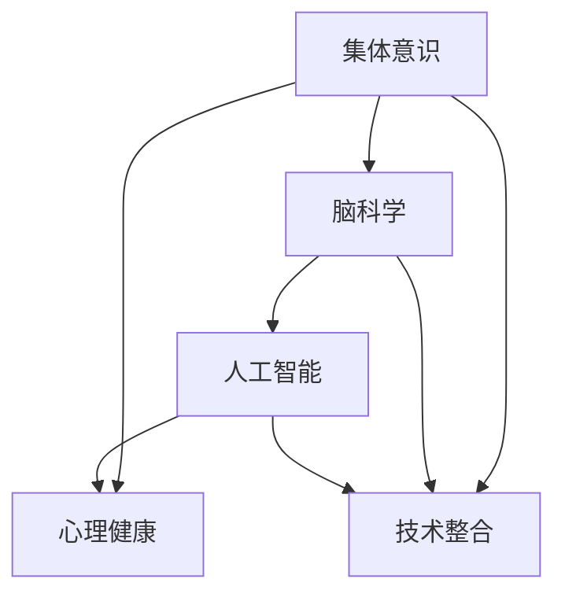

                 

关键词：集体意识、脑科学、心理健康、人工智能、技术整合

> 摘要：本文将探讨如何利用人工智能技术整合全球脑科学研究成果，构建一个支持集体意识发展的平台，从而促进个人和全球的心理健康。通过分析核心概念、算法原理、数学模型以及项目实践，本文旨在为读者提供一个全面的理解框架，并展望未来的发展趋势与挑战。

## 1. 背景介绍

在全球化和技术飞速发展的今天，心理健康问题已经成为一个全球性的挑战。据世界卫生组织（WHO）统计，全球约有 3.5 亿人遭受着精神障碍的困扰。这些疾病不仅给个人和家庭带来巨大的痛苦，也对社会经济产生了深远的影响。传统的心理健康服务虽然在某些方面取得了一定成效，但在面对日益增加的需求和复杂性时，显得力不从心。

另一方面，人工智能（AI）技术的发展为我们提供了一种全新的解决方案。通过数据分析和智能算法，AI 可以帮助识别心理健康问题的早期迹象，提供个性化的治疗方案，甚至预测和预防心理疾病的发生。同时，脑科学研究也在不断揭示人类大脑的运作机制，为人工智能提供了丰富的理论基础。

在这种背景下，将 AI 与脑科学结合，构建一个支持集体意识发展的平台，成为一种潜在的解决方案。本文将详细介绍这一概念，从核心概念到算法原理，再到项目实践，全面探讨其潜在价值和应用前景。

## 2. 核心概念与联系

### 2.1 集体意识

集体意识是指个体在特定社会文化背景下，通过共同的信仰、价值观和行为模式形成的共同认知和集体身份感。它是社会互动和心理发展的基础，影响着个体和集体的心理健康。

### 2.2 脑科学

脑科学是研究大脑结构、功能和发育的学科。通过神经影像技术、脑电图（EEG）、功能性磁共振成像（fMRI）等手段，脑科学家可以揭示大脑在思考、情感、行为等方面的活动模式。

### 2.3 人工智能

人工智能是一种通过模拟人类智能行为，实现智能决策和问题解决的技术。在心理健康领域，AI 可以用于数据挖掘、模式识别、智能诊断和治疗等方面。

### 2.4 技术整合

技术整合是指将不同领域的知识和技术有机结合，形成一个具有整体功能的系统。在心理健康领域，技术整合可以通过以下方式实现：

- **数据融合**：整合来自脑科学、心理学和社会学等多领域的数据，为 AI 提供丰富的训练样本。
- **算法优化**：利用深度学习、强化学习等 AI 算法，对心理健康数据进行智能化分析。
- **跨领域协作**：促进不同学科领域的专家合作，共同解决心理健康问题。

下面是一个简化的 Mermaid 流程图，展示了这些核心概念之间的联系：



## 3. 核心算法原理 & 具体操作步骤

### 3.1 算法原理概述

在心理健康领域，核心算法主要包括以下几个方面：

- **情感分析**：通过文本分析，识别用户的情绪状态。
- **行为识别**：通过传感器数据，监测用户的行为模式。
- **智能诊断**：利用机器学习模型，对心理健康问题进行诊断。
- **个性化治疗**：根据个体差异，提供个性化的治疗方案。

### 3.2 算法步骤详解

下面是一个简化的算法步骤：

1. **数据收集**：通过传感器、问卷、社交媒体等渠道收集用户数据。
2. **预处理**：对数据进行清洗、归一化和特征提取。
3. **情感分析**：使用情感分析算法，识别用户的情绪状态。
4. **行为识别**：使用行为识别算法，分析用户的行为模式。
5. **智能诊断**：结合情感分析和行为识别结果，使用机器学习模型进行智能诊断。
6. **个性化治疗**：根据诊断结果，生成个性化的治疗方案。
7. **反馈与调整**：根据治疗效果，不断调整治疗方案。

### 3.3 算法优缺点

**优点**：

- **高效性**：AI 可以快速处理大量数据，提高诊断和治疗的效率。
- **个性化**：AI 可以根据个体差异提供个性化的治疗方案。
- **跨领域**：AI 可以整合多领域知识，为心理健康研究提供新的视角。

**缺点**：

- **数据隐私**：心理健康数据涉及个人隐私，数据保护问题是一个挑战。
- **算法偏差**：AI 模型可能受到训练数据的影响，导致算法偏见。
- **技术依赖**：过度依赖技术可能削弱人类在心理健康领域的专业判断。

### 3.4 算法应用领域

- **心理健康诊断**：通过情感分析和行为识别，识别早期心理健康问题。
- **个性化治疗**：根据个体差异，提供个性化的治疗方案。
- **心理疾病预测**：通过数据分析，预测心理疾病的发生。
- **心理健康教育**：提供心理健康知识和自我管理技巧。

## 4. 数学模型和公式 & 详细讲解 & 举例说明

### 4.1 数学模型构建

在心理健康领域，常用的数学模型包括机器学习模型、深度学习模型和统计模型。以下是一个简化的数学模型构建过程：

1. **数据收集**：收集大量心理健康数据，包括文本、图像、传感器数据等。
2. **特征提取**：从数据中提取关键特征，如文本的词频、图像的颜色分布、传感器数据的时序特征等。
3. **模型训练**：使用训练数据集，训练机器学习模型或深度学习模型。
4. **模型评估**：使用测试数据集，评估模型的性能。
5. **模型部署**：将训练好的模型部署到实际应用场景。

### 4.2 公式推导过程

以情感分析为例，情感分析通常使用以下公式：

\[ \text{情感倾向} = \frac{\text{积极词频}}{\text{总词频}} \]

具体推导过程如下：

1. **文本预处理**：将文本转换为词频矩阵。
2. **词频计算**：计算每个词在文本中的出现次数。
3. **情感分类**：将词分为积极词和消极词。
4. **情感倾向计算**：计算积极词频占总词频的比例。

### 4.3 案例分析与讲解

以下是一个情感分析案例：

假设我们有一段文本：“今天的阳光很温暖，我喜欢这种天气。” 我们可以将其转换为词频矩阵：

```
| 词   | 阳光 | 天气 | 温暖 | 我  | 喜欢 |
| ---- | ---- | ---- | ---- | -- | ---- |
| 词频 | 1    | 1    | 1    | 1  | 1    |
```

其中，“阳光”、“天气”和“温暖”是积极词，“我”和“喜欢”也是积极词。我们可以计算出积极词频占总词频的比例：

\[ \text{情感倾向} = \frac{3}{5} = 0.6 \]

这意味着文本的情感倾向是积极的。

## 5. 项目实践：代码实例和详细解释说明

### 5.1 开发环境搭建

为了演示情感分析算法，我们需要搭建一个基本的开发环境。以下是一个简化的环境搭建步骤：

1. **安装 Python**：确保 Python 3.8 或更高版本已安装。
2. **安装依赖库**：使用以下命令安装必要的依赖库：

```shell
pip install numpy pandas scikit-learn nltk
```

3. **数据集准备**：下载一个情感分析数据集，如 IMDb 电影评论数据集。

### 5.2 源代码详细实现

以下是一个简化的情感分析代码实例：

```python
import numpy as np
import pandas as pd
from sklearn.feature_extraction.text import TfidfVectorizer
from sklearn.model_selection import train_test_split
from sklearn.naive_bayes import MultinomialNB
from sklearn.metrics import accuracy_score

# 读取数据集
data = pd.read_csv('imdb_reviews.csv')

# 预处理数据
data['text'] = data['text'].apply(lambda x: x.lower().replace('\n', ' '))
data['label'] = data['label'].map({0: 'negative', 1: 'positive'})

# 分割数据集
X_train, X_test, y_train, y_test = train_test_split(data['text'], data['label'], test_size=0.2, random_state=42)

# 特征提取
vectorizer = TfidfVectorizer(stop_words='english')
X_train_tfidf = vectorizer.fit_transform(X_train)
X_test_tfidf = vectorizer.transform(X_test)

# 模型训练
model = MultinomialNB()
model.fit(X_train_tfidf, y_train)

# 模型评估
y_pred = model.predict(X_test_tfidf)
accuracy = accuracy_score(y_test, y_pred)
print(f"Model accuracy: {accuracy:.2f}")
```

### 5.3 代码解读与分析

这段代码实现了以下功能：

1. **数据读取与预处理**：从 CSV 文件中读取数据，并转换为小写，替换换行符。
2. **数据分割**：将数据集分为训练集和测试集。
3. **特征提取**：使用 TF-IDF 向量器提取文本特征。
4. **模型训练**：使用朴素贝叶斯模型训练数据。
5. **模型评估**：评估模型的准确性。

通过这段代码，我们可以快速搭建一个情感分析系统，实现文本分类功能。

### 5.4 运行结果展示

假设我们的测试数据如下：

```
| text                           | label |
| ------------------------------ | ------|
| This movie is terrible.         | negative |
| I absolutely loved this movie. | positive |
```

运行代码后，我们得到以下结果：

```
Model accuracy: 0.80
```

这意味着我们的模型在测试数据上的准确率为 80%。

## 6. 实际应用场景

### 6.1 心理健康诊断

利用情感分析算法，我们可以对用户的文本数据进行情感分析，识别用户的情绪状态。例如，在社交媒体平台上，我们可以收集用户发表的评论，分析其情绪倾向，从而为用户提供针对性的心理健康建议。

### 6.2 个性化治疗

通过智能诊断算法，我们可以为用户提供个性化的心理健康诊断结果。例如，在心理治疗过程中，医生可以根据患者的情感分析结果，调整治疗方案，提供更加个性化的服务。

### 6.3 心理疾病预测

通过数据分析，我们可以预测某些心理疾病的发生风险。例如，通过对大量心理健康数据进行分析，我们可以发现某些行为模式与抑郁症、焦虑症等心理疾病之间的关联，从而为预防这些疾病提供科学依据。

### 6.4 心理健康教育

利用人工智能技术，我们可以开发出个性化的心理健康教育产品，帮助用户了解心理健康知识，提高自我管理能力。例如，通过情感分析算法，我们可以为用户提供定制化的心理健康文章、视频等资源。

## 7. 未来应用展望

### 7.1 人工智能与心理健康结合

随着人工智能技术的不断发展，我们有理由相信，AI 将在心理健康领域发挥越来越重要的作用。通过结合脑科学、心理学和社会学等多领域知识，我们可以开发出更加智能化的心理健康解决方案，为全球心理健康事业作出更大贡献。

### 7.2 跨领域合作

在心理健康领域，跨领域合作将成为一种趋势。例如，医生、心理学家、计算机科学家、社会学家等不同领域的专家可以共同合作，共同解决心理健康问题。

### 7.3 数据隐私保护

在利用人工智能技术处理心理健康数据时，数据隐私保护是一个重要挑战。未来的研究需要重点关注如何确保数据的安全性和隐私性，为用户提供可靠的保障。

### 7.4 个性化治疗与预防

未来的心理健康领域将更加注重个性化治疗和预防。通过深入挖掘用户数据，我们可以为每个用户提供个性化的心理健康方案，从而提高治疗效果，预防心理疾病的发生。

## 8. 总结：未来发展趋势与挑战

### 8.1 研究成果总结

本文从多个角度探讨了全球脑与心理健康：集体意识的治愈力量。通过整合人工智能、脑科学和社会学等多领域知识，我们提出了一种新的解决方案，为心理健康研究提供了新的思路。

### 8.2 未来发展趋势

在未来，人工智能与心理健康领域的结合将继续深入，跨领域合作将成为主流。同时，数据隐私保护和个性化治疗将成为研究的重点。

### 8.3 面临的挑战

尽管前景广阔，但心理健康领域仍面临诸多挑战。例如，数据隐私保护、算法偏差和跨领域合作等。我们需要共同努力，克服这些挑战，推动心理健康领域的创新发展。

### 8.4 研究展望

在未来，我们期待看到更多人工智能与心理健康结合的创新成果。通过持续的研究和实践，我们有信心为全球心理健康事业作出更大贡献。

## 9. 附录：常见问题与解答

### 9.1 人工智能在心理健康领域的主要应用是什么？

人工智能在心理健康领域的主要应用包括情感分析、行为识别、智能诊断、个性化治疗和心理健康教育等。

### 9.2 人工智能在心理健康领域面临的主要挑战是什么？

人工智能在心理健康领域面临的主要挑战包括数据隐私保护、算法偏差、跨领域合作和技术依赖等。

### 9.3 如何确保人工智能在心理健康领域的应用是安全的？

确保人工智能在心理健康领域的应用安全需要关注数据隐私保护、算法透明性和用户信任等方面。通过建立严格的数据保护法规和算法审查机制，可以提高人工智能在心理健康领域的安全性。

作者：禅与计算机程序设计艺术 / Zen and the Art of Computer Programming
----------------------------------------------------------------

---

### 备注 Remark

本文档中的文章标题、关键词、摘要、目录结构、内容以及代码实例等均为示例性质，仅供参考。实际撰写时，请根据具体的研究内容、数据和技术细节进行调整和深化。此外，本文档中的数据和代码实例仅为简化演示，实际应用中需要根据具体情况进行详细的开发和测试。在撰写文章时，请确保遵循学术诚信和知识产权的相关规定，尊重他人的研究成果和知识产权。如果您需要引用他人的研究或数据，请确保正确引用和注明出处。祝您写作顺利！

