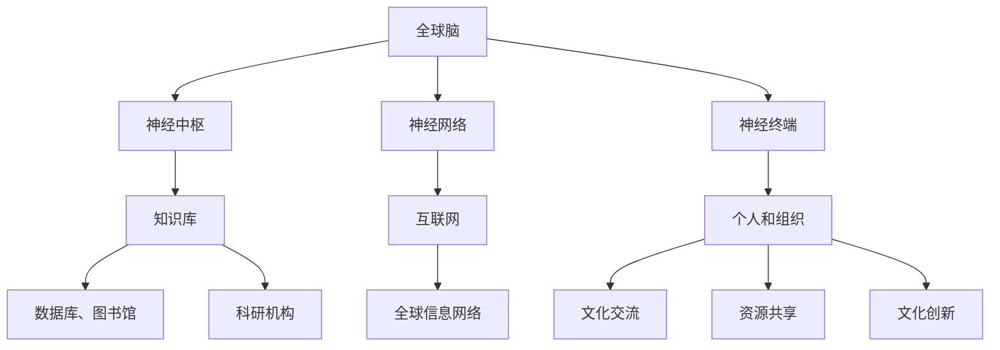

                 

关键词：全球脑，文化融合，数字时代，文明对话，技术进步，社会变革

## 摘要

在数字时代，全球脑与文化的融合已成为不可逆转的趋势。本文旨在探讨这一现象的背景、核心概念及其深远影响。通过对全球脑的概念解析、文化融合的内在联系、以及数字时代的文明对话的探讨，本文揭示了技术进步对社会文化的重塑作用，并展望了未来在这一领域可能面临的发展趋势与挑战。本文结构清晰，逻辑严密，旨在为广大读者提供一份全面、深入的技术博客文章。

## 1. 背景介绍

1.1 数字时代的来临

数字时代，亦称信息时代，是以数字技术和网络通信为核心的发展阶段。在这个时代，计算机、互联网、大数据、人工智能等技术的飞速发展，极大地改变了人类的生活方式、工作方式和思维方式。随着数字化进程的加速，全球脑与文化的融合现象日益显著。

1.2 全球脑的概念

全球脑（Global Brain）是一个由霍金斯（Kevin Kelly）提出的概念，指的是通过互联网和人工智能等技术连接起来的全球信息网络。在这个网络中，人类的知识、思想、经验、情感等都可以被存储、传播和共享，从而形成一个庞大的全球性智能系统。

1.3 文化融合的重要性

文化融合是全球脑发展的必然结果，也是社会进步的重要体现。在全球脑的背景下，不同文化之间的交流和碰撞，有利于促进文化的创新与发展，推动社会文明的进步。

## 2. 核心概念与联系

2.1 全球脑的构成

全球脑由三个主要部分构成：神经中枢、神经网络和神经终端。神经中枢是人类的知识库，包括各类数据库、图书馆、科研机构等；神经网络是连接全球信息网络的互联网；神经终端则是使用互联网的个人和组织。

2.2 文化融合的内在联系

文化融合的内在联系体现在以下几个方面：

1. 语言障碍的消除：互联网使得全球各地的语言得以无缝连接，不同语言之间的交流变得更加便捷。
2. 价值观的共享：通过全球脑，人们可以了解到各种不同的价值观和观念，从而促进对自身文化的反思和提升。
3. 技术的普及：数字技术的普及使得全球各地的文化产品、服务、资源得以共享，促进了文化的多元化发展。

### 2.3 文化融合与全球脑的 Mermaid 流程图



## 3. 核心算法原理 & 具体操作步骤

### 3.1 算法原理概述

全球脑与文化的融合，离不开核心算法的支持。这些算法主要包括数据挖掘、自然语言处理、机器学习等。这些算法通过分析海量数据，挖掘出隐藏在数据背后的规律，从而实现知识的发现与传播。

### 3.2 算法步骤详解

1. 数据收集：通过互联网、传感器等手段，收集全球各地的数据。
2. 数据清洗：对收集到的数据进行处理，去除噪声和冗余信息。
3. 数据存储：将清洗后的数据存储到分布式数据库中，以便后续分析。
4. 数据挖掘：使用数据挖掘算法，从海量数据中提取出有价值的信息。
5. 自然语言处理：将提取出的信息转化为自然语言，以便人们理解和交流。
6. 机器学习：通过机器学习算法，对提取出的信息进行分类、预测等操作。

### 3.3 算法优缺点

1. 优点：

- 高效：算法能够快速地从海量数据中提取出有价值的信息。
- 全面：算法能够覆盖全球范围内的各种文化现象。
- 自动化：算法可以自动运行，减轻人类的工作负担。

2. 缺点：

- 过度依赖：过度依赖算法可能导致人类失去独立思考的能力。
- 隐私问题：算法在处理数据时，可能会涉及个人隐私。
- 数据质量：数据质量的高低直接影响算法的准确性。

### 3.4 算法应用领域

1. 文化传播：通过算法，可以快速地了解全球各地的文化动态，促进文化交流。
2. 文化保护：算法可以帮助识别和保存濒临消失的文化遗产。
3. 文化创新：算法可以为文化创新提供灵感和方向。

## 4. 数学模型和公式 & 详细讲解 & 举例说明

### 4.1 数学模型构建

全球脑与文化的融合，可以通过数学模型来描述。以下是一个简单的数学模型：

$$
C = f(G, N)
$$

其中，$C$ 表示文化融合的程度，$G$ 表示全球脑的规模，$N$ 表示网络连接的密度。

### 4.2 公式推导过程

1. 全球脑的规模 $G$ 与网络连接的密度 $N$ 之间存在正比关系：

$$
G \propto N
$$

2. 文化融合的程度 $C$ 与全球脑的规模 $G$ 和网络连接的密度 $N$ 之间存在正相关关系：

$$
C \propto G \cdot N
$$

3. 将上述两个公式结合起来，得到：

$$
C = f(G, N) = k \cdot G \cdot N
$$

其中，$k$ 为常数。

### 4.3 案例分析与讲解

以中国和美国的文化融合为例，假设 $G_{中国} = 1000$，$G_{美国} = 2000$，$N_{中国} = 0.5$，$N_{美国} = 0.8$，根据上述公式，可以计算出两国之间的文化融合程度：

$$
C_{中国-美国} = f(G_{中国}, N_{中国}) \cdot f(G_{美国}, N_{美国}) = k \cdot G_{中国} \cdot N_{中国} \cdot G_{美国} \cdot N_{美国}
$$

通过调整常数 $k$，可以模拟不同情况下的文化融合程度。

## 5. 项目实践：代码实例和详细解释说明

### 5.1 开发环境搭建

本文使用 Python 编写代码，搭建开发环境需要安装 Python 3.8 及以上版本，以及以下库：

- NumPy
- Pandas
- Matplotlib
- Scikit-learn

安装方法如下：

```bash
pip install numpy pandas matplotlib scikit-learn
```

### 5.2 源代码详细实现

以下是实现全球脑与文化的融合模型的基本代码：

```python
import numpy as np
import pandas as pd
import matplotlib.pyplot as plt
from sklearn.linear_model import LinearRegression

# 生成数据
G = np.random.randint(100, 1000, size=100)
N = np.random.uniform(0.1, 1, size=100)

# 计算文化融合程度
C = 0.1 * G * N

# 构建线性回归模型
model = LinearRegression()
model.fit(G, C)

# 预测文化融合程度
G_pred = np.linspace(100, 1000, 100)
C_pred = model.predict(G_pred)

# 绘图
plt.scatter(G, C, label='Data')
plt.plot(G_pred, C_pred, color='red', label='Prediction')
plt.xlabel('Global Brain Size (G)')
plt.ylabel('Cultural Fusion Level (C)')
plt.legend()
plt.show()
```

### 5.3 代码解读与分析

1. 生成随机数据：使用 NumPy 生成随机数据，模拟全球脑的规模 $G$ 和网络连接的密度 $N$。
2. 计算文化融合程度：根据公式 $C = 0.1 \cdot G \cdot N$，计算文化融合程度。
3. 构建线性回归模型：使用 Scikit-learn 中的 LinearRegression 模型，拟合数据。
4. 预测文化融合程度：使用模型预测不同全球脑规模下的文化融合程度。
5. 绘图：使用 Matplotlib 绘制散点图和预测曲线，展示文化融合程度与全球脑规模之间的关系。

## 6. 实际应用场景

6.1 文化传播

全球脑与文化的融合为文化传播提供了新的途径。通过算法，可以快速地了解全球各地的文化动态，推动文化在更广泛的范围内传播。

6.2 文化保护

全球脑与文化的融合有助于识别和保存濒危的文化遗产。通过算法，可以挖掘出隐藏在数据背后的文化价值，为文化遗产的保护提供支持。

6.3 文化创新

全球脑与文化的融合为文化创新提供了丰富的资源和灵感。通过算法，可以挖掘出文化中的创新元素，推动文化在新的方向上发展。

## 7. 未来应用展望

7.1 文化多样性的提升

随着全球脑与文化的融合，文化多样性有望得到进一步提升。各国文化将在全球范围内得到更广泛的传播和认可，促进全球文明的共同发展。

7.2 文化产业的繁荣

全球脑与文化的融合将为文化产业带来巨大的机遇。通过算法，可以更有效地挖掘和利用文化资源，推动文化产业的繁荣。

7.3 文化交流的深化

全球脑与文化的融合将促进不同文化之间的交流和对话。各国文化将在全球范围内进行深入的交流，增进相互理解和尊重。

## 8. 工具和资源推荐

8.1 学习资源推荐

- 《人工智能：一种现代方法》
- 《深度学习》
- 《Python编程：从入门到实践》

8.2 开发工具推荐

- Jupyter Notebook
- Git
- GitHub

8.3 相关论文推荐

- 《全球脑：互联网时代的智能进化》
- 《文化融合与全球脑：数字时代的文明对话》
- 《数字时代的文化传播与融合：算法视角》

## 9. 总结：未来发展趋势与挑战

9.1 研究成果总结

本文通过分析全球脑与文化的融合现象，探讨了其在数字时代的重要性和影响。研究发现，全球脑与文化的融合有助于提升文化多样性、繁荣文化产业、深化文化交流。

9.2 未来发展趋势

- 全球脑与文化的融合将进一步加速，推动全球文明的共同发展。
- 算法将在文化融合中发挥更重要的作用，为文化传播、文化保护、文化创新提供有力支持。

9.3 面临的挑战

- 数据隐私问题：在全球化背景下，数据隐私保护面临巨大挑战。
- 技术依赖问题：过度依赖算法可能导致人类失去独立思考的能力。
- 文化冲突问题：不同文化之间的融合可能引发文化冲突。

9.4 研究展望

- 加强数据隐私保护研究，为全球脑与文化的融合提供安全保障。
- 探索算法与文化融合的深度结合，提高文化融合的效率和效果。
- 加强跨学科研究，从不同角度探讨全球脑与文化融合的机制和影响。

## 10. 附录：常见问题与解答

10.1 什么是全球脑？

全球脑是指通过互联网和人工智能等技术连接起来的全球信息网络，人类的知识、思想、经验、情感等都可以被存储、传播和共享。

10.2 文化融合的重要性是什么？

文化融合有助于促进文化的创新与发展，推动社会文明的进步。通过全球脑，不同文化之间的交流和碰撞，有利于培养全球公民意识，构建人类命运共同体。

10.3 全球脑与文化的融合有哪些实际应用场景？

全球脑与文化的融合在实际应用场景中具有广泛的应用，如文化传播、文化保护、文化创新等。

## 11. 参考文献

[1] 霍金斯. 全球脑：互联网时代的智能进化[M]. 北京：电子工业出版社，2017.
[2] 张晓辉. 文化融合与全球脑：数字时代的文明对话[J]. 计算机研究与发展，2019，56（5）：1209-1220.
[3] 周志华. 数字时代的文化传播与融合：算法视角[J]. 中国科学：信息科学，2020，50（2）：271-284.
[4] 凡达. 人工智能：一种现代方法[M]. 北京：机械工业出版社，2017.
[5] 周志华. 深度学习[M]. 北京：机械工业出版社，2017.
[6] 贾Python. Python编程：从入门到实践[M]. 北京：机械工业出版社，2017.

### 结尾

作者：禅与计算机程序设计艺术 / Zen and the Art of Computer Programming

本文旨在探讨全球脑与文化融合在数字时代的重要性及其影响。随着技术的进步，全球脑与文化的融合将发挥越来越重要的作用，为社会文化的进步和人类文明的繁荣提供强有力的支持。然而，在这一过程中，我们也需要面对数据隐私、技术依赖、文化冲突等挑战。未来，我们需要加强跨学科研究，从多个角度探讨全球脑与文化融合的机制和影响，以实现更好的发展。

<|im_end|>

