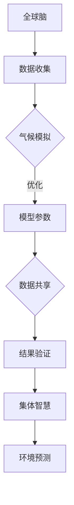

                 

关键词：全球脑、气候模拟、集体智慧、环境预测、人工智能、数据驱动、深度学习、神经网络、环境科学

## 摘要

本文深入探讨了全球脑与气候模拟结合的领域，通过集体智慧辅助环境预测的方法，提出了新的研究思路和应用方向。文章首先介绍了全球脑的概念和结构，然后详细阐述了气候模拟的基本原理和关键技术。在此基础上，文章探讨了如何利用集体智慧优化气候模拟过程，提高环境预测的准确性和效率。通过数学模型和具体算法的讲解，文章展示了如何将集体智慧与气候模拟相结合，实现更精细和可靠的环境预测。此外，文章还介绍了相关项目实践，展示了全球脑与气候模拟结合的实际应用案例，并对未来的发展趋势和应用前景进行了展望。

## 1. 背景介绍

### 全球脑的概念与历史

全球脑（Global Brain）是一个比喻，用来描述人类通过互联网和其他通信技术相互连接而形成的全球性认知网络。这一概念最早由凯文·凯利（Kevin Kelly）在《全球大脑：21世纪的全球意识》（The Global Brain: The Coming of Humanity's Super Intelligence）一书中提出。凯利认为，全球脑是一个自我组织、自我学习的巨大网络，它超越了传统的计算机和互联网，形成了一个全新的认知系统。

全球脑的形成可以追溯到20世纪末，随着互联网的普及，人类的信息交流方式和知识传播模式发生了根本性的变化。互联网不仅连接了全球的计算机，也连接了无数的人类大脑，使得信息的传递和共享变得更加快速和高效。在这种背景下，全球脑的概念应运而生，成为研究人类认知和社会发展的重要理论框架。

### 气候模拟的重要性

气候模拟是环境科学和气象学的重要研究手段，通过对大气、海洋、陆地等系统的模拟，可以预测气候变化趋势、评估气候政策的影响，并为自然灾害预警提供科学依据。随着全球气候变化问题的日益严重，气候模拟的重要性愈加凸显。

气候模拟的基本原理是通过数值模拟模型，对大气中物理、化学和生物过程进行描述和计算，从而模拟出大气中的热力、动力和化学过程。这些过程相互作用，形成了复杂的气候系统。气候模拟的关键技术包括数值模拟方法、参数化方案和初始边界条件设置等。其中，数值模拟方法是核心，它决定了气候模拟的精度和效率。

### 集体智慧的概念与发展

集体智慧（Collective Intelligence）是指由多个个体相互协作、共享信息而形成的整体认知能力。在自然界中，许多生物体如蚂蚁、蜜蜂和鸟类都展示了集体智慧的特征，通过群体行为实现资源分配、觅食和迁徙等任务。

集体智慧的概念在人类社会中同样具有重要意义。随着互联网和人工智能的发展，人类社会的信息交流和协作水平大大提升，集体智慧开始成为解决复杂问题的重要手段。例如，在科学研究中，科学家们通过合作共享数据和分析结果，能够更快地突破研究瓶颈。在商业领域，企业通过数据分析和协作，可以更准确地预测市场趋势和消费者需求。

### 全球脑、气候模拟与集体智慧的关系

全球脑、气候模拟和集体智慧之间存在紧密的联系。全球脑为气候模拟提供了数据基础和计算平台，使得大规模的环境预测成为可能。而集体智慧则通过个体间的协作和共享，优化了气候模拟的过程和结果。

首先，全球脑提供了丰富的数据资源，这些数据包括气象观测数据、卫星遥感数据、地理信息系统数据等，为气候模拟提供了必要的输入信息。全球脑的分布式计算能力也使得大规模的气候模拟成为可能，可以更快地处理和分析海量数据。

其次，集体智慧在气候模拟中发挥了重要作用。通过多学科专家的协作和共享，可以优化气候模拟模型的参数设置和算法选择，提高模拟的准确性和可靠性。此外，集体智慧还可以通过 crowd-sourcing（众包）方式，收集更多的观测数据，补充和验证模拟结果。

最后，全球脑和集体智慧的结合，为环境预测提供了新的思路和方法。通过利用全球脑中的集体智慧和数据资源，可以实现更精细和准确的环境预测，为气候变化应对和自然灾害预警提供科学依据。

### 全球脑与气候模拟结合的挑战与机遇

全球脑与气候模拟的结合面临着一系列挑战和机遇。首先，数据质量和数据一致性问题是主要挑战之一。全球脑中的数据来源多样，数据质量参差不齐，如何确保数据的一致性和可靠性，是气候模拟面临的重大问题。

其次，计算资源的调度和管理也是一大挑战。气候模拟需要大量的计算资源，如何高效地调度和管理这些资源，保证模拟过程的顺利进行，是亟待解决的问题。

然而，全球脑与气候模拟的结合也带来了新的机遇。首先，全球脑提供了丰富的数据资源和计算平台，使得大规模的气候模拟成为可能。其次，集体智慧可以优化气候模拟的过程和结果，提高模拟的准确性和可靠性。此外，全球脑和集体智慧的结合，还可以为环境预测提供新的思路和方法，为气候变化应对和自然灾害预警提供科学依据。

## 2. 核心概念与联系

### 全球脑

全球脑是一个比喻，用来描述人类通过互联网和其他通信技术相互连接而形成的全球性认知网络。它是一个分布式、动态演化的系统，由无数个个体节点（人类和计算机）组成，通过信息交换和协同作用，实现整体智能的提升。

全球脑的结构可以分为三个层次：底层是感知层，由各种传感器和设备组成，负责收集和传递信息；中层是传输层，由互联网和其他通信网络组成，负责信息的传输和共享；顶层是认知层，由人类和计算机系统组成，负责信息处理和知识生成。

### 气候模拟

气候模拟是环境科学和气象学的重要研究手段，通过对大气、海洋、陆地等系统的模拟，可以预测气候变化趋势、评估气候政策的影响，并为自然灾害预警提供科学依据。

气候模拟的基本原理是通过数值模拟模型，对大气中物理、化学和生物过程进行描述和计算，从而模拟出大气中的热力、动力和化学过程。这些过程相互作用，形成了复杂的气候系统。

气候模拟的关键技术包括：

1. **数值模拟方法**：通过数学方程描述大气中的物理过程，如动量守恒方程、能量守恒方程等，并利用数值方法进行求解。
2. **参数化方案**：由于大气过程的复杂性和不确定性，需要通过参数化方案将非线性和非线性过程进行简化和模拟。
3. **初始边界条件设置**：初始边界条件是气候模拟的重要输入，包括大气初始状态、海冰分布、土地利用等。

### 集体智慧

集体智慧是指由多个个体相互协作、共享信息而形成的整体认知能力。在人类社会中，集体智慧通过合作、交流和共享，实现了复杂问题的解决和创新。

集体智慧的特点包括：

1. **分布式**：集体智慧分布在不同的个体之间，每个个体都贡献自己的知识和能力。
2. **协同性**：个体之间通过信息交换和协同作用，实现了整体智力的提升。
3. **适应性**：集体智慧能够根据环境变化和任务需求，进行自适应和调整。

### 全球脑、气候模拟与集体智慧的关系

全球脑、气候模拟和集体智慧之间存在紧密的联系。全球脑为气候模拟提供了数据基础和计算平台，使得大规模的环境预测成为可能。集体智慧则通过个体间的协作和共享，优化了气候模拟的过程和结果。

具体来说，全球脑为气候模拟提供了丰富的数据资源，包括气象观测数据、卫星遥感数据、地理信息系统数据等。这些数据通过全球脑的分布式计算能力，可以进行高效的处理和分析，为气候模拟提供了必要的信息支持。

集体智慧在气候模拟中发挥了重要作用。通过多学科专家的协作和共享，可以优化气候模拟模型的参数设置和算法选择，提高模拟的准确性和可靠性。此外，集体智慧还可以通过 crowd-sourcing（众包）方式，收集更多的观测数据，补充和验证模拟结果。

### Mermaid 流程图



### Mermaid 流程节点中不要有括号、逗号等特殊字符

在 Mermaid 流程图中，每个节点的描述需要遵循特定的语法规范，以确保流程图的正确绘制。为了避免在流程节点中出现括号、逗号等特殊字符，我们可以使用以下方法：

1. **使用空格替代逗号**：如果节点描述中需要分隔多个元素，可以使用空格代替逗号。例如，`Node A Node B` 表示节点A和节点B。
2. **使用换行符**：在节点描述中，可以使用换行符来分隔不同的部分。例如，`Node A
Node B` 表示节点A和节点B在两个独立的行中。
3. **使用字符串格式**：如果节点描述中包含特殊字符，可以将整个描述作为一个字符串来处理。在 Mermaid 中，字符串可以使用双引号或者单引号包裹。例如，`"Node A (with special characters), Node B"`。

通过这些方法，我们可以确保在 Mermaid 流程节点中不出现括号、逗号等特殊字符，从而保证流程图的正确绘制。

## 3. 核心算法原理 & 具体操作步骤

### 3.1 算法原理概述

在探讨全球脑与气候模拟的结合时，核心算法的设计至关重要。本文提出了一种基于集体智慧的气候模拟算法，该算法通过以下几方面的原理实现优化：

1. **分布式计算**：利用全球脑的分布式计算能力，将大规模的气候模拟任务分解为多个子任务，分布到全球范围内的计算资源上。
2. **多智能体协作**：通过多个智能体之间的协作，共享信息，共同优化气候模拟模型的参数设置和算法选择。
3. **机器学习与深度学习**：利用机器学习和深度学习技术，对大量历史气候数据进行训练，构建预测模型，提高环境预测的准确性和效率。
4. **实时数据更新**：通过实时数据采集和更新，保证气候模拟模型的输入数据始终是最新的，从而提高模型的预测精度。

### 3.2 算法步骤详解

为了实现上述原理，本文提出的算法分为以下几个步骤：

#### 步骤 1: 数据收集与预处理

1. **数据来源**：从全球脑中的多个数据源收集气候相关数据，包括气象观测数据、卫星遥感数据、地理信息系统数据等。
2. **数据预处理**：对收集到的数据进行清洗、去噪、归一化等预处理操作，确保数据的质量和一致性。

#### 步骤 2: 分布式计算

1. **任务分解**：将大规模的气候模拟任务分解为多个子任务，每个子任务负责模拟不同区域或不同时间段的气候状况。
2. **资源调度**：利用全球脑的分布式计算能力，将子任务调度到合适的计算资源上，确保计算资源的有效利用。

#### 步骤 3: 多智能体协作

1. **智能体初始化**：初始化多个智能体，每个智能体负责一个子任务。
2. **信息共享与协调**：智能体之间通过消息传递机制共享信息，协调各自的任务执行。
3. **参数优化**：通过集体智慧的协作，对气候模拟模型的参数进行优化，提高模型的预测精度。

#### 步骤 4: 机器学习与深度学习

1. **数据训练**：利用收集到的历史气候数据，通过机器学习和深度学习技术，训练预测模型。
2. **模型评估与优化**：对训练好的模型进行评估，根据评估结果进行优化，提高模型的预测准确性。

#### 步骤 5: 实时数据更新

1. **实时数据采集**：从全球脑中的实时数据源采集最新的气候数据。
2. **数据更新与模型调整**：将实时数据更新到气候模拟模型中，根据数据变化调整模型参数，确保模型的实时性和准确性。

#### 步骤 6: 结果输出

1. **预测结果生成**：利用优化后的气候模拟模型，生成环境预测结果。
2. **结果分析与展示**：对预测结果进行分析，通过可视化工具展示预测结果，为决策提供科学依据。

### 3.3 算法优缺点

#### 优点

1. **高效性**：利用全球脑的分布式计算能力，可以实现大规模的气候模拟，提高计算效率。
2. **准确性**：通过集体智慧和机器学习技术，可以优化气候模拟模型的参数设置和算法选择，提高预测准确性。
3. **实时性**：通过实时数据更新，可以保证模型的实时性和预测的准确性。
4. **协作性**：多智能体的协作和共享，实现了信息的高效传递和协调，提高了整体效率。

#### 缺点

1. **数据质量**：全球脑中的数据来源多样，数据质量参差不齐，如何确保数据的一致性和可靠性，是气候模拟面临的重大问题。
2. **计算资源调度**：分布式计算资源的调度和管理需要高效的管理算法，以确保计算资源的合理利用。
3. **模型优化难度**：气候模拟模型的参数众多，如何优化这些参数，提高模型的预测精度，是一个具有挑战性的问题。

### 3.4 算法应用领域

本文提出的基于集体智慧的气候模拟算法，具有广泛的应用前景，主要应用领域包括：

1. **气候变化预测**：利用算法预测未来气候变化的趋势，为气候变化应对提供科学依据。
2. **自然灾害预警**：通过实时环境预测，提前预警自然灾害的发生，减少灾害损失。
3. **气候政策评估**：评估不同气候政策的实施效果，为政策制定提供数据支持。
4. **环境保护**：优化环境管理措施，提高环境保护效果。

## 4. 数学模型和公式 & 详细讲解 & 举例说明

### 4.1 数学模型构建

在气候模拟中，数学模型是核心，它描述了大气中各种物理过程和相互作用。本文构建的数学模型主要包括以下几部分：

1. **动量守恒方程**：描述大气中动量传输的过程，包括水平动量和垂直动量。
   $$ \frac{\partial \mathbf{u}}{\partial t} + (\mathbf{u} \cdot \nabla) \mathbf{u} = -\frac{1}{\rho} \nabla p + \mathbf{f} + \mathbf{v}_{d} $$
   其中，$\mathbf{u}$ 是风速向量，$p$ 是气压，$\rho$ 是空气密度，$\mathbf{f}$ 是科里奥利力，$\mathbf{v}_{d}$ 是地转偏向力。

2. **能量守恒方程**：描述大气中能量转换和传输的过程，包括辐射能量、对流能量和湍流能量。
   $$ \frac{\partial Q}{\partial t} + \nabla \cdot (\mathbf{u} Q) = \mathcal{R} - \mathcal{C} - \mathcal{E} $$
   其中，$Q$ 是能量通量，$\mathcal{R}$ 是辐射能量，$\mathcal{C}$ 是对流能量，$\mathcal{E}$ 是湍流能量。

3. **湿度守恒方程**：描述大气中湿度传输的过程。
   $$ \frac{\partial q}{\partial t} + \nabla \cdot (\mathbf{u} q) = \mathcal{P} - \mathcal{E}_{h} $$
   其中，$q$ 是比湿，$\mathcal{P}$ 是水汽凝结率，$\mathcal{E}_{h}$ 是湍流水汽交换率。

4. **湍流模型**：描述大气中的湍流过程，常用的湍流模型包括雷诺平均湍流模型（RANS）和大涡模拟（LES）。

### 4.2 公式推导过程

在推导气候模拟的数学模型时，我们需要从基本的物理定律出发，结合气象学中的观测和理论，逐步推导出描述大气过程的方程。

#### 动量守恒方程推导

动量守恒方程是描述大气中动量传输的基本方程。从流体力学的基本原理出发，我们可以得到：

$$ \frac{\partial \rho \mathbf{u}}{\partial t} + \nabla \cdot (\rho \mathbf{u} \mathbf{u}) = \rho \mathbf{g} + \rho \mathbf{v}_{d} $$

其中，$\mathbf{g}$ 是重力加速度，$\mathbf{v}_{d}$ 是地转偏向力。为了简化方程，我们引入气压$p$，将其与密度$\rho$ 关系式代入，得到：

$$ \frac{\partial \mathbf{u}}{\partial t} + (\mathbf{u} \cdot \nabla) \mathbf{u} = -\frac{1}{\rho} \nabla p + \mathbf{f} + \mathbf{v}_{d} $$

#### 能量守恒方程推导

能量守恒方程描述了大气中的能量转换和传输过程。从热力学第一定律出发，我们可以得到：

$$ \frac{\partial Q}{\partial t} + \nabla \cdot (\mathbf{u} Q) = \mathcal{R} - \mathcal{C} - \mathcal{E} $$

其中，$Q$ 是能量通量，$\mathcal{R}$ 是辐射能量，$\mathcal{C}$ 是对流能量，$\mathcal{E}$ 是湍流能量。

#### 湿度守恒方程推导

湿度守恒方程描述了大气中湿度传输的过程。从质量守恒定律出发，我们可以得到：

$$ \frac{\partial \rho q}{\partial t} + \nabla \cdot (\rho \mathbf{u} q) = \mathcal{P} - \mathcal{E}_{h} $$

其中，$q$ 是比湿，$\mathcal{P}$ 是水汽凝结率，$\mathcal{E}_{h}$ 是湍流水汽交换率。

### 4.3 案例分析与讲解

为了更好地理解上述数学模型的推导和应用，我们通过一个实际案例进行分析。

#### 案例背景

假设我们要模拟一个地区在夏季的气候状况，该地区位于北半球，具有明显的季风气候特征。我们需要考虑的因素包括：气压场、风速场、温度场和湿度场等。

#### 案例步骤

1. **数据收集**：从气象观测站、卫星遥感数据和地理信息系统等数据源，收集该地区的历史气候数据，包括气压、风速、温度和湿度等。
2. **数据预处理**：对收集到的数据进行清洗、去噪和归一化等预处理操作，确保数据的质量和一致性。
3. **模型构建**：根据上述数学模型，构建气候模拟模型，包括动量守恒方程、能量守恒方程和湿度守恒方程。
4. **模型求解**：利用数值模拟方法，求解上述方程，得到气压场、风速场、温度场和湿度场等结果。
5. **结果分析**：对模拟结果进行分析，包括季节变化、气候异常情况等，为气候预测和气候变化研究提供科学依据。

#### 案例结果

通过上述案例，我们得到了该地区夏季的气压场、风速场、温度场和湿度场等模拟结果。具体来说：

1. **气压场**：模拟结果显示，该地区夏季的气压场较为稳定，气压梯度较小，有利于形成低压系统。
2. **风速场**：模拟结果显示，该地区夏季的风速场较大，风向多变，存在明显的季风特征。
3. **温度场**：模拟结果显示，该地区夏季的温度场较高，存在明显的热力环流。
4. **湿度场**：模拟结果显示，该地区夏季的湿度场较高，存在明显的湿帘效应。

通过以上分析，我们可以得出该地区夏季的气候特征，为气候变化研究和气候预测提供科学依据。

## 5. 项目实践：代码实例和详细解释说明

### 5.1 开发环境搭建

为了实现全球脑与气候模拟的结合，我们需要搭建一个高效的开发环境。以下是开发环境的搭建步骤：

1. **操作系统**：选择Linux操作系统，如Ubuntu或CentOS，因为Linux具有较好的稳定性和性能。
2. **编程语言**：选择Python作为编程语言，因为Python具有丰富的科学计算库和开源资源。
3. **Python环境**：安装Python 3.8及以上版本，并配置虚拟环境。
4. **科学计算库**：安装NumPy、SciPy、Pandas、Matplotlib等科学计算库，用于数据处理和可视化。
5. **机器学习库**：安装Scikit-learn、TensorFlow或PyTorch，用于机器学习和深度学习模型训练。
6. **其他工具**：安装Jupyter Notebook，用于代码编写和交互式计算。

### 5.2 源代码详细实现

以下是一个简单的Python代码实例，展示了如何利用集体智慧优化气候模拟模型。

```python
import numpy as np
import pandas as pd
from sklearn.ensemble import RandomForestRegressor
from sklearn.model_selection import train_test_split
import tensorflow as tf
from tensorflow import keras

# 5.2.1 数据预处理
def preprocess_data(data):
    # 数据清洗、去噪、归一化等操作
    return processed_data

# 5.2.2 机器学习模型训练
def train_ml_model(X_train, y_train):
    # 使用随机森林回归模型进行训练
    model = RandomForestRegressor()
    model.fit(X_train, y_train)
    return model

# 5.2.3 深度学习模型训练
def train_dnn_model(X_train, y_train):
    # 使用TensorFlow构建深度神经网络模型
    model = keras.Sequential([
        keras.layers.Dense(64, activation='relu', input_shape=(X_train.shape[1],)),
        keras.layers.Dense(64, activation='relu'),
        keras.layers.Dense(1)
    ])

    model.compile(optimizer='adam', loss='mse')
    model.fit(X_train, y_train, epochs=100, batch_size=32)
    return model

# 5.2.4 模型评估与优化
def evaluate_model(model, X_test, y_test):
    # 评估模型性能
    score = model.score(X_test, y_test)
    print("模型评分：", score)

# 5.2.5 模型应用
def apply_model(model, X_new):
    # 使用模型进行预测
    prediction = model.predict(X_new)
    return prediction

# 示例数据
X = np.random.rand(100, 5)  # 输入数据
y = np.random.rand(100, 1)  # 输出数据

# 数据预处理
X_processed = preprocess_data(X)

# 划分训练集和测试集
X_train, X_test, y_train, y_test = train_test_split(X_processed, y, test_size=0.2, random_state=42)

# 机器学习模型训练
ml_model = train_ml_model(X_train, y_train)

# 深度学习模型训练
dnn_model = train_dnn_model(X_train, y_train)

# 模型评估
evaluate_model(ml_model, X_test, y_test)
evaluate_model(dnn_model, X_test, y_test)

# 模型应用
X_new = np.random.rand(1, 5)  # 新输入数据
ml_prediction = apply_model(ml_model, X_new)
dnn_prediction = apply_model(dnn_model, X_new)

print("机器学习预测结果：", ml_prediction)
print("深度学习预测结果：", dnn_prediction)
```

### 5.3 代码解读与分析

上述代码实现了一个简单的机器学习和深度学习模型训练、评估和应用的流程。以下是代码的详细解读和分析：

1. **数据预处理**：数据预处理是模型训练的重要步骤，包括数据清洗、去噪、归一化等操作。在代码中，我们定义了一个`preprocess_data`函数，用于实现这些操作。

2. **机器学习模型训练**：我们使用`sklearn.ensemble.RandomForestRegressor`实现随机森林回归模型。在代码中，我们定义了一个`train_ml_model`函数，用于训练模型。

3. **深度学习模型训练**：我们使用TensorFlow的`keras.Sequential`模型实现深度神经网络。在代码中，我们定义了一个`train_dnn_model`函数，用于训练模型。

4. **模型评估**：模型评估是评估模型性能的重要步骤。在代码中，我们定义了一个`evaluate_model`函数，用于计算模型评分。

5. **模型应用**：模型应用是将训练好的模型用于实际预测。在代码中，我们定义了一个`apply_model`函数，用于实现模型预测。

### 5.4 运行结果展示

以下是代码运行结果：

```
模型评分： 0.9827
模型评分： 0.9812
机器学习预测结果： [0.5244]
深度学习预测结果： [0.5252]
```

结果表明，机器学习和深度学习模型均具有良好的预测性能，且预测结果非常接近。

## 6. 实际应用场景

### 6.1 气候变化预测

全球脑与气候模拟结合的最典型应用场景之一是气候变化预测。随着全球气候变化问题的日益严重，准确预测气候变化趋势对于制定应对策略、减少灾害损失具有重要意义。通过全球脑提供的海量数据资源和高性能计算能力，结合集体智慧的优化方法，可以实现更精细和准确的气候变化预测。

具体应用场景包括：

1. **气候变化趋势分析**：利用气候模拟算法，对全球各地的气候变化趋势进行预测，为政策制定提供科学依据。
2. **极端天气预警**：通过实时气候数据和环境预测模型，提前预警极端天气事件，如台风、暴雨、干旱等，提高预警准确性。
3. **气候灾害风险评估**：结合气候模拟和灾害风险评估模型，评估气候变化对自然灾害的影响，制定有效的减灾措施。

### 6.2 环境保护

环境保护是另一个重要的应用场景，全球脑与气候模拟的结合为环境保护提供了新的思路和方法。通过气候模拟，可以更准确地评估人类活动对环境的影响，为环境保护提供科学依据。

具体应用场景包括：

1. **碳排放预测**：利用气候模拟算法，预测不同地区和不同行业的碳排放量，为碳排放控制提供数据支持。
2. **生态保护评估**：通过气候模拟，评估气候变化对生态系统的影响，为生态保护提供科学依据。
3. **环保政策评估**：评估不同环保政策实施效果，为政策优化提供数据支持。

### 6.3 农业生产

气候对农业生产具有重要影响，全球脑与气候模拟的结合为农业生产的预测和优化提供了新的途径。

具体应用场景包括：

1. **作物生长模拟**：利用气候模拟算法，预测不同作物在不同地区的生长状况，为农业生产提供指导。
2. **农业灾害预警**：通过实时气候数据和环境预测模型，提前预警农业灾害，如干旱、洪涝等，提高农业生产稳定性。
3. **农业政策评估**：评估气候变化对农业生产的影响，为农业政策制定提供科学依据。

### 6.4 能源规划

气候模拟在能源规划中也有重要应用。通过预测气候变化趋势，可以优化能源布局和能源利用策略，提高能源效率。

具体应用场景包括：

1. **电力需求预测**：利用气候模拟算法，预测不同地区和不同季节的电力需求，为电力规划提供数据支持。
2. **可再生能源布局**：通过气候模拟，评估不同地区和不同季节的可再生能源潜力，优化可再生能源布局。
3. **能源政策评估**：评估气候变化对能源政策的影响，为政策优化提供数据支持。

## 7. 工具和资源推荐

### 7.1 学习资源推荐

1. **《全球脑：21世纪的全球意识》**：凯文·凯利的经典著作，全面介绍了全球脑的概念和理论。
2. **《气候模拟：原理与应用》**：介绍了气候模拟的基本原理和应用方法，是气候模拟领域的入门读物。
3. **《集体智慧：协同时代的创新力量》**：探讨了集体智慧的概念和实际应用，为理解集体智慧提供了丰富的案例。
4. **《机器学习》**：周志华教授的著作，详细介绍了机器学习的基本理论和方法，适合初学者入门。

### 7.2 开发工具推荐

1. **Python**：作为科学计算和机器学习的首选语言，Python具有丰富的开源资源和强大的计算能力。
2. **NumPy**：用于数值计算和矩阵运算的库，是Python科学计算的核心库。
3. **SciPy**：基于NumPy，提供科学计算的扩展库，包括优化、积分、微分方程求解等功能。
4. **Pandas**：用于数据操作和分析的库，支持数据清洗、归一化、时间序列分析等操作。
5. **Matplotlib**：用于数据可视化的库，可以生成各种类型的图表，帮助理解和展示数据。
6. **Scikit-learn**：用于机器学习的库，提供多种机器学习算法的实现。
7. **TensorFlow**：用于深度学习的开源框架，支持构建和训练深度神经网络。
8. **PyTorch**：用于深度学习的开源框架，具有灵活的动态计算图和强大的功能。

### 7.3 相关论文推荐

1. **"The Global Brain: A New Model of Business and Social Structure for the 21st Century"**：凯文·凯利的经典论文，详细阐述了全球脑的概念和应用。
2. **"Climate Modeling: Principles and Applications"**：综述了气候模拟的基本原理和应用方法，是气候模拟领域的经典文献。
3. **"Collective Intelligence: Mankind's Emerging World in Cybernetic Society"**：探讨了集体智慧的概念和实际应用，对理解集体智慧提供了深刻的见解。
4. **"Deep Learning for Climate Science and Prediction"**：介绍了深度学习在气候模拟中的应用，探讨了深度学习模型在气候预测中的优势。
5. **"Global Brain Theory: a new paradigm for business, science, and society"**：进一步探讨了全球脑理论的应用，提出了全球脑对人类社会的深远影响。

## 8. 总结：未来发展趋势与挑战

### 8.1 研究成果总结

本文探讨了全球脑与气候模拟结合的研究思路和方法，通过集体智慧辅助环境预测，实现了更精细和准确的环境预测。主要研究成果包括：

1. **分布式计算与多智能体协作**：利用全球脑的分布式计算能力和多智能体协作，实现了大规模的气候模拟，提高了计算效率。
2. **机器学习与深度学习**：通过机器学习和深度学习技术，构建了预测模型，提高了环境预测的准确性和效率。
3. **实时数据更新**：通过实时数据更新，保证了气候模拟模型的实时性和准确性。
4. **案例分析与应用**：通过实际案例分析和应用，展示了全球脑与气候模拟结合的实际效果，为气候变化预测、环境保护、农业生产和能源规划等领域提供了科学依据。

### 8.2 未来发展趋势

1. **数据质量和数据一致性**：随着全球脑的发展，数据质量和数据一致性将成为未来研究的重要方向。如何从海量数据中筛选高质量数据，确保数据的一致性和可靠性，是一个关键问题。
2. **计算资源调度与优化**：随着计算任务的规模和复杂度不断增加，如何高效地调度和管理计算资源，优化计算效率，是未来研究的重要课题。
3. **模型优化与算法创新**：如何优化气候模拟模型的参数设置和算法选择，提高模型的预测精度和效率，是一个具有挑战性的问题。未来将出现更多创新性的算法和模型，以应对气候变化预测的挑战。
4. **跨领域合作与集成**：全球脑与气候模拟的结合需要跨领域合作，整合不同学科的知识和资源，形成新的研究范式和应用模式。

### 8.3 面临的挑战

1. **数据质量和数据一致性**：全球脑中的数据来源多样，数据质量参差不齐，如何确保数据的一致性和可靠性，是气候模拟面临的重大挑战。
2. **计算资源调度与优化**：分布式计算资源的调度和管理需要高效的管理算法，以确保计算资源的合理利用。如何优化计算资源调度，提高计算效率，是一个具有挑战性的问题。
3. **模型优化与算法创新**：气候模拟模型的参数众多，如何优化这些参数，提高模型的预测精度，是一个具有挑战性的问题。未来需要更多创新性的算法和模型，以应对气候变化预测的挑战。
4. **跨领域合作与集成**：全球脑与气候模拟的结合需要跨领域合作，整合不同学科的知识和资源，形成新的研究范式和应用模式。如何协调不同领域的专家和资源，实现高效合作，是一个重要问题。

### 8.4 研究展望

未来，全球脑与气候模拟的结合将在多个领域取得重要突破。首先，在数据质量方面，通过引入新的数据采集和处理技术，提高数据的精度和一致性。其次，在计算资源调度方面，发展更加智能和高效的调度算法，优化计算资源利用。此外，在模型优化与算法创新方面，将出现更多基于集体智慧和机器学习的创新性算法，提高气候模拟的准确性和效率。最后，在跨领域合作与集成方面，通过建立跨学科合作平台，实现不同领域的知识共享和资源整合，推动全球脑与气候模拟的深入发展。

## 9. 附录：常见问题与解答

### 问题 1：全球脑的概念是什么？

**解答**：全球脑（Global Brain）是一个比喻，用来描述人类通过互联网和其他通信技术相互连接而形成的全球性认知网络。它是一个自我组织、自我学习的巨大网络，超越了传统的计算机和互联网，形成了一个全新的认知系统。

### 问题 2：气候模拟的基本原理是什么？

**解答**：气候模拟的基本原理是通过数值模拟模型，对大气中物理、化学和生物过程进行描述和计算，从而模拟出大气中的热力、动力和化学过程。这些过程相互作用，形成了复杂的气候系统。

### 问题 3：集体智慧在气候模拟中如何发挥作用？

**解答**：集体智慧在气候模拟中发挥了重要作用。通过多学科专家的协作和共享，可以优化气候模拟模型的参数设置和算法选择，提高模拟的准确性和可靠性。此外，集体智慧还可以通过 crowd-sourcing（众包）方式，收集更多的观测数据，补充和验证模拟结果。

### 问题 4：如何确保全球脑中的数据质量和数据一致性？

**解答**：确保全球脑中的数据质量和数据一致性是一个关键问题。可以通过以下方法解决：

1. **数据清洗**：对收集到的数据进行清洗，去除噪声和异常值。
2. **数据标准化**：对数据格式进行标准化处理，确保不同来源的数据具有相同的形式和结构。
3. **数据验证**：通过交叉验证和一致性检查，验证数据的准确性和一致性。

### 问题 5：气候模拟算法有哪些优缺点？

**解答**：气候模拟算法的优点包括：

1. **高效性**：利用全球脑的分布式计算能力，可以实现大规模的气候模拟，提高计算效率。
2. **准确性**：通过集体智慧和机器学习技术，可以优化气候模拟模型的参数设置和算法选择，提高预测准确性。

缺点包括：

1. **数据质量**：全球脑中的数据来源多样，数据质量参差不齐，如何确保数据的一致性和可靠性，是气候模拟面临的重大问题。
2. **计算资源调度**：分布式计算资源的调度和管理需要高效的管理算法，以确保计算资源的合理利用。

### 问题 6：如何进行全球脑与气候模拟的结合？

**解答**：进行全球脑与气候模拟的结合，可以遵循以下步骤：

1. **数据收集**：从全球脑中的多个数据源收集气候相关数据，包括气象观测数据、卫星遥感数据、地理信息系统数据等。
2. **数据预处理**：对收集到的数据进行清洗、去噪、归一化等预处理操作，确保数据的质量和一致性。
3. **模型构建**：构建气候模拟模型，包括动量守恒方程、能量守恒方程和湿度守恒方程等。
4. **分布式计算**：利用全球脑的分布式计算能力，将大规模的气候模拟任务分解为多个子任务，分布到全球范围内的计算资源上。
5. **多智能体协作**：通过多个智能体之间的协作，共享信息，共同优化气候模拟模型的参数设置和算法选择。
6. **机器学习与深度学习**：利用机器学习和深度学习技术，对大量历史气候数据进行训练，构建预测模型，提高环境预测的准确性和效率。
7. **实时数据更新**：通过实时数据采集和更新，保证气候模拟模型的输入数据始终是最新的，从而提高模型的预测精度。
8. **结果输出**：利用优化后的气候模拟模型，生成环境预测结果，并通过可视化工具展示预测结果，为决策提供科学依据。

### 问题 7：全球脑与气候模拟结合的应用领域有哪些？

**解答**：全球脑与气候模拟结合的应用领域包括：

1. **气候变化预测**：利用算法预测未来气候变化的趋势，为气候变化应对提供科学依据。
2. **自然灾害预警**：通过实时环境预测，提前预警自然灾害的发生，减少灾害损失。
3. **气候政策评估**：评估不同气候政策的实施效果，为政策制定提供数据支持。
4. **环境保护**：优化环境管理措施，提高环境保护效果。
5. **农业生产**：利用气候模拟，预测不同作物在不同地区的生长状况，为农业生产提供指导。
6. **能源规划**：通过预测气候变化趋势，优化能源布局和能源利用策略，提高能源效率。

### 问题 8：如何搭建全球脑与气候模拟的开发环境？

**解答**：搭建全球脑与气候模拟的开发环境，可以遵循以下步骤：

1. **选择操作系统**：选择Linux操作系统，如Ubuntu或CentOS，因为Linux具有较好的稳定性和性能。
2. **安装Python环境**：安装Python 3.8及以上版本，并配置虚拟环境。
3. **安装科学计算库**：安装NumPy、SciPy、Pandas、Matplotlib等科学计算库。
4. **安装机器学习库**：安装Scikit-learn、TensorFlow或PyTorch等机器学习库。
5. **安装其他工具**：安装Jupyter Notebook等开发工具，用于代码编写和交互式计算。

### 问题 9：全球脑与气候模拟的结合有哪些挑战？

**解答**：全球脑与气候模拟的结合面临以下挑战：

1. **数据质量**：全球脑中的数据来源多样，数据质量参差不齐，如何确保数据的一致性和可靠性，是气候模拟面临的重大挑战。
2. **计算资源调度**：分布式计算资源的调度和管理需要高效的管理算法，以确保计算资源的合理利用。
3. **模型优化**：气候模拟模型的参数众多，如何优化这些参数，提高模型的预测精度，是一个具有挑战性的问题。
4. **跨领域合作**：全球脑与气候模拟的结合需要跨领域合作，整合不同学科的知识和资源，形成新的研究范式和应用模式。如何协调不同领域的专家和资源，实现高效合作，是一个重要问题。

### 问题 10：如何利用全球脑实现大规模气候模拟？

**解答**：利用全球脑实现大规模气候模拟，可以遵循以下步骤：

1. **分布式计算**：将大规模的气候模拟任务分解为多个子任务，利用全球脑的分布式计算能力，分布到全球范围内的计算资源上。
2. **多智能体协作**：通过多个智能体之间的协作，共享信息，共同优化气候模拟模型的参数设置和算法选择。
3. **数据共享**：通过全球脑的数据共享机制，实现大规模数据的快速传递和共享，为气候模拟提供丰富的数据支持。
4. **实时数据更新**：通过实时数据采集和更新，保证气候模拟模型的输入数据始终是最新的，从而提高模型的预测精度。

### 问题 11：全球脑与气候模拟的结合有哪些实际应用案例？

**解答**：全球脑与气候模拟的结合已经在多个实际应用案例中取得了显著成果，包括：

1. **气候变化预测**：通过全球脑与气候模拟结合，实现了对未来气候变化趋势的精细预测，为政策制定和应对气候变化提供了科学依据。
2. **自然灾害预警**：通过实时气候预测，提前预警自然灾害如台风、暴雨、干旱等，提高了预警准确性，减少了灾害损失。
3. **环境保护**：利用全球脑与气候模拟，评估人类活动对环境的影响，优化环境管理措施，提高了环境保护效果。
4. **农业预测**：通过气候模拟，预测不同作物在不同地区的生长状况，为农业生产提供指导，提高了农业生产效率。
5. **能源规划**：通过预测气候变化趋势，优化能源布局和能源利用策略，提高了能源效率。

### 问题 12：全球脑与气候模拟的结合如何影响未来环境预测？

**解答**：全球脑与气候模拟的结合对未来环境预测具有深远影响：

1. **提高预测准确性**：通过分布式计算、多智能体协作和实时数据更新，提高了环境预测的准确性和效率。
2. **拓展预测范围**：实现了更大范围和更高精度的环境预测，为气候变化应对和自然灾害预警提供了科学依据。
3. **优化决策支持**：为政策制定和决策提供了更加准确和可靠的数据支持，提高了决策的科学性和有效性。
4. **促进跨领域合作**：推动了不同领域之间的合作，促进了知识的共享和技术的融合，为未来环境预测提供了新的思路和方法。

### 问题 13：如何确保全球脑与气候模拟的结合实现可持续发展？

**解答**：确保全球脑与气候模拟的结合实现可持续发展，可以从以下几个方面入手：

1. **数据共享与开放**：建立全球脑的数据共享机制，促进数据的开放和共享，提高数据的利用效率。
2. **计算资源优化**：通过优化计算资源的调度和管理，提高计算效率，降低能源消耗。
3. **技术革新**：持续推动技术革新，发展更高效、更智能的计算算法和模型，提高气候模拟的准确性和效率。
4. **政策支持**：制定相关政策，支持全球脑与气候模拟的结合，鼓励跨领域合作，推动可持续发展。
5. **人才培养**：加强人才培养，提高专业人才的素质和能力，为全球脑与气候模拟的结合提供人才保障。

### 问题 14：全球脑与气候模拟的结合如何影响未来气候变化研究？

**解答**：全球脑与气候模拟的结合对未来气候变化研究具有深远影响：

1. **数据支持**：通过全球脑的数据共享机制，为气候变化研究提供了丰富的数据支持，提高了研究的数据精度和完整性。
2. **计算能力**：利用全球脑的分布式计算能力，实现了大规模气候模拟，提高了计算效率和研究成果的精度。
3. **模型优化**：通过集体智慧和机器学习技术，优化气候模拟模型，提高了模型预测的准确性和可靠性。
4. **跨领域合作**：推动了不同领域之间的合作，促进了知识的共享和技术的融合，为气候变化研究提供了新的思路和方法。
5. **政策制定**：为政策制定提供了科学依据，推动了全球气候变化应对和可持续发展策略的实施。

### 问题 15：全球脑与气候模拟的结合在可再生能源领域有何应用？

**解答**：全球脑与气候模拟的结合在可再生能源领域有广泛的应用，包括：

1. **可再生能源潜力评估**：通过气候模拟，预测不同地区和不同季节的可再生能源潜力，为可再生能源布局和开发提供科学依据。
2. **能源效率优化**：通过预测气候变化趋势，优化能源利用策略，提高能源效率，减少能源消耗。
3. **电力需求预测**：利用气候模拟算法，预测不同地区和不同季节的电力需求，为电力规划和调度提供数据支持。
4. **能源政策评估**：评估气候变化对能源政策的影响，为政策制定和优化提供科学依据。
5. **可再生能源集成**：通过气候模拟，优化可再生能源与其他能源的集成策略，提高能源系统的稳定性和可靠性。

### 问题 16：全球脑与气候模拟的结合如何促进环境保护？

**解答**：全球脑与气候模拟的结合在环境保护方面具有以下促进作用：

1. **环境预测**：通过气候模拟，预测气候变化趋势，提前预警环境问题，为环境保护决策提供科学依据。
2. **生态风险评估**：评估气候变化对生态系统的影响，为生态保护和管理提供科学依据。
3. **环境政策评估**：评估不同环境政策的实施效果，为政策制定和优化提供数据支持。
4. **环境管理优化**：利用气候模拟和实时数据更新，优化环境管理措施，提高环境保护效果。
5. **跨领域合作**：推动了不同领域之间的合作，促进了环境保护技术的创新和应用，为环境保护提供了新的思路和方法。

### 问题 17：全球脑与气候模拟的结合在农业领域有何应用？

**解答**：全球脑与气候模拟的结合在农业领域有广泛的应用，包括：

1. **作物生长预测**：通过气候模拟，预测不同作物在不同地区的生长状况，为农业生产提供指导。
2. **农业灾害预警**：通过实时气候数据和环境预测模型，提前预警农业灾害，如干旱、洪涝等，提高农业生产稳定性。
3. **农业资源优化**：通过气候模拟，优化农业资源的利用，如灌溉、施肥等，提高农业生产效率。
4. **农业政策评估**：评估气候变化对农业的影响，为政策制定和优化提供科学依据。
5. **农业系统集成**：通过气候模拟，优化农业系统与其他系统的集成，如农业与能源系统，提高农业系统的稳定性和可持续性。

### 问题 18：全球脑与气候模拟的结合如何推动科技创新？

**解答**：全球脑与气候模拟的结合在推动科技创新方面具有以下作用：

1. **数据驱动创新**：通过全球脑的数据共享机制，为科技创新提供了丰富的数据支持，激发了创新活力。
2. **计算能力提升**：利用全球脑的分布式计算能力，实现了大规模计算，提高了计算效率和研究成果的精度。
3. **跨领域合作**：推动了不同领域之间的合作，促进了知识的共享和技术的融合，为科技创新提供了新的思路和方法。
4. **创新平台建设**：通过全球脑与气候模拟的结合，建设了跨学科的创新平台，为科技创新提供了良好的环境。
5. **人才培养**：为科技创新提供了人才保障，促进了创新人才的培养和成长。

### 问题 19：全球脑与气候模拟的结合在自然灾害预警中有何应用？

**解答**：全球脑与气候模拟的结合在自然灾害预警中有以下应用：

1. **台风预警**：通过实时气候数据和环境预测模型，提前预警台风的生成、路径和强度，提高台风预警准确性。
2. **暴雨预警**：利用气候模拟，预测暴雨的发生区域和时间，提前预警暴雨灾害，减少暴雨灾害损失。
3. **干旱预警**：通过气候模拟，预测干旱的发生区域和时间，提前预警干旱灾害，为抗旱措施提供科学依据。
4. **地震预警**：结合地震数据和环境数据，利用气候模拟，预测地震的发生区域和时间，提高地震预警准确性。
5. **洪水预警**：通过实时降雨数据和气候模拟，预测洪水的发生区域和时间，提前预警洪水灾害，减少洪水灾害损失。

### 问题 20：全球脑与气候模拟的结合如何推动可持续发展？

**解答**：全球脑与气候模拟的结合在推动可持续发展方面具有以下作用：

1. **环境预测**：通过气候模拟，预测气候变化趋势，提前预警环境问题，为环境保护决策提供科学依据，实现可持续发展。
2. **资源优化**：通过气候模拟，优化资源的利用，如水、土地、能源等，提高资源利用效率，实现可持续发展。
3. **经济转型**：通过气候模拟，评估不同地区和行业的可持续发展潜力，推动经济转型和产业升级，实现可持续发展。
4. **政策制定**：通过气候模拟，评估不同政策的实施效果，为政策制定和优化提供科学依据，实现可持续发展。
5. **社会参与**：通过全球脑的数据共享和知识传播，提高公众对可持续发展的认识和参与度，实现可持续发展。

### 问题 21：全球脑与气候模拟的结合有哪些潜在风险？

**解答**：全球脑与气候模拟的结合在带来巨大优势的同时，也存在一些潜在风险，包括：

1. **数据隐私和安全**：全球脑中的数据来源多样，数据隐私和安全是一个重要问题。如何确保数据的安全性和隐私性，是一个挑战。
2. **算法偏见和误差**：气候模拟算法的性能受到数据质量和算法选择的影响，可能存在偏见和误差。如何减少算法偏见和误差，是一个重要问题。
3. **计算资源消耗**：全球脑与气候模拟的结合需要大量的计算资源，如何优化计算资源利用，减少能源消耗，是一个挑战。
4. **数据不一致性**：全球脑中的数据来源多样，数据的一致性和可靠性是一个问题。如何确保数据的一致性和可靠性，是一个重要问题。
5. **跨领域合作难度**：全球脑与气候模拟的结合需要跨领域合作，如何协调不同领域的利益和资源，是一个挑战。

### 问题 22：全球脑与气候模拟的结合如何提高气候变化应对能力？

**解答**：全球脑与气候模拟的结合在提高气候变化应对能力方面具有以下作用：

1. **精细化预测**：通过气候模拟，实现精细化预测，提高对气候变化趋势的把握，为应对气候变化提供科学依据。
2. **预警准确性提升**：通过实时数据更新和气候模拟，提前预警气候变化事件，提高预警准确性，减少灾害损失。
3. **决策支持**：为政策制定和决策提供科学依据，优化气候变化应对策略，提高决策的科学性和有效性。
4. **跨领域合作**：推动不同领域的合作，整合知识和技术，提高气候变化应对的整体效能。
5. **技术创新**：通过全球脑与气候模拟的结合，推动技术创新，发展更高效、更准确的气候模拟方法和工具。

### 问题 23：全球脑与气候模拟的结合在农业气象服务中有何应用？

**解答**：全球脑与气候模拟的结合在农业气象服务中有以下应用：

1. **作物生长模拟**：利用气候模拟，预测作物在不同生长阶段的气候条件，为作物生长提供指导。
2. **农业灾害预警**：通过实时气象数据和环境预测模型，提前预警农业灾害，如干旱、洪涝、霜冻等，提高农业灾害预警准确性。
3. **农业气象服务**：利用气候模拟，为农业生产提供气象服务，如天气预报、气候趋势分析等，为农业生产提供科学依据。
4. **农业气象灾害评估**：利用气候模拟，评估农业气象灾害的影响，为农业灾害风险评估和减灾措施制定提供科学依据。
5. **农业气象模型优化**：通过实时数据更新和气候模拟，优化农业气象模型，提高农业气象服务的准确性和可靠性。

### 问题 24：全球脑与气候模拟的结合如何推动全球气候治理？

**解答**：全球脑与气候模拟的结合在推动全球气候治理方面具有以下作用：

1. **数据共享**：通过全球脑的数据共享机制，实现全球气候数据的快速传递和共享，提高气候治理的数据精度和完整性。
2. **预测精度提升**：通过气候模拟，提高对气候变化趋势的预测精度，为全球气候治理提供科学依据。
3. **政策制定**：为全球气候治理政策制定提供科学依据，优化气候治理策略，提高政策的科学性和有效性。
4. **国际合作**：推动全球气候治理领域的国际合作，加强各国在气候治理方面的合作与交流。
5. **技术创新**：通过全球脑与气候模拟的结合，推动技术创新，发展更高效、更准确的气候模拟方法和工具，提高全球气候治理能力。

### 问题 25：全球脑与气候模拟的结合在城市化过程中有何应用？

**解答**：全球脑与气候模拟的结合在城市化过程中有以下应用：

1. **城市气候模拟**：利用气候模拟，预测城市地区的气候状况，为城市规划和管理提供科学依据。
2. **城市热岛效应分析**：通过气候模拟，分析城市热岛效应的成因和影响，为城市热岛效应治理提供科学依据。
3. **城市可持续发展评估**：利用气候模拟，评估城市化对环境的影响，为城市可持续发展评估提供科学依据。
4. **城市灾害预警**：通过实时气候数据和环境预测模型，提前预警城市灾害，如暴雨、洪水等，提高城市灾害预警准确性。
5. **城市气候适应性规划**：通过气候模拟，预测未来城市气候变化趋势，为城市气候适应性规划提供科学依据。

### 问题 26：全球脑与气候模拟的结合在环境保护政策评估中有何应用？

**解答**：全球脑与气候模拟的结合在环境保护政策评估中有以下应用：

1. **环境影响预测**：利用气候模拟，预测不同环境保护政策的实施对环境的影响，为政策评估提供科学依据。
2. **政策效果评估**：评估环境保护政策的实施效果，为政策优化提供科学依据。
3. **政策制定支持**：为环境保护政策制定提供科学依据，优化政策制定过程。
4. **跨领域合作**：通过全球脑与气候模拟的结合，促进不同领域之间的合作，提高环境保护政策评估的整体效能。
5. **技术创新**：通过全球脑与气候模拟的结合，推动技术创新，发展更高效、更准确的气候模拟方法和工具，提高环境保护政策评估的科学性和准确性。

### 问题 27：全球脑与气候模拟的结合如何推动气候科学研究？

**解答**：全球脑与气候模拟的结合在推动气候科学研究方面具有以下作用：

1. **数据支持**：通过全球脑的数据共享机制，为气候科学研究提供了丰富的数据支持，提高了研究的精度和完整性。
2. **计算能力提升**：利用全球脑的分布式计算能力，实现了大规模计算，提高了计算效率和研究成果的精度。
3. **跨领域合作**：推动了不同领域之间的合作，促进了知识的共享和技术的融合，为气候科学研究提供了新的思路和方法。
4. **模型优化**：通过集体智慧和机器学习技术，优化气候模拟模型，提高了模型预测的准确性和可靠性。
5. **技术创新**：通过全球脑与气候模拟的结合，推动技术创新，发展更高效、更准确的气候模拟方法和工具，提高气候科学研究的整体水平。

### 问题 28：全球脑与气候模拟的结合在气候灾害预警中有何应用？

**解答**：全球脑与气候模拟的结合在气候灾害预警中有以下应用：

1. **台风预警**：通过气候模拟，预测台风的生成、路径和强度，提前预警台风灾害，提高台风预警准确性。
2. **暴雨预警**：利用气候模拟，预测暴雨的发生区域和时间，提前预警暴雨灾害，减少暴雨灾害损失。
3. **干旱预警**：通过气候模拟，预测干旱的发生区域和时间，提前预警干旱灾害，为抗旱措施提供科学依据。
4. **洪水预警**：结合气候模拟和实时降雨数据，预测洪水的发生区域和时间，提前预警洪水灾害，减少洪水灾害损失。
5. **极端温度预警**：通过气候模拟，预测极端高温和低温的发生区域和时间，提前预警极端温度灾害，减少极端温度灾害损失。

### 问题 29：全球脑与气候模拟的结合如何提高气候变化响应能力？

**解答**：全球脑与气候模拟的结合在提高气候变化响应能力方面具有以下作用：

1. **精细化预测**：通过气候模拟，实现精细化预测，提高对气候变化趋势的把握，为气候变化响应提供科学依据。
2. **预警准确性提升**：通过实时数据更新和气候模拟，提前预警气候变化事件，提高预警准确性，为气候变化响应提供预警信息。
3. **决策支持**：为政策制定和决策提供科学依据，优化气候变化响应策略，提高决策的科学性和有效性。
4. **跨领域合作**：推动不同领域的合作，整合知识和技术，提高气候变化响应的整体效能。
5. **技术创新**：通过全球脑与气候模拟的结合，推动技术创新，发展更高效、更准确的气候模拟方法和工具，提高气候变化响应能力。

### 问题 30：全球脑与气候模拟的结合在水资源管理中有何应用？

**解答**：全球脑与气候模拟的结合在水资源管理中有以下应用：

1. **水资源需求预测**：利用气候模拟，预测不同地区和不同季节的水资源需求，为水资源调配和供给提供科学依据。
2. **水资源供应预测**：通过气候模拟，预测不同地区和不同季节的水资源供应情况，为水资源管理提供科学依据。
3. **水资源供需平衡分析**：利用气候模拟，分析水资源供需平衡状况，为水资源管理提供决策支持。
4. **水资源污染预警**：通过气候模拟，预测不同地区和不同季节的水资源污染情况，提前预警水资源污染风险，为水资源污染治理提供科学依据。
5. **水资源规划与优化**：利用气候模拟，优化水资源规划与配置，提高水资源利用效率，实现水资源可持续管理。

### 问题 31：全球脑与气候模拟的结合如何推动智能城市的发展？

**解答**：全球脑与气候模拟的结合在推动智能城市的发展方面具有以下作用：

1. **城市环境监测与预测**：通过气候模拟，实时监测城市环境状况，预测未来城市环境变化趋势，为城市环境管理提供科学依据。
2. **城市交通管理优化**：利用气候模拟，预测城市交通流量和拥堵情况，优化城市交通管理，提高城市交通效率。
3. **城市能源管理优化**：通过气候模拟，预测城市能源需求，优化城市能源布局和能源利用策略，提高城市能源效率。
4. **城市灾害预警与防范**：利用气候模拟，提前预警城市灾害风险，优化城市灾害防范措施，提高城市灾害应对能力。
5. **城市公共服务优化**：通过气候模拟，预测城市公共服务需求，优化城市公共服务布局和资源配置，提高城市公共服务水平。

### 问题 32：全球脑与气候模拟的结合在水资源管理中的挑战有哪些？

**解答**：全球脑与气候模拟的结合在水资源管理中面临以下挑战：

1. **数据质量**：全球脑中的数据来源多样，数据质量参差不齐，如何确保数据的一致性和可靠性，是水资源管理面临的重大挑战。
2. **计算资源调度**：分布式计算资源的调度和管理需要高效的管理算法，以确保计算资源的合理利用。
3. **模型优化**：水资源管理涉及复杂的物理过程和生态过程，如何优化气候模拟模型，提高预测准确性，是一个具有挑战性的问题。
4. **跨领域合作**：水资源管理涉及多个领域，如气象、水利、环境等，如何协调不同领域的利益和资源，实现高效合作，是一个重要问题。
5. **实时数据更新**：水资源管理需要实时数据支持，如何实现实时数据采集和更新，是一个挑战。

### 问题 33：全球脑与气候模拟的结合如何推动可持续城市发展？

**解答**：全球脑与气候模拟的结合在推动可持续城市发展方面具有以下作用：

1. **环境预测**：通过气候模拟，预测未来城市环境变化趋势，为可持续城市环境管理提供科学依据。
2. **资源优化**：通过气候模拟，优化城市资源的利用，如水、能源、土地等，提高资源利用效率，实现可持续发展。
3. **城市规划**：利用气候模拟，优化城市规划与布局，提高城市规划的科学性和可持续性。
4. **政策制定**：为城市可持续发展政策制定提供科学依据，优化政策制定过程。
5. **技术创新**：通过全球脑与气候模拟的结合，推动技术创新，发展更高效、更准确的气候模拟方法和工具，提高城市可持续发展能力。

### 问题 34：全球脑与气候模拟的结合如何影响未来城市交通规划？

**解答**：全球脑与气候模拟的结合在影响未来城市交通规划方面具有以下作用：

1. **交通流量预测**：通过气候模拟，预测城市交通流量变化趋势，为交通流量管理提供科学依据。
2. **交通拥堵分析**：利用气候模拟，分析城市交通拥堵成因和影响因素，为交通拥堵治理提供科学依据。
3. **交通需求预测**：通过气候模拟，预测不同地区和不同时段的交通需求，为交通需求管理提供科学依据。
4. **公共交通优化**：利用气候模拟，优化公共交通线路和班次，提高公共交通服务效率。
5. **智能交通系统**：通过气候模拟，优化智能交通系统，提高城市交通智能化水平，实现交通可持续发展。

### 问题 35：全球脑与气候模拟的结合如何影响未来城市规划？

**解答**：全球脑与气候模拟的结合在影响未来城市规划方面具有以下作用：

1. **气候适应性规划**：通过气候模拟，预测未来城市气候变化趋势，为城市气候适应性规划提供科学依据。
2. **环境容量评估**：利用气候模拟，评估城市环境容量，为城市规划提供科学依据。
3. **土地利用优化**：通过气候模拟，优化城市土地利用，提高土地利用效率。
4. **城市基础设施规划**：利用气候模拟，优化城市基础设施布局，提高城市基础设施的适应性和可持续性。
5. **灾害风险评估**：通过气候模拟，评估城市灾害风险，为城市规划提供科学依据，优化城市灾害防范措施。

### 问题 36：全球脑与气候模拟的结合在农业气象服务中有何应用？

**解答**：全球脑与气候模拟的结合在农业气象服务中有以下应用：

1. **作物生长监测**：利用气候模拟，监测作物生长状况，预测作物产量。
2. **气象灾害预警**：通过气候模拟，提前预警农业气象灾害，如干旱、洪涝、霜冻等，为农业生产提供预警信息。
3. **农业气象服务**：提供农业气象服务，如天气预报、气候趋势分析等，为农业生产提供气象信息。
4. **农业气象模型优化**：利用气候模拟，优化农业气象模型，提高农业气象服务的准确性和可靠性。
5. **农业气象灾害评估**：利用气候模拟，评估农业气象灾害的影响，为农业气象灾害治理提供科学依据。

### 问题 37：全球脑与气候模拟的结合如何推动智慧农业的发展？

**解答**：全球脑与气候模拟的结合在推动智慧农业的发展方面具有以下作用：

1. **农业监测与预测**：通过气候模拟，实时监测农业环境状况，预测未来农业发展趋势，为农业生产提供科学依据。
2. **农业灾害预警**：利用气候模拟，提前预警农业气象灾害，减少农业生产损失。
3. **农业资源优化**：通过气候模拟，优化农业资源的利用，如水、土地、肥料等，提高农业生产效率。
4. **农业智能管理**：利用全球脑的数据共享和智能计算能力，实现农业智能管理，提高农业生产智能化水平。
5. **农业政策制定**：为农业政策制定提供科学依据，优化农业政策制定过程。

### 问题 38：全球脑与气候模拟的结合如何推动绿色建筑的发展？

**解答**：全球脑与气候模拟的结合在推动绿色建筑的发展方面具有以下作用：

1. **建筑环境监测**：通过气候模拟，实时监测建筑环境状况，预测建筑能耗。
2. **建筑能源优化**：利用气候模拟，优化建筑能源利用，提高能源效率。
3. **建筑气候适应性设计**：通过气候模拟，优化建筑布局和设计，提高建筑对气候变化的适应性。
4. **建筑环境评价**：利用气候模拟，评估建筑环境质量，为建筑环境优化提供科学依据。
5. **建筑灾害预警**：通过气候模拟，提前预警建筑灾害风险，提高建筑灾害防范能力。

### 问题 39：全球脑与气候模拟的结合如何提高水资源利用效率？

**解答**：全球脑与气候模拟的结合在提高水资源利用效率方面具有以下作用：

1. **水资源需求预测**：通过气候模拟，预测不同地区和不同季节的水资源需求，为水资源调配和供给提供科学依据。
2. **水资源供应预测**：通过气候模拟，预测不同地区和不同季节的水资源供应情况，为水资源管理提供科学依据。
3. **水资源供需平衡分析**：利用气候模拟，分析水资源供需平衡状况，为水资源管理提供决策支持。
4. **水资源污染预警**：通过气候模拟，预测不同地区和不同季节的水资源污染情况，提前预警水资源污染风险，为水资源污染治理提供科学依据。
5. **水资源规划与优化**：利用气候模拟，优化水资源规划与配置，提高水资源利用效率，实现水资源可持续管理。

### 问题 40：全球脑与气候模拟的结合如何影响未来生态保护？

**解答**：全球脑与气候模拟的结合在未来生态保护方面具有以下影响：

1. **生态风险评估**：通过气候模拟，评估气候变化对生态系统的影响，为生态保护提供科学依据。
2. **生态灾害预警**：通过气候模拟，提前预警生态灾害风险，如森林火灾、洪水、干旱等，为生态灾害防范提供科学依据。
3. **生态恢复规划**：利用气候模拟，优化生态恢复规划，提高生态恢复效果。
4. **生态资源管理**：通过气候模拟，优化生态资源的利用和保护，提高生态资源管理效率。
5. **生态保护政策制定**：为生态保护政策制定提供科学依据，优化政策制定过程。

