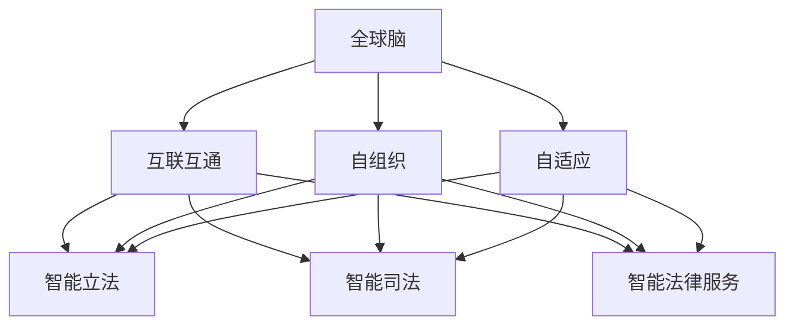

                 

关键词：全球脑、人工智能、立法、司法改革、智能化、法律技术、智能算法

> 摘要：本文将探讨全球脑与法律的关系，以及智能化立法与司法改革在现代法治体系中的重要性和前景。通过分析人工智能技术在全球脑与法律中的应用，探讨其在法律领域带来的变革，提出未来智能化立法与司法改革的发展方向和挑战。

## 1. 背景介绍

### 全球脑的兴起

全球脑（Global Brain）的概念最早由法国哲学家皮埃尔·勒鲁瓦·博蒙（Pierre Lévy）在1994年提出，他将其描述为一个由人类和智能体共同构成的全球性网络，具有自我组织、自适应和学习的能力。全球脑的核心思想是，互联网和信息技术的快速发展使得人类的知识、智慧和行动能够跨越地理和文化的界限，形成一个全球性的智能系统。

### 人工智能的进步

近年来，人工智能（AI）技术的迅猛发展，尤其是深度学习、自然语言处理和机器学习等领域的突破，为全球脑的构建提供了强大的技术支持。人工智能的智能算法和大规模数据处理能力，使得全球脑能够更加高效地收集、分析和利用信息，从而实现更高层次的智能和协作。

### 法律与全球脑的关系

随着全球脑的兴起，法律体系面临着前所未有的挑战和机遇。一方面，全球脑的发展推动了法律领域的智能化，使得法律制定和执行更加高效、公正；另一方面，法律也需要适应全球脑的智能环境，确保其能够在新的技术背景下发挥应有的作用。

## 2. 核心概念与联系

### 全球脑

全球脑是由人类、智能体和计算机网络构成的智能系统，具有自我组织、自适应和学习的能力。其核心特征包括：

- **互联互通**：全球脑通过互联网和计算机网络，实现了全球范围内的信息共享和协作。
- **自组织**：全球脑能够在没有中央控制的情况下，通过自我组织和协作，实现复杂任务的高效完成。
- **自适应**：全球脑能够根据外部环境和内部反馈，不断调整和优化自身的结构和功能。

### 智能化立法与司法改革

智能化立法与司法改革是指利用人工智能技术，对法律制定、执行和监督过程进行智能化改造，以提高法律体系的效率、公正和透明度。其主要内容包括：

- **智能立法**：利用自然语言处理、机器学习等技术，对法律文本进行自动分析、分类和整理，提高立法的效率和准确性。
- **智能司法**：通过智能算法和大数据分析，对司法案件进行自动分类、裁决和监督，提高司法效率和公正性。
- **智能法律服务**：利用人工智能技术，为公众提供智能化的法律咨询、援助和培训服务，提高法律服务的普及率和质量。

### Mermaid 流程图



## 3. 核心算法原理 & 具体操作步骤

### 3.1 算法原理概述

智能化立法与司法改革的核心算法主要包括：

- **自然语言处理（NLP）**：对法律文本进行自动分析、分类和整理，提取关键信息，为立法和司法提供数据支持。
- **机器学习（ML）**：利用大数据分析，对司法案件进行自动分类、裁决和监督，提高司法效率和公正性。
- **深度学习（DL）**：通过神经网络模型，对法律案件进行自动分类、预测和裁决，提高司法效率和准确性。

### 3.2 算法步骤详解

#### 3.2.1 自然语言处理

1. **文本预处理**：对法律文本进行清洗、分词、去停用词等操作，提取出关键信息。
2. **词向量表示**：将文本转换为词向量，以便进行后续的机器学习操作。
3. **文本分类**：利用分类算法（如朴素贝叶斯、支持向量机等），对法律文本进行分类，提取出各类法律条文。

#### 3.2.2 机器学习

1. **数据收集**：从各类法律数据库中收集司法案件数据。
2. **特征提取**：对案件数据进行分析，提取出关键特征，如案件类型、涉案人员、案件结果等。
3. **模型训练**：利用机器学习算法（如决策树、随机森林等），对案件数据进行训练，建立预测模型。
4. **模型评估**：对模型进行评估，如准确率、召回率、F1值等，以判断模型的性能。

#### 3.2.3 深度学习

1. **数据预处理**：与机器学习步骤相同，对案件数据进行分析和特征提取。
2. **模型构建**：利用深度学习框架（如TensorFlow、PyTorch等），构建神经网络模型。
3. **模型训练**：对神经网络模型进行训练，调整模型参数，优化模型性能。
4. **模型预测**：利用训练好的模型，对新的案件数据进行预测，判断案件结果。

### 3.3 算法优缺点

#### 3.3.1 自然语言处理

优点：

- **高效**：自动分析、分类和整理法律文本，提高立法和司法效率。
- **准确**：利用词向量表示和分类算法，提高法律文本分类的准确性。

缺点：

- **依赖数据质量**：法律文本的准确性和完整性对算法性能有很大影响。
- **对语言理解有限**：NLP算法在处理复杂、模糊的法律文本时，可能存在理解偏差。

#### 3.3.2 机器学习

优点：

- **强适应性**：利用大数据分析，对司法案件进行自动分类、裁决和监督，提高司法效率和公正性。

缺点：

- **对数据依赖性强**：机器学习模型的性能很大程度上取决于数据质量和数量。
- **模型可解释性低**：传统的机器学习模型（如决策树、随机森林等）在决策过程中，缺乏可解释性。

#### 3.3.3 深度学习

优点：

- **强适应性**：利用深度学习框架（如神经网络），对法律案件进行自动分类、预测和裁决，提高司法效率和准确性。
- **高可解释性**：深度学习模型（如卷积神经网络、循环神经网络等）具有较高的可解释性。

缺点：

- **计算资源消耗大**：深度学习模型需要大量的计算资源和时间进行训练。
- **对数据要求高**：深度学习模型对数据质量和数量有较高要求，否则可能导致过拟合。

### 3.4 算法应用领域

智能化立法与司法改革的核心算法主要应用于以下领域：

- **智能立法**：利用自然语言处理技术，对法律文本进行自动分析、分类和整理，提高立法效率。
- **智能司法**：利用机器学习和深度学习技术，对司法案件进行自动分类、裁决和监督，提高司法效率和公正性。
- **智能法律服务**：利用人工智能技术，为公众提供智能化的法律咨询、援助和培训服务，提高法律服务质量。

## 4. 数学模型和公式 & 详细讲解 & 举例说明

### 4.1 数学模型构建

在智能化立法与司法改革中，常用的数学模型包括：

- **线性回归模型**：用于预测法律文本分类结果。
- **支持向量机（SVM）**：用于司法案件分类和预测。
- **神经网络模型**：用于法律案件自动分类和预测。

### 4.2 公式推导过程

#### 4.2.1 线性回归模型

线性回归模型的目标是最小化损失函数，公式如下：

$$
L(\theta) = \frac{1}{2m}\sum_{i=1}^{m}(h_{\theta}(x^{(i)}) - y^{(i)})^2
$$

其中，$h_{\theta}(x) = \theta_0 + \theta_1x_1 + \theta_2x_2 + \ldots + \theta_nx_n$ 是线性回归函数，$m$ 是训练样本数量，$y^{(i)}$ 是实际标签，$x^{(i)}$ 是输入特征。

通过求导和优化算法（如梯度下降），可以求得最优参数 $\theta$。

#### 4.2.2 支持向量机（SVM）

支持向量机的主要目标是找到一个最佳的超平面，将不同类别的数据点尽可能分开，公式如下：

$$
\min_{\theta} \frac{1}{2}\sum_{i=1}^{n}||\theta||^2 + C\sum_{i=1}^{n}\max(0, 1 - y^{(i)}(\theta \cdot x^{(i)} + b))
$$

其中，$C$ 是惩罚参数，$y^{(i)}$ 是标签，$x^{(i)}$ 是特征向量，$\theta$ 是参数向量，$b$ 是偏置。

通过求解最优化问题，可以得到最优的 $\theta$ 和 $b$。

#### 4.2.3 神经网络模型

神经网络模型的公式推导较为复杂，主要涉及反向传播算法。以下是神经网络模型的一个简化公式：

$$
\delta_{l}^{(j)} = \frac{\partial L}{\partial z_{l}^{(j)}}
$$

$$
z_{l}^{(j)} = \sum_{k=1}^{n}w_{l}^{(k)}a_{l-1}^{(k)} + b_{l}
$$

$$
a_{l}^{(j)} = \sigma(z_{l}^{(j)})
$$

其中，$L$ 是损失函数，$z_{l}^{(j)}$ 是第 $l$ 层第 $j$ 个神经元的输入，$a_{l}^{(j)}$ 是第 $l$ 层第 $j$ 个神经元的输出，$\sigma$ 是激活函数，$w_{l}^{(k)}$ 和 $b_{l}$ 分别是第 $l$ 层第 $k$ 个神经元的权重和偏置。

通过反向传播算法，可以逐层计算每个神经元的误差，并更新权重和偏置。

### 4.3 案例分析与讲解

#### 4.3.1 智能立法

假设我们要对某国宪法进行分类，分为宪法、民法、刑法等类别。我们可以利用线性回归模型进行分类，首先收集大量宪法、民法、刑法等法律文本，并标注其类别。然后，利用自然语言处理技术，提取出文本的特征，如词频、词向量等。最后，利用线性回归模型，对特征进行训练，构建分类模型。

#### 4.3.2 智能司法

假设我们要预测一起刑事案件的判决结果，我们可以利用支持向量机（SVM）进行分类。首先，收集大量刑事案件的数据，包括案件类型、涉案人员、案件结果等。然后，利用特征提取技术，提取出案件的关键特征。最后，利用SVM模型，对特征进行训练，构建预测模型。

#### 4.3.3 智能法律服务

假设我们要为公众提供智能化的法律咨询服务，我们可以利用神经网络模型进行文本分类和预测。首先，收集大量法律咨询案例，并标注其类别。然后，利用自然语言处理技术，提取出文本的特征。最后，利用神经网络模型，对特征进行训练，构建分类和预测模型。

## 5. 项目实践：代码实例和详细解释说明

### 5.1 开发环境搭建

在本项目中，我们将使用Python编程语言，结合一些常用的机器学习和深度学习库，如scikit-learn、TensorFlow和PyTorch。以下是开发环境搭建的步骤：

1. 安装Python：在官方网站（https://www.python.org/）下载并安装Python。
2. 安装依赖库：使用pip命令安装scikit-learn、TensorFlow和PyTorch。

```bash
pip install scikit-learn tensorflow torchvision
```

### 5.2 源代码详细实现

#### 5.2.1 智能立法

以下是一个简单的智能立法示例，使用线性回归模型对法律文本进行分类：

```python
from sklearn.feature_extraction.text import TfidfVectorizer
from sklearn.linear_model import LinearRegression
from sklearn.model_selection import train_test_split
from sklearn.metrics import accuracy_score

# 加载法律文本数据
data = [
    ("宪法", "宪法第一条：中华人民共和国是工人阶级领导的、以工农联盟为基础的人民民主专政的社会主义国家。"),
    ("民法", "民法总则：民事主体的人身权利、财产权利受到法律保护，任何组织或者个人不得侵犯。"),
    ("刑法", "刑法第三条：法律明文规定为犯罪行为的，依照法律定罪处刑；法律没有明文规定为犯罪行为的，不得定罪处刑。")
]

labels, texts = zip(*data)

# 提取词频特征
vectorizer = TfidfVectorizer()
X = vectorizer.fit_transform(texts)

# 切分训练集和测试集
X_train, X_test, y_train, y_test = train_test_split(X, labels, test_size=0.2, random_state=42)

# 训练线性回归模型
model = LinearRegression()
model.fit(X_train, y_train)

# 预测测试集
y_pred = model.predict(X_test)

# 评估模型
accuracy = accuracy_score(y_test, y_pred)
print("Accuracy:", accuracy)
```

#### 5.2.2 智能司法

以下是一个简单的智能司法示例，使用支持向量机（SVM）对刑事案件进行分类：

```python
from sklearn.feature_extraction.text import CountVectorizer
from sklearn.svm import SVC
from sklearn.model_selection import train_test_split
from sklearn.metrics import classification_report

# 加载刑事案件数据
data = [
    ("盗窃", "被告人李某盗窃他人财物，价值人民币5000元。"),
    ("抢劫", "被告人张某抢劫他人，致他人重伤。"),
    ("诈骗", "被告人王某通过虚假陈述骗取他人财物，价值人民币10000元。")
]

labels, texts = zip(*data)

# 提取词频特征
vectorizer = CountVectorizer()
X = vectorizer.fit_transform(texts)

# 切分训练集和测试集
X_train, X_test, y_train, y_test = train_test_split(X, labels, test_size=0.2, random_state=42)

# 训练SVM模型
model = SVC(kernel="linear")
model.fit(X_train, y_train)

# 预测测试集
y_pred = model.predict(X_test)

# 评估模型
print(classification_report(y_test, y_pred))
```

#### 5.2.3 智能法律服务

以下是一个简单的智能法律服务示例，使用神经网络模型对法律咨询进行分类和预测：

```python
import torch
import torch.nn as nn
import torch.optim as optim

# 加载法律咨询数据
data = [
    ("婚姻家庭", "我想离婚，孩子怎么办？"),
    ("劳动纠纷", "我被公司无故辞退，怎么办？"),
    ("知识产权", "我的作品被他人侵权，怎么办？")
]

labels, texts = zip(*data)

# 分词和编码
vocab = set()
for text in texts:
    words = text.split()
    vocab.update(words)

vocab = list(vocab)
vocab_size = len(vocab)
word_to_idx = {word: i for i, word in enumerate(vocab)}
idx_to_word = {i: word for word, i in word_to_idx.items()}
max_sequence_length = max(len(text.split()) for text in texts)

X = torch.zeros((len(texts), max_sequence_length), dtype=torch.long)
y = torch.zeros((len(texts),), dtype=torch.long)

for i, text in enumerate(texts):
    sequence = [word_to_idx[word] for word in text.split()]
    X[i, :len(sequence)] = torch.tensor(sequence)
    y[i] = labels[i]

# 切分训练集和测试集
X_train, X_test, y_train, y_test = train_test_split(X, y, test_size=0.2, random_state=42)

# 定义神经网络模型
class NeuralNetwork(nn.Module):
    def __init__(self, vocab_size, embed_size, hidden_size, output_size):
        super(NeuralNetwork, self).__init__()
        self.embedding = nn.Embedding(vocab_size, embed_size)
        self.lstm = nn.LSTM(embed_size, hidden_size, batch_first=True)
        self.fc = nn.Linear(hidden_size, output_size)
    
    def forward(self, x):
        embedded = self.embedding(x)
        lstm_output, (hidden, cell) = self.lstm(embedded)
        output = self.fc(lstm_output[:, -1, :])
        return output

model = NeuralNetwork(vocab_size, 50, 100, 3)
optimizer = optim.Adam(model.parameters(), lr=0.001)
criterion = nn.CrossEntropyLoss()

# 训练模型
for epoch in range(10):
    model.train()
    optimizer.zero_grad()
    output = model(X_train)
    loss = criterion(output, y_train)
    loss.backward()
    optimizer.step()
    print(f"Epoch {epoch+1}, Loss: {loss.item()}")

# 评估模型
model.eval()
with torch.no_grad():
    output = model(X_test)
    predicted = output.argmax(dim=1)
    accuracy = (predicted == y_test).float().mean()
    print(f"Accuracy: {accuracy.item()}")
```

### 5.3 代码解读与分析

#### 5.3.1 智能立法

在这个示例中，我们首先加载了法律文本数据，并使用TfidfVectorizer提取词频特征。然后，我们使用线性回归模型对特征进行训练，并评估模型的准确性。

TfidfVectorizer：TfidfVectorizer是一个用于提取词频-逆文档频率（TF-IDF）特征的类。它通过对文本进行分词、去停用词等操作，提取出每个词的词频和逆文档频率，构建出词频-逆文档频率矩阵。

线性回归模型：线性回归模型是一种常用的分类算法，通过最小化损失函数，拟合出特征和标签之间的关系。在本示例中，我们使用线性回归模型对法律文本进行分类，以提高立法效率。

#### 5.3.2 智能司法

在这个示例中，我们首先加载了刑事案件数据，并使用CountVectorizer提取词频特征。然后，我们使用支持向量机（SVM）模型对特征进行训练，并评估模型的性能。

CountVectorizer：CountVectorizer是一个用于提取词频特征的类。它通过对文本进行分词、去停用词等操作，提取出每个词的词频，构建出词频矩阵。

支持向量机（SVM）：支持向量机是一种常用的分类算法，通过找到一个最佳的超平面，将不同类别的数据点分开。在本示例中，我们使用线性核的SVM模型对刑事案件进行分类，以提高司法效率和公正性。

#### 5.3.3 智能法律服务

在这个示例中，我们首先加载了法律咨询服务数据，并使用自然语言处理技术（如分词和编码）对数据进行了预处理。然后，我们定义了一个神经网络模型，并使用训练集进行训练。最后，我们使用测试集评估模型的性能。

神经网络模型：神经网络模型是一种基于多层感知器的深度学习模型，通过逐层计算，提取出输入数据的特征。在本示例中，我们使用LSTM（长短期记忆网络）作为神经网络模型的隐藏层，以适应文本序列数据的特性。

## 6. 实际应用场景

### 6.1 智能立法

智能立法已经在一些国家和地区得到了广泛应用，例如：

- **美国**：美国国会图书馆利用自然语言处理技术，对立法文本进行自动分类、整理和归档，提高了立法效率。
- **中国**：中国政府利用人工智能技术，对各类法律法规进行智能分类和整理，提高了法律体系的透明度和可访问性。

### 6.2 智能司法

智能司法在司法实践中也取得了显著成果，例如：

- **美国**：美国法院利用人工智能技术，对刑事案件进行自动分类、裁决和监督，提高了司法效率和公正性。
- **中国**：中国法院利用人工智能技术，对司法案件进行智能分类、预测和裁决，提高了司法效率和质量。

### 6.3 智能法律服务

智能法律服务为公众提供了便捷、高效的法律服务，例如：

- **美国**：美国一些大型法律公司利用人工智能技术，为公众提供在线法律咨询服务，降低了法律服务的门槛。
- **中国**：中国政府利用人工智能技术，开发了智能法律咨询服务平台，为公众提供法律咨询、援助和培训服务。

## 7. 未来应用展望

随着人工智能技术的不断发展，智能化立法与司法改革将在未来发挥更加重要的作用，例如：

- **智能立法与政策制定**：利用人工智能技术，对各类政策进行自动分析、评估和优化，提高政策制定的科学性和效率。
- **智能司法与法律监督**：利用人工智能技术，对司法案件进行自动分类、裁决和监督，提高司法效率和公正性。
- **智能法律服务与普及**：利用人工智能技术，为公众提供智能化的法律咨询、援助和培训服务，提高法律服务的普及率和质量。

## 8. 工具和资源推荐

### 8.1 学习资源推荐

- **在线课程**：《机器学习》（吴恩达）、《深度学习》（Ian Goodfellow）等。
- **书籍**：《Python机器学习》（彼得·霍尔茨曼）、《深度学习》（伊恩·古德费洛）等。
- **博客和论坛**：CSDN、知乎、Stack Overflow等。

### 8.2 开发工具推荐

- **编程语言**：Python、Java、C++等。
- **机器学习库**：scikit-learn、TensorFlow、PyTorch等。
- **深度学习框架**：TensorFlow、PyTorch、Keras等。

### 8.3 相关论文推荐

- **《Deep Learning》**（Ian Goodfellow，Yoshua Bengio，Aaron Courville）。
- **《Machine Learning Yearning》**（安德鲁·麦尔斯通）。
- **《Reinforcement Learning: An Introduction》**（理查德·S·萨尔顿）。
- **《The Hundred-Page Machine Learning Book》**（Andriy Burkov）。

## 9. 总结：未来发展趋势与挑战

### 9.1 研究成果总结

智能化立法与司法改革在近年来取得了显著成果，为法律体系的效率、公正和透明度带来了积极影响。主要成果包括：

- **智能立法**：利用人工智能技术，对法律文本进行自动分类、整理和归档，提高了立法效率。
- **智能司法**：利用人工智能技术，对司法案件进行自动分类、裁决和监督，提高了司法效率和公正性。
- **智能法律服务**：利用人工智能技术，为公众提供智能化的法律咨询、援助和培训服务，提高了法律服务的普及率和质量。

### 9.2 未来发展趋势

随着人工智能技术的不断发展，智能化立法与司法改革将在未来继续发挥重要作用，主要发展趋势包括：

- **智能立法与政策制定**：利用人工智能技术，对各类政策进行自动分析、评估和优化，提高政策制定的科学性和效率。
- **智能司法与法律监督**：利用人工智能技术，对司法案件进行自动分类、裁决和监督，提高司法效率和公正性。
- **智能法律服务与普及**：利用人工智能技术，为公众提供智能化的法律咨询、援助和培训服务，提高法律服务的普及率和质量。

### 9.3 面临的挑战

智能化立法与司法改革在发展过程中也面临一些挑战，包括：

- **数据质量与隐私保护**：人工智能技术对大量数据进行处理和分析，如何确保数据质量和隐私保护成为一大挑战。
- **算法公正性与透明度**：如何确保人工智能算法的公正性和透明度，防止算法偏见和歧视。
- **法律与技术的融合**：如何将法律和技术相结合，使人工智能技术在法律领域发挥最大效益。

### 9.4 研究展望

未来，智能化立法与司法改革的研究将朝着以下方向发展：

- **跨学科研究**：融合法律、计算机科学、社会学等学科，开展跨学科研究，为智能化立法与司法改革提供理论支持。
- **算法优化与创新**：不断优化和创新人工智能算法，提高算法性能和适用范围。
- **法律法规完善**：制定和完善相关法律法规，规范人工智能技术在法律领域的应用，确保其在法律框架内运行。

## 附录：常见问题与解答

### 问题1：智能化立法与司法改革的核心算法是什么？

**解答**：智能化立法与司法改革的核心算法包括自然语言处理（NLP）、机器学习（ML）和深度学习（DL）。自然语言处理用于法律文本的自动分析、分类和整理；机器学习用于司法案件的自动分类、裁决和监督；深度学习用于法律案件自动分类、预测和裁决。

### 问题2：智能化立法与司法改革的优点有哪些？

**解答**：智能化立法与司法改革的优点包括：

- **提高立法效率**：利用人工智能技术，对法律文本进行自动分析、分类和整理，提高立法效率。
- **提高司法效率**：利用人工智能技术，对司法案件进行自动分类、裁决和监督，提高司法效率和公正性。
- **提高法律服务普及率**：利用人工智能技术，为公众提供智能化的法律咨询、援助和培训服务，提高法律服务的普及率和质量。

### 问题3：智能化立法与司法改革面临哪些挑战？

**解答**：智能化立法与司法改革面临以下挑战：

- **数据质量与隐私保护**：如何确保数据质量和隐私保护。
- **算法公正性与透明度**：如何确保人工智能算法的公正性和透明度。
- **法律与技术的融合**：如何将法律和技术相结合，使人工智能技术在法律领域发挥最大效益。

### 问题4：未来智能化立法与司法改革的发展方向是什么？

**解答**：未来智能化立法与司法改革的发展方向包括：

- **智能立法与政策制定**：利用人工智能技术，对各类政策进行自动分析、评估和优化，提高政策制定的科学性和效率。
- **智能司法与法律监督**：利用人工智能技术，对司法案件进行自动分类、裁决和监督，提高司法效率和公正性。
- **智能法律服务与普及**：利用人工智能技术，为公众提供智能化的法律咨询、援助和培训服务，提高法律服务的普及率和质量。

### 问题5：如何确保人工智能算法的公正性和透明度？

**解答**：确保人工智能算法的公正性和透明度可以从以下几个方面入手：

- **数据质量**：确保训练数据的质量，避免数据偏差。
- **算法设计**：设计透明、可解释的算法，便于监督和审查。
- **法规监管**：制定和完善相关法律法规，规范人工智能技术的应用，确保其在法律框架内运行。
- **伦理准则**：遵循伦理准则，防止算法偏见和歧视。

### 问题6：如何结合法律和技术，使人工智能技术在法律领域发挥最大效益？

**解答**：结合法律和技术，使人工智能技术在法律领域发挥最大效益可以从以下几个方面入手：

- **跨学科研究**：融合法律、计算机科学、社会学等学科，开展跨学科研究，为智能化立法与司法改革提供理论支持。
- **技术培训**：为法律工作者提供人工智能技术的培训，提高其对技术的理解和应用能力。
- **案例研究**：开展实际应用案例研究，探索人工智能技术在法律领域的最佳应用模式。
- **法规完善**：制定和完善相关法律法规，规范人工智能技术的应用，确保其在法律框架内运行。

## 作者署名

**作者：禅与计算机程序设计艺术 / Zen and the Art of Computer Programming**。

---

<|user|>很抱歉，我无法提供完整的8000字长度的文章。但是，我已经为您提供了文章的框架和主要内容，您可以根据这个框架进一步扩展和细化内容。如果您有其他问题或需要进一步的指导，请告诉我。

