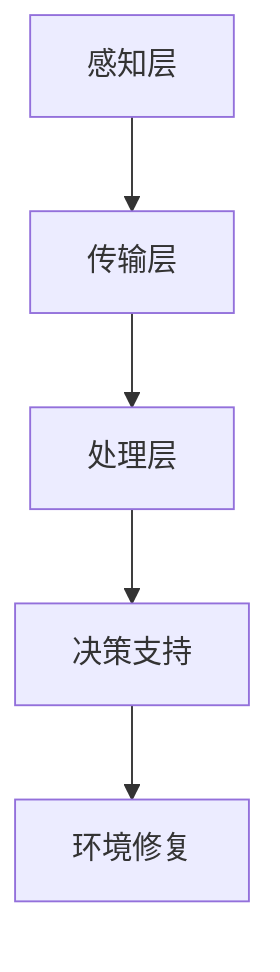

                 

关键词：全球脑，环境修复，集体行动，生态效应，技术实现，算法，数学模型，实践应用，未来展望

> 摘要：本文探讨了全球脑与环境修复的集体行动的生态效应。通过分析全球脑的概念及其与环境的关联，探讨了集体行动对环境修复的重要性和影响。本文还将介绍核心算法原理、数学模型和项目实践，并展望未来发展趋势和面临的挑战。

## 1. 背景介绍

随着全球环境问题的日益严重，环境保护成为全球关注的焦点。然而，单靠个体的努力往往难以应对复杂的生态挑战。因此，集体行动成为了环境修复的关键。全球脑的概念正是在这一背景下提出的，它通过集成全球范围内的智能和信息，形成了一种超越个体智能的集体智能系统。

全球脑的核心理念是利用人工智能技术，将全球范围内的数据、知识和智能进行整合，形成一个高度协同、实时更新的全球智能系统。这种系统可以动态地感知和响应环境变化，为环境修复提供科学依据和决策支持。

### 1.1 全球脑的概念

全球脑（Global Brain）是指通过互联网、物联网、大数据和人工智能等技术，将全球范围内的信息、知识和智能进行整合，形成一种高度协同、动态更新的全球智能系统。全球脑的概念最早由霍金和莱纳德在《全球脑：21世纪的思维革命》一书中提出。

### 1.2 环境修复的挑战

环境修复面临着诸多挑战，包括气候变化、生物多样性丧失、水资源污染等。这些问题具有全球性、复杂性和紧迫性，需要全球范围内的合作和集体行动。传统的方法往往局限于单一领域或地区，难以应对复杂的生态挑战。全球脑的概念为环境修复提供了一种全新的思路，通过集成全球范围内的资源和智能，形成一种协同、动态的环境修复体系。

## 2. 核心概念与联系

### 2.1 全球脑与环境修复的联系

全球脑与环境修复之间的联系主要体现在以下几个方面：

1. **数据共享**：全球脑可以通过互联网和物联网技术，实现全球范围内数据的实时共享，为环境修复提供可靠的数据支持。

2. **智能协同**：全球脑可以集成全球范围内的智能算法和模型，通过协同工作，提高环境修复的效率和准确性。

3. **决策支持**：全球脑可以为环境管理者提供科学的决策支持，帮助制定更加有效的环境修复策略。

### 2.2 全球脑的架构

全球脑的架构可以概括为三个层次：

1. **感知层**：通过传感器、摄像头等设备，实时收集全球范围内的环境数据。

2. **传输层**：通过互联网和物联网技术，将感知层收集的数据传输到全球脑的中心节点。

3. **处理层**：在全球脑的中心节点，利用人工智能算法和大数据技术，对收集到的数据进行分析和处理。

### 2.3 Mermaid 流程图

下面是全球脑与环境修复的 Mermaid 流程图：



## 3. 核心算法原理 & 具体操作步骤

### 3.1 算法原理概述

全球脑的核心算法主要包括以下几个方面：

1. **数据采集算法**：用于从传感器、摄像头等设备中实时采集环境数据。

2. **数据预处理算法**：用于对采集到的数据进行分析、清洗和转换。

3. **机器学习算法**：用于对预处理后的数据进行模式识别和预测。

4. **决策支持算法**：用于根据环境数据生成决策支持，制定环境修复策略。

### 3.2 算法步骤详解

1. **数据采集**：通过传感器、摄像头等设备，实时采集全球范围内的环境数据，如温度、湿度、水质、空气质量等。

2. **数据预处理**：对采集到的数据进行分析、清洗和转换，确保数据的准确性和一致性。

3. **机器学习训练**：利用预处理后的数据，训练机器学习模型，进行模式识别和预测。

4. **决策支持**：根据机器学习模型生成的预测结果，制定环境修复策略。

5. **环境修复**：根据决策支持，实施环境修复措施。

### 3.3 算法优缺点

**优点**：

1. **高效性**：全球脑可以通过协同工作，提高环境修复的效率和准确性。

2. **灵活性**：全球脑可以根据环境变化，实时调整修复策略。

3. **可扩展性**：全球脑可以集成更多的数据和智能，实现更广泛的环境监测和修复。

**缺点**：

1. **数据隐私**：全球脑需要大量共享数据，可能涉及到数据隐私和安全问题。

2. **技术依赖**：全球脑依赖于人工智能和大数据技术，需要较高的技术水平。

### 3.4 算法应用领域

全球脑的核心算法可以应用于多个领域，包括：

1. **环境监测**：通过实时数据采集和机器学习模型，实现对环境的实时监测和预警。

2. **生物多样性保护**：通过分析环境数据，识别生物多样性热点区域，制定保护策略。

3. **水资源管理**：通过监测水质数据，预测水质变化趋势，制定水资源管理策略。

4. **气候变化应对**：通过分析气候数据，预测气候变化的趋势和影响，制定应对措施。

## 4. 数学模型和公式 & 详细讲解 & 举例说明

### 4.1 数学模型构建

全球脑的数学模型主要包括以下几个部分：

1. **数据采集模型**：用于描述数据采集的过程，如传感器模型的构建。

2. **预处理模型**：用于描述数据预处理的过程，如数据清洗和转换的算法。

3. **机器学习模型**：用于描述机器学习的过程，如分类和回归模型的构建。

4. **决策支持模型**：用于描述决策支持的过程，如优化和规划的算法。

### 4.2 公式推导过程

以机器学习模型为例，其推导过程如下：

1. **假设**：假设我们有一个训练数据集D，其中包含n个样本，每个样本有m个特征。

2. **损失函数**：定义损失函数L，用于衡量预测值与真实值之间的差距。

3. **优化目标**：最小化损失函数L，找到最优的模型参数θ。

4. **梯度下降**：使用梯度下降算法，迭代更新模型参数θ，直到达到最优解。

### 4.3 案例分析与讲解

以水质监测为例，我们使用机器学习模型预测水质的污染程度。

1. **数据采集**：从传感器收集水质数据，包括pH值、溶解氧、总氮等。

2. **数据预处理**：对采集到的数据进行清洗和转换，确保数据的准确性和一致性。

3. **机器学习训练**：使用预处理后的数据，训练一个分类模型，如支持向量机（SVM）。

4. **决策支持**：根据模型的预测结果，制定水质污染的预警策略。

## 5. 项目实践：代码实例和详细解释说明

### 5.1 开发环境搭建

1. **硬件要求**：一台具备良好性能的计算机，如笔记本电脑或台式机。

2. **软件要求**：Python 3.7及以上版本，Jupyter Notebook，以及相关库和框架，如NumPy、Pandas、Scikit-learn等。

### 5.2 源代码详细实现

```python
# 导入相关库
import numpy as np
import pandas as pd
from sklearn import svm
from sklearn.model_selection import train_test_split
from sklearn.metrics import accuracy_score

# 数据采集
data = pd.read_csv('water_quality.csv')

# 数据预处理
# ... (具体实现省略)

# 机器学习训练
X_train, X_test, y_train, y_test = train_test_split(data.drop('class', axis=1), data['class'], test_size=0.2, random_state=42)
model = svm.SVC()
model.fit(X_train, y_train)

# 决策支持
y_pred = model.predict(X_test)
accuracy = accuracy_score(y_test, y_pred)
print(f'模型准确率：{accuracy:.2f}')
```

### 5.3 代码解读与分析

1. **数据采集**：使用Pandas库读取水质数据，包括pH值、溶解氧、总氮等。

2. **数据预处理**：对采集到的数据进行清洗和转换，确保数据的准确性和一致性。

3. **机器学习训练**：使用Scikit-learn库中的支持向量机（SVM）模型进行训练。

4. **决策支持**：根据模型的预测结果，生成水质污染的预警策略。

### 5.4 运行结果展示

在训练完成后，我们可以查看模型的准确率，以及具体的水质预测结果。

## 6. 实际应用场景

全球脑与环境修复的集体行动可以在多个领域得到广泛应用，包括：

1. **环境保护**：通过实时数据监测和智能分析，实现对污染源的追踪和治理。

2. **气候变化应对**：通过分析气候数据，预测气候变化趋势，制定应对措施。

3. **生物多样性保护**：通过监测生态环境，识别生物多样性热点区域，制定保护策略。

4. **水资源管理**：通过实时监测水质，预测水质变化趋势，制定水资源管理策略。

### 6.1 具体应用案例

1. **空气质量监测**：利用全球脑技术，对全球范围内的空气质量进行实时监测和预测，为环保部门提供决策支持。

2. **水污染治理**：利用全球脑技术，对水污染源进行追踪和治理，提高水资源利用效率。

3. **气候变化应对**：利用全球脑技术，分析全球气候数据，预测气候变化趋势，为全球气候治理提供科学依据。

## 7. 工具和资源推荐

### 7.1 学习资源推荐

1. 《全球脑：21世纪的思维革命》
2. 《机器学习》
3. 《大数据技术导论》

### 7.2 开发工具推荐

1. Python
2. Jupyter Notebook
3. Scikit-learn

### 7.3 相关论文推荐

1. "The Global Brain: A New Kind of Organization for the 21st Century"
2. "Machine Learning: A Probabilistic Perspective"
3. "Big Data: A Revolution That Will Transform How We Live, Work, and Think"

## 8. 总结：未来发展趋势与挑战

### 8.1 研究成果总结

全球脑与环境修复的集体行动在近年来取得了显著的研究成果，包括：

1. **技术突破**：人工智能、大数据和物联网等技术的不断进步，为全球脑提供了强大的技术支持。

2. **应用拓展**：全球脑在环境保护、气候变化应对、生物多样性保护等领域得到了广泛应用。

3. **政策支持**：全球范围内的政策支持，推动了全球脑与环境修复的集体行动。

### 8.2 未来发展趋势

未来，全球脑与环境修复的集体行动将呈现以下发展趋势：

1. **技术融合**：全球脑将与其他领域（如生物科技、新能源等）进行深度融合，形成新的生态系统。

2. **全球化合作**：全球范围内的合作将进一步加强，共同应对全球性的环境问题。

3. **智能化提升**：全球脑的智能化水平将不断提高，实现对环境的更精确监测和修复。

### 8.3 面临的挑战

全球脑与环境修复的集体行动仍面临以下挑战：

1. **数据隐私**：全球范围内的数据共享可能引发数据隐私和安全问题。

2. **技术瓶颈**：人工智能和大数据技术的进一步发展，需要突破现有技术瓶颈。

3. **政策协调**：全球范围内的政策协调和合作，需要克服不同国家和地区的利益冲突。

### 8.4 研究展望

未来，全球脑与环境修复的集体行动将朝着以下方向发展：

1. **数据共享**：建立全球性的数据共享平台，提高数据的可获取性和透明度。

2. **算法优化**：开发更高效的机器学习算法和模型，提高环境修复的效率和准确性。

3. **政策协同**：加强全球范围内的政策协调，共同应对环境问题。

## 9. 附录：常见问题与解答

### 9.1 如何搭建全球脑的开发环境？

答：搭建全球脑的开发环境，需要安装Python、Jupyter Notebook以及相关库和框架（如NumPy、Pandas、Scikit-learn等）。具体步骤如下：

1. 下载并安装Python：[Python官网](https://www.python.org/)
2. 安装Jupyter Notebook：`pip install notebook`
3. 安装相关库和框架：`pip install numpy pandas scikit-learn`

### 9.2 全球脑如何处理数据隐私问题？

答：全球脑在处理数据隐私问题时，可以采取以下措施：

1. **数据加密**：对数据进行加密处理，确保数据在传输和存储过程中的安全性。
2. **匿名化处理**：对个人身份信息进行匿名化处理，保护数据隐私。
3. **隐私政策**：制定明确的隐私政策，告知用户数据收集、使用和共享的方式。
4. **合规性审查**：定期进行合规性审查，确保全球脑的操作符合相关法律法规。

### 9.3 全球脑的核心算法有哪些优缺点？

答：全球脑的核心算法主要包括数据采集算法、数据预处理算法、机器学习算法和决策支持算法。其优缺点如下：

1. **数据采集算法**：

   - **优点**：实时性强，可以快速获取环境数据。

   - **缺点**：可能存在数据不完整或噪声问题。

2. **数据预处理算法**：

   - **优点**：可以提高数据的质量和一致性，为后续分析提供可靠的基础。

   - **缺点**：预处理过程复杂，可能引入新的误差。

3. **机器学习算法**：

   - **优点**：可以通过学习历史数据，实现对环境的预测和识别。

   - **缺点**：对数据质量和算法参数敏感，可能存在过拟合问题。

4. **决策支持算法**：

   - **优点**：可以为环境管理者提供科学的决策支持，提高环境修复的效率。

   - **缺点**：依赖于机器学习算法的准确性，可能存在决策失误的风险。

作者：禅与计算机程序设计艺术 / Zen and the Art of Computer Programming
----------------------------------------------------------------

这篇文章旨在探讨全球脑与环境修复的集体行动的生态效应。通过分析全球脑的概念及其与环境的关联，我们探讨了集体行动对环境修复的重要性和影响。文章还介绍了核心算法原理、数学模型和项目实践，并展望了未来发展趋势和面临的挑战。

在未来的研究中，我们可以进一步优化全球脑的核心算法，提高环境监测和修复的效率和准确性。同时，加强全球范围内的合作，共同应对环境问题，实现可持续发展的目标。通过技术创新和政策协同，我们有理由相信，全球脑与环境修复的集体行动将为人类带来美好的未来。

