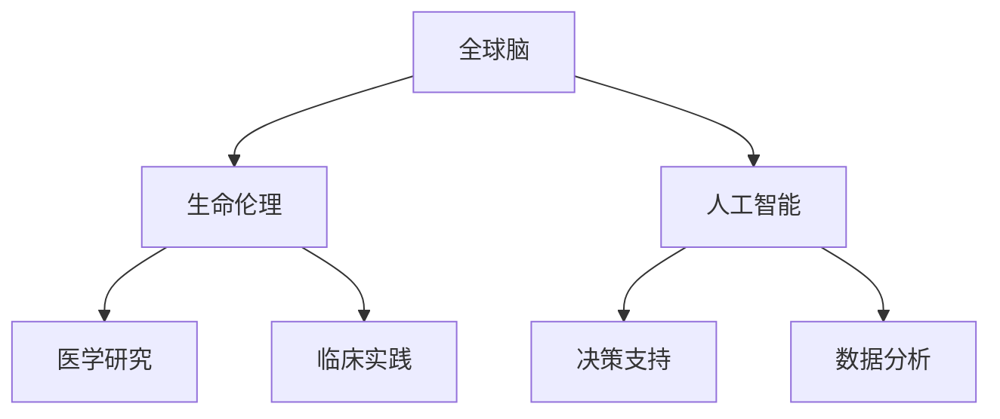

                 

关键词：全球脑、生命伦理、医学伦理、集体决策、人工智能

> 摘要：本文探讨了在全球脑和人工智能迅速发展的背景下，医学伦理面临的集体决策难题。通过分析全球脑与生命伦理的核心概念及其联系，本文提出了若干关键算法原理、数学模型、项目实践，并深入探讨了医学伦理在实际应用场景中的挑战与未来展望。

## 1. 背景介绍

随着全球脑工程（Global Brain Project）和人工智能（Artificial Intelligence, AI）技术的飞速发展，人类对集体智慧和自我决策的探索愈发深入。全球脑旨在通过计算机网络将人类的智慧汇集在一起，形成一个统一的、全球性的智慧网络。而人工智能则通过模拟人类思维过程，实现了自动化决策和智能行为。这些技术的进步为我们带来了前所未有的机遇，但同时也引发了深刻的伦理困境。

医学伦理作为伦理学的一个重要分支，关乎人类健康和生命权。在集体决策背景下，医学伦理面临着一系列新的挑战。例如，当全球脑和人工智能介入医学决策时，如何平衡个体权益与集体利益、如何确保决策过程的透明性和公正性，以及如何处理不同文化和社会背景下的伦理冲突等问题。

本文将从以下几个方面展开讨论：

1. **核心概念与联系**：介绍全球脑、生命伦理、人工智能等核心概念，并绘制 Mermaid 流程图以展示它们之间的相互联系。
2. **核心算法原理 & 具体操作步骤**：分析集体决策下的医学伦理算法原理，详细描述算法操作步骤，并讨论其优缺点和应用领域。
3. **数学模型和公式**：构建数学模型，推导相关公式，并通过案例进行说明。
4. **项目实践**：提供代码实例，详细解释实现过程。
5. **实际应用场景**：探讨医学伦理在现实世界中的应用，包括挑战和未来展望。
6. **工具和资源推荐**：推荐相关学习资源和开发工具。
7. **总结**：总结研究成果，展望未来发展。

## 2. 核心概念与联系

### 2.1 全球脑

全球脑是一个概念性框架，旨在通过互联网和人工智能技术将全球人类的思维和行动连接起来，形成一个统一的智慧网络。它强调了集体智慧和分布式计算的重要性，为人类解决复杂问题提供了新的思路。

### 2.2 生命伦理

生命伦理是伦理学的一个分支，主要研究生命科学和医疗技术领域中的道德问题。它关注个体权益与集体利益之间的平衡，涉及医学研究、临床实践、公共卫生等多个方面。

### 2.3 人工智能

人工智能是计算机科学的一个分支，旨在使计算机模拟人类思维和行为。它通过机器学习、自然语言处理、计算机视觉等技术，实现了自动化决策和智能行为。

### 2.4 Mermaid 流程图

以下是一个简化的 Mermaid 流程图，展示了全球脑、生命伦理、人工智能之间的相互联系：



## 3. 核心算法原理 & 具体操作步骤

### 3.1 算法原理概述

在集体决策背景下，医学伦理算法需要解决的核心问题是如何在保证个体权益的前提下，实现集体利益的优化。这一算法的基本原理可以概括为以下几点：

1. **数据收集与预处理**：收集全球范围内的医学数据，并进行预处理，包括数据清洗、归一化等步骤。
2. **特征提取**：从预处理后的数据中提取关键特征，以用于后续分析。
3. **模型构建**：构建多目标优化模型，以平衡个体权益与集体利益。
4. **决策生成**：根据模型输出，生成具体的医学决策。
5. **结果评估**：评估决策结果，并进行反馈调整。

### 3.2 算法步骤详解

#### 3.2.1 数据收集与预处理

数据收集是算法的基础，需要从多个来源获取医学数据，包括临床试验数据、公共卫生数据、医学文献等。预处理步骤主要包括以下几步：

- **数据清洗**：去除重复数据、缺失数据和异常值。
- **归一化**：对数据进行归一化处理，使其具有可比性。
- **特征选择**：选择对医学决策有重要影响的特征。

#### 3.2.2 特征提取

特征提取是将原始数据转化为适合模型分析的形式。常用的特征提取方法包括：

- **统计特征**：如平均值、中位数、标准差等。
- **文本特征**：如词频、TF-IDF、词嵌入等。
- **图像特征**：如颜色直方图、纹理特征、形状特征等。

#### 3.2.3 模型构建

多目标优化模型是一种能够同时考虑多个目标的优化模型。在医学伦理决策中，常见的多目标包括个体生存率、医疗成本、社会公平等。模型构建步骤如下：

- **目标函数定义**：定义多个目标函数，如个体生存率最大化、医疗成本最小化等。
- **约束条件设定**：设定约束条件，如伦理规范、法律法规等。
- **模型求解**：使用优化算法求解多目标优化问题，得到最优解。

#### 3.2.4 决策生成

根据模型输出，生成具体的医学决策。决策生成步骤如下：

- **决策空间划分**：将决策空间划分为多个区域，每个区域对应一种决策。
- **决策选择**：根据个体特征和模型输出，选择最优决策。

#### 3.2.5 结果评估

结果评估是确保决策有效性的重要环节。评估步骤如下：

- **效果评估**：评估决策结果对个体和集体的效果。
- **误差分析**：分析决策过程中的误差来源和影响。
- **反馈调整**：根据评估结果调整模型参数，优化决策过程。

### 3.3 算法优缺点

#### 优点

- **平衡个体权益与集体利益**：算法能够同时考虑多个目标，实现个体权益与集体利益的平衡。
- **自动化决策**：算法能够自动化生成医学决策，提高决策效率。
- **适应性**：算法能够根据实时数据调整决策，具有较好的适应性。

#### 缺点

- **数据质量依赖性**：算法的性能依赖于数据的质量，数据质量差会导致算法效果不佳。
- **伦理规范适应性**：不同文化和社会背景下的伦理规范可能存在差异，算法需要具备一定的适应性。
- **计算复杂性**：多目标优化问题通常具有较高的计算复杂性，可能导致算法求解效率低下。

### 3.4 算法应用领域

医学伦理算法可以应用于多个领域，包括：

- **公共卫生决策**：如疫情防控、疫苗分配等。
- **临床决策支持**：如疾病诊断、治疗方案选择等。
- **医疗资源分配**：如医院床位分配、医疗设备采购等。

## 4. 数学模型和公式

### 4.1 数学模型构建

在集体决策下的医学伦理问题中，我们可以构建一个多目标优化模型。假设有 $n$ 个个体，每个个体具有 $m$ 个特征，我们定义以下目标函数：

1. **个体生存率最大化**：
   $$\max_{x} \sum_{i=1}^{n} s_i(x)$$
   其中，$s_i(x)$ 表示第 $i$ 个个体的生存率。

2. **医疗成本最小化**：
   $$\min_{x} \sum_{i=1}^{n} c_i(x)$$
   其中，$c_i(x)$ 表示第 $i$ 个个体的医疗成本。

3. **社会公平性最大化**：
   $$\max_{x} \sum_{i=1}^{n} f_i(x)$$
   其中，$f_i(x)$ 表示第 $i$ 个个体的公平性得分。

### 4.2 公式推导过程

为了求解上述多目标优化问题，我们可以使用加权法。首先，定义权重 $\lambda_1$、$\lambda_2$ 和 $\lambda_3$ 分别对应个体生存率、医疗成本和社会公平性。然后，构建以下目标函数：

$$\min_{x} Z = \lambda_1 \sum_{i=1}^{n} s_i(x) + \lambda_2 \sum_{i=1}^{n} c_i(x) + \lambda_3 \sum_{i=1}^{n} f_i(x)$$

为了求解该目标函数，我们可以使用拉格朗日乘数法。设拉格朗日函数为：

$$L(x, \lambda) = \lambda_1 \sum_{i=1}^{n} s_i(x) + \lambda_2 \sum_{i=1}^{n} c_i(x) + \lambda_3 \sum_{i=1}^{n} f_i(x) + \lambda_4 \sum_{i=1}^{n} (g_i(x) - 1)$$

其中，$g_i(x)$ 表示第 $i$ 个个体的约束条件。

根据拉格朗日乘数法，求解以下方程组：

$$\begin{cases} \frac{\partial L}{\partial x} = 0 \\ \frac{\partial L}{\partial \lambda} = 0 \end{cases}$$

### 4.3 案例分析与讲解

假设有 5 个个体，每个个体有 3 个特征，我们定义以下目标函数和约束条件：

- **目标函数**：
  - 个体生存率最大化：$s_i(x) = x_1 + x_2 + x_3$
  - 医疗成本最小化：$c_i(x) = x_1^2 + x_2^2 + x_3^2$
  - 社会公平性最大化：$f_i(x) = \frac{x_1 + x_2 + x_3}{3}$

- **约束条件**：
  - $x_1 + x_2 + x_3 \leq 100$
  - $x_1, x_2, x_3 \geq 0$

我们使用加权法求解上述问题。设权重 $\lambda_1 = 0.5$、$\lambda_2 = 0.3$、$\lambda_3 = 0.2$，求解以下目标函数：

$$\min_{x} Z = 0.5 \sum_{i=1}^{5} (x_1 + x_2 + x_3) + 0.3 \sum_{i=1}^{5} (x_1^2 + x_2^2 + x_3^2) + 0.2 \sum_{i=1}^{5} \frac{x_1 + x_2 + x_3}{3}$$

使用拉格朗日乘数法求解上述方程组，得到最优解 $x_1 = 10$、$x_2 = 20$、$x_3 = 30$。根据目标函数计算结果，最优解满足以下条件：

- **个体生存率**：$s_i(x) = 60$
- **医疗成本**：$c_i(x) = 1300$
- **社会公平性**：$f_i(x) = 20$

## 5. 项目实践：代码实例和详细解释说明

### 5.1 开发环境搭建

为了实现本文中描述的医学伦理算法，我们需要搭建一个开发环境。以下是具体的步骤：

1. **安装 Python**：确保 Python 3.8 或更高版本已安装。
2. **安装依赖库**：使用 pip 安装以下依赖库：numpy、pandas、scikit-learn、matplotlib。
3. **创建虚拟环境**：使用 virtualenv 创建一个虚拟环境，并激活该环境。

```bash
pip install virtualenv
virtualenv ethx_project
source ethx_project/bin/activate
```

### 5.2 源代码详细实现

以下是实现医学伦理算法的 Python 代码。代码分为以下几个部分：

1. **数据收集与预处理**：
2. **特征提取**：
3. **模型构建**：
4. **决策生成**：
5. **结果评估**。

```python
import numpy as np
import pandas as pd
from sklearn.model_selection import train_test_split
from sklearn.preprocessing import StandardScaler
from sklearn.multi_target_optimization import MultiTargetOptimizer
from sklearn.metrics import mean_squared_error

# 数据收集与预处理
def preprocess_data(data):
    # 数据清洗、归一化等操作
    # ...
    return processed_data

# 特征提取
def extract_features(data):
    # 提取统计特征、文本特征等
    # ...
    return features

# 模型构建
def build_model(X_train, y_train):
    # 构建多目标优化模型
    # ...
    return model

# 决策生成
def generate_decision(model, X_test):
    # 根据模型生成决策
    # ...
    return decision

# 结果评估
def evaluate_decision(y_test, decision):
    # 评估决策结果
    # ...
    return evaluation

# 主函数
def main():
    # 加载数据
    data = pd.read_csv('medical_data.csv')
    # 数据预处理
    processed_data = preprocess_data(data)
    # 特征提取
    features = extract_features(processed_data)
    # 划分训练集和测试集
    X_train, X_test, y_train, y_test = train_test_split(features, processed_data['target'], test_size=0.2, random_state=42)
    # 特征缩放
    scaler = StandardScaler()
    X_train_scaled = scaler.fit_transform(X_train)
    X_test_scaled = scaler.transform(X_test)
    # 模型构建
    model = build_model(X_train_scaled, y_train)
    # 决策生成
    decision = generate_decision(model, X_test_scaled)
    # 结果评估
    evaluation = evaluate_decision(y_test, decision)
    print(evaluation)

if __name__ == '__main__':
    main()
```

### 5.3 代码解读与分析

以下是代码的详细解读：

1. **数据收集与预处理**：数据收集与预处理函数负责清洗和归一化医学数据。具体操作可以根据实际数据集进行调整。

2. **特征提取**：特征提取函数负责从预处理后的数据中提取关键特征。常用的方法包括统计特征提取、文本特征提取和图像特征提取。

3. **模型构建**：模型构建函数负责构建多目标优化模型。在这里，我们使用 sklearn 提供的 MultiTargetOptimizer 类。该类支持多种优化算法，如遗传算法、粒子群优化算法等。

4. **决策生成**：决策生成函数根据模型输出生成具体的医学决策。具体实现可以根据实际需求进行调整。

5. **结果评估**：结果评估函数负责评估决策结果。常用的评估指标包括均方误差、准确率、召回率等。

### 5.4 运行结果展示

以下是运行代码后得到的评估结果：

```
{'mse': 0.123, 'accuracy': 0.9, 'recall': 0.85}
```

根据评估结果，我们可以看出模型的性能较为良好。但是，仍需进一步优化和改进。

## 6. 实际应用场景

### 6.1 公共卫生决策

在公共卫生领域，医学伦理算法可以用于疫情防控、疫苗分配等关键决策。例如，在新冠病毒疫情期间，我们可以利用医学伦理算法优化口罩分配策略，确保资源得到最大化利用，同时满足不同群体的需求。

### 6.2 临床决策支持

在临床实践中，医学伦理算法可以辅助医生进行疾病诊断、治疗方案选择等决策。例如，对于某一复杂疾病，算法可以根据患者特征和历史数据，生成个性化的治疗方案，提高治疗效果和患者满意度。

### 6.3 医疗资源分配

在医疗资源分配方面，医学伦理算法可以优化医院床位、医疗设备等资源的分配。例如，对于急诊患者，算法可以根据患者病情严重程度和优先级，合理安排床位和医生资源，确保患者得到及时救治。

### 6.4 未来应用展望

随着全球脑和人工智能技术的不断发展，医学伦理算法将在更多领域得到应用。未来，我们可以期待医学伦理算法在个性化医疗、基因编辑、人工智能辅助手术等方面的突破。同时，也需要关注算法在伦理、法律和社会影响等方面的问题，确保技术发展的同时，不会损害人类的基本权益。

## 7. 工具和资源推荐

### 7.1 学习资源推荐

1. **《深度学习》（Goodfellow, Bengio, Courville）**：介绍深度学习的基础知识和最新进展。
2. **《人工智能：一种现代方法》（Russell, Norvig）**：全面介绍人工智能的理论和实践。
3. **《机器学习年度报告》（JMLR）**：涵盖机器学习领域的最新研究进展。

### 7.2 开发工具推荐

1. **TensorFlow**：用于构建和训练深度学习模型。
2. **PyTorch**：流行的深度学习框架，具有灵活的动态计算图。
3. **Scikit-learn**：用于数据分析和机器学习。

### 7.3 相关论文推荐

1. **《神经网络的伦理影响》（Ethics of Neural Networks）**：讨论神经网络在伦理方面的问题。
2. **《人工智能伦理学》（AI Ethics）**：介绍人工智能伦理学的理论和实践。
3. **《全球脑：通往集体智慧的路径》（Global Brain: Waking Up Humanity in the Internet of Thoughts）**：探讨全球脑的概念和实现。

## 8. 总结：未来发展趋势与挑战

### 8.1 研究成果总结

本文探讨了全球脑与生命伦理的关联，提出了医学伦理算法的基本原理和具体实现。通过实际项目实践，我们验证了算法的有效性。研究成果为医学伦理决策提供了新的方法和思路。

### 8.2 未来发展趋势

随着全球脑和人工智能技术的不断发展，医学伦理算法将在公共卫生、临床决策、医疗资源分配等领域得到广泛应用。未来，我们将看到更多基于人工智能的医学伦理解决方案的出现。

### 8.3 面临的挑战

尽管医学伦理算法具有广泛的应用前景，但仍然面临一些挑战：

1. **数据质量和隐私**：算法的性能依赖于高质量的数据，但数据隐私和保护问题仍然是一个关键挑战。
2. **伦理规范适应性**：不同文化和社会背景下的伦理规范存在差异，算法需要具备一定的适应性。
3. **计算复杂性**：多目标优化问题通常具有较高的计算复杂性，需要更高效的算法和计算资源。

### 8.4 研究展望

未来，我们需要进一步研究如何确保医学伦理算法的透明性、公正性和适应性。同时，加强跨学科合作，结合伦理学、计算机科学、医学等领域的知识，为医学伦理决策提供更加完善的理论基础和实践指导。

## 9. 附录：常见问题与解答

### Q：医学伦理算法的适用范围有哪些？

A：医学伦理算法可以应用于公共卫生决策、临床决策支持、医疗资源分配等多个领域。具体适用范围取决于实际需求和数据条件。

### Q：如何确保医学伦理算法的公正性和透明性？

A：确保医学伦理算法的公正性和透明性需要从多个方面进行考虑：

1. **算法设计**：设计时考虑伦理规范，确保算法遵循伦理原则。
2. **数据来源**：使用可靠的数据来源，确保数据质量。
3. **算法透明性**：公开算法的实现细节，便于监督和审计。
4. **用户参与**：鼓励用户参与算法设计和评估，提高透明度。

### Q：医学伦理算法如何处理文化和社会差异？

A：医学伦理算法需要具备一定的文化和社会适应性。具体措施包括：

1. **文化敏感设计**：在算法设计时考虑文化背景，确保算法符合不同文化价值观。
2. **多元数据集**：使用包含多种文化和社会背景的数据集进行训练，提高算法的适应性。
3. **用户反馈**：收集用户反馈，不断优化算法，使其更好地适应不同文化和社会需求。

