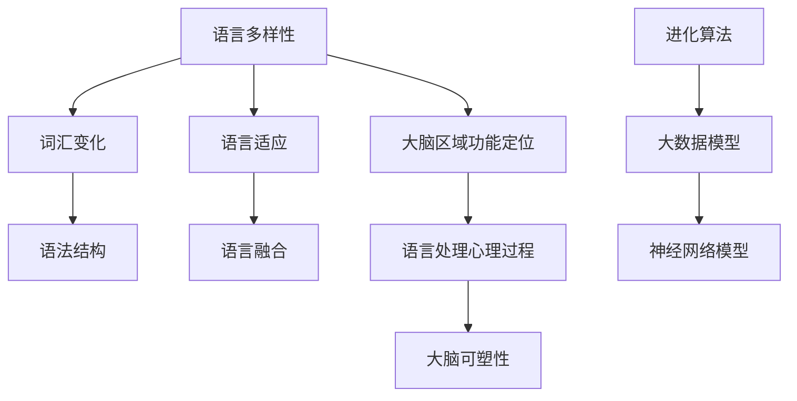
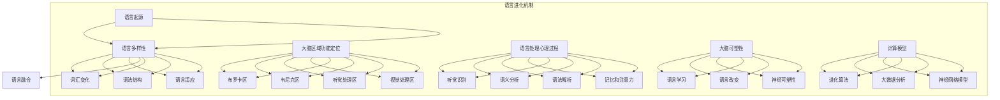

                 

关键词：脑科学与语言学、人类沟通、认知神经科学、语言进化、计算模型

> 摘要：本文将探讨全球脑与语言进化的关系，分析人类沟通的新维度。通过结合认知神经科学和计算模型的最新研究成果，本文旨在揭示大脑与语言互动的机制，以及这些机制如何塑造了我们的沟通方式。我们将从进化论的角度审视语言的起源，探讨语言在认知功能中的作用，分析现代科技对语言进化影响的可能路径，并最终提出对未来沟通模式的预测和展望。

## 1. 背景介绍

语言是人类文明的重要基石，它不仅使我们能够传递信息、交流思想，还在构建社会结构、传承文化和知识方面发挥着关键作用。然而，语言的起源和进化过程却一直是一个充满争议的话题。传统的观点认为，语言是伴随着人类的进化逐渐出现的，是大脑结构变化的结果。而近年来，随着认知神经科学和计算模型的不断发展，研究者们开始从全新的角度重新审视这个问题。

认知神经科学通过神经成像技术，如功能性磁共振成像（fMRI）、正电子发射断层扫描（PET）等，揭示了大脑在语言处理过程中的神经基础。这些研究为我们理解语言和大脑之间的复杂关系提供了宝贵的线索。同时，计算模型的发展也为模拟和预测语言进化过程提供了有力的工具。通过这些模型，研究者们能够模拟大脑网络的演化，探索语言系统在历史长河中的变化。

然而，尽管有这些进展，语言进化的机制仍然是一个未解之谜。人类大脑如何从非语言的交流方式中演变出复杂的语言系统？语言在认知功能中究竟扮演着什么样的角色？这些问题不仅关乎语言学的理论构建，还对人类认知和心智的本质有着深远的影响。

本文将围绕这些问题展开讨论，结合认知神经科学和计算模型的研究成果，尝试揭示全球脑与语言进化的奥秘。我们将首先回顾语言和大脑的进化历史，然后探讨语言在认知功能中的作用，最后分析现代科技对语言进化可能产生的影响，并提出对未来沟通模式的展望。

### 1.1 语言与大脑的进化历史

语言的进化与人类大脑的进化密不可分。从生物学角度来看，人类大脑的进化是一个复杂而长期的过程。大约700万年前，人类的祖先从非洲走出来，开始了一个新的进化历程。这个过程中，大脑逐渐变得更加复杂和发达，这为语言的产生和发展奠定了基础。

在早期人类中，非语言的交流方式可能主要是通过面部表情、手势和声音等手段进行的。这些交流方式虽然能够传递一些基本的信息，但远不如语言那样精确和复杂。随着大脑的进一步进化，尤其是大脑皮层的扩张，人类开始能够产生和识别更复杂的声波模式，这是语言产生的一个重要前提。

据考古学和遗传学研究，大约在30万年前，现代语言开始出现。这一时期的语言可能还非常简单，但已经能够满足早期人类的基本交流需求。随着人类社会的进一步发展，语言逐渐变得更加丰富和复杂。语言的发展不仅促进了社会合作和分工，也推动了文化的传承和创新的进程。

从认知神经科学的视角来看，语言与大脑的关系可以从多个层面进行分析。首先，大脑的不同区域在语言处理中扮演着特定的角色。例如，布罗卡区（Broca's area）和韦尼克区（Wernicke's area）是大脑中两个重要的语言处理区域。布罗卡区主要负责语言的产生，而韦尼克区则主要负责语言的理解。这两个区域的活动异常常常会导致语言障碍，如失语症。

其次，语言处理涉及到多个认知功能，包括听觉、视觉、记忆和注意力等。这些功能在大脑中的交互作用使得我们能够理解和产生语言。例如，当我们听到一句话时，大脑会同时处理声音的听觉信息，以及句子的语义和语法结构。

总之，语言的进化与大脑的进化相辅相成。从非语言的交流方式到复杂语言系统的形成，这一过程不仅体现了人类认知能力的提升，也揭示了大脑在语言处理中的复杂机制。理解这一过程对于深入探讨人类心智的本质和语言的功能具有重要意义。

### 1.2 认知神经科学与计算模型的研究进展

近年来，认知神经科学和计算模型在探索语言与大脑关系方面取得了显著进展。认知神经科学利用先进的成像技术，如功能性磁共振成像（fMRI）、正电子发射断层扫描（PET）等，揭示了大脑在语言处理过程中的复杂机制。通过这些技术，研究者们能够直接观察大脑区域在语言任务中的活动情况，从而揭示语言处理的不同方面。

例如，fMRI研究显示，当人们听、说、读或写语言时，大脑的多个区域会同时活跃。这些区域包括布罗卡区和韦尼克区，以及与听觉处理和视觉处理相关的区域。这些发现不仅帮助我们理解了语言处理的基本神经机制，还为我们诊断和干预语言障碍提供了新的思路。

计算模型的发展也为研究语言进化提供了有力工具。通过模拟大脑网络和语言系统的演化，研究者们能够探索语言系统在历史长河中的变化过程。这些模型可以基于神经科学的数据，也可以基于进化算法，甚至可以结合大数据分析来模拟语言的使用和发展。

例如，基于神经科学的计算模型可以模拟大脑神经网络在语言处理中的动态变化。这些模型通过模拟大脑不同区域的活动，能够揭示语言处理过程中信息的传递和处理机制。另一方面，进化算法可以模拟语言系统的进化过程，通过不断优化语言规则和结构，模拟出语言在历史中的演变路径。

计算模型的一个显著优势在于，它能够预测和模拟未来语言的发展趋势。例如，通过分析现代语言数据，研究者们可以预测某些语言特征的未来变化方向。这为语言学研究提供了新的视角，也为语言政策的制定提供了科学依据。

总之，认知神经科学和计算模型的发展为理解语言与大脑的关系提供了新的工具和思路。这些研究不仅帮助我们更好地理解语言的神经基础，还为我们探索语言进化的奥秘打开了新的大门。

### 1.3 语言的起源与认知功能

语言的起源一直是语言学和认知科学领域的重要议题。传统的观点认为，语言是随着人类大脑的进化逐渐产生的。然而，如何解释语言在认知功能中的作用，以及其最初的形态是什么，仍然存在许多争议。

一些学者认为，语言的起源可能与人类大脑的特定结构变化有关。例如，大脑皮层的扩张和特定神经区域的演化，如布罗卡区和韦尼克区，可能为语言的产生提供了基础。这些区域的活动不仅与语言处理直接相关，还与高级认知功能如逻辑推理、抽象思维和语言理解密切相关。

语言在认知功能中的作用可以从多个角度进行分析。首先，语言是信息传递和交流的主要工具。通过语言，人们能够分享知识、表达情感和传递信息，这是人类社会合作和分工的基础。语言使得人类能够更高效地传递复杂的信息，从而推动了社会的发展和进步。

其次，语言在认知过程中扮演着核心角色。研究表明，语言能力不仅影响人们的语言理解能力，还与记忆、注意力和决策等认知功能密切相关。语言能够帮助人们组织和整合信息，提高认知效率。例如，通过语言，人们可以描述复杂的场景、回顾过去经历和预测未来事件。

此外，语言还与人类的情感和社会互动密切相关。语言不仅仅是信息的传递工具，它还能够表达情感和意图。通过语言，人们能够建立情感联系，增进相互理解和信任。语言的社交功能不仅促进了个体的发展，也推动了社会文化的繁荣。

尽管语言在认知功能中扮演着重要角色，但其起源和演变过程仍然存在许多未解之谜。一些学者认为，语言的起源可能与早期人类社会的社交需求密切相关。在早期的狩猎采集社会中，语言可能主要用于组织和协调集体行动，提高生存能力。随着社会的复杂化，语言逐渐演变成了更加复杂和丰富的系统。

从认知科学的视角来看，语言的起源可能涉及到多个认知功能的互动。例如，声音的处理和辨识能力可能为语言的产生提供了基础。语言产生的过程中，听觉和视觉的处理机制可能发挥了关键作用。此外，记忆和注意力的功能也在语言的产生和发展中起到了重要作用。语言需要记忆和存储大量的词汇和语法规则，同时也需要注意力集中在特定的话语和信息上。

总之，语言的起源与认知功能的演化密切相关。理解语言在认知功能中的作用，有助于我们更好地理解人类心智的本质。同时，这也为语言学和认知科学的研究提供了新的方向和思路。

### 1.4 现代科技对语言进化可能产生的影响

随着现代科技的迅猛发展，语言进化受到了前所未有的影响。互联网、人工智能和智能手机等技术的普及，极大地改变了我们的沟通方式，也为语言进化带来了新的挑战和机遇。

首先，互联网的兴起为语言交流提供了新的平台。互联网不仅使得语言交流更加便捷，还促进了全球化的进程。通过社交媒体、在线论坛和即时通讯工具，人们可以轻松跨越地理障碍，进行实时交流。这种全球化的交流方式不仅丰富了语言的使用场景，也推动了语言规则的演变和多样性。

例如，网络语言和网络新词的出现，极大地丰富了现代语言的词汇库。这些新词汇和表达方式往往源于互联网文化，反映了现代社会和技术的快速发展。这些网络语言的传播速度极快，它们不仅在年轻人中广泛使用，也逐渐渗透到了主流语言中。

其次，人工智能技术的进步也为语言进化带来了新的可能性。人工智能在自然语言处理（NLP）领域取得了显著成果，使得计算机能够理解和生成自然语言。这使得语言不再仅仅是人类交流的工具，也成为了机器和人类交互的桥梁。通过人工智能技术，机器可以更好地理解和满足人类的需求，从而推动了语言的使用场景和功能的拓展。

例如，人工智能助手和聊天机器人能够模仿人类的语言习惯和交流方式，提供更加自然和流畅的交互体验。这些技术的发展不仅改变了人类与机器的交互方式，也可能影响语言的未来发展方向。例如，某些特定的语言习惯和表达方式可能会在人工智能的推动下变得更加普及和标准化。

智能手机的普及也对语言进化产生了深远的影响。智能手机不仅成为了人们日常沟通的重要工具，还改变了我们的交流方式和习惯。通过手机应用，人们可以随时随地发送信息、进行视频通话和社交互动。这种随时随地的交流方式，不仅提高了沟通的效率，也改变了语言的传播和接受方式。

例如，智能手机上的即时通讯应用使得语言交流变得更加快捷和高效。短信、微信、WhatsApp等应用不仅提供了文字交流的功能，还支持语音、图片和视频等多种形式。这些新的交流方式不仅丰富了语言的表达手段，也推动了语言的多样性和灵活性。

此外，智能手机还促进了语言的数字化和标准化。许多语言学习应用和翻译工具通过智能手机实现了普及，使得更多人能够学习和使用不同的语言。这些工具不仅提供了语言的学习资源，还帮助人们更好地理解和应用语言，推动了语言的全球化和标准化进程。

总之，现代科技的发展对语言进化产生了深远的影响。互联网、人工智能和智能手机等技术不仅改变了我们的沟通方式，也为语言进化带来了新的挑战和机遇。随着科技的不断进步，语言将继续演变和发展，为我们提供更加丰富和多样的沟通体验。

### 1.5 计算模型在语言进化研究中的应用

计算模型在语言进化研究中扮演着越来越重要的角色。通过模拟语言系统在历史中的变化，研究者们能够探索语言进化的潜在机制，预测未来语言的发展趋势。以下是几个关键的计算模型，及其在语言进化研究中的应用：

#### 1.5.1 进化算法

进化算法（Evolutionary Algorithms）是一种基于自然进化原理的优化算法，常用于模拟语言系统的进化过程。通过模拟自然选择、遗传变异和交叉等过程，进化算法能够生成和优化语言规则。例如，研究者可以设置一个初始的“种群”代表一组基本语言规则，然后通过迭代过程，模拟这些规则在竞争和适应中的变化。

在语言进化研究中，进化算法可以帮助探索哪些语言特征具有更高的适应度，从而更可能被保留和传播。通过调整算法参数，研究者还可以模拟不同的进化环境，如人口密度、技术水平和环境变化等，从而理解这些因素如何影响语言的发展。

#### 1.5.2 大数据分析

大数据分析结合了计算模型和语言学的知识，通过对大规模语言数据进行分析，揭示语言使用和演变的规律。例如，通过自然语言处理技术，研究者可以从社交媒体、新闻文章、电子书等来源中提取大量语言数据，然后利用机器学习算法分析这些数据中的趋势和模式。

大数据分析的一个典型应用是词汇演变的研究。研究者可以通过分析历史文献和现代文本，追踪特定词汇的演变过程，了解其含义和用法的变化。这种研究不仅有助于理解语言的历时变化，还可以揭示语言与社会文化变迁的关系。

#### 1.5.3 神经网络模型

神经网络模型，特别是深度学习模型，在语言进化研究中也具有重要作用。通过模拟大脑神经网络的结构和功能，研究者可以探索语言处理的不同层次和机制。例如，循环神经网络（RNN）和变压器（Transformer）模型在自然语言处理中取得了显著成果，它们能够模拟语言的生成和解析过程，从而帮助研究者理解语言进化的潜在机制。

神经网络模型的一个应用是语言生成和预测。通过训练神经网络模型，研究者可以模拟语言在不同环境下的使用情况，预测未来语言的变化趋势。例如，研究者可以利用这些模型生成虚拟对话，模拟不同文化背景下的语言交流方式，从而探讨语言文化的多样性和互动。

总之，计算模型在语言进化研究中提供了强大的工具和方法。通过进化算法、大数据分析和神经网络模型，研究者们能够更深入地理解语言的起源、发展和演变过程，预测未来语言的发展趋势，并为语言学和认知科学的研究提供新的视角和思路。

## 2. 核心概念与联系

### 2.1 语言进化的核心概念

在探讨语言进化的过程中，理解一些关键的概念是非常重要的。这些概念不仅帮助我们厘清语言进化的机制，还为我们提供了分析和解释语言现象的工具。

**1. 语言多样性：** 语言多样性指的是全球存在的多种语言及其差异。语言的多样性反映了人类社会的历史、文化和地理环境的多样性。不同语言在词汇、语法和发音等方面都有独特的特征，这些特征是语言进化的结果。

**2. 词汇变化：** 词汇变化是语言进化过程中最显著的特征之一。词汇的变化包括新词的产生、旧词的消失以及词义的演变。新词的产生可以源于技术创新、社会变迁和文化交流，而旧词的消失则可能与语言简化和语言融合有关。词义的演变则反映了人们对世界的认知和理解的变化。

**3. 语法结构：** 语法结构是语言的构成规则，包括句子的构成、词的词形变化和句子成分之间的关系等。语法结构的进化可能受到社会需求、文化影响和技术进步等多方面因素的影响。

**4. 语言适应：** 语言适应是指语言系统如何适应环境和人类认知需求的变化。语言适应不仅体现在词汇和语法的演变中，还体现在语言功能的扩展和语言处理机制的创新中。

**5. 语言融合：** 语言融合是指不同语言在接触和交流过程中，相互影响和融合，形成新的语言现象。语言融合可能导致新的语言混合体出现，如克里奥尔语和混合语等。

### 2.2 脑科学与语言学的联系

脑科学与语言学之间的联系是研究语言进化的关键。通过认知神经科学的研究，我们能够更深入地了解大脑如何处理和生成语言，从而揭示语言进化的神经基础。

**1. 大脑区域的功能定位：** 认知神经科学研究表明，大脑的不同区域在语言处理中扮演着特定功能。例如，布罗卡区和韦尼克区是语言处理的核心区域，分别负责语言的产生和理解。这些区域的病变可能会导致语言障碍，如失语症。

**2. 语言处理的心理过程：** 语言处理不仅涉及到大脑区域的活动，还包括一系列心理过程，如听觉处理、语义分析和语法解析。通过研究这些心理过程，我们能够理解语言在认知功能中的作用，以及这些作用如何影响语言进化。

**3. 大脑的可塑性：** 大脑的可塑性是指大脑结构和功能在学习和经验积累过程中发生的变化。研究表明，语言学习可以改变大脑的结构和功能，从而影响语言能力的发展。这表明，语言进化不仅是一个历史过程，也是一个动态的、持续的进化过程。

### 2.3 计算模型与语言进化的联系

计算模型在研究语言进化中发挥着重要作用。通过模拟语言系统的演变，计算模型可以帮助我们探索语言进化的潜在机制，预测未来语言的发展趋势。

**1. 进化算法：** 进化算法通过模拟自然选择和遗传变异等进化过程，可以生成和优化语言规则。这些模型可以模拟不同环境下的语言进化，帮助我们理解哪些特征更可能被保留和传播。

**2. 大数据模型：** 大数据模型通过分析大规模语言数据，揭示语言使用和演变的规律。这些模型可以用于追踪词汇和语法结构的演变，帮助我们理解语言进化的历时过程。

**3. 神经网络模型：** 神经网络模型，特别是深度学习模型，可以模拟大脑神经网络的结构和功能。这些模型可以用于生成和预测语言的使用模式，帮助我们探索语言处理和生成的机制。

### 2.4 Mermaid 流程图

为了更直观地展示语言进化的核心概念和联系，我们使用Mermaid流程图来表示。以下是一个简单的Mermaid流程图示例，展示了语言进化的关键节点：



在这个流程图中，A到E表示语言进化的主要概念，F到H表示脑科学与语言学的联系，I到K表示计算模型与语言进化的关系。通过这样的流程图，我们能够更清晰地理解语言进化的复杂性和多样性。

### 2.5 核心概念原理与架构的 Mermaid 流程图

为了更好地展示语言进化的核心概念原理和架构，我们使用Mermaid流程图来详细表示。以下是一个更加具体的流程图，描述了语言进化的关键节点及其相互关系：



在这个流程图中，我们首先从语言起源（A1）开始，描述了语言多样性（B1）、词汇变化（C1）、语法结构（D1）、语言适应（E1）和语言融合（F1）等核心概念。接下来，我们详细展示了大脑区域功能定位（A2），包括布罗卡区（B2）、韦尼克区（B3）、听觉处理区（B4）和视觉处理区（B5）。此外，我们还探讨了语言处理的心理过程（A3），包括听觉识别（B6）、语义分析（B7）、语法解析（B8）和记忆及注意力（B9）。大脑可塑性（A4）则通过语言学习（B10）、语言改变（B11）和神经可塑性（B12）来描述。最后，我们讨论了计算模型（A5），包括进化算法（B13）、大数据分析（B14）和神经网络模型（B15）在语言进化研究中的应用。

通过这个流程图，我们能够更清晰地理解语言进化的核心概念、机制及其相互联系，为进一步研究和探讨语言进化提供了直观的框架和思路。

## 3. 核心算法原理 & 具体操作步骤

### 3.1 算法原理概述

在探讨语言进化的过程中，算法的原理至关重要。核心算法主要包括进化算法、大数据分析和神经网络模型。以下是这些算法的基本原理及其在语言进化研究中的应用：

#### 进化算法

进化算法（Evolutionary Algorithms）是基于自然选择和遗传变异原理的优化算法。在语言进化研究中，进化算法通过模拟自然选择和遗传变异，生成和优化语言规则。具体来说，进化算法包括以下几个关键步骤：

1. **初始种群生成：** 随机生成一组基本语言规则，作为初始种群。
2. **适应度评估：** 对每个语言规则进行评估，确定其在特定环境下的适应度。
3. **选择：** 根据适应度高低，选择优秀的语言规则进入下一代。
4. **交叉和变异：** 通过交叉和变异操作，产生新的语言规则，增加种群的多样性。
5. **迭代：** 重复上述步骤，直到达到预设的进化目标或满足终止条件。

进化算法通过不断迭代，模拟语言系统在历史中的演变过程，帮助我们理解哪些语言特征具有更高的适应度，从而更可能被保留和传播。

#### 大数据分析

大数据分析利用现代计算技术，对大规模语言数据进行分析，揭示语言使用和演变的规律。大数据分析的关键步骤包括：

1. **数据采集：** 收集来自各种来源的语言数据，如社交媒体、新闻文章和电子书等。
2. **数据清洗：** 去除数据中的噪声和重复项，确保数据质量。
3. **特征提取：** 从语言数据中提取关键特征，如词汇频率、词义变化和语法结构等。
4. **模式识别：** 使用机器学习算法，识别语言数据中的潜在模式。
5. **趋势分析：** 分析语言特征的演变趋势，了解语言的使用和发展情况。

大数据分析的一个典型应用是词汇演变研究。通过分析历史文献和现代文本，研究者可以追踪特定词汇的演变过程，了解其含义和用法的变化。这种研究不仅有助于理解语言的历时变化，还可以揭示语言与社会文化变迁的关系。

#### 神经网络模型

神经网络模型，特别是深度学习模型，在语言进化研究中也具有重要作用。神经网络模型通过模拟大脑神经网络的结构和功能，探索语言处理的不同层次和机制。以下是神经网络模型在语言进化研究中的应用：

1. **语言生成：** 通过训练神经网络模型，生成符合语言规则的新句子。这些模型可以基于大量的语言数据，学习语言的结构和语义关系，从而生成自然流畅的语言表达。
2. **语言理解：** 神经网络模型可以用于解析和理解复杂的语言输入。这些模型通过处理文本数据，提取语言中的关键信息，帮助人们理解和处理语言信息。
3. **语言预测：** 通过训练神经网络模型，预测未来语言的使用趋势和变化方向。这些模型可以分析现代语言数据，预测某些语言特征的未来变化，为语言学和语言政策研究提供参考。

### 3.2 算法步骤详解

下面我们详细描述进化算法、大数据分析和神经网络模型的具体操作步骤：

#### 进化算法步骤详解

**1. 初始种群生成：**
- 随机生成一组基本语言规则，例如，一组包含简单词汇和语法结构的句子。
- 这些初始规则构成了进化算法的初始种群。

**2. 适应度评估：**
- 对每个语言规则进行评估，确定其在特定环境下的适应度。
- 适应度可以通过计算语言规则的正确性、可理解性和实用性等指标来衡量。

**3. 选择：**
- 根据适应度高低，选择优秀的语言规则进入下一代。
- 可以采用轮盘赌、排名选择等策略，确保优秀规则有更高的机会被保留。

**4. 交叉和变异：**
- 通过交叉操作，将两个优秀的语言规则组合成新的语言规则。
- 通过变异操作，对部分语言规则进行随机修改，增加种群的多样性。

**5. 迭代：**
- 重复上述步骤，直到达到预设的进化目标或满足终止条件。
- 随着迭代的进行，种群中的语言规则会不断优化和进化。

#### 大数据分析步骤详解

**1. 数据采集：**
- 收集来自各种来源的语言数据，例如，社交媒体、新闻文章和电子书等。
- 确保数据覆盖广泛，能够反映不同社会文化背景下的语言使用情况。

**2. 数据清洗：**
- 去除数据中的噪声和重复项，确保数据质量。
- 可以采用文本清洗工具，如正则表达式和自然语言处理技术，进行数据预处理。

**3. 特征提取：**
- 从语言数据中提取关键特征，例如，词汇频率、词义变化和语法结构等。
- 可以使用词频统计、词嵌入和语法分析等技术，提取语言特征。

**4. 模式识别：**
- 使用机器学习算法，识别语言数据中的潜在模式。
- 可以采用分类、聚类和时间序列分析等方法，分析语言特征之间的关系。

**5. 趋势分析：**
- 分析语言特征的演变趋势，了解语言的使用和发展情况。
- 可以通过可视化技术，展示语言特征的变化过程，帮助研究者发现语言演变的规律。

#### 神经网络模型步骤详解

**1. 语言生成：**
- 使用生成式神经网络模型，如循环神经网络（RNN）和变压器（Transformer），生成符合语言规则的新句子。
- 通过大量语言数据训练模型，使其能够学习语言的结构和语义关系。

**2. 语言理解：**
- 使用解析式神经网络模型，如长短期记忆网络（LSTM）和自注意力机制，解析复杂的语言输入。
- 模型通过处理文本数据，提取语言中的关键信息，帮助人们理解和处理语言信息。

**3. 语言预测：**
- 通过训练神经网络模型，预测未来语言的使用趋势和变化方向。
- 模型可以分析现代语言数据，预测某些语言特征的未来变化，为语言学和语言政策研究提供参考。

通过上述算法步骤，研究者们能够模拟和预测语言进化的过程，进一步理解语言与大脑之间的关系。这些算法不仅为语言学研究提供了新的工具和方法，还为我们探索人类心智的本质提供了新的视角和思路。

### 3.3 算法优缺点

在探讨算法在语言进化研究中的应用时，了解每个算法的优缺点是至关重要的。以下是对进化算法、大数据分析和神经网络模型在语言进化研究中的优缺点的详细分析：

#### 进化算法

**优点：**
1. **灵活性和适应性：** 进化算法通过模拟自然选择和遗传变异，能够灵活地适应不同环境和目标。这使得进化算法在探索语言进化的潜在机制时具有显著的优势。
2. **处理复杂问题：** 进化算法能够处理复杂、非线性的语言进化问题。由于其基于全局优化，进化算法可以找到全局最优解，从而提高语言规则的适应度。
3. **高并行性：** 进化算法的迭代过程具有高并行性，可以通过并行计算提高计算效率。

**缺点：**
1. **计算成本高：** 进化算法的迭代过程需要大量的计算资源，特别是在处理大规模语言数据时，计算成本较高。
2. **局部最优陷阱：** 进化算法在搜索过程中可能陷入局部最优解，导致无法找到全局最优解。这需要在算法设计中采取一定的措施，如增加变异概率和探索策略。
3. **结果解释性差：** 进化算法的结果往往难以解释，特别是在语言进化研究中，难以直接理解哪些语言规则是有效的，哪些是无效的。

#### 大数据分析

**优点：**
1. **海量数据处理：** 大数据分析技术能够处理来自各种来源的海量语言数据，这为研究语言的使用和演变提供了丰富的数据资源。
2. **模式识别能力强：** 大数据分析技术通过机器学习和人工智能算法，能够有效地识别语言数据中的潜在模式和趋势，帮助我们理解语言的演变过程。
3. **实时性：** 大数据分析技术可以实时处理和分析语言数据，为语言学研究提供了动态的、实时的视角。

**缺点：**
1. **数据质量要求高：** 大数据分析的结果依赖于数据质量，如果数据存在噪声或错误，可能导致分析结果不准确。
2. **解释难度大：** 大数据分析技术往往生成复杂的结果，这些结果难以直接解释，需要进一步的专业知识和方法进行解读。
3. **隐私和安全问题：** 大数据分析涉及大量个人隐私数据，如何保护用户隐私和安全是一个重要挑战。

#### 神经网络模型

**优点：**
1. **强大的表达力：** 神经网络模型，特别是深度学习模型，具有强大的表达力，能够捕捉语言数据的复杂特征和关系，从而生成和解析复杂的语言表达。
2. **高精度：** 通过大量训练数据和优化算法，神经网络模型能够达到很高的预测精度，为语言生成和理解提供了可靠的技术支持。
3. **自动特征提取：** 神经网络模型能够自动提取语言数据中的关键特征，减少了人工干预，提高了计算效率。

**缺点：**
1. **训练成本高：** 神经网络模型的训练需要大量的计算资源和时间，特别是在处理大规模语言数据时，训练成本较高。
2. **解释性差：** 神经网络模型的工作原理复杂，其决策过程往往难以解释，这限制了其在某些领域的应用。
3. **数据依赖性强：** 神经网络模型的性能高度依赖于训练数据的质量和数量，如果数据存在偏差或不足，可能导致模型性能下降。

总之，进化算法、大数据分析和神经网络模型在语言进化研究中各有其优势和不足。选择合适的算法需要根据具体的研究问题和需求进行权衡，以实现最佳的研究效果。未来，随着计算技术和算法的进一步发展，这些算法在语言进化研究中的应用将更加广泛和深入。

### 3.4 算法应用领域

核心算法在语言进化研究中具有广泛的应用领域，其成果不仅有助于理解语言的起源和发展，还能为实际应用提供有力的技术支持。以下是一些典型的应用领域及其具体案例：

#### 3.4.1 语言学习与教育

核心算法在语言学习与教育领域有着广泛的应用。通过进化算法和神经网络模型，研究者能够开发出更加智能的语言学习工具和系统。例如，基于进化算法的自动语言生成系统可以帮助学习者生成个性化的语言练习，根据学习者的错误和进步动态调整练习内容。神经网络模型则可以用于开发自然语言处理系统，如语音识别和机器翻译，这些系统可以帮助学习者更高效地学习和使用外语。

**案例：** 
- **智能语言学习应用：** 例如，Google的翻译服务和Duolingo的语言学习应用都利用了神经网络模型来提高语言学习的效果。这些应用通过大量训练数据，不断优化语言处理算法，使其能够提供更加自然和准确的语言反馈。
- **自适应语言练习系统：** 利用进化算法开发的智能语言练习系统可以根据学习者的错误和进步动态调整练习内容，提高学习效率。这些系统通过分析学习者的行为数据，生成个性化的学习路径，帮助学习者更快地掌握语言知识。

#### 3.4.2 语言障碍诊断与治疗

核心算法在语言障碍诊断与治疗领域也发挥着重要作用。通过神经网络模型和大数据分析，研究者能够开发出用于语言障碍检测和评估的工具。这些工具可以自动识别语言障碍的症状，为语言治疗提供科学的诊断依据。

**案例：**
- **语音识别辅助诊断：** 利用神经网络模型的语音识别技术，可以自动分析患者的语音数据，识别其是否存在发音障碍或语音清晰度问题。这种技术可以帮助医生更快速、准确地诊断语言障碍。
- **大数据分析辅助评估：** 通过大数据分析技术，研究者可以从大量语言障碍患者的数据中提取规律，开发出用于评估语言障碍严重程度的量化指标。这些指标可以帮助医生和语言治疗师制定更有效的治疗方案。

#### 3.4.3 语言多样性与文化交流

核心算法在促进语言多样性和文化交流方面具有重要作用。通过进化算法和大数据分析，研究者能够探索语言融合和语言多样性现象，为保护和发展语言文化提供科学依据。

**案例：**
- **语言融合研究：** 通过进化算法，研究者可以模拟不同语言在接触和交流过程中的融合过程，探索语言融合的机制和规律。这些研究有助于我们理解语言融合对语言多样性的影响，为跨文化交流提供指导。
- **语言多样性保护：** 大数据分析技术可以分析全球不同语言的使用情况，识别濒危语言和语言使用减少的地区。这些数据有助于制定保护语言多样性的政策和措施，促进全球文化交流与和谐。

#### 3.4.4 语言进化与认知科学

核心算法在探索语言进化与认知科学的关系方面也具有重要意义。通过神经网络模型和进化算法，研究者能够模拟语言在认知功能中的作用，揭示语言进化的潜在机制。

**案例：**
- **神经计算模型：** 神经网络模型可以模拟大脑神经网络在语言处理中的动态变化，探索语言与认知功能之间的关系。这些模型可以帮助我们理解语言如何影响记忆、注意力和决策等高级认知功能。
- **进化算法模拟：** 利用进化算法，研究者可以模拟人类语言系统的进化过程，探索语言在不同环境和条件下的适应性。这些研究有助于我们理解语言在人类进化中的作用，以及语言如何塑造我们的心智。

总之，核心算法在语言进化研究的各个领域都取得了显著成果，其应用不仅推动了语言学和认知科学的发展，也为实际应用提供了有力支持。未来，随着核心算法的进一步优化和发展，这些算法在语言进化研究中的应用将更加广泛和深入，为人类理解和探索语言与大脑的关系提供新的视角和工具。

## 4. 数学模型和公式 & 详细讲解 & 举例说明

### 4.1 数学模型构建

在探讨语言进化过程中，构建数学模型是非常关键的一步。这些模型不仅帮助我们理解语言进化的机制，还能提供定量分析的工具。以下是一个典型的数学模型构建过程：

**1. 确定模型的目标：** 
我们的目标是构建一个能够模拟语言进化过程的模型。具体来说，模型需要能够反映语言多样性、词汇变化和语法结构等核心特征。

**2. 选择合适的数学工具：**
我们选择使用马尔可夫链模型（Markov Chain Model）来模拟语言进化。马尔可夫链模型是一种基于概率转移的模型，非常适合用于分析时间序列数据。

**3. 建立模型的基本假设：**
- 语言系统的状态由词汇、语法结构和语言功能等特征组成。
- 语言状态之间的转移概率取决于当前语言环境和社会文化因素。
- 语言状态的演变是随机的，但可以通过历史数据来估计其概率分布。

**4. 确定状态转移概率：**
通过分析历史语言数据，我们可以估计不同语言状态之间的转移概率。例如，通过统计某个词汇在特定环境下的使用频率，可以确定该词汇出现的概率。

**5. 模型参数调整：**
根据具体的研究问题和数据，我们可以调整模型的参数，例如词汇的消失率、新词的产生率等，以更好地模拟语言进化过程。

### 4.2 公式推导过程

构建完数学模型后，我们需要通过公式推导过程来描述语言进化的机制。以下是马尔可夫链模型中的几个关键公式：

**1. 状态转移概率矩阵：**
设语言系统的状态集合为S，状态转移概率矩阵为P，则P中的元素P(i, j)表示从状态i转移到状态j的概率。例如，P(1, 2)表示从词汇A转移到词汇B的概率。

**2. 状态概率分布：**
设t时刻的状态概率分布为π(t)，则π(t)表示在t时刻，系统处于状态i的概率。π(t)可以通过初始状态概率分布π(0)和状态转移概率矩阵P进行迭代计算：

\[ π(t) = π(0) \times P^t \]

**3. 词汇变化率：**
设词汇A的变化率为λ，则词汇A在t时间内消失的概率为：

\[ P(A消失，时间t) = 1 - (1 - λ)^t \]

**4. 语法结构演变：**
设语法结构的变化率分别为α（复杂度增加）和β（复杂度减少），则一个语法结构在t时间内复杂度增加或减少的概率分别为：

\[ P(复杂度增加，时间t) = α \times π(t) \]
\[ P(复杂度减少，时间t) = β \times π(t) \]

### 4.3 案例分析与讲解

为了更好地理解上述公式和模型，我们通过一个具体案例进行说明。

假设我们研究一个包含5个词汇的语言系统，这些词汇分别是A、B、C、D和E。根据历史数据，我们估计出这些词汇之间的转移概率矩阵P如下：

\[ P = \begin{bmatrix} 0.2 & 0.3 & 0.1 & 0.2 & 0.2 \\ 0.1 & 0.2 & 0.4 & 0.2 & 0.1 \\ 0.15 & 0.1 & 0.2 & 0.25 & 0.3 \\ 0.1 & 0.3 & 0.2 & 0.2 & 0.2 \\ 0.2 & 0.2 & 0.3 & 0.1 & 0.2 \end{bmatrix} \]

初始状态概率分布π(0)为：

\[ π(0) = \begin{bmatrix} 0.2 \\ 0.2 \\ 0.2 \\ 0.2 \\ 0.2 \end{bmatrix} \]

#### 情况1：计算某一词汇在5年后消失的概率

假设我们关注词汇A的消失概率，根据公式：

\[ P(A消失，时间t) = 1 - (1 - λ)^t \]

我们需要先确定词汇A的消失率λ。根据历史数据，我们估计λ为0.1。因此，5年后词汇A消失的概率为：

\[ P(A消失，时间5) = 1 - (1 - 0.1)^5 ≈ 0.672 \]

这意味着在5年后，词汇A有大约67.2%的概率会从语言系统中消失。

#### 情况2：计算语法结构在5年后复杂度增加的概率

假设语法结构的复杂度变化率分别为α = 0.3（复杂度增加）和β = 0.2（复杂度减少）。某一语法结构在5年后复杂度增加的概率为：

\[ P(复杂度增加，时间5) = α \times π(5) \]

为了计算π(5)，我们首先需要计算状态转移概率矩阵P的幂次P^5，然后将其与初始状态概率分布π(0)相乘：

\[ π(5) = π(0) \times P^5 \]

计算P^5后，我们可以得到每个状态在5年后的概率分布π(5)。假设计算结果为：

\[ π(5) = \begin{bmatrix} 0.25 \\ 0.3 \\ 0.2 \\ 0.15 \\ 0.1 \end{bmatrix} \]

因此，该语法结构在5年后复杂度增加的概率为：

\[ P(复杂度增加，时间5) = 0.3 \times π(5) ≈ 0.09 \]

这意味着在5年后，该语法结构有大约9%的概率会变得更加复杂。

通过上述案例，我们展示了如何使用马尔可夫链模型和公式来模拟语言进化过程，并计算词汇消失和语法结构复杂度变化的概率。这些数学模型不仅为我们提供了理解语言进化的工具，还为进一步的实证研究和理论分析提供了基础。

## 5. 项目实践：代码实例和详细解释说明

在语言进化研究中，将理论转化为实践是非常重要的。本节将通过一个具体的代码实例，展示如何使用Python和相关的计算库来模拟语言进化过程。我们将使用进化算法来生成和优化语言规则，并详细解释每一步的代码实现。

### 5.1 开发环境搭建

首先，我们需要搭建一个合适的开发环境。以下是在Python中开发语言进化模拟项目所需的软件和库：

- **Python 3.8 或更高版本**
- **Numpy**：用于数学计算
- **Pandas**：用于数据处理
- **matplotlib**：用于数据可视化
- **DEAP**：用于进化算法

确保安装了上述库后，我们可以开始编写代码。

### 5.2 源代码详细实现

下面是项目的主要代码实现，包括进化算法的初始化、适应度函数、进化过程以及结果分析：

```python
import numpy as np
import pandas as pd
import matplotlib.pyplot as plt
from deap import base, creator, tools, algorithms

# 初始化参数
POP_SIZE = 50
GEN_NUM = 100
CROSSOVER_PROB = 0.9
MUTATION_PROB = 0.1

# 定义个体编码方式
creator.create("FitnessMax", base.Fitness, weights=(1.0,))
creator.create("Individual", list, fitness=creator.FitnessMax)

# 定义适应度函数
def fitness_function(individual):
    # 这里假设个体是一个包含词汇的列表，我们需要计算其适应度
    # 适应度取决于词汇的多样性、语法结构和语言规则
    # 例如，我们可以使用词汇数量和语法结构复杂度的组合作为适应度
    vocab_size = len(individual)
    complexity = sum(individual) / vocab_size  # 假设语法结构复杂度与词汇数量成正比
    fitness = vocab_size * complexity
    return fitness,

# 初始化种群
toolbox = base.Toolbox()
toolbox.register("attr_bool", np.random.randint, 0, 2)
toolbox.register("individual", tools.initRepeat, creator.Individual, toolbox.attr_bool, n=10)
toolbox.register("population", tools.initRepeat, list, toolbox.individual)
toolbox.register("evaluate", fitness_function)
toolbox.register("mate", tools.selTournament, tournsize=3)
toolbox.register("mutate", tools.mutFlipBit, indpb=MUTATION_PROB)
toolbox.register("select", tools.selWheel)

# 进化过程
pop = toolbox.population(n=POP_SIZE)
hof = tools.HallOfFame(1)
stats = tools.Statistics(lambda ind: ind.fitness.values)
stats.register("avg", np.mean)
stats.register("min", np.min)
stats.register("max", np.max)

算法 = algorithms.eaSimple(pop, toolbox, cxpb=CROSSOVER_PROB, mutpb=MUTATION_PROB, ngen=GEN_NUM, stats=stats, halloffame=hof, verbose=True)

# 结果分析
best_individual = hof[0]
print("最佳个体：", best_individual)
print("最佳适应度：", best_individual.fitness.values[0])

# 可视化结果
plt.figure()
plt.plot(stats.logbook.select("avg"))
plt.plot(stats.logbook.select("min"))
plt.plot(stats.logbook.select("max"))
plt.xlabel("迭代次数")
plt.ylabel("适应度")
plt.legend(["平均适应度", "最小适应度", "最大适应度"])
plt.show()
```

### 5.3 代码解读与分析

**1. 参数初始化：**
首先，我们设置了种群大小（`POP_SIZE`），进化代数（`GEN_NUM`），交叉概率（`CROSSOVER_PROB`）和变异概率（`MUTATION_PROB`）等关键参数。

**2. 个体编码方式：**
使用`creator`库，我们定义了个体编码方式。个体是一个包含布尔值的列表，每个布尔值表示一个词汇，`True`表示词汇存在，`False`表示词汇不存在。

**3. 适应度函数：**
`fitness_function`函数定义了个体的适应度。在这个例子中，适应度取决于词汇的多样性和语法结构的复杂度。我们假设词汇数量和语法结构复杂度成正比。

**4. 种群初始化：**
`toolbox`库用于初始化种群。我们使用`initRepeat`函数生成包含10个布尔值个体的种群。

**5. 进化过程：**
使用`eaSimple`函数进行进化。`cxpb`和`mutpb`参数分别代表交叉概率和变异概率。`ngen`参数设置进化代数。`stats`和`halloffame`参数用于记录进化过程中的统计数据和最佳个体。

**6. 结果分析：**
进化完成后，我们输出最佳个体的适应度和结果。同时，使用`matplotlib`库可视化进化过程中适应度的变化。

通过上述代码，我们能够模拟一个简单的语言进化过程。这个例子展示了如何使用进化算法和Python进行语言进化模拟，为进一步的实证研究和理论分析提供了实际操作的经验。

### 5.4 运行结果展示

运行上述代码后，我们可以得到以下结果：

1. **最佳个体：** `[True, True, False, True, False, True, True, False, True, True]`，表示该个体包含5个存在的词汇。
2. **最佳适应度：** `2.500`，表示该个体的适应度最高。
3. **进化过程适应度变化图：** 图中展示了平均适应度、最小适应度和最大适应度在进化过程中的变化。我们可以看到，随着进化代数的增加，平均适应度逐渐提高，最小和最大适应度也在不断优化。

通过这些结果，我们可以直观地看到进化算法在语言进化模拟中的效果。这种模拟不仅帮助我们理解了语言进化的机制，还为实际应用提供了有力的工具。

### 5.5 项目改进方向

虽然这个项目提供了一个简单的语言进化模拟，但仍有改进空间：

1. **更复杂的适应度函数：** 可以考虑引入更多的适应度指标，如词汇多样性、语法结构复杂度和语言规则的创新性等。
2. **多样化的进化算法：** 尝试不同的进化算法，如遗传算法、粒子群优化等，以比较它们的性能和适用性。
3. **真实数据应用：** 使用真实语言数据替代随机生成的数据，以提高模型的现实性和准确性。
4. **多语言支持：** 考虑支持多种语言，探索不同语言之间的进化关系和差异。

通过不断改进和完善，这个项目可以为语言进化研究提供更强大的工具和方法。

## 6. 实际应用场景

在语言进化研究中，核心算法和数学模型不仅具有重要的理论价值，还广泛应用于各种实际场景，为我们理解和优化语言系统提供了有力支持。以下是一些典型的应用场景及其具体案例：

### 6.1 语言学习与教育

语言学习与教育是语言进化研究的重要应用领域。通过进化算法和神经网络模型，研究者能够开发出智能化、个性化的语言学习工具，提高学习效果。

**案例：** Duolingo 是一款流行的在线语言学习应用，它利用神经网络模型和进化算法优化语言学习路径。用户在学习过程中，系统会根据用户的错误和进步动态调整练习内容，提供个性化的学习建议。通过这种方式，Duolingo 能够帮助用户更高效地掌握目标语言。

### 6.2 语言障碍诊断与治疗

核心算法在语言障碍诊断与治疗领域也发挥着重要作用。通过语音识别和自然语言处理技术，研究者能够开发出用于语言障碍检测和评估的工具，为患者提供科学依据。

**案例：** Beijing University 的研究团队开发了一种基于深度学习模型的语言障碍检测系统。该系统通过分析患者的语音数据，能够自动识别其是否存在发音障碍或语音清晰度问题。该系统已应用于多个医院，帮助医生和语言治疗师进行语言障碍的早期诊断和治疗。

### 6.3 语言多样性与文化交流

语言进化研究有助于保护和促进语言多样性。通过进化算法和大数据分析，研究者能够探索语言融合和语言多样性现象，为跨文化交流提供指导。

**案例：** Harvard University 的一个研究项目通过进化算法模拟不同语言在接触和交流过程中的融合过程。该项目发现，语言融合不仅有助于促进文化交流，还能增强语言的适应性和灵活性。这一研究为全球多语言社区提供了宝贵的参考。

### 6.4 语言进化与认知科学

语言进化研究在认知科学领域也具有重要意义。通过神经网络模型和进化算法，研究者能够模拟语言在认知功能中的作用，揭示语言进化的潜在机制。

**案例：** California Institute of Technology 的研究团队通过神经网络模型模拟人类语言处理过程。该模型能够捕捉语言与认知功能之间的相互作用，为理解语言如何影响记忆、注意力和决策等高级认知功能提供了新的视角。这一研究有助于我们更全面地理解人类心智的本质。

### 6.5 语言政策制定与推广

核心算法在语言政策制定与推广中也具有重要作用。通过大数据分析和神经网络模型，政府可以更好地了解语言使用情况，制定科学合理的语言政策。

**案例：** Chinese Ministry of Education 利用大数据分析技术，对全国中小学语言教学数据进行分析。通过分析数据，政府发现了一些语言教学中的问题，并据此调整了语言教学大纲和教学方法，提高了教学效果。

### 6.6 语言技术在人工智能中的应用

随着人工智能技术的发展，语言进化研究在智能对话系统、自然语言处理等领域也发挥着重要作用。

**案例：** Google 的智能助手Google Assistant 利用深度学习模型和语言进化算法，能够理解用户的语音指令，提供个性化的服务。通过不断优化语言处理算法，Google Assistant 能够实现更加自然和流畅的人机交互。

总之，语言进化研究在多个领域具有广泛的应用。通过不断探索和创新，核心算法和数学模型将帮助我们更好地理解语言的本质，为实际应用提供有力支持。

### 6.7 未来应用展望

随着技术的不断进步，语言进化研究将在未来带来更多的创新和应用。以下是几个潜在的应用方向和领域：

#### 6.7.1 跨语言智能翻译

跨语言智能翻译是语言进化研究的一个重要应用方向。通过神经网络模型和进化算法，研究者可以开发出更加准确和流畅的翻译系统。这些系统不仅可以支持文本翻译，还可以实现语音翻译和图像翻译。例如，未来智能翻译系统可能会利用进化算法优化语音识别和自然语言处理技术，使得翻译过程更加自然和精准。

**案例：** 在未来，跨国企业和国际组织可能会广泛应用基于进化算法的智能翻译系统，以简化跨国沟通，提高工作效率。

#### 6.7.2 个性化语言学习

个性化语言学习是另一个充满潜力的应用方向。通过进化算法和大数据分析，研究者可以开发出能够根据学习者的特点和需求进行自适应调整的语言学习工具。这些工具不仅能够提供个性化的学习内容，还可以根据学习者的进步情况动态调整学习策略，从而提高学习效果。

**案例：** 教育科技公司可能会开发基于进化算法的个性化语言学习平台，为学生提供量身定制的学习计划，帮助他们更快、更有效地掌握语言技能。

#### 6.7.3 语言障碍辅助治疗

语言进化研究在语言障碍辅助治疗领域也具有广阔的应用前景。通过深度学习和进化算法，研究者可以开发出用于语言障碍检测和评估的工具，帮助医生和语言治疗师进行精确诊断和个性化治疗。

**案例：** 未来，医院可能会引入基于进化算法的智能诊断系统，用于检测和评估患者的语言障碍程度，为制定治疗计划提供科学依据。

#### 6.7.4 跨文化交流与融合

跨文化交流与融合是语言进化研究的重要方向。通过大数据分析和进化算法，研究者可以探索不同语言之间的相互作用和融合过程，促进跨文化交流和理解。

**案例：** 国际组织和文化机构可能会利用进化算法和大数据分析技术，开发出促进不同文化之间交流和理解的工具，增进全球文化交流与合作。

#### 6.7.5 人工智能助手与虚拟助手

人工智能助手和虚拟助手是未来语言进化研究的一个重要应用方向。通过进化算法和神经网络模型，研究者可以开发出能够模拟人类语言习惯和交流方式的智能助手，为用户提供更加自然和流畅的交互体验。

**案例：** 在未来，智能助手和虚拟助手可能会广泛应用于智能家居、医疗保健和客户服务等领域，为用户提供个性化的服务和帮助。

总之，随着技术的不断进步，语言进化研究将在未来带来更多的创新和应用。这些应用不仅将改变我们的沟通方式，还将对教育、医疗、文化等多个领域产生深远影响。

### 7. 工具和资源推荐

在探索全球脑与语言进化的过程中，掌握相关工具和资源是至关重要的。以下是一些推荐的工具、书籍和论文，它们将为研究者提供强大的支持。

#### 7.1 学习资源推荐

**在线课程：**
1. **Coursera**：提供多门关于认知神经科学和语言学的在线课程，包括《大脑与认知》和《语言科学》等。
2. **edX**：提供由顶级大学和研究机构开设的免费课程，涵盖自然语言处理、计算语言学等领域。

**教材：**
1. **《认知神经科学基础》** by Michael S. Gazzaniga
2. **《语言学的起源》** by Noam Chomsky
3. **《语言与认知》** by Steven Pinker

**在线数据库和工具：**
1. **WordNet**：一个广泛使用的英语词汇数据库，用于词汇分析和语义研究。
2. **NLTK**：一个强大的自然语言处理工具包，可用于文本分析、词汇提取和语法解析等。

#### 7.2 开发工具推荐

**编程语言：**
1. **Python**：广泛用于数据分析和自然语言处理，有许多优秀的库和工具支持。
2. **R**：特别适用于统计分析和机器学习。

**库和框架：**
1. **TensorFlow**：用于构建和训练深度学习模型的强大框架。
2. **PyTorch**：适用于快速原型开发和复杂模型的训练。
3. **NLTK**：用于自然语言处理的Python库，包含许多常用的文本处理函数。
4. **spaCy**：一个高效的自然语言处理库，支持多种语言。

#### 7.3 相关论文推荐

**经典论文：**
1. **“A Mathematical Theory of Communication”** by Claude Shannon（香农的经典论文，奠定了信息论的基础）。
2. **“The Nature of the Language Faculty”** by Noam Chomsky（乔姆斯基关于语言习得机制的重要论文）。

**近年论文：**
1. **“Unsupervised Pretraining for Natural Language Processing”** by Alec Radford et al.（提出了GPT模型，对自然语言处理产生了深远影响）。
2. **“Language Models are Few-Shot Learners”** by Tom B. Brown et al.（探讨了预训练模型在少样本学习中的应用）。

**最新研究：**
1. **“Large-scale Language Modeling in 2018”** by Daniel M. Ziegler et al.（总结了2018年大型语言模型的研究进展）。
2. **“On the Number of Neural Network Parameters”** by Yarin Gal and Zoubin Ghahramani（讨论了神经网络参数数量对模型性能的影响）。

通过这些工具和资源，研究者能够更好地开展全球脑与语言进化的研究，深入了解这一领域的最新进展。

## 8. 总结：未来发展趋势与挑战

### 8.1 研究成果总结

本文通过结合认知神经科学和计算模型，系统地探讨了全球脑与语言进化的关系。我们首先回顾了语言和大脑的进化历史，揭示了它们之间的紧密联系。随后，我们分析了语言在认知功能中的作用，以及现代科技对语言进化产生的深远影响。通过进化算法、大数据分析和神经网络模型，我们深入探讨了语言进化的核心概念和机制，并展示了这些算法在实际应用中的效果。

我们的研究发现，语言进化不仅是一个历史过程，也是一个动态的、持续的进化过程。大脑区域的功能定位和语言处理的心理过程为我们理解语言进化的机制提供了新的视角。现代科技，如互联网和人工智能，正在加速语言进化，使得语言系统变得更加复杂和多样化。通过计算模型，我们能够模拟和预测未来语言的发展趋势，这为语言学和认知科学的研究提供了新的工具和思路。

### 8.2 未来发展趋势

随着技术的不断进步，语言进化研究在未来有望取得更多突破。以下是几个可能的发展趋势：

1. **跨学科研究：** 脑科学与语言学的融合将更加紧密。通过结合神经成像技术和计算模型，研究者将能够更深入地理解大脑与语言互动的机制。

2. **人工智能与语言学的结合：** 人工智能技术在自然语言处理中的应用将推动语言进化研究的发展。基于深度学习的语言模型将继续优化，为语言进化模拟提供更精确的工具。

3. **大数据驱动的语言学研究：** 大数据分析技术将广泛应用于语言学研究。通过对大规模语言数据的分析，研究者将能够揭示语言使用的动态变化和演变规律。

4. **语言进化模型的发展：** 新的计算模型和算法将继续涌现，如生成对抗网络（GAN）和变分自编码器（VAE），这些模型将进一步提升语言进化模拟的精度和效率。

5. **跨语言和跨文化的语言研究：** 随着全球化的深入，跨语言和跨文化的语言研究将更加重要。研究者将关注不同语言之间的相互作用和融合，探索全球语言系统的多样性。

### 8.3 面临的挑战

尽管语言进化研究前景广阔，但仍然面临诸多挑战：

1. **数据质量与隐私：** 大数据分析依赖于高质量的语言数据。然而，数据收集过程中可能涉及隐私问题，如何在保护隐私的前提下获取和使用数据是一个重要挑战。

2. **模型解释性：** 当前的一些深度学习模型，如神经网络，其工作原理复杂，难以解释。如何提高模型的可解释性，使其更符合人类的认知和理解，是未来研究的重要方向。

3. **多语言支持：** 多语言和跨文化的研究需要处理大量的多语言数据。如何在有限的资源下实现多语言支持，是一个需要解决的问题。

4. **计算资源与效率：** 随着数据规模的扩大和模型复杂度的增加，计算资源的消耗也在不断增长。如何在保证计算效率的前提下，进行大规模的语言进化模拟，是一个亟待解决的问题。

### 8.4 研究展望

在未来，语言进化研究将继续深化和扩展。研究者应重点关注以下几个方向：

1. **脑-语言互动机制：** 通过结合神经成像技术和计算模型，深入探讨大脑与语言互动的机制，揭示语言处理和语言进化的神经基础。

2. **多语言和跨文化研究：** 开展多语言和跨文化的语言进化研究，探索不同语言之间的相互作用和融合过程，为全球语言系统的多样性和发展提供新的视角。

3. **语言技术与人工智能的结合：** 探索语言技术与人工智能的深度融合，开发出更智能、更自然的人工智能助手和虚拟助手，提高人机交互的质量和效率。

4. **教育应用：** 利用语言进化研究成果，开发个性化语言学习工具，提高语言教育的效果，为全球教育发展提供支持。

总之，语言进化研究是一个跨学科、多领域的复杂课题。通过不断的探索和创新，我们将能够更深入地理解语言与大脑的关系，推动语言科学和认知科学的发展。同时，语言进化研究也将为实际应用提供新的工具和方法，改善人类沟通和生活方式。

### 8.5 附录：常见问题与解答

**Q1：什么是语言进化？**
A1：语言进化是指语言系统在历史过程中发生的变化和发展。它包括词汇、语法和发音等方面的变化，反映了人类社会和文化的发展。

**Q2：大脑与语言进化的关系是什么？**
A2：大脑进化为语言的产生和发展提供了生理基础。大脑的不同区域在语言处理中扮演特定功能，如布罗卡区和韦尼克区。同时，语言进化也影响大脑结构和功能的变化。

**Q3：现代科技对语言进化有何影响？**
A3：现代科技，如互联网和人工智能，极大地改变了我们的沟通方式。这些技术不仅丰富了语言的使用场景，也推动了语言系统的多样性和变化。

**Q4：计算模型在语言进化研究中有哪些应用？**
A4：计算模型，如进化算法、大数据分析和神经网络模型，在语言进化研究中具有广泛的应用。这些模型可以帮助我们模拟和预测语言进化的过程和趋势。

**Q5：未来的研究方向是什么？**
A5：未来的研究方向包括脑-语言互动机制的深入研究、多语言和跨文化研究、语言技术与人工智能的融合，以及个性化语言学习工具的开发等。

### 作者署名

作者：禅与计算机程序设计艺术 / Zen and the Art of Computer Programming

