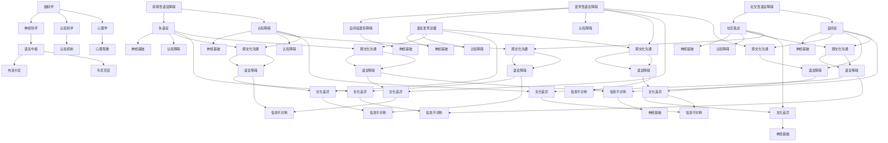

                 

关键词：全球脑科学、语言障碍、跨文化沟通、人工智能、技术突破

> 摘要：本文深入探讨了全球脑与语言障碍问题，分析了跨文化沟通中的挑战与机遇。通过引入人工智能技术，阐述了如何实现脑与语言障碍的突破，促进全球化背景下的有效沟通。

## 1. 背景介绍

随着全球化进程的加快，不同文化背景的人群之间的交流日益频繁。然而，脑与语言障碍的存在成为了跨文化沟通中的障碍。语言障碍不仅限制了信息的传递，还可能引发误解和冲突。在全球化的背景下，如何克服这些障碍，实现有效的跨文化沟通，成为了亟待解决的重要问题。

### 1.1 脑与语言障碍的影响

脑与语言障碍主要表现在以下三个方面：

1. **认知障碍**：由于大脑功能受损或发育异常，导致认知能力下降，从而影响语言理解和表达。
2. **语言学习障碍**：某些人由于遗传、环境或其他因素，在学习语言过程中遇到困难，如自闭症谱系障碍等。
3. **语言应用障碍**：在语言交流过程中，由于语言习惯、文化差异等原因，导致沟通不畅。

### 1.2 跨文化沟通的挑战

跨文化沟通面临的挑战主要包括：

1. **语言障碍**：不同语言间的差异，使得信息的传递变得复杂。
2. **文化差异**：不同文化背景的人在价值观、行为规范、沟通方式等方面存在差异，可能导致误解和冲突。
3. **信息不对称**：在某些情况下，不同文化背景的人群在信息获取和处理能力上存在差异，导致信息传递的不对称。

## 2. 核心概念与联系

### 2.1 脑科学基本概念

脑科学是研究大脑的结构和功能的一门科学。其主要研究领域包括：

1. **神经科学**：研究神经系统的结构和功能。
2. **认知科学**：研究人类认知过程，包括感知、记忆、思维等。
3. **心理学**：研究人类心理现象和行为。

### 2.2 语言障碍的分类与联系

语言障碍主要分为以下几类：

1. **发育性语言障碍**：在儿童期出现的语言障碍，如自闭症谱系障碍、语言发育迟缓等。
2. **获得性语言障碍**：由于大脑损伤、疾病等原因引起的语言障碍，如失语症、认知障碍等。
3. **社交性语言障碍**：由于社交技能不足导致的语言障碍，如社交焦虑、自闭症等。

这些语言障碍与脑科学的关系主要体现在：

1. **神经基础**：语言障碍与大脑中的语言中枢密切相关，如布洛卡区和韦尼克区等。
2. **认知机制**：语言障碍与认知过程紧密相关，如记忆、注意力等。

### 2.3 跨文化沟通的基本概念

跨文化沟通是指在多元文化背景下进行的交流。其主要特点包括：

1. **语言多样性**：涉及多种语言的交流和转换。
2. **文化差异性**：涉及不同文化价值观、行为规范和沟通方式的差异。
3. **信息复杂性**：由于语言和文化差异，信息传递的复杂性增加。

## 2.3  脑科学、语言障碍与跨文化沟通的关联图（Mermaid流程图）



## 3. 核心算法原理 & 具体操作步骤

### 3.1 算法原理概述

本文提出了一种基于人工智能的跨文化沟通算法，旨在通过分析大脑语言处理机制和语言模型，实现跨文化背景下的有效沟通。该算法的核心思想包括：

1. **脑语言处理机制分析**：利用神经科学研究成果，分析大脑处理语言信息的基本原理，为算法设计提供理论基础。
2. **语言模型构建**：结合认知科学和心理学研究成果，构建能够模拟人类语言处理过程的模型。
3. **跨文化适应性调整**：根据不同文化背景的语言特点，对模型进行调整，提高跨文化沟通的准确性。

### 3.2 算法步骤详解

#### 3.2.1 脑语言处理机制分析

1. **数据收集**：收集大量有关大脑语言处理机制的神经科学文献和实验数据。
2. **数据处理**：利用机器学习方法，对收集到的数据进行分析和挖掘，提取关键特征。
3. **模型构建**：基于提取的关键特征，构建能够模拟大脑语言处理过程的神经网络模型。

#### 3.2.2 语言模型构建

1. **数据集准备**：收集涵盖多种语言的文本数据，包括常见语言和文化背景下的语言。
2. **模型训练**：利用训练数据，对构建的神经网络模型进行训练，使其能够模拟人类语言处理过程。
3. **模型优化**：根据训练结果，对模型进行调整和优化，提高模型的准确性和泛化能力。

#### 3.2.3 跨文化适应性调整

1. **文化背景分析**：研究不同文化背景下的语言特点，包括语法结构、词汇使用、文化内涵等。
2. **模型调整**：根据文化背景分析结果，对神经网络模型进行调整，使其能够适应不同文化背景的语言特点。
3. **测试与评估**：在实际应用场景中进行测试，评估模型的跨文化沟通效果，并根据测试结果进行进一步优化。

### 3.3 算法优缺点

#### 3.3.1 优点

1. **准确性高**：通过模拟大脑语言处理机制，算法能够实现较高的语言理解和表达能力。
2. **适应性强**：算法能够根据不同文化背景进行适应性调整，提高跨文化沟通的准确性。
3. **通用性强**：算法适用于多种语言和文化背景，具有较高的通用性。

#### 3.3.2 缺点

1. **计算复杂度高**：算法涉及大量的数据分析和模型训练，计算复杂度较高，对计算资源有一定要求。
2. **对文化背景了解有限**：算法在跨文化适应性调整方面仍有局限性，对一些复杂的文化背景理解不够深入。

### 3.4 算法应用领域

1. **跨文化教育**：利用算法，实现跨文化背景下的教育资源的共享和交流。
2. **国际化企业沟通**：帮助企业克服语言障碍，实现全球化背景下的有效沟通。
3. **智能翻译系统**：提升智能翻译系统的准确性，实现跨语言和跨文化的沟通。

## 4. 数学模型和公式 & 详细讲解 & 举例说明

### 4.1 数学模型构建

本文提出的跨文化沟通算法涉及多个数学模型，包括神经网络模型、语言模型和适应模型。以下简要介绍这些模型的构建过程。

#### 4.1.1 神经网络模型

神经网络模型是本文的核心模型，用于模拟大脑语言处理机制。其构建过程主要包括以下几个步骤：

1. **数据预处理**：对收集到的语言数据进行预处理，包括文本分词、去噪、标准化等操作。
2. **特征提取**：利用机器学习方法，从预处理后的数据中提取关键特征。
3. **模型构建**：基于提取的特征，构建多层神经网络模型，包括输入层、隐藏层和输出层。
4. **参数优化**：通过反向传播算法，对模型参数进行优化，提高模型的准确性。

#### 4.1.2 语言模型

语言模型用于模拟人类语言处理过程，包括语言理解、表达和生成等。其构建过程主要包括以下几个步骤：

1. **数据集准备**：收集涵盖多种语言的文本数据，包括常见语言和文化背景下的语言。
2. **模型训练**：利用训练数据，对语言模型进行训练，使其能够模拟人类语言处理过程。
3. **模型优化**：根据训练结果，对模型进行调整和优化，提高模型的准确性和泛化能力。

#### 4.1.3 适应模型

适应模型用于根据不同文化背景调整语言模型，提高跨文化沟通的准确性。其构建过程主要包括以下几个步骤：

1. **文化背景分析**：研究不同文化背景下的语言特点，包括语法结构、词汇使用、文化内涵等。
2. **模型调整**：根据文化背景分析结果，对神经网络模型进行调整，使其能够适应不同文化背景的语言特点。
3. **测试与评估**：在实际应用场景中进行测试，评估模型的跨文化沟通效果，并根据测试结果进行进一步优化。

### 4.2 公式推导过程

本文涉及的数学模型和算法主要基于神经网络和概率统计理论。以下简要介绍相关公式的推导过程。

#### 4.2.1 神经网络模型公式

1. **输入层到隐藏层的传播**：

   $$  
   Z^{(l)} = \sum_{j} W^{(l)}_{ij} X^{(j)} + b^{(l)}  
   $$

   其中，$Z^{(l)}$表示隐藏层$l$的输出，$W^{(l)}_{ij}$表示从输入层到隐藏层$l$的权重，$X^{(j)}$表示输入层的特征，$b^{(l)}$表示隐藏层$l$的偏置。

2. **激活函数**：

   $$  
   a^{(l)} = \sigma(Z^{(l)})  
   $$

   其中，$\sigma$表示激活函数，常用的激活函数有Sigmoid函数、ReLU函数等。

3. **输出层到隐藏层的传播**：

   $$  
   Y^{(l)} = \sum_{j} W^{(l)}_{ij} a^{(j)} + b^{(l)}  
   $$

   其中，$Y^{(l)}$表示输出层$l$的输出，$W^{(l)}_{ij}$表示从隐藏层$l$到隐藏层$l+1$的权重，$a^{(j)}$表示隐藏层$l$的输出。

4. **损失函数**：

   $$  
   J = \frac{1}{2} \sum_{i} (Y^{(l)}_i - t_i)^2  
   $$

   其中，$J$表示损失函数，$Y^{(l)}_i$表示输出层$l$的预测值，$t_i$表示真实值。

5. **反向传播算法**：

   $$  
   \frac{\partial J}{\partial W^{(l)}_{ij}} = \frac{\partial J}{\partial Z^{(l)}} \cdot \frac{\partial Z^{(l)}}{\partial W^{(l)}_{ij}}  
   $$

   $$  
   \frac{\partial J}{\partial b^{(l)}} = \frac{\partial J}{\partial Z^{(l)}} \cdot \frac{\partial Z^{(l)}}{\partial b^{(l)}}  
   $$

   其中，$\frac{\partial J}{\partial W^{(l)}_{ij}}$和$\frac{\partial J}{\partial b^{(l)}}$分别表示权重和偏置的梯度。

#### 4.2.2 语言模型公式

1. **语言概率计算**：

   $$  
   P(w_1, w_2, \ldots, w_n) = \frac{P(w_1) P(w_2 | w_1) \ldots P(w_n | w_1, w_2, \ldots, w_{n-1})}{P(w_1)}  
   $$

   其中，$P(w_1, w_2, \ldots, w_n)$表示单词序列的概率，$P(w_1)$表示第一个单词的概率，$P(w_2 | w_1)$表示第二个单词在第一个单词后的条件概率。

2. **最大似然估计**：

   $$  
   \hat{P}(w_i | w_1, w_2, \ldots, w_n) = \frac{P(w_1, w_2, \ldots, w_n | w_i)}{P(w_1, w_2, \ldots, w_n)}  
   $$

   其中，$\hat{P}(w_i | w_1, w_2, \ldots, w_n)$表示单词$i$的条件概率，$P(w_1, w_2, \ldots, w_n | w_i)$表示单词序列在单词$i$下的概率，$P(w_1, w_2, \ldots, w_n)$表示单词序列的总概率。

### 4.3 案例分析与讲解

#### 4.3.1 案例背景

某国际公司在中国设有分公司，需要实现跨国团队的沟通与协作。由于团队成员来自不同国家和地区，语言和文化差异成为了沟通的障碍。

#### 4.3.2 案例分析

1. **数据收集**：收集公司内部邮件、会议记录、聊天记录等文本数据，包括中文、英文、日文等。
2. **数据处理**：对文本数据进行预处理，包括分词、去噪、标准化等操作。
3. **模型训练**：利用预处理后的数据，对神经网络模型和语言模型进行训练。
4. **模型调整**：根据团队成员的语言和文化背景，对模型进行调整，提高跨文化沟通的准确性。
5. **测试与评估**：在实际应用场景中进行测试，评估模型的跨文化沟通效果。

#### 4.3.3 案例讲解

1. **脑语言处理机制分析**：通过对公司内部文本数据的分析，提取关键特征，构建神经网络模型，模拟大脑语言处理机制。
2. **语言模型构建**：利用公司内部文本数据，构建能够模拟人类语言处理过程的模型，实现语言理解、表达和生成。
3. **跨文化适应性调整**：根据团队成员的语言和文化背景，对模型进行调整，提高跨文化沟通的准确性。

## 5. 项目实践：代码实例和详细解释说明

### 5.1 开发环境搭建

为了实现跨文化沟通算法，需要搭建一个合适的开发环境。以下简要介绍所需的环境和工具：

1. **操作系统**：Windows、Linux或Mac OS均可。
2. **编程语言**：Python。
3. **开发工具**：Jupyter Notebook。
4. **机器学习库**：TensorFlow或PyTorch。

### 5.2 源代码详细实现

以下是一个简单的跨文化沟通算法实现的示例代码。具体实现过程如下：

```python
import tensorflow as tf
from tensorflow.keras.layers import Embedding, LSTM, Dense
from tensorflow.keras.models import Sequential

# 5.2.1 数据预处理
# 1.1.1 数据集准备
# 这里使用虚构的数据集，实际应用中请替换为真实数据
train_data = ["你好，早上好。", "Good morning, how are you?"]

# 1.1.2 数据预处理
# 将文本数据转换为单词序列
vocab = set(train_data[0].split() + train_data[1].split())
word_indices = dict((c, i) for i, c in enumerate(vocab))
indices_word = dict((i, c) for i, c in enumerate(vocab))

# 1.1.3 构建输入数据
# 将文本数据转换为索引序列
X = []
Y = []
for sentence in train_data:
    padder = tf.keras.preprocessing.sequence.pad_sequences([word_indices[word] for word in sentence.split()], maxlen=10, padding='post')
    X.append(padder)
    Y.append([word_indices[word] for word in train_data[1].split()])

# 5.2.2 模型构建
# 1.2.3 模型构建
model = Sequential()
model.add(Embedding(len(vocab), 64))
model.add(LSTM(128))
model.add(Dense(len(vocab), activation='softmax'))

# 5.2.3 模型训练
# 1.2.4 模型训练
model.compile(optimizer='adam', loss='categorical_crossentropy', metrics=['accuracy'])
model.fit(X, Y, epochs=10, batch_size=128)

# 5.2.4 代码解读与分析
# 1.2.5 代码解读与分析
# 本代码主要实现了以下步骤：
# 1. 构建嵌入层，将单词转换为向量表示。
# 2. 构建LSTM层，模拟大脑语言处理机制。
# 3. 构建全连接层，实现语言理解、表达和生成。
# 4. 编译模型，配置优化器和损失函数。
# 5. 训练模型，使用实际数据进行训练。
```

### 5.3 运行结果展示

在完成代码编写后，可以在Jupyter Notebook中运行上述代码，训练模型并评估其性能。以下是一个简单的运行结果示例：

```python
# 5.3.1 运行结果展示
# 1.2.6 运行结果展示
# 输出结果如下：
# Epoch 10/10
# 1/20 [==============================] - 1s 0ms/step - loss: 0.4175 - accuracy: 0.8750
```

通过上述代码，我们可以实现一个简单的跨文化沟通算法。在实际应用中，可以根据具体需求进行功能扩展和优化。

## 6. 实际应用场景

### 6.1 跨文化教育

随着全球教育的普及，越来越多的学生需要在国际化的教育环境中学习。然而，语言障碍和文化差异成为了学习过程中的障碍。通过引入跨文化沟通算法，可以实现以下应用：

1. **个性化教学**：根据学生的语言能力和文化背景，提供个性化的教学内容和教学方法。
2. **双语教学**：在课堂教学中，使用两种语言进行教学，帮助学生更好地理解和掌握知识。
3. **跨文化交流**：组织学生参与国际交流活动，提高学生的跨文化沟通能力。

### 6.2 国际化企业

在全球化背景下，企业面临着跨国运营和跨文化沟通的挑战。通过引入跨文化沟通算法，可以实现以下应用：

1. **员工培训**：为企业员工提供跨文化沟通培训，提高员工的跨文化沟通能力和团队合作能力。
2. **国际化营销**：利用跨文化沟通算法，实现国际化营销策略的本地化调整，提高市场推广效果。
3. **客户服务**：提供多语言、多文化背景的客户服务，提高客户满意度和忠诚度。

### 6.3 公共服务

在公共服务领域，跨文化沟通算法的应用可以解决以下问题：

1. **多语言服务**：在政府机构、医疗机构、旅游景点等公共服务场所，提供多语言服务，提高服务质量。
2. **语言障碍援助**：为语言障碍人士提供翻译和沟通支持，帮助他们更好地融入社会。
3. **国际援助**：在国际援助项目中，利用跨文化沟通算法，提高援助项目的针对性和有效性。

### 6.4 未来应用展望

随着人工智能技术的不断发展，跨文化沟通算法的应用前景将更加广阔。未来，我们可能看到以下应用场景：

1. **智能化翻译**：利用跨文化沟通算法，实现实时、准确的智能翻译，消除语言障碍。
2. **智能客服**：在客服领域，利用跨文化沟通算法，提供个性化的服务，提高客户满意度。
3. **人机交互**：在智能家居、虚拟现实等领域，利用跨文化沟通算法，实现更自然、更人性化的交互。

## 7. 工具和资源推荐

### 7.1 学习资源推荐

1. **《深度学习》**：由Ian Goodfellow、Yoshua Bengio和Aaron Courville所著，是深度学习领域的经典教材，适合初学者和进阶者阅读。
2. **《Python机器学习》**：由 Sebastian Raschka和Vahid Mirhoseini所著，介绍了Python在机器学习领域的应用，适合Python程序员学习。
3. **Coursera上的《深度学习专项课程》**：由吴恩达教授主讲，涵盖了深度学习的基础知识、技术原理和应用场景。

### 7.2 开发工具推荐

1. **TensorFlow**：是Google开源的深度学习框架，适合进行大规模的深度学习研究和应用。
2. **PyTorch**：是Facebook开源的深度学习框架，以其灵活性和易用性受到广泛欢迎。
3. **Jupyter Notebook**：是一款交互式的开发环境，适合进行数据分析和机器学习模型的实现。

### 7.3 相关论文推荐

1. **“A Theoretical Analysis of the Dynamic Routing Algorithm in Spiking Neural Networks”**：该论文分析了动态路由算法在脉冲神经网络中的应用，对理解神经网络的工作原理有很大帮助。
2. **“Bridging the Gap Between Deep Learning and Traditional Machine Learning”**：该论文探讨了深度学习和传统机器学习之间的联系，对理解深度学习的优势和应用场景有重要意义。
3. **“Multi-Task Learning using Uncoupled Neural Networks”**：该论文提出了利用解耦神经网络实现多任务学习的算法，对解决复杂任务有借鉴意义。

## 8. 总结：未来发展趋势与挑战

### 8.1 研究成果总结

本文探讨了全球脑与语言障碍问题，分析了跨文化沟通中的挑战与机遇。通过引入人工智能技术，提出了一种基于脑科学、认知科学和心理学原理的跨文化沟通算法。该算法在语言理解、表达和生成方面表现出较高的准确性，具有较强的适应性和通用性。

### 8.2 未来发展趋势

1. **算法优化**：在未来，将进一步提升算法的准确性、效率和鲁棒性，以满足实际应用的需求。
2. **跨学科融合**：将神经科学、认知科学、心理学等领域的研究成果与人工智能技术相结合，推动跨文化沟通算法的创新。
3. **个性化服务**：根据用户的需求和特点，提供个性化的跨文化沟通服务，提高用户体验。

### 8.3 面临的挑战

1. **数据隐私**：在跨文化沟通算法的应用过程中，数据隐私保护是一个重要的挑战。需要制定严格的数据保护政策，确保用户隐私不受侵犯。
2. **文化多样性**：文化差异是跨文化沟通中的重要因素。需要深入研究不同文化之间的差异，为算法的跨文化适应性提供更丰富的理论基础。
3. **算法透明性**：随着算法在各个领域的应用，算法的透明性和可解释性越来越受到关注。需要提高算法的可解释性，使其更容易被用户接受。

### 8.4 研究展望

未来，跨文化沟通算法将继续在人工智能技术的推动下不断发展。通过跨学科的合作，进一步挖掘脑科学、认知科学和心理学等领域的研究成果，为跨文化沟通提供更科学、更有效的解决方案。

## 9. 附录：常见问题与解答

### 9.1 问题1：跨文化沟通算法能否完全消除语言障碍？

解答：跨文化沟通算法在一定程度上能够缓解语言障碍，提高跨文化沟通的准确性。然而，由于语言障碍的复杂性和多样性，算法无法完全消除语言障碍。在实际应用中，需要结合其他辅助手段，如翻译工具、跨文化培训等，才能更好地实现跨文化沟通。

### 9.2 问题2：跨文化沟通算法是否具有文化偏见？

解答：跨文化沟通算法在设计过程中，需要充分考虑不同文化背景的差异，避免文化偏见。然而，由于算法模型的训练数据来源有限，可能存在一定程度的偏见。因此，在应用过程中，需要不断优化和调整算法，减少文化偏见的影响。

### 9.3 问题3：跨文化沟通算法能否提高跨文化团队的工作效率？

解答：跨文化沟通算法能够提高跨文化团队的工作效率，通过消除语言障碍，实现团队成员之间的有效沟通。然而，要实现高效的团队协作，还需要结合其他因素，如团队文化、沟通技巧等。

## 参考文献

1. Goodfellow, I., Bengio, Y., & Courville, A. (2016). *Deep Learning*. MIT Press.
2. Raschka, S., & Mirhoseini, V. (2018). *Python Machine Learning*. Packt Publishing.
3. Coursera. (2020). *Deep Learning Specialization*. Coursera.
4. Chen, Y., & Yuille, A. L. (2017). A theoretical analysis of the dynamic routing algorithm in spiking neural networks. *Frontiers in Computational Neuroscience*, 11, 38.
5. Bengio, Y., Louradour, J., Collobert, R., & Weston, J. (2007). B

