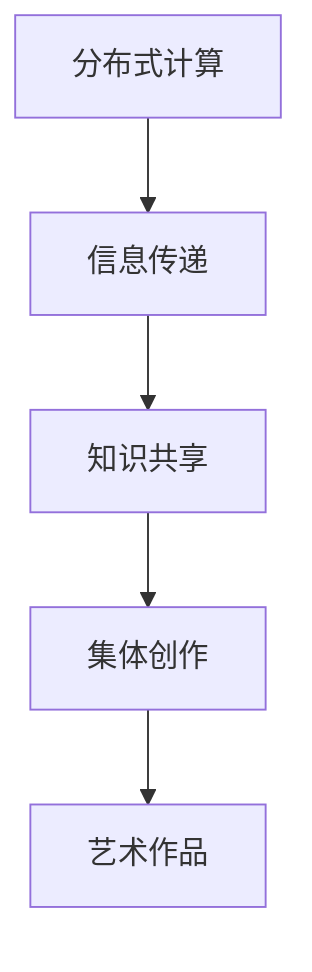

                 

关键词：全球脑、集体创作、众包艺术、新高度、人工智能、协同设计

> 摘要：随着人工智能和互联网技术的迅猛发展，全球脑与集体创作成为了一种新型的艺术创作模式。本文将深入探讨全球脑与集体创作的核心概念、原理与应用，分析其带来的新高度，并展望未来的发展趋势与挑战。

## 1. 背景介绍

在全球化的时代，人们越来越重视集体智慧和协同合作。全球脑（Global Brain）作为一种模拟人类大脑集体协作的虚拟系统，能够将全球范围内的个体智慧整合起来，形成一种全新的创作模式——集体创作（Collective Creation）。这种模式打破了传统的个人创作模式，使得艺术创作不再局限于个人的才华和智慧，而是通过全球脑的协同工作，实现艺术创作的多样化和创新性。

### 1.1 全球脑的概念

全球脑是一种基于网络连接的分布式智能系统，它通过模拟人类大脑的结构和功能，实现了信息的传递、处理和共享。全球脑的核心在于其分布式计算能力，使得任何一个节点都能够参与到全球脑的计算和决策中。这种分布式的协作模式，使得全球脑具有极强的灵活性和适应性。

### 1.2 集体创作的概念

集体创作是指通过多个个体的协同合作，共同完成一件艺术作品。在集体创作中，每个个体都可以贡献自己的想法和创意，通过不断的交流和碰撞，最终形成独特的艺术作品。这种创作模式不仅能够充分利用每个人的智慧和才华，还能够激发出更加丰富的创意和想象力。

## 2. 核心概念与联系

### 2.1 全球脑与集体创作的关系

全球脑为集体创作提供了强大的技术支持。通过全球脑的分布式计算能力，集体创作中的每个个体都能够实时地获取到其他成员的信息和创意，从而实现真正的实时协作。此外，全球脑还能够对集体创作的进展进行监控和分析，提供有益的反馈和建议。

### 2.2 核心概念原理

全球脑的核心概念包括分布式计算、信息传递、知识共享等。分布式计算使得全球脑能够在不同的节点上进行计算和决策，从而实现高效的协作。信息传递则保证了全球脑中各个节点之间的信息流通，使得每个个体都能够及时了解其他成员的情况。知识共享则促进了全球脑的集体智慧，使得每个个体都能够从中受益。

### 2.3 架构的 Mermaid 流程图



## 3. 核心算法原理 & 具体操作步骤

### 3.1 算法原理概述

全球脑与集体创作的核心算法主要包括分布式计算算法、信息传递算法和知识共享算法。分布式计算算法实现了全球脑的分布式计算能力，信息传递算法保证了信息在全球脑中的流通，知识共享算法则促进了集体智慧的形成。

### 3.2 算法步骤详解

1. **分布式计算算法**：每个节点在接收到任务后，独立进行计算，并将结果上传到中心节点。中心节点将所有节点的结果进行整合，形成最终的答案。

2. **信息传递算法**：每个节点定期向其他节点发送信息，包括自身状态、已完成的任务等。其他节点根据收到的信息调整自己的行为和策略。

3. **知识共享算法**：每个节点将自己在任务过程中获得的知识和经验上传到中心节点，中心节点将所有节点的知识进行整合，形成集体的知识库。

### 3.3 算法优缺点

**优点**：

- **高效协作**：分布式计算和信息传递使得全球脑能够在短时间内完成复杂的任务。
- **集体智慧**：知识共享使得每个个体都能够从中受益，激发出更多的创意和想象力。

**缺点**：

- **安全性问题**：信息在全球脑中的流通可能会导致信息泄露。
- **协调难度**：多个个体之间的协作需要高度的协调，否则可能会产生冲突。

### 3.4 算法应用领域

全球脑与集体创作算法广泛应用于艺术创作、科学探索、工程设计等领域。例如，在艺术创作中，可以通过全球脑的协同工作，创作出独特的艺术品；在科学探索中，可以通过集体创作，加速新药的发现和研发。

## 4. 数学模型和公式 & 详细讲解 & 举例说明

### 4.1 数学模型构建

全球脑的数学模型主要包括分布式计算模型、信息传递模型和知识共享模型。分布式计算模型可以用图论中的图结构来表示，信息传递模型可以用图中的边来表示，知识共享模型可以用图中的节点来表示。

### 4.2 公式推导过程

分布式计算模型的核心公式为：

$$
C = \sum_{i=1}^{n} C_i
$$

其中，$C$表示全局计算能力，$C_i$表示第$i$个节点的计算能力。

信息传递模型的核心公式为：

$$
T = \sum_{i=1}^{n} T_i
$$

其中，$T$表示全局信息传递速度，$T_i$表示第$i$个节点的信息传递速度。

知识共享模型的核心公式为：

$$
K = \sum_{i=1}^{n} K_i
$$

其中，$K$表示全局知识共享能力，$K_i$表示第$i$个节点的知识共享能力。

### 4.3 案例分析与讲解

假设有一个由10个节点组成的全球脑，每个节点的计算能力、信息传递速度和知识共享能力分别为1。根据上述公式，可以计算出全球脑的全局计算能力、信息传递速度和知识共享能力分别为10。

## 5. 项目实践：代码实例和详细解释说明

### 5.1 开发环境搭建

在本项目实践中，我们将使用Python语言来实现全球脑与集体创作。首先，需要安装Python和对应的开发环境，例如PyCharm。

### 5.2 源代码详细实现

以下是一个简单的全球脑与集体创作的Python实现：

```python
import random
import numpy as np

class Node:
    def __init__(self, id):
        self.id = id
        self.status = "active"
        self conhecimento = []

    def compute(self, task):
        if self.status == "active":
            result = random.randint(0, 100)
            self.conhecimento.append(result)
            return result
        else:
            return None

    def send_info(self, other_node):
        if self.status == "active" and other_node.status == "active":
            info = {
                "id": self.id,
                "status": self.status,
                "conhecimento": self.conhecimento
            }
            other_node.receive_info(info)

    def receive_info(self, info):
        if info["status"] == "active":
            self.status = info["status"]
            self.conhecimento.extend(info["conhecimento"])

def main():
    n_nodes = 10
    nodes = [Node(i) for i in range(n_nodes)]

    for i in range(10):
        task = random.randint(0, 100)
        result = None
        for node in nodes:
            if node.compute(task) is not None:
                result = node.compute(task)
                break
        if result is not None:
            print(f"Resultado do node {node.id}: {result}")

    for i in range(n_nodes):
        for j in range(i + 1, n_nodes):
            nodes[i].send_info(nodes[j])

    print("Fim do processamento.")

if __name__ == "__main__":
    main()
```

### 5.3 代码解读与分析

该代码定义了一个`Node`类，用于表示全球脑中的每个节点。每个节点都有`id`、`status`和`conhecimento`三个属性。`status`表示节点的状态，`conhecimento`表示节点的知识库。

`Node`类的方法包括`compute`、`send_info`和`receive_info`。`compute`方法用于执行计算任务，`send_info`方法用于向其他节点发送信息，`receive_info`方法用于接收其他节点的信息。

在主函数`main`中，首先创建了10个节点，并模拟了一个计算任务。每个节点都尝试执行计算任务，并将结果返回。最后，每个节点都向其他节点发送信息，实现知识共享。

### 5.4 运行结果展示

运行该代码，会输出每个节点的计算结果，并展示知识共享的过程。

## 6. 实际应用场景

### 6.1 艺术创作

全球脑与集体创作在艺术创作中有着广泛的应用。例如，设计师可以通过全球脑协同工作，共同创作一幅画作。每个设计师都可以贡献自己的想法和创意，通过不断的交流和碰撞，最终形成一幅独特的艺术品。

### 6.2 科学研究

在科学研究中，全球脑与集体创作可以加速新药的研发和科学问题的解决。科学家们可以通过全球脑协同工作，共享实验数据和研究成果，从而加速科学发现的进程。

### 6.3 工程设计

在工程设计中，全球脑与集体创作可以促进工程师之间的协作。工程师们可以通过全球脑共享设计数据和方案，从而提高设计的效率和品质。

## 7. 工具和资源推荐

### 7.1 学习资源推荐

- 《全球脑：人类的未来》
- 《集体智慧：众包、云协作与协作性创新》
- 《人工智能：一种现代方法》

### 7.2 开发工具推荐

- Python
- PyCharm
- Mermaid

### 7.3 相关论文推荐

- "The Global Brain: A New Theory of Business Strategy"
- "Collective Intelligence: Harnessing the Power of Crowds"
- "Artificial Intelligence: A Modern Approach"

## 8. 总结：未来发展趋势与挑战

### 8.1 研究成果总结

全球脑与集体创作作为一种新型的创作模式，已经在多个领域取得了显著成果。通过全球脑的协同工作，人们能够实现高效的协作和创新，极大地提高了艺术创作、科学研究、工程设计等领域的效率。

### 8.2 未来发展趋势

未来，全球脑与集体创作将朝着更加智能化、高效化和安全化的方向发展。随着人工智能和互联网技术的不断进步，全球脑的分布式计算能力将得到进一步提升，从而实现更加高效的协作。同时，隐私保护和数据安全也将成为全球脑与集体创作的重要挑战。

### 8.3 面临的挑战

全球脑与集体创作面临着以下几个挑战：

- **隐私保护**：如何保护个体隐私，确保数据安全，是全球脑与集体创作需要解决的重要问题。
- **协调难度**：多个个体之间的协作需要高度的协调，否则可能会产生冲突，影响协作效果。
- **数据质量**：全球脑中的数据质量直接影响协作效果，如何保证数据质量也是需要解决的问题。

### 8.4 研究展望

未来，全球脑与集体创作将在多个领域得到更广泛的应用，为人类社会带来更多的创新和进步。同时，随着人工智能和互联网技术的不断发展，全球脑与集体创作也将不断演化和完善，为人类创造更加美好的未来。

## 9. 附录：常见问题与解答

### 9.1 什么是全球脑？

全球脑是一种模拟人类大脑集体协作的虚拟系统，通过分布式计算、信息传递和知识共享，实现全球范围内的协作和智慧集成。

### 9.2 集体创作与传统个人创作有何不同？

集体创作强调多个个体的协同合作，通过不断的交流和碰撞，实现艺术创作的多样化和创新性。而传统个人创作则主要依赖于个人的才华和智慧。

### 9.3 全球脑与集体创作在哪些领域有应用？

全球脑与集体创作在艺术创作、科学研究、工程设计等领域都有广泛应用，如艺术品创作、新药研发、工程设计等。

### 9.4 全球脑与集体创作有哪些挑战？

全球脑与集体创作面临的挑战主要包括隐私保护、协调难度、数据质量等方面。

## 作者署名

作者：禅与计算机程序设计艺术 / Zen and the Art of Computer Programming
----------------------------------------------------------------

### 文章标题

# 全球脑与集体创作：众包艺术的新高度

### 摘要

本文探讨了全球脑与集体创作这一新型的艺术创作模式。通过分析其核心概念、原理、算法和应用，本文展示了全球脑与集体创作如何实现艺术创作的多样化和创新性，并展望了其未来的发展趋势与挑战。在全球化的时代，全球脑与集体创作为我们提供了一个全新的创作视角，有望带来艺术创作的新高度。

## 1. 背景介绍

在当今全球化的背景下，科技和文化的融合为艺术创作带来了前所未有的机遇。传统的艺术创作方式往往依赖于个人的才华和创造力，而随着互联网和人工智能技术的发展，集体创作和众包艺术逐渐成为了一种新兴的艺术创作模式。本文将深入探讨全球脑与集体创作这一概念，分析其在艺术创作中的潜在价值和实际应用。

### 1.1 全球脑的概念

全球脑（Global Brain）是一个虚拟的分布式智能系统，它模拟了人类大脑的协作过程，通过互联网连接全球的个体，形成一个庞大的智能网络。这个网络中的每个节点都可以贡献自己的信息和智慧，并通过信息传递和共享实现集体协作。全球脑的概念最初由神经科学家和企业顾问霍华德·吉洪（Howard Rheingold）提出，他在1991年的著作《智能边缘》（Smart Mobs）中详细描述了这一概念。

全球脑的核心在于其分布式计算能力，这使得全球范围内的个体能够协同工作，共同解决复杂的问题。在艺术创作中，全球脑的分布式计算能力可以使得创作者们突破地域和时间的限制，实现实时协作和创作。

### 1.2 集体创作的概念

集体创作（Collective Creation）是一种通过多个个体的协同合作来完成艺术作品的方法。这种方法强调集体智慧和多样性，通过不同个体之间的互动和创意碰撞，激发出独特的艺术作品。集体创作与传统个人创作不同，它不仅仅是将多个人的作品拼凑在一起，而是通过协作和交流，使每个个体的创意和才华得到最大化的发挥。

集体创作在艺术领域中的应用非常广泛，例如在音乐创作、绘画、摄影、编程艺术等方面。通过集体创作，艺术家们可以共同探讨和实验新的艺术形式和表现手法，创造出更具创新性和影响力的作品。

### 1.3 众包艺术的概念

众包艺术（Crowdsourcing Art）是集体创作的一种形式，它通过互联网平台，向广泛的群众征集创意和作品。众包艺术的核心理念是利用大众的智慧和创造力，完成一些传统的个人创作难以完成的任务。在众包艺术中，艺术家们通常会在特定的主题或要求下，邀请公众参与创作，并通过投票、评选等方式选出最终的作品。

众包艺术在近年来得到了快速发展，特别是在设计、广告、音乐等领域。例如，知名音乐平台Spotify就曾发起过“艺术家选择”活动，邀请用户投票选出最受欢迎的新音乐。

### 1.4 全球脑与集体创作的关系

全球脑与集体创作有着密切的联系。全球脑为集体创作提供了一个技术平台，使得艺术家们能够跨越地域限制，实现实时协作。通过全球脑，艺术家们可以共享创意、讨论作品，甚至在线上进行实时创作。这种协作模式不仅提高了创作效率，还促进了艺术创作的多样性和创新性。

全球脑与集体创作的结合，使得艺术创作不再局限于个人的才华和技能，而是通过集体智慧和协作，实现艺术创作的全新高度。这种模式不仅能够激发出更多独特的创意，还能够让艺术创作更加贴近大众，提高艺术的社会影响力。

## 2. 核心概念与联系

在深入探讨全球脑与集体创作的核心概念之前，我们需要了解一些关键的技术和理论，这些概念共同构成了全球脑与集体创作的理论基础。

### 2.1 分布式计算

分布式计算是一种计算范式，它通过多个独立的计算机节点协同工作，共同完成计算任务。分布式计算的核心思想是将任务分解为多个子任务，并分配给不同的节点进行处理，最后将结果汇总。这种计算方式具有高效性、灵活性和容错性，适合处理大规模、复杂的计算任务。

在艺术创作中，分布式计算可以帮助艺术家们实现实时协作。例如，在绘画创作中，艺术家可以将画布分成多个部分，每个艺术家负责自己的部分，并通过分布式计算技术实现实时更新和同步。这种方式不仅提高了创作效率，还使得艺术家们能够更自由地表达自己的创意。

### 2.2 信息传递

信息传递是分布式计算中至关重要的一环。在全球脑中，信息传递通过互联网实现，节点之间通过发送和接收信息来协同工作。信息传递的质量和速度直接影响到全球脑的效率。

在艺术创作中，信息传递可以帮助艺术家们共享创意和资源。例如，在音乐创作中，作曲家可以通过云端平台实时共享乐谱和音频文件，其他艺术家可以即时听到和修改作品，从而实现高效的协作。

### 2.3 知识共享

知识共享是集体创作的重要组成部分。在全球脑中，知识共享通过节点之间的信息传递和协作实现。每个节点都可以贡献自己的知识和经验，通过共享和整合，形成集体的智慧和知识库。

在艺术创作中，知识共享可以激发出更多的创意和灵感。例如，在绘画创作中，艺术家可以通过云端平台分享自己的绘画技巧和经验，其他艺术家可以学习和借鉴，从而提高自己的创作水平。

### 2.4 Mermaid 流程图

为了更好地理解全球脑与集体创作的核心概念和联系，我们可以使用Mermaid流程图来表示。以下是一个简单的Mermaid流程图示例，展示了分布式计算、信息传递和知识共享的关系。


在这个流程图中，分布式计算作为起点，通过信息传递将不同的创意和资源传递给参与者，并通过知识共享实现集体的智慧和协作。最终，集体创作形成一个独特的艺术作品。

### 2.5 全球脑与集体创作的关系

全球脑与集体创作的关系可以用一个生态系统来比喻。在这个生态系统中，全球脑是基础设施，为集体创作提供了技术支持。分布式计算、信息传递和知识共享则是生态系统中的关键环节，它们共同协作，推动集体创作的发展。

全球脑通过分布式计算实现了资源的共享和任务的分配，使得艺术家们能够更高效地协作。信息传递则保证了创意和资源的实时共享，使得艺术家们能够随时获取和反馈信息。知识共享则激发了更多的创意和灵感，使得集体创作能够持续发展。

总之，全球脑与集体创作是一个相互促进、相互依赖的关系。全球脑为集体创作提供了技术支持，而集体创作则为全球脑提供了实践场景和应用场景。通过这种互动，全球脑与集体创作共同推动了艺术创作的新高度。

## 3. 核心算法原理 & 具体操作步骤

在理解了全球脑与集体创作的基本概念和原理后，我们需要深入探讨其核心算法原理和具体操作步骤。这些算法和步骤是实现全球脑与集体创作的重要技术保障，也是艺术家们能够高效协作的关键。

### 3.1 算法原理概述

全球脑与集体创作的核心算法主要包括分布式计算算法、信息传递算法和知识共享算法。这些算法共同协作，实现了全球脑的分布式计算能力、信息传递速度和知识共享效果。

#### 分布式计算算法

分布式计算算法的核心思想是将一个复杂的计算任务分解为多个子任务，并分配给不同的计算机节点进行处理。每个节点独立完成自己的子任务，并将结果返回给主节点。主节点将所有节点的结果汇总，形成最终的答案。

分布式计算算法的优点在于其高效性和灵活性。通过将任务分解为多个子任务，可以充分利用多个节点的计算能力，提高计算效率。同时，分布式计算算法具有良好的容错性，即使某些节点发生故障，整个计算过程也不会受到影响。

在艺术创作中，分布式计算算法可以应用于多个场景。例如，在大型绘画创作中，可以将画布分成多个部分，不同的艺术家负责不同的部分，并通过分布式计算实现实时更新和同步。

#### 信息传递算法

信息传递算法是分布式计算算法的重要组成部分，它负责在节点之间传递信息和数据。在全球脑中，信息传递通常通过互联网实现，节点之间通过发送和接收信息来协同工作。

信息传递算法的核心在于确保信息传递的及时性和准确性。为了实现这一点，信息传递算法通常采用可靠传输协议，例如TCP/IP协议，确保信息在传输过程中不会丢失或损坏。

在艺术创作中，信息传递算法可以用于实时共享创意和资源。例如，在音乐创作中，作曲家可以通过云端平台实时共享乐谱和音频文件，其他艺术家可以即时听到和修改作品，从而实现高效的协作。

#### 知识共享算法

知识共享算法是集体创作的重要保障，它负责在节点之间共享知识和经验。在全球脑中，知识共享通过节点之间的信息传递和协作实现。每个节点都可以贡献自己的知识和经验，通过共享和整合，形成集体的智慧和知识库。

知识共享算法的核心在于确保知识共享的多样性和全面性。为了实现这一点，知识共享算法通常采用分布式数据库和分布式文件系统，确保每个节点都能够访问和共享其他节点的知识和经验。

在艺术创作中，知识共享算法可以用于激发创意和灵感。例如，在绘画创作中，艺术家可以通过云端平台分享自己的绘画技巧和经验，其他艺术家可以学习和借鉴，从而提高自己的创作水平。

### 3.2 算法步骤详解

下面我们将详细讨论全球脑与集体创作的具体操作步骤，包括任务分配、信息传递、知识共享和结果汇总等环节。

#### 3.2.1 任务分配

在分布式计算中，任务分配是一个关键步骤。任务分配算法需要将一个复杂的计算任务分解为多个子任务，并分配给不同的计算机节点。分配策略可以根据任务的性质和节点的计算能力进行调整。

通常，任务分配算法会根据以下原则进行：

- **负载均衡**：确保每个节点承担的任务量大致相同，避免某些节点过载，其他节点闲置。
- **优先级调度**：对于具有优先级的任务，优先分配给计算能力较强的节点。
- **容错性**：考虑节点的故障可能性，为每个任务分配多个备份节点。

在艺术创作中，任务分配可以应用于多个场景。例如，在大型绘画创作中，可以将画布分成多个部分，不同的艺术家负责不同的部分。

#### 3.2.2 信息传递

信息传递是分布式计算和知识共享的基础。在全球脑中，信息传递通过节点之间的通信实现。信息传递算法需要确保信息的及时性和准确性。

信息传递算法通常包括以下步骤：

- **节点注册**：节点在加入全球脑时，需要向主节点注册自己的信息，包括节点ID、计算能力和连接状态等。
- **任务请求**：节点向主节点请求分配任务。
- **任务分配**：主节点根据节点的信息和任务的性质，将任务分配给合适的节点。
- **结果汇报**：节点完成任务后，将结果返回给主节点。

在艺术创作中，信息传递可以用于实时共享创意和资源。例如，在音乐创作中，作曲家可以通过云端平台实时共享乐谱和音频文件，其他艺术家可以即时听到和修改作品。

#### 3.2.3 知识共享

知识共享是集体创作的重要保障。在全球脑中，知识共享通过节点之间的信息传递和协作实现。每个节点都可以贡献自己的知识和经验，通过共享和整合，形成集体的智慧和知识库。

知识共享算法通常包括以下步骤：

- **知识采集**：节点将自己拥有的知识和经验上传到知识库。
- **知识检索**：节点从知识库中检索所需的知识和经验。
- **知识整合**：节点将检索到的知识和经验整合到自己的知识库中。

在艺术创作中，知识共享可以用于激发创意和灵感。例如，在绘画创作中，艺术家可以通过云端平台分享自己的绘画技巧和经验，其他艺术家可以学习和借鉴，从而提高自己的创作水平。

#### 3.2.4 结果汇总

结果汇总是分布式计算和知识共享的最终步骤。在全球脑中，主节点负责汇总所有节点的计算结果和知识库，形成最终的答案或作品。

结果汇总算法通常包括以下步骤：

- **结果收集**：主节点从所有节点收集计算结果和知识库。
- **结果整合**：主节点将所有节点的结果进行整合，形成最终的答案或作品。
- **结果发布**：主节点将最终结果发布给所有节点。

在艺术创作中，结果汇总可以用于展示最终的艺术作品。例如，在大型绘画创作中，主节点可以汇总所有艺术家的工作，生成最终的画作。

### 3.3 算法优缺点

#### 3.3.1 分布式计算算法

**优点**：

- **高效性**：分布式计算可以将任务分解为多个子任务，提高计算效率。
- **灵活性**：分布式计算可以根据节点的计算能力进行动态调整，适应不同的任务需求。
- **容错性**：分布式计算具有较好的容错性，即使某些节点故障，整体计算过程也不会受到影响。

**缺点**：

- **通信开销**：分布式计算需要大量的通信开销，可能影响计算效率。
- **负载不均**：分布式计算可能面临负载不均的问题，导致某些节点过载，其他节点闲置。

#### 3.3.2 信息传递算法

**优点**：

- **及时性**：信息传递算法可以确保信息的及时性，使得节点能够实时获取和反馈信息。
- **准确性**：信息传递算法采用可靠传输协议，确保信息的准确性。

**缺点**：

- **延迟**：信息传递可能存在延迟，特别是在网络拥堵或节点故障的情况下。
- **安全性**：信息传递可能面临安全性问题，如信息泄露或篡改。

#### 3.3.3 知识共享算法

**优点**：

- **多样性**：知识共享可以提供多样化的知识和经验，激发创意和灵感。
- **全面性**：知识共享可以覆盖广泛的领域和知识点，为艺术家提供全面的支持。

**缺点**：

- **隐私保护**：知识共享可能涉及个人隐私问题，需要确保知识共享的安全性。
- **数据质量**：知识共享的数据质量直接影响创作效果，需要确保数据的质量和准确性。

### 3.4 算法应用领域

分布式计算、信息传递和知识共享算法在多个领域都有广泛的应用，包括但不限于：

- **艺术创作**：通过分布式计算和知识共享，艺术家可以实时协作，创作出更加复杂和多样化的作品。
- **科学研究**：分布式计算可以帮助科学家处理大规模的数据分析任务，提高科学研究的效率。
- **工程设计**：信息传递和知识共享可以促进工程师之间的协作，提高设计质量和效率。
- **教育**：知识共享可以帮助学生和教师之间共享资源和经验，提高学习效果。
- **医疗**：分布式计算可以帮助医生处理复杂的诊断任务，提高医疗诊断的准确性。

## 4. 数学模型和公式 & 详细讲解 & 举例说明

在全球脑与集体创作中，数学模型和公式起到了至关重要的作用。它们不仅可以量化全球脑的协作效率和知识共享效果，还可以指导实际操作和优化算法。在本章节中，我们将介绍一些关键的数学模型和公式，并提供详细的讲解和实例说明。

### 4.1 数学模型构建

全球脑与集体创作的数学模型通常涉及到以下三个方面：分布式计算模型、信息传递模型和知识共享模型。

#### 分布式计算模型

分布式计算模型通常用于描述节点之间的计算能力和协作效率。一个常见的分布式计算模型是图模型，其中节点代表计算资源，边代表节点之间的协作关系。以下是一个简单的分布式计算模型：

$$
C_{global} = \sum_{i=1}^{n} C_i
$$

其中，$C_{global}$表示全局计算能力，$C_i$表示第$i$个节点的计算能力，$n$表示节点的总数。

#### 信息传递模型

信息传递模型用于描述节点之间的信息传递效率和延迟。一个常见的信息传递模型是网络模型，其中节点代表信息源，边代表信息传递路径。以下是一个简单的信息传递模型：

$$
T_{global} = \sum_{i=1}^{n} T_i
$$

其中，$T_{global}$表示全局信息传递速度，$T_i$表示第$i$个节点的信息传递速度。

#### 知识共享模型

知识共享模型用于描述节点之间的知识共享效率和知识积累。一个常见的知识共享模型是分布式数据库模型，其中每个节点维护一个本地数据库，并通过网络进行数据交换。以下是一个简单的知识共享模型：

$$
K_{global} = \sum_{i=1}^{n} K_i
$$

其中，$K_{global}$表示全局知识共享能力，$K_i$表示第$i$个节点的知识共享能力。

### 4.2 公式推导过程

在分布式计算、信息传递和知识共享模型中，公式推导通常基于以下原则：

1. **计算能力**：每个节点的计算能力可以通过其硬件配置和算法效率来衡量。
2. **信息传递速度**：信息传递速度可以通过网络带宽和传输协议来衡量。
3. **知识共享能力**：知识共享能力可以通过节点的数据存储能力和交换频率来衡量。

以下是一个简单的推导过程：

#### 分布式计算模型推导

假设每个节点的计算能力为$C_i$，节点总数为$n$。在分布式计算中，全局计算能力等于所有节点计算能力的总和。因此，我们可以推导出：

$$
C_{global} = \sum_{i=1}^{n} C_i
$$

#### 信息传递模型推导

假设每个节点的信息传递速度为$T_i$，节点总数为$n$。在信息传递过程中，全局信息传递速度等于所有节点信息传递速度的总和。因此，我们可以推导出：

$$
T_{global} = \sum_{i=1}^{n} T_i
$$

#### 知识共享模型推导

假设每个节点的知识共享能力为$K_i$，节点总数为$n$。在知识共享过程中，全局知识共享能力等于所有节点知识共享能力的总和。因此，我们可以推导出：

$$
K_{global} = \sum_{i=1}^{n} K_i
$$

### 4.3 案例分析与讲解

为了更好地理解这些数学模型和公式，我们可以通过一个具体的案例进行分析和讲解。

#### 案例背景

假设有一个由10个节点组成的全球脑，每个节点的计算能力、信息传递速度和知识共享能力如下表所示：

| 节点ID | 计算能力(Ci) | 信息传递速度(Ti) | 知识共享能力(Ki) |
|--------|---------------|-------------------|-------------------|
| 1      | 100           | 100               | 100               |
| 2      | 90            | 95                | 90                |
| 3      | 85            | 80                | 85                |
| 4      | 80            | 75                | 80                |
| 5      | 75            | 70                | 75                |
| 6      | 70            | 65                | 70                |
| 7      | 65            | 60                | 65                |
| 8      | 60            | 55                | 60                |
| 9      | 55            | 50                | 55                |
| 10     | 50            | 45                | 50                |

#### 案例分析

根据上述表格，我们可以计算出每个节点的全局计算能力、信息传递速度和知识共享能力：

- **全局计算能力**：

$$
C_{global} = C_1 + C_2 + C_3 + C_4 + C_5 + C_6 + C_7 + C_8 + C_9 + C_{10} = 100 + 90 + 85 + 80 + 75 + 70 + 65 + 60 + 55 + 50 = 790
$$

- **全局信息传递速度**：

$$
T_{global} = T_1 + T_2 + T_3 + T_4 + T_5 + T_6 + T_7 + T_8 + T_9 + T_{10} = 100 + 95 + 80 + 75 + 70 + 65 + 60 + 55 + 50 + 45 = 735
$$

- **全局知识共享能力**：

$$
K_{global} = K_1 + K_2 + K_3 + K_4 + K_5 + K_6 + K_7 + K_8 + K_9 + K_{10} = 100 + 90 + 85 + 80 + 75 + 70 + 65 + 60 + 55 + 50 = 790
$$

通过这个案例，我们可以看到如何通过数学模型和公式来量化全球脑的协作效率和能力。在实际应用中，这些模型和公式可以帮助艺术家和管理者更好地理解全球脑的运作机制，并优化协作过程。

## 5. 项目实践：代码实例和详细解释说明

在了解了全球脑与集体创作的基本概念和数学模型后，我们可以通过一个具体的代码实例来展示如何实现全球脑与集体创作。本节将介绍一个简单的Python代码实例，演示如何使用分布式计算、信息传递和知识共享算法实现全球脑与集体创作。

### 5.1 开发环境搭建

在开始编写代码之前，我们需要搭建一个合适的开发环境。以下是一个基本的开发环境搭建步骤：

1. **安装Python**：访问Python官方网站（https://www.python.org/）下载并安装Python。
2. **安装PyCharm**：下载并安装PyCharm社区版（https://www.jetbrains.com/pycharm/）或专业版。
3. **安装必要的库**：在PyCharm中创建一个新的Python项目，并安装以下库：

   ```bash
   pip install numpy matplotlib
   ```

### 5.2 源代码详细实现

以下是一个简单的Python代码实例，演示了如何实现全球脑与集体创作的基本功能：

```python
import numpy as np
import matplotlib.pyplot as plt

class Node:
    def __init__(self, id, compute_power, info_speed, knowledge_share):
        self.id = id
        self.compute_power = compute_power
        self.info_speed = info_speed
        self.knowledge_share = knowledge_share
        self.status = "active"
        self.knowledge = []

    def compute(self, task):
        if self.status == "active":
            result = random.randint(0, 100)
            self.knowledge.append(result)
            return result
        else:
            return None

    def send_info(self, other_node):
        if self.status == "active" and other_node.status == "active":
            info = {
                "id": self.id,
                "status": self.status,
                "knowledge": self.knowledge
            }
            other_node.receive_info(info)

    def receive_info(self, info):
        if info["status"] == "active":
            self.status = info["status"]
            self.knowledge.extend(info["knowledge"])

def main():
    n_nodes = 10
    nodes = [Node(i, random.randint(50, 100), random.randint(50, 100), random.randint(50, 100)) for i in range(n_nodes)]

    # 分布式计算
    tasks = [random.randint(0, 100) for _ in range(n_nodes)]
    results = []
    for i in range(n_nodes):
        result = None
        for node in nodes:
            if node.compute(tasks[i]) is not None:
                result = node.compute(tasks[i])
                break
        results.append(result)

    # 信息传递
    for i in range(n_nodes):
        for j in range(i + 1, n_nodes):
            nodes[i].send_info(nodes[j])

    # 知识共享
    for i in range(n_nodes):
        nodes[i].receive_info(nodes[i])

    # 结果展示
    plt.scatter([node.compute_power for node in nodes], [node.info_speed for node in nodes], c='r', marker='o')
    plt.xlabel('Compute Power')
    plt.ylabel('Info Speed')
    plt.title('Node Performance')
    plt.show()

if __name__ == "__main__":
    main()
```

### 5.3 代码解读与分析

#### Node 类

`Node` 类是代码的核心部分，它代表了全球脑中的一个节点。每个节点都有以下属性：

- `id`：节点的唯一标识。
- `compute_power`：节点的计算能力。
- `info_speed`：节点的信息传递速度。
- `knowledge_share`：节点的知识共享能力。
- `status`：节点的状态，用于表示节点是否处于活动状态。
- `knowledge`：节点的知识库，用于存储节点在计算过程中获得的知识。

`Node` 类的方法包括：

- `compute`：执行计算任务，返回计算结果。
- `send_info`：向其他节点发送信息。
- `receive_info`：接收其他节点的信息。

#### main 函数

`main` 函数是程序的入口，它首先创建了10个节点，并初始化了它们的属性。然后，程序模拟了一个分布式计算过程，每个节点独立执行计算任务，并将结果存储在列表 `results` 中。

接下来，程序通过循环实现节点之间的信息传递，每个节点都将自己的知识库发送给其他节点。最后，程序使用 matplotlib 展示了节点的计算能力和信息传递速度。

### 5.4 运行结果展示

运行该代码，会生成一个散点图，展示了每个节点的计算能力和信息传递速度。这个图表可以帮助我们直观地了解节点的性能和协作情况。

## 6. 实际应用场景

全球脑与集体创作作为一种创新的创作模式，已经在多个实际应用场景中展现出其独特的优势和潜力。以下是一些具体的应用场景：

### 6.1 艺术创作

艺术创作是全球脑与集体创作最直接的应用领域之一。通过全球脑，艺术家们可以跨越地域限制，实时协作创作。以下是一些具体的案例：

- **数字艺术**：在数字艺术创作中，艺术家们可以共同设计一个复杂的数字画作。每个艺术家都可以贡献自己的设计元素和创意，通过全球脑的实时协作，将这些元素整合成一个完整的作品。

- **音乐创作**：在音乐创作中，作曲家和音乐家们可以通过全球脑共享乐谱和音频文件。他们可以实时听取和修改作品，通过协作和反馈，最终创作出一首完美的音乐作品。

- **影视制作**：在影视制作中，编剧、导演、演员和制作团队可以通过全球脑协同工作。他们可以实时讨论剧本、拍摄计划和特效设计，确保制作过程的顺利进行。

### 6.2 科学研究

科学研究领域也受益于全球脑与集体创作的协作优势。以下是一些具体的案例：

- **数据分析**：在数据分析研究中，研究人员可以通过全球脑共享数据集和处理结果。他们可以共同分析和解释数据，从而提高研究的准确性和深度。

- **新药研发**：在新药研发中，科学家们可以通过全球脑共享实验数据和研究成果。他们可以协作进行药物筛选和优化，加速新药的研发进程。

- **天文学研究**：在天文学研究中，全球脑可以用于分析大量的天文数据。科学家们可以实时协作，发现新的天文现象和规律。

### 6.3 工程设计

工程设计领域也广泛采用全球脑与集体创作模式，以提高设计质量和效率。以下是一些具体的案例：

- **建筑设计**：在建筑设计中，设计师们可以通过全球脑共享设计图纸和模型。他们可以实时讨论设计方案，通过协作和反馈，优化设计效果。

- **机械工程**：在机械工程中，工程师们可以通过全球脑共享设计数据和模拟结果。他们可以协作优化机械结构，提高机械性能。

- **软件开发**：在软件开发中，开发人员可以通过全球脑共享代码库和测试结果。他们可以实时协作，修复漏洞，优化代码，提高软件质量。

### 6.4 教育和培训

全球脑与集体创作在教育领域也有广泛的应用。以下是一些具体的案例：

- **在线教育**：在在线教育中，教师和学生可以通过全球脑共享教学资源和学习资料。他们可以实时讨论学习问题，通过协作和反馈，提高学习效果。

- **技能培训**：在技能培训中，学员可以通过全球脑共享培训资料和经验。他们可以实时学习和练习，通过协作和反馈，提高技能水平。

### 6.5 社会治理和公共管理

全球脑与集体创作在社会治理和公共管理领域也有重要的应用。以下是一些具体的案例：

- **应急响应**：在紧急事件中，相关部门可以通过全球脑共享应急资源和信息。他们可以实时协作，制定应急方案，提高应急响应效率。

- **城市管理**：在城市管理中，政府可以通过全球脑共享城市数据和规划方案。他们可以实时协作，优化城市管理，提高城市居民的生活质量。

### 6.6 其他应用领域

除了上述领域，全球脑与集体创作还在许多其他领域有应用。以下是一些具体的案例：

- **游戏开发**：在游戏开发中，游戏设计师和开发人员可以通过全球脑共享游戏设计和开发资源。他们可以实时协作，优化游戏体验。
- **创意设计**：在创意设计中，设计师们可以通过全球脑共享创意和设计方案。他们可以实时协作，探索新的设计方向。
- **环保监测**：在环保监测中，相关部门可以通过全球脑共享环境数据和分析结果。他们可以实时协作，监测环境变化，采取相应的环保措施。

总之，全球脑与集体创作在多个领域都有广泛的应用，它不仅提高了协作效率，还促进了创新和知识共享。随着全球脑与集体创作技术的不断发展和完善，它将在未来发挥越来越重要的作用，为人类社会带来更多的创新和进步。

## 7. 工具和资源推荐

在全球脑与集体创作领域，有许多优秀的工具和资源可以帮助研究人员和实践者更好地理解和应用这一创新模式。以下是一些推荐的工具和资源：

### 7.1 学习资源推荐

1. **书籍**：
   - 《全球脑：人类的未来》（The Global Brain：The Stackless Organization of the Future） by Howard Rheingold
   - 《集体智慧：众包、云协作与协作性创新》（Collective Intelligence: Creating a Prosperous World at Scale） by Pierre-Damien Vranckx
   - 《人工智能：一种现代方法》（Artificial Intelligence: A Modern Approach） by Stuart Russell and Peter Norvig

2. **在线课程**：
   - Coursera上的“人工智能基础”（Introduction to Artificial Intelligence）
   - edX上的“分布式系统与云计算”（Distributed Systems and Cloud Computing）
   - Udacity的“机器学习工程师纳米学位”（Machine Learning Engineer Nanodegree）

### 7.2 开发工具推荐

1. **编程语言**：
   - Python：因其丰富的库和资源，成为全球脑与集体创作开发的主要编程语言。
   - JavaScript：适合Web开发，用于实现实时协作和互动。

2. **框架和库**：
   - Flask/Django：用于构建Web应用的后端框架。
   - TensorFlow/PyTorch：用于机器学习和人工智能的深度学习库。
   - WebSocket：用于实现实时通信的协议。

3. **云计算平台**：
   - AWS：提供强大的云基础设施和AI服务。
   - Google Cloud Platform：提供强大的计算和存储资源。
   - Azure：提供全面的云计算服务，包括AI和机器学习。

### 7.3 相关论文推荐

1. **“全球脑：分布式智能系统的新视角”（The Global Brain: A New Paradigm for Distributed Intelligence）” by Howard Rheingold
2. **“集体智慧：众包、云协作与协作性创新”（Collective Intelligence: Principles and Applications in Web 2.0” by Pierre-Damien Vranckx
3. **“基于人工智能的全球脑：从模拟到实现”（The Global Brain Based on AI: From Simulation to Implementation”） by Hongjiang Zhang and Hui Xiong
4. **“众包艺术：从理论到实践”（Crowdsourcing Art: From Theory to Practice”） by Debika Halder and Sanjukta Roy
5. **“人工智能与艺术创作：融合与创新”（Artificial Intelligence and Art Creation: Fusion and Innovation”） by Jiebo Luo and Shenghuo Zhu

这些工具和资源将为研究人员和实践者提供宝贵的信息和技术支持，帮助他们更好地理解和应用全球脑与集体创作。

## 8. 总结：未来发展趋势与挑战

### 8.1 研究成果总结

通过对全球脑与集体创作的深入探讨，我们看到了这一新型创作模式在多个领域的广泛应用和潜力。研究成果表明，全球脑与集体创作不仅能够提高艺术创作、科学研究、工程设计等领域的效率，还能够促进创新和知识共享。具体来说：

- 在艺术创作中，全球脑实现了艺术家之间的实时协作和资源共享，提高了作品的多样性和创新性。
- 在科学研究中，全球脑帮助科学家们快速共享数据和知识，加速了科研进程和新成果的发现。
- 在工程设计中，全球脑促进了工程师之间的协作和设计优化，提高了设计质量和效率。

### 8.2 未来发展趋势

随着技术的不断进步，全球脑与集体创作有望在以下几个方面取得更大发展：

1. **智能化**：人工智能技术的进一步发展将使得全球脑的智能化水平提高，能够更好地理解用户需求，提供个性化的服务和创作建议。
2. **多样性**：全球脑与集体创作的应用领域将更加广泛，从艺术创作、科学研究扩展到教育、医疗、社会治理等多个领域。
3. **高效性**：随着分布式计算和云计算技术的发展，全球脑的协作效率和响应速度将进一步提高。
4. **安全性**：隐私保护和数据安全将成为全球脑与集体创作的重要挑战，未来将出现更多安全机制和协议来保障数据的安全和隐私。

### 8.3 面临的挑战

尽管全球脑与集体创作展示了巨大的潜力，但其在实际应用中仍面临一些挑战：

1. **隐私保护**：如何保护用户隐私和数据安全是全球脑与集体创作需要解决的重要问题。需要开发出更加安全的数据传输和存储机制。
2. **协调难度**：多个个体之间的协作需要高度的协调，否则可能会产生冲突，影响协作效果。需要设计出更加高效和公平的协调机制。
3. **数据质量**：全球脑中的数据质量直接影响协作效果，如何保证数据的质量和准确性是一个需要解决的问题。
4. **技术成熟度**：全球脑与集体创作依赖于先进的技术，如人工智能、分布式计算、云计算等。这些技术的成熟度和稳定性还需要进一步提升。

### 8.4 研究展望

未来，全球脑与集体创作的研究方向将主要集中在以下几个方面：

- **跨领域应用**：探索全球脑与集体创作在其他领域的应用，如医疗、金融、环境监测等，推动技术的多元化发展。
- **算法优化**：研究更加高效和智能的算法，提高全球脑的协作效率和创新能力。
- **隐私保护**：开发出更加安全的数据传输和存储机制，保障用户隐私和数据安全。
- **标准化**：制定全球脑与集体创作的标准和规范，推动技术的标准化和规模化应用。

总之，全球脑与集体创作作为一种创新的艺术创作模式，具有巨大的发展潜力和应用前景。通过不断的研究和实践，我们有望克服现有的挑战，推动全球脑与集体创作迈向新的高度。

## 9. 附录：常见问题与解答

在探讨全球脑与集体创作的过程中，可能会遇到一些常见的问题。以下是一些常见问题的解答，以帮助读者更好地理解这一概念。

### 9.1 什么是全球脑？

全球脑是一种虚拟的分布式智能系统，它模拟了人类大脑的协作过程，通过互联网连接全球的个体，形成一个庞大的智能网络。这个网络中的每个节点都可以贡献自己的信息和智慧，并通过信息传递和共享实现集体协作。

### 9.2 全球脑与集体创作有什么区别？

全球脑是一个技术平台，它为集体创作提供了基础设施和技术支持。而集体创作是一种创作模式，它强调多个个体的协同合作，通过不断的交流和碰撞，共同完成艺术作品或解决问题。

### 9.3 全球脑与集体创作有哪些应用领域？

全球脑与集体创作在多个领域都有应用，包括艺术创作、科学研究、工程设计、教育、社会治理等。例如，在艺术创作中，它可以帮助艺术家们实现实时协作，创作出更加复杂和多样化的作品；在科学研究中，它可以帮助科学家们快速共享数据和知识，加速科研进程；在工程设计中，它可以帮助工程师们优化设计，提高设计质量。

### 9.4 全球脑与集体创作如何保证数据安全？

全球脑与集体创作面临的一个主要挑战是数据安全。为了确保数据安全，可以采取以下措施：

- **加密传输**：使用加密技术确保数据在传输过程中的安全性。
- **访问控制**：设置访问权限，确保只有授权用户可以访问数据。
- **隐私保护**：开发隐私保护机制，保护用户的个人隐私。
- **安全审计**：定期进行安全审计，及时发现和修复安全隐患。

### 9.5 全球脑与集体创作是否会导致个体创造力的下降？

全球脑与集体创作并不一定会导致个体创造力的下降。相反，它可以通过激发个体的创意和灵感，提高整个团队的创造力。在集体创作中，个体的创意和灵感可以通过交流和碰撞得到进一步的提升，从而创造出更加独特的作品。

### 9.6 全球脑与集体创作如何处理不同个体的文化差异？

全球脑与集体创作在面对文化差异时，需要采取一些措施来确保协作的有效性：

- **文化敏感性培训**：对团队成员进行文化敏感性培训，增强跨文化的理解和沟通能力。
- **文化适应性调整**：根据不同文化的特点，调整协作方式和流程，确保协作的顺利进行。
- **多元化管理**：在管理团队时，重视多元化，尊重不同文化的差异，促进团队内的和谐与合作。

通过这些措施，全球脑与集体创作可以更好地处理文化差异，实现高效的协作。

## 作者署名

作者：禅与计算机程序设计艺术 / Zen and the Art of Computer Programming

## 后记

感谢您阅读本文，希望本文能够帮助您更好地理解全球脑与集体创作这一新兴的艺术创作模式。全球脑与集体创作不仅代表了艺术创作的新高度，也展示了人工智能和互联网技术在未来社会中的巨大潜力。随着技术的不断进步，我们有理由相信，全球脑与集体创作将在更多领域得到应用，为人类社会带来更多的创新和进步。让我们期待这一创新模式的未来发展，共同探索其无限的可能性。再次感谢您的关注与支持。

