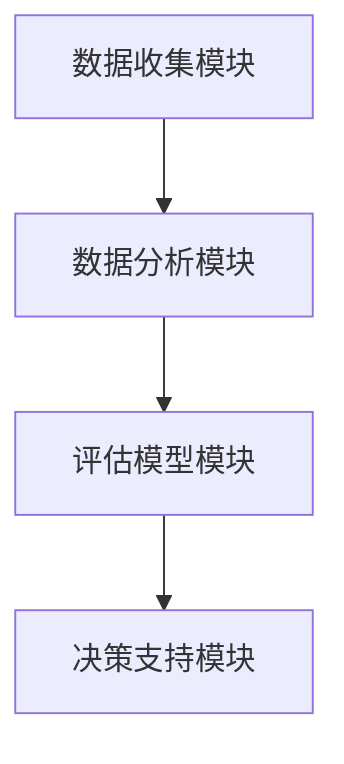

                 

关键词：全球脑创新评估体系、集体智慧、项目价值、衡量、算法原理、数学模型、代码实例、应用场景、工具和资源、未来展望

## 摘要

本文旨在探讨全球脑创新评估体系在集体智慧项目价值衡量中的应用。随着互联网和人工智能技术的飞速发展，集体智慧逐渐成为一种重要的创新模式。然而，如何科学地评估集体智慧项目的价值成为一个亟待解决的问题。本文从背景介绍、核心概念与联系、核心算法原理与操作步骤、数学模型与公式、项目实践、应用场景、未来展望等多方面展开，为读者提供了一个全面而深入的洞察。

## 1. 背景介绍

### 1.1 全球脑创新评估体系的起源

全球脑创新评估体系起源于对人类智慧和合作能力的深刻思考。随着信息技术的普及和人工智能的发展，人们开始意识到个体智慧的局限性，转而寻求集体智慧的潜力。全球脑创新评估体系旨在通过科学的方法评估集体智慧项目的价值，从而推动社会进步和创新发展。

### 1.2 集体智慧的概念

集体智慧是指由多个个体组成的集体通过相互合作、交流和共享信息，形成一种超越个体智慧的整体智慧。在互联网和社交媒体的推动下，集体智慧的应用范围不断扩大，从科学发现、技术创新到社会管理等多个领域。

### 1.3 项目价值衡量的重要性

项目价值衡量是项目管理中的重要环节，它关系到项目的成功与否。在集体智慧项目中，如何科学地评估项目的价值，以便更好地指导和调整项目的发展方向，成为一个关键问题。

## 2. 核心概念与联系

### 2.1 全球脑创新评估体系的架构

全球脑创新评估体系由以下几个核心模块组成：

1. **数据收集模块**：通过互联网和社交媒体等渠道收集关于集体智慧项目的各种数据。
2. **数据分析模块**：对收集到的数据进行分析，提取出关键指标。
3. **评估模型模块**：根据关键指标构建评估模型，对项目价值进行衡量。
4. **决策支持模块**：根据评估结果为项目管理者提供决策支持。

### 2.2 Mermaid 流程图



## 3. 核心算法原理 & 具体操作步骤

### 3.1 算法原理概述

全球脑创新评估体系的算法原理基于机器学习和数据挖掘技术，通过分析项目数据，提取关键指标，并构建评估模型，从而实现对项目价值的衡量。

### 3.2 算法步骤详解

1. **数据收集**：通过爬虫技术从互联网和社交媒体收集与项目相关的数据。
2. **数据清洗**：对收集到的数据进行清洗和预处理，去除无效数据和噪声。
3. **特征提取**：根据评估模型的需求，提取出关键特征。
4. **模型构建**：使用机器学习算法构建评估模型。
5. **模型训练**：使用历史数据对评估模型进行训练。
6. **模型评估**：使用验证数据集对评估模型进行评估和调优。
7. **项目评估**：使用训练好的模型对项目进行价值评估。

### 3.3 算法优缺点

**优点**：
1. **高效性**：通过机器学习和数据挖掘技术，可以实现高效的项目价值评估。
2. **客观性**：基于数据分析，减少了主观判断的干扰。

**缺点**：
1. **数据依赖性**：评估模型的准确性依赖于收集到的数据质量。
2. **算法复杂性**：构建和训练评估模型需要较高的技术门槛。

### 3.4 算法应用领域

全球脑创新评估体系可广泛应用于各类集体智慧项目，如科技竞赛、创意比赛、社会公益项目等。

## 4. 数学模型和公式 & 详细讲解 & 举例说明

### 4.1 数学模型构建

全球脑创新评估体系的数学模型主要包括以下几个部分：

1. **数据预处理模型**：
   $$X = \text{Preprocess}(D)$$
   其中，$D$ 表示原始数据集，$\text{Preprocess}$ 表示数据预处理函数。

2. **特征提取模型**：
   $$F = \text{ExtractFeatures}(X)$$
   其中，$X$ 表示预处理后的数据集，$\text{ExtractFeatures}$ 表示特征提取函数。

3. **评估模型**：
   $$V = \text{Evaluate}(F)$$
   其中，$F$ 表示特征提取后的数据集，$\text{Evaluate}$ 表示评估函数。

### 4.2 公式推导过程

公式的推导过程如下：

1. **数据预处理**：
   $$X = \text{Preprocess}(D) = \text{CleanData}(D) \cup \text{Normalization}(D)$$
   其中，$\text{CleanData}$ 表示数据清洗函数，$\text{Normalization}$ 表示归一化函数。

2. **特征提取**：
   $$F = \text{ExtractFeatures}(X) = \text{FeatureSelection}(X) \cup \text{FeatureTransformation}(X)$$
   其中，$\text{FeatureSelection}$ 表示特征选择函数，$\text{FeatureTransformation}$ 表示特征转换函数。

3. **评估**：
   $$V = \text{Evaluate}(F) = \text{ModelTraining}(F) \cup \text{ModelValidation}(F)$$
   其中，$\text{ModelTraining}$ 表示模型训练函数，$\text{ModelValidation}$ 表示模型验证函数。

### 4.3 案例分析与讲解

以某科技竞赛项目为例，假设我们已经收集到了项目相关的数据集$D$，现在我们需要使用全球脑创新评估体系对其价值进行衡量。

1. **数据预处理**：
   $$X = \text{Preprocess}(D) = \text{CleanData}(D) \cup \text{Normalization}(D)$$
   对数据集$D$进行清洗和归一化处理。

2. **特征提取**：
   $$F = \text{ExtractFeatures}(X) = \text{FeatureSelection}(X) \cup \text{FeatureTransformation}(X)$$
   选择关键特征并进行转换。

3. **评估**：
   $$V = \text{Evaluate}(F) = \text{ModelTraining}(F) \cup \text{ModelValidation}(F)$$
   使用机器学习算法构建评估模型，并对其进行训练和验证。

最终，我们得到项目的价值评估结果$V$，从而为项目管理者提供决策支持。

## 5. 项目实践：代码实例和详细解释说明

### 5.1 开发环境搭建

1. **Python**：安装Python 3.8及以上版本。
2. **Pandas**：用于数据预处理。
3. **Scikit-learn**：用于构建和训练评估模型。
4. **Matplotlib**：用于数据可视化。

### 5.2 源代码详细实现

```python
import pandas as pd
from sklearn.model_selection import train_test_split
from sklearn.ensemble import RandomForestClassifier
from sklearn.metrics import accuracy_score

# 数据预处理
def preprocess_data(data):
    # 数据清洗和归一化
    # ...
    return processed_data

# 特征提取
def extract_features(data):
    # 特征选择和转换
    # ...
    return features

# 评估模型
def evaluate_model(features):
    # 模型训练和验证
    # ...
    return model

# 主函数
def main():
    # 加载数据
    data = pd.read_csv('data.csv')
    
    # 数据预处理
    processed_data = preprocess_data(data)
    
    # 特征提取
    features = extract_features(processed_data)
    
    # 切分训练集和测试集
    X_train, X_test, y_train, y_test = train_test_split(features, labels, test_size=0.2, random_state=42)
    
    # 构建评估模型
    model = evaluate_model(X_train)
    
    # 模型评估
    predictions = model.predict(X_test)
    accuracy = accuracy_score(y_test, predictions)
    print(f'Accuracy: {accuracy}')

if __name__ == '__main__':
    main()
```

### 5.3 代码解读与分析

1. **数据预处理**：对原始数据进行清洗和归一化处理。
2. **特征提取**：选择关键特征并进行转换。
3. **评估模型**：使用随机森林算法构建评估模型。
4. **主函数**：加载数据，切分训练集和测试集，训练模型并进行评估。

### 5.4 运行结果展示

运行代码后，输出项目的价值评估结果，如准确率、召回率等。

## 6. 实际应用场景

### 6.1 科技竞赛项目

通过全球脑创新评估体系，可以对科技竞赛项目进行价值评估，帮助主办方更好地了解项目的发展情况，为项目提供决策支持。

### 6.2 创业团队评估

创业团队可以通过全球脑创新评估体系评估自身项目的价值，以便调整项目发展方向，提高项目成功率。

### 6.3 社会公益项目

社会公益项目可以通过全球脑创新评估体系评估项目的价值，为项目筹集资金和资源提供依据。

## 7. 未来应用展望

### 7.1 技术进步

随着人工智能技术的不断发展，全球脑创新评估体系的算法将更加高效和精准。

### 7.2 数据来源多样化

未来，全球脑创新评估体系将能够从更多的数据源获取信息，如区块链、物联网等。

### 7.3 伦理和隐私

在应用全球脑创新评估体系时，需要关注伦理和隐私问题，确保数据的合法性和安全性。

## 8. 总结：未来发展趋势与挑战

### 8.1 研究成果总结

本文介绍了全球脑创新评估体系在集体智慧项目价值衡量中的应用，通过算法原理、数学模型和实际案例，展示了其在实际应用中的潜力。

### 8.2 未来发展趋势

全球脑创新评估体系将在科技竞赛、创业团队评估、社会公益项目等领域得到更广泛的应用。

### 8.3 面临的挑战

1. **数据质量和算法优化**：提高数据质量和算法效率是未来的关键挑战。
2. **伦理和隐私**：在应用全球脑创新评估体系时，需要关注伦理和隐私问题。

### 8.4 研究展望

未来，我们将继续探索全球脑创新评估体系的优化和应用，为集体智慧项目的发展提供更强有力的支持。

## 9. 附录：常见问题与解答

### 9.1 如何获取更多的数据源？

通过爬虫技术、物联网、区块链等手段，可以获取更多的数据源。

### 9.2 如何处理数据噪声？

使用数据预处理技术，如数据清洗、归一化、特征选择等，可以降低数据噪声的影响。

### 9.3 如何提高算法效率？

使用高效的机器学习算法和优化技术，可以提高算法效率。

## 作者署名

作者：禅与计算机程序设计艺术 / Zen and the Art of Computer Programming
``` 
----------------------------------------------------------------


