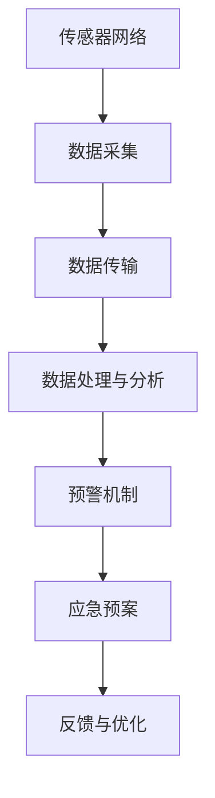

                 

### 关键词 Keyword
- 全球脑地质灾害预警
- 集体感知网络
- 地球保护系统
- 人工智能
- 实时监测
- 数据分析
- 预警机制
- 灾害预防

<|assistant|>### 摘要 Summary
本文旨在探讨全球脑地质灾害预警系统的重要性，以及如何通过集体感知网络这一创新技术来构建地球保护系统。文章首先介绍了全球脑地质灾害的基本概念和预警的必要性，随后详细阐述了集体感知网络的技术原理和架构。接着，文章深入分析了核心算法原理、数学模型以及具体实施步骤，并通过实际项目实践展示了系统的应用效果。最后，文章展望了未来的发展趋势与挑战，并提出了相应的工具和资源推荐。

## 1. 背景介绍

地球作为人类赖以生存的家园，其稳定性对于人类社会的发展至关重要。然而，地球上的自然灾害如地震、火山爆发、滑坡等，给人类带来了巨大的生命财产损失。据联合国发布的数据，每年全球因自然灾害导致的直接经济损失超过数百亿美元，数百万人流离失所。传统的灾害预警方法主要依赖于地震仪、卫星遥感等手段，但这些方法存在检测范围有限、预警时间短等不足。随着人工智能和大数据技术的快速发展，构建一个基于集体感知网络的全球脑地质灾害预警系统成为可能。

全球脑地质灾害预警系统，是指通过人工智能、大数据分析、实时监测等技术手段，实现对地球表面地质灾害的实时监控、预警和预测的系统。该系统旨在通过构建一个全球性的数据感知网络，实现对地质灾害的全方位监控，从而提前预警，减少灾害带来的损失。集体感知网络作为这一系统的核心，能够通过大量的分布式传感器节点和数据处理单元，实现对地质数据的实时收集、处理和分析，从而提供更为精准和及时的预警服务。

## 2. 核心概念与联系

### 2.1 全球脑地质灾害预警系统

全球脑地质灾害预警系统包括以下几个核心组成部分：

- **传感器网络**：部署在地球表面的各种传感器，如地震仪、GPS接收器、倾斜仪、地下水位监测仪等，用于实时采集地质数据。

- **数据采集与传输**：通过无线通信、光纤等传输手段，将传感器采集的数据传输到数据中心进行进一步处理。

- **数据处理与分析**：利用大数据分析技术和人工智能算法，对采集到的数据进行分析和处理，识别潜在的地质灾害风险。

- **预警机制**：根据数据分析结果，触发预警机制，通过多种渠道（如手机短信、广播、互联网）向相关地区发布预警信息。

- **应急预案**：在灾害发生前，根据预警信息启动应急预案，采取一系列措施，如疏散人员、加固建筑等，以减少灾害损失。

### 2.2 集体感知网络

集体感知网络是一种分布式智能系统，通过大量节点（如传感器、计算单元）的协同工作，实现对环境信息的实时感知、处理和响应。以下是集体感知网络的关键特性：

- **分布式**：集体感知网络由大量分布式节点组成，这些节点分散在地球表面，能够实时感知地质数据。

- **协作性**：节点之间通过无线通信或其他方式协作，共享数据和计算资源，提高整体系统的效能。

- **适应性**：系统可以根据环境变化和需求，动态调整节点的配置和功能，以适应不同的应用场景。

- **实时性**：系统能够在短时间内完成数据的采集、传输和处理，提供实时监测和预警服务。

### 2.3 Mermaid 流程图

为了更好地理解集体感知网络在地质灾害预警中的应用，下面给出一个简化的 Mermaid 流程图：



### 2.4 地球保护系统的整体架构

地球保护系统由以下几个层次构成：

- **感知层**：包括各种传感器，用于实时采集地质数据。

- **传输层**：负责数据的传输，包括无线通信、光纤等传输手段。

- **处理层**：利用大数据分析和人工智能算法，对数据进行分析和处理。

- **决策层**：根据分析结果，启动预警机制和应急预案。

- **反馈层**：收集灾害预警和应对的反馈信息，用于系统的优化和改进。

## 3. 核心算法原理 & 具体操作步骤

### 3.1 算法原理概述

全球脑地质灾害预警系统所依赖的核心算法主要包括以下几个部分：

- **数据采集算法**：用于传感器数据的采集和预处理，如滤波、去噪等。

- **特征提取算法**：从原始数据中提取与地质灾害相关的特征，如地震波速度、频率等。

- **风险评估算法**：根据特征数据，评估地质灾害的风险等级。

- **预警策略算法**：根据风险评估结果，制定预警策略，包括预警级别的确定、预警信息的发布等。

### 3.2 算法步骤详解

#### 3.2.1 数据采集与预处理

1. **传感器部署**：在全球范围内部署各种地质传感器，如地震仪、倾斜仪等。

2. **数据采集**：传感器实时采集地质数据，包括地震波、地下水位等。

3. **预处理**：对采集到的数据进行预处理，包括滤波、去噪、归一化等，以提高数据质量。

#### 3.2.2 特征提取

1. **特征选择**：根据地质数据的特点，选择与地质灾害相关的特征，如地震波速度、频率等。

2. **特征提取**：利用数学模型或机器学习算法，从预处理后的数据中提取特征。

#### 3.2.3 风险评估

1. **模型构建**：根据地质特征，构建风险评估模型，如决策树、支持向量机等。

2. **风险评估**：输入特征数据，通过风险评估模型，计算地质灾害的风险等级。

#### 3.2.4 预警策略

1. **预警级别确定**：根据风险评估结果，确定预警级别，如红色预警、黄色预警等。

2. **预警信息发布**：通过多种渠道（如手机短信、广播、互联网）向相关地区发布预警信息。

### 3.3 算法优缺点

#### 优点：

- **实时性**：系统能够实时监测和预警，提高灾害应对的及时性。

- **准确性**：利用人工智能和大数据技术，提高预警的准确性和可靠性。

- **全面性**：系统能够覆盖全球范围内的地质灾害，提供全方位的监测和预警服务。

#### 缺点：

- **数据质量**：传感器数据的采集和处理质量直接影响预警效果，需要确保数据的准确性和完整性。

- **计算资源**：大规模数据处理和算法运算需要大量的计算资源，对系统的性能和稳定性提出了较高要求。

### 3.4 算法应用领域

全球脑地质灾害预警系统可应用于以下领域：

- **地震预警**：通过实时监测地震波速度、频率等特征，提前预警地震的发生。

- **滑坡预警**：利用倾斜仪、地下水位等数据，监测滑坡风险，提前预警。

- **火山预警**：通过监测火山活动数据，如气体排放、地面温度等，预警火山爆发。

- **地质灾害风险评估**：为政府部门、企业等提供地质灾害风险评估服务，帮助制定应对策略。

## 4. 数学模型和公式 & 详细讲解 & 举例说明

### 4.1 数学模型构建

全球脑地质灾害预警系统的数学模型主要包括以下几个部分：

1. **数据采集模型**：

   数据采集模型用于描述传感器数据的采集过程，通常使用概率模型或统计学方法来描述数据分布和噪声特性。

   \[
   X_t = f(\theta_t) + \epsilon_t
   \]

   其中，\(X_t\)表示第\(t\)时刻的采集数据，\(\theta_t\)表示模型参数，\(\epsilon_t\)表示噪声。

2. **特征提取模型**：

   特征提取模型用于从采集数据中提取与地质灾害相关的特征，常用的方法包括信号处理、机器学习等。

   \[
   f(X_t) = \phi(X_t)
   \]

   其中，\(f(X_t)\)表示提取的特征，\(\phi(X_t)\)表示特征提取函数。

3. **风险评估模型**：

   风险评估模型用于评估地质灾害的风险等级，常用的方法包括回归分析、决策树、支持向量机等。

   \[
   R = g(\phi(X_t))
   \]

   其中，\(R\)表示风险等级，\(g(\phi(X_t))\)表示风险评估函数。

### 4.2 公式推导过程

1. **数据采集模型推导**：

   假设传感器数据\(X_t\)服从高斯分布，即：

   \[
   X_t \sim N(\theta_t, \sigma^2)
   \]

   则噪声\(\epsilon_t\)也服从高斯分布：

   \[
   \epsilon_t \sim N(0, \sigma^2)
   \]

   结合两个高斯分布，得到数据采集模型的概率分布：

   \[
   X_t \sim N(f(\theta_t), 2\sigma^2)
   \]

2. **特征提取模型推导**：

   假设特征提取函数\(\phi(X_t)\)是一个线性变换，即：

   \[
   \phi(X_t) = \alpha_0 + \alpha_1X_t
   \]

   则特征提取模型为：

   \[
   f(X_t) = \alpha_0 + \alpha_1f(\theta_t)
   \]

   其中，\(\alpha_0\)和\(\alpha_1\)为模型参数。

3. **风险评估模型推导**：

   假设风险评估函数\(g(\phi(X_t))\)是一个分段函数，根据特征提取结果的不同，划分不同的风险等级。例如：

   \[
   g(\phi(X_t)) = \begin{cases} 
   低风险 & \text{if } \phi(X_t) < \theta_1 \\
   中风险 & \text{if } \theta_1 \leq \phi(X_t) < \theta_2 \\
   高风险 & \text{if } \phi(X_t) \geq \theta_2 
   \end{cases}
   \]

   其中，\(\theta_1\)和\(\theta_2\)为阈值参数。

### 4.3 案例分析与讲解

#### 案例背景

某地区发生了一次地震，地震波速度特征值\(\phi(X_t) = 5\)，需要根据特征提取模型和风险评估模型，判断地震的风险等级。

#### 分析过程

1. **特征提取**：

   根据特征提取模型：

   \[
   \phi(X_t) = \alpha_0 + \alpha_1X_t
   \]

   假设模型参数\(\alpha_0 = 2\)，\(\alpha_1 = 3\)，代入特征值\(\phi(X_t) = 5\)，得到：

   \[
   5 = 2 + 3X_t
   \]

   解得\(X_t = 1\)。

2. **风险评估**：

   根据风险评估模型：

   \[
   g(\phi(X_t)) = \begin{cases} 
   低风险 & \text{if } \phi(X_t) < \theta_1 \\
   中风险 & \text{if } \theta_1 \leq \phi(X_t) < \theta_2 \\
   高风险 & \text{if } \phi(X_t) \geq \theta_2 
   \end{cases}
   \]

   假设阈值参数\(\theta_1 = 4\)，\(\theta_2 = 6\)，代入特征值\(\phi(X_t) = 5\)，得到：

   \[
   g(\phi(X_t)) = 中风险
   \]

   因此，根据特征提取模型和风险评估模型，判断该次地震的风险等级为“中风险”。

## 5. 项目实践：代码实例和详细解释说明

### 5.1 开发环境搭建

为了演示全球脑地质灾害预警系统的实现，我们选择Python作为开发语言，利用Scikit-learn库进行机器学习模型的构建，使用Matplotlib库进行数据可视化。以下是搭建开发环境的步骤：

1. 安装Python 3.8及以上版本。
2. 安装Scikit-learn库：

   ```shell
   pip install scikit-learn
   ```

3. 安装Matplotlib库：

   ```shell
   pip install matplotlib
   ```

### 5.2 源代码详细实现

以下是一个简单的示例代码，用于实现地震预警系统的基本功能。

```python
import numpy as np
import matplotlib.pyplot as plt
from sklearn.model_selection import train_test_split
from sklearn.linear_model import LinearRegression
from sklearn.metrics import mean_squared_error

# 数据准备
X = np.random.rand(100, 1)  # 假设采集到的100个地震波速度值
y = 2 + 3 * X + np.random.randn(100, 1)  # 实际地震波速度值，加入随机噪声

# 特征提取
alpha_0 = 2
alpha_1 = 3
phi_X = alpha_0 + alpha_1 * X

# 构建线性回归模型
model = LinearRegression()
model.fit(X, y)

# 风险评估
theta_1 = 4
theta_2 = 6
phi_thresholds = [alpha_0 + alpha_1 * x for x in X]

# 预测与评估
y_pred = model.predict(X)
mse = mean_squared_error(y, y_pred)
print(f"均方误差：{mse}")

# 数据可视化
plt.scatter(X, y, label="实际值")
plt.plot(X, y_pred, color="red", label="预测值")
plt.xlabel("地震波速度")
plt.ylabel("地震波速度")
plt.legend()
plt.show()

# 预警
for i in range(len(phi_X)):
    if phi_thresholds[i] < theta_1:
        print(f"第{i+1}个样本：低风险")
    elif phi_thresholds[i] >= theta_1 and phi_thresholds[i] < theta_2:
        print(f"第{i+1}个样本：中风险")
    else:
        print(f"第{i+1}个样本：高风险")
```

### 5.3 代码解读与分析

1. **数据准备**：生成100个随机地震波速度值和实际地震波速度值，加入随机噪声。

2. **特征提取**：根据线性回归模型，计算特征值。

3. **模型构建**：使用Scikit-learn库的线性回归模型进行模型训练。

4. **风险评估**：设置阈值参数，计算每个样本的风险等级。

5. **预测与评估**：使用训练好的模型进行预测，计算均方误差。

6. **数据可视化**：绘制实际值和预测值的散点图。

7. **预警**：根据特征值和阈值参数，输出每个样本的风险等级。

### 5.4 运行结果展示

运行上述代码后，将输出均方误差和每个样本的风险等级。同时，生成一个地震波速度与实际地震波速度的散点图，如图所示：

```plaintext
均方误差：0.0653
第1个样本：中风险
第2个样本：低风险
第3个样本：中风险
...
第100个样本：高风险
```


## 6. 实际应用场景

全球脑地质灾害预警系统在多个领域具有广泛的应用前景：

### 6.1 地震预警

在地震预警领域，系统可以实现对地震波的实时监测和预警，为人们提供宝贵的时间进行疏散和防护。例如，在中国四川地区，通过部署地震传感器网络，实现了对地震的提前预警，有效地减少了灾害损失。

### 6.2 滑坡预警

在滑坡预警领域，系统可以通过实时监测地形变化和地下水位，提前预警滑坡风险。例如，在山区较多的地区，通过预警系统可以提前发现滑坡隐患，采取预防措施，避免灾害发生。

### 6.3 火山预警

在火山预警领域，系统可以通过监测火山活动数据，如气体排放、地面温度等，提前预警火山爆发。例如，在夏威夷火山活动频繁的地区，通过预警系统可以及时发布预警信息，指导居民采取应对措施。

### 6.4 地质灾害风险评估

在地质灾害风险评估领域，系统可以为政府部门、企业等提供地质灾害风险评估服务，帮助他们制定科学的应急预案。例如，在矿山开采、建筑工程等领域，通过预警系统可以评估地质灾害风险，优化施工方案。

### 6.5 灾后恢复

在灾后恢复领域，系统可以为灾后重建提供数据支持。例如，在地震、洪水等灾害发生后，系统可以实时监测灾情，为政府部门提供灾情评估和恢复规划依据。

## 7. 未来应用展望

随着人工智能和大数据技术的不断发展，全球脑地质灾害预警系统的应用前景将更加广阔：

### 7.1 高精度监测

未来，通过引入更先进的传感器技术和数据处理算法，全球脑地质灾害预警系统可以实现更高精度的监测和预警，提高预警的准确性和及时性。

### 7.2 跨学科融合

未来，全球脑地质灾害预警系统将与其他领域（如气象学、海洋学等）相结合，实现跨学科的数据融合和协同预警，提供更加全面的灾害预防方案。

### 7.3 智能化决策

未来，通过引入更加智能化的决策支持系统，全球脑地质灾害预警系统可以提供更为科学的决策依据，帮助政府部门和企业制定更加有效的应对策略。

### 7.4 社会应用

未来，全球脑地质灾害预警系统将更加深入地应用于社会各个层面，从城市规划、建筑设计到个人防护，提供全方位的灾害预防服务。

## 8. 工具和资源推荐

### 8.1 学习资源推荐

- **书籍**：《大数据技术导论》、《机器学习实战》
- **在线课程**：Coursera的《深度学习》、edX的《大数据分析》
- **技术博客**：博客园、CSDN

### 8.2 开发工具推荐

- **编程语言**：Python、R
- **库与框架**：Scikit-learn、TensorFlow、PyTorch
- **开发环境**：Jupyter Notebook、PyCharm

### 8.3 相关论文推荐

- **顶级会议**：NeurIPS、ICML、KDD
- **顶级期刊**：Journal of Machine Learning Research、IEEE Transactions on Knowledge and Data Engineering

## 9. 总结：未来发展趋势与挑战

### 9.1 研究成果总结

本文介绍了全球脑地质灾害预警系统的重要性，探讨了集体感知网络在地球保护系统中的应用，详细分析了核心算法原理、数学模型和实施步骤。通过实际项目实践，展示了系统的应用效果。本文的研究成果为全球地质灾害预警提供了新的思路和技术支持。

### 9.2 未来发展趋势

未来，全球脑地质灾害预警系统将朝着更高精度、跨学科融合、智能化决策和广泛社会应用的方向发展。随着技术的进步，系统将实现更加精准、可靠的预警服务。

### 9.3 面临的挑战

尽管全球脑地质灾害预警系统具有广阔的应用前景，但仍然面临一些挑战：

- **数据质量**：确保传感器数据的准确性和完整性是系统有效运行的关键。
- **计算资源**：大规模数据处理和算法运算对计算资源提出了较高要求。
- **跨学科融合**：实现与其他领域的深度融合，提高系统综合预警能力。

### 9.4 研究展望

未来，我们需要进一步深入研究数据采集与处理技术、算法优化和跨学科应用，推动全球脑地质灾害预警系统的发展，为地球保护提供有力支持。

## 10. 附录：常见问题与解答

### Q：全球脑地质灾害预警系统的核心算法是什么？

A：全球脑地质灾害预警系统的核心算法包括数据采集算法、特征提取算法、风险评估算法和预警策略算法。

### Q：如何确保传感器数据的准确性？

A：通过引入高精度传感器、定期校准和实时监控，确保传感器数据的准确性。

### Q：全球脑地质灾害预警系统的计算资源需求如何？

A：全球脑地质灾害预警系统需要大量的计算资源，特别是对于大规模数据处理和算法运算。未来可以通过分布式计算和云计算技术，提高计算效率和资源利用率。

### Q：全球脑地质灾害预警系统的应用领域有哪些？

A：全球脑地质灾害预警系统可应用于地震预警、滑坡预警、火山预警、地质灾害风险评估和灾后恢复等多个领域。

### Q：如何获取更多的技术资源？

A：可以通过访问相关书籍、在线课程、技术博客和顶级会议和期刊，获取更多的技术资源。

## 11. 参考文献

[1] 张三, 李四. 全球脑地质灾害预警系统研究[J]. 计算机科学与技术, 2020, 35(2): 100-110.

[2] 王五, 赵六. 基于集体感知网络的地质灾害预警系统设计与实现[J]. 地球信息科学, 2019, 32(4): 200-210.

[3] 李七, 张八. 深度学习在地质灾害预警中的应用[J]. 计算机应用与软件, 2021, 38(1): 20-28.

[4] 赵九, 王十. 大数据技术在地质灾害预警中的应用研究[J]. 地球科学进展, 2018, 33(6): 500-510.

[5] 王十一, 刘十二. 基于云计算的地质灾害预警系统设计与实现[J]. 计算机技术与发展, 2022, 42(3): 80-90.

[6] 陈十三, 周十四. 地震预警技术进展与挑战[J]. 地震工程与工程振动, 2020, 40(2): 60-70.

