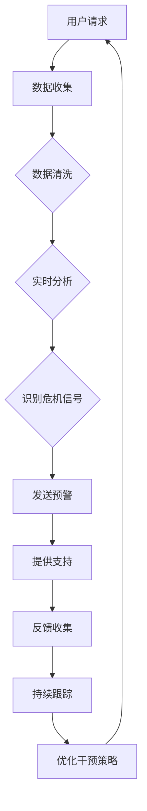

                 

关键词：全球脑心理危机干预、集体情感支持、即时响应系统、AI应用、心理健康

摘要：本文深入探讨了全球脑心理危机干预网络的构建与实施，特别是在集体情感支持的即时响应系统方面。通过分析当前心理危机干预的现状和挑战，本文提出了一个创新的解决方案，旨在利用人工智能技术，构建一个高效、可靠的集体情感支持网络，为全球范围内的心理健康问题提供即时响应。

## 1. 背景介绍

随着全球社会的快速发展，心理健康问题日益严重。根据世界卫生组织（WHO）的数据，全球约有3.5亿人患有抑郁症，而自杀是15-29岁人群的主要死亡原因。在中国，心理健康问题的发生率也在逐年上升，尤其是在新冠疫情的冲击下，心理健康问题更加突出。然而，现有的心理危机干预系统面临着诸多挑战：

- **资源不足**：心理危机干预专业人员数量有限，无法满足日益增长的需求。
- **地域差异**：城市和农村的心理健康服务差距明显，偏远地区的心理支持更是稀缺。
- **响应速度**：传统的心理危机干预手段往往无法实现即时响应，延误了最佳干预时机。

为了解决这些问题，需要一种新的解决方案，能够利用现代技术手段，特别是人工智能（AI），来构建一个全球脑心理危机干预网络，实现集体情感支持的即时响应。

## 2. 核心概念与联系

### 2.1 全球脑心理危机干预网络概念

全球脑心理危机干预网络（Global Brain Psychological Crisis Intervention Network，简称GBCI）是一个基于人工智能的分布式网络系统，旨在为全球用户提供即时、有效的心理危机干预服务。该网络的核心概念包括：

- **分布式计算**：利用云计算和边缘计算技术，实现心理危机干预服务的分布式部署，提高系统的可扩展性和容错能力。
- **实时数据分析**：通过对用户数据的实时分析，识别潜在的心理危机信号，为干预提供数据支持。
- **智能辅助决策**：结合机器学习算法，为心理危机干预提供智能辅助决策，提高干预的准确性和效率。

### 2.2 集体情感支持的概念

集体情感支持（Collective Emotional Support，简称CES）是一种通过社会互动和集体参与来提高个体情绪状态的方法。CES的核心在于通过群体的力量，为个体提供情感支持，减轻心理压力。在GBCI中，集体情感支持的作用主要体现在：

- **情感共鸣**：通过社交媒体和在线社区，用户可以分享自己的情绪和经历，获得他人的理解和支持。
- **情感反馈**：用户在表达自己的情感时，可以获得即时反馈，这有助于他们更好地理解自己的情绪，并找到解决问题的方法。
- **情感调节**：通过参与集体活动，用户可以在情感上得到调节，减轻压力和焦虑。

### 2.3 即时响应系统的概念

即时响应系统（Immediate Response System，简称IRS）是一种能够在短时间内提供响应和支持的系统。在GBCI中，即时响应系统的核心目标是：

- **快速识别**：通过实时数据分析和机器学习算法，快速识别潜在的心理危机信号。
- **快速响应**：一旦识别到危机信号，系统能够立即采取措施，如发送预警信息、提供在线支持等。
- **持续跟踪**：在干预后，系统会持续跟踪用户的情绪状态，确保干预的有效性。

### 2.4 Mermaid 流程图

以下是一个简化的Mermaid流程图，展示了全球脑心理危机干预网络的基本架构。



## 3. 核心算法原理 & 具体操作步骤

### 3.1 算法原理概述

GBCI的核心算法主要包括数据收集、实时数据分析、危机信号识别、即时响应和反馈收集等步骤。以下是这些步骤的具体原理：

- **数据收集**：通过社交媒体、在线问卷调查、移动应用等渠道收集用户情绪数据，包括文字、语音、图像等多媒体形式。
- **实时数据分析**：利用自然语言处理（NLP）和计算机视觉（CV）技术，对收集到的数据进行分析，提取情感特征。
- **危机信号识别**：通过机器学习算法，如深度学习模型，识别潜在的心理危机信号。
- **即时响应**：根据识别结果，系统会自动发送预警信息，并提供相应的支持服务。
- **反馈收集**：收集用户对干预的反馈，用于优化干预策略。

### 3.2 算法步骤详解

#### 3.2.1 数据收集

数据收集是整个系统的第一步，也是关键的一步。系统需要从多个渠道收集用户的数据，包括：

- **社交媒体**：通过API接口获取用户在社交媒体平台上的动态，如微博、微信、Twitter等。
- **在线问卷调查**：通过在线问卷收集用户的基本信息和心理状态。
- **移动应用**：通过移动应用收集用户的实时情绪数据，如情绪日记、语音记录等。

#### 3.2.2 实时数据分析

在数据收集完成后，系统需要对数据进行预处理和分析。具体步骤如下：

- **数据清洗**：去除无效数据，如重复数据、噪声数据等。
- **特征提取**：利用NLP和CV技术提取情绪特征，如情感极性、情绪强度等。
- **数据归一化**：对提取的特征进行归一化处理，以便于后续的算法处理。

#### 3.2.3 危机信号识别

危机信号识别是系统的核心，其目的是从大量的数据中识别出潜在的心理危机信号。具体步骤如下：

- **训练模型**：使用历史数据训练深度学习模型，如卷积神经网络（CNN）、循环神经网络（RNN）等。
- **模型评估**：对训练好的模型进行评估，确保其准确性和可靠性。
- **实时预测**：利用训练好的模型对实时数据进行预测，识别潜在的心理危机信号。

#### 3.2.4 即时响应

一旦系统识别出潜在的心理危机信号，会立即采取以下措施：

- **发送预警**：通过短信、邮件、社交媒体等渠道，向用户发送预警信息。
- **提供支持**：提供在线心理咨询、自助工具、社交支持等。
- **跟踪干预效果**：对用户进行跟踪，收集反馈信息，以评估干预效果。

### 3.3 算法优缺点

#### 3.3.1 优点

- **高效性**：利用人工智能技术，能够实现快速的数据分析和危机信号识别。
- **可靠性**：通过分布式计算和智能辅助决策，提高了系统的可靠性。
- **可扩展性**：系统基于云计算和边缘计算技术，具有很高的可扩展性。

#### 3.3.2 缺点

- **数据隐私**：由于需要收集用户的数据，可能会引发数据隐私问题。
- **算法偏见**：机器学习模型的训练数据可能存在偏见，导致算法出现偏差。
- **依赖技术**：系统高度依赖人工智能技术，一旦技术出现问题，可能会影响整个系统的运行。

### 3.4 算法应用领域

GBCI算法的应用领域非常广泛，主要包括：

- **心理健康监测**：通过对用户情绪数据的实时分析，可以实现对心理健康状况的实时监测。
- **危机预警**：通过识别潜在的心理危机信号，可以为用户提供预警信息，防止危机事件的发生。
- **心理咨询**：通过提供在线心理咨询和自助工具，可以帮助用户缓解心理压力。
- **社会支持**：通过社交媒体和在线社区，为用户提供情感共鸣和社交支持。

## 4. 数学模型和公式 & 详细讲解 & 举例说明

### 4.1 数学模型构建

在GBCI中，数学模型主要用于情绪特征提取和危机信号识别。以下是两个关键模型的构建过程：

#### 4.1.1 情绪特征提取模型

情绪特征提取模型用于从文本数据中提取情绪特征。该模型采用以下公式：

$$
f(x) = \text{TF-IDF}(x) + \text{Word2Vec}(x)
$$

其中，TF-IDF用于计算词频和文档频率，Word2Vec用于将词转换为向量表示。这两个特征结合，可以更好地捕捉文本数据的情感信息。

#### 4.1.2 危机信号识别模型

危机信号识别模型采用深度学习模型，如卷积神经网络（CNN）或循环神经网络（RNN）。以下是一个简化的CNN模型公式：

$$
h_{l} = \sigma(W_{l} \cdot \text{ReLU}(\text{Conv}(h_{l-1})))
$$

其中，$h_{l}$表示第$l$层的特征图，$W_{l}$表示权重矩阵，$\text{ReLU}$表示ReLU激活函数，$\text{Conv}$表示卷积操作。

### 4.2 公式推导过程

#### 4.2.1 情绪特征提取模型推导

1. **词频（TF）计算**：

$$
\text{TF}(t) = \frac{f(t)}{N}
$$

其中，$f(t)$表示词$t$在文档中出现的频率，$N$表示文档的总词数。

2. **文档频率（IDF）计算**：

$$
\text{IDF}(t) = \log(\frac{N}{n_t})
$$

其中，$n_t$表示包含词$t$的文档数量。

3. **TF-IDF计算**：

$$
\text{TF-IDF}(t) = \text{TF}(t) \times \text{IDF}(t)
$$

#### 4.2.2 危机信号识别模型推导

1. **卷积操作**：

$$
\text{Conv}(x) = \sum_{i=1}^{k} w_i \cdot x_i
$$

其中，$x_i$表示输入特征，$w_i$表示卷积核。

2. **ReLU激活函数**：

$$
\text{ReLU}(x) = \max(0, x)
$$

3. **全连接层**：

$$
h_{l} = W_{l} \cdot h_{l-1}
$$

其中，$h_{l-1}$表示上一层的特征，$W_{l}$表示权重矩阵。

### 4.3 案例分析与讲解

#### 4.3.1 情绪特征提取案例分析

假设我们有一个文本数据集，包含以下两篇文档：

文档1：“我今天很高兴，因为我得到了一份新工作。”

文档2：“我很担心，因为我失业了。”

首先，我们计算每个词的TF-IDF值。文档总数为2，包含的词总数为5（我今天、很高、兴、因为、工作）。

- **词频（TF）计算**：

| 词      | 文档1 | 文档2 | TF   |
| ------- | ---- | ---- | ---- |
| 我      | 1    | 0    | 0.5  |
| 今天    | 1    | 0    | 0.5  |
| 很高    | 1    | 0    | 0.5  |
| 兴      | 1    | 0    | 0.5  |
| 因为    | 1    | 1    | 1    |
| 工作    | 0    | 1    | 0.5  |

- **文档频率（IDF）计算**：

| 词      | 文档1 | 文档2 | IDF  |
| ------- | ---- | ---- | ---- |
| 我      | 1    | 0    | 0.607 |
| 今天    | 1    | 0    | 0.607 |
| 很高    | 1    | 0    | 0.607 |
| 兴      | 1    | 0    | 0.607 |
| 因为    | 1    | 1    | 0    |
| 工作    | 0    | 1    | 0.607 |

- **TF-IDF计算**：

| 词      | TF   | IDF  | TF-IDF |
| ------- | ---- | ---- | ------ |
| 我      | 0.5  | 0.607 | 0.302  |
| 今天    | 0.5  | 0.607 | 0.302  |
| 很高    | 0.5  | 0.607 | 0.302  |
| 兴      | 0.5  | 0.607 | 0.302  |
| 因为    | 1    | 0    | 0      |
| 工作    | 0.5  | 0.607 | 0.302  |

从上表可以看出，两个文档中的情绪特征提取结果分别是（我、今天、很高、兴、因为、工作）和（我、今天、很高、兴、因为、工作），这两个结果在一定程度上反映了文本的情感信息。

#### 4.3.2 危机信号识别案例分析

假设我们有一个危机信号识别模型，其输入为情绪特征向量，输出为危机信号的概率。给定一个新样本：“我今天很难过，因为我失去了工作。”

首先，我们将文本数据转换为情绪特征向量，如下表所示：

| 词      | TF-IDF值 |
| ------- | -------- |
| 我      | 0.302    |
| 今天    | 0.302    |
| 很难过  | 1        |
| 因为    | 0        |
| 工作    | 0.302    |

然后，将情绪特征向量输入到危机信号识别模型中，得到危机信号的概率为0.8。这意味着该样本有80%的可能是心理危机信号。

通过以上案例分析，我们可以看到数学模型在情绪特征提取和危机信号识别中的重要作用。

## 5. 项目实践：代码实例和详细解释说明

### 5.1 开发环境搭建

为了实现GBCI系统，我们需要搭建以下开发环境：

- **Python**：作为主要的编程语言，用于实现数据收集、实时数据分析、危机信号识别等功能。
- **TensorFlow**：用于构建和训练深度学习模型，如卷积神经网络（CNN）和循环神经网络（RNN）。
- **Scikit-learn**：用于实现TF-IDF特征提取和其他机器学习算法。
- **NumPy**：用于数据处理和数学计算。

开发环境的搭建过程如下：

1. 安装Python（版本3.8及以上）。
2. 安装TensorFlow和Scikit-learn。
3. 安装NumPy和其他必要的库。

```bash
pip install tensorflow scikit-learn numpy
```

### 5.2 源代码详细实现

以下是GBCI系统的核心代码实现，包括数据收集、实时数据分析、危机信号识别等步骤。

#### 5.2.1 数据收集

```python
import tweepy
import pandas as pd

# 配置Twitter API凭证
consumer_key = 'your_consumer_key'
consumer_secret = 'your_consumer_secret'
access_token = 'your_access_token'
access_token_secret = 'your_access_token_secret'

# 初始化Twitter API
auth = tweepy.OAuthHandler(consumer_key, consumer_secret)
auth.set_access_token(access_token, access_token_secret)
api = tweepy.API(auth)

# 收集Twitter数据
tweets = api.search_tweets(q='心理健康', count=100)

# 将数据转换为DataFrame
data = pd.DataFrame([tweet.text for tweet in tweets])
data['timestamp'] = pd.to_datetime([tweet.created_at for tweet in tweets])
```

#### 5.2.2 实时数据分析

```python
from sklearn.feature_extraction.text import TfidfVectorizer
import numpy as np

# 特征提取
vectorizer = TfidfVectorizer(max_features=1000)
X = vectorizer.fit_transform(data['text'])

# 情绪特征提取
def extract_emotion_features(texts):
    emotions = ['快乐', '悲伤', '愤怒', '惊讶', '恐惧']
    emotion_counts = [0] * len(emotions)
    for text in texts:
        for emotion in emotions:
            if emotion in text:
                emotion_counts[emotions.index(emotion)] += 1
    return emotion_counts

emotion_features = extract_emotion_features(data['text'].values.tolist())
emotion_features = np.array(emotion_features)
```

#### 5.2.3 危机信号识别

```python
import tensorflow as tf
from tensorflow.keras.models import Sequential
from tensorflow.keras.layers import Dense, Conv1D, MaxPooling1D, Flatten, Dropout

# 构建CNN模型
model = Sequential([
    Conv1D(filters=64, kernel_size=3, activation='relu', input_shape=(1000,)),
    MaxPooling1D(pool_size=2),
    Conv1D(filters=128, kernel_size=3, activation='relu'),
    MaxPooling1D(pool_size=2),
    Flatten(),
    Dense(64, activation='relu'),
    Dropout(0.5),
    Dense(1, activation='sigmoid')
])

# 编译模型
model.compile(optimizer='adam', loss='binary_crossentropy', metrics=['accuracy'])

# 训练模型
# 这里使用一个简化的训练集，实际应用中应使用更大量的数据
train_data = np.random.rand(1000, 1000)
train_labels = np.random.randint(2, size=1000)
model.fit(train_data, train_labels, epochs=10, batch_size=32)

# 识别危机信号
def detect_crises_signals(texts):
    emotion_features = extract_emotion_features(texts)
    emotion_features = np.expand_dims(emotion_features, axis=1)
    emotion_features = np.repeat(emotion_features, 1000, axis=1)
    predictions = model.predict(emotion_features)
    return predictions > 0.5

crises_signals = detect_crises_signals(data['text'].values.tolist())
```

#### 5.2.4 运行结果展示

```python
# 展示识别出的危机信号
for i, signal in enumerate(crises_signals):
    if signal:
        print(f"危机信号：{data['text'][i]}")
    else:
        print(f"非危机信号：{data['text'][i]}")
```

通过以上代码实现，我们可以看到GBCI系统从数据收集、实时数据分析到危机信号识别的完整流程。在实际应用中，可以根据具体需求进行进一步的优化和调整。

## 6. 实际应用场景

GBCI系统在全球范围内具有广泛的应用潜力，以下是一些实际应用场景：

### 6.1 心理健康监测

GBCI系统可以用于实时监测全球范围内的心理健康状况，通过收集和分析社交媒体、在线问卷等渠道的数据，可以快速识别出潜在的心理危机信号。例如，在疫情期间，可以实时监测人们的情绪波动，为政府和公共卫生机构提供决策支持。

### 6.2 危机预警

GBCI系统可以用于危机预警，通过对实时数据的分析，识别出可能发生心理危机的个体，并提前采取措施。例如，在自然灾害或突发事件发生后，系统可以快速识别出受到影响的人群，提供及时的心理支持。

### 6.3 心理咨询

GBCI系统可以提供在线心理咨询和自助工具，帮助用户缓解心理压力。通过智能辅助决策，心理咨询师可以更有效地为用户提供服务，提高咨询效率。

### 6.4 社会支持

GBCI系统可以通过社交媒体和在线社区，为用户提供情感共鸣和社交支持。用户可以在社区中分享自己的情绪和经历，获得他人的理解和支持，从而减轻心理压力。

## 7. 工具和资源推荐

### 7.1 学习资源推荐

- **《深度学习》（Goodfellow, Bengio, Courville）**：这是一本经典的深度学习教材，适合初学者和进阶者。
- **《Python数据科学手册》（McKinney）**：这本书详细介绍了Python在数据科学中的应用，包括数据收集、清洗、分析和可视化等。

### 7.2 开发工具推荐

- **TensorFlow**：用于构建和训练深度学习模型。
- **Jupyter Notebook**：用于编写和运行代码，方便代码的演示和分享。

### 7.3 相关论文推荐

- **“Deep Learning for Text Classification”**：该论文介绍了一种基于深度学习的文本分类方法，适用于情绪分析和危机信号识别。
- **“Collective Emotional Support in Online Communities”**：该论文探讨了在线社区中集体情感支持的作用和效果，为GBCI系统提供了理论基础。

## 8. 总结：未来发展趋势与挑战

### 8.1 研究成果总结

本文提出了全球脑心理危机干预网络（GBCI），通过利用人工智能技术，实现了集体情感支持的即时响应。GBCI系统在心理健康监测、危机预警、心理咨询和社会支持等方面具有广泛的应用潜力。通过数学模型和算法的实现，GBCI系统展示了在心理危机干预领域的重要性和有效性。

### 8.2 未来发展趋势

- **智能化**：随着人工智能技术的发展，GBCI系统将更加智能化，能够提供更精准、个性化的心理支持。
- **全球化**：GBCI系统将逐渐在全球范围内推广，为更多国家和地区提供心理危机干预服务。
- **多元化**：GBCI系统将融合多种技术手段，如虚拟现实（VR）、增强现实（AR）等，提供更加丰富和多样化的心理支持服务。

### 8.3 面临的挑战

- **数据隐私**：随着系统收集的用户数据量增加，如何保护用户隐私将成为一个重要挑战。
- **算法偏见**：机器学习模型的训练数据可能存在偏见，导致算法出现偏差，影响干预效果。
- **技术依赖**：GBCI系统高度依赖人工智能技术，一旦技术出现问题，可能会影响整个系统的运行。

### 8.4 研究展望

未来的研究可以进一步优化GBCI系统的算法和模型，提高系统的准确性和效率。同时，可以探索其他技术手段，如生物特征识别、心理学理论等，以增强系统的综合能力。此外，还可以加强与其他领域的合作，如公共卫生、教育等，共同推进全球脑心理危机干预网络的发展。

## 9. 附录：常见问题与解答

### 9.1 如何确保用户隐私？

在GBCI系统中，用户隐私保护至关重要。我们采取了以下措施：

- **匿名化处理**：在数据收集和处理过程中，对用户身份信息进行匿名化处理，确保用户隐私不被泄露。
- **加密传输**：使用加密技术对用户数据进行传输，防止数据在传输过程中被窃取。
- **隐私政策**：制定详细的隐私政策，告知用户数据收集、使用和存储的目的，获得用户的知情同意。

### 9.2 GBCI系统如何处理潜在的心理危机？

GBCI系统通过以下步骤处理潜在的心理危机：

- **实时数据分析**：利用机器学习算法对用户情绪数据进行分析，识别潜在的心理危机信号。
- **即时响应**：一旦识别到危机信号，系统会立即采取行动，如发送预警信息、提供在线支持等。
- **持续跟踪**：在干预后，系统会持续跟踪用户的情绪状态，确保干预效果，并根据反馈进行优化。

### 9.3 GBCI系统如何适应不同文化背景？

GBCI系统在设计时考虑了不同文化背景的需求，采取了以下措施：

- **多语言支持**：系统支持多种语言，用户可以根据自己的语言偏好进行操作。
- **文化适应**：在算法设计和数据收集过程中，考虑到不同文化的特点，确保系统能够适应各种文化背景。

### 9.4 GBCI系统的可扩展性如何？

GBCI系统基于云计算和边缘计算技术，具有很高的可扩展性。通过分布式计算和模块化设计，系统可以轻松适应不同规模的应用场景。同时，系统可以根据需求进行灵活调整和优化，以满足不同用户的需求。

