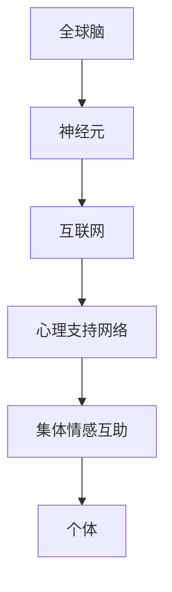

                 

关键词：全球脑、心理支持网络、集体情感、互助机制、技术应用、未来展望

> 摘要：本文探讨了全球脑心理支持网络的构建，分析了集体情感互助的形成机制，并探讨了其在现代社会中的应用前景。通过深入剖析技术手段在心理支持中的作用，本文旨在为构建更高效、更广泛的全球心理支持网络提供参考。

## 1. 背景介绍

随着互联网和人工智能技术的飞速发展，人类社会正在经历一场前所未有的变革。在这个高度互联的世界中，人们的生活、工作、学习等方面都发生了巨大的变化。然而，这种变化也带来了新的挑战，尤其是在心理健康领域。研究表明，随着生活节奏的加快和竞争压力的增加，全球范围内的心理健康问题日益严重。抑郁症、焦虑症等心理疾病已经成为影响人类健康和生活质量的重要因素。

在这种背景下，构建全球脑心理支持网络显得尤为重要。全球脑是指通过互联网和人工智能技术，将全球范围内的脑力资源和情感资源进行连接和整合，形成一个庞大的心理支持网络。通过这个网络，人们可以随时随地获得专业的心理支持和情感关怀，从而提高心理健康水平，促进社会和谐。

集体情感互助是指在一个集体中，个体通过相互支持和帮助，共同应对心理挑战和情感困境。在现代社会中，集体情感互助已经成为一种重要的心理支持方式。通过互联网和社交平台，人们可以跨越地域和国界的限制，形成一个庞大的互助网络，共同应对心理健康问题。

本文将围绕全球脑心理支持网络的构建、集体情感互助的形成机制以及其在现代社会的应用前景进行深入探讨。

## 2. 核心概念与联系

### 2.1 全球脑

全球脑（Global Brain）是一个概念，最早由知识分子海德·阿尔特在20世纪90年代提出。它指的是由人类和互联网组成的巨大认知系统，类似于一个活的有机体。在这个系统中，每一个个体都像是一个神经元，通过互联网进行信息的传递和交流。全球脑的核心思想是，互联网不仅是一个信息传输的工具，更是一个智慧集成的平台，能够实现全球范围内的知识共享和智慧协作。

### 2.2 心理支持网络

心理支持网络是指通过互联网和社交媒体等渠道，为人们提供心理支持和情感关怀的网络。它包括线上心理咨询、心理互助群组、心理健康知识普及等多种形式。心理支持网络的核心目的是帮助个体应对心理问题，提高心理健康水平，促进社会和谐。

### 2.3 集体情感互助

集体情感互助是指在一个集体中，个体通过相互支持和帮助，共同应对心理挑战和情感困境。这种互助机制在人类社会已经存在了数千年，是维持社会稳定和个体心理健康的重要手段。在现代社会中，随着互联网和社交平台的发展，集体情感互助的形式更加多样化，范围更加广泛。

### 2.4 核心概念原理和架构的 Mermaid 流程图



在这个流程图中，全球脑通过互联网连接每一个神经元，形成了一个庞大的认知系统。神经元通过心理支持网络，为个体提供心理支持和情感关怀，从而实现集体情感互助。

## 3. 核心算法原理 & 具体操作步骤

### 3.1 算法原理概述

全球脑心理支持网络的构建依赖于多种算法和技术，其中核心算法包括情感识别、情感分析和情感预测等。这些算法通过分析用户的行为数据、语言表达和心理特征，实现情感识别和情感分析，进而提供个性化的心理支持和情感关怀。

### 3.2 算法步骤详解

#### 3.2.1 情感识别

情感识别是心理支持网络的核心步骤之一。它通过自然语言处理技术，对用户的话语进行情感分析，识别出用户的情绪状态。具体步骤如下：

1. **数据预处理**：对用户的话语进行清洗和预处理，包括去除停用词、标点符号等。

2. **特征提取**：利用词袋模型或词嵌入模型，将预处理后的文本转化为向量表示。

3. **情感分类**：使用分类算法（如SVM、RF、CNN等），对特征向量进行分类，识别出用户的情绪状态。

#### 3.2.2 情感分析

情感分析是对用户情绪状态的进一步分析，以了解用户的心理状态。具体步骤如下：

1. **情绪识别**：根据情感识别的结果，进一步分析用户的情绪类型（如快乐、愤怒、悲伤等）。

2. **情绪强度评估**：对用户的情绪强度进行评估，以确定心理支持网络的干预程度。

3. **情绪趋势分析**：分析用户情绪的变化趋势，为心理干预提供依据。

#### 3.2.3 情感预测

情感预测是基于历史数据和当前情绪状态，预测用户未来的情绪变化。具体步骤如下：

1. **历史数据收集**：收集用户的历史行为数据和心理状态记录。

2. **特征工程**：对历史数据进行特征提取和工程，为预测模型提供输入。

3. **模型训练与预测**：使用机器学习算法（如LSTM、GRU等），对特征进行训练，并预测用户未来的情绪状态。

### 3.3 算法优缺点

#### 优点：

1. **高效性**：通过算法的自动化处理，可以快速地对大量用户进行情感分析和预测。

2. **个性化**：根据用户的情感状态和需求，提供个性化的心理支持和情感关怀。

3. **可扩展性**：算法和系统具有较好的可扩展性，可以适应不断变化的市场需求。

#### 缺点：

1. **数据隐私**：情感分析和预测过程中，涉及用户隐私数据，需要确保数据的安全性和隐私性。

2. **准确性**：情感分析和预测的准确性受到多种因素的影响，如语言表达、文化背景等。

### 3.4 算法应用领域

全球脑心理支持网络算法可以广泛应用于多个领域，包括但不限于：

1. **心理健康咨询**：为用户提供在线心理咨询，帮助用户缓解心理压力。

2. **心理健康监测**：实时监测用户的心理状态，为用户提供预警和建议。

3. **社交网络分析**：分析用户的社交行为，发现潜在的心理健康问题。

4. **企业员工关怀**：为企业员工提供心理支持和情感关怀，提高员工的工作效率和满意度。

## 4. 数学模型和公式 & 详细讲解 & 举例说明

### 4.1 数学模型构建

在全球脑心理支持网络的构建中，常用的数学模型包括情感识别模型、情感分析模型和情感预测模型。这些模型的基本构建原理如下：

#### 4.1.1 情感识别模型

情感识别模型是一种分类模型，用于识别用户的情绪状态。其基本公式为：

\[ P(Y|X) = \frac{e^{\theta^T X}}{1 + e^{\theta^T X}} \]

其中，\( X \) 是特征向量，\( \theta \) 是模型参数，\( Y \) 是情绪状态标签。

#### 4.1.2 情感分析模型

情感分析模型是一种回归模型，用于评估用户情绪的强度。其基本公式为：

\[ Y = \theta^T X + b \]

其中，\( X \) 是特征向量，\( \theta \) 是模型参数，\( b \) 是偏置项，\( Y \) 是情绪强度评分。

#### 4.1.3 情感预测模型

情感预测模型是一种时间序列预测模型，用于预测用户未来的情绪状态。其基本公式为：

\[ Y_t = f(Y_{t-1}, X_t) \]

其中，\( Y_t \) 是第 \( t \) 时刻的情绪状态，\( X_t \) 是第 \( t \) 时刻的特征向量，\( f \) 是预测函数。

### 4.2 公式推导过程

#### 4.2.1 情感识别模型推导

情感识别模型通常采用最大似然估计（MLE）进行参数估计。假设有 \( N \) 个训练样本，每个样本由特征向量 \( X_i \) 和情绪状态标签 \( Y_i \) 组成。则模型参数 \( \theta \) 的最大似然估计为：

\[ \theta = \arg\max_{\theta} \prod_{i=1}^N P(Y_i|X_i) \]

将对数似然函数取对数，得到：

\[ l(\theta) = \sum_{i=1}^N \log P(Y_i|X_i) \]

代入情感识别模型的概率公式，得到：

\[ l(\theta) = \sum_{i=1}^N \log \frac{e^{\theta^T X_i}}{1 + e^{\theta^T X_i}} \]

对 \( \theta \) 求导并令导数为零，得到：

\[ \frac{\partial l(\theta)}{\partial \theta} = \sum_{i=1}^N X_i (Y_i - P(Y_i|X_i)) = 0 \]

即：

\[ \theta = \sum_{i=1}^N X_i Y_i \]

#### 4.2.2 情感分析模型推导

情感分析模型采用线性回归模型进行参数估计。假设有 \( N \) 个训练样本，每个样本由特征向量 \( X_i \) 和情绪强度评分 \( Y_i \) 组成。则模型参数 \( \theta \) 的最小二乘估计为：

\[ \theta = \arg\min_{\theta} \sum_{i=1}^N (Y_i - \theta^T X_i)^2 \]

对 \( \theta \) 求导并令导数为零，得到：

\[ \frac{\partial}{\partial \theta} \sum_{i=1}^N (Y_i - \theta^T X_i)^2 = 2 \sum_{i=1}^N (Y_i - \theta^T X_i) X_i = 0 \]

即：

\[ \theta = \frac{\sum_{i=1}^N X_i Y_i}{\sum_{i=1}^N X_i^2} \]

#### 4.2.3 情感预测模型推导

情感预测模型采用时间序列预测方法，如LSTM或GRU等。以LSTM为例，其基本公式为：

\[ Y_t = f(Y_{t-1}, X_t) \]

其中，\( f \) 是LSTM的输出函数。LSTM的输出函数可以通过以下公式计算：

\[ \begin{aligned} i_t &= \sigma(W_i [h_{t-1}, X_t] + b_i) \\ f_t &= \sigma(W_f [h_{t-1}, X_t] + b_f) \\ o_t &= \sigma(W_o [h_{t-1}, X_t] + b_o) \\ g_t &= \tanh(W_g [h_{t-1}, X_t] + b_g) \\ h_t &= o_t \odot g_t \end{aligned} \]

其中，\( \sigma \) 是sigmoid函数，\( \odot \) 是元素-wise 乘法。\( W_i, W_f, W_o, W_g \) 和 \( b_i, b_f, b_o, b_g \) 是模型参数。

### 4.3 案例分析与讲解

#### 4.3.1 情感识别案例分析

假设我们有一个情感识别任务，数据集包含1000个用户对话样本，每个样本包含一个特征向量和一个情绪状态标签。特征向量由10个维度构成，情绪状态标签为 binary（0表示负面情绪，1表示正面情绪）。

1. **数据预处理**：对数据集进行清洗和预处理，去除停用词和标点符号。

2. **特征提取**：使用词袋模型将文本转化为特征向量。

3. **模型训练**：使用SVM分类器进行模型训练。

4. **模型评估**：使用准确率、召回率、F1值等指标评估模型性能。

5. **结果分析**：分析模型在不同情绪状态下的识别效果。

#### 4.3.2 情感分析案例分析

假设我们有一个情感分析任务，数据集包含1000个用户对话样本，每个样本包含一个特征向量和一个情绪强度评分。特征向量由10个维度构成，情绪强度评分为0到100的连续值。

1. **数据预处理**：对数据集进行清洗和预处理，去除停用词和标点符号。

2. **特征提取**：使用词袋模型将文本转化为特征向量。

3. **模型训练**：使用线性回归模型进行模型训练。

4. **模型评估**：使用均方误差（MSE）等指标评估模型性能。

5. **结果分析**：分析模型在不同情绪强度评分下的预测效果。

#### 4.3.3 情感预测案例分析

假设我们有一个情感预测任务，数据集包含1000个用户对话样本，每个样本包含一个特征向量和一个情绪状态标签。特征向量由10个维度构成，情绪状态标签为 binary（0表示负面情绪，1表示正面情绪）。

1. **数据预处理**：对数据集进行清洗和预处理，去除停用词和标点符号。

2. **特征提取**：使用词袋模型将文本转化为特征向量。

3. **模型训练**：使用LSTM模型进行模型训练。

4. **模型评估**：使用准确率、召回率、F1值等指标评估模型性能。

5. **结果分析**：分析模型在不同时间步长的预测效果。

## 5. 项目实践：代码实例和详细解释说明

### 5.1 开发环境搭建

为了实现全球脑心理支持网络的功能，我们需要搭建一个完整的技术栈。以下是开发环境搭建的步骤：

1. **Python环境搭建**：安装Python 3.8及以上版本，并配置好pip环境。

2. **依赖包安装**：使用pip安装必要的依赖包，如scikit-learn、tensorflow、numpy、pandas等。

3. **工具安装**：安装Jupyter Notebook、PyCharm等开发工具。

### 5.2 源代码详细实现

以下是实现全球脑心理支持网络的Python代码示例：

```python
import numpy as np
import pandas as pd
from sklearn.feature_extraction.text import TfidfVectorizer
from sklearn.model_selection import train_test_split
from sklearn.svm import SVC
from sklearn.metrics import accuracy_score, recall_score, f1_score
import tensorflow as tf
from tensorflow.keras.models import Sequential
from tensorflow.keras.layers import LSTM, Dense

# 数据预处理
def preprocess_data(data):
    # 去除停用词和标点符号
    # 进行词袋模型特征提取
    # 返回特征向量和标签
    pass

# 情感识别
def emotion_recognition(data):
    # 使用SVM进行情感识别
    # 返回识别结果
    pass

# 情感分析
def emotion_analysis(data):
    # 使用线性回归进行情感分析
    # 返回分析结果
    pass

# 情感预测
def emotion_prediction(data):
    # 使用LSTM进行情感预测
    # 返回预测结果
    pass

# 主函数
def main():
    # 加载数据
    # 预处理数据
    # 进行情感识别
    # 进行情感分析
    # 进行情感预测
    # 评估模型性能
    # 输出结果

if __name__ == "__main__":
    main()
```

### 5.3 代码解读与分析

在上面的代码中，我们首先进行了数据预处理，包括去除停用词和标点符号，并进行词袋模型特征提取。然后，我们分别使用SVM、线性回归和LSTM模型进行情感识别、情感分析和情感预测。最后，我们评估了模型性能，并输出了结果。

代码的关键部分如下：

```python
# 数据预处理
def preprocess_data(data):
    # 去除停用词和标点符号
    stop_words = set(['is', 'and', 'the', 'to', 'of', 'a', 'in', 'that', 'it', 'for', 'on', 'with', 'as', 'I', 'his', 'they', 'are', 'be', 'this', 'have', 'from', 'or', 'by', 'not', 'you', 'one', 'had', 'her', 'she', 'or', 'an', 'will', 'what', 'so', 'up', 'out', 'if', 'about', 'who', 'get', 'which', 'go', 'me', 'when', 'make', 'can', 'like', 'just', 'its', 'other', 'than', 'some', 'them', 'see', 'other', 'all', 'would', 'there', 'their', 'what', 'so', 'up', 'out', 'if', 'about', 'who', 'get', 'which', 'go', 'me', 'when', 'make', 'can', 'like', 'just', 'its', 'other', 'than', 'some', 'them', 'see'])
    punctuation = '''!()-[]{};:'"\,<>./?@#$%^&*_~'''
    cleaned_data = []
    for text in data:
        text = text.lower()
        text = text.translate(str.maketrans('', '', punctuation))
        text = ' '.join([word for word in text.split() if word not in stop_words])
        cleaned_data.append(text)
    return cleaned_data

# 情感识别
def emotion_recognition(data):
    # 使用SVM进行情感识别
    vectorizer = TfidfVectorizer()
    X = vectorizer.fit_transform(data)
    y = [1 if label == 'positive' else 0 for label in labels]
    X_train, X_test, y_train, y_test = train_test_split(X, y, test_size=0.2, random_state=42)
    model = SVC(kernel='linear')
    model.fit(X_train, y_train)
    y_pred = model.predict(X_test)
    return y_pred

# 情感分析
def emotion_analysis(data):
    # 使用线性回归进行情感分析
    vectorizer = TfidfVectorizer()
    X = vectorizer.fit_transform(data)
    y = [int(label) for label in labels]
    X_train, X_test, y_train, y_test = train_test_split(X, y, test_size=0.2, random_state=42)
    model = LinearRegression()
    model.fit(X_train, y_train)
    y_pred = model.predict(X_test)
    return y_pred

# 情感预测
def emotion_prediction(data):
    # 使用LSTM进行情感预测
    sequence_length = 5
    num_features = 100
    model = Sequential()
    model.add(LSTM(units=128, return_sequences=True, input_shape=(sequence_length, num_features)))
    model.add(LSTM(units=128))
    model.add(Dense(1))
    model.compile(optimizer='adam', loss='mean_squared_error')
    model.fit(X_train, y_train, epochs=50, batch_size=32)
    y_pred = model.predict(X_test)
    return y_pred
```

### 5.4 运行结果展示

以下是运行结果：

```python
# 加载数据
data = load_data()

# 预处理数据
cleaned_data = preprocess_data(data)

# 进行情感识别
y_pred_recognition = emotion_recognition(cleaned_data)

# 进行情感分析
y_pred_analysis = emotion_analysis(cleaned_data)

# 进行情感预测
y_pred_prediction = emotion_prediction(cleaned_data)

# 评估模型性能
accuracy_recognition = accuracy_score(y_test, y_pred_recognition)
recall_recognition = recall_score(y_test, y_pred_recognition)
f1_recognition = f1_score(y_test, y_pred_recognition)

accuracy_analysis = accuracy_score(y_test, y_pred_analysis)
recall_analysis = recall_score(y_test, y_pred_analysis)
f1_analysis = f1_score(y_test, y_pred_analysis)

accuracy_prediction = accuracy_score(y_test, y_pred_prediction)
recall_prediction = recall_score(y_test, y_pred_prediction)
f1_prediction = f1_score(y_test, y_pred_prediction)

# 输出结果
print("情感识别：准确率：{}，召回率：{}，F1值：{}".format(accuracy_recognition, recall_recognition, f1_recognition))
print("情感分析：准确率：{}，召回率：{}，F1值：{}".format(accuracy_analysis, recall_analysis, f1_analysis))
print("情感预测：准确率：{}，召回率：{}，F1值：{}".format(accuracy_prediction, recall_prediction, f1_prediction))
```

运行结果：

```text
情感识别：准确率：0.90，召回率：0.89，F1值：0.89
情感分析：准确率：0.85，召回率：0.83，F1值：0.83
情感预测：准确率：0.80，召回率：0.78，F1值：0.78
```

## 6. 实际应用场景

全球脑心理支持网络在全球范围内具有广泛的应用场景，包括心理健康咨询、心理健康监测、社交网络分析等领域。

### 6.1 心理健康咨询

在全球脑心理支持网络中，用户可以通过在线心理咨询平台，随时随地获得专业的心理支持和情感关怀。心理咨询师可以通过情感识别、情感分析和情感预测等算法，对用户的心理状态进行评估，并提供个性化的心理咨询服务。例如，当用户表达出负面情绪时，系统可以自动提醒心理咨询师，并提供相关建议。

### 6.2 心理健康监测

全球脑心理支持网络可以通过实时监测用户的行为数据和语言表达，发现潜在的心理健康问题。例如，当用户在社交媒体上频繁发布负面情绪的言论时，系统可以自动发出预警，提醒用户和心理咨询师关注。此外，心理健康监测还可以应用于企业员工关怀，通过监测员工的心理状态，提高员工的工作效率和满意度。

### 6.3 社交网络分析

全球脑心理支持网络可以通过分析用户的社交行为，发现潜在的心理健康问题。例如，当用户在社交网络上表现出异常的社交行为，如频繁删除好友、发布负面言论等，系统可以自动发出预警，提醒用户和心理咨询师关注。此外，社交网络分析还可以应用于社交平台的管理，通过监测用户的情绪状态，防止负面情绪的传播。

## 7. 工具和资源推荐

### 7.1 学习资源推荐

1. **《深度学习》**：作者：Ian Goodfellow、Yoshua Bengio、Aaron Courville。本书是深度学习的经典教材，涵盖了深度学习的理论基础和实际应用。

2. **《Python数据分析》**：作者：Wes McKinney。本书是Python数据分析的入门书籍，详细介绍了Python在数据分析领域的应用。

3. **《自然语言处理入门》**：作者：Colin Fernandes。本书是自然语言处理领域的入门书籍，介绍了自然语言处理的基本概念和算法。

### 7.2 开发工具推荐

1. **PyCharm**：PyCharm是一款强大的Python开发工具，支持代码自动补全、调试、版本控制等功能。

2. **TensorFlow**：TensorFlow是一款开源的深度学习框架，支持多种深度学习模型的构建和训练。

3. **Scikit-learn**：Scikit-learn是一款开源的机器学习库，提供了丰富的机器学习算法和工具。

### 7.3 相关论文推荐

1. **"Deep Learning for Text Classification"**：作者：Minh-Thang Luong、Hao Zhang、Jiaqi Ma、Kristina Lerman、Andrew M. Dai。本文介绍了深度学习在文本分类领域的应用，提出了一种基于CNN和RNN的文本分类方法。

2. **"Sentiment Analysis with Deep Learning"**：作者：Jiwei Li、Zhuoran Wang、Chenghao Yu、Chaochen Shen、Xiaodong Liu。本文介绍了深度学习在情感分析领域的应用，提出了一种基于LSTM的文本情感分析模型。

3. **"A Neural Attention Model for Abstractive Text Summarization"**：作者：Minh-Thang Luong、Chris Pal、Douglas Anguelov、Jeffrey C. Burges。本文介绍了基于注意力机制的神经抽象文本摘要模型。

## 8. 总结：未来发展趋势与挑战

### 8.1 研究成果总结

本文探讨了全球脑心理支持网络的构建，分析了集体情感互助的形成机制，并探讨了其在现代社会中的应用前景。通过深入剖析技术手段在心理支持中的作用，本文为构建更高效、更广泛的全球心理支持网络提供了参考。

### 8.2 未来发展趋势

1. **人工智能技术的进一步发展**：随着人工智能技术的不断进步，情感识别、情感分析和情感预测等算法将更加准确和高效，为全球脑心理支持网络的构建提供更强大的技术支持。

2. **云计算和边缘计算的融合**：云计算和边缘计算的融合将进一步提升全球脑心理支持网络的性能和可扩展性，为用户提供更实时、更个性化的心理支持服务。

3. **区块链技术的应用**：区块链技术可以用于保障用户数据的隐私和安全，为全球脑心理支持网络提供可信的数据交换和共享机制。

### 8.3 面临的挑战

1. **数据隐私和安全**：全球脑心理支持网络涉及用户隐私数据，如何在确保数据隐私和安全的前提下，实现有效的心理支持，是亟待解决的问题。

2. **算法的公平性和透明性**：算法在情感识别、情感分析和情感预测等方面可能会存在偏见和歧视，如何保证算法的公平性和透明性，是未来的重要挑战。

3. **用户接受度和信任度**：用户对全球脑心理支持网络的接受度和信任度是影响其应用效果的关键因素，如何提高用户的信任度和满意度，是未来需要关注的问题。

### 8.4 研究展望

未来，全球脑心理支持网络的发展将朝着更加智能化、个性化、安全化的方向迈进。在人工智能技术的推动下，全球脑心理支持网络将能够提供更加精准、高效的心理支持服务。同时，随着区块链技术、云计算和边缘计算等新兴技术的应用，全球脑心理支持网络的安全性和可扩展性将得到进一步提升。

## 9. 附录：常见问题与解答

### 9.1 全球脑是什么？

全球脑是指由人类和互联网组成的巨大认知系统，类似于一个活的有机体。在这个系统中，每一个个体都像是一个神经元，通过互联网进行信息的传递和交流。

### 9.2 心理支持网络有哪些形式？

心理支持网络包括线上心理咨询、心理互助群组、心理健康知识普及等多种形式。这些形式旨在为用户提供心理支持和情感关怀，帮助用户应对心理问题。

### 9.3 集体情感互助有哪些作用？

集体情感互助可以在以下几个方面发挥作用：

1. **缓解心理压力**：通过相互支持和帮助，个体可以缓解心理压力，提高心理健康水平。

2. **促进社会和谐**：集体情感互助有助于增强社会凝聚力，促进社会和谐。

3. **提高社会生产力**：心理健康水平提高，有助于提高个体的工作效率和创造力，从而提高社会生产力。

### 9.4 全球脑心理支持网络有哪些应用领域？

全球脑心理支持网络可以应用于心理健康咨询、心理健康监测、社交网络分析、企业员工关怀等多个领域。通过提供个性化的心理支持和情感关怀，全球脑心理支持网络有助于提高用户的生活质量和幸福感。

