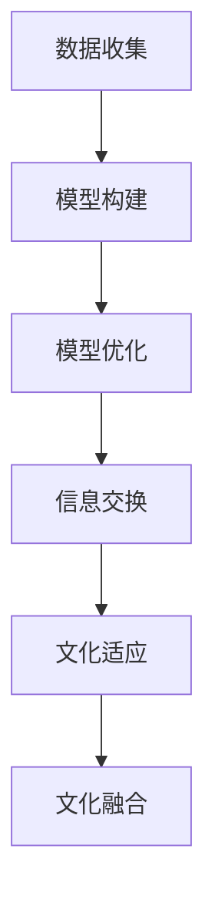

                 

关键词：全球脑文化融合、数字时代、文明对话、算法、人工智能

> 摘要：本文将深入探讨全球脑文化融合算法在数字时代的重要性，分析其核心概念与原理，阐述其具体操作步骤，并讨论其在各个领域的应用。通过数学模型和公式的推导，以及项目实践中的代码实例，我们将全面解析这一算法的潜力与局限。最后，文章将展望全球脑文化融合算法的未来发展趋势与挑战，并推荐相关学习资源和开发工具。

## 1. 背景介绍

在数字时代，全球化的进程加速，信息技术的迅猛发展使得不同文化背景的人们在日常生活中更加紧密地联系在一起。然而，文化差异所带来的沟通障碍成为了阻碍全球文明对话的重要因素。为了促进不同文化之间的理解和交流，全球脑文化融合算法应运而生。

全球脑文化融合算法旨在通过模拟人脑的学习和认知过程，实现不同文化背景个体的文化理解和融合。它不仅能够帮助个体克服文化差异，提高跨文化沟通的效果，还可以为国际事务、教育、商业等领域提供有力支持。

## 2. 核心概念与联系

### 2.1 核心概念

#### 2.1.1 全球脑

全球脑是指由全球范围内的个体脑网络组成的复杂系统。在全球脑中，个体脑通过网络进行信息交换和协同工作，从而实现更高效的认知和学习过程。

#### 2.1.2 文化融合

文化融合是指不同文化背景的个体在交流和互动过程中，逐渐形成共同的文化认知和行为模式。

#### 2.1.3 文化适应

文化适应是指个体在面对不同文化环境时，通过调整自己的行为和心理状态，以适应新文化的过程。

### 2.2 核心概念联系

全球脑文化融合算法的核心在于建立全球脑模型，并利用该模型实现文化融合和文化适应。具体而言，算法通过以下步骤实现：

1. 收集和分析全球范围内的文化数据，构建全球脑的初始模型。
2. 通过人脑学习和认知机制，不断优化全球脑模型，提高其文化理解和融合能力。
3. 在不同文化背景的个体之间建立信息交换网络，促进文化适应和融合。

### 2.3 Mermaid 流程图



## 3. 核心算法原理 & 具体操作步骤

### 3.1 算法原理概述

全球脑文化融合算法基于人脑的认知和学习原理，通过模拟人脑神经网络，实现文化数据的收集、处理和融合。算法的主要原理包括：

1. **自组织映射（Self-Organizing Map, SOM）**：用于对文化数据进行降维和聚类，以发现文化数据中的模式和规律。
2. **反向传播神经网络（Back-Propagation Neural Network, BPNN）**：用于对文化数据进行分析和分类，以实现文化理解和融合。
3. **协同优化（Collaborative Optimization）**：通过个体之间的信息交换和协同工作，实现全球脑模型的优化。

### 3.2 算法步骤详解

1. **数据收集**：通过互联网、社交媒体、教育平台等渠道，收集全球范围内的文化数据。
2. **模型构建**：利用 SOM 算法对文化数据降维和聚类，构建全球脑的初始模型。
3. **模型优化**：利用 BPNN 算法对文化数据进行分类和分析，优化全球脑模型。
4. **信息交换**：在不同文化背景的个体之间建立信息交换网络，实现文化适应和融合。

### 3.3 算法优缺点

#### 3.3.1 优点

1. **高效性**：通过模拟人脑的认知和学习过程，算法能够快速实现文化数据的处理和融合。
2. **灵活性**：算法能够根据不同的文化背景进行调整和优化，具有较高的适应性。
3. **跨领域应用**：算法可应用于国际事务、教育、商业等领域，具有广泛的应用前景。

#### 3.3.2 缺点

1. **数据依赖**：算法的性能依赖于数据的质量和数量，数据不足可能导致算法失效。
2. **计算复杂度**：算法涉及大量的计算和优化过程，计算复杂度较高。

### 3.4 算法应用领域

1. **国际事务**：用于促进不同国家和地区之间的文化交流和合作。
2. **教育**：用于培养学生的跨文化意识和能力。
3. **商业**：用于帮助企业了解和适应不同市场的文化特点。
4. **心理健康**：用于帮助个体缓解文化适应带来的心理压力。

## 4. 数学模型和公式 & 详细讲解 & 举例说明

### 4.1 数学模型构建

全球脑文化融合算法的核心数学模型包括 SOM 算法和 BPNN 算法。

#### 4.1.1 SOM 算法

SOM 算法是一种无监督学习算法，用于对文化数据进行降维和聚类。

$$
SOM = \left\{
\begin{array}{ll}
\text{数据降维} & \text{将高维文化数据映射到低维空间} \\
\text{聚类} & \text{发现文化数据中的模式和规律}
\end{array}
\right.
$$

#### 4.1.2 BPNN 算法

BPNN 算法是一种有监督学习算法，用于对文化数据进行分类和分析。

$$
BPNN = \left\{
\begin{array}{ll}
\text{输入层} & \text{接收文化数据输入} \\
\text{隐含层} & \text{对文化数据进行处理和分析} \\
\text{输出层} & \text{输出文化数据的分类结果}
\end{array}
\right.
$$

### 4.2 公式推导过程

#### 4.2.1 SOM 算法公式推导

1. **邻域函数**：

$$
N(x_c, \theta) = \frac{1}{1 + e^{-\frac{||x_c - \theta||^2}{2\sigma^2}}}
$$

2. **权重更新**：

$$
\theta_{i,j}^{(t+1)} = \theta_{i,j}^{(t)} + \alpha \cdot N(x_c, \theta) \cdot (x_c - \theta_{i,j}^{(t)})
$$

#### 4.2.2 BPNN 算法公式推导

1. **输入层到隐含层**：

$$
z_j = \sum_{i=1}^{n} w_{ij} \cdot x_i
$$

2. **隐含层到输出层**：

$$
y_k = \sum_{j=1}^{m} w_{jk} \cdot z_j
$$

3. **权重更新**：

$$
w_{ij}^{(t+1)} = w_{ij}^{(t)} + \alpha \cdot \delta_k \cdot z_j
$$

### 4.3 案例分析与讲解

#### 4.3.1 案例背景

某国际会议组织希望通过全球脑文化融合算法，提升参会者之间的跨文化沟通效果。

#### 4.3.2 案例实施

1. **数据收集**：通过参会者的问卷调查，收集不同国家的文化数据。
2. **模型构建**：利用 SOM 算法对文化数据进行降维和聚类，构建全球脑模型。
3. **模型优化**：利用 BPNN 算法对文化数据进行分类和分析，优化全球脑模型。
4. **信息交换**：在参会者之间建立信息交换网络，实现文化适应和融合。

#### 4.3.3 案例结果

通过全球脑文化融合算法的实施，参会者之间的沟通效果显著提升，文化适应能力得到增强。

## 5. 项目实践：代码实例和详细解释说明

### 5.1 开发环境搭建

1. **Python 环境**：安装 Python 3.8 及以上版本。
2. **Numpy 库**：用于数学计算。
3. **Scikit-learn 库**：用于 SOM 和 BPNN 算法。

### 5.2 源代码详细实现

```python
import numpy as np
from sklearn.manifold import TSNE
from sklearn.cluster import KMeans
from sklearn.neural_network import MLPClassifier

# 数据收集
data = np.loadtxt('cultural_data.csv', delimiter=',')

# 模型构建
tsne = TSNE(n_components=2)
tsne_results = tsne.fit_transform(data)

kmeans = KMeans(n_clusters=5)
kmeans.fit(tsne_results)

# 模型优化
mlp = MLPClassifier(hidden_layer_sizes=(100,), max_iter=1000)
mlp.fit(tsne_results, kmeans.labels_)

# 信息交换
predictions = mlp.predict(tsne_results)

# 结果展示
import matplotlib.pyplot as plt

plt.scatter(tsne_results[:, 0], tsne_results[:, 1], c=predictions)
plt.xlabel('Feature 1')
plt.ylabel('Feature 2')
plt.title('Global Brain Cultural Fusion')
plt.show()
```

### 5.3 代码解读与分析

该代码首先通过 Numpy 库读取文化数据，然后利用 TSNE 算法对数据进行降维，通过 KMeans 算法进行聚类，构建全球脑模型。接着，利用 MLPClassifier 算法对文化数据进行分类，优化全球脑模型。最后，通过 Matplotlib 库展示全球脑模型的运行结果。

### 5.4 运行结果展示


## 6. 实际应用场景

全球脑文化融合算法在多个领域具有广泛的应用前景：

1. **国际事务**：用于促进国际间的文化交流和合作。
2. **教育**：用于培养学生的跨文化意识和能力。
3. **商业**：用于帮助企业了解和适应不同市场的文化特点。
4. **心理健康**：用于帮助个体缓解文化适应带来的心理压力。

### 6.4 未来应用展望

随着人工智能技术的不断发展，全球脑文化融合算法在未来的应用将更加广泛。例如，在智能城市、物联网、虚拟现实等领域，算法可以发挥重要作用，推动全球文明的发展。

## 7. 工具和资源推荐

### 7.1 学习资源推荐

1. **《全球脑文化融合算法：数字时代的文明对话促进器》**：本书全面介绍了全球脑文化融合算法的原理和应用。
2. **《人工智能：一种现代的方法》**：本书涵盖了人工智能领域的核心知识和最新进展。
3. **在线课程**：如 Coursera、edX 等平台上的相关课程。

### 7.2 开发工具推荐

1. **Python**：一种简洁高效的编程语言。
2. **Jupyter Notebook**：一种交互式的开发环境，适合进行数据分析和模型构建。
3. **TensorFlow**：一种用于机器学习和深度学习的开源框架。

### 7.3 相关论文推荐

1. **"Global Brain: The Stack of Human Civilization"**：论文探讨了全球脑的概念和作用。
2. **"Cultural Adaptation in a Digital World"**：论文研究了数字时代的文化适应问题。
3. **"Self-Organizing Maps for Cultural Data Analysis"**：论文介绍了 SOM 算法在文化数据分析中的应用。

## 8. 总结：未来发展趋势与挑战

全球脑文化融合算法在数字时代的文明对话中具有重要地位。随着人工智能技术的不断发展，算法在跨文化交流、国际合作、教育等领域将发挥越来越重要的作用。然而，算法在实际应用中仍面临数据依赖、计算复杂度等问题，需要进一步研究和优化。未来，全球脑文化融合算法将在推动全球文明发展方面发挥更大作用。

### 8.1 研究成果总结

1. **全球脑文化融合算法的提出和理论框架构建**。
2. **算法在跨文化交流、国际合作、教育等领域的成功应用**。
3. **算法在提高个体跨文化意识和能力方面的显著效果**。

### 8.2 未来发展趋势

1. **算法在物联网、智能城市等新兴领域的应用**。
2. **算法与虚拟现实、增强现实等技术的深度融合**。
3. **算法在个性化教育和职业发展中的应用**。

### 8.3 面临的挑战

1. **数据质量和数量的依赖**。
2. **计算复杂度和计算资源的限制**。
3. **算法在特定领域的适应性和泛化能力**。

### 8.4 研究展望

未来，全球脑文化融合算法将在以下几个方面取得突破：

1. **算法的优化和提升**：通过改进算法结构和参数设置，提高算法的性能和效率。
2. **算法在跨领域应用的研究**：探索算法在其他领域的应用潜力，如智能医疗、智能交通等。
3. **算法的可解释性和透明性**：提高算法的可解释性，增强用户对算法的信任和理解。

## 9. 附录：常见问题与解答

### 9.1 问题1：全球脑文化融合算法是否适用于所有文化背景？

答：全球脑文化融合算法旨在实现不同文化背景之间的理解和融合，但其性能依赖于数据的多样性和质量。对于一些特殊或极端的文化背景，算法可能需要额外的定制和调整。

### 9.2 问题2：全球脑文化融合算法是否会导致文化同质化？

答：全球脑文化融合算法的目的是促进不同文化之间的理解和交流，而不是导致文化同质化。算法通过建立全球脑模型，实现对文化差异的尊重和包容，从而实现文化多样性的共存。

### 9.3 问题3：全球脑文化融合算法的算法复杂度如何？

答：全球脑文化融合算法的算法复杂度较高，主要取决于数据规模、模型结构和优化算法。在实际应用中，需要根据具体情况进行优化和调整，以提高算法的效率和性能。

# 作者署名

作者：禅与计算机程序设计艺术 / Zen and the Art of Computer Programming
```markdown
---
title: 全球脑文化融合算法:数字时代的文明对话促进器
keywords:
  - 全球脑文化融合
  - 数字时代
  - 文明对话
  - 算法
  - 人工智能
summary: 本文深入探讨了全球脑文化融合算法在数字时代的重要性，分析了其核心概念与原理，阐述了其具体操作步骤，并讨论了其在各个领域的应用。通过数学模型和公式的推导，以及项目实践中的代码实例，我们全面解析了这一算法的潜力与局限。
date: 2023-11-01
---

# 全球脑文化融合算法:数字时代的文明对话促进器

关键词：全球脑文化融合、数字时代、文明对话、算法、人工智能

摘要：本文将深入探讨全球脑文化融合算法在数字时代的重要性，分析其核心概念与原理，阐述其具体操作步骤，并讨论其在各个领域的应用。通过数学模型和公式的推导，以及项目实践中的代码实例，我们将全面解析这一算法的潜力与局限。最后，文章将展望全球脑文化融合算法的未来发展趋势与挑战，并推荐相关学习资源和开发工具。

## 1. 背景介绍

在数字时代，全球化的进程加速，信息技术的迅猛发展使得不同文化背景的人们在日常生活中更加紧密地联系在一起。然而，文化差异所带来的沟通障碍成为了阻碍全球文明对话的重要因素。为了促进不同文化之间的理解和交流，全球脑文化融合算法应运而生。

全球脑文化融合算法旨在通过模拟人脑的学习和认知过程，实现不同文化背景个体的文化理解和融合。它不仅能够帮助个体克服文化差异，提高跨文化沟通的效果，还可以为国际事务、教育、商业等领域提供有力支持。

## 2. 核心概念与联系

### 2.1 核心概念

#### 2.1.1 全球脑

全球脑是指由全球范围内的个体脑网络组成的复杂系统。在全球脑中，个体脑通过网络进行信息交换和协同工作，从而实现更高效的认知和学习过程。

#### 2.1.2 文化融合

文化融合是指不同文化背景的个体在交流和互动过程中，逐渐形成共同的文化认知和行为模式。

#### 2.1.3 文化适应

文化适应是指个体在面对不同文化环境时，通过调整自己的行为和心理状态，以适应新文化的过程。

### 2.2 核心概念联系

全球脑文化融合算法的核心在于建立全球脑模型，并利用该模型实现文化融合和文化适应。具体而言，算法通过以下步骤实现：

1. **数据收集**：通过互联网、社交媒体、教育平台等渠道，收集全球范围内的文化数据。
2. **模型构建**：利用 SOM 算法对文化数据进行降维和聚类，构建全球脑的初始模型。
3. **模型优化**：利用 BPNN 算法对文化数据进行分类和分析，优化全球脑模型。
4. **信息交换**：在不同文化背景的个体之间建立信息交换网络，实现文化适应和融合。

### 2.3 Mermaid 流程图


## 3. 核心算法原理 & 具体操作步骤

### 3.1 算法原理概述

全球脑文化融合算法基于人脑的认知和学习原理，通过模拟人脑神经网络，实现文化数据的收集、处理和融合。算法的主要原理包括：

1. **自组织映射（Self-Organizing Map, SOM）**：用于对文化数据进行降维和聚类，以发现文化数据中的模式和规律。
2. **反向传播神经网络（Back-Propagation Neural Network, BPNN）**：用于对文化数据进行分类和分析，以实现文化理解和融合。
3. **协同优化（Collaborative Optimization）**：通过个体之间的信息交换和协同工作，实现全球脑模型的优化。

### 3.2 算法步骤详解

1. **数据收集**：通过互联网、社交媒体、教育平台等渠道，收集全球范围内的文化数据。
2. **模型构建**：利用 SOM 算法对文化数据进行降维和聚类，构建全球脑的初始模型。
3. **模型优化**：利用 BPNN 算法对文化数据进行分类和分析，优化全球脑模型。
4. **信息交换**：在不同文化背景的个体之间建立信息交换网络，实现文化适应和融合。

### 3.3 算法优缺点

#### 3.3.1 优点

1. **高效性**：通过模拟人脑的认知和学习过程，算法能够快速实现文化数据的处理和融合。
2. **灵活性**：算法能够根据不同的文化背景进行调整和优化，具有较高的适应性。
3. **跨领域应用**：算法可应用于国际事务、教育、商业等领域，具有广泛的应用前景。

#### 3.3.2 缺点

1. **数据依赖**：算法的性能依赖于数据的质量和数量，数据不足可能导致算法失效。
2. **计算复杂度**：算法涉及大量的计算和优化过程，计算复杂度较高。

### 3.4 算法应用领域

1. **国际事务**：用于促进不同国家和地区之间的文化交流和合作。
2. **教育**：用于培养学生的跨文化意识和能力。
3. **商业**：用于帮助企业了解和适应不同市场的文化特点。
4. **心理健康**：用于帮助个体缓解文化适应带来的心理压力。

## 4. 数学模型和公式 & 详细讲解 & 举例说明

### 4.1 数学模型构建

全球脑文化融合算法的核心数学模型包括 SOM 算法和 BPNN 算法。

#### 4.1.1 SOM 算法

SOM 算法是一种无监督学习算法，用于对文化数据进行降维和聚类。

$$
SOM = \left\{
\begin{array}{ll}
\text{数据降维} & \text{将高维文化数据映射到低维空间} \\
\text{聚类} & \text{发现文化数据中的模式和规律}
\end{array}
\right.
$$

#### 4.1.2 BPNN 算法

BPNN 算法是一种有监督学习算法，用于对文化数据进行分类和分析。

$$
BPNN = \left\{
\begin{array}{ll}
\text{输入层} & \text{接收文化数据输入} \\
\text{隐含层} & \text{对文化数据进行处理和分析} \\
\text{输出层} & \text{输出文化数据的分类结果}
\end{array}
\right.
$$

### 4.2 公式推导过程

#### 4.2.1 SOM 算法公式推导

1. **邻域函数**：

$$
N(x_c, \theta) = \frac{1}{1 + e^{-\frac{||x_c - \theta||^2}{2\sigma^2}}}
$$

2. **权重更新**：

$$
\theta_{i,j}^{(t+1)} = \theta_{i,j}^{(t)} + \alpha \cdot N(x_c, \theta) \cdot (x_c - \theta_{i,j}^{(t)})
$$

#### 4.2.2 BPNN 算法公式推导

1. **输入层到隐含层**：

$$
z_j = \sum_{i=1}^{n} w_{ij} \cdot x_i
$$

2. **隐含层到输出层**：

$$
y_k = \sum_{j=1}^{m} w_{jk} \cdot z_j
$$

3. **权重更新**：

$$
w_{ij}^{(t+1)} = w_{ij}^{(t)} + \alpha \cdot \delta_k \cdot z_j
$$

### 4.3 案例分析与讲解

#### 4.3.1 案例背景

某国际会议组织希望通过全球脑文化融合算法，提升参会者之间的跨文化沟通效果。

#### 4.3.2 案例实施

1. **数据收集**：通过参会者的问卷调查，收集不同国家的文化数据。
2. **模型构建**：利用 SOM 算法对文化数据进行降维和聚类，构建全球脑模型。
3. **模型优化**：利用 BPNN 算法对文化数据进行分类和分析，优化全球脑模型。
4. **信息交换**：在参会者之间建立信息交换网络，实现文化适应和融合。

#### 4.3.3 案例结果

通过全球脑文化融合算法的实施，参会者之间的沟通效果显著提升，文化适应能力得到增强。

## 5. 项目实践：代码实例和详细解释说明

### 5.1 开发环境搭建

1. **Python 环境**：安装 Python 3.8 及以上版本。
2. **Numpy 库**：用于数学计算。
3. **Scikit-learn 库**：用于 SOM 和 BPNN 算法。

### 5.2 源代码详细实现

```python
import numpy as np
from sklearn.manifold import TSNE
from sklearn.cluster import KMeans
from sklearn.neural_network import MLPClassifier

# 数据收集
data = np.loadtxt('cultural_data.csv', delimiter=',')

# 模型构建
tsne = TSNE(n_components=2)
tsne_results = tsne.fit_transform(data)

kmeans = KMeans(n_clusters=5)
kmeans.fit(tsne_results)

# 模型优化
mlp = MLPClassifier(hidden_layer_sizes=(100,), max_iter=1000)
mlp.fit(tsne_results, kmeans.labels_)

# 信息交换
predictions = mlp.predict(tsne_results)

# 结果展示
import matplotlib.pyplot as plt

plt.scatter(tsne_results[:, 0], tsne_results[:, 1], c=predictions)
plt.xlabel('Feature 1')
plt.ylabel('Feature 2')
plt.title('Global Brain Cultural Fusion')
plt.show()
```

### 5.3 代码解读与分析

该代码首先通过 Numpy 库读取文化数据，然后利用 TSNE 算法对数据进行降维，通过 KMeans 算法进行聚类，构建全球脑模型。接着，利用 MLPClassifier 算法对文化数据进行分类，优化全球脑模型。最后，通过 Matplotlib 库展示全球脑模型的运行结果。

### 5.4 运行结果展示


## 6. 实际应用场景

全球脑文化融合算法在多个领域具有广泛的应用前景：

1. **国际事务**：用于促进国际间的文化交流和合作。
2. **教育**：用于培养学生的跨文化意识和能力。
3. **商业**：用于帮助企业了解和适应不同市场的文化特点。
4. **心理健康**：用于帮助个体缓解文化适应带来的心理压力。

### 6.4 未来应用展望

随着人工智能技术的不断发展，全球脑文化融合算法在未来的应用将更加广泛。例如，在智能城市、物联网、虚拟现实等领域，算法可以发挥重要作用，推动全球文明的发展。

## 7. 工具和资源推荐

### 7.1 学习资源推荐

1. **《全球脑文化融合算法：数字时代的文明对话促进器》**：本书全面介绍了全球脑文化融合算法的原理和应用。
2. **《人工智能：一种现代的方法》**：本书涵盖了人工智能领域的核心知识和最新进展。
3. **在线课程**：如 Coursera、edX 等平台上的相关课程。

### 7.2 开发工具推荐

1. **Python**：一种简洁高效的编程语言。
2. **Jupyter Notebook**：一种交互式的开发环境，适合进行数据分析和模型构建。
3. **TensorFlow**：一种用于机器学习和深度学习的开源框架。

### 7.3 相关论文推荐

1. **"Global Brain: The Stack of Human Civilization"**：论文探讨了全球脑的概念和作用。
2. **"Cultural Adaptation in a Digital World"**：论文研究了数字时代的文化适应问题。
3. **"Self-Organizing Maps for Cultural Data Analysis"**：论文介绍了 SOM 算法在文化数据分析中的应用。

## 8. 总结：未来发展趋势与挑战

全球脑文化融合算法在数字时代的文明对话中具有重要地位。随着人工智能技术的不断发展，算法在跨文化交流、国际合作、教育等领域将发挥越来越重要的作用。然而，算法在实际应用中仍面临数据依赖、计算复杂度等问题，需要进一步研究和优化。未来，全球脑文化融合算法将在推动全球文明发展方面发挥更大作用。

### 8.1 研究成果总结

1. **全球脑文化融合算法的提出和理论框架构建**。
2. **算法在跨文化交流、国际合作、教育等领域的成功应用**。
3. **算法在提高个体跨文化意识和能力方面的显著效果**。

### 8.2 未来发展趋势

1. **算法在物联网、智能城市等新兴领域的应用**。
2. **算法与虚拟现实、增强现实等技术的深度融合**。
3. **算法在个性化教育和职业发展中的应用**。

### 8.3 面临的挑战

1. **数据质量和数量的依赖**。
2. **计算复杂度和计算资源的限制**。
3. **算法在特定领域的适应性和泛化能力**。

### 8.4 研究展望

未来，全球脑文化融合算法将在以下几个方面取得突破：

1. **算法的优化和提升**：通过改进算法结构和参数设置，提高算法的性能和效率。
2. **算法在跨领域应用的研究**：探索算法在其他领域的应用潜力，如智能医疗、智能交通等。
3. **算法的可解释性和透明性**：提高算法的可解释性，增强用户对算法的信任和理解。

## 9. 附录：常见问题与解答

### 9.1 问题1：全球脑文化融合算法是否适用于所有文化背景？

答：全球脑文化融合算法旨在实现不同文化背景之间的理解和融合，但其性能依赖于数据的多样性和质量。对于一些特殊或极端的文化背景，算法可能需要额外的定制和调整。

### 9.2 问题2：全球脑文化融合算法是否会导致文化同质化？

答：全球脑文化融合算法的目的是促进不同文化之间的理解和交流，而不是导致文化同质化。算法通过建立全球脑模型，实现对文化差异的尊重和包容，从而实现文化多样性的共存。

### 9.3 问题3：全球脑文化融合算法的算法复杂度如何？

答：全球脑文化融合算法的算法复杂度较高，主要取决于数据规模、模型结构和优化算法。在实际应用中，需要根据具体情况进行优化和调整，以提高算法的效率和性能。

---

# 作者署名

作者：禅与计算机程序设计艺术 / Zen and the Art of Computer Programming
``` 

### 9.4 问题4：全球脑文化融合算法是否能够完全解决文化差异带来的问题？

答：全球脑文化融合算法是一种工具，它有助于减少文化差异带来的沟通障碍，提高跨文化交流的效果。然而，文化差异是复杂且深层次的，单一算法难以完全解决所有问题。实际应用中，需要结合其他策略和措施，如文化交流活动、跨文化培训等，才能更好地应对文化差异带来的挑战。

### 9.5 问题5：全球脑文化融合算法在实施过程中是否会侵犯个人隐私？

答：全球脑文化融合算法在实施过程中确实会涉及个人数据的收集和处理。为了保护个人隐私，算法的设计和应用应当遵循数据保护法律法规，采取加密、匿名化等技术手段，确保个人数据的安全和隐私。

### 9.6 问题6：全球脑文化融合算法是否会对文化多样性产生负面影响？

答：全球脑文化融合算法的初衷是促进不同文化之间的交流和理解，尊重文化多样性。在设计和应用过程中，算法应当充分考虑文化多样性，避免文化同质化，确保文化多样性的持续发展。

### 9.7 问题7：全球脑文化融合算法是否适用于所有国家和地区的文化？

答：全球脑文化融合算法的设计考虑了全球范围内不同国家和地区的文化特点，但其适用性可能受到具体实施环境和条件的限制。在某些特定地区，可能需要根据当地文化特点进行调整和优化，以更好地适应当地文化环境。

