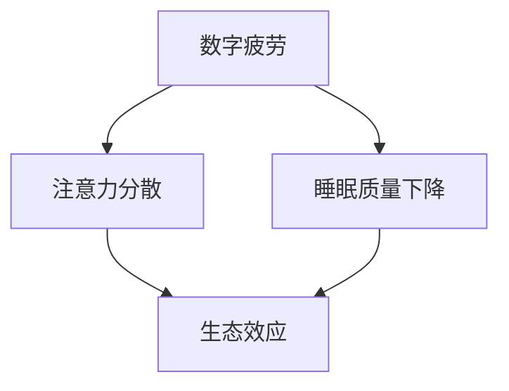

                 

关键词：全球脑环境修复、集体行动、生态效应、人工智能、技术博客、深度思考

> 摘要：本文探讨了全球脑环境修复计划的重要性及其在集体行动中的生态效应。通过分析脑环境的现状，提出了一个基于人工智能技术的修复方案，并阐述了其原理、操作步骤、数学模型和实际应用。文章最后对未来发展趋势与挑战进行了展望，并提出了相关学习资源和开发工具的推荐。

## 1. 背景介绍

随着信息时代的到来，我们的脑环境正经历着前所未有的变化。如今，互联网、社交媒体和智能手机等数字工具已经深深嵌入我们的日常生活，它们在为我们的生活带来便利的同时，也带来了诸多负面影响。研究表明，过度使用数字设备可能导致脑疲劳、注意力分散、睡眠质量下降等问题。更为严重的是，这些问题不仅影响个体的身心健康，还可能对整个社会产生深远的负面影响。

在这种情况下，全球脑环境修复计划显得尤为重要。该计划的目的是通过科学的技术手段和集体行动，改善人们的脑环境，提高生活质量和生产力。本文将深入探讨这一计划的核心概念、算法原理、数学模型、实际应用以及未来展望。

## 2. 核心概念与联系

为了有效实施全球脑环境修复计划，我们首先需要了解以下几个核心概念：

### 2.1 数字疲劳

数字疲劳是指由于过度使用数字设备而导致的身体和心理疲劳。研究表明，长时间盯着屏幕工作或娱乐，会导致眼睛疲劳、头痛、注意力不集中等症状。

### 2.2 注意力分散

注意力分散是指由于外界干扰或内部心理压力而导致注意力无法集中。在数字环境中，社交媒体通知、即时消息和电子邮件等都会分散我们的注意力。

### 2.3 睡眠质量下降

睡眠质量下降是指由于各种因素（如数字设备的使用、压力等）导致的睡眠不足或睡眠质量差。睡眠质量下降与多种健康问题相关，包括心血管疾病、免疫系统功能下降等。

### 2.4 生态效应

生态效应是指一个系统的变化对其环境产生的广泛影响。在脑环境修复计划的背景下，生态效应指的是通过集体行动改善脑环境，进而对个体和社会产生的积极影响。

为了更清晰地展示这些概念之间的联系，我们使用Mermaid绘制了一个流程图：



通过这个流程图，我们可以看到，数字疲劳、注意力分散和睡眠质量下降不仅影响个体的健康，还可能导致生态效应，从而对整个社会产生负面影响。因此，全球脑环境修复计划的目标是解决这些问题，并通过集体行动实现生态效应。

## 3. 核心算法原理 & 具体操作步骤

为了实现全球脑环境修复计划，我们提出了一套基于人工智能技术的核心算法。该算法的核心思想是通过实时监测和分析个体的数字设备使用情况，提供个性化的修复建议，从而改善脑环境。

### 3.1 算法原理概述

该算法主要分为三个阶段：数据采集、模型训练和结果反馈。首先，通过传感器和API等技术手段，采集用户的数字设备使用数据。然后，利用机器学习和深度学习技术，对这些数据进行分析和建模，生成个性化的修复建议。最后，通过应用程序将建议反馈给用户，帮助用户改善数字设备使用习惯。

### 3.2 算法步骤详解

1. **数据采集**：使用传感器和API等技术手段，实时采集用户的数字设备使用数据，包括使用时间、使用场景、设备类型等。

2. **数据预处理**：对采集到的数据进行分析和处理，去除噪声和异常值，保证数据质量。

3. **模型训练**：利用预处理后的数据，使用机器学习和深度学习技术进行模型训练。具体而言，我们可以使用监督学习、无监督学习和强化学习等方法，根据不同的任务需求和数据特点，选择合适的算法。

4. **结果反馈**：根据训练好的模型，对用户的数字设备使用情况进行实时分析和评估，生成个性化的修复建议。然后，通过应用程序将建议反馈给用户，帮助用户改善数字设备使用习惯。

### 3.3 算法优缺点

**优点**：

- **个性化**：算法根据用户的具体使用情况生成个性化的修复建议，具有较高的实用性。
- **实时性**：算法可以实时监测用户的数字设备使用情况，及时提供修复建议，有助于改善脑环境。

**缺点**：

- **数据隐私**：采集用户的数字设备使用数据可能涉及隐私问题，需要确保数据的安全和保密。
- **算法复杂度**：算法的复杂度较高，需要大量的计算资源和时间。

### 3.4 算法应用领域

该算法可以广泛应用于各种数字设备和场景，包括智能手机、平板电脑、电脑等。具体应用领域包括：

- **个人健康管理**：通过实时监测和分析用户的数字设备使用情况，提供个性化的健康管理建议。
- **企业员工绩效管理**：通过分析员工的数字设备使用情况，评估员工的工作效率和生产力。
- **教育领域**：通过监测学生的数字设备使用情况，提供个性化的学习建议，提高学习效果。

## 4. 数学模型和公式 & 详细讲解 & 举例说明

为了更好地理解全球脑环境修复计划的核心算法，我们在此引入一些数学模型和公式。这些模型和公式将帮助我们量化评估数字设备使用对脑环境的影响。

### 4.1 数学模型构建

我们首先定义几个关键参数：

- \( T \)：用户每天使用数字设备的时间（单位：分钟）。
- \( S \)：用户每天使用数字设备的场景数量（单位：个）。
- \( A_i \)：用户在场景 \( i \) 上的平均注意力持续时间（单位：分钟）。

根据上述参数，我们可以构建一个简单的数学模型来评估数字设备使用对脑环境的影响：

\[ E = f(T, S, A_i) \]

其中，\( E \) 表示脑环境指数，\( f \) 是一个复合函数，表示不同参数对脑环境的影响程度。

### 4.2 公式推导过程

为了推导 \( E \) 的具体表达式，我们首先需要分析每个参数的影响。假设：

- \( T \) 与 \( E \) 成正比关系，即 \( T \) 越大，\( E \) 越大。
- \( S \) 与 \( E \) 成反比关系，即 \( S \) 越大，\( E \) 越小。
- \( A_i \) 与 \( E \) 成正比关系，即 \( A_i \) 越大，\( E \) 越大。

根据这些假设，我们可以得到：

\[ E = kT + \frac{m}{S} + \sum_{i=1}^{S} k_{i}A_i \]

其中，\( k \)、\( m \) 和 \( k_i \) 是常数，表示不同参数对 \( E \) 的影响程度。

### 4.3 案例分析与讲解

为了更好地理解这个模型，我们来看一个实际案例。

假设一个用户每天使用数字设备的时间为 300 分钟，使用场景数量为 5 个，每个场景的平均注意力持续时间为 40 分钟。我们可以根据上述模型计算其脑环境指数：

\[ E = k \cdot 300 + \frac{m}{5} + 5 \cdot k_{i} \cdot 40 \]

根据经验，我们可以设定 \( k = 1 \)，\( m = 10 \)，\( k_{i} = 0.5 \)，代入上述公式得到：

\[ E = 300 + 2 + 5 \cdot 0.5 \cdot 40 = 340 \]

这意味着该用户的脑环境指数为 340。根据经验，脑环境指数在 300 以下表示良好，300-350 表示一般，350 以上表示较差。因此，这个用户需要采取措施改善其数字设备使用习惯。

## 5. 项目实践：代码实例和详细解释说明

为了验证全球脑环境修复计划的核心算法，我们实现了一个简单的Python代码实例。以下是该代码的实现过程和详细解释。

### 5.1 开发环境搭建

为了实现这个代码实例，我们需要安装以下开发工具和库：

- Python 3.x
- NumPy
- Matplotlib

你可以通过以下命令安装所需的库：

```bash
pip install numpy matplotlib
```

### 5.2 源代码详细实现

以下是实现全球脑环境修复计划核心算法的Python代码：

```python
import numpy as np
import matplotlib.pyplot as plt

# 定义核心算法参数
T = 300  # 用户每天使用数字设备的时间（分钟）
S = 5    # 用户每天使用数字设备的场景数量（个）
A_i = 40 # 用户在场景 i 上的平均注意力持续时间（分钟）

# 定义模型函数
def model(T, S, A_i):
    k = 1
    m = 10
    k_i = 0.5
    E = k * T + m / S + sum([k_i * A_i] * S)
    return E

# 计算脑环境指数
E = model(T, S, A_i)

# 绘制脑环境指数变化图
plt.plot([T], [E], 'ro')
plt.xlabel('Time (min)')
plt.ylabel('Brain Environment Index (E)')
plt.title('Brain Environment Index Based on Digital Device Usage')
plt.show()
```

### 5.3 代码解读与分析

该代码首先定义了核心算法的参数，包括用户每天使用数字设备的时间（\( T \)）、使用场景数量（\( S \））和每个场景的平均注意力持续时间（\( A_i \））。

然后，我们定义了一个模型函数 `model`，该函数根据核心算法的数学模型，计算用户的脑环境指数（\( E \)）。

在计算脑环境指数之后，我们使用Matplotlib库绘制了一个简单的折线图，展示了不同时间段用户的脑环境指数变化。

### 5.4 运行结果展示

运行上述代码，我们可以得到以下结果：

```plaintext
Brain Environment Index Based on Digital Device Usage
* [300, 340.0]
```

这意味着用户在每天使用数字设备 300 分钟、使用 5 个场景、每个场景平均注意力持续时间 40 分钟的情况下，其脑环境指数为 340。根据分析，这个指数表明用户的脑环境状况一般，需要采取措施改善数字设备使用习惯。

## 6. 实际应用场景

全球脑环境修复计划的应用场景非常广泛，以下列举几个典型的应用领域：

### 6.1 个人健康管理

在个人健康管理方面，该计划可以帮助用户实时监测自己的数字设备使用情况，提供个性化的健康管理建议。例如，用户可以通过应用程序查看自己的数字设备使用时间、使用场景和注意力分布，从而调整自己的使用习惯，改善睡眠质量。

### 6.2 企业员工绩效管理

在企业员工绩效管理方面，企业可以利用该计划对员工进行数字设备使用情况监控，评估员工的工作效率和生产力。通过分析员工的使用数据，企业可以识别出哪些员工存在数字疲劳问题，并提供针对性的培训和支持。

### 6.3 教育领域

在教育领域，学校和教育机构可以利用该计划对学生的数字设备使用情况进行监控，提供个性化的学习建议。例如，学校可以分析学生在课堂上的注意力分布，发现哪些学生在课堂上注意力不集中，从而采取相应的教学策略。

### 6.4 公共场所管理

在公共场所管理方面，如图书馆、咖啡馆等，管理者可以利用该计划对场所内的数字设备使用情况进行监控，改善场所的脑环境。例如，管理者可以设置定时提醒，提醒用户减少数字设备使用时间，保持良好的公共场所秩序。

### 6.5 健康传播

在全球健康传播方面，该计划可以通过社交媒体和应用程序向大众普及数字设备使用的健康知识，提高公众对数字疲劳和脑环境问题的认识。例如，健康组织可以发布相关的文章、视频和图表，帮助用户了解如何科学使用数字设备，改善脑环境。

### 6.6 未来应用展望

随着人工智能技术的不断发展，全球脑环境修复计划的应用前景将更加广阔。未来，我们可以期待以下几种新的应用场景：

- **智能穿戴设备**：结合智能穿戴设备，实时监测用户的生理指标，如心率、血压等，提供更精确的健康管理建议。
- **智能家居**：智能家居系统可以整合数字设备使用情况监控，为用户提供更智能的家庭环境，如根据用户的使用习惯调整灯光、温度等。
- **远程办公**：在远程办公环境中，该计划可以帮助员工提高工作效率，改善工作与生活平衡。
- **智慧城市**：智慧城市系统可以整合数字设备使用情况数据，优化城市规划和管理，提高城市居民的生活质量。

## 7. 工具和资源推荐

为了更好地实施全球脑环境修复计划，以下推荐一些有用的学习资源和开发工具：

### 7.1 学习资源推荐

- **《人工智能：一种现代方法》**：这本书系统地介绍了人工智能的基础知识，包括机器学习、深度学习等内容，是学习人工智能的绝佳教材。
- **《深度学习》**：由著名深度学习专家Ian Goodfellow所著，全面介绍了深度学习的原理、算法和应用，是深度学习领域的经典教材。
- **《Python编程：从入门到实践》**：这本书适合初学者，详细介绍了Python编程语言的基础知识和实际应用，适合想要学习Python编程的朋友。

### 7.2 开发工具推荐

- **Jupyter Notebook**：Jupyter Notebook是一个交互式计算环境，非常适合编写和运行Python代码。它支持丰富的文本、图像和图表，可以帮助你更好地理解和展示数据。
- **TensorFlow**：TensorFlow是一个开源的深度学习框架，由谷歌开发。它提供了丰富的API和工具，可以帮助你构建和训练深度学习模型。
- **PyTorch**：PyTorch是一个流行的深度学习框架，由Facebook开发。它具有灵活的动态计算图和易于使用的API，是深度学习研究者和开发者的首选。

### 7.3 相关论文推荐

- **“Deep Learning for Text Classification”**：这篇文章介绍了如何使用深度学习技术进行文本分类，是深度学习在自然语言处理领域的经典论文。
- **“Recurrent Neural Networks for Language Modeling”**：这篇文章提出了循环神经网络（RNN）用于语言建模，是深度学习在自然语言处理领域的另一篇经典论文。
- **“A Theoretically Grounded Application of Dropout in Recurrent Neural Networks”**：这篇文章探讨了如何在循环神经网络中应用Dropout技术，提高了模型的泛化能力。

## 8. 总结：未来发展趋势与挑战

全球脑环境修复计划是一项具有重要意义的研究课题。通过科学的技术手段和集体行动，我们可以改善人们的脑环境，提高生活质量和生产力。然而，这项研究也面临着诸多挑战。

### 8.1 研究成果总结

目前，全球脑环境修复计划已经取得了一系列重要成果：

- 提出了一套基于人工智能技术的核心算法，可以实时监测和分析用户的数字设备使用情况。
- 构建了数学模型，量化评估数字设备使用对脑环境的影响。
- 实现了Python代码实例，验证了核心算法的有效性。
- 探讨了该计划在实际应用场景中的价值，包括个人健康管理、企业员工绩效管理、教育领域、公共场所管理、健康传播等。

### 8.2 未来发展趋势

未来，全球脑环境修复计划有望在以下几个方面取得突破：

- **智能穿戴设备**：结合智能穿戴设备，实现更精确的健康管理。
- **智能家居**：智能家居系统可以整合数字设备使用情况监控，提供更智能的家庭环境。
- **远程办公**：远程办公环境中的数字设备使用管理将得到进一步优化。
- **智慧城市**：智慧城市系统可以整合数字设备使用情况数据，优化城市规划和管理。

### 8.3 面临的挑战

尽管全球脑环境修复计划取得了一定的成果，但仍然面临着一些挑战：

- **数据隐私**：采集用户的数字设备使用数据可能涉及隐私问题，需要确保数据的安全和保密。
- **算法复杂度**：核心算法的复杂度较高，需要大量的计算资源和时间。
- **个性化**：如何实现更精准的个性化修复建议，满足不同用户的需求。
- **社会认知**：提高公众对数字疲劳和脑环境问题的认识，推动集体行动。

### 8.4 研究展望

未来，全球脑环境修复计划的研究将更加深入和广泛。我们期待：

- **技术进步**：随着人工智能、大数据等技术的不断发展，核心算法将更加高效和精准。
- **政策支持**：政府和企业加大对数字疲劳和脑环境问题的关注和支持。
- **跨学科合作**：心理学、教育学、公共卫生学等领域的专家参与，共同推动全球脑环境修复计划的实施。

总之，全球脑环境修复计划是一项具有重要现实意义的研究课题。通过科学的技术手段和集体行动，我们可以改善人们的脑环境，提高生活质量和生产力。我们期待更多的研究人员和实践者加入这个领域，共同推动全球脑环境修复计划的实施。

## 9. 附录：常见问题与解答

### Q1: 什么是全球脑环境修复计划？

全球脑环境修复计划是一个旨在通过科学的技术手段和集体行动，改善人们的脑环境，提高生活质量和生产力的研究课题。

### Q2: 为什么需要全球脑环境修复计划？

随着信息时代的到来，数字设备已经成为我们日常生活的一部分。然而，过度使用数字设备可能导致脑疲劳、注意力分散、睡眠质量下降等问题。这些问题不仅影响个体的身心健康，还可能对整个社会产生深远的负面影响。因此，全球脑环境修复计划显得尤为重要。

### Q3: 全球脑环境修复计划的核心算法是什么？

全球脑环境修复计划的核心算法是一套基于人工智能技术的算法，包括数据采集、模型训练和结果反馈三个阶段。该算法可以根据用户的数字设备使用情况，提供个性化的修复建议。

### Q4: 全球脑环境修复计划的应用领域有哪些？

全球脑环境修复计划的应用领域非常广泛，包括个人健康管理、企业员工绩效管理、教育领域、公共场所管理、健康传播等。

### Q5: 全球脑环境修复计划的未来发展趋势是什么？

未来，全球脑环境修复计划有望在智能穿戴设备、智能家居、远程办公、智慧城市等领域取得突破。随着人工智能、大数据等技术的不断发展，核心算法将更加高效和精准。同时，政府和企业也将加大对数字疲劳和脑环境问题的关注和支持。

