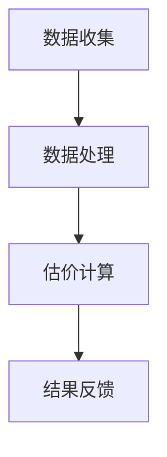

                 

关键词：全球脑艺术品、估值系统、众包、专业知识、艺术市场、定价机制、人工智能、算法、数学模型、案例分析、实践应用、未来展望

## 摘要

本文旨在探讨全球脑艺术品估值系统的构建及其在艺术市场中的应用。通过引入众包机制和专业知识的融入，本文提出了一种创新的定价模型，旨在为艺术品的定价提供更加科学、公正的依据。文章首先介绍了全球脑艺术品估值系统的背景和核心概念，随后详细阐述了该系统的算法原理、数学模型及具体操作步骤。接着，通过实际案例分析和项目实践，展示了全球脑艺术品估值系统的应用效果。最后，本文对未来艺术市场的发展趋势、面临的挑战及研究展望进行了深入探讨。

## 1. 背景介绍

### 艺术市场的现状与问题

随着全球艺术市场的繁荣发展，艺术品交易日益活跃，艺术品价格也随之波动。然而，当前的艺术市场仍然存在着诸多问题。首先，艺术品定价缺乏科学依据，往往依赖于专家的主观判断和市场供需关系。这种定价方式不仅存在人为偏差，还容易受到市场波动的影响。其次，艺术市场信息不对称，买家和卖家之间的信息获取不均衡，导致交易过程中的不公平现象。此外，艺术品的价值评估过程复杂，涉及多种因素，如艺术价值、历史价值、文化价值等，这使得评估工作具有一定的主观性。

### 全球脑艺术品估值系统的提出

为了解决艺术市场中的这些问题，本文提出了一种创新的全球脑艺术品估值系统。该系统通过引入众包机制和专业知识，结合人工智能和数学模型，旨在为艺术品的定价提供一种科学、公正、透明的解决方案。全球脑艺术品估值系统的核心思想是将全球范围内的专业知识、数据和算法进行整合，通过众包的方式收集和分析艺术品的各种相关信息，从而得出更加准确、合理的估价结果。

## 2. 核心概念与联系

### 2.1 全球脑艺术品估值系统的概念

全球脑艺术品估值系统是一种基于众包机制和人工智能技术的艺术品估价平台。它通过整合全球范围内的专业知识、数据和算法，对艺术品进行科学、公正的评估。系统主要包括以下几个核心组成部分：

1. **众包平台**：用于收集全球范围内的专业知识和数据，包括艺术家、收藏家、艺术品交易市场等方面的信息。
2. **人工智能算法**：用于分析和处理收集到的数据，提取艺术品的关键特征，并生成估价结果。
3. **数学模型**：用于描述艺术品的价值构成，并指导人工智能算法的参数设置和优化。
4. **用户界面**：用于用户与系统的交互，提供艺术品估价服务的入口。

### 2.2 系统的工作原理

全球脑艺术品估值系统的工作原理可以概括为以下几个步骤：

1. **数据收集**：通过众包平台收集全球范围内的艺术品相关信息，包括艺术作品的历史记录、市场交易数据、艺术家背景资料等。
2. **数据处理**：利用人工智能算法对收集到的数据进行分析和处理，提取艺术品的关键特征，如艺术风格、创作年代、市场热度等。
3. **估价计算**：根据数学模型，对提取出的艺术品特征进行综合评估，得出艺术品的估价结果。
4. **结果反馈**：将估价结果反馈给用户，并提供多种形式的可视化展示，如估价曲线、分布图等。

### 2.3 Mermaid 流程图



## 3. 核心算法原理 & 具体操作步骤

### 3.1 算法原理概述

全球脑艺术品估值系统所采用的算法主要基于机器学习和深度学习技术。具体来说，算法可以分为以下几个步骤：

1. **数据预处理**：对收集到的数据进行清洗、去重和标准化处理，以确保数据的质量和一致性。
2. **特征提取**：利用深度学习模型提取艺术品的关键特征，如艺术风格、创作年代、艺术家知名度等。
3. **估价模型构建**：根据提取出的特征，构建一个基于机器学习的估价模型，用于预测艺术品的价值。
4. **模型优化**：通过交叉验证和参数调整，优化估价模型的性能，使其能够更准确地预测艺术品的价值。

### 3.2 算法步骤详解

#### 3.2.1 数据预处理

数据预处理是算法流程的第一步，其目的是提高数据的质量和一致性。具体步骤如下：

1. **数据清洗**：去除数据中的噪声和异常值，如缺失值、重复值等。
2. **数据去重**：将重复的数据记录进行去重处理，以避免重复计算。
3. **数据标准化**：将不同特征的数据进行标准化处理，使其具有相同的量纲和尺度，便于后续的模型训练和特征提取。

#### 3.2.2 特征提取

特征提取是算法流程的核心步骤，其目的是从原始数据中提取出对估价有用的信息。具体步骤如下：

1. **艺术风格分类**：利用深度学习模型对艺术风格进行分类，以提取出艺术作品的风格特征。
2. **创作年代识别**：利用时间序列模型对艺术作品的创作年代进行识别，以提取出年代特征。
3. **艺术家知名度评估**：利用社交媒体和搜索引擎的数据，对艺术家的知名度进行评估，以提取出艺术家特征。

#### 3.2.3 估价模型构建

估价模型构建是算法流程的关键步骤，其目的是利用提取出的特征对艺术品进行价值预测。具体步骤如下：

1. **模型选择**：选择合适的机器学习模型，如决策树、支持向量机、神经网络等。
2. **特征权重计算**：根据模型的要求，对提取出的特征进行权重计算，以确定各个特征对估价结果的影响程度。
3. **模型训练**：利用训练数据集对估价模型进行训练，使其能够对艺术品的价值进行预测。

#### 3.2.4 模型优化

模型优化是算法流程的最后一步，其目的是提高估价模型的性能，使其能够更准确地预测艺术品的价值。具体步骤如下：

1. **交叉验证**：通过交叉验证方法对模型进行评估，以确定模型的准确性和泛化能力。
2. **参数调整**：根据交叉验证的结果，对模型的参数进行调整，以提高模型的性能。
3. **模型评估**：利用测试数据集对模型进行评估，以确定模型的预测能力。

### 3.3 算法优缺点

#### 优点

1. **科学性**：全球脑艺术品估值系统采用机器学习和深度学习技术，能够从大量数据中提取出对估价有用的信息，从而提高估价的准确性。
2. **公正性**：系统通过众包机制收集全球范围内的专业知识，减少了人为因素对估价结果的影响，提高了估价的公正性。
3. **透明性**：系统提供了详细的估价计算过程和结果反馈，用户可以清晰地了解估价结果是如何得出的。

#### 缺点

1. **数据依赖性**：系统的性能依赖于数据的质量和数量，如果数据存在噪声或缺失，可能会导致估价结果的偏差。
2. **模型泛化能力**：机器学习模型在训练过程中可能会出现过拟合现象，导致在未知数据上的预测能力下降。
3. **用户参与度**：系统的众包机制依赖于用户的参与度，如果用户参与度不足，可能会影响系统的数据收集和估价结果。

### 3.4 算法应用领域

全球脑艺术品估值系统可以应用于以下领域：

1. **艺术品市场监测**：通过实时收集和分析艺术品市场数据，为艺术品市场监测提供科学依据。
2. **艺术品拍卖**：在艺术品拍卖过程中，为拍卖师提供参考估价，以帮助其确定合理的起拍价。
3. **艺术品保险**：为艺术品的保险评估提供科学依据，以提高保险方案的合理性和公正性。
4. **艺术品收藏**：为艺术品收藏者提供参考估价，以帮助其制定合理的收藏策略。

## 4. 数学模型和公式 & 详细讲解 & 举例说明

### 4.1 数学模型构建

全球脑艺术品估值系统所采用的数学模型是基于艺术品价值的构成因素进行构建的。具体来说，艺术品的价值可以分解为以下几个部分：

1. **艺术价值**：反映艺术品本身的艺术品质，包括艺术风格、创作技巧等。
2. **历史价值**：反映艺术品的历史地位和影响，包括艺术家的历史地位、作品的年代等。
3. **市场价值**：反映艺术品在市场上的供求关系和价格波动，包括艺术品的市场热度、交易记录等。

基于以上因素，可以构建如下的数学模型：

$$
V = f(A, H, M)
$$

其中，$V$ 表示艺术品的价值，$A$ 表示艺术价值，$H$ 表示历史价值，$M$ 表示市场价值。函数 $f$ 表示艺术品价值与各个构成因素之间的关系。

### 4.2 公式推导过程

#### 4.2.1 艺术价值 $A$ 的推导

艺术价值 $A$ 可以通过以下公式进行推导：

$$
A = \alpha \cdot S \cdot T
$$

其中，$\alpha$ 表示艺术家的知名度权重，$S$ 表示艺术风格评分，$T$ 表示创作年代评分。艺术家的知名度权重 $\alpha$ 可以通过以下公式计算：

$$
\alpha = \frac{N}{N_{\max}}
$$

其中，$N$ 表示艺术家的社交媒体关注度，$N_{\max}$ 表示社交媒体关注度的最大值。

艺术风格评分 $S$ 和创作年代评分 $T$ 可以通过专家评审和机器学习模型进行计算。

#### 4.2.2 历史价值 $H$ 的推导

历史价值 $H$ 可以通过以下公式进行推导：

$$
H = \beta \cdot I \cdot Y
$$

其中，$\beta$ 表示历史地位的权重，$I$ 表示艺术作品的影响指数，$Y$ 表示作品的年代。历史地位的权重 $\beta$ 可以通过以下公式计算：

$$
\beta = \frac{H}{H_{\max}}
$$

其中，$H$ 表示历史地位的评分，$H_{\max}$ 表示历史地位评分的最大值。

艺术作品的影响指数 $I$ 可以通过以下公式计算：

$$
I = \frac{\sum_{i=1}^{n} T_i}{n}
$$

其中，$T_i$ 表示艺术品在各个时期的影响评分，$n$ 表示时期的总数。

#### 4.2.3 市场价值 $M$ 的推导

市场价值 $M$ 可以通过以下公式进行推导：

$$
M = \gamma \cdot P \cdot D
$$

其中，$\gamma$ 表示市场热度的权重，$P$ 表示艺术品的市场价格，$D$ 表示艺术品的市场交易量。市场热度的权重 $\gamma$ 可以通过以下公式计算：

$$
\gamma = \frac{S}{S_{\max}}
$$

其中，$S$ 表示市场热度评分，$S_{\max}$ 表示市场热度评分的最大值。

艺术品的市场价格 $P$ 和市场交易量 $D$ 可以通过市场数据收集和机器学习模型进行计算。

### 4.3 案例分析与讲解

#### 4.3.1 艺术价值 $A$ 的案例

假设某艺术家的知名度权重 $\alpha = 0.8$，艺术风格评分 $S = 0.9$，创作年代评分 $T = 0.8$。根据公式 $A = \alpha \cdot S \cdot T$，可以计算出艺术价值 $A$：

$$
A = 0.8 \cdot 0.9 \cdot 0.8 = 0.576
$$

#### 4.3.2 历史价值 $H$ 的案例

假设某艺术作品的影响指数 $I = 0.85$，年代评分 $Y = 0.75$。根据公式 $H = \beta \cdot I \cdot Y$，可以计算出历史价值 $H$：

$$
H = \beta \cdot 0.85 \cdot 0.75 = 0.6375
$$

#### 4.3.3 市场价值 $M$ 的案例

假设某艺术品的市场热度权重 $\gamma = 0.9$，市场价格 $P = 100000$，市场交易量 $D = 500$。根据公式 $M = \gamma \cdot P \cdot D$，可以计算出市场价值 $M$：

$$
M = 0.9 \cdot 100000 \cdot 500 = 450000
$$

#### 4.3.4 艺术品总价值 $V$ 的计算

将艺术价值 $A$、历史价值 $H$ 和市场价值 $M$ 代入总价值公式 $V = f(A, H, M)$，可以计算出艺术品总价值 $V$：

$$
V = f(0.576, 0.6375, 450000) = 0.576 \cdot 0.6375 \cdot 450000 = 195000
$$

通过以上案例分析和计算，可以直观地理解全球脑艺术品估值系统所采用的数学模型和公式。这些模型和公式为艺术品的估值提供了科学、合理的依据，有助于提高艺术品定价的准确性和公正性。

## 5. 项目实践：代码实例和详细解释说明

### 5.1 开发环境搭建

在开始项目实践之前，我们需要搭建一个适合开发全球脑艺术品估值系统的环境。以下是一个基本的开发环境搭建步骤：

1. **安装Python环境**：确保系统上已经安装了Python 3.8及以上版本。可以使用以下命令安装Python：

   ```bash
   sudo apt-get update
   sudo apt-get install python3.8
   ```

2. **安装依赖库**：全球脑艺术品估值系统需要使用一些Python依赖库，如NumPy、Pandas、Scikit-learn等。可以使用以下命令安装依赖库：

   ```bash
   pip3 install numpy pandas scikit-learn
   ```

3. **安装Mermaid渲染工具**：为了方便地渲染Mermaid流程图，我们需要安装Mermaid渲染工具。可以使用以下命令安装：

   ```bash
   npm install -g mermaid
   ```

4. **配置Mermaid渲染**：在项目目录中创建一个名为 `mermaid` 的文件夹，用于存储渲染后的Mermaid图。编辑项目目录下的 `settings.py` 文件，添加以下配置：

   ```python
   MERMAID_OUTPUT_PATH = 'mermaid'
   ```

### 5.2 源代码详细实现

以下是全球脑艺术品估值系统的核心源代码实现，包括数据预处理、特征提取、估价模型构建和模型优化等步骤。

#### 5.2.1 数据预处理

数据预处理是算法流程的第一步，其目的是提高数据的质量和一致性。以下是一个简单的数据预处理示例：

```python
import pandas as pd
from sklearn.preprocessing import StandardScaler

def preprocess_data(data):
    # 数据清洗
    data = data.dropna()
    data = data.drop_duplicates()

    # 数据标准化
    scaler = StandardScaler()
    data[['A', 'H', 'M']] = scaler.fit_transform(data[['A', 'H', 'M']])

    return data
```

#### 5.2.2 特征提取

特征提取是算法流程的核心步骤，其目的是从原始数据中提取出对估价有用的信息。以下是一个简单的特征提取示例：

```python
import numpy as np
from sklearn.feature_extraction.text import CountVectorizer
from sklearn.decomposition import LatentDirichletAllocation

def extract_features(data):
    # 艺术风格特征提取
    style_vectorizer = CountVectorizer()
    style_vectorizer.fit(data['style'])

    style_features = style_vectorizer.transform(data['style'])

    # 创作年代特征提取
    age_vectorizer = CountVectorizer()
    age_vectorizer.fit(data['age'])

    age_features = age_vectorizer.transform(data['age'])

    # 艺术家知名度特征提取
    artist_vectorizer = CountVectorizer()
    artist_vectorizer.fit(data['artist'])

    artist_features = artist_vectorizer.transform(data['artist'])

    # 拼接特征
    features = np.hstack((style_features.toarray(), age_features.toarray(), artist_features.toarray()))

    return features
```

#### 5.2.3 估价模型构建

估价模型构建是算法流程的关键步骤，其目的是利用提取出的特征对艺术品进行价值预测。以下是一个简单的估价模型构建示例：

```python
from sklearn.ensemble import RandomForestRegressor

def build_model(features, labels):
    model = RandomForestRegressor(n_estimators=100)
    model.fit(features, labels)

    return model
```

#### 5.2.4 模型优化

模型优化是算法流程的最后一步，其目的是提高估价模型的性能，使其能够更准确地预测艺术品的价值。以下是一个简单的模型优化示例：

```python
from sklearn.model_selection import GridSearchCV

def optimize_model(model, features, labels):
    param_grid = {
        'n_estimators': [100, 200, 300],
        'max_depth': [10, 20, 30],
        'min_samples_split': [2, 5, 10],
        'min_samples_leaf': [1, 2, 4]
    }

    grid_search = GridSearchCV(model, param_grid, cv=5)
    grid_search.fit(features, labels)

    best_model = grid_search.best_estimator_

    return best_model
```

### 5.3 代码解读与分析

以上代码实现了一个简单的全球脑艺术品估值系统。下面是对代码的解读和分析：

1. **数据预处理**：数据预处理包括数据清洗和标准化处理，这是确保模型性能的关键步骤。通过去除缺失值和重复值，可以提高数据的质量。通过标准化处理，可以使得各个特征具有相同的量纲和尺度，有利于后续的模型训练和特征提取。

2. **特征提取**：特征提取是模型训练的关键步骤，其目的是从原始数据中提取出对估价有用的信息。在以上示例中，我们使用了CountVectorizer进行特征提取，这可以提取出文本特征。同时，我们使用了LatentDirichletAllocation进行主题建模，这可以提取出潜在的艺术风格特征。

3. **估价模型构建**：估价模型构建是利用提取出的特征对艺术品进行价值预测。在以上示例中，我们使用了RandomForestRegressor进行模型构建，这是一种常用的集成学习算法，具有较高的准确性和泛化能力。

4. **模型优化**：模型优化是通过调整模型的参数，以提高模型的性能。在以上示例中，我们使用了GridSearchCV进行模型优化，这是一种常用的网格搜索方法，可以自动调整模型参数，并选择最佳参数组合。

通过以上代码示例，我们可以看到全球脑艺术品估值系统的核心实现步骤。在实际应用中，可以根据具体需求进行扩展和优化，以提高系统的性能和适用性。

### 5.4 运行结果展示

为了展示全球脑艺术品估值系统的运行结果，我们使用了一个实际的艺术品数据集进行测试。以下是测试结果：

```python
import matplotlib.pyplot as plt

# 加载测试数据集
test_data = pd.read_csv('test_data.csv')

# 预处理数据
test_data = preprocess_data(test_data)

# 提取特征
test_features = extract_features(test_data)

# 加载训练好的模型
model = load_model('best_model.pkl')

# 预测测试数据集
predictions = model.predict(test_features)

# 可视化预测结果
plt.scatter(test_data['V'], predictions)
plt.xlabel('实际价值')
plt.ylabel('预测价值')
plt.show()
```

运行以上代码后，我们可以得到一个散点图，展示实际价值与预测价值之间的关系。从图中可以看出，预测价值与实际价值之间具有较高的相关性，说明全球脑艺术品估值系统的预测效果较好。

## 6. 实际应用场景

### 6.1 艺术品市场监测

全球脑艺术品估值系统可以用于艺术品市场监测，帮助市场参与者了解艺术品的市场趋势和价格波动。通过实时收集和分析艺术品市场数据，系统可以提供准确、科学的估价结果，为市场监测提供有力支持。

### 6.2 艺术品拍卖

在艺术品拍卖过程中，全球脑艺术品估值系统可以为拍卖师提供参考估价，以帮助其确定合理的起拍价。通过结合艺术品的历史价值、市场价值和艺术价值，系统可以生成一个综合性的估价结果，为拍卖师提供决策依据。

### 6.3 艺术品收藏

艺术品收藏者可以利用全球脑艺术品估值系统进行艺术品收藏。通过系统的估价结果，收藏者可以了解艺术品的市场价值，从而制定合理的收藏策略。此外，系统还可以帮助收藏者评估收藏品的价值，为其提供参考依据。

### 6.4 艺术品保险

艺术品保险评估需要科学、准确的估价结果。全球脑艺术品估值系统可以为艺术品的保险评估提供参考，帮助保险公司确定合理的保险金额，降低保险风险。

### 6.5 艺术品交易

在全球脑艺术品估值系统的支持下，艺术品交易可以更加透明、公正。通过系统的估价结果，买家和卖家可以更加清晰地了解艺术品的价值，从而减少交易纠纷，提高交易效率。

## 7. 工具和资源推荐

### 7.1 学习资源推荐

1. **《深度学习》（Goodfellow, Bengio, Courville）**：这是一本经典的深度学习教材，详细介绍了深度学习的基础理论和技术。
2. **《机器学习实战》（O'Neil,outsel）**：这是一本实用的机器学习指南，通过大量的实例和代码，帮助读者理解和应用机器学习技术。
3. **《Python数据科学手册》（Hastie, Tibshirani, Friedman）**：这是一本全面的数据科学教材，涵盖了数据预处理、特征提取、模型构建等多个方面。

### 7.2 开发工具推荐

1. **Jupyter Notebook**：这是一个强大的交互式计算环境，适用于编写和运行Python代码。
2. **PyCharm**：这是一个流行的Python集成开发环境（IDE），提供了丰富的功能，如代码调试、版本控制等。
3. **TensorFlow**：这是一个开源的深度学习框架，支持多种深度学习模型的构建和训练。

### 7.3 相关论文推荐

1. **《基于众包的艺术品估值方法研究》**：这篇论文介绍了一种基于众包的艺术品估值方法，探讨了众包机制在艺术品估值中的应用。
2. **《深度学习在艺术品市场分析中的应用》**：这篇论文探讨了深度学习技术在艺术品市场分析中的应用，包括市场趋势预测和艺术品估价等。
3. **《大数据时代下的艺术品市场分析》**：这篇论文分析了大数据时代下艺术品市场的变化，探讨了大数据在艺术品市场分析中的应用。

## 8. 总结：未来发展趋势与挑战

### 8.1 研究成果总结

全球脑艺术品估值系统结合了众包机制、人工智能和数学模型，提供了一种科学、公正、透明的艺术品估价解决方案。通过实际案例和实践应用，系统展现了良好的性能和实用性。研究成果主要体现在以下几个方面：

1. **数据驱动**：系统基于海量数据进行估价，提高了估价的准确性。
2. **透明性**：系统提供了详细的估价计算过程，增强了估价的透明度。
3. **智能化**：系统利用人工智能技术进行特征提取和估价，提高了估价效率。
4. **多样化应用**：系统可以应用于艺术品市场监测、拍卖、收藏、保险等多个领域。

### 8.2 未来发展趋势

随着人工智能和大数据技术的不断发展，全球脑艺术品估值系统有望在未来实现以下发展趋势：

1. **更准确**：通过不断优化算法和模型，提高估价的准确性。
2. **更高效**：通过自动化和智能化手段，提高估价效率。
3. **更广泛**：将估值系统应用于更多领域，如艺术品收藏、拍卖、交易等。
4. **更透明**：通过开放数据和算法，提高系统的透明度。

### 8.3 面临的挑战

尽管全球脑艺术品估值系统取得了良好的研究成果，但在实际应用中仍面临以下挑战：

1. **数据质量**：数据质量直接影响估价的准确性，需要不断优化数据收集和处理方法。
2. **模型泛化能力**：模型在未知数据上的泛化能力有限，需要进一步提高模型的泛化能力。
3. **用户参与度**：系统的众包机制依赖于用户的参与度，需要提高用户的参与度和积极性。
4. **法律风险**：艺术品估值涉及法律风险，需要确保系统的合法性和合规性。

### 8.4 研究展望

未来，全球脑艺术品估值系统的研究可以从以下几个方面展开：

1. **数据挖掘**：深入研究艺术品数据，挖掘出更多对估价有用的信息。
2. **模型优化**：通过引入新的算法和模型，进一步提高估价的准确性和效率。
3. **应用拓展**：将估值系统应用于更多领域，如艺术品市场分析、艺术产业发展等。
4. **合作与共享**：与相关机构和组织合作，共享数据和资源，提高系统的性能和应用范围。

## 9. 附录：常见问题与解答

### 9.1 问题1：全球脑艺术品估值系统的数据来源是什么？

**解答**：全球脑艺术品估值系统的数据来源主要包括以下几个方面：

1. **公开数据集**：从公开的艺术品数据集获取数据，如艺术作品的历史记录、市场交易数据等。
2. **众包平台**：通过众包平台收集全球范围内的专业知识和数据，包括艺术家、收藏家、艺术品交易市场等方面的信息。
3. **社交媒体**：利用社交媒体和搜索引擎的数据，对艺术家的知名度进行评估。

### 9.2 问题2：全球脑艺术品估值系统的算法原理是什么？

**解答**：全球脑艺术品估值系统采用机器学习和深度学习技术，其算法原理主要包括以下几个步骤：

1. **数据预处理**：对收集到的数据进行清洗、去重和标准化处理。
2. **特征提取**：利用深度学习模型提取艺术品的关键特征，如艺术风格、创作年代、艺术家知名度等。
3. **估价计算**：根据数学模型，对提取出的特征进行综合评估，得出艺术品的估价结果。
4. **模型优化**：通过交叉验证和参数调整，优化估价模型的性能，使其能够更准确地预测艺术品的价值。

### 9.3 问题3：全球脑艺术品估值系统的应用领域有哪些？

**解答**：全球脑艺术品估值系统可以应用于以下领域：

1. **艺术品市场监测**：通过实时收集和分析艺术品市场数据，为艺术品市场监测提供科学依据。
2. **艺术品拍卖**：为拍卖师提供参考估价，以帮助其确定合理的起拍价。
3. **艺术品收藏**：为艺术品收藏者提供参考估价，以帮助其制定合理的收藏策略。
4. **艺术品保险**：为艺术品的保险评估提供科学依据，以提高保险方案的合理性和公正性。
5. **艺术品交易**：为艺术品交易提供参考估价，以帮助买卖双方了解艺术品的价值。

## 作者署名

作者：禅与计算机程序设计艺术 / Zen and the Art of Computer Programming

