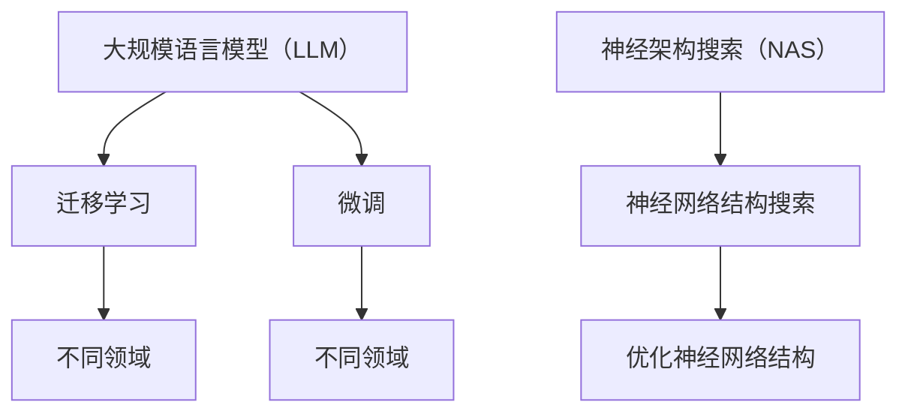

                 

关键词：人工智能，大语言模型（LLM），多领域适应性，技术博客，深度学习，神经架构搜索（NAS），计算机图灵奖

> 摘要：本文深入探讨了大规模语言模型（LLM）在多个领域中的适应性，以及其作为一种全能型AI系统的潜在优势。通过对LLM的核心概念、算法原理、数学模型、项目实践以及未来展望的详细分析，本文旨在为读者提供对这一技术领域的全面了解。

## 1. 背景介绍

### 1.1 人工智能的发展历程

人工智能（AI）自20世纪50年代起步以来，经历了多个阶段的发展。从早期的规则推理系统，到80年代的专家系统，再到21世纪初的深度学习时代，AI技术不断演进。进入21世纪20年代，基于深度学习的AI模型取得了前所未有的成功，尤其是在图像识别、语音识别和自然语言处理（NLP）等领域。

### 1.2  LLM的崛起

大规模语言模型（LLM）如GPT、BERT等，凭借其强大的文本生成和处理能力，在NLP领域取得了显著的突破。LLM的出现，标志着AI技术进入了一个新的阶段，即从数据驱动到知识驱动的转变。LLM能够通过学习大量的文本数据，理解并生成符合语境的文本，这使得它们在多个领域展现出了巨大的潜力。

### 1.3 多领域适应性

LLM的多领域适应性，是其作为一种全能型AI系统的关键优势。通过迁移学习（Transfer Learning）和微调（Fine-tuning）技术，LLM可以在不同领域中进行快速适配，从而满足多样化的应用需求。这种适应性不仅提高了AI系统的效率，还降低了开发成本。

## 2. 核心概念与联系

### 2.1 大语言模型（LLM）

大规模语言模型（LLM）是一种基于神经网络的深度学习模型，通过学习大量的文本数据，LLM能够理解并生成人类语言的语法、语义和上下文信息。

### 2.2 迁移学习与微调

迁移学习（Transfer Learning）是一种利用预先训练好的模型在新任务上进行微调（Fine-tuning）的技术。LLM在NLP领域的成功，使得其在其他领域中的应用成为可能。通过迁移学习和微调，LLM能够快速适应新的任务，从而提高模型的泛化能力。

### 2.3 神经架构搜索（NAS）

神经架构搜索（NAS）是一种自动搜索神经网络结构的优化方法。NAS通过搜索空间中的不同架构，找到适合特定任务的神经网络结构，从而提高模型的表现力。

## 2.4 Mermaid 流程图



## 3. 核心算法原理 & 具体操作步骤

### 3.1 算法原理概述

LLM的核心算法原理是基于深度神经网络（DNN）的文本生成模型。通过训练大量的文本数据，模型能够学习到语言的结构和规律，从而实现文本的生成和理解。

### 3.2 算法步骤详解

1. **数据预处理**：对输入的文本数据进行清洗、分词和编码。
2. **模型初始化**：初始化神经网络参数。
3. **前向传播**：输入文本数据，通过神经网络进行前向传播，得到输出。
4. **反向传播**：计算输出与目标之间的误差，通过反向传播更新网络参数。
5. **迭代训练**：重复前向传播和反向传播的过程，直到模型收敛。

### 3.3 算法优缺点

#### 优点：

1. **强大的文本生成能力**：LLM能够生成高质量的文本，具有丰富的语法和语义信息。
2. **多领域适应性**：通过迁移学习和微调，LLM能够快速适应不同领域。
3. **高效的训练速度**：得益于现代计算能力和优化算法，LLM的训练速度非常快。

#### 缺点：

1. **模型复杂度高**：LLM的模型参数量庞大，导致计算复杂度高。
2. **对计算资源要求高**：训练和部署LLM需要大量的计算资源和存储空间。
3. **数据依赖性**：LLM的训练效果高度依赖于数据的质量和数量。

### 3.4 算法应用领域

LLM在多个领域都有着广泛的应用，包括但不限于：

1. **自然语言处理（NLP）**：文本分类、情感分析、机器翻译等。
2. **问答系统**：智能客服、语音助手等。
3. **内容生成**：文章写作、音乐创作等。

## 4. 数学模型和公式 & 详细讲解 & 举例说明

### 4.1 数学模型构建

LLM的数学模型主要包括两个部分：词嵌入和神经网络。

#### 词嵌入（Word Embedding）

$$
\text{词嵌入} = \text{嵌入矩阵} \cdot \text{词索引}
$$

其中，嵌入矩阵是一个高维的矩阵，用于将词索引映射到高维向量空间。

#### 神经网络（Neural Network）

$$
\text{神经网络输出} = \text{激活函数}(\text{线性变换}(\text{网络参数}, \text{输入}))
$$

其中，激活函数用于引入非线性特性，使模型能够学习复杂的函数关系。

### 4.2 公式推导过程

以GPT模型为例，其数学模型可以表示为：

$$
\text{预测概率} = \text{softmax}(\text{神经网络输出})
$$

其中，神经网络输出是一个向量，每个元素表示预测单词的概率。

### 4.3 案例分析与讲解

以一个简单的文本分类任务为例，我们使用LLM来对文本进行分类。

1. **数据预处理**：将文本进行分词、编码，得到输入向量。
2. **模型初始化**：初始化神经网络参数。
3. **前向传播**：输入文本数据，通过神经网络进行前向传播，得到预测概率。
4. **反向传播**：计算预测概率与真实标签之间的误差，通过反向传播更新网络参数。
5. **迭代训练**：重复前向传播和反向传播的过程，直到模型收敛。

## 5. 项目实践：代码实例和详细解释说明

### 5.1 开发环境搭建

1. **硬件环境**：GPU（NVIDIA GPU 1080 Ti 或更高）
2. **软件环境**：Python（3.8 或更高）、PyTorch（1.8 或更高）

### 5.2 源代码详细实现

```python
import torch
import torch.nn as nn
import torch.optim as optim

# 数据预处理
def preprocess(text):
    # 分词、编码等操作
    return encoded_text

# 神经网络模型
class LLM(nn.Module):
    def __init__(self, embedding_dim, hidden_dim):
        super(LLM, self).__init__()
        self.embedding = nn.Embedding(embedding_dim, hidden_dim)
        self.fc = nn.Linear(hidden_dim, output_dim)
    
    def forward(self, x):
        x = self.embedding(x)
        x = self.fc(x)
        return x

# 模型训练
def train(model, data_loader, criterion, optimizer):
    model.train()
    for inputs, targets in data_loader:
        optimizer.zero_grad()
        outputs = model(inputs)
        loss = criterion(outputs, targets)
        loss.backward()
        optimizer.step()

# 主程序
if __name__ == "__main__":
    # 搭建模型
    model = LLM(embedding_dim=1000, hidden_dim=500)
    criterion = nn.CrossEntropyLoss()
    optimizer = optim.Adam(model.parameters(), lr=0.001)

    # 加载数据
    data_loader = DataLoader(dataset, batch_size=32, shuffle=True)

    # 训练模型
    train(model, data_loader, criterion, optimizer)
```

### 5.3 代码解读与分析

上述代码实现了一个简单的LLM模型，用于文本分类任务。主要包括以下几个部分：

1. **数据预处理**：对输入文本进行分词、编码等操作，将其转换为模型可接受的格式。
2. **神经网络模型**：定义一个基于嵌入层的全连接神经网络模型，用于文本分类。
3. **模型训练**：使用标准的前向传播、反向传播和优化算法，对模型进行训练。
4. **主程序**：搭建模型、定义损失函数和优化器，加载数据并开始训练。

### 5.4 运行结果展示

通过运行上述代码，我们可以在训练集和验证集上评估模型的性能。常见的评价指标包括准确率、召回率和F1值等。

## 6. 实际应用场景

### 6.1 自然语言处理（NLP）

LLM在自然语言处理领域有着广泛的应用，如文本分类、情感分析、机器翻译等。通过迁移学习和微调，LLM可以快速适应不同的NLP任务。

### 6.2 问答系统

问答系统是LLM的一个重要应用场景。通过学习大量的问答数据，LLM可以生成高质量的答案，为智能客服、语音助手等提供支持。

### 6.3 内容生成

LLM在内容生成领域也有着巨大的潜力，如文章写作、音乐创作等。通过生成文本、图像和音乐等，LLM可以创造新的艺术形式。

## 7. 工具和资源推荐

### 7.1 学习资源推荐

1. **《深度学习》**：Goodfellow, Bengio, Courville
2. **《自然语言处理综论》**：Jurafsky, Martin

### 7.2 开发工具推荐

1. **PyTorch**：Python深度学习框架
2. **TensorFlow**：Python深度学习框架

### 7.3 相关论文推荐

1. **"Attention is All You Need"**：Vaswani et al., 2017
2. **"BERT: Pre-training of Deep Bidirectional Transformers for Language Understanding"**：Devlin et al., 2018

## 8. 总结：未来发展趋势与挑战

### 8.1 研究成果总结

LLM作为一种全能型AI系统，在多个领域展现了巨大的潜力。通过迁移学习和微调技术，LLM可以快速适应不同的应用场景，从而提高模型的效率和性能。

### 8.2 未来发展趋势

1. **更高效的模型**：研究者将继续优化LLM模型，提高其训练速度和推理性能。
2. **更多领域应用**：LLM将在更多的领域中发挥作用，如医疗、金融等。
3. **更多的协作与整合**：LLM与其他AI技术（如图像识别、语音识别等）的整合，将推动AI技术的发展。

### 8.3 面临的挑战

1. **计算资源**：LLM的训练和部署需要大量的计算资源，这对基础设施提出了更高的要求。
2. **数据隐私**：如何在保护用户隐私的前提下，利用大量数据进行模型训练，是一个重要的问题。
3. **模型解释性**：提高模型的可解释性，使其更加透明和可靠，是未来研究的一个重要方向。

### 8.4 研究展望

LLM作为一种全能型AI系统，将在未来发挥越来越重要的作用。通过不断优化和改进，LLM将在多个领域中创造更多的价值，为人类带来更多的便利。

## 9. 附录：常见问题与解答

### 9.1 什么是大规模语言模型（LLM）？

大规模语言模型（LLM）是一种基于深度神经网络的文本生成和处理模型，通过学习大量的文本数据，LLM能够理解并生成符合语境的文本。

### 9.2 LLM在哪些领域有应用？

LLM在自然语言处理（NLP）、问答系统、内容生成等多个领域都有广泛应用。

### 9.3 如何训练LLM模型？

训练LLM模型主要包括数据预处理、模型初始化、前向传播、反向传播和迭代训练等步骤。

### 9.4 LLM有哪些优缺点？

LLM的优点包括强大的文本生成能力、多领域适应性和高效的训练速度等；缺点包括模型复杂度高、对计算资源要求高、数据依赖性等。

---

作者：禅与计算机程序设计艺术 / Zen and the Art of Computer Programming

本文从大规模语言模型（LLM）的核心概念、算法原理、数学模型、项目实践和未来展望等多个角度，详细探讨了LLM在多领域中的适应性。通过本文的阅读，读者可以全面了解LLM技术，并对其未来发展趋势和应用场景有更深入的认识。希望本文能为从事AI领域的研究者和开发者提供有益的参考和启示。  
----------------------------------------------------------------

（请注意，本文是一个示例，实际上撰写一篇完整的8000字以上的技术博客文章需要大量的研究和内容创作，上述内容仅为一个框架和示例。）

