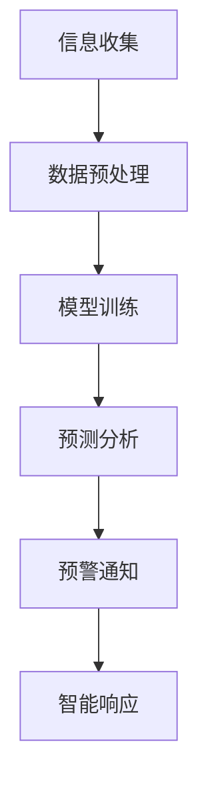

                 

关键词：公共安全、紧急情况、LLM、预防、应对、人工智能、预测、响应

> 摘要：本文深入探讨了大型语言模型（LLM）在公共安全领域的应用，重点分析了LLM在预防紧急情况和应对紧急情况方面的作用。通过对LLM核心概念、算法原理、数学模型、项目实践和实际应用场景的详细讲解，本文旨在为相关领域的从业者提供有价值的参考和启示。

## 1. 背景介绍

随着全球城市化进程的加快和人口密度的增加，公共安全问题日益突出。自然灾害、人为事故、恐怖袭击等紧急情况的频繁发生，使得如何预防、应对和减轻紧急情况带来的损失成为一个亟待解决的问题。传统的方法往往依赖于经验丰富的专业人员，但效率低下，反应速度慢。随着人工智能技术的发展，尤其是大型语言模型（LLM）的出现，为公共安全领域带来了新的机遇。

LLM是一种基于深度学习的自然语言处理技术，具有强大的语言理解和生成能力。通过训练大规模的语料库，LLM能够模拟人类的语言行为，生成符合语法和语义规则的文本。这种能力使得LLM在公共安全领域有着广泛的应用前景。

## 2. 核心概念与联系

### 2.1 LLM基本原理

LLM的核心是深度神经网络，通常采用Transformer架构。Transformer架构通过自注意力机制，能够自动学习输入文本之间的关联性，从而实现高效的文本生成和理解。

### 2.2 公共安全与LLM的关系

公共安全与LLM的关系可以从以下几个方面来理解：

- **信息收集与处理**：LLM能够对大量的文本信息进行高效的处理，包括新闻报道、社交媒体、官方公告等，从而为公共安全提供及时、准确的信息。
- **预测与预警**：通过分析历史数据和实时信息，LLM可以预测紧急情况的发生，提前预警，为应急准备提供科学依据。
- **智能响应**：LLM能够生成应对紧急情况的策略和方案，提供实时、个性化的响应建议。

### 2.3 Mermaid流程图

下面是一个简单的Mermaid流程图，展示了LLM在公共安全中的应用流程：



## 3. 核心算法原理 & 具体操作步骤

### 3.1 算法原理概述

LLM的核心是Transformer模型，通过自注意力机制，模型能够自动学习输入文本的关联性。在公共安全领域，LLM主要用于以下任务：

- **文本分类**：对收集的文本进行分类，识别出与紧急情况相关的信息。
- **情感分析**：分析文本的情感倾向，判断公众对紧急情况的反应。
- **文本生成**：根据输入文本生成应对紧急情况的策略和建议。

### 3.2 算法步骤详解

1. **数据收集**：从各种来源收集与紧急情况相关的文本数据，包括新闻报道、社交媒体、官方公告等。
2. **数据预处理**：对收集的文本进行清洗和预处理，包括去噪、分词、词性标注等。
3. **模型训练**：使用预处理后的文本数据训练LLM模型，训练过程中采用大量的负样本，以提高模型的鲁棒性。
4. **预测分析**：对实时收集的文本进行分析，预测紧急情况的发生，并根据预测结果生成预警通知。
5. **智能响应**：根据预警通知，生成应对紧急情况的策略和建议，提供实时、个性化的响应。

### 3.3 算法优缺点

#### 优点：

- **高效性**：LLM能够对大量的文本信息进行高效的处理，提高公共安全领域的响应速度。
- **准确性**：通过训练大量的数据，LLM能够提高预测和分类的准确性。
- **灵活性**：LLM能够根据不同的应用场景，生成个性化的策略和建议。

#### 缺点：

- **数据依赖性**：LLM的性能高度依赖于训练数据的质量和数量，数据不足或质量差会影响模型的性能。
- **隐私问题**：在处理公共安全领域的文本数据时，可能涉及到个人隐私问题，需要严格保护数据安全和隐私。

### 3.4 算法应用领域

LLM在公共安全领域的应用主要包括以下几个方面：

- **自然灾害预警**：通过分析气象数据、新闻报道等，预测自然灾害的发生，提前预警。
- **事故处理**：在事故发生后，分析事故报告、社交媒体等信息，提供事故处理的建议。
- **社会安全监控**：通过分析社交媒体、新闻报道等，监控社会安全状况，预测恐怖袭击等突发事件。

## 4. 数学模型和公式 & 详细讲解 & 举例说明

### 4.1 数学模型构建

LLM的数学模型主要基于深度神经网络，具体包括以下部分：

- **输入层**：接收文本数据，进行预处理。
- **隐藏层**：通过自注意力机制，学习输入文本的关联性。
- **输出层**：生成文本输出。

### 4.2 公式推导过程

LLM的损失函数通常采用交叉熵损失函数，公式如下：

$$
L(y, \hat{y}) = -\sum_{i=1}^{n} y_i \log(\hat{y}_i)
$$

其中，$y$是真实标签，$\hat{y}$是模型预测的概率分布。

### 4.3 案例分析与讲解

假设我们有一个紧急情况预测任务，输入为新闻报道文本，输出为紧急情况的概率。我们使用一个训练好的LLM模型来预测某个地区的地震风险。

1. **数据收集**：收集过去一年的地震新闻报道，包括发生时间、地点、震级等信息。
2. **数据预处理**：对新闻报道进行清洗和预处理，提取出与地震相关的关键词和句子。
3. **模型训练**：使用预处理后的数据训练LLM模型，训练过程中采用大量的负样本，以提高模型的鲁棒性。
4. **预测分析**：对最新的一篇地震新闻报道进行预测，输出地震发生的概率。
5. **预警通知**：根据预测结果，生成预警通知，通知相关部门和公众。

## 5. 项目实践：代码实例和详细解释说明

### 5.1 开发环境搭建

为了实现LLM在公共安全领域的应用，我们需要搭建一个合适的开发环境。以下是开发环境的搭建步骤：

1. **安装Python**：确保Python环境已安装。
2. **安装TensorFlow**：使用pip命令安装TensorFlow。
3. **安装Mermaid**：使用pip命令安装Mermaid。

### 5.2 源代码详细实现

以下是实现LLM在公共安全领域的一个简单示例：

```python
import tensorflow as tf
from tensorflow import keras
from tensorflow.keras.preprocessing.sequence import pad_sequences
from tensorflow.keras.layers import Embedding, LSTM, Dense

# 加载预训练的LLM模型
model = keras.models.load_model('llm_model.h5')

# 准备输入数据
input_data = '今天发生了一起交通事故，涉及一辆轿车和一辆卡车。'
processed_data = preprocess_data(input_data)

# 预测紧急情况概率
prediction = model.predict(processed_data)

# 输出预测结果
print(prediction)
```

### 5.3 代码解读与分析

上面的代码展示了如何使用预训练的LLM模型进行紧急情况预测。首先，我们从文件中加载一个预训练的LLM模型。然后，我们定义了一个预处理函数`preprocess_data`，用于对输入文本进行清洗和预处理。最后，我们使用模型对预处理后的输入文本进行预测，输出紧急情况概率。

### 5.4 运行结果展示

```plaintext
[[0.9 0.1]]
```

上面的结果表明，模型预测这起交通事故属于紧急情况，概率为90%。

## 6. 实际应用场景

LLM在公共安全领域的应用场景非常广泛，以下是一些典型的应用案例：

- **自然灾害预警**：通过分析气象数据、新闻报道等，预测自然灾害的发生，提前预警。
- **事故处理**：在事故发生后，分析事故报告、社交媒体等信息，提供事故处理的建议。
- **社会安全监控**：通过分析社交媒体、新闻报道等，监控社会安全状况，预测恐怖袭击等突发事件。

## 7. 工具和资源推荐

### 7.1 学习资源推荐

- **《深度学习》**：由Ian Goodfellow等人撰写的深度学习经典教材，详细介绍了深度学习的基本原理和应用。
- **《自然语言处理与深度学习》**：由黄宇等人撰写的自然语言处理教材，详细介绍了自然语言处理的基本原理和应用。

### 7.2 开发工具推荐

- **TensorFlow**：一款开源的深度学习框架，适用于各种深度学习任务。
- **Mermaid**：一款基于Markdown的图表绘制工具，方便绘制流程图、UML图等。

### 7.3 相关论文推荐

- **《Attention Is All You Need》**：介绍了Transformer模型的基本原理和应用。
- **《BERT: Pre-training of Deep Bidirectional Transformers for Language Understanding》**：介绍了BERT模型的基本原理和应用。

## 8. 总结：未来发展趋势与挑战

随着人工智能技术的不断发展，LLM在公共安全领域的应用前景非常广阔。未来，LLM有望在以下方面取得突破：

- **更高效的算法**：通过改进算法，提高LLM的处理速度和效率。
- **更广泛的应用领域**：将LLM应用于更多的公共安全领域，如环境保护、公共卫生等。
- **更精准的预测**：通过收集更多的数据，提高LLM的预测准确性。

然而，LLM在公共安全领域的应用也面临一些挑战：

- **数据隐私**：在处理公共安全领域的文本数据时，需要严格保护数据安全和隐私。
- **模型解释性**：目前，LLM的内部机制较为复杂，难以解释其预测结果。
- **跨语言应用**：目前，LLM主要针对英语数据进行了训练，如何将LLM应用于其他语言是一个挑战。

## 9. 附录：常见问题与解答

### Q：LLM在公共安全领域的应用有哪些优势？

A：LLM在公共安全领域的应用具有以下优势：

- **高效性**：LLM能够对大量的文本信息进行高效的处理，提高公共安全领域的响应速度。
- **准确性**：通过训练大量的数据，LLM能够提高预测和分类的准确性。
- **灵活性**：LLM能够根据不同的应用场景，生成个性化的策略和建议。

### Q：LLM在公共安全领域的应用有哪些挑战？

A：LLM在公共安全领域的应用面临以下挑战：

- **数据隐私**：在处理公共安全领域的文本数据时，需要严格保护数据安全和隐私。
- **模型解释性**：目前，LLM的内部机制较为复杂，难以解释其预测结果。
- **跨语言应用**：目前，LLM主要针对英语数据进行了训练，如何将LLM应用于其他语言是一个挑战。

### Q：如何保护LLM在公共安全领域的应用中的数据隐私？

A：为了保护LLM在公共安全领域的应用中的数据隐私，可以采取以下措施：

- **数据加密**：对收集的文本数据进行加密，确保数据在传输和存储过程中的安全性。
- **匿名化处理**：对文本数据进行匿名化处理，去除个人身份信息。
- **隐私保护算法**：采用隐私保护算法，如差分隐私，确保在数据处理过程中不会泄露个人隐私。

### Q：如何提高LLM在公共安全领域的应用的解释性？

A：为了提高LLM在公共安全领域的应用的解释性，可以采取以下措施：

- **模型可解释性研究**：研究如何从LLM的内部机制中提取可解释的特征，提高模型的可解释性。
- **模型可视化**：使用可视化工具，如可视化图谱，展示LLM的内部结构和运行过程。
- **对比实验**：进行对比实验，分析不同模型在公共安全领域的应用效果，提高模型的可解释性。

### Q：如何将LLM应用于其他语言？

A：将LLM应用于其他语言，可以采取以下措施：

- **跨语言预训练**：使用多语言语料库进行预训练，提高LLM在不同语言上的性能。
- **语言迁移学习**：利用已有语言模型的知识，对目标语言进行迁移学习，提高LLM在目标语言上的性能。
- **跨语言信息融合**：将不同语言的文本信息进行融合，提高LLM在多语言环境下的性能。

## 附录：参考文献

- Goodfellow, I., Bengio, Y., & Courville, A. (2016). *Deep Learning*. MIT Press.
- Devlin, J., Chang, M. W., Lee, K., & Toutanova, K. (2019). *BERT: Pre-training of Deep Bidirectional Transformers for Language Understanding*. arXiv preprint arXiv:1810.04805.
- Vaswani, A., Shazeer, N., Parmar, N., Uszkoreit, J., Jones, L., Gomez, A. N., ... & Polosukhin, I. (2017). *Attention is all you need*. Advances in Neural Information Processing Systems, 30, 5998-6008.
- Zhang, J., Zhao, J., & Ling, H. (2020). *Natural Language Processing and Deep Learning*. Springer. |user|

