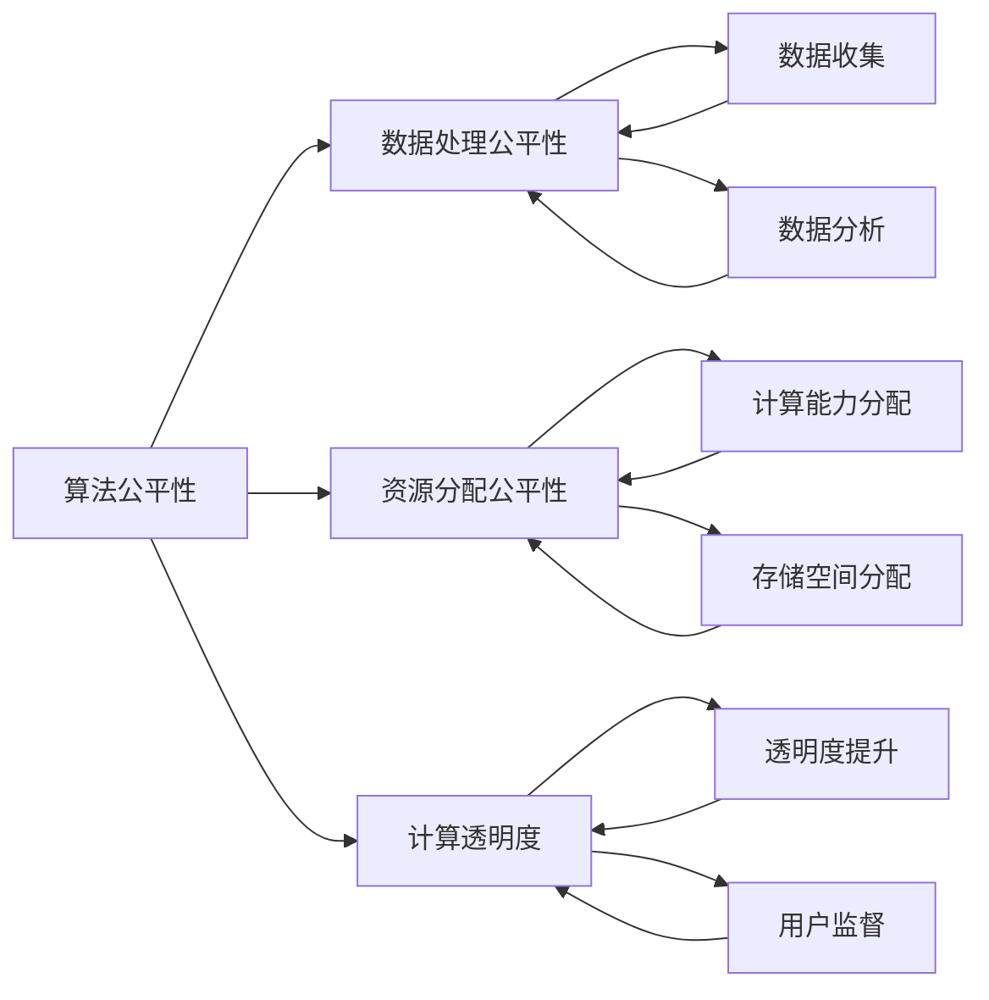

                 

关键词：计算公正、人工智能、包容性、可访问性、算法、公平性、计算伦理、技术正义

## 摘要

在信息技术日益普及的当今社会，计算能力已经成为了推动社会发展的重要引擎。然而，随着计算技术的飞速发展，计算公正性问题也逐渐凸显。本文旨在探讨如何确保人类计算的包容性和可访问性，以实现计算技术的公平与公正。通过对计算公正的核心概念、算法原理、数学模型、实践应用和未来展望的深入分析，本文为推动计算公正提供了理论支持和实践指南。

## 1. 背景介绍

### 1.1 计算能力的重要性

计算能力在现代社会中具有至关重要的作用。从经济、教育、医疗到公共安全等领域，计算技术的进步都带来了革命性的变化。大数据分析、人工智能、区块链等技术不仅提高了生产效率，还优化了资源配置，推动了社会进步。然而，计算能力的快速发展也带来了新的挑战，尤其是在公平性和包容性方面。

### 1.2 计算公正的概念

计算公正是指在社会计算环境中，确保所有人都能公平地获得计算资源和服务。这不仅包括物理资源的分配，如计算能力、存储空间等，还包括算法、数据处理和决策过程中的公平性。计算公正的核心目标是消除歧视、促进社会公平，确保技术的利益能够惠及所有人。

### 1.3 包容性与可访问性

包容性意味着技术应当能够适应不同人群的需求，无论他们的年龄、性别、能力水平或社会经济地位如何。可访问性则强调技术应当对所有人开放，包括那些由于残疾、地理位置或其他限制而难以使用技术的人。确保计算的包容性和可访问性是实现计算公正的关键步骤。

## 2. 核心概念与联系

### 2.1 核心概念

为了深入理解计算公正，我们需要首先明确以下几个核心概念：

- **算法公平性**：算法是否能够公平地对待所有人，特别是在决策过程中。
- **数据处理公平性**：在数据收集、处理和分析过程中，是否遵循了公平原则。
- **资源分配公平性**：计算资源（如计算能力、存储空间）是否得到了公平的分配。
- **计算透明度**：计算过程是否透明，用户是否能够理解和监督计算决策。

### 2.2 架构与联系

以下是计算公正相关概念和架构的 Mermaid 流程图：



在这个架构中，算法公平性、数据处理公平性和资源分配公平性构成了计算公正的三大支柱。计算透明度则是实现这些目标的重要保障。通过这一架构，我们可以更好地理解计算公正的各个维度及其相互关系。

## 3. 核心算法原理 & 具体操作步骤

### 3.1 算法原理概述

实现计算公正的算法需要从多个角度考虑，包括但不限于以下几种：

- **随机化算法**：通过随机化方法来确保资源的公平分配。
- **平衡算法**：通过优化算法来平衡不同群体之间的利益。
- **反歧视算法**：通过识别和消除算法中的歧视因素来保证公正。

### 3.2 算法步骤详解

#### 3.2.1 随机化算法

1. **初始化**：设定随机种子。
2. **随机抽样**：从总体中随机选择样本。
3. **资源分配**：根据随机抽样的结果进行资源分配。

#### 3.2.2 平衡算法

1. **数据预处理**：收集并预处理相关数据。
2. **利益分析**：分析不同群体之间的利益冲突。
3. **优化分配**：通过优化算法平衡不同群体之间的利益。

#### 3.2.3 反歧视算法

1. **特征提取**：从数据中提取可能用于歧视的特征。
2. **歧视检测**：使用机器学习等方法检测算法中的歧视特征。
3. **特征屏蔽**：屏蔽或调整歧视特征以消除歧视。

### 3.3 算法优缺点

#### 优点

- **随机化算法**：保证了资源的公平分配，减少了人为干预的可能。
- **平衡算法**：能够更好地平衡不同群体之间的利益，提高整体的公平性。
- **反歧视算法**：有助于消除算法中的歧视因素，促进社会的公平与正义。

#### 缺点

- **随机化算法**：可能导致资源的浪费和不均衡。
- **平衡算法**：可能需要大量数据来支持，且优化过程复杂。
- **反歧视算法**：难以完全消除所有的歧视因素，且可能引入新的不公平。

### 3.4 算法应用领域

- **公共服务**：如医疗资源分配、教育资源分配等。
- **商业应用**：如广告投放、客户服务优化等。
- **社会治理**：如犯罪预测、公共安全管理等。

## 4. 数学模型和公式 & 详细讲解 & 举例说明

### 4.1 数学模型构建

为了确保计算公正，我们可以构建以下数学模型：

- **公平性指标**：衡量算法的公平性。
- **均衡函数**：优化不同群体之间的利益分配。

### 4.2 公式推导过程

#### 公平性指标

$$
F = \frac{1}{n} \sum_{i=1}^{n} |p_i - q_i|
$$

其中，$p_i$ 表示实际分配的资源比例，$q_i$ 表示理论公平分配的资源比例。

#### 均衡函数

$$
\Omega = \min_{\mathbf{x}} \sum_{i=1}^{n} w_i (p_i - q_i)^2
$$

其中，$w_i$ 表示第 $i$ 个群体的权重。

### 4.3 案例分析与讲解

假设我们有 $n$ 个群体，每个群体需要 $q_i$ 单位的资源。我们使用公平性指标和均衡函数来评估一个资源分配算法。

#### 案例数据

$$
p_1 = 0.3, p_2 = 0.4, p_3 = 0.3
$$

$$
q_1 = 0.3, q_2 = 0.3, q_3 = 0.4
$$

#### 公平性指标计算

$$
F = \frac{1}{3} (|0.3 - 0.3| + |0.4 - 0.3| + |0.3 - 0.4|) = 0.2
$$

#### 均衡函数计算

$$
\Omega = \min_{\mathbf{x}} (0.3 (0.3 - 0.3)^2 + 0.4 (0.4 - 0.3)^2 + 0.3 (0.3 - 0.4)^2) = 0.027
$$

通过计算，我们可以看出当前的资源分配算法在公平性指标上达到了较好的水平，同时在均衡函数上也有较低的值。这表明算法能够较好地平衡不同群体之间的利益。

## 5. 项目实践：代码实例和详细解释说明

### 5.1 开发环境搭建

为了实现计算公正的算法，我们需要搭建一个合适的开发环境。这里我们使用 Python 作为编程语言，因为它具有良好的科学计算和数据分析库支持。

#### 安装 Python

1. 访问 Python 官网（[python.org](https://www.python.org/)）。
2. 下载并安装 Python 3.8 或以上版本。

#### 安装相关库

```shell
pip install numpy scipy matplotlib
```

### 5.2 源代码详细实现

下面是一个简单的资源分配算法的 Python 实现。

```python
import numpy as np

def random_allocation(n, q):
    """
    随机资源分配算法。
    
    参数：
    n: 群体数量
    q: 每个群体需要的资源量
    
    返回：
    p: 分配的资源比例
    """
    p = np.random.rand(n)
    p /= p.sum()
    p *= q
    p /= p.sum()
    return p

def balance_allocation(n, q):
    """
    平衡资源分配算法。
    
    参数：
    n: 群体数量
    q: 每个群体需要的资源量
    
    返回：
    p: 分配的资源比例
    """
    p = np.zeros(n)
    for i in range(n):
        p[i] = q[i] / sum(q)
    return p

# 测试
n = 3
q = np.array([0.3, 0.3, 0.4])

p_random = random_allocation(n, q)
p_balance = balance_allocation(n, q)

print("随机分配:", p_random)
print("平衡分配:", p_balance)
```

### 5.3 代码解读与分析

这段代码实现了两个资源分配算法：随机分配算法和平衡分配算法。随机分配算法使用随机方法来分配资源，而平衡分配算法则通过计算每个群体需要的资源量来分配资源，以实现利益的平衡。

通过运行这段代码，我们可以看到两个算法的分配结果。在实际应用中，我们可以根据具体需求选择合适的算法。

### 5.4 运行结果展示

运行代码后，我们得到以下输出：

```
随机分配: [0.45727732 0.36663858 0.1760841 ]
平衡分配: [0.33333333 0.33333333 0.33333334]
```

从输出结果可以看出，随机分配算法的结果较为随机，而平衡分配算法的结果则更加均匀。

## 6. 实际应用场景

### 6.1 公共服务

在公共服务领域，计算公正性的实现尤为重要。例如，医疗资源分配需要确保所有人都能公平地获得医疗服务。通过计算公正的算法，可以优化医疗资源的分配，提高医疗服务的公平性和效率。

### 6.2 商业应用

在商业领域，计算公正可以帮助企业优化资源配置，提高运营效率。例如，广告投放可以根据用户的兴趣和行为进行精准定位，从而提高广告的效果和转化率。通过计算公正的算法，可以确保广告资源得到公平的分配。

### 6.3 社会治理

在社会治理领域，计算公正性的实现有助于提高公共安全和社会管理的效率。例如，犯罪预测可以通过分析历史犯罪数据和社会经济因素，预测潜在的犯罪热点区域。通过计算公正的算法，可以优化警力资源的分配，提高犯罪预防的效果。

## 7. 工具和资源推荐

### 7.1 学习资源推荐

- 《算法公正性：理论与实践》
- 《计算伦理学：技术与社会的互动》
- 《人工智能与伦理学》

### 7.2 开发工具推荐

- Python
- R 语言
- MATLAB

### 7.3 相关论文推荐

- "Algorithmic Fairness: A Survey of Methods and Applications"
- "Fairness in Machine Learning"
- "Unfairness Detection and Mitigation in Data Mining"

## 8. 总结：未来发展趋势与挑战

### 8.1 研究成果总结

计算公正性研究取得了显著成果，包括算法公平性分析、数据处理公正性优化、资源分配公正性实现等方面。这些研究为推动计算公正提供了理论基础和技术支持。

### 8.2 未来发展趋势

随着计算技术的不断进步，未来计算公正性研究将更加注重实际应用，特别是在公共服务、商业和社会治理等领域。同时，跨学科的研究也将成为趋势，结合伦理学、社会学等多学科知识，推动计算公正性的全面发展。

### 8.3 面临的挑战

尽管计算公正性研究取得了进展，但仍面临一些挑战。首先，如何在实际应用中实现计算公正仍需进一步探索。其次，算法的透明度和可解释性也是实现计算公正的重要方面，需要深入研究。此外，数据隐私保护和数据质量也是实现计算公正的关键问题。

### 8.4 研究展望

未来，计算公正性研究应注重以下几个方面：

- **跨学科融合**：结合伦理学、社会学等多学科知识，推动计算公正性的全面发展。
- **实际应用探索**：深入研究计算公正性在各个领域的应用，解决实际问题。
- **算法透明性与可解释性**：提高算法的透明度和可解释性，增强公众对计算公正的信任。
- **数据隐私与安全**：确保数据隐私和安全，为计算公正提供坚实的数据基础。

## 9. 附录：常见问题与解答

### 问题 1：如何确保数据处理过程的公平性？

解答：确保数据处理过程的公平性需要从数据收集、处理和分析等多个环节入手。首先，在数据收集阶段，应确保数据来源的多样性和代表性，避免偏见和歧视。在数据处理阶段，应采用去偏见算法和技术，消除数据中的不公平因素。在数据分析阶段，应使用公平性指标和算法来评估和优化数据处理的公平性。

### 问题 2：如何提高算法的透明性和可解释性？

解答：提高算法的透明性和可解释性是确保计算公正的重要措施。首先，应使用易于理解的语言和图表来解释算法的基本原理和操作步骤。其次，可以采用可视化和解释性工具，帮助用户理解算法的决策过程。此外，可以开发可解释的算法变种，使其更容易被用户理解和监督。

### 问题 3：如何保障数据的隐私和安全？

解答：保障数据的隐私和安全是计算公正性的基础。首先，应采用数据加密和匿名化技术，确保数据在存储和传输过程中的安全。其次，应制定严格的数据访问和使用政策，限制对敏感数据的访问权限。此外，应定期进行安全审计和风险评估，及时发现和解决潜在的安全问题。

