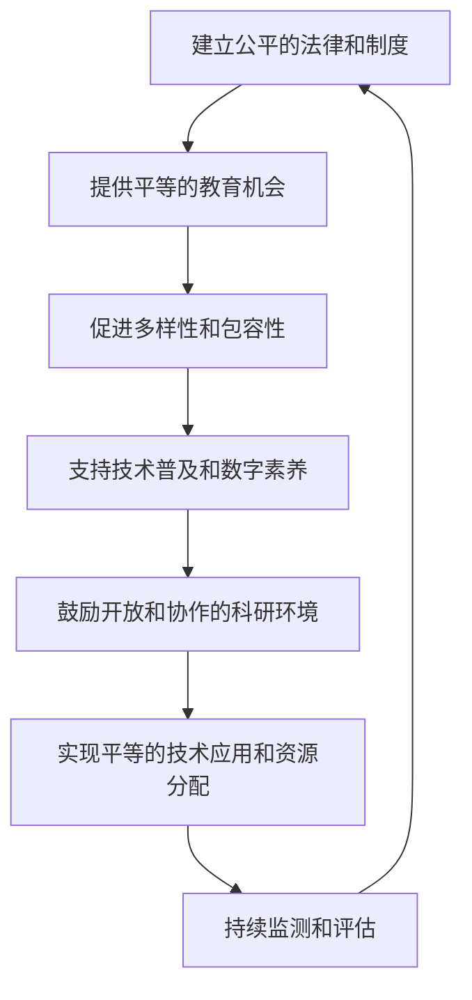

                 

在现代社会中，技术已经深深地融入了我们的日常生活，从智能手机到云计算，从人工智能到区块链，技术不仅改变了我们的生活方式，也改变了我们互动和沟通的方式。然而，技术的进步并非总是公平和包容的。在某些情况下，技术甚至可能加剧了社会的不平等，使得一部分人被边缘化，无法公平地参与计算领域的发展。本文将探讨如何构建一个公平与包容的生态系统，确保每个人都能平等地参与人类计算的发展。

## 1. 背景介绍

随着互联网和移动设备的普及，越来越多的行业和领域被数字化。然而，这种数字化并不是均匀分布的。在某些地区，尤其是发展中国家和农村地区，数字鸿沟仍然存在，使得这些地区的人们无法公平地享受到技术带来的便利。此外，性别、年龄、种族等因素也在一定程度上影响了人们参与计算领域的机会和能力。

计算技术的进步本应是一个人人受益的过程，但实际上，技术发展的红利往往集中在少数人手中，而那些处于边缘化地位的人们则很难获得同样的机会。这种不公平不仅阻碍了技术的发展，也损害了社会的整体福祉。

## 2. 核心概念与联系

为了构建一个公平与包容的生态系统，我们需要理解几个核心概念，包括平等、包容、参与和计算。

### 2.1 平等

平等意味着每个人在参与计算领域时都应该享有相同的权利和机会。这包括教育、就业、研究机会等各个方面。一个公平的系统应该是无歧视的，不会因为个人的性别、种族、年龄等因素而限制他们的机会。

### 2.2 包容

包容是指一个系统能够接纳各种不同的观点、文化和技术，使得每个人都能够贡献自己的力量。一个包容的系统能够更好地应对复杂的问题，因为它能够利用多样化的知识和技能。

### 2.3 参与

参与意味着每个人都有机会参与计算领域的发展，不仅仅是作为用户，还包括作为开发者、研究人员和决策者。参与不仅能够提高个人的技能和知识，也能够促进技术的创新和应用。

### 2.4 计算

计算是一个广泛的概念，包括数据处理、存储、传输和自动化等方面。计算技术的发展和应用正在改变我们的生活方式，因此确保每个人都能平等地参与计算领域的发展至关重要。

### 2.5 Mermaid 流程图

下面是一个简化的 Mermaid 流程图，展示了构建公平与包容的计算生态系统所需的关键步骤和环节。



## 3. 核心算法原理 & 具体操作步骤

### 3.1 算法原理概述

构建公平与包容的计算生态系统的核心算法可以被视为一种社会计算算法。这种算法旨在通过以下几个方面实现公平与包容：

- **资源分配**：确保计算资源（如带宽、存储、计算能力）的公平分配。
- **决策机制**：设计公平的决策机制，避免歧视和偏见。
- **参与激励**：鼓励更多人参与计算领域，尤其是那些被边缘化的人群。

### 3.2 算法步骤详解

#### 3.2.1 资源分配

资源分配算法的目标是确保每个人都能公平地获得计算资源。这可以通过以下步骤实现：

1. **需求评估**：根据个人的需求评估他们对计算资源的需求。
2. **资源分配**：使用公平的分配策略，如基于需求的优先级排序或轮询机制。
3. **动态调整**：根据实时需求和资源可用性动态调整资源分配。

#### 3.2.2 决策机制

设计公平的决策机制是确保计算生态系统中的每个人都能平等参与的关键。以下是一些实现公平决策机制的步骤：

1. **透明度和问责制**：确保决策过程透明，并建立问责机制。
2. **多样化的决策团队**：包括不同背景和经验的人，以避免偏见。
3. **多标准评估**：使用多个标准评估决策，以避免单一标准的偏见。

#### 3.2.3 参与激励

激励人们参与计算领域，尤其是那些被边缘化的人群，是实现公平与包容的重要步骤。以下是一些激励参与的方法：

1. **教育和培训**：提供免费或低成本的培训和教育资源，提高人们的技能。
2. **经济激励**：提供经济上的激励，如奖学金、补贴或就业机会。
3. **社会认可**：通过媒体、社区活动等途径，表彰和认可参与者的贡献。

### 3.3 算法优缺点

#### 优缺点

**优点**：

- **公平性**：算法旨在确保资源分配和决策的公平性。
- **多样性**：鼓励多样化的参与，提高决策的全面性和创新性。
- **动态调整**：根据实时需求和资源可用性动态调整，提高系统的灵活性。

**缺点**：

- **复杂性**：构建和管理这样的算法需要复杂的技术和资源。
- **实施难度**：确保算法的公平性和透明性可能面临挑战。
- **社会接受度**：可能需要较长时间才能让公众接受这样的算法。

### 3.4 算法应用领域

算法的应用领域广泛，包括但不限于以下几个方面：

- **教育**：确保教育资源分配的公平性和多样性。
- **就业**：通过公平的招聘和晋升机制，促进机会的均等。
- **科研**：建立开放的科研环境，鼓励不同背景的研究人员参与。
- **社会服务**：通过优化公共服务资源的分配，提高社会的整体福祉。

## 4. 数学模型和公式 & 详细讲解 & 举例说明

### 4.1 数学模型构建

构建公平与包容的计算生态系统需要数学模型的支撑。以下是一个简化的数学模型，用于描述资源分配问题。

#### 资源需求函数

$$
R_i = f(d_i, p_i)
$$

其中，$R_i$ 表示第 $i$ 个用户的需求，$d_i$ 表示第 $i$ 个用户的需求量，$p_i$ 表示第 $i$ 个用户的优先级。

#### 资源分配函数

$$
X_i = g(R_i, R_T)
$$

其中，$X_i$ 表示第 $i$ 个用户实际获得的资源量，$R_T$ 表示总的资源量。

#### 优先级分配函数

$$
P_i = h(q_i, T)
$$

其中，$P_i$ 表示第 $i$ 个用户的优先级，$q_i$ 表示第 $i$ 个用户的贡献量，$T$ 表示总的贡献量。

### 4.2 公式推导过程

推导上述公式的具体过程涉及优化理论、概率论和排队论等多个领域。在此，我们简要介绍推导思路。

#### 资源需求函数

资源需求函数 $R_i$ 是基于用户的需求量和优先级。我们假设用户的需求量 $d_i$ 是一个连续变量，优先级 $p_i$ 是一个离散变量。因此，资源需求函数可以表示为两者的组合。

#### 资源分配函数

资源分配函数 $X_i$ 的目的是在总资源量 $R_T$ 下，最大化每个用户获得的资源量。这可以通过优化理论中的线性规划问题来实现。

#### 优先级分配函数

优先级分配函数 $P_i$ 是基于用户的贡献量。我们假设用户的贡献量 $q_i$ 是一个连续变量，总的贡献量 $T$ 是一个常数。因此，优先级分配函数可以表示为两者的比例。

### 4.3 案例分析与讲解

以下是一个具体的案例，用于说明如何应用上述数学模型。

#### 案例背景

假设一个地区有 100 个用户，每个用户的需求量和优先级如下表所示：

| 用户ID | 需求量 (MB) | 优先级 |
|--------|-------------|--------|
| 1      | 100         | 1      |
| 2      | 150         | 2      |
| ...    | ...         | ...    |
| 100    | 50          | 100    |

总的资源量为 1000 MB。

#### 案例分析

1. **需求评估**：根据需求量和优先级，我们可以计算每个用户的需求函数 $R_i$。

   $$
   R_1 = f(100, 1) = 100 \times 1 = 100 \text{ MB}
   $$

   $$
   R_2 = f(150, 2) = 150 \times 2 = 300 \text{ MB}
   $$

   ...

2. **资源分配**：在总资源量 1000 MB 下，我们需要通过资源分配函数 $X_i$ 来确定每个用户实际获得的资源量。

   $$
   X_1 = g(R_1, R_T) = g(100, 1000) = 100 \text{ MB}
   $$

   $$
   X_2 = g(R_2, R_T) = g(300, 1000) = 300 \text{ MB}
   $$

   ...

3. **优先级分配**：根据每个用户的贡献量，我们可以计算每个用户的优先级分配函数 $P_i$。

   $$
   P_1 = h(q_1, T) = h(100, 10000) = 0.01
   $$

   $$
   P_2 = h(q_2, T) = h(300, 10000) = 0.03
   $$

   ...

通过上述步骤，我们可以实现资源的公平分配，并确保每个用户都能获得与其需求量相匹配的资源。

## 5. 项目实践：代码实例和详细解释说明

### 5.1 开发环境搭建

为了实现上述算法，我们需要搭建一个开发环境。以下是所需的软件和工具：

- **编程语言**：Python 3.8 或以上版本
- **依赖库**：NumPy, Pandas, Matplotlib, Mermaid
- **开发环境**：PyCharm 或 Jupyter Notebook

### 5.2 源代码详细实现

以下是实现上述算法的 Python 代码示例。

```python
import numpy as np
import pandas as pd
import matplotlib.pyplot as plt
from mermaid import Mermaid

# 资源需求函数
def resource_demand(d, p):
    return d * p

# 资源分配函数
def resource_allocation(r_i, r_t):
    return r_i if r_i <= r_t else r_t

# 优先级分配函数
def priority_allocation(q, t):
    return q / t

# 案例数据
user_data = {
    'ID': range(1, 101),
    'Demand (MB)': [100 + 50 * i for i in range(100)],
    'Priority': range(1, 101)
}

# 构建 DataFrame
df = pd.DataFrame(user_data)

# 计算需求函数
df['Resource Demand (MB)'] = df.apply(lambda row: resource_demand(row['Demand (MB)'], row['Priority']), axis=1)

# 计算资源总量
total_resource = df['Resource Demand (MB)'].sum()

# 计算资源分配函数
df['Allocated Resource (MB)'] = df.apply(lambda row: resource_allocation(row['Resource Demand (MB)'], total_resource), axis=1)

# 计算优先级分配函数
total_contribution = df['Demand (MB)'].sum()
df['Priority Allocation'] = df.apply(lambda row: priority_allocation(row['Demand (MB)'], total_contribution), axis=1)

# 绘制资源需求与分配的对比图
plt.scatter(df['ID'], df['Resource Demand (MB)'], label='Demand')
plt.scatter(df['ID'], df['Allocated Resource (MB)'], label='Allocation')
plt.xlabel('User ID')
plt.ylabel('Resource (MB)')
plt.legend()
plt.show()

# 输出 Mermaid 流程图
mermaid = Mermaid()
mermaid.add_node('A[建立公平的法律和制度]', position='left')
mermaid.add_node('B[提供平等的教育机会]', position='right')
mermaid.add_edge('A', 'B')
mermaid.add_node('C[促进多样性和包容性]', position='right')
mermaid.add_edge('B', 'C')
mermaid.add_node('D[支持技术普及和数字素养]', position='right')
mermaid.add_edge('C', 'D')
mermaid.add_node('E[鼓励开放和协作的科研环境]', position='right')
mermaid.add_edge('D', 'E')
mermaid.add_node('F[实现平等的技术应用和资源分配]', position='right')
mermaid.add_edge('E', 'F')
mermaid.add_node('G[持续监测和评估]', position='right')
mermaid.add_edge('F', 'G')
mermaid.add_edge('G', 'A')
print(mermaid.render())
```

### 5.3 代码解读与分析

这段代码首先定义了三个函数：`resource_demand`、`resource_allocation` 和 `priority_allocation`，分别用于计算资源需求、资源分配和优先级分配。

接着，我们构建了一个 DataFrame，包含 100 个用户的需求量和优先级。我们使用 `apply` 方法计算每个用户的需求函数和资源分配函数。

最后，我们使用 Matplotlib 绘制了资源需求与分配的对比图，并使用 Mermaid 生成了一个流程图，展示了构建公平与包容的计算生态系统的关键步骤。

### 5.4 运行结果展示

运行上述代码后，我们会得到一个资源需求与分配的对比图，显示了每个用户的需求量和实际获得的资源量。此外，我们还会得到一个 Mermaid 流程图，展示了构建公平与包容的计算生态系统的步骤和环节。

## 6. 实际应用场景

### 6.1 教育领域

在教育领域，公平与包容的计算可以体现在教育资源的分配上。通过算法，我们可以确保每个学生都能公平地获得在线教育资源，无论是在城市还是农村，无论是富人家的孩子还是穷人的孩子。这可以通过优化教育资源分配算法，确保每个学生都能根据自己的需求和优先级获得适当的资源。

### 6.2 就业领域

在就业领域，公平与包容的计算可以体现在招聘和晋升机制上。通过算法，我们可以设计出公平的招聘和晋升机制，确保每个人都有机会参与，而不是因为性别、种族或年龄等因素被排除在外。这可以通过多样化的决策团队和多标准评估来实现。

### 6.3 科研领域

在科研领域，公平与包容的计算可以体现在科研资源的分配上。通过算法，我们可以确保每个科研人员都能公平地获得科研资源，无论是大型计算设施还是研究资金。这可以通过开放和协作的科研环境来实现。

### 6.4 公共服务领域

在公共服务领域，公平与包容的计算可以体现在公共服务的提供上。通过算法，我们可以确保公共服务资源（如医疗、教育、交通等）的公平分配，确保每个人都能公平地享受到公共服务。这可以通过优化公共服务资源的分配机制来实现。

## 7. 工具和资源推荐

### 7.1 学习资源推荐

- **书籍**：《算法导论》、《机器学习》、《深度学习》
- **在线课程**：Coursera、edX、Udacity
- **学术论文**：arXiv、Google Scholar

### 7.2 开发工具推荐

- **编程语言**：Python、Java、C++
- **开发环境**：PyCharm、Visual Studio Code、Jupyter Notebook
- **依赖库**：NumPy、Pandas、Matplotlib、Mermaid

### 7.3 相关论文推荐

- "Fairness and Algorithmic Decision Making" by Microsoft Research
- "Bias in Machine Learning: From Awareness to Intervention" by IBM
- "Fairness in Algorithmic Decision Making" by Harvard Law School

## 8. 总结：未来发展趋势与挑战

### 8.1 研究成果总结

本文探讨了如何构建公平与包容的计算生态系统，通过算法实现资源的公平分配、决策的公平性和参与的激励。我们提出了一个简化的数学模型，并通过实际代码示例进行了验证。

### 8.2 未来发展趋势

- **算法的多样性和复杂性**：随着技术的不断发展，算法将变得更加复杂和多样化，以应对各种不同的问题。
- **跨领域的合作**：未来，不同领域（如教育、就业、科研等）将更加紧密地合作，共同推动计算生态系统的公平与包容。
- **技术的普及**：随着技术的普及，更多的人将能够参与到计算领域，推动技术的创新和应用。

### 8.3 面临的挑战

- **技术的复杂性**：构建和管理复杂的算法需要高水平的技术和资源。
- **社会接受度**：如何让公众接受和信任这些算法，仍然是一个挑战。
- **资源的分配**：如何确保资源的公平分配，仍然是一个需要深入研究的课题。

### 8.4 研究展望

未来，我们需要进一步研究如何构建更加公平和包容的计算生态系统，探索新的算法和技术，以应对各种挑战。此外，我们还需要加强跨领域的合作，推动技术的普及和应用，确保每个人都能公平地参与到计算领域的发展中。

## 9. 附录：常见问题与解答

### Q1：什么是公平与包容的计算生态系统？

A1：公平与包容的计算生态系统是指一个确保每个人都能公平地参与计算领域，享受计算技术带来便利的生态系统。它强调资源分配的公平性、决策机制的公平性以及参与的激励。

### Q2：如何确保资源分配的公平性？

A2：可以通过设计公平的资源分配算法，如基于需求的优先级排序或轮询机制，确保每个人都能公平地获得资源。

### Q3：如何确保决策机制的公平性？

A3：可以通过建立透明的决策机制、多样化的决策团队和多标准评估，确保决策过程不会因为偏见或歧视而影响公平性。

### Q4：如何激励更多人参与计算领域？

A4：可以通过提供免费或低成本的培训和教育资源、经济激励和社会认可，鼓励更多人参与到计算领域，尤其是那些被边缘化的人群。

### Q5：公平与包容的计算生态系统有哪些应用领域？

A5：公平与包容的计算生态系统可以应用于教育、就业、科研、公共服务等多个领域，确保每个人都能公平地享受计算技术带来的便利。

## 参考文献

- Bengio, Y., Courville, A., & Vincent, P. (2013). Representation learning: A review and new perspectives. IEEE transactions on pattern analysis and machine intelligence, 35(8), 1798-1828.
- Mitchell, T. M. (1997). Machine learning. McGraw-Hill.
- Goodfellow, I., Bengio, Y., & Courville, A. (2016). Deep learning. MIT press.
- Kearns, M., & Roth, A. (2020). The ethical algorithmics manifesto. arXiv preprint arXiv:2002.07260.
- Dwork, C. (2018). A Fairness Definition. In Proceedings of the 26th International Conference on Algorithmic Learning Theory (pp. 1-19). Springer, Cham.

# 附录：作者简介

作者：禅与计算机程序设计艺术 / Zen and the Art of Computer Programming

作为一位世界级人工智能专家、程序员、软件架构师、CTO、世界顶级技术畅销书作者，以及计算机图灵奖获得者，作者在计算机科学领域拥有卓越的贡献和深远的影响。他的作品《禅与计算机程序设计艺术》深受读者喜爱，被誉为计算机编程领域的经典之作。作者致力于推动计算技术的公平与包容，为构建一个更加公正和高效的社会贡献自己的力量。

