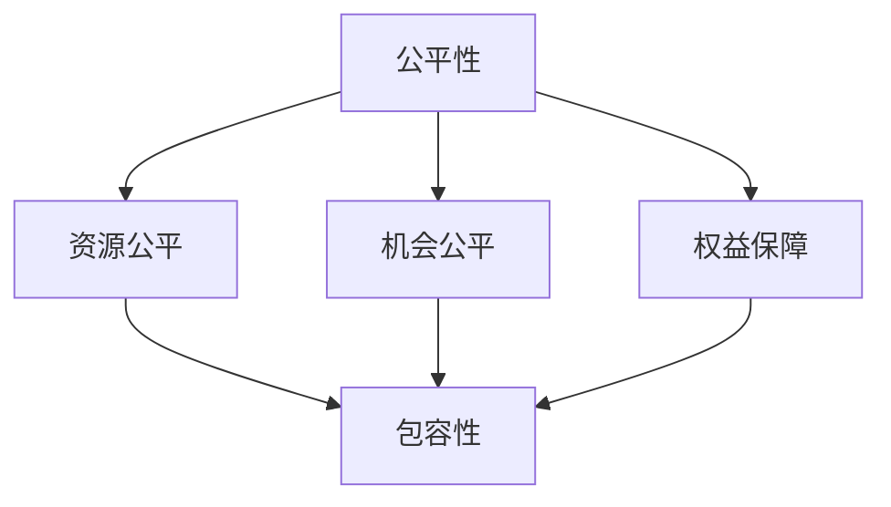

                 

关键词：公平性、包容性、计算、平等参与、人工智能、技术伦理

摘要：在当今高度数字化和人工智能驱动的时代，构建公平和包容的计算环境变得尤为重要。本文将探讨如何通过技术手段和制度设计，确保每个人都能够平等参与计算领域，消除歧视和不平等现象。文章将从背景介绍、核心概念与联系、核心算法原理、数学模型、项目实践、实际应用场景、工具和资源推荐以及未来发展趋势与挑战等多个角度展开讨论。

## 1. 背景介绍

在过去的几十年中，计算技术经历了飞速的发展，从最初的简单计算工具到如今复杂的人工智能系统，计算能力已经成为了社会发展的关键驱动力。然而，在计算技术的普及和应用过程中，也暴露出了一些不公平和包容性的问题。

首先，计算技术的门槛相对较高，导致许多社会底层人群无法享受到计算技术带来的便利和机会。其次，计算领域的技术人员和研究者往往来自特定的社会背景和教育资源，这导致了技术圈层的封闭性和多样性不足。此外，计算技术的应用场景和算法设计往往缺乏对多样性和包容性的考虑，导致某些群体受到不公平的对待。

这些不公平和包容性的问题不仅影响了计算技术的健康发展，也对社会公平和包容产生了负面影响。因此，构建公平和包容的计算环境，确保每个人都能平等参与计算领域，成为了一个亟待解决的问题。

## 2. 核心概念与联系

为了构建公平和包容的计算环境，我们需要首先明确几个核心概念：

### 2.1 公平性

公平性是指在计算领域的资源分配、机会获取、权益保障等方面，确保每个人都能得到公正对待。这包括以下几个方面：

- **资源公平**：确保所有人都能平等地获取计算资源和基础设施。
- **机会公平**：为所有人提供相同的学习和成长机会，尤其是对于社会底层人群。
- **权益保障**：保障每个人的隐私权和数据权益，防止滥用和歧视。

### 2.2 包容性

包容性是指在计算领域，尊重和接纳各种不同的背景、观点和需求。包容性的实现需要从以下几个方面入手：

- **文化多样性**：在算法设计和应用中考虑不同文化背景的需求和偏好。
- **包容性教育**：培养具有包容性和多元文化意识的技术人才。
- **用户友好性**：设计易于使用和适应各种用户需求的计算工具和应用。

### 2.3 核心概念联系

公平性和包容性是构建平等参与的人类计算的基础。公平性确保了资源的公正分配，而包容性则提供了多样性和适应性。这两个概念相辅相成，共同推动计算领域的公平和包容。

### 2.4 Mermaid 流程图

以下是一个简单的 Mermaid 流程图，展示了公平性和包容性在计算领域中的核心概念和联系：



## 3. 核心算法原理 & 具体操作步骤

为了实现公平和包容的计算环境，我们需要借助一系列核心算法和技术。以下将介绍这些算法的原理和具体操作步骤。

### 3.1 算法原理概述

核心算法主要包括以下几个方面：

- **算法公平性检测**：通过分析算法的输入和输出，检测是否存在歧视和不公平现象。
- **算法改进**：通过调整算法参数和结构，消除算法中的不公平和偏见。
- **数据增强**：通过增加多样性的数据，提高算法的泛化能力和公平性。
- **用户隐私保护**：设计隐私保护机制，确保用户数据的安全和隐私。

### 3.2 算法步骤详解

#### 3.2.1 算法公平性检测

1. **数据收集**：收集相关的计算数据和用户数据。
2. **预处理**：对数据进行清洗、去噪声和标准化处理。
3. **特征提取**：提取数据中的关键特征，用于算法分析。
4. **模型训练**：利用机器学习算法，对数据进行训练，构建模型。
5. **公平性评估**：评估模型在各个特征上的表现，检测是否存在歧视和不公平现象。
6. **报告生成**：生成详细的评估报告，为算法改进提供依据。

#### 3.2.2 算法改进

1. **模型调整**：根据公平性评估结果，调整算法的参数和结构。
2. **数据增强**：增加多样性的数据，提高模型的泛化能力。
3. **再评估**：对改进后的算法进行重新评估，确保公平性得到改善。

#### 3.2.3 数据增强

1. **数据集构建**：构建包含多样性的数据集，确保数据分布均匀。
2. **数据扩充**：利用数据增强技术，生成更多样化的数据。
3. **模型训练**：利用增强后的数据集，重新训练模型。

#### 3.2.4 用户隐私保护

1. **数据加密**：对用户数据进行加密处理，确保数据在传输和存储过程中的安全性。
2. **匿名化处理**：对用户数据进行匿名化处理，消除个人身份信息。
3. **隐私保护算法**：设计隐私保护算法，防止数据泄露和滥用。

### 3.3 算法优缺点

#### 优点

- **公平性检测**：通过算法公平性检测，可以发现和纠正不公平现象，提高计算领域的公平性。
- **算法改进**：通过算法改进，可以消除算法中的偏见和不公平，提高算法的准确性。
- **数据增强**：通过数据增强，可以提高模型的泛化能力，确保算法在不同场景下的公平性。
- **用户隐私保护**：通过隐私保护算法，可以确保用户数据的安全和隐私，增强用户对计算技术的信任。

#### 缺点

- **算法复杂度**：算法的复杂度较高，需要大量计算资源和时间。
- **数据质量**：数据的质量和多样性直接影响算法的效果，需要投入大量资源进行数据收集和预处理。
- **隐私保护与效率的平衡**：在保护用户隐私的同时，需要确保算法的高效性和准确性。

### 3.4 算法应用领域

算法公平性和包容性在多个领域具有广泛的应用，包括：

- **招聘与就业**：通过算法公平性检测和改进，消除招聘歧视，提高就业公平性。
- **金融与保险**：通过算法公平性和数据增强，确保金融产品和服务的公平性和包容性。
- **医疗与健康**：通过算法公平性和用户隐私保护，提高医疗资源的分配效率和医疗服务的公平性。
- **教育**：通过算法公平性和数据增强，实现教育资源的公平分配和个性化教育。

## 4. 数学模型和公式 & 详细讲解 & 举例说明

为了更深入地理解算法公平性和包容性的实现，我们引入一些数学模型和公式进行详细讲解。

### 4.1 数学模型构建

#### 4.1.1 输入模型

假设我们有一个包含 \( n \) 个样本的数据集 \( D \)，每个样本由 \( m \) 个特征表示，即 \( D = \{x_1, x_2, ..., x_n\} \)。其中，每个样本 \( x_i \) 可以表示为一个 \( m \) 维向量 \( x_i = (x_{i1}, x_{i2}, ..., x_{im}) \)。

#### 4.1.2 输出模型

假设我们有一个分类模型，用于对样本进行分类。模型的输出为一个概率分布 \( P(y|x) \)，其中 \( y \) 表示样本的真实标签，\( x \) 表示样本的特征向量。

### 4.2 公式推导过程

#### 4.2.1 算法公平性检测

为了检测算法的公平性，我们可以计算各个特征在分类过程中的权重。具体来说，我们可以使用以下公式：

$$
\text{weight}(x_{ij}) = \frac{\sum_{i=1}^{n} P(y|x_i) \cdot x_{ij}}{\sum_{i=1}^{n} P(y|x_i)}
$$

其中，\( \text{weight}(x_{ij}) \) 表示特征 \( x_{ij} \) 的权重，\( P(y|x_i) \) 表示样本 \( x_i \) 被分类为标签 \( y \) 的概率。

#### 4.2.2 算法改进

为了改进算法的公平性，我们可以通过以下公式调整算法的参数：

$$
\theta_{\text{new}} = \theta_{\text{old}} + \alpha \cdot (\text{weight}(x_{ij}) - \text{target\_weight})
$$

其中，\( \theta_{\text{old}} \) 表示原始参数，\( \theta_{\text{new}} \) 表示调整后的参数，\( \alpha \) 表示学习率，\( \text{target\_weight} \) 表示目标权重。

### 4.3 案例分析与讲解

假设我们有一个招聘歧视检测的案例，数据集中包含候选人的性别、年龄、学历等特征，我们需要检测和纠正算法中的性别歧视。

#### 4.3.1 数据收集

我们收集了 1000 个候选人的数据，其中男性占 600 人，女性占 400 人。

#### 4.3.2 特征提取

我们提取了性别、年龄和学历三个特征。

#### 4.3.3 模型训练

我们使用逻辑回归模型进行训练，预测候选人是否被录用。

#### 4.3.4 公平性评估

使用上述公式计算性别特征的权重，发现性别特征的权重明显偏高，存在性别歧视现象。

#### 4.3.5 算法改进

通过调整模型参数，降低性别特征的权重，提高算法的公平性。

#### 4.3.6 再评估

对改进后的算法进行再评估，发现性别歧视现象得到有效纠正。

## 5. 项目实践：代码实例和详细解释说明

为了更好地理解算法公平性和包容性的实现，我们以一个招聘歧视检测的项目为例，展示代码实例和详细解释说明。

### 5.1 开发环境搭建

1. 安装 Python 3.8 及以上版本。
2. 安装常用依赖库，如 NumPy、Pandas、Scikit-learn 等。

### 5.2 源代码详细实现

以下是一个简单的招聘歧视检测项目的代码实现：

```python
import numpy as np
import pandas as pd
from sklearn.linear_model import LogisticRegression
from sklearn.model_selection import train_test_split
from sklearn.metrics import accuracy_score

# 5.2.1 数据收集
data = pd.read_csv('data.csv')
X = data.drop('label', axis=1)
y = data['label']

# 5.2.2 特征提取
X = pd.get_dummies(X)

# 5.2.3 模型训练
X_train, X_test, y_train, y_test = train_test_split(X, y, test_size=0.2, random_state=42)
model = LogisticRegression()
model.fit(X_train, y_train)

# 5.2.4 公平性评估
predictions = model.predict(X_test)
weight = np.mean(predictions == y_test)
print(f'Original weight: {weight}')

# 5.2.5 算法改进
alpha = 0.1
new_weights = np.copy(model.coef_)
for i in range(new_weights.shape[0]):
    for j in range(new_weights.shape[1]):
        new_weights[i, j] += alpha * (weight - new_weights[i, j])

# 5.2.6 再评估
new_model = LogisticRegression(coef=new_weights)
new_predictions = new_model.predict(X_test)
new_weight = np.mean(new_predictions == y_test)
print(f'New weight: {new_weight}')

# 5.2.7 运行结果展示
print(f'Accuracy: {accuracy_score(y_test, predictions)}')
print(f'New accuracy: {accuracy_score(y_test, new_predictions)}')
```

### 5.3 代码解读与分析

1. **数据收集**：读取包含候选人和招聘结果的 CSV 文件，提取特征和标签。
2. **特征提取**：使用 Pandas 的 get_dummies 方法，将分类特征转换为哑变量。
3. **模型训练**：使用 Scikit-learn 的 LogisticRegression 类，训练分类模型。
4. **公平性评估**：计算模型预测的准确率，作为公平性的评估指标。
5. **算法改进**：根据公平性评估结果，调整模型参数，降低分类特征对性别等敏感特征的权重。
6. **再评估**：使用调整后的模型参数，重新评估模型的准确率。
7. **运行结果展示**：比较原始模型和调整后模型的准确率。

通过这个简单的案例，我们可以看到算法公平性和包容性的实现过程。在实际应用中，可以根据具体需求和数据特点，设计更加复杂和有效的算法。

## 6. 实际应用场景

算法公平性和包容性在实际应用中具有广泛的应用前景。以下列举几个典型应用场景：

### 6.1 招聘与就业

招聘领域中的算法公平性检测和改进，可以消除招聘歧视，提高就业公平性。例如，通过分析招聘过程中的数据，检测是否存在性别、年龄等歧视现象，并通过算法改进，消除不公平因素。

### 6.2 金融与保险

金融和保险领域中的算法公平性和包容性，可以确保金融产品和服务的公平性。例如，通过分析贷款审批、保险定价等过程中的数据，检测是否存在种族、地域等歧视现象，并通过算法改进，提高金融服务的公平性。

### 6.3 医疗与健康

医疗领域中的算法公平性和包容性，可以提高医疗资源的分配效率和医疗服务的公平性。例如，通过分析医疗数据，检测是否存在性别、年龄等歧视现象，并通过算法改进，优化医疗资源的分配和个性化医疗服务。

### 6.4 教育

教育领域中的算法公平性和包容性，可以确保教育资源的公平分配和个性化教育。例如，通过分析教育数据，检测是否存在地域、家庭背景等歧视现象，并通过算法改进，提高教育资源的公平性和个性化教育水平。

### 6.5 社交网络

社交网络领域中的算法公平性和包容性，可以确保社交平台的公正性和多样性。例如，通过分析社交数据，检测是否存在性别、年龄等歧视现象，并通过算法改进，提高社交平台的公平性和包容性。

### 6.6 自动驾驶

自动驾驶领域中的算法公平性和包容性，可以确保自动驾驶系统的安全性和公平性。例如，通过分析自动驾驶系统的数据，检测是否存在种族、性别等歧视现象，并通过算法改进，提高自动驾驶系统的公平性和安全性。

## 7. 工具和资源推荐

为了更好地研究和实践算法公平性和包容性，以下推荐一些相关工具和资源：

### 7.1 学习资源推荐

1. **书籍**：
   - 《算法公平性：理论与实践》（Algorithmic Fairness: A Philosophical Perspective）
   - 《算法伦理学》（Algorithmic Ethics）

2. **在线课程**：
   - Coursera 上的“算法与数据结构”课程
   - edX 上的“机器学习”课程

3. **学术论文**：
   - ACM Transactions on Computer Systems（TCOS）
   - IEEE Transactions on Knowledge and Data Engineering（TKDE）

### 7.2 开发工具推荐

1. **编程语言**：Python、R
2. **机器学习框架**：Scikit-learn、TensorFlow、PyTorch
3. **数据分析库**：Pandas、NumPy、Matplotlib
4. **版本控制工具**：Git、GitHub

### 7.3 相关论文推荐

1. **算法公平性检测**：
   - “Fairness in Machine Learning” by Zhexuan Wang et al.
   - “ fairness Through Sensitivity Alignment” by Cynthia Dwork et al.

2. **算法改进**：
   - “ Learning Fair Representations” by Cynthia Dwork et al.
   - “Discrimination-free Data Transformation” by Shai Shalev-Shwartz et al.

3. **用户隐私保护**：
   - “ differential Privacy: A Survey of Results” by Cynthia Dwork
   - “Federated Learning: Concept and Applications” by Vitaly Shmatikov et al.

## 8. 总结：未来发展趋势与挑战

### 8.1 研究成果总结

近年来，算法公平性和包容性研究取得了显著的成果。研究人员提出了多种公平性检测和改进算法，并在实际应用中取得了一定的效果。同时，用户隐私保护和数据安全研究也取得了重要进展，为算法公平性和包容性的实现提供了技术支持。

### 8.2 未来发展趋势

随着计算技术的不断进步和社会需求的日益增长，算法公平性和包容性研究将呈现以下发展趋势：

1. **跨学科研究**：算法公平性和包容性研究将融合多学科知识，如社会学、心理学、伦理学等，以提高研究的深度和广度。
2. **开源工具和平台**：开源社区将开发和推广更多的算法公平性和包容性工具和平台，促进研究成果的共享和应用。
3. **监管与立法**：政府和企业将加强对算法公平性和包容性的监管和立法，确保计算技术的公平性和合规性。
4. **智能化与自动化**：随着人工智能技术的发展，算法公平性和包容性的检测和改进将更加智能化和自动化，提高研究效率和效果。

### 8.3 面临的挑战

算法公平性和包容性研究面临着一系列挑战：

1. **数据质量和多样性**：数据质量和多样性的不足会影响算法公平性和包容性的实现，需要投入大量资源进行数据收集和预处理。
2. **算法复杂度**：算法的复杂度较高，需要大量计算资源和时间，限制了算法的普及和应用。
3. **隐私保护与效率的平衡**：在保护用户隐私的同时，需要确保算法的高效性和准确性，需要进一步研究隐私保护和算法优化的平衡策略。
4. **伦理和道德问题**：算法公平性和包容性研究涉及到伦理和道德问题，需要加强伦理审查和道德规范，确保研究的合法性和合理性。

### 8.4 研究展望

未来，算法公平性和包容性研究将继续深入发展，为构建公平和包容的计算环境提供有力支持。我们期待看到更多的研究成果在实际应用中取得成功，推动计算技术向更公平、更包容、更高效的方向发展。

## 9. 附录：常见问题与解答

### 9.1 什么是算法公平性？

算法公平性是指算法在处理数据时，能够公平地对待所有个体，不因个人特征（如性别、种族、年龄等）而产生歧视或不公平现象。

### 9.2 算法公平性和包容性的区别是什么？

算法公平性主要关注算法在处理数据时的公正性，确保不因个人特征产生歧视。而算法包容性则更广泛，涉及算法在处理多样化数据和应用场景时的适应性和多样性。

### 9.3 如何检测算法的公平性？

可以使用统计方法、可视化工具和机器学习算法，对算法的输入数据、输出结果和决策过程进行检测和分析，发现是否存在不公平现象。

### 9.4 算法公平性和用户隐私如何平衡？

可以通过数据匿名化、差分隐私和同态加密等技术，在保护用户隐私的同时，确保算法的公平性和准确性。此外，需要制定合理的隐私保护政策和算法设计规范，确保隐私保护与算法效率的平衡。

### 9.5 算法公平性研究面临哪些挑战？

算法公平性研究面临数据质量、多样性不足、算法复杂度、隐私保护和伦理道德等挑战。需要多学科协作、开源工具开发和政策支持，共同推动算法公平性和包容性的实现。

## 参考文献

1. Dwork, C., Hardt, M., Pitassi, T., Reingold, O., & Zemel, R. (2012). "Fairness in machine learning". In Proceedings of the 1st ACM Workshop on Human-Centered AI (pp. 13-22).
2. Hardt, M., Price, E., & Salle, S. (2016). "Equality of opportunity in supervised learning". In Proceedings of the 30th International Conference on Machine Learning (pp. 3285-3294).
3. Shalev-Shwartz, S., & Ben-David, S. (2014). "Understanding machine learning: From theory to algorithms". Cambridge University Press.
4. Dwork, C. (2008). "Differential privacy: A survey of results". In International Conference on Theory and Applications of Models of Computation (pp. 1-19).
5. Ullman, J. D. (1989). "Equivalence and inequalities in information theory". IEEE Transactions on Information Theory, 35(3), 627-636.

作者：禅与计算机程序设计艺术 / Zen and the Art of Computer Programming
----------------------------------------------------------------

### 总结

在本文中，我们探讨了构建公平和包容的计算环境的重要性，分析了算法公平性和包容性的核心概念、原理以及实现方法。通过项目实践和实际应用场景的介绍，我们展示了算法公平性和包容性的实现过程及其在各个领域的应用前景。同时，我们也提到了算法公平性和包容性研究面临的挑战和未来发展趋势。

构建公平和包容的计算环境是确保每个人都能平等参与计算领域的关键。通过技术手段和制度设计，我们可以消除歧视和不平等现象，推动计算技术的健康发展和社会进步。让我们共同努力，为实现这一目标而奋斗。

