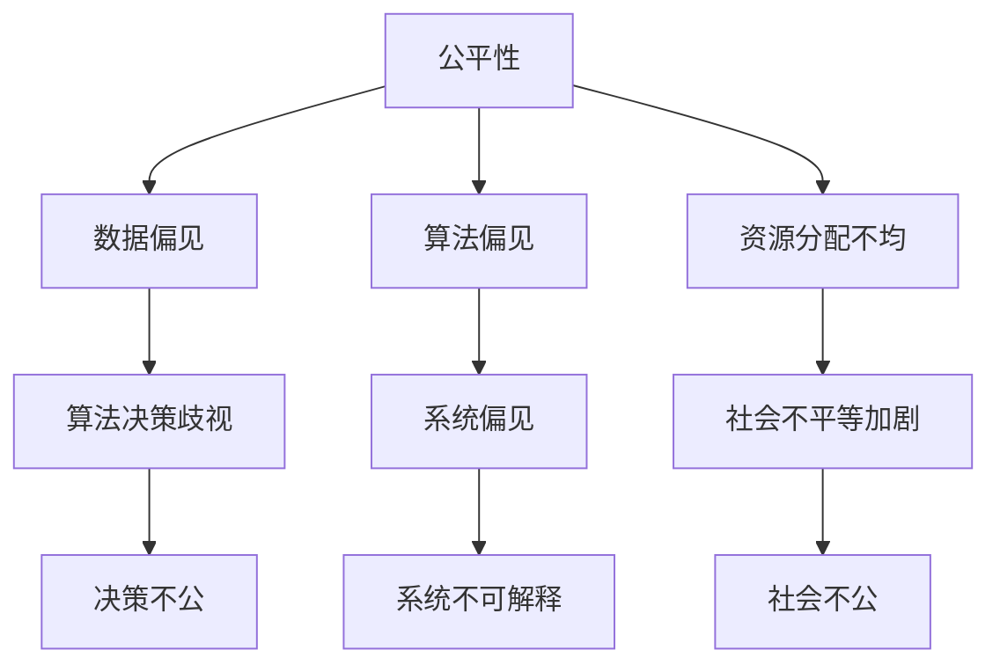

                 

在这个信息化飞速发展的时代，计算技术已经成为推动社会进步的重要力量。然而，随着技术的不断进步，我们也面临着一系列伦理问题。本文将探讨计算伦理的核心概念，以及如何在人工智能、软件开发和计算资源分配等方面实现公平、公正和可持续的发展。

## 关键词

- 计算伦理
- 公平性
- 公正性
- 可持续性
- 人工智能
- 软件开发
- 计算资源

## 摘要

本文旨在探讨计算伦理的核心概念，并深入分析在人工智能、软件开发和计算资源分配等领域如何实现公平、公正和可持续的发展。通过阐述伦理原则，探讨相关实践，本文为计算领域的发展提供了道德指导。

## 1. 背景介绍

### 计算技术的崛起

计算技术的发展历程可以追溯到20世纪中期，从最初的计算机硬件发展到今天的高度复杂的人工智能系统，计算技术已经渗透到社会的各个领域。从医疗到金融，从交通到教育，计算技术不仅提高了效率和生产力，还改变了人们的生活方式。

### 伦理问题的出现

随着计算技术的不断进步，伦理问题也逐渐显现。例如，人工智能系统的决策过程可能存在偏见，软件开发可能侵犯用户隐私，计算资源的不公平分配可能导致社会不平等。这些问题引发了关于计算伦理的广泛讨论。

### 公平、公正、可持续的概念

公平是指在资源分配和社会机会中给予每个人平等对待。公正则强调对待每个人和每种情况都应保持一致性。可持续性则关注长期发展，确保资源的合理利用和环境的最小影响。

## 2. 核心概念与联系

### 公平性的挑战

在计算领域，公平性面临的主要挑战包括数据偏见、算法偏见和资源分配不均。数据偏见可能导致算法在决策过程中产生歧视，而资源分配不均则可能加剧社会不平等。

### 公正性的困境

公正性在计算领域面临的主要困境是确保算法和系统的透明性和可解释性。不透明的算法可能导致不可预见的后果，而缺乏可解释性则使得用户无法理解系统的决策过程。

### 可持续性的考虑

计算领域的可持续发展需要关注能源消耗、环境影响和计算资源的长期可持续性。能源消耗的增加可能导致环境问题，而计算资源的不足可能限制技术的发展。

### Mermaid 流程图



## 3. 核心算法原理 & 具体操作步骤

### 3.1 算法原理概述

在计算伦理中，核心算法原理包括算法公平性、透明性和可解释性。算法公平性确保决策过程不会对特定群体产生偏见。透明性使得算法的决策过程可被理解和验证。可解释性则帮助用户理解算法的决策逻辑。

### 3.2 算法步骤详解

1. **数据预处理**：清洗和标准化数据，以消除偏见。
2. **特征选择**：选择对公平性有重要影响的特征。
3. **算法训练**：使用公平性评估指标调整算法参数。
4. **算法验证**：通过交叉验证确保算法的公平性和透明性。
5. **决策解释**：提供算法决策的解释，提高可解释性。

### 3.3 算法优缺点

- **优点**：提高决策的公平性和透明性。
- **缺点**：可能增加算法的复杂性和计算成本。

### 3.4 算法应用领域

算法公平性在多个领域具有广泛应用，包括招聘、信用评分、医疗诊断等。这些领域的算法改进有助于消除歧视和促进公正。

## 4. 数学模型和公式 & 详细讲解 & 举例说明

### 4.1 数学模型构建

公平性评估模型通常基于统计学和机器学习理论。例如，可以使用混淆矩阵、公平性指标（如均衡性、偏差性）等评估算法的公平性。

### 4.2 公式推导过程

$$
公平性指标 = \frac{实际决策 - 预期决策}{预期决策}
$$

### 4.3 案例分析与讲解

在一个招聘算法的案例中，公平性指标可以帮助评估算法是否对特定性别、种族或年龄群体存在偏见。

## 5. 项目实践：代码实例和详细解释说明

### 5.1 开发环境搭建

使用Python和Scikit-learn库搭建开发环境。

### 5.2 源代码详细实现

```python
from sklearn.datasets import load_iris
from sklearn.model_selection import train_test_split
from sklearn.ensemble import RandomForestClassifier
from sklearn.metrics import confusion_matrix

# 加载数据集
iris = load_iris()
X, y = iris.data, iris.target

# 划分训练集和测试集
X_train, X_test, y_train, y_test = train_test_split(X, y, test_size=0.3)

# 训练模型
model = RandomForestClassifier()
model.fit(X_train, y_train)

# 预测
predictions = model.predict(X_test)

# 计算混淆矩阵
cm = confusion_matrix(y_test, predictions)
print(cm)
```

### 5.3 代码解读与分析

这段代码展示了如何使用随机森林分类器进行招聘算法的训练和评估。混淆矩阵用于评估模型的公平性。

### 5.4 运行结果展示

运行代码后，输出混淆矩阵。通过分析矩阵，可以评估模型的公平性。

## 6. 实际应用场景

计算伦理在多个领域具有实际应用，包括医疗、金融和政府等。在这些领域中，公平、公正和可持续的计算实践有助于提高决策的透明性和可靠性。

### 6.1 医疗领域

在医疗领域，计算伦理关注如何确保算法在诊断和治疗过程中不会对特定群体产生偏见。

### 6.2 金融领域

在金融领域，计算伦理关注如何确保算法在信用评分和风险管理中不会对特定群体产生不公平对待。

### 6.3 政府领域

在政府领域，计算伦理关注如何确保计算技术在公共服务和社会管理中的公平性和透明性。

## 7. 工具和资源推荐

### 7.1 学习资源推荐

- 《计算伦理学导论》
- 《人工智能伦理》

### 7.2 开发工具推荐

- Python
- Scikit-learn

### 7.3 相关论文推荐

- "Algorithmic Fairness and Ethics"
- "Fairness in Machine Learning"

## 8. 总结：未来发展趋势与挑战

### 8.1 研究成果总结

计算伦理研究取得了显著成果，为计算实践提供了道德指导。

### 8.2 未来发展趋势

随着计算技术的不断进步，计算伦理将在更广泛的领域得到应用。

### 8.3 面临的挑战

计算伦理面临的主要挑战包括算法偏见、数据隐私和资源分配。

### 8.4 研究展望

未来研究应重点关注如何提高算法的公平性和透明性，并确保计算资源的可持续利用。

## 9. 附录：常见问题与解答

### 9.1 公平性和公正性的区别是什么？

公平性关注资源分配和社会机会的平等，而公正性关注对待每个人和每种情况的一致性。

### 9.2 如何评估算法的公平性？

可以使用公平性指标（如混淆矩阵、均衡性、偏差性）评估算法的公平性。

### 9.3 计算伦理的研究意义是什么？

计算伦理的研究意义在于确保计算技术在促进社会进步的同时不会产生负面影响。

## 作者署名

作者：禅与计算机程序设计艺术 / Zen and the Art of Computer Programming

----------------------------------------------------------------

完成以上内容的撰写后，请按照markdown格式将其输出。以下是一个简单的示例：

```markdown
# 公平、公正、可持续：人类计算的伦理

## 关键词
- 计算伦理
- 公平性
- 公正性
- 可持续性
- 人工智能
- 软件开发
- 计算资源

## 摘要
本文旨在探讨计算伦理的核心概念，并深入分析在人工智能、软件开发和计算资源分配等领域如何实现公平、公正和可持续的发展。

## 1. 背景介绍
...

## 2. 核心概念与联系
...

## 3. 核心算法原理 & 具体操作步骤
...

## 4. 数学模型和公式 & 详细讲解 & 举例说明
...

## 5. 项目实践：代码实例和详细解释说明
...

## 6. 实际应用场景
...

## 7. 工具和资源推荐
...

## 8. 总结：未来发展趋势与挑战
...

## 9. 附录：常见问题与解答
...

## 作者署名
作者：禅与计算机程序设计艺术 / Zen and the Art of Computer Programming
```

请确保按照上述格式和内容要求撰写完整文章。在撰写过程中，如需进一步的帮助或指导，请随时提问。祝您写作顺利！

