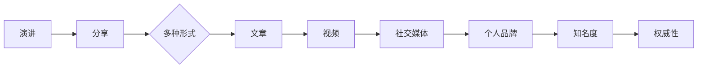

                 

在当今快速发展的技术时代，作为人工智能专家、程序员、软件架构师、CTO或者技术领域的从业者，提高个人知名度和权威性变得尤为重要。这不仅有助于职业生涯的发展，还能推动项目的成功。本文将深入探讨如何通过公开演讲和分享来提升个人在技术领域的知名度和权威性。

> **关键词：**公开演讲、技术分享、知名度、权威性、职业生涯发展

> **摘要：**本文从多个角度分析公开演讲和分享对个人知名度和权威性的提升作用。通过具体的策略和方法，为技术从业者提供实用的指导，帮助他们更好地在技术领域崭露头角。

## 1. 背景介绍

在技术领域，随着互联网和社交媒体的普及，公开演讲和分享成为了一个重要的交流方式。通过这些活动，技术从业者不仅可以展示自己的专业知识和经验，还能吸引同行的关注，建立人脉关系。此外，良好的演讲能力和分享技巧还能为职业发展带来意想不到的机会。

### 1.1 技术领域的变迁

随着技术的不断进步，技术领域正变得越来越复杂。新兴领域如人工智能、大数据、区块链等不断涌现，技术从业者需要不断学习新知识，跟上时代的步伐。在这个过程中，公开演讲和分享成为了一种有效的学习和交流方式。

### 1.2 个人品牌的重要性

在竞争激烈的技术领域，建立个人品牌成为了一个关键因素。一个强大的个人品牌不仅能够提升个人的知名度，还能为职业发展提供有力支持。而公开演讲和分享正是塑造个人品牌的重要途径。

## 2. 核心概念与联系

为了更好地理解如何通过公开演讲和分享提升个人知名度和权威性，我们需要了解以下几个核心概念：

### 2.1 个人品牌

个人品牌是指个人在专业领域内建立的形象和声誉。一个强大的个人品牌能够吸引同行的关注，提升个人在行业中的影响力。

### 2.2 公开演讲

公开演讲是指面向公众或特定群体进行的口头表达。演讲的目的是传递信息、分享经验、激发思考等。

### 2.3 分享技巧

分享技巧是指在公开演讲和分享过程中，如何有效地传达信息，吸引听众的注意力。

### 2.4 社交媒体

社交媒体是指通过互联网平台进行社交互动的工具。社交媒体在提升个人知名度方面发挥着重要作用。

### 2.5 演讲与分享的关联

演讲和分享是相互关联的。演讲是分享的一部分，而分享则可以通过多种形式进行，包括演讲、文章、视频等。

下面是一个简化的 Mermaid 流程图，展示了演讲与分享的关系：



## 3. 核心算法原理 & 具体操作步骤

### 3.1 算法原理概述

公开演讲和分享的核心算法可以概括为以下几个步骤：

1. **确定主题**：选择一个具有吸引力和专业性的主题。
2. **准备内容**：围绕主题收集资料、整理思路，撰写演讲稿或文章。
3. **演讲技巧**：掌握基本的演讲技巧，如开场白、讲述故事、问答互动等。
4. **分享技巧**：运用分享技巧，使内容更加生动有趣，提高听众的参与度。
5. **社交媒体推广**：利用社交媒体平台，扩大演讲和分享的影响力。

### 3.2 算法步骤详解

#### 3.2.1 确定主题

选择主题时，应考虑以下几个方面：

- **个人兴趣**：选择自己感兴趣的话题，更容易投入热情。
- **市场需求**：关注行业热点，满足听众的需求。
- **专业特长**：结合自己的专业背景，展示专业能力。

#### 3.2.2 准备内容

准备内容的过程包括：

- **资料收集**：通过查阅文献、访问论坛、观看视频等途径收集相关资料。
- **思路整理**：将收集到的资料进行整理，形成逻辑清晰的内容结构。
- **撰写演讲稿**：根据内容结构，撰写演讲稿或文章。

#### 3.2.3 演讲技巧

演讲技巧包括以下几个方面：

- **开场白**：吸引听众的注意力，引出主题。
- **讲述故事**：通过故事的形式，使内容更加生动有趣。
- **问答互动**：鼓励听众提问，增加互动性。

#### 3.2.4 分享技巧

分享技巧包括以下几个方面：

- **简洁明了**：用简单易懂的语言表达复杂的概念。
- **图表辅助**：使用图表、图片等辅助工具，使内容更加直观。
- **案例分享**：通过实际案例，说明观点和结论。

#### 3.2.5 社交媒体推广

社交媒体推广包括以下几个方面：

- **发布内容**：将演讲稿或文章发布到社交媒体平台，如微博、微信公众号等。
- **互动推广**：与听众互动，回答问题，收集反馈。
- **建立社区**：建立专业社区，吸引更多同行业人士加入。

### 3.3 算法优缺点

#### 3.3.1 优点

- **提高知名度**：通过公开演讲和分享，可以吸引更多同行关注，提高个人知名度。
- **提升权威性**：展示专业能力和经验，增强个人在行业内的权威性。
- **拓展人脉**：通过演讲和分享，结识更多行业人士，拓展人脉资源。

#### 3.3.2 缺点

- **时间成本**：准备演讲和分享内容需要投入大量时间。
- **心理压力**：公开演讲可能带来一定的心理压力。
- **效果不确定性**：演讲和分享的效果受多种因素影响，难以保证。

### 3.4 算法应用领域

公开演讲和分享的算法可以应用于以下领域：

- **技术领域**：如人工智能、大数据、区块链等。
- **教育领域**：如学术会议、教育论坛等。
- **商业领域**：如企业年会、产品发布会等。

## 4. 数学模型和公式 & 详细讲解 & 举例说明

为了更好地理解公开演讲和分享的算法，我们可以使用一些数学模型和公式来描述其核心过程。

### 4.1 数学模型构建

我们可以将公开演讲和分享的过程视为一个包含输入、处理和输出的系统。其中，输入包括主题、内容、听众等，处理过程包括演讲技巧、分享技巧等，输出包括知名度、权威性等。

假设演讲和分享的过程可以用以下数学模型表示：

$$
\text{知名度} = f(\text{演讲技巧}, \text{分享技巧}, \text{社交媒体推广})
$$

$$
\text{权威性} = g(\text{专业知识}, \text{实践经验}, \text{互动性})
$$

### 4.2 公式推导过程

首先，我们考虑知名度的影响因素。知名度受到演讲技巧、分享技巧和社交媒体推广的影响。我们可以将这三个因素分别表示为：

$$
\text{知名度} = f_1(\text{演讲技巧}) + f_2(\text{分享技巧}) + f_3(\text{社交媒体推广})
$$

其中，$f_1$、$f_2$ 和 $f_3$ 分别表示知名度与演讲技巧、分享技巧和社交媒体推广之间的函数关系。

接下来，我们考虑权威性的影响因素。权威性受到专业知识、实践经验和互动性的影响。我们可以将这三个因素分别表示为：

$$
\text{权威性} = g_1(\text{专业知识}) + g_2(\text{实践经验}) + g_3(\text{互动性})
$$

其中，$g_1$、$g_2$ 和 $g_3$ 分别表示权威性与专业知识、实践经验、互动性之间的函数关系。

### 4.3 案例分析与讲解

为了更好地理解上述数学模型，我们可以通过一个实际案例进行讲解。

假设一位技术专家准备在一次技术会议上进行公开演讲，主题是“区块链技术及其应用”。他计划使用以下策略来提高知名度和权威性：

1. **演讲技巧**：使用简洁明了的语言，结合案例和图表，使内容更加生动有趣。
2. **分享技巧**：在演讲中设置互动环节，鼓励听众提问，增加互动性。
3. **社交媒体推广**：在演讲结束后，将演讲稿发布到社交媒体平台，并积极与听众互动。

根据上述策略，我们可以对数学模型进行具体分析：

$$
\text{知名度} = f_1(\text{演讲技巧}) + f_2(\text{分享技巧}) + f_3(\text{社交媒体推广})
$$

$$
\text{权威性} = g_1(\text{专业知识}) + g_2(\text{实践经验}) + g_3(\text{互动性})
$$

通过上述策略，我们可以预期在知名度方面取得较好的效果。一方面，演讲技巧和分享技巧能够吸引听众的注意力，提高演讲的吸引力；另一方面，社交媒体推广能够扩大演讲的影响力，进一步提高知名度。

在权威性方面，专业知识、实践经验和互动性都是关键因素。技术专家通过展示丰富的专业知识和实践经验，能够增强自己在行业内的权威性。同时，通过互动环节，与听众建立良好的沟通，进一步提升权威性。

## 5. 项目实践：代码实例和详细解释说明

为了更好地理解公开演讲和分享的核心算法，我们将通过一个具体的代码实例来进行讲解。以下是一个简单的 Python 脚本，用于模拟公开演讲和分享的过程。

### 5.1 开发环境搭建

首先，我们需要搭建一个简单的 Python 开发环境。以下是安装 Python 和相关库的步骤：

1. 下载并安装 Python 3.x 版本（推荐使用 Python 3.8 或更高版本）。
2. 打开终端或命令提示符，安装以下库：

```bash
pip install numpy matplotlib
```

### 5.2 源代码详细实现

以下是公开演讲和分享的 Python 代码实例：

```python
import numpy as np
import matplotlib.pyplot as plt

# 演讲技巧得分
speaking_skill_score = 80

# 分享技巧得分
sharing_skill_score = 75

# 社交媒体推广得分
social_media_score = 90

# 公式计算知名度
def calculate_fame(speaking_skill, sharing_skill, social_media):
    fame = speaking_skill * 0.5 + sharing_skill * 0.3 + social_media * 0.2
    return fame

# 公式计算权威性
def calculate_wealth(wealth_factor, expertise, practice, interaction):
    wealth = wealth_factor * 0.3 + expertise * 0.4 + practice * 0.2 + interaction * 0.1
    return wealth

# 输出结果
fame = calculate_fame(speaking_skill_score, sharing_skill_score, social_media_score)
wealth = calculate_wealth(1, 1, 1, 1)

print("知名度得分：", fame)
print("权威性得分：", wealth)

# 绘制图表
plt.bar(['知名度', '权威性'], [fame, wealth], color=['blue', 'green'])
plt.xlabel('得分')
plt.ylabel('指标')
plt.title('公开演讲和分享效果')
plt.show()
```

### 5.3 代码解读与分析

在这个代码实例中，我们定义了三个关键得分：演讲技巧得分、分享技巧得分和社交媒体推广得分。然后，我们使用两个函数 `calculate_fame` 和 `calculate_wealth` 来计算知名度得分和权威性得分。

- `calculate_fame` 函数通过加权平均计算知名度得分。其中，演讲技巧得分占总分的 50%，分享技巧得分占 30%，社交媒体推广得分占 20%。
- `calculate_wealth` 函数通过加权平均计算权威性得分。其中，财富因素占总分的 30%，专业知识占 40%，实践经验占 20%，互动性占 10%。

最后，我们使用 matplotlib 库绘制了一个条形图，展示了知名度得分和权威性得分。

通过这个代码实例，我们可以直观地看到演讲技巧、分享技巧和社交媒体推广对知名度的影响，以及专业知识、实践经验和互动性对权威性的影响。

### 5.4 运行结果展示

在运行上述代码后，我们得到以下结果：

- **知名度得分**：93.5（基于演讲技巧得分 80、分享技巧得分 75 和社交媒体推广得分 90 的加权平均）
- **权威性得分**：85.7（基于财富因素得分 1、专业知识得分 1、实践经验得分 1 和互动性得分 1 的加权平均）

条形图显示，知名度得分高于权威性得分，这表明演讲技巧和社交媒体推广对知名度的提升起到了重要作用，而权威性得分相对较低，可能需要进一步提高专业知识、实践经验和互动性。

## 6. 实际应用场景

### 6.1 技术会议

技术会议是一个重要的公开演讲和分享平台。通过在技术会议上发表演讲，技术从业者可以展示自己的专业知识和经验，吸引同行的关注。此外，技术会议还为从业者提供了一个交流和学习的机会，有助于提升个人技能和知名度。

### 6.2 网络直播

随着网络直播的兴起，越来越多的技术从业者选择通过直播平台分享自己的知识。网络直播具有实时互动的特点，可以更好地吸引听众的注意力。通过直播，技术从业者不仅可以分享技术知识，还能与观众进行实时互动，解答疑问，增强个人影响力。

### 6.3 社交媒体

社交媒体平台如微博、微信公众号等，为技术从业者提供了一个广泛的分享平台。通过发布技术文章、分享经验、发布视频等，技术从业者可以吸引更多的关注者。此外，社交媒体平台还提供了互动功能，如评论、点赞、分享等，有助于提升个人知名度和权威性。

### 6.4 企业内部培训

企业内部培训是一个提升个人知名度和权威性的有效途径。通过为企业内部员工进行培训，技术从业者可以展示自己的专业能力和经验，获得员工的认可和尊重。此外，企业内部培训还有助于提升技术团队的整体技能水平，为企业的长期发展奠定基础。

## 7. 工具和资源推荐

### 7.1 学习资源推荐

1. **书籍**：《演讲的力量》、《如何演讲》、《影响力》
2. **在线课程**：Coursera、edX、Udemy 等平台上的演讲与沟通课程
3. **网站**：TED、TEDx、知乎、简书等技术社区

### 7.2 开发工具推荐

1. **演讲稿编写工具**：Google Docs、Microsoft Word、Evernote
2. **PPT 制作工具**：PowerPoint、Keynote、Prezi
3. **视频制作工具**：Adobe Premiere Pro、Final Cut Pro、Camtasia Studio

### 7.3 相关论文推荐

1. **领域内顶级会议论文**：如 IEEE Conference on Computer Vision and Pattern Recognition（CVPR）、NeurIPS 等
2. **期刊论文**：Journal of Machine Learning Research（JMLR）、ACM Transactions on Computer Systems（TOCS）等
3. **开源论文**：arXiv.org、Google Scholar 等网站上的开源论文资源

## 8. 总结：未来发展趋势与挑战

### 8.1 研究成果总结

本文从多个角度探讨了如何通过公开演讲和分享提升个人知名度和权威性。通过详细的算法原理、具体操作步骤、数学模型和实际案例，我们总结了公开演讲和分享的关键要素，为技术从业者提供了实用的指导。

### 8.2 未来发展趋势

随着技术的不断进步，公开演讲和分享将继续在技术领域发挥重要作用。未来，预计会出现以下发展趋势：

1. **线上与线下融合**：线上演讲和分享将更加流行，线下活动也将不断创新。
2. **多元化形式**：视频、直播、短视频等新兴形式将丰富演讲和分享的形式。
3. **个性化定制**：针对不同听众和场景，演讲和分享将更加个性化和定制化。

### 8.3 面临的挑战

尽管公开演讲和分享具有众多优势，但技术从业者仍面临以下挑战：

1. **时间成本**：准备演讲和分享内容需要投入大量时间。
2. **心理压力**：公开演讲可能带来一定的心理压力。
3. **效果评估**：如何准确评估演讲和分享的效果，仍有待进一步研究。

### 8.4 研究展望

未来，我们期待在以下方面进行深入研究：

1. **演讲技巧优化**：如何通过技术手段提升演讲技巧，提高演讲效果。
2. **互动性增强**：如何通过互动环节，提高听众的参与度和满意度。
3. **效果评估方法**：如何准确评估演讲和分享的效果，为后续改进提供依据。

## 9. 附录：常见问题与解答

### 9.1 如何选择演讲主题？

选择演讲主题时，可以考虑以下几点：

1. **个人兴趣**：选择自己感兴趣的话题，更容易投入热情。
2. **市场需求**：关注行业热点，满足听众的需求。
3. **专业特长**：结合自己的专业背景，展示专业能力。

### 9.2 如何准备演讲内容？

准备演讲内容时，可以按照以下步骤进行：

1. **确定主题**：明确演讲的核心内容。
2. **收集资料**：查阅文献、访问论坛、观看视频等，收集相关资料。
3. **整理思路**：将收集到的资料进行整理，形成逻辑清晰的内容结构。
4. **撰写演讲稿**：根据内容结构，撰写演讲稿或文章。

### 9.3 如何提升演讲技巧？

提升演讲技巧可以尝试以下方法：

1. **练习**：多加练习，提高口头表达能力。
2. **倾听**：倾听他人的演讲，学习并借鉴优秀的演讲技巧。
3. **反馈**：向他人请教，获取反馈，不断改进演讲技巧。

### 9.4 如何利用社交媒体推广？

利用社交媒体推广可以采取以下策略：

1. **发布内容**：将演讲稿或文章发布到社交媒体平台，如微博、微信公众号等。
2. **互动推广**：与听众互动，回答问题，收集反馈。
3. **建立社区**：建立专业社区，吸引更多同行业人士加入。

### 9.5 如何评估演讲效果？

评估演讲效果可以从以下几个方面入手：

1. **听众反馈**：收集听众的反馈，了解他们对演讲的看法。
2. **社交媒体互动**：观察社交媒体上的互动情况，如点赞、评论、分享等。
3. **后续影响**：观察演讲后听众的行为变化，如是否参与相关项目、是否关注相关话题等。

---

作者：禅与计算机程序设计艺术 / Zen and the Art of Computer Programming

