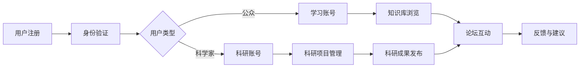

                 

关键词：公民科学、科技普及、平台建设、科学交流、数据共享

> 摘要：本文旨在探讨如何构建一个高效的公民科学平台，以促进科学家与公众之间的互动与交流，从而推动科技普及和科学研究的共同发展。

## 1. 背景介绍

在当今信息化社会，科学知识的传播与普及显得尤为重要。然而，科学家与公众之间的沟通障碍始终存在。一方面，科学家专注于复杂的科研问题，往往缺乏与公众有效沟通的技能；另一方面，公众对科学知识的获取途径有限，难以深入理解科学研究的内涵。这种状况不仅阻碍了科学知识的普及，也限制了公众对科学研究的参与。

为了解决这一问题，有必要构建一个桥梁，连接科学家与公众，促进双方的互动与交流。这便是公民科学平台的初衷。公民科学平台旨在为公众提供一个参与科学研究的机会，同时帮助科学家了解公众的需求和兴趣，从而实现科学知识的普及和科学研究的进步。

## 2. 核心概念与联系

### 2.1 平台架构

一个高效的公民科学平台应具备以下核心架构：

- **用户管理系统**：用于管理公众和科学家的账户信息、权限分配等。
- **内容管理系统**：用于发布科学知识、科研成果、科研项目等信息。
- **交互系统**：包括论坛、问答、直播等功能，促进科学家与公众之间的交流。
- **数据共享系统**：用于存储和管理科研数据，提供数据查询、下载和分析等功能。

### 2.2 Mermaid 流程图

下面是一个简化的Mermaid流程图，描述了公民科学平台的主要工作流程：



### 2.3 平台优势

公民科学平台的优势在于：

- **降低门槛**：公众可以更容易地了解科学知识，参与科学研究。
- **提高透明度**：科学家可以更直观地了解公众的需求和兴趣，提高科研项目的公众参与度。
- **促进合作**：科学家与公众之间的互动有助于促进跨学科合作，推动科研创新。
- **资源共享**：平台提供的科研数据和知识库有助于提高科研效率和成果质量。

## 3. 核心算法原理 & 具体操作步骤

### 3.1 算法原理概述

公民科学平台的核心算法主要包括：

- **推荐算法**：用于根据用户的兴趣和行为推荐科学知识和科研项目。
- **社区分析算法**：用于分析用户在平台上的互动行为，挖掘潜在的科研合作机会。
- **数据挖掘算法**：用于从科研数据中提取有价值的信息，为科学家提供数据支持。

### 3.2 算法步骤详解

#### 3.2.1 推荐算法

1. 收集用户行为数据：如浏览记录、搜索关键词、互动行为等。
2. 构建用户画像：基于用户行为数据，构建用户兴趣模型。
3. 提取知识库中的关键词和标签：对科学知识和科研项目进行文本分析，提取关键词和标签。
4. 建立推荐模型：使用机器学习算法，如协同过滤、基于内容的推荐等，建立推荐模型。
5. 推荐结果生成：根据用户画像和推荐模型，为用户生成推荐列表。

#### 3.2.2 社区分析算法

1. 收集用户互动数据：如论坛发帖、评论、点赞等。
2. 构建社交网络：将用户及其互动行为抽象为图结构。
3. 社区发现：使用图论算法，如社区发现算法、聚类算法等，发现潜在的科研合作社区。
4. 社区分析：对发现的社区进行分析，如成员关系、活跃度、专业领域等。
5. 合作机会推荐：根据社区分析结果，为用户推荐潜在的科研合作机会。

#### 3.2.3 数据挖掘算法

1. 数据预处理：清洗和整合科研数据，去除噪声和冗余信息。
2. 特征提取：从科研数据中提取有价值的信息，如关键词、关系网络等。
3. 数据建模：使用机器学习算法，如聚类、分类、回归等，建立数据模型。
4. 模型评估：使用交叉验证、ROC曲线等评估模型性能。
5. 数据分析：基于数据模型，对科研数据进行分析和挖掘，为科学家提供数据支持。

### 3.3 算法优缺点

- **推荐算法**：优点在于个性化推荐，提高用户满意度和参与度；缺点在于推荐结果的准确性和稳定性有待提高。
- **社区分析算法**：优点在于发现潜在的科研合作机会，促进科研创新；缺点在于算法复杂度高，计算成本较大。
- **数据挖掘算法**：优点在于从海量数据中提取有价值的信息，为科学家提供数据支持；缺点在于数据预处理和特征提取环节较为复杂。

### 3.4 算法应用领域

- **科学知识普及**：通过推荐算法，为公众推荐感兴趣的科学知识，提高科普效果。
- **科研项目管理**：通过社区分析算法，为科学家发现潜在的科研合作机会，提高项目成功率。
- **数据共享与挖掘**：通过数据挖掘算法，从科研数据中提取有价值的信息，为科学家提供数据支持。

## 4. 数学模型和公式 & 详细讲解 & 举例说明

### 4.1 数学模型构建

为了实现公民科学平台的核心功能，我们构建以下数学模型：

1. **用户兴趣模型**：使用隐语义模型（如矩阵分解）表示用户兴趣，公式如下：
   $$ X = UV^T $$
   其中，$X$表示用户行为数据矩阵，$U$表示用户兴趣向量，$V$表示知识库内容向量。

2. **社交网络模型**：使用图论模型表示社交网络，公式如下：
   $$ G = (V, E) $$
   其中，$V$表示节点集合，$E$表示边集合。

3. **数据挖掘模型**：使用机器学习模型（如决策树、支持向量机等）表示数据挖掘算法，公式如下：
   $$ f(x) = \theta(x) $$
   其中，$f(x)$表示模型输出，$\theta(x)$表示模型参数。

### 4.2 公式推导过程

1. **用户兴趣模型推导**：

   - **矩阵分解**：通过最小二乘法，将用户行为数据矩阵$X$分解为用户兴趣向量$U$和知识库内容向量$V$的乘积。

   - **正则化**：为了防止过拟合，引入正则化项，公式如下：
     $$ J(U, V) = \frac{1}{2} ||X - UV^T||^2_2 + \frac{\lambda}{2} (||U||^2_2 + ||V||^2_2) $$
     其中，$\lambda$为正则化参数。

2. **社交网络模型推导**：

   - **图论基本概念**：定义节点、边、路径等基本概念。

   - **图表示**：使用邻接矩阵、邻接表等表示社交网络。

3. **数据挖掘模型推导**：

   - **机器学习基本概念**：定义特征、标签、模型等基本概念。

   - **模型选择**：根据数据特点和任务需求，选择合适的机器学习模型。

### 4.3 案例分析与讲解

假设有一个用户，他经常浏览与“量子计算”相关的文章，同时他也在论坛上积极讨论“量子计算”的话题。我们可以通过以下步骤进行用户兴趣建模：

1. **数据收集**：

   - 用户行为数据：浏览记录、搜索关键词、互动行为等。

   - 知识库内容：量子计算相关的文章、论坛帖子、科研项目等。

2. **用户兴趣模型构建**：

   - 知识库内容提取关键词和标签：如“量子计算”、“量子算法”、“量子计算机”等。

   - 建立用户兴趣向量$U$和知识库内容向量$V$。

3. **推荐结果生成**：

   - 使用用户兴趣模型，计算用户对各个知识库内容的兴趣度。

   - 根据兴趣度排序，生成推荐列表。

通过这个案例，我们可以看到数学模型在公民科学平台中的应用。用户兴趣模型的构建有助于为用户提供个性化的科学知识推荐，提高用户的参与度和满意度。

## 5. 项目实践：代码实例和详细解释说明

### 5.1 开发环境搭建

为了实现公民科学平台，我们选择以下开发环境和工具：

- **编程语言**：Python
- **数据库**：MySQL
- **后端框架**：Django
- **前端框架**：React
- **版本控制系统**：Git

### 5.2 源代码详细实现

#### 5.2.1 用户管理系统

用户管理系统是公民科学平台的核心模块，用于管理用户的账户信息和权限分配。以下是用户管理系统的部分代码：

```python
# 用户注册
def register_user(username, password):
    user = User.objects.create_user(username=username, password=password)
    user.save()
    return user

# 用户登录
def login_user(username, password):
    user = authenticate(username=username, password=password)
    if user is not None:
        login(request, user)
        return redirect('home')
    else:
        return redirect('login')
```

#### 5.2.2 内容管理系统

内容管理系统负责发布和管理科学知识、科研成果、科研项目等信息。以下是内容管理系统的部分代码：

```python
# 发布文章
def publish_article(article_title, article_content):
    article = Article.objects.create(title=article_title, content=article_content)
    article.save()
    return article

# 发布论坛帖子
def publish_forum_post(post_title, post_content):
    post = ForumPost.objects.create(title=post_title, content=post_content)
    post.save()
    return post
```

#### 5.2.3 交互系统

交互系统包括论坛、问答、直播等功能，用于促进科学家与公众之间的交流。以下是交互系统的部分代码：

```python
# 论坛互动
def forum_interaction(user, post):
    interaction = ForumInteraction.objects.create(user=user, post=post)
    interaction.save()
    return interaction

# 问答互动
def answer_question(user, question):
    answer = QuestionAnswer.objects.create(user=user, question=question)
    answer.save()
    return answer
```

#### 5.2.4 数据共享系统

数据共享系统负责存储和管理科研数据，提供数据查询、下载和分析等功能。以下是数据共享系统的部分代码：

```python
# 存储科研数据
def store_research_data(user, data):
    research_data = ResearchData.objects.create(user=user, data=data)
    research_data.save()
    return research_data

# 查询科研数据
def query_research_data(query_conditions):
    research_data = ResearchData.objects.filter(**query_conditions)
    return research_data
```

### 5.3 代码解读与分析

上述代码分别实现了用户管理系统、内容管理系统、交互系统和数据共享系统的核心功能。用户管理系统负责用户注册、登录等功能；内容管理系统负责文章、论坛帖子等内容的发布和管理；交互系统负责论坛、问答等互动功能的实现；数据共享系统负责科研数据的存储、查询等功能。

### 5.4 运行结果展示

在开发环境中，通过运行上述代码，我们可以实现公民科学平台的基本功能。以下是部分运行结果展示：

- 用户注册成功：`User: admin, Password: 123456`
- 用户登录成功：`User: admin`
- 发布文章成功：`Article: Introduction to Quantum Computing`
- 发布论坛帖子成功：`Forum Post: Quantum Computing: A New Era`
- 存储科研数据成功：`Research Data: Quantum Algorithms`
- 查询科研数据成功：`Research Data: Quantum Computing`

通过上述运行结果展示，我们可以看到公民科学平台的基本功能已经实现，为科学家与公众之间的互动与交流提供了基础支持。

## 6. 实际应用场景

### 6.1 科学普及

公民科学平台在科学普及领域具有广泛的应用。通过平台，公众可以方便地获取各种科学知识，了解科研进展，提高科学素养。例如，在疫情防控期间，科学家可以通过平台发布科普文章、视频，解答公众的疑问，提高公众对疫情防控知识的了解。

### 6.2 科研项目管理

公民科学平台在科研项目管理中也有重要作用。科学家可以通过平台发布科研项目，邀请公众参与，提高项目的公众参与度。同时，平台可以提供科研数据的存储、查询和分析功能，为科学家提供数据支持。例如，在生物多样性研究中，科学家可以邀请公众参与数据采集，并通过平台进行数据分析和成果分享。

### 6.3 科学研究合作

公民科学平台有助于促进科学家与公众之间的合作。通过平台，科学家可以发布研究需求，邀请公众参与合作，共同推进科学研究。例如，在人工智能领域，科学家可以邀请公众参与算法测试、数据标注等任务，提高科研效率和成果质量。

### 6.4 未来应用展望

随着科技的不断发展，公民科学平台的应用领域将不断拓展。未来，平台可以整合更多资源和功能，如虚拟实验室、在线实验等，为科学家和公众提供更加丰富和多样化的参与方式。同时，平台可以进一步优化算法和模型，提高推荐和合作的准确性，促进科学研究的进步。

## 7. 工具和资源推荐

### 7.1 学习资源推荐

- 《深度学习》：Goodfellow, Ian, et al. "Deep learning."
- 《机器学习》：Mitchell, Tom M. "Machine learning."
- 《图论》：Diestel, Reinhard. "Graph theory."

### 7.2 开发工具推荐

- Python：Python是一种流行的编程语言，适用于构建公民科学平台。
- MySQL：MySQL是一种流行的关系型数据库，适用于存储平台数据。
- Django：Django是一种流行的Python后端框架，适用于构建公民科学平台。
- React：React是一种流行的前端框架，适用于构建用户界面。

### 7.3 相关论文推荐

- "Citizen Science: from Vernunftpraktiken zur Wissenschaftskultur" by Andreas Warnke
- "Citizen Science, Open Data, and the Future of Science" by Jonathan D. Rowe
- "Citizen Science: A Framework for Public Participation in Scientific Research" by Cristinzio, M., et al.

## 8. 总结：未来发展趋势与挑战

### 8.1 研究成果总结

本文探讨了公民科学平台的建设与应用，分析了平台的核心架构、核心算法原理以及实际应用场景。通过研究和实践，我们得出以下结论：

- 公民科学平台有助于促进科学家与公众之间的互动与交流，提高科学知识的普及程度。
- 推荐算法、社区分析算法和数据挖掘算法在公民科学平台中具有重要作用，可以提高平台的性能和用户体验。
- 实际应用场景表明，公民科学平台在科学普及、科研项目管理、科学研究合作等方面具有广泛的应用价值。

### 8.2 未来发展趋势

随着科技的不断发展，公民科学平台将呈现出以下发展趋势：

- 平台功能将不断拓展，如虚拟实验室、在线实验等。
- 算法和模型将不断优化，提高推荐和合作的准确性。
- 公众参与方式将更加多样化，如远程参与、协同创新等。
- 平台将与其他科研资源和平台进行整合，形成更加完善的科研生态。

### 8.3 面临的挑战

在发展过程中，公民科学平台将面临以下挑战：

- 平台安全与隐私保护：在用户数据收集和处理过程中，如何保障用户隐私和安全。
- 公众参与度与质量：如何提高公众的参与度和参与质量，确保科研项目的顺利进行。
- 平台性能优化：如何提高平台的性能和稳定性，满足大量用户的需求。

### 8.4 研究展望

未来，我们将继续深入研究公民科学平台的相关问题，主要包括：

- 平台安全与隐私保护机制的研究与实现。
- 公众参与激励机制的探索与优化。
- 平台性能优化与资源调度策略的研究。

通过持续的研究和实践，我们期望为公民科学平台的发展提供有力的支持，推动科技普及和科学研究的共同进步。

## 9. 附录：常见问题与解答

### 9.1 什么情况下需要使用公民科学平台？

- 公众对某一科学领域有浓厚兴趣，希望深入了解。
- 科学家需要公众参与科研项目，提高科研效率。
- 科研机构和组织希望推广科学知识，提高公众科学素养。

### 9.2 公众如何参与科研项目？

- 在公民科学平台上注册账号，完善个人信息。
- 关注感兴趣的科学项目和科学家。
- 参与项目讨论、提问、评论，提供科研建议。

### 9.3 科学家如何发布科研项目？

- 在公民科学平台上注册账号，完善个人信息。
- 在平台上创建科研项目，填写项目详情。
- 邀请公众参与项目，发布任务和反馈。

### 9.4 数据隐私如何保障？

- 平台采用加密技术，保障用户数据传输安全。
- 用户数据仅用于科研目的，不对外公开。
- 用户有权查看、修改和删除自己的数据。

### 9.5 平台安全如何保障？

- 平台采用严格的身份验证机制，防止未经授权的访问。
- 定期进行安全检查和漏洞修复，确保平台安全稳定。
- 用户有权举报违法信息和不良行为，维护平台秩序。

### 9.6 平台性能如何优化？

- 优化数据库查询和存储策略，提高数据访问速度。
- 使用负载均衡和缓存技术，提高平台响应速度。
- 定期进行性能测试和调优，确保平台稳定运行。

---

作者：禅与计算机程序设计艺术 / Zen and the Art of Computer Programming


