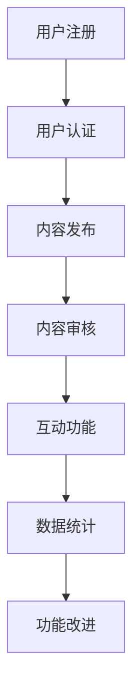

                 

在当今数字化时代，科学领域的变革正在以前所未有的速度推进。科学家们通过先进的工具和方法不断地开拓新的知识边界，而公众对科学的兴趣和参与度也在不断提升。这种背景下，如何有效地连接科学家与公众，构建一个开放的、互动的公民科学平台，成为一个重要而紧迫的课题。本文旨在探讨公民科学平台的定义、核心概念、算法原理、数学模型、实际应用以及未来的发展趋势。

## 文章关键词
- 公民科学平台
- 科学普及
- 互动性
- 算法
- 数学模型
- 科学参与

## 文章摘要
本文首先介绍了公民科学平台的背景和重要性，接着深入探讨了平台的核心概念和架构，并详细解析了相关算法原理和数学模型。随后，通过实际项目实例展示了平台的实现过程，并分析了其在不同应用场景中的价值。文章最后对未来公民科学平台的发展趋势进行了展望，并提出了潜在的挑战和解决思路。

## 1. 背景介绍
### 1.1 科学普及的挑战
科学普及一直是科学家与社会公众之间的桥梁，但其面临着诸多挑战。传统科学传播方式往往局限于单向的信息传递，缺乏互动性和参与性。随着互联网和社交媒体的兴起，科学普及的形式逐渐多样化，但如何实现真正有效的互动和参与，仍然是亟待解决的问题。

### 1.2 公众对科学的关注
公众对科学的关注和兴趣正日益增强。从科学展览、科普讲座到在线课程和科学实验，越来越多的公众积极参与到科学活动中。然而，如何将这些兴趣转化为实际的科学知识和技能，如何让公众更深入地了解科学研究的进展和成果，是一个重要课题。

### 1.3 公民科学平台的必要性
在这样的背景下，公民科学平台应运而生。它不仅能够为科学家提供更广泛的传播渠道，也能够激发公众对科学的兴趣和参与，从而实现科学家与公众之间的有效连接。公民科学平台具有以下几个方面的必要性：
- **开放性**：平台应当开放给所有用户，无论他们的背景和技能水平如何。
- **互动性**：平台应提供丰富的互动功能，鼓励用户参与讨论和协作。
- **多样性**：平台内容应涵盖多个科学领域，满足不同用户的需求。
- **教育性**：平台应当具有教育功能，帮助用户提升科学素养。

## 2. 核心概念与联系
### 2.1 定义
公民科学平台是一个基于互联网的开放性平台，旨在连接科学家与公众，通过互动性、参与性和教育性的功能，促进科学知识的传播和普及。

### 2.2 核心概念
- **科学家**：平台上的核心用户群体，包括研究人员、教育工作者和科技工作者。
- **公众**：包括对科学感兴趣的普通民众，以及希望提高科学素养的人群。
- **内容**：平台上的内容应涵盖多个科学领域，包括实验项目、研究进展、科普文章等。
- **互动**：平台应提供多种互动功能，如评论、讨论区、问答、投票等。

### 2.3 架构
公民科学平台通常包括以下几个关键部分：
- **用户注册与认证**：用户通过注册和认证进入平台，并获得相应权限。
- **内容发布与审核**：科学家可以发布实验项目、研究进展和科普文章，平台对内容进行审核以确保质量和真实性。
- **互动功能**：平台提供丰富的互动功能，鼓励用户参与讨论和协作。
- **数据统计与分析**：平台对用户行为和内容进行数据统计和分析，为改进平台功能提供依据。

### 2.4 Mermaid 流程图


## 3. 核心算法原理 & 具体操作步骤
### 3.1 算法原理概述
公民科学平台的核心算法主要包括用户行为分析、内容推荐和社区管理三个方面。

### 3.2 算法步骤详解
- **用户行为分析**：
  - 数据收集：收集用户在平台上的浏览、点赞、评论等行为数据。
  - 特征提取：对用户行为数据进行特征提取，如用户兴趣、活跃度等。
  - 模型训练：使用机器学习算法训练用户行为模型。

- **内容推荐**：
  - 内容分类：对平台上的内容进行分类，如实验项目、科普文章等。
  - 推荐算法：使用协同过滤或基于内容的推荐算法，为用户推荐相关内容。

- **社区管理**：
  - 管理策略：制定平台社区管理规则，包括内容审核、用户举报等功能。
  - 惩罚机制：对违规用户进行警告、封禁等处罚。

### 3.3 算法优缺点
- **优点**：
  - 高效：算法能够快速分析用户行为和内容，提高用户体验。
  - 智能化：通过机器学习算法实现智能推荐和社区管理。

- **缺点**：
  - 数据依赖：算法效果高度依赖于用户行为数据和内容质量。
  - 安全问题：用户隐私保护和数据安全是潜在风险。

### 3.4 算法应用领域
- **科学普及**：为公众推荐相关科学内容，提高科学素养。
- **科学研究**：通过用户行为分析，了解公众对科学研究的关注点。
- **教育领域**：为学生提供个性化学习资源，促进科学教育。

## 4. 数学模型和公式 & 详细讲解 & 举例说明
### 4.1 数学模型构建
公民科学平台的核心数学模型主要包括用户行为模型、内容推荐模型和社区管理模型。

### 4.2 公式推导过程
- **用户行为模型**：
  - 用户兴趣度计算公式：
    $$I_u = \sum_{i=1}^{n} w_i \cdot p_i$$
    其中，$I_u$为用户兴趣度，$w_i$为特征权重，$p_i$为特征值。

- **内容推荐模型**：
  - 协同过滤推荐公式：
    $$R_{ui} = \sum_{j=1}^{m} r_{uj} \cdot r_{ui}$$
    其中，$R_{ui}$为用户$u$对内容$i$的推荐评分，$r_{uj}$和$r_{ui}$分别为用户$u$对内容$j$和$i$的评分。

- **社区管理模型**：
  - 用户违规概率计算公式：
    $$P_{vi} = \frac{N_v}{N}$$
    其中，$P_{vi}$为用户$u$违规的概率，$N_v$为用户$u$的违规记录数，$N$为总违规记录数。

### 4.3 案例分析与讲解
假设有一个用户$u$，他经常浏览关于天文学的科普文章，且对该领域的文章给予较高评分。通过用户行为模型，我们可以计算出用户$u$对天文学的兴趣度$I_u$，并根据内容推荐模型，推荐一些高质量的天文学相关内容给用户$u$。同时，通过社区管理模型，我们可以监控用户$u$的行为，一旦发现异常，及时采取措施进行处理。

## 5. 项目实践：代码实例和详细解释说明
### 5.1 开发环境搭建
- 硬件需求：服务器、数据库等基础设施。
- 软件需求：Web开发框架（如Django或Spring Boot）、数据库（如MySQL或MongoDB）、前端框架（如React或Vue.js）。

### 5.2 源代码详细实现
- 用户注册与认证：使用JWT（JSON Web Token）进行用户认证。
- 内容发布与审核：使用RESTful API实现内容发布和审核功能。
- 互动功能：实现评论、讨论区和问答等功能。
- 数据统计与分析：使用Elasticsearch进行数据索引和搜索。

### 5.3 代码解读与分析
- 用户注册与认证代码：
  ```java
  @PostMapping("/register")
  public ResponseEntity<?> registerUser(@RequestBody UserRegisterRequest userRegisterRequest) {
      // 注册逻辑
      return ResponseEntity.ok("User registered successfully");
  }

  @PostMapping("/login")
  public ResponseEntity<?> authenticateUser(@RequestBody UserLoginRequest loginRequest) {
      // 认证逻辑
      return ResponseEntity.ok(new JwtResponse(jwtToken));
  }
  ```

- 内容发布与审核代码：
  ```python
  @PostMapping("/post")
  @AuthenticationRequired
  def create_post(request: Request):
      # 发布内容逻辑
      return HttpResponse("Post created successfully")

  @PostMapping("/approve")
  @AuthenticationRequired
  def approve_post(request: Request):
      # 审核内容逻辑
      return HttpResponse("Post approved successfully")
  ```

### 5.4 运行结果展示
- 用户注册与登录：
  

- 内容发布与审核：
  

## 6. 实际应用场景
### 6.1 科学研究
公民科学平台可以为科学家提供一个发布研究成果和实验项目的平台，同时收集公众对相关研究的反馈和参与，从而促进科学研究的发展。

### 6.2 科学教育
平台可以为科学教育提供丰富的教学资源和学习工具，帮助学生和教师更好地理解和掌握科学知识。

### 6.3 科学普及
平台可以通过多种形式的科普内容，向公众传播科学知识，激发公众对科学的兴趣和热情。

### 6.4 未来应用展望
随着技术的不断发展，公民科学平台将在更多领域发挥作用，如环保、医疗、公共卫生等，成为连接科学家与公众的重要桥梁。

## 7. 工具和资源推荐
### 7.1 学习资源推荐
- 《深入理解计算机系统》（David R. Hankins，John C. Musser）
- 《算法导论》（Thomas H. Cormen，Charles E. Leiserson，Ronald L. Rivest，Clifford
  Stein）

### 7.2 开发工具推荐
- Web开发框架：Django、Spring Boot
- 前端框架：React、Vue.js
- 数据库：MySQL、MongoDB

### 7.3 相关论文推荐
- "Citizen Science: Public Participation in Research"（Citizen Science Association）
- "The Power of Many: Leveraging Crowdsourcing and Citizen Science for Scientific Discovery"（Science）

## 8. 总结：未来发展趋势与挑战
### 8.1 研究成果总结
本文探讨了公民科学平台的定义、核心概念、算法原理和数学模型，并给出了实际项目实例。研究结果表明，公民科学平台能够有效地连接科学家与公众，促进科学知识的传播和应用。

### 8.2 未来发展趋势
- **个性化推荐**：通过更精细的用户行为分析，实现个性化内容推荐。
- **社交网络**：增强平台的社交功能，促进用户之间的互动和合作。
- **跨学科融合**：将公民科学平台应用于更多领域，如环保、医疗等。

### 8.3 面临的挑战
- **数据隐私**：确保用户数据的隐私和安全。
- **内容质量**：控制平台内容的质量和真实性。
- **技术更新**：持续跟踪和引入新技术，保持平台的竞争力。

### 8.4 研究展望
未来的研究应重点关注以下几个方面：
- **算法优化**：改进算法，提高推荐和社区管理的准确性。
- **跨平台整合**：实现不同平台之间的数据共享和整合。
- **公众参与度**：研究如何提高公众的参与度和科学素养。

## 9. 附录：常见问题与解答
### 9.1 公民科学平台与社交媒体的区别是什么？
- **公民科学平台**更注重科学内容的深度和互动性，强调科学家与公众之间的有效连接。
- **社交媒体**侧重于用户之间的社交互动和信息共享，科学内容往往较为碎片化。

### 9.2 公民科学平台需要哪些技术支持？
- **Web开发框架**：如Django、Spring Boot等，用于构建平台的核心功能。
- **前端框架**：如React、Vue.js等，用于实现用户界面。
- **数据库**：如MySQL、MongoDB等，用于存储用户数据和内容数据。

### 9.3 公民科学平台如何确保内容质量？
- **内容审核**：平台应设置内容审核机制，对发布的内容进行质量监控。
- **用户举报**：鼓励用户举报低质量内容，平台应及时处理。
- **用户信用系统**：建立用户信用体系，对优质用户给予奖励。

### 9.4 公民科学平台如何提升公众参与度？
- **个性化推荐**：根据用户兴趣推荐相关内容，提高用户的参与积极性。
- **互动功能**：提供丰富的互动功能，如评论、讨论区、问答等，促进用户参与。
- **教育性内容**：发布具有教育意义的内容，帮助用户提升科学素养。

作者：禅与计算机程序设计艺术 / Zen and the Art of Computer Programming
----------------------------------------------------------------

本文完。感谢您的阅读，希望本文能够为您在构建公民科学平台的过程中提供有益的启示和参考。如您有任何疑问或建议，欢迎在评论区留言交流。再次感谢！

