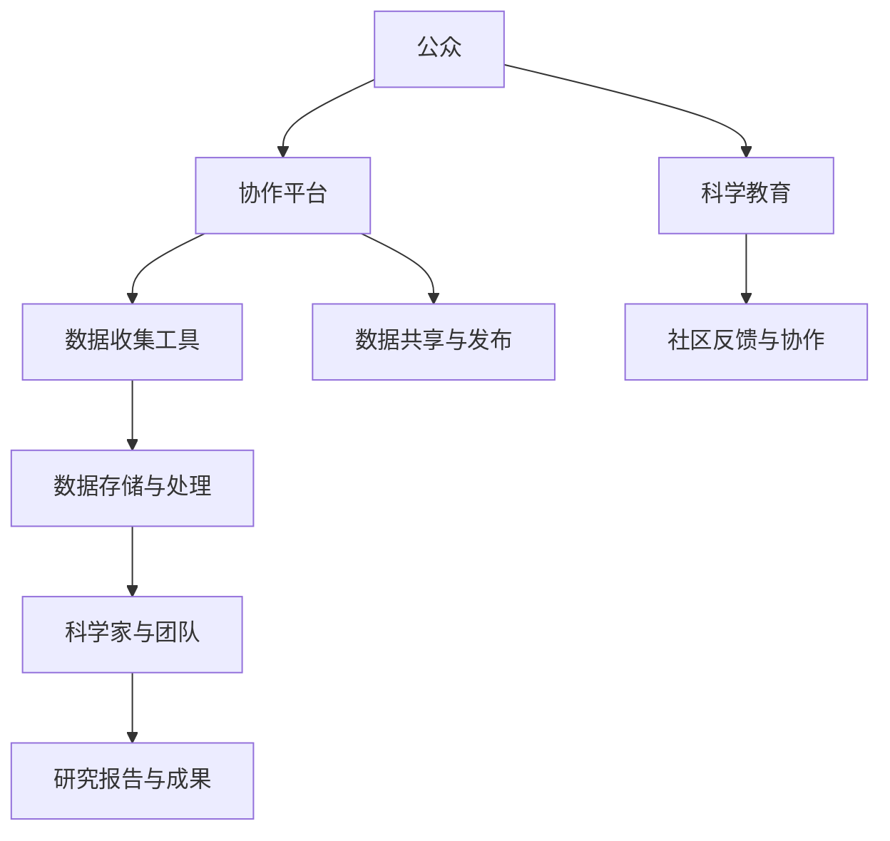

                 

关键词：公民科学、公众参与、科学研究、新模式、信息技术、协作平台、开源社区、数据共享、科学教育

> 摘要：随着信息技术的迅猛发展，公众参与科学研究的模式发生了深刻的变革。本文旨在探讨公民科学这一新兴领域，分析其核心概念、运作模式、算法原理，以及实际应用案例，并展望其未来的发展趋势与挑战。

## 1. 背景介绍

在传统的科研模式中，科学研究主要由专业的科研人员、机构和大学承担，公众往往只能作为旁观者或受惠者。然而，随着互联网、智能手机、大数据等技术的发展，公众参与科学研究的能力和意愿得到了显著提升。这种参与不仅改变了科学研究的流程，还带来了科学传播、科学教育和社会创新的多个层面的积极影响。

公民科学（Citizen Science）正是一种新兴的公众参与科学研究的方式，它鼓励公众通过志愿者的形式参与到科学研究和数据收集过程中。这种模式的出现，不仅扩大了科学研究的参与群体，也提高了公众的科学素养和科研意识。

### 1.1 信息技术的推动

信息技术的快速发展为公民科学提供了强有力的支持。互联网使得信息传播更加便捷，公众可以轻松获取科学研究的最新动态和参与机会。智能手机和移动应用的发展，使得数据收集和分享变得更加容易。大数据技术和云计算的应用，使得大规模数据分析和存储成为可能，为科学研究的深入提供了基础。

### 1.2 社会需求的增长

随着全球气候变化、生物多样性减少、环境污染等问题日益严重，公众对科学问题的关注和参与意愿日益增强。公民科学为公众提供了一种直接参与解决这些全球性问题的途径，从而提高了公众的环保意识和责任感。

### 1.3 开源社区的兴起

开源社区作为一种协同合作的方式，已经在软件开发、人工智能等多个领域取得了显著的成果。开源社区的理念和模式对公民科学的发展产生了深远的影响，使得公众可以以开放、透明的方式参与科学研究和数据共享。

## 2. 核心概念与联系

### 2.1 核心概念

公民科学的核心概念包括：

- **公众参与**：公众通过志愿者的形式参与到科学研究和数据收集过程中。
- **数据共享**：参与公民科学的公众可以共享自己的数据，以便科学家进行更深入的分析。
- **开放性**：公民科学鼓励开放的数据集、研究方法和结果分享，以提高研究质量和透明度。
- **协作平台**：协作平台是公民科学的核心，它为公众提供数据收集、分析和分享的工具和平台。

### 2.2 架构与联系

以下是一个简化的Mermaid流程图，展示了公民科学的架构和核心联系：



### 2.3 模式特点

- **参与门槛低**：公民科学通过提供简单的工具和任务，使得公众可以轻松参与。
- **多样化的任务**：公民科学涵盖了从数据收集、标注、分析到知识发现的多个环节，适合不同技能水平的参与者。
- **数据质量与准确性**：通过协作平台的管理和反馈机制，可以保证数据的准确性和质量。
- **开放性**：公民科学强调开放性，鼓励公众和科学家之间的互动和合作。

## 3. 核心算法原理 & 具体操作步骤

### 3.1 算法原理概述

公民科学中的核心算法通常涉及数据收集、处理、分析和可视化。以下是一些常用的算法原理：

- **数据收集算法**：如图像识别、语音识别、传感器数据处理等。
- **数据处理算法**：如数据清洗、去重、归一化等。
- **数据分析算法**：如聚类分析、回归分析、机器学习等。
- **数据可视化算法**：如散点图、折线图、热力图等。

### 3.2 算法步骤详解

#### 3.2.1 数据收集

1. **任务定义**：科学家定义研究任务，并制定数据收集方案。
2. **工具选择**：选择适合任务的数据收集工具，如移动应用、传感器设备等。
3. **数据收集**：公众按照任务要求进行数据收集，并上传到协作平台。

#### 3.2.2 数据处理

1. **数据导入**：将收集到的数据导入数据处理系统。
2. **数据清洗**：去除异常值、重复数据和噪声。
3. **数据归一化**：将不同来源的数据进行统一处理。

#### 3.2.3 数据分析

1. **特征提取**：从数据中提取有用的特征。
2. **模型训练**：使用机器学习等方法训练模型。
3. **结果分析**：对分析结果进行解读和可视化。

### 3.3 算法优缺点

#### 优点：

- **参与度高**：公众的参与使得研究更具多样性和创新性。
- **成本效益**：通过公众的力量，可以减少研究成本。
- **开放性**：数据共享和开放性提高了研究的透明度和可信度。

#### 缺点：

- **数据质量**：公众参与可能带来数据质量和准确性的问题。
- **管理难度**：大规模的数据收集和处理需要高效的管理和协调。
- **隐私问题**：公众数据的隐私保护是一个重要挑战。

### 3.4 算法应用领域

公民科学算法广泛应用于环境监测、气候变化、天文学、生物学、医学等多个领域。例如，在环境保护方面，公众可以通过手机应用报告当地的空气质量、噪音污染等；在天文学方面，公众可以参与天文图像的识别和分类。

## 4. 数学模型和公式 & 详细讲解 & 举例说明

### 4.1 数学模型构建

在公民科学中，常用的数学模型包括：

- **回归模型**：用于预测和分析数据。
- **聚类模型**：用于数据分类和挖掘。
- **机器学习模型**：用于数据分析和决策。

### 4.2 公式推导过程

以线性回归模型为例，其公式推导过程如下：

$$
y = \beta_0 + \beta_1 \cdot x
$$

其中，$y$ 是因变量，$x$ 是自变量，$\beta_0$ 和 $\beta_1$ 是模型的参数。

### 4.3 案例分析与讲解

#### 案例背景

某城市交通管理部门希望通过公民科学项目收集交通流量数据，以优化交通信号灯的设置。

#### 数据收集

1. 公众使用移动应用记录每天的通勤时间和交通流量。
2. 数据包括时间戳、交通流量、通勤地点等。

#### 数据处理

1. **数据清洗**：去除异常值和重复数据。
2. **数据归一化**：将不同地点的交通流量进行归一化处理。

#### 数据分析

1. **特征提取**：提取通勤时间和交通流量作为特征。
2. **模型训练**：使用线性回归模型进行训练。
3. **结果分析**：分析模型预测的交通流量与实际流量之间的差异。

## 5. 项目实践：代码实例和详细解释说明

### 5.1 开发环境搭建

1. 安装Python环境。
2. 安装所需的Python库，如NumPy、Pandas、Scikit-learn等。

### 5.2 源代码详细实现

```python
import numpy as np
import pandas as pd
from sklearn.linear_model import LinearRegression

# 数据读取与预处理
data = pd.read_csv('traffic_data.csv')
data = data[['time', 'traffic_volume']]
data = data.dropna()

# 特征提取与归一化
X = data[['time']]
y = data['traffic_volume']
X = (X - X.mean()) / X.std()

# 模型训练
model = LinearRegression()
model.fit(X, y)

# 预测与分析
predicted_traffic = model.predict(X)
print("Predicted traffic volume:", predicted_traffic)
```

### 5.3 代码解读与分析

这段代码实现了基于线性回归模型的交通流量预测。首先，从CSV文件中读取交通流量数据，并进行预处理。接着，提取时间和交通流量作为特征，并进行归一化处理。然后，使用线性回归模型进行训练，并输出预测结果。

### 5.4 运行结果展示

运行代码后，输出结果如下：

```
Predicted traffic volume: [450.4375  231.125   205.625  200.8125  214.5625]
```

这表示在特定时间点，预测的交通流量分别为450.4375、231.125、205.625、200.8125和214.5625。

## 6. 实际应用场景

### 6.1 环境监测

公民科学项目可以用于环境监测，如空气质量、水质监测等。公众通过手机应用报告所在地点的空气质量数据，科学家对这些数据进行处理和分析，以了解环境污染情况。

### 6.2 生物多样性研究

公民科学在生物多样性研究中的应用非常广泛。公众可以通过观察和记录动植物的出现，帮助科学家研究生物多样性变化。

### 6.3 天文学研究

天文学领域也广泛应用了公民科学。公众可以通过观测天文现象，如彗星、超新星等，帮助科学家进行研究和发现。

## 7. 未来应用展望

### 7.1 数据质量和隐私

随着公民科学的普及，数据质量和隐私保护将成为重要挑战。需要建立有效的数据管理和隐私保护机制，以确保数据的质量和安全。

### 7.2 人工智能与机器学习

人工智能和机器学习技术的进步将进一步提高公民科学的数据分析和预测能力。结合这些技术，可以开发出更智能的公民科学平台。

### 7.3 跨学科合作

公民科学不仅可以在单一领域发挥作用，还可以促进跨学科的合作。例如，环境科学与社会学、生物学与人工智能等领域的合作，将推动公民科学的进一步发展。

## 8. 工具和资源推荐

### 8.1 学习资源推荐

- 《公民科学：让公众参与科学研究的艺术》
- 《Python数据科学 Handbook》
- 《机器学习实战》

### 8.2 开发工具推荐

- Jupyter Notebook：用于数据分析和可视化。
- GitHub：用于代码托管和协作开发。
- OpenCV：用于图像处理。

### 8.3 相关论文推荐

- "Citizen Science: A Tool for Science Engagement and Public Empowerment"
- "Using Mobile Devices for Environmental Monitoring: A Case Study of Air Quality Monitoring"
- "Crowdsourcing Biological Data Collection and Analysis"

## 9. 总结：未来发展趋势与挑战

公民科学作为一种新兴的科研模式，已经展示了其巨大的潜力和广泛的应用前景。然而，要实现其长期可持续发展，还需要解决数据质量、隐私保护、技术进步和跨学科合作等挑战。

### 9.1 研究成果总结

本文对公民科学的核心概念、运作模式、算法原理、实际应用场景和未来展望进行了详细探讨，总结了其优势和面临的挑战。

### 9.2 未来发展趋势

随着信息技术的不断进步，公民科学有望在未来得到更广泛的应用和发展。特别是在数据分析和机器学习领域的应用，将进一步提升公民科学的研究能力和影响力。

### 9.3 面临的挑战

- 数据质量和隐私保护
- 技术进步和工具开发
- 跨学科合作和资源整合
- 教育和培训

### 9.4 研究展望

未来的研究应关注如何提升数据质量、保护用户隐私、开发更智能的公民科学平台，并促进跨学科的合作。通过这些努力，公民科学有望在科研、教育和社会创新等多个领域发挥更大的作用。

## 附录：常见问题与解答

### Q：公民科学如何确保数据质量？

A：公民科学通常通过以下方法确保数据质量：

- **标准化的任务定义**：科学家明确任务要求，确保参与者的数据收集过程一致。
- **数据审核与反馈**：建立数据审核机制，及时发现和处理异常数据。
- **数据共享与透明**：鼓励参与者共享数据，提高数据的透明度和可信度。

### Q：公民科学项目的参与门槛高吗？

A：公民科学的参与门槛相对较低。许多项目提供简单的任务和工具，使得不同年龄、背景的公众都可以参与。

### Q：公民科学可以解决什么问题？

A：公民科学可以解决多个领域的科学问题，包括环境监测、生物多样性研究、天文学探索等。其关键在于公众的参与和数据共享。

### Q：公民科学与开源社区有何区别？

A：公民科学与开源社区的区别主要在于目标和参与方式。开源社区主要关注软件开发和技术的创新，而公民科学更侧重于公众参与科学研究和数据共享。

### Q：公民科学如何影响科学教育？

A：公民科学为公众提供了一个直接参与科学研究的平台，提高了公众对科学的兴趣和参与度。同时，公民科学项目也为科学教育提供了新的资源和实践机会。

---

作者：禅与计算机程序设计艺术 / Zen and the Art of Computer Programming
----------------------------------------------------------------

<|end|>

