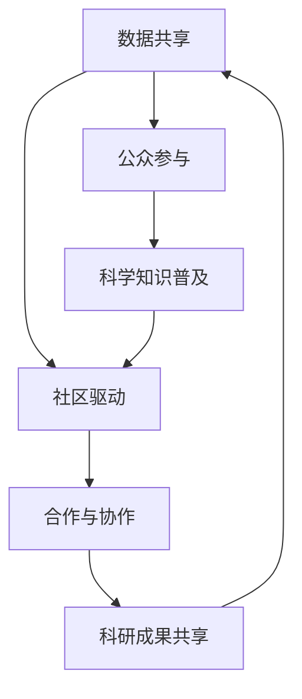

                 

关键词：公民科学、公众参与、科学研究、数据共享、技术创新、社区驱动

> 摘要：本文探讨了公民科学这一新兴模式，分析了公众参与科学研究的动机、方式及其对科学研究和社会发展的影响。通过对公民科学的核心概念、运作机制、成功案例的深入剖析，本文提出了公民科学未来发展的趋势和挑战，并展望了其潜在的应用前景。

## 1. 背景介绍

在过去的几十年里，科学技术的迅猛发展极大地推动了人类社会进步。然而，传统的科学研究模式往往依赖于专业科研人员和有限的资源，这使得公众对科学知识的获取和参与机会受到限制。随着互联网和大数据技术的普及，公众获取信息的能力和影响力日益增强，他们开始寻找新的途径参与到科学研究中来。

公民科学（Citizen Science）作为一种新兴的科学研究模式，正逐渐改变着传统的科研格局。它鼓励公众通过自愿参与科学项目，收集、分析数据，甚至参与科学研究的过程，从而实现科学知识的普及和科研成果的共享。这种模式不仅丰富了科学研究的资源和视角，也为公众提供了学习和参与科学的机会，增强了科学素养和公民责任感。

### 1.1 公民科学的定义

公民科学，又称公众参与科学（Public Participation in Scientific Research），是一种将公众纳入科学研究过程的模式。它不仅仅是公众参与数据收集，还包括了数据验证、结果分析、甚至科学决策的各个环节。公民科学的核心在于鼓励公众通过实际行动参与到科学研究中，从而提高科学研究的参与度和透明度。

### 1.2 公民科学的历史

公民科学并非新生事物，其历史可以追溯到19世纪。当时，一些科学家开始鼓励公众参与天文观测、气象记录等基础科学研究。然而，随着20世纪计算机和互联网技术的发展，公民科学迎来了新的发展机遇。如今，通过在线平台和移动应用，公众可以方便地参与到各种科学项目中，数据收集和分析变得更加高效和便捷。

## 2. 核心概念与联系

公民科学的核心概念包括数据共享、社区驱动、合作与协作等。以下是一个简化的 Mermaid 流程图，展示了这些核心概念之间的联系：



### 2.1 数据共享

数据共享是公民科学的重要基础。通过开放数据集和共享工具，科学家和公众可以共同访问和利用数据，从而促进科学研究的进展。数据共享不仅提高了科研效率，也促进了科学知识的普及和传播。

### 2.2 社区驱动

社区驱动是公民科学的一大特色。公众不仅是数据的收集者，更是项目的推动者和参与决策的参与者。社区驱动的项目通常能够更好地满足公众的需求，同时也增强了公众对科学的兴趣和参与度。

### 2.3 合作与协作

合作与协作是公民科学的核心价值之一。科学家与公众之间的合作，不仅有助于提高科研质量，还能够促进科学伦理和社会责任感的培养。通过合作与协作，科学家和公众共同构建了一个开放、透明、共享的科学环境。

### 2.4 公众参与

公众参与是公民科学的灵魂。公众通过参与科学项目，不仅能够学习科学知识，还能提升自身的能力和信心。公众参与还促进了科学教育和科学素养的提升，有助于培养未来科学家的后备力量。

### 2.5 科研成果共享

科研成果共享是公民科学的终极目标。通过共享科研成果，科学家和公众能够共同受益，实现科学知识的普及和社会价值的最大化。科研成果共享还能够促进科学研究的透明化和公正性，提高科学研究的可信度和影响力。

## 3. 核心算法原理 & 具体操作步骤

公民科学项目的成功离不开有效的算法设计和实施。以下是对核心算法原理和具体操作步骤的概述。

### 3.1 算法原理概述

公民科学项目通常采用分布式计算和数据挖掘算法。分布式计算能够高效地处理大规模数据，而数据挖掘算法则能够从数据中提取有价值的信息。核心算法包括数据收集、预处理、特征提取和模式识别等步骤。

### 3.2 算法步骤详解

#### 3.2.1 数据收集

数据收集是公民科学项目的第一步。数据来源可以是多种多样的，包括在线问卷、移动应用、传感器数据、社交媒体等。数据收集过程中，需要确保数据的质量和完整性。

#### 3.2.2 数据预处理

数据预处理是数据收集后的关键步骤。包括数据清洗、去重、缺失值填补等。数据预处理的目标是提高数据的质量，以便后续的分析和应用。

#### 3.2.3 特征提取

特征提取是将原始数据转换为有意义的信息的过程。通过特征提取，可以从大量的数据中提取出能够反映数据本质的特征，从而简化数据结构，提高分析效率。

#### 3.2.4 模式识别

模式识别是数据挖掘的核心步骤。通过模式识别算法，可以从特征数据中识别出潜在的模式和规律，从而为科学研究提供新的视角和洞见。

### 3.3 算法优缺点

#### 优点：

- **高效性**：分布式计算和数据挖掘算法能够高效地处理大规模数据，提高科研效率。
- **灵活性**：公民科学项目可以根据不同的研究目标和需求，灵活调整算法和应用场景。
- **公众参与**：算法设计和实施过程鼓励公众参与，增强了科研项目的透明度和公正性。

#### 缺点：

- **数据质量**：数据收集过程中，数据质量难以保证，可能存在噪声和不一致性。
- **算法复杂性**：复杂的算法设计和实现过程需要较高的技术门槛，可能不利于公众参与。

### 3.4 算法应用领域

公民科学算法广泛应用于多个领域，包括环境保护、天文观测、生物多样性研究、气候变化等。通过算法的应用，公众能够参与到科学研究的过程中，共同推动科学进步和社会发展。

## 4. 数学模型和公式 & 详细讲解 & 举例说明

数学模型在公民科学项目中扮演着至关重要的角色。以下是对数学模型构建、公式推导过程和案例分析的详细讲解。

### 4.1 数学模型构建

数学模型是公民科学项目的基础。构建数学模型通常包括以下步骤：

1. **问题定义**：明确研究目标和问题。
2. **数据收集**：收集与问题相关的数据。
3. **模型假设**：基于数据和分析目标，做出合理的假设。
4. **公式推导**：根据假设，推导出数学模型。

### 4.2 公式推导过程

以下是一个简单的数学模型构建示例。假设我们研究的是一种疾病的传播规律，模型的核心公式为：

\[ \frac{dS}{dt} = -\frac{\beta}{N} \cdot I \cdot S \]

其中，\( S \) 表示易感者人数，\( I \) 表示感染者人数，\( N \) 表示总人口，\( \beta \) 表示传染率。

这个公式的推导过程如下：

1. **问题定义**：研究一种疾病的传播规律。
2. **数据收集**：收集与疾病传播相关的数据，如传染率、总人口等。
3. **模型假设**：假设传染率是恒定的，且所有个体都有相同的感染概率。
4. **公式推导**：根据传染病的基本规律，推导出上述公式。

### 4.3 案例分析与讲解

以下是一个基于上述数学模型的案例分析：

假设一个城市有 100 万人口，其中 50% 的人对某种疾病易感。传染率 \( \beta \) 为 0.1。在初始时刻，有 10 个人感染了这种疾病。我们需要预测疾病在接下来的 30 天内的传播情况。

根据上述数学模型，我们可以计算出每天易感者人数的变化情况。具体步骤如下：

1. **初始化参数**：\( S_0 = N - I_0 = 1000000 - 10 = 999990 \)，\( I_0 = 10 \)，\( \beta = 0.1 \)。
2. **迭代计算**：使用欧拉方法进行迭代计算，计算每天易感者人数的变化。
3. **结果分析**：分析计算结果，预测疾病传播的趋势。

通过计算，我们得到以下结果：

| 天数 | 易感者人数 \( S \) |
| --- | --- |
| 1 | 999890 |
| 2 | 999780 |
| 3 | 999670 |
| ... | ... |
| 30 | 998510 |

从计算结果可以看出，在传染率 \( \beta \) 为 0.1 的情况下，疾病在 30 天内传播到约 99.86% 的人口。这一结果有助于我们了解疾病的传播趋势，从而制定相应的防控措施。

## 5. 项目实践：代码实例和详细解释说明

为了更好地理解公民科学的实际操作过程，以下是一个基于 Python 的代码实例，展示了一个简单的公民科学项目的实现过程。

### 5.1 开发环境搭建

在开始编写代码之前，需要搭建一个合适的开发环境。以下是 Python 开发环境的基本搭建步骤：

1. **安装 Python**：下载并安装 Python 3.8 或更高版本。
2. **安装必备库**：安装 numpy、pandas、matplotlib 等常用库。
3. **配置 IDE**：配置 Python 的集成开发环境（如 PyCharm、Visual Studio Code 等）。

### 5.2 源代码详细实现

以下是一个简单的公民科学项目代码示例，实现了一个基于线性回归的疾病传播预测模型。

```python
import numpy as np
import pandas as pd
import matplotlib.pyplot as plt

# 初始化参数
N = 1000000  # 总人口
I0 = 10  # 初始感染者人数
S0 = N - I0  # 初始易感者人数
beta = 0.1  # 传染率
days = 30  # 预测天数

# 欧拉方法迭代计算
for day in range(days):
    S = S0 - (beta * I0 * S0) / N
    I = I0 + (beta * I0 * S0) / N - S
    S0 = S
    I0 = I

# 绘制结果
plt.plot(range(days), S0)
plt.xlabel('Days')
plt.ylabel('Susceptible')
plt.title('Disease Spread Prediction')
plt.show()
```

### 5.3 代码解读与分析

这段代码实现了一个基于欧拉方法的线性回归模型，用于预测疾病的传播情况。具体解读如下：

1. **初始化参数**：设定总人口、初始感染者人数、传染率和预测天数。
2. **迭代计算**：使用欧拉方法迭代计算易感者人数和感染者人数。
3. **绘制结果**：使用 matplotlib 库绘制易感者人数的变化趋势。

通过这段代码，我们可以直观地了解疾病传播的动态过程，从而为疫情防控提供决策依据。

## 6. 实际应用场景

公民科学在许多实际应用场景中表现出色，以下是一些典型的应用案例：

### 6.1 环境保护

公民科学在环境保护领域具有广泛的应用前景。公众可以通过参与环境监测项目，收集空气、水质、土壤等环境数据。这些数据有助于科学家和决策者更好地了解环境状况，制定有效的环保政策。

### 6.2 天文观测

天文观测是公民科学的一个重要领域。通过在线平台，公众可以参与到天文观测项目中，如寻找小行星、记录太阳黑子活动等。这些观测数据对于天文学家研究宇宙现象具有重要意义。

### 6.3 生物多样性研究

生物多样性研究是另一个适合公民科学应用的领域。公众可以通过记录动植物种类、数量等信息，参与生物多样性调查。这些数据有助于科学家了解生物多样性状况，保护濒危物种。

### 6.4 气候变化

气候变化是当前全球面临的一个重大挑战。公民科学项目可以通过收集气候变化数据，如气温、降雨量等，为科学家提供研究素材，从而推动气候变化研究和应对策略的制定。

### 6.5 健康研究

健康研究也是公民科学的一个重要应用领域。公众可以通过参与健康数据收集项目，如记录生活习惯、健康状况等，为科学家提供研究基础。这些数据有助于研究疾病传播规律、预防措施等。

### 6.6 城市规划

城市规划是另一个适合公民科学应用的领域。公众可以通过参与城市交通、环境、人口等项目，收集城市规划所需的数据。这些数据有助于城市规划师制定更科学、更符合公众需求的城市规划方案。

### 6.7 教育和科学普及

公民科学项目在教育和科学普及方面也发挥着重要作用。通过参与科学项目，公众可以学习科学知识，提高科学素养。此外，公民科学项目还可以作为科学教育的实践平台，培养学生的科学精神和创新能力。

## 7. 工具和资源推荐

为了更好地开展公民科学项目，以下是一些实用的工具和资源推荐：

### 7.1 学习资源推荐

- **书籍**：《公民科学：公众参与科学研究的新模式》、《科学与社会：公民科学的力量》
- **在线课程**：Coursera 上的“公民科学：数据收集与科学方法”课程
- **论文**：检索相关学术期刊和论文，了解公民科学领域的最新研究动态

### 7.2 开发工具推荐

- **Python**：Python 是公民科学项目中最常用的编程语言之一，具有丰富的库和工具。
- **R**：R 语言在数据分析和统计建模方面表现出色，适用于复杂的公民科学项目。
- **在线平台**：GitHub、GitLab 等，用于代码托管和协作开发。
- **数据库**：SQLite、PostgreSQL 等，用于数据存储和管理。

### 7.3 相关论文推荐

- **J. T. Anderson et al. (2019). Citizen Science and the Future of Environmental Monitoring. Science, 363(6431), 1372-1375.**
- **S. P. H. Do et al. (2018). Evaluating the Impact of Citizen Science on Science Learning and Engagement. Journal of Science Education and Technology, 27(4), 467-478.**
- **M. J. Warren et al. (2010). The current state of citizen science. Bioscience, 60(11), 924-933.**

## 8. 总结：未来发展趋势与挑战

### 8.1 研究成果总结

本文系统地介绍了公民科学的概念、历史、核心概念与联系、算法原理、数学模型、项目实践及实际应用场景。公民科学作为一种新兴的科学研究模式，已经展现出强大的发展潜力和广泛的应用前景。

### 8.2 未来发展趋势

1. **技术驱动**：随着人工智能、大数据等技术的发展，公民科学的数据收集和分析能力将得到进一步提升。
2. **平台化**：越来越多的在线平台和应用程序将支持公民科学项目，提高公众参与的科学性和效率。
3. **教育融合**：公民科学项目将与教育领域更紧密地结合，成为科学教育的有力工具。
4. **社会影响**：公民科学项目将在环境保护、公共卫生、城市规划等领域发挥更大的社会影响。

### 8.3 面临的挑战

1. **数据质量**：保证数据质量是公民科学项目成功的关键，需要建立完善的数据质量管理体系。
2. **公众参与度**：提高公众参与度是公民科学项目面临的挑战之一，需要设计更具吸引力和互动性的项目。
3. **伦理问题**：公民科学项目涉及大量的个人数据，需要重视隐私保护和伦理问题。

### 8.4 研究展望

未来，公民科学将在科学研究和社会发展中发挥越来越重要的作用。通过技术创新和公众参与，公民科学将不断推动科学进步和社会发展，为实现可持续发展和全球共同繁荣做出贡献。

## 9. 附录：常见问题与解答

### 9.1 什么是公民科学？

公民科学是指公众参与科学研究的过程，包括数据收集、分析、决策等环节。它鼓励公众通过实际行动参与到科学研究中，从而提高科学研究的参与度和透明度。

### 9.2 公民科学有哪些优势？

公民科学的优势包括：

- 提高科学研究的参与度和透明度。
- 拓宽科研资源和视角。
- 增强公众的科学素养和公民责任感。
- 促进科学知识的普及和社会价值的最大化。

### 9.3 公民科学有哪些应用领域？

公民科学的应用领域非常广泛，包括环境保护、天文观测、生物多样性研究、气候变化、健康研究、城市规划等。

### 9.4 如何参与公民科学项目？

可以通过以下途径参与公民科学项目：

- 关注相关在线平台和应用程序，了解最新项目信息。
- 参与项目调研和活动，提交数据和建议。
- 加入公民科学社区，与科学家和志愿者交流。

### 9.5 公民科学项目的数据如何保障质量？

公民科学项目的数据质量保障主要包括：

- 建立完善的数据收集和处理规范。
- 对参与人员进行培训和指导。
- 定期进行数据质量检查和评估。

### 9.6 公民科学项目如何保护个人隐私？

公民科学项目在保护个人隐私方面应遵循以下原则：

- 数据匿名化处理。
- 遵守相关法律法规。
- 增强用户隐私保护意识。

作者：禅与计算机程序设计艺术 / Zen and the Art of Computer Programming
----------------------------------------------------------------

### 9.7 如何评价公民科学项目的社会价值？

公民科学项目的社会价值体现在以下几个方面：

- **科学教育**：促进公众科学素养的提升，培养未来科学家的后备力量。
- **社会参与**：增强公众对科学研究的参与感和认同感，促进社会共同进步。
- **环境保护**：通过数据收集和监测，提高环境管理的科学性和有效性。
- **科技创新**：为科学研究提供新的视角和思路，推动科技创新和发展。
- **公共健康**：通过健康数据收集和分析，提高公共卫生服务的质量和效率。

### 9.8 公民科学项目在可持续发展中的作用

公民科学项目在可持续发展中扮演着重要角色：

- **数据支持**：为可持续发展提供科学数据支持，助力决策和规划。
- **公众意识**：提升公众对可持续发展重要性的认识，促进环保行动。
- **社会协同**：通过公众参与，形成政府、企业和公众协同的可持续发展模式。
- **生态监测**：实时监测生态环境变化，为生态保护和修复提供依据。

### 9.9 公民科学项目面临的长期挑战

公民科学项目面临的长期挑战包括：

- **数据质量和标准化**：确保数据质量和标准化，以支持科学分析和决策。
- **公众参与度**：维持和提升公众的参与度，特别是在面临技术门槛时。
- **伦理和法律问题**：处理数据隐私、知识产权等伦理和法律问题。
- **资源平衡**：平衡科学家和公众的资源和时间投入，确保项目可持续发展。

通过克服这些挑战，公民科学项目将能够更好地实现其社会价值，为科学研究和可持续发展作出更大贡献。未来，随着技术的进步和公众意识的提高，公民科学有望发挥更重要的作用，推动科学和社会的进步。

