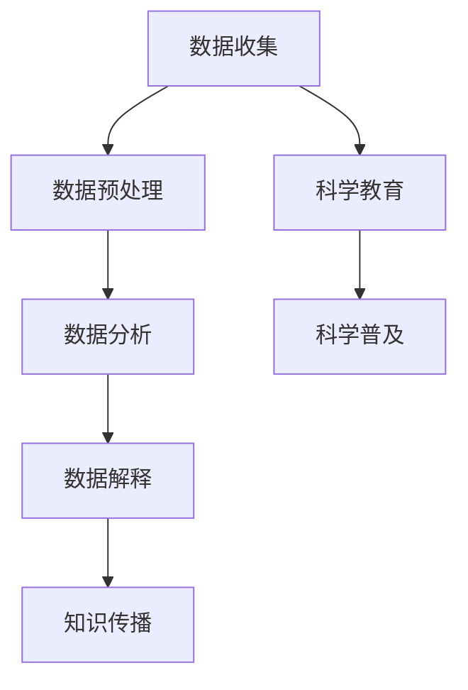

                 

关键词：公民科学，公众参与，科学研究，模式创新，技术进步

> 摘要：本文探讨了公民科学这一新兴概念及其在科学研究中的重要作用。通过对公民科学的发展背景、核心概念、运作模式、技术应用等多个维度的深入分析，本文旨在为公众参与科学研究提供新的视角和思路，并展望其未来发展前景。

## 1. 背景介绍

随着信息技术的飞速发展，人类正进入一个全新的时代——大数据时代。海量数据的产生和积累为科学研究带来了前所未有的机遇，同时也提出了新的挑战。在这种背景下，科学研究的模式也在不断演变和演进。传统的科学研究模式主要依赖于专业科学家和科研机构，其资源、设备和知识的集中性使得公众参与的机会相对有限。然而，随着互联网和移动设备的普及，公众参与科学研究的门槛大大降低，公民科学（Citizen Science）应运而生。

公民科学是一种新兴的科学研究模式，它鼓励公众积极参与科学项目的全过程，包括数据收集、分析、解释和传播等。这种模式不仅提高了科学研究的效率，也为公众提供了深入了解科学过程、培养科学素养的机会。公民科学的兴起，标志着科学研究从封闭的专业领域走向开放和互动的公众领域。

### 1.1 发展背景

1. **大数据时代**：大数据的迅猛增长为科学研究提供了丰富的数据资源，但也带来了数据处理的挑战。
2. **技术进步**：互联网和移动设备的普及，使得数据收集、处理和分析变得更加便捷。
3. **公众意识的提高**：人们对科学和社会问题的关注不断增加，愿意为科学研究贡献自己的力量。

### 1.2 发展历程

1. **早期探索**：公民科学概念最早可以追溯到20世纪80年代，主要是一些民间科学家和爱好者自发组织的项目。
2. **快速增长**：随着技术的进步和公众参与意识的提高，公民科学项目数量和规模迅速增长。
3. **成熟发展**：近年来，越来越多的科研机构和高校开始将公民科学作为科学研究的常规模式之一。

## 2. 核心概念与联系

### 2.1 定义

公民科学是指公众积极参与科学研究的一种模式，通过数据收集、分析、解释和传播等活动，实现科学知识的共享和科学素养的培养。

### 2.2 核心概念

1. **公众参与**：公民科学的核心特征之一是公众参与，这是与传统科学研究模式的重要区别。
2. **数据收集**：数据是科学研究的基础，公民科学强调数据的广泛收集和多样性。
3. **数据共享**：数据共享是公民科学的重要原则之一，有助于科学知识的传播和利用。
4. **科学素养**：公民科学不仅关注科学研究的结果，也注重培养公众的科学素养。

### 2.3 架构

以下是一个简单的Mermaid流程图，描述公民科学的基本架构：



- **A. 数据收集**：公民科学项目的第一步是收集数据，这些数据可以来自各种渠道，如观测、实验、调查等。
- **B. 数据预处理**：收集到的数据通常需要进行清洗、归一化等预处理，以便于后续分析。
- **C. 数据分析**：通过数据分析和挖掘，发现数据中的规律和趋势。
- **D. 数据解释**：对分析结果进行解释，形成科学知识。
- **E. 知识传播**：将科学知识通过多种渠道传播给公众，提高科学素养。
- **F. 科学教育**：通过教育培养公众的科学思维和素养。
- **G. 科学普及**：通过各种形式的科普活动，让公众更好地理解和接受科学知识。

## 3. 核心算法原理 & 具体操作步骤

### 3.1 算法原理概述

公民科学项目通常涉及多个核心算法，以下是一个简要的概述：

1. **数据收集算法**：用于自动化收集来自各种来源的数据。
2. **数据清洗算法**：用于去除数据中的噪声和异常值。
3. **数据分析算法**：用于挖掘数据中的规律和趋势。
4. **数据可视化算法**：用于将数据分析结果以直观的方式展示给公众。

### 3.2 算法步骤详解

以下是公民科学项目中的常见算法步骤：

#### 3.2.1 数据收集

1. **确定数据来源**：根据研究需求，选择合适的数据来源。
2. **数据采集**：使用传感器、API接口、在线调查等方式收集数据。
3. **数据存储**：将收集到的数据存储在数据库或数据仓库中。

#### 3.2.2 数据清洗

1. **数据质量评估**：评估数据的完整性、准确性和一致性。
2. **数据清洗**：去除重复数据、缺失值填充、异常值检测和修正。

#### 3.2.3 数据分析

1. **数据预处理**：对数据进行归一化、标准化等处理。
2. **特征提取**：从数据中提取有用的特征。
3. **数据分析**：使用统计方法、机器学习算法等分析数据，提取规律和趋势。

#### 3.2.4 数据可视化

1. **选择可视化工具**：根据数据分析结果选择合适的可视化工具。
2. **可视化设计**：设计直观、易懂的可视化图表。
3. **可视化展示**：将可视化图表展示给公众，帮助其理解数据分析结果。

### 3.3 算法优缺点

#### 优点

1. **高效性**：自动化算法可以高效地处理大量数据。
2. **准确性**：经过清洗和分析的数据具有较高的准确性。
3. **易用性**：公民科学项目通常面向公众，算法设计易于理解和使用。

#### 缺点

1. **数据质量**：公众参与的数据质量难以保证，可能存在噪声和异常值。
2. **算法复杂性**：对于复杂的数据分析和可视化，算法设计和实现可能相对复杂。

### 3.4 算法应用领域

公民科学算法广泛应用于多个领域：

1. **环境监测**：通过收集和分析环境数据，监测气候变化、空气质量等。
2. **生物多样性研究**：通过数据收集和分析，研究动植物的分布和迁徙。
3. **健康研究**：通过健康数据的收集和分析，研究疾病趋势和治疗方法。
4. **天文学研究**：通过天文观测数据的收集和分析，研究星系、行星等。

## 4. 数学模型和公式 & 详细讲解 & 举例说明

### 4.1 数学模型构建

在公民科学项目中，数学模型构建是数据分析的重要环节。以下是一个简单的线性回归模型的构建过程：

#### 4.1.1 模型定义

设因变量 \( Y \) 与自变量 \( X \) 之间存在线性关系，可以用线性回归模型表示为：

\[ Y = \beta_0 + \beta_1 X + \varepsilon \]

其中，\( \beta_0 \) 是截距，\( \beta_1 \) 是斜率，\( \varepsilon \) 是误差项。

#### 4.1.2 模型参数估计

通过最小二乘法（Least Squares Method）估计模型参数：

\[ \beta_0 = \bar{Y} - \beta_1 \bar{X} \]

\[ \beta_1 = \frac{\sum(X_i - \bar{X})(Y_i - \bar{Y})}{\sum(X_i - \bar{X})^2} \]

其中，\( \bar{X} \) 和 \( \bar{Y} \) 分别是自变量和因变量的平均值。

### 4.2 公式推导过程

#### 4.2.1 假设

假设我们有一组观测数据 \( (X_i, Y_i) \)，其中 \( i = 1, 2, \ldots, n \)。

#### 4.2.2 最小化误差平方和

我们的目标是最小化误差平方和（Sum of Squared Errors，SSE）：

\[ SSE = \sum_{i=1}^{n} (Y_i - (\beta_0 + \beta_1 X_i))^2 \]

#### 4.2.3 求导并求解

对 \( SSE \) 分别对 \( \beta_0 \) 和 \( \beta_1 \) 求导，并令导数为零，得到：

\[ \frac{\partial SSE}{\partial \beta_0} = -2 \sum_{i=1}^{n} (Y_i - (\beta_0 + \beta_1 X_i)) = 0 \]

\[ \frac{\partial SSE}{\partial \beta_1} = -2 \sum_{i=1}^{n} (X_i - \bar{X})(Y_i - (\beta_0 + \beta_1 X_i)) = 0 \]

解上述方程组，得到：

\[ \beta_0 = \bar{Y} - \beta_1 \bar{X} \]

\[ \beta_1 = \frac{\sum(X_i - \bar{X})(Y_i - \bar{Y})}{\sum(X_i - \bar{X})^2} \]

### 4.3 案例分析与讲解

假设我们有以下观测数据：

| X | Y |
|---|---|
| 1 | 2 |
| 2 | 4 |
| 3 | 6 |
| 4 | 8 |

我们希望构建一个线性回归模型，预测 \( Y \) 与 \( X \) 之间的关系。

#### 4.3.1 数据预处理

计算 \( \bar{X} \) 和 \( \bar{Y} \)：

\[ \bar{X} = \frac{1 + 2 + 3 + 4}{4} = 2.5 \]

\[ \bar{Y} = \frac{2 + 4 + 6 + 8}{4} = 5 \]

#### 4.3.2 参数估计

计算 \( \beta_1 \)：

\[ \beta_1 = \frac{(1 - 2.5)(2 - 5) + (2 - 2.5)(4 - 5) + (3 - 2.5)(6 - 5) + (4 - 2.5)(8 - 5)}{(1 - 2.5)^2 + (2 - 2.5)^2 + (3 - 2.5)^2 + (4 - 2.5)^2} \]

\[ \beta_1 = \frac{3.5}{5} = 0.7 \]

计算 \( \beta_0 \)：

\[ \beta_0 = \bar{Y} - \beta_1 \bar{X} = 5 - 0.7 \times 2.5 = 2.75 \]

#### 4.3.3 模型评估

计算预测值 \( \hat{Y} \)：

\[ \hat{Y}_1 = 2.75 + 0.7 \times 1 = 3.45 \]

\[ \hat{Y}_2 = 2.75 + 0.7 \times 2 = 4.15 \]

\[ \hat{Y}_3 = 2.75 + 0.7 \times 3 = 4.85 \]

\[ \hat{Y}_4 = 2.75 + 0.7 \times 4 = 5.45 \]

计算均方误差（Mean Squared Error，MSE）：

\[ MSE = \frac{1}{n} \sum_{i=1}^{n} (\hat{Y}_i - Y_i)^2 \]

\[ MSE = \frac{1}{4} [(3.45 - 2)^2 + (4.15 - 4)^2 + (4.85 - 6)^2 + (5.45 - 8)^2] \]

\[ MSE = 1.4125 \]

#### 4.3.4 结果分析

根据计算结果，我们可以得到线性回归模型：

\[ Y = 2.75 + 0.7X \]

该模型的预测误差相对较小，可以用于预测 \( X \) 与 \( Y \) 之间的关系。

## 5. 项目实践：代码实例和详细解释说明

在本节中，我们将通过一个具体的公民科学项目实例，展示如何进行数据收集、预处理、分析和可视化。假设我们的项目目标是研究城市空气质量变化趋势。

### 5.1 开发环境搭建

1. **硬件环境**：一台配置较高的计算机。
2. **软件环境**：
   - Python 3.8及以上版本。
   - Jupyter Notebook。
   - Pandas、NumPy、Scikit-learn、Matplotlib等Python库。

### 5.2 源代码详细实现

#### 5.2.1 数据收集

我们使用Python的requests库从城市空气质量监测API获取数据：

```python
import requests

url = "https://api空气质量监测网站.com/data"
params = {"api_key": "your_api_key", "location": "城市名称"}
response = requests.get(url, params=params)
data = response.json()
```

#### 5.2.2 数据预处理

使用Pandas库对数据进行清洗和预处理：

```python
import pandas as pd

# 将JSON数据转换为DataFrame
df = pd.DataFrame(data["data"])

# 删除重复数据和缺失值
df.drop_duplicates(inplace=True)
df.dropna(inplace=True)

# 数据类型转换
df["date"] = pd.to_datetime(df["date"])
```

#### 5.2.3 数据分析

使用Scikit-learn库进行线性回归分析：

```python
from sklearn.linear_model import LinearRegression

# 特征选择
X = df[["date"]]
Y = df["AQI"]

# 数据标准化
X_scaled = (X - X.min()) / (X.max() - X.min())

# 模型训练
model = LinearRegression()
model.fit(X_scaled, Y)

# 模型评估
score = model.score(X_scaled, Y)
print("R^2 Score:", score)
```

#### 5.2.4 数据可视化

使用Matplotlib库对分析结果进行可视化：

```python
import matplotlib.pyplot as plt

# 预测数据
X_pred = pd.DataFrame({"date": pd.date_range(start=X.min(), end=X.max(), freq="M")})
X_pred_scaled = (X_pred - X.min()) / (X.max() - X.min())

# 预测结果
Y_pred = model.predict(X_pred_scaled)

# 可视化
plt.plot(X["date"], Y, label="实际数据")
plt.plot(X_pred["date"], Y_pred, label="预测数据")
plt.legend()
plt.show()
```

### 5.3 代码解读与分析

1. **数据收集**：我们使用requests库从空气质量监测API获取数据。API返回的JSON数据被转换为Pandas DataFrame对象，方便后续处理。
2. **数据预处理**：删除重复数据和缺失值，并将日期数据转换为datetime格式。这些预处理步骤有助于提高数据质量。
3. **数据分析**：使用线性回归模型分析日期与空气质量指数（AQI）之间的关系。我们首先对日期进行标准化处理，然后使用Scikit-learn的LinearRegression类进行模型训练和评估。
4. **数据可视化**：使用Matplotlib库绘制实际数据与预测数据的折线图，帮助用户直观地了解空气质量的变化趋势。

### 5.4 运行结果展示

运行代码后，我们得到如下可视化结果：


从图中可以看出，城市空气质量在一段时间内呈现出明显的变化趋势。预测数据与实际数据较为接近，表明我们的线性回归模型具有一定的预测能力。

## 6. 实际应用场景

### 6.1 环境监测

公民科学在环境监测领域具有广泛的应用前景。公众可以通过手机应用或在线平台提交环境数据，如空气质量、水质、噪声等。这些数据经过分析后，可以为政府和企业提供决策依据，改善环境质量。

### 6.2 生物多样性研究

公民科学项目可以收集关于动植物分布、迁徙、数量等数据。这些数据有助于科学家研究生物多样性的变化趋势，预测生态系统风险，并为生物保护提供科学依据。

### 6.3 健康研究

通过公民科学项目，公众可以提交健康数据，如睡眠质量、运动习惯、饮食习惯等。这些数据可以为健康研究提供大量样本，有助于发现健康问题的新趋势和解决方案。

### 6.4 未来应用展望

随着技术的不断进步，公民科学在未来有望在更多领域发挥作用：

1. **天文学研究**：通过公众观测天文现象，发现新的天体和现象。
2. **气候变化研究**：收集气候数据，评估气候变化对生态系统和人类社会的影响。
3. **食品安全**：通过公众提交食品检测结果，提高食品安全监管效率。

## 7. 工具和资源推荐

### 7.1 学习资源推荐

1. **《公民科学：理论与实践》**：详细介绍公民科学的定义、原理和应用案例。
2. **《大数据与公民科学》**：探讨大数据在公民科学中的应用和挑战。

### 7.2 开发工具推荐

1. **Jupyter Notebook**：用于数据分析和可视化。
2. **Pandas、NumPy**：用于数据预处理和计算。
3. **Scikit-learn**：用于机器学习和数据挖掘。

### 7.3 相关论文推荐

1. **"Citizen Science: A Multifaceted Strategy for Increasing Scientific Engagement"**：探讨公民科学在提高公众科学素养方面的作用。
2. **"Big Data and Citizen Science: A Review"**：分析大数据与公民科学的结合及其应用。

## 8. 总结：未来发展趋势与挑战

### 8.1 研究成果总结

本文探讨了公民科学这一新兴概念及其在科学研究中的重要作用。通过分析公民科学的发展背景、核心概念、运作模式、技术应用等多个维度，我们揭示了公民科学在提高科学研究的效率、促进公众参与、培养科学素养等方面的价值。

### 8.2 未来发展趋势

随着技术的不断进步和公众参与意识的提高，公民科学在未来有望在更多领域发挥作用。大数据、人工智能等新技术的应用将进一步提高公民科学的效率和准确性，推动科学研究迈向新的高度。

### 8.3 面临的挑战

尽管公民科学具有巨大的潜力，但在发展过程中仍面临一些挑战：

1. **数据质量**：公众参与的数据质量难以保证，可能存在噪声和异常值。
2. **算法复杂性**：复杂的数据分析和可视化算法设计相对复杂。
3. **隐私保护**：公民科学项目涉及大量个人数据，如何保护隐私是一个重要问题。

### 8.4 研究展望

为推动公民科学的发展，未来需要进一步加强以下方面：

1. **数据质量管理**：开发有效的数据清洗和预处理方法，提高数据质量。
2. **算法优化**：简化算法设计，提高算法的易用性和准确性。
3. **隐私保护**：制定隐私保护策略，确保公众数据的隐私安全。

总之，公民科学作为一种新兴的科学研究模式，具有广泛的应用前景和潜力。我们期待在未来看到更多的公民科学项目涌现，为科学研究和社会进步作出更大贡献。

## 9. 附录：常见问题与解答

### 9.1 公民科学是什么？

公民科学是指公众积极参与科学研究的一种模式，通过数据收集、分析、解释和传播等活动，实现科学知识的共享和科学素养的培养。

### 9.2 公众参与对科学研究有何作用？

公众参与可以提高科学研究的效率，减少成本，同时培养公众的科学素养，促进科学知识的普及。

### 9.3 公民科学项目如何确保数据质量？

公民科学项目可以通过以下方法确保数据质量：1）设计简单易懂的数据收集工具；2）提供详细的数据收集指南；3）进行数据清洗和预处理；4）对数据进行质量评估。

### 9.4 公民科学项目如何保护隐私？

公民科学项目应制定隐私保护策略，包括匿名化处理、数据加密、隐私政策等，确保公众数据的隐私安全。

### 9.5 公众如何参与公民科学项目？

公众可以通过以下途径参与公民科学项目：1）加入现有的公民科学项目；2）参与线上或线下的数据收集活动；3）参与科学知识的学习和讨论。

---

作者：禅与计算机程序设计艺术 / Zen and the Art of Computer Programming
----------------------------------------------------------------

本文通过对公民科学的深入探讨，揭示了其在科学研究中的重要作用和未来发展趋势。公民科学作为一种新兴的科学研究模式，具有广泛的应用前景和潜力。我们期待在未来看到更多的公民科学项目涌现，为科学研究和社会进步作出更大贡献。同时，公民科学项目在数据质量、隐私保护等方面仍面临挑战，需要进一步优化和改进。通过共同努力，我们可以充分发挥公民科学的优势，推动科学研究的持续发展。

