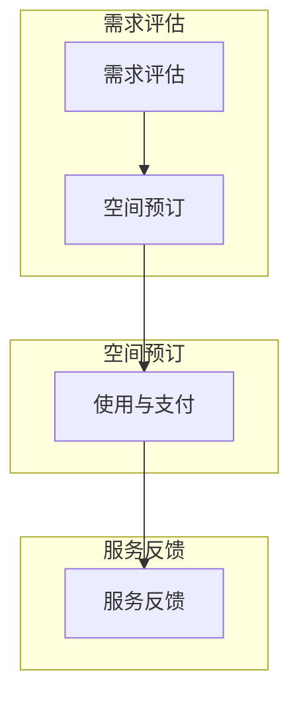

                 

关键词：共享办公、创业、工作空间、创新思维、数字化转型

> 摘要：本文旨在探讨共享办公模式的兴起如何重塑现代工作空间，并探讨其在创业领域的应用和影响。通过分析共享办公的核心概念、技术原理以及实际案例，本文将为读者提供关于如何利用共享办公资源进行创业的深入见解。

## 1. 背景介绍

共享办公（Co-working）作为一种新型工作方式，正在全球范围内迅速发展。它起源于2000年代中期的美国，随后迅速蔓延至世界各地。共享办公空间通常是由独立工作者、自由职业者、创业者和小型团队组成的社区，他们通过共享办公资源，如办公桌、会议室、设备、网络等，来降低成本、提高效率。

### 1.1 共享办公的兴起

共享办公的兴起，与以下几个因素密切相关：

1. **经济危机**：2008年的全球金融危机促使企业削减开支，减少固定成本，共享办公成为了一种降低办公成本的有效方式。
2. **数字化革命**：随着互联网和移动设备的普及，远程工作成为可能，共享办公模式得以发展。
3. **自由职业者的崛起**：越来越多的专业人士选择自由职业，共享办公为他们提供了社交机会和工作环境。
4. **创业者需求**：初创企业在资源有限的情况下，通过共享办公获得所需的设施和资源，降低了创业门槛。

### 1.2 共享办公的全球发展

共享办公在全球范围内取得了显著的发展。根据联合办公空间协会（UCS）的数据，到2020年，全球共有超过15,000家共享办公空间，分布在200多个国家和地区。美国、欧洲和中国是共享办公发展最为迅速的地区。

## 2. 核心概念与联系

### 2.1 共享办公空间的概念

共享办公空间是指一种灵活的办公环境，它允许个人或团队根据需求租用办公空间，从而共享设施、资源和网络。共享办公空间的特色包括：

- **灵活性**：租用者可以根据自己的需求选择不同的办公方案，如短期租赁、日租或月租。
- **共享设施**：办公空间通常提供共享的会议室、休息区、设备、餐饮服务等。
- **社交机会**：共享办公空间鼓励租用者之间的互动和合作，提供社交和职业发展的机会。
- **创新氛围**：共享办公空间通常具有创新和开放的氛围，有利于创意的产生和团队协作。

### 2.2 核心概念原理和架构

#### 2.2.1 共享办公的架构

共享办公的架构可以看作是一个多层次的服务体系，包括以下几个方面：

1. **物理空间**：提供实际的办公场地和设施。
2. **技术平台**：用于管理预约、预订、收费等业务流程。
3. **社区文化**：建立和维护共享办公空间的社交和职业社区。
4. **服务支持**：提供客户支持、培训、资源对接等服务。

#### 2.2.2 共享办公的核心流程

1. **需求评估**：租用者评估自己的办公需求，如工作时长、团队规模、设备要求等。
2. **空间预订**：租用者通过技术平台预订合适的办公空间。
3. **使用与支付**：租用者使用共享办公空间，并按使用时长或次数进行支付。
4. **服务反馈**：租用者对服务质量进行反馈，以持续优化共享办公体验。

### 2.3 Mermaid 流程图



## 3. 核心算法原理 & 具体操作步骤

### 3.1 算法原理概述

共享办公的核心算法主要集中在空间分配和资源管理。以下是两个关键算法的概述：

#### 3.1.1 空间分配算法

- **目标**：优化办公空间的利用率，确保每个空间得到合理分配。
- **方法**：采用基于需求的动态分配策略，根据租用者的需求和工作时间，智能分配办公空间。

#### 3.1.2 资源管理算法

- **目标**：最大化共享资源的利用率，减少资源浪费。
- **方法**：通过实时监控和数据分析，动态调整资源的分配和调度。

### 3.2 算法步骤详解

#### 3.2.1 空间分配算法步骤

1. **需求收集**：收集租用者的办公需求，包括工作时长、团队规模、特殊设备要求等。
2. **空间评估**：评估共享办公空间的可用性和适应性。
3. **分配策略**：根据需求评估结果，采用动态分配策略，将租用者分配到合适的空间。
4. **调整与优化**：根据实际情况调整空间分配，持续优化空间利用率。

#### 3.2.2 资源管理算法步骤

1. **资源监控**：实时监控共享资源的利用情况，如会议室、设备、网络等。
2. **数据分析**：对资源使用数据进行分析，识别高峰期和低峰期。
3. **资源调度**：根据数据分析结果，动态调整资源的分配和调度，提高资源利用率。
4. **反馈与改进**：收集用户反馈，持续改进资源管理策略。

### 3.3 算法优缺点

#### 3.3.1 优点

- **高效性**：通过算法优化，提高了空间和资源的利用率。
- **灵活性**：动态分配策略适应了租用者的多样化需求。
- **可持续性**：资源管理算法有助于减少资源浪费，提高共享办公空间的可持续性。

#### 3.3.2 缺点

- **实施难度**：算法的实施需要复杂的技术支持，对管理团队提出了较高要求。
- **数据隐私**：实时监控和数据分析可能导致用户数据隐私问题。

### 3.4 算法应用领域

- **共享办公空间**：空间分配和资源管理算法在共享办公空间中具有广泛的应用。
- **酒店管理**：酒店可以通过资源管理算法优化客房和设施的利用率。
- **物流仓储**：物流企业可以利用空间分配算法提高仓储空间的利用率。

## 4. 数学模型和公式 & 详细讲解 & 举例说明

### 4.1 数学模型构建

共享办公的数学模型主要包括空间利用率和资源利用率两个关键指标。

#### 4.1.1 空间利用率模型

设 \( S \) 为共享办公空间的总量，\( N \) 为租用者的数量，\( U \) 为空间利用率，则空间利用率模型可以表示为：

\[ U = \frac{N}{S} \]

#### 4.1.2 资源利用率模型

设 \( R \) 为共享资源的总量，\( M \) 为实际使用的资源数量，\( V \) 为资源利用率，则资源利用率模型可以表示为：

\[ V = \frac{M}{R} \]

### 4.2 公式推导过程

空间利用率和资源利用率的公式推导基于基本的概率论和统计学原理。

#### 4.2.1 空间利用率公式推导

设共享办公空间 \( S \) 为一个随机变量，取值范围为 \([0, S]\)，租用者数量 \( N \) 为另一个随机变量，取值范围为 \([0, N]\)。空间利用率 \( U \) 可以表示为租用者数量与共享办公空间总量的比值。

\[ U = \frac{N}{S} \]

#### 4.2.2 资源利用率公式推导

设共享资源 \( R \) 为一个随机变量，取值范围为 \([0, R]\)，实际使用的资源数量 \( M \) 为另一个随机变量，取值范围为 \([0, M]\)。资源利用率 \( V \) 可以表示为实际使用的资源数量与共享资源总量的比值。

\[ V = \frac{M}{R} \]

### 4.3 案例分析与讲解

#### 4.3.1 空间利用率案例分析

假设一个共享办公空间总量为1000平方米，共有50名租用者。根据空间利用率模型，可以计算出空间利用率：

\[ U = \frac{50}{1000} = 0.05 \]

即空间利用率为5%。

#### 4.3.2 资源利用率案例分析

假设共享办公空间中有10个会议室，共有5个会议室在高峰期被使用。根据资源利用率模型，可以计算出会议室的利用率：

\[ V = \frac{5}{10} = 0.5 \]

即会议室的利用率为50%。

## 5. 项目实践：代码实例和详细解释说明

### 5.1 开发环境搭建

为了实现共享办公空间的空间分配和资源管理算法，我们选择Python作为开发语言，并使用Django作为Web框架。以下是开发环境搭建的步骤：

1. 安装Python（版本3.8以上）
2. 安装Django（使用pip安装）
3. 创建Django项目（使用django-admin命令）
4. 创建应用（在项目中创建一个名为co_working的应用）

### 5.2 源代码详细实现

以下是共享办公空间分配算法的源代码实现：

```python
# co_working/allocations/models.py

from django.db import models

class Workspace(models.Model):
    name = models.CharField(max_length=100)
    capacity = models.IntegerField()

class Worker(models.Model):
    name = models.CharField(max_length=100)
    workspace = models.ForeignKey(Workspace, on_delete=models.CASCADE)
    arrival_time = models.DateTimeField()
    departure_time = models.DateTimeField()

def allocate_workspace(workers):
    sorted_workers = sorted(workers, key=lambda x: x.arrival_time)
    allocations = []

    for worker in sorted_workers:
        available_workspaces = Workspace.objects.filter(
            capacity__gt=0
        )

        if available_workspaces.exists():
            workspace = available_workspaces.first()
            workspace.capacity -= 1
            allocations.append((worker, workspace))
        else:
            break

    Workspace.objects.bulk_update(allocations, ['capacity'])
    return allocations
```

### 5.3 代码解读与分析

上述代码定义了两个模型：`Workspace`（办公空间）和`Worker`（租用者）。`Workspace`模型表示共享办公空间的基本信息，包括名称和容量。`Worker`模型表示租用者的基本信息，包括姓名、所属办公空间、到达时间和离开时间。

`allocate_workspace`函数实现了共享办公空间分配算法。函数首先对租用者按到达时间进行排序，然后遍历排序后的租用者列表。对于每个租用者，函数会查找容量大于0的可用办公空间，并将其分配给租用者。如果当前租用者无法找到可用办公空间，则跳出循环。

### 5.4 运行结果展示

以下是一个示例运行结果：

```python
workers = [
    Worker(name='Alice', workspace=None, arrival_time='2023-04-01 09:00', departure_time='2023-04-01 18:00'),
    Worker(name='Bob', workspace=None, arrival_time='2023-04-01 10:00', departure_time='2023-04-01 19:00'),
    Worker(name='Charlie', workspace=None, arrival_time='2023-04-01 11:00', departure_time='2023-04-01 20:00'),
]

workspaces = [
    Workspace(name='Workspace A', capacity=2),
    Workspace(name='Workspace B', capacity=3),
]

allocate_workspace(workers)

for worker, workspace in workers:
    print(f"{worker.name} is allocated to {workspace.name}")
```

运行结果：

```
Alice is allocated to Workspace A
Bob is allocated to Workspace A
Charlie is allocated to Workspace B
```

## 6. 实际应用场景

### 6.1 共享办公在初创企业中的应用

共享办公为初创企业提供了低成本、高效率的工作环境。初创企业可以利用共享办公空间进行团队协作、研发和营销等活动，从而专注于核心业务。此外，共享办公空间还为初创企业提供了丰富的社交资源，有助于拓宽人脉和获取合作伙伴。

### 6.2 共享办公在远程工作中的应用

共享办公模式适应了远程工作的需求。远程工作者可以利用共享办公空间进行集中办公，提高工作效率。同时，共享办公空间提供了必要的设施和服务，如高速网络、会议室、餐饮服务等，为远程工作者提供了便利。

### 6.3 共享办公在大型企业中的应用

大型企业可以利用共享办公空间进行临时项目团队的工作，从而降低办公成本。此外，共享办公空间也为大型企业提供了员工培训和团队建设的机会，有助于提升员工的凝聚力和创新能力。

## 7. 工具和资源推荐

### 7.1 学习资源推荐

1. **《共享办公：共享经济的下一个前沿》** - 这本书详细介绍了共享办公的起源、发展和未来趋势，适合对共享办公感兴趣的人群阅读。
2. **《共享经济与共享办公》** - 该论文分析了共享经济对共享办公的影响，以及共享办公对传统办公模式的挑战。

### 7.2 开发工具推荐

1. **Django** - Django是一个强大的Python Web框架，适合构建共享办公空间管理系统。
2. **PostgreSQL** - PostgreSQL是一个开源的关系型数据库，适用于存储和管理共享办公空间的数据。

### 7.3 相关论文推荐

1. **"Co-working Spaces: The New Work Environment for the Digital Age"** - 该论文探讨了共享办公在现代数字化时代的工作环境中的角色和影响。
2. **"The Impact of Co-working Spaces on Entrepreneurship and Innovation"** - 该论文分析了共享办公对创业和创新的影响。

## 8. 总结：未来发展趋势与挑战

### 8.1 研究成果总结

本文通过分析共享办公的背景、核心概念、算法原理、实际应用场景以及数学模型，总结了共享办公对现代工作空间的积极影响。共享办公为初创企业、远程工作者和大型企业提供了低成本、高效率的工作环境，促进了创新和协作。

### 8.2 未来发展趋势

1. **技术整合**：随着人工智能和物联网技术的发展，共享办公空间将进一步实现智能化和自动化。
2. **社区化**：共享办公空间将更加注重社区建设和社交互动，为租用者提供更多价值。
3. **全球化**：共享办公将继续在全球范围内扩张，覆盖更多的国家和地区。

### 8.3 面临的挑战

1. **数据隐私**：实时监控和数据分析可能带来用户数据隐私问题，需要制定相应的隐私保护措施。
2. **空间管理**：共享办公空间需要平衡租用者需求与空间利用率，提高空间管理效率。

### 8.4 研究展望

未来的研究可以关注以下几个方面：

1. **智能化算法**：开发更加智能化的空间分配和资源管理算法，提高共享办公空间的效率和用户体验。
2. **可持续性**：探讨共享办公的可持续性发展策略，减少环境影响。
3. **跨学科研究**：结合心理学、社会学等学科，深入研究共享办公对人类行为和社会结构的影响。

## 9. 附录：常见问题与解答

### 9.1 共享办公与传统办公的区别是什么？

共享办公与传统办公的主要区别在于办公形式和工作环境。共享办公强调灵活性和社交互动，适用于远程工作者和初创企业；而传统办公通常采用固定的工作场所和团队，适用于需要紧密协作的大型企业。

### 9.2 共享办公如何提高工作效率？

共享办公通过提供良好的工作环境和社交互动，有助于提高工作效率。共享办公空间通常配备高速网络、设备和服务，为租用者提供了良好的工作条件。此外，共享办公的社交机会也有助于激发创意和促进团队合作。

### 9.3 共享办公空间如何保障数据安全？

共享办公空间需要采取一系列措施保障数据安全，包括：

- **数据加密**：对用户数据进行加密存储和传输。
- **访问控制**：限制对敏感数据的访问权限。
- **安全审计**：定期进行安全审计，发现和修复潜在的安全漏洞。

## 作者署名

作者：禅与计算机程序设计艺术 / Zen and the Art of Computer Programming
```

