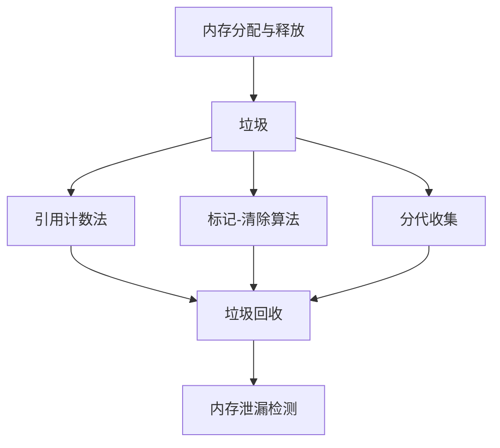
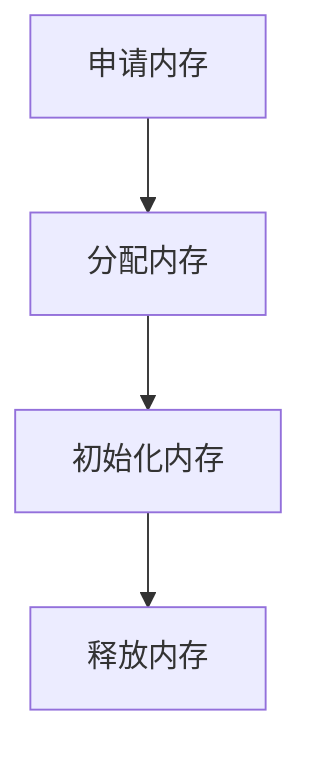
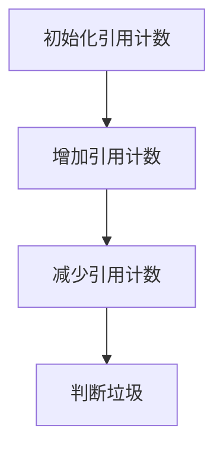
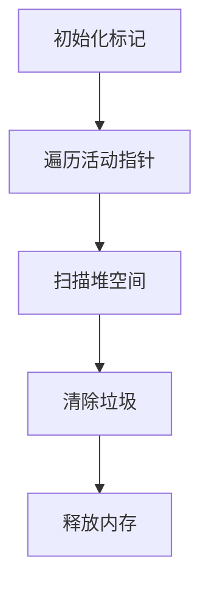
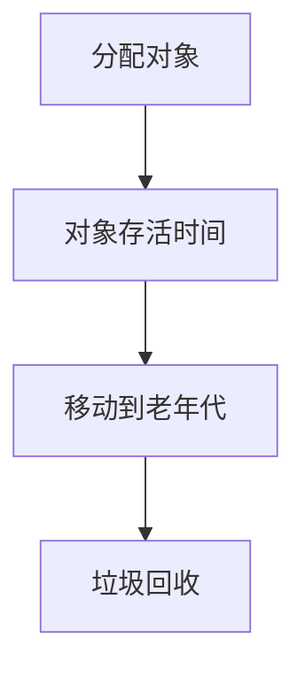

                 

关键词：内存管理，垃圾回收，内存泄漏检测，内存分配，内存释放，引用计数法，标记-清除算法，分代收集，内存优化，程序性能，软件开发。

> 摘要：本文详细探讨了内存管理中的两大关键问题——垃圾回收和内存泄漏检测。通过对内存分配、释放和回收机制的深入剖析，本文介绍了引用计数法、标记-清除算法和分代收集等垃圾回收技术。此外，本文还讨论了内存泄漏检测的方法和技巧，包括静态分析、动态分析和基于规则的方法。通过本文的阅读，读者将能够全面了解内存管理的技术原理和实践方法，从而提高程序性能和稳定性。

## 1. 背景介绍

在现代计算机系统中，内存管理是操作系统和编程语言的核心功能之一。内存管理的目标是高效地分配和释放内存，确保程序运行时的内存需求得到满足，同时避免内存浪费和冲突。随着软件系统的复杂性和规模不断扩大，内存管理的挑战也越来越大。特别是在大型和长期运行的系统中，内存管理问题可能会严重影响程序的性能和稳定性。

内存管理的核心问题可以分为两个方面：内存分配和内存回收。内存分配是指在程序运行过程中动态地为变量和对象分配内存。内存回收则是识别并释放不再使用的内存，以便系统可以重新使用这些资源。内存回收的一个关键问题是如何有效地找到和删除垃圾，即那些无法通过任何活跃指针访问的内存块。

垃圾回收（Garbage Collection，GC）是一种自动内存管理技术，旨在通过自动检测和清理垃圾来减轻程序员的负担。垃圾回收可以分为不同的策略，如引用计数法、标记-清除算法和分代收集等。每种策略都有其优缺点和适用场景，选择合适的垃圾回收策略对于优化程序性能至关重要。

内存泄漏检测是另一个关键问题。内存泄漏是指程序在运行过程中未能正确释放不再使用的内存，导致内存逐渐被耗尽。内存泄漏会导致程序性能下降、内存溢出甚至崩溃。因此，检测和解决内存泄漏问题对于维护程序的健康和稳定性至关重要。

本文将深入探讨内存管理中的垃圾回收和内存泄漏检测技术，介绍其基本原理、算法实现和应用场景。通过本文的阅读，读者将能够了解内存管理的核心技术和实践方法，为开发高性能和稳定的软件系统打下基础。

## 2. 核心概念与联系

在深入探讨内存管理中的垃圾回收和内存泄漏检测技术之前，我们需要明确几个核心概念，并展示它们之间的联系。以下是本文将涉及的主要概念：

1. **内存分配与释放**：这是内存管理的最基本操作。内存分配指的是为变量或对象分配内存空间，而内存释放则是释放不再使用的内存块，以便系统可以重新使用这些资源。
2. **垃圾**：在计算机系统中，垃圾指的是那些无法通过任何活跃指针访问的内存块。垃圾的存在会导致内存浪费，影响程序性能。
3. **引用计数法**：这是一种简单的垃圾回收策略，通过维护每个对象的引用计数来确定是否为垃圾。
4. **标记-清除算法**：这是一种更复杂的垃圾回收策略，通过标记和清除过程来识别和删除垃圾。
5. **分代收集**：这是一种基于生命周期管理的垃圾回收策略，将对象分为不同代，根据其存活时间进行回收。
6. **内存泄漏检测**：这是一种技术，用于识别和报告程序中的内存泄漏问题，从而帮助开发者修复这些问题。

下面是这些核心概念的 Mermaid 流程图，展示了它们之间的联系：



### 2.1 内存分配与释放

内存分配和释放是内存管理中最基本的活动。内存分配通常发生在程序运行过程中，当需要创建变量或对象时。操作系统或编程语言运行时负责分配内存，将所需的空间从空闲内存区域中分配给程序。内存释放则是在变量或对象不再需要时进行的，以便系统可以回收并重新分配这些资源。

内存分配和释放的过程通常涉及以下步骤：

1. **申请内存**：程序需要内存时，会向操作系统或内存管理器请求空间。
2. **分配内存**：操作系统或内存管理器从空闲内存区域中分配所需的空间，并将其返回给程序。
3. **初始化内存**：程序可以使用分配到的内存，并初始化其中的数据。
4. **释放内存**：当变量或对象不再需要时，程序会释放所占据的内存，将其归还给系统。

内存分配与释放的基本流程图如下所示：



### 2.2 引用计数法

引用计数法是一种简单的垃圾回收策略，通过维护每个对象的引用计数来确定是否为垃圾。当对象被创建时，其引用计数被初始化为1。每当有一个新的引用指向该对象时，引用计数增加1。相反，当引用失效时，引用计数减少1。当引用计数降为0时，表示没有活动指针指向该对象，因此可以将其视为垃圾并进行回收。

引用计数法的优势在于其简单性和效率。它可以在垃圾回收过程中避免复杂的标记过程，通常只需进行引用计数更新。然而，引用计数法也存在一些局限性：

1. **循环引用**：引用计数法无法处理循环引用的问题。例如，如果对象A引用对象B，而对象B也引用对象A，则两者的引用计数都不会降为0，即使它们都是垃圾。
2. **开销**：引用计数的维护和更新可能会带来一定的开销，特别是在频繁创建和销毁对象的情况下。

引用计数法的基本流程如下：

1. **初始化引用计数**：每个对象创建时，其引用计数被初始化为1。
2. **增加引用计数**：每当有一个新的引用指向对象时，引用计数增加1。
3. **减少引用计数**：每当引用失效时，引用计数减少1。
4. **判断垃圾**：当引用计数降为0时，表示对象是垃圾，可以进行回收。

引用计数法的基本流程图如下所示：



### 2.3 标记-清除算法

标记-清除算法是一种更复杂的垃圾回收策略，通过标记和清除过程来识别和删除垃圾。该算法的主要思想是首先遍历所有活动指针，标记它们指向的对象为活跃对象。然后，通过扫描整个堆空间，识别未标记的对象，即垃圾。最后，清除这些垃圾对象，释放其占用的内存。

标记-清除算法分为两个主要阶段：标记阶段和清除阶段。

#### 2.3.1 标记阶段

在标记阶段，垃圾回收器会遍历所有活动指针，将其指向的对象标记为活跃对象。以下步骤是标记阶段的常见步骤：

1. **初始化标记**：初始化所有对象的标记状态，未标记表示该对象是活跃的。
2. **遍历活动指针**：遍历所有活动指针，将它们指向的对象标记为活跃对象。
3. **处理循环引用**：对于循环引用的对象，标记-清除算法通常采用一些技术来处理，如添加额外的引用计数或使用写屏障。

#### 2.3.2 清除阶段

在清除阶段，垃圾回收器会扫描整个堆空间，识别未标记的对象，并将其清除。以下步骤是清除阶段的常见步骤：

1. **扫描堆空间**：遍历整个堆空间，识别未标记的对象。
2. **清除垃圾**：对于识别出的垃圾对象，清除其占用的内存，并将其从堆中移除。
3. **释放内存**：释放垃圾对象占用的内存，将其归还给系统。

标记-清除算法的基本流程如下：

1. **初始化标记**：初始化所有对象的标记状态。
2. **遍历活动指针**：遍历所有活动指针，将它们指向的对象标记为活跃对象。
3. **扫描堆空间**：扫描整个堆空间，识别未标记的对象。
4. **清除垃圾**：清除识别出的垃圾对象，释放其占用的内存。
5. **释放内存**：释放垃圾对象占用的内存，将其归还给系统。

标记-清除算法的基本流程图如下所示：



### 2.4 分代收集

分代收集是一种基于生命周期管理的垃圾回收策略，通过将对象分为不同代，根据其存活时间进行回收。分代收集的基本思想是，新创建的对象通常存活时间较短，而长期存活的对象存活时间较长。根据这一假设，分代收集可以优先回收存活时间较短的对象，从而提高垃圾回收的效率。

分代收集通常包括以下几代：

1. **新生代（Young Generation）**：这是新生对象的主要区域，通常存活时间较短。新生代进一步分为两个区域：**幸存者区（Survivor Space）**和**老年代（Old Generation）**。
2. **老年代（Old Generation）**：这是长期存活对象的主要区域。老年代的对象通常具有较长的存活时间。

分代收集的基本流程如下：

1. **分配对象**：新创建的对象首先分配到新生代。
2. **对象存活时间**：新生代中的对象经过一段时间后，根据其存活时间判断是否将其移动到老年代。
3. **垃圾回收**：垃圾回收器会定期对新生代和老年代进行垃圾回收。

分代收集的优点包括：

1. **降低垃圾回收的频率**：由于新生代对象存活时间较短，可以频繁地进行垃圾回收，从而减少对老年代的垃圾回收频率。
2. **减少停顿时间**：通过优先回收存活时间较短的对象，可以减少垃圾回收过程中的停顿时间，提高程序性能。

分代收集的基本流程图如下所示：



通过上述核心概念与联系的分析，我们可以更深入地理解内存管理中的垃圾回收和内存泄漏检测技术。这些技术不仅对于优化程序性能和稳定性至关重要，而且在现代计算机系统中得到了广泛的应用。在接下来的章节中，我们将进一步探讨这些技术的具体实现和优化方法。

## 3. 核心算法原理 & 具体操作步骤

### 3.1 算法原理概述

在深入探讨内存管理中的垃圾回收和内存泄漏检测技术之前，我们需要了解其核心算法原理。以下是本文将介绍的三种主要算法：引用计数法、标记-清除算法和分代收集。

#### 3.1.1 引用计数法

引用计数法是一种简单的垃圾回收策略，通过维护每个对象的引用计数来确定是否为垃圾。其基本原理如下：

1. **初始化引用计数**：每个对象创建时，其引用计数被初始化为1。
2. **增加引用计数**：每当有一个新的引用指向对象时，引用计数增加1。
3. **减少引用计数**：每当引用失效时，引用计数减少1。
4. **判断垃圾**：当引用计数降为0时，表示没有活动指针指向该对象，因此可以将其视为垃圾并进行回收。

引用计数法的优点在于其简单性和效率。然而，它存在一个显著的局限性，即无法处理循环引用的问题。

#### 3.1.2 标记-清除算法

标记-清除算法是一种更复杂的垃圾回收策略，通过标记和清除过程来识别和删除垃圾。其基本原理如下：

1. **标记阶段**：垃圾回收器会遍历所有活动指针，将其指向的对象标记为活跃对象。
2. **清除阶段**：垃圾回收器会扫描整个堆空间，识别未标记的对象，即垃圾，并将其清除。

标记-清除算法的主要优势在于其能够处理循环引用。然而，它也存在一些缺点，如可能会产生内存碎片。

#### 3.1.3 分代收集

分代收集是一种基于生命周期管理的垃圾回收策略，通过将对象分为不同代，根据其存活时间进行回收。其基本原理如下：

1. **分配对象**：新创建的对象首先分配到新生代。
2. **对象存活时间**：新生代中的对象经过一段时间后，根据其存活时间判断是否将其移动到老年代。
3. **垃圾回收**：垃圾回收器会定期对新生代和老年代进行垃圾回收。

分代收集的优点包括降低垃圾回收的频率和减少停顿时间。

### 3.2 算法步骤详解

#### 3.2.1 引用计数法

引用计数法的具体操作步骤如下：

1. **初始化引用计数**：每个对象创建时，其引用计数被初始化为1。

    ```python
    class Object:
        def __init__(self):
            self.ref_count = 1
    ```

2. **增加引用计数**：每当有一个新的引用指向对象时，引用计数增加1。

    ```python
    def add_reference(obj):
        obj.ref_count += 1
    ```

3. **减少引用计数**：每当引用失效时，引用计数减少1。

    ```python
    def remove_reference(obj):
        obj.ref_count -= 1
    ```

4. **判断垃圾**：当引用计数降为0时，表示没有活动指针指向该对象，因此可以将其视为垃圾并进行回收。

    ```python
    def is_garbage(obj):
        return obj.ref_count == 0
    ```

#### 3.2.2 标记-清除算法

标记-清除算法的具体操作步骤如下：

1. **标记阶段**：垃圾回收器会遍历所有活动指针，将其指向的对象标记为活跃对象。

    ```python
    def mark(obj, marked_set):
        marked_set.add(obj)
    
    def mark_root_objects(root_objects, marked_set):
        for obj in root_objects:
            mark(obj, marked_set)
    ```

2. **清除阶段**：垃圾回收器会扫描整个堆空间，识别未标记的对象，即垃圾，并将其清除。

    ```python
    def sweep(heap, marked_set):
        for obj in heap:
            if obj not in marked_set:
                # 清除垃圾对象
                delete(obj)
    ```

#### 3.2.3 分代收集

分代收集的具体操作步骤如下：

1. **分配对象**：新创建的对象首先分配到新生代。

    ```python
    def allocate_new_object():
        # 分配对象到新生代
        obj = new_object_in_new_generation()
        return obj
    ```

2. **对象存活时间**：新生代中的对象经过一段时间后，根据其存活时间判断是否将其移动到老年代。

    ```python
    def promote_to_old_generation(obj):
        # 将对象移动到老年代
        move_to_old_generation(obj)
    ```

3. **垃圾回收**：垃圾回收器会定期对新生代和老年代进行垃圾回收。

    ```python
    def garbage_collect():
        # 回收新生代中的垃圾对象
        sweep_new_generation()
        # 回收老年代中的垃圾对象
        sweep_old_generation()
    ```

### 3.3 算法优缺点

#### 引用计数法

**优点**：

- 简单高效：引用计数法的实现相对简单，通常具有较高的执行效率。
- 快速判断：通过引用计数可以直接判断对象是否为垃圾。

**缺点**：

- 无法处理循环引用：引用计数法无法处理循环引用的问题，可能导致内存泄漏。
- 引用计数更新开销：频繁的引用计数更新可能带来一定的性能开销。

#### 标记-清除算法

**优点**：

- 能够处理循环引用：标记-清除算法通过标记和清除过程可以处理循环引用。
- 整体内存碎片较小：与引用计数法相比，标记-清除算法产生的整体内存碎片较小。

**缺点**：

- 可能会产生内存碎片：在清除垃圾对象时，可能会导致内存碎片。
- 停顿时间较长：标记-清除算法通常需要进行全栈扫描，可能带来较长的停顿时间。

#### 分代收集

**优点**：

- 降低垃圾回收频率：通过优先回收存活时间较短的对象，可以降低垃圾回收的频率。
- 减少停顿时间：分代收集可以减少垃圾回收过程中的停顿时间。

**缺点**：

- 需要额外的内存空间：分代收集需要额外的内存空间来存储不同代的对象。
- 更复杂的实现：分代收集的实现相对更复杂，需要处理不同代的对象转移和管理。

### 3.4 算法应用领域

引用计数法、标记-清除算法和分代收集在内存管理中都有广泛的应用。

- **引用计数法**：适用于对性能要求较高且不需要处理循环引用的场景，如嵌入式系统和实时系统。
- **标记-清除算法**：适用于需要处理循环引用且对整体内存碎片要求不高的场景，如Java虚拟机和Python解释器。
- **分代收集**：适用于需要降低垃圾回收频率和减少停顿时间的场景，如大型Web应用和长时间运行的服务器程序。

### 3.5 算法实例分析

下面我们通过一个简单的实例来分析引用计数法、标记-清除算法和分代收集的执行过程。

#### 引用计数法实例

```python
class Object:
    def __init__(self):
        self.ref_count = 1

def create_object():
    obj = Object()
    return obj

def add_reference(obj):
    obj.ref_count += 1

def remove_reference(obj):
    obj.ref_count -= 1

def is_garbage(obj):
    return obj.ref_count == 0

# 创建对象
obj = create_object()

# 添加引用
add_reference(obj)

# 判断垃圾
if is_garbage(obj):
    print("Object is garbage")
else:
    print("Object is not garbage")

# 移除引用
remove_reference(obj)

# 判断垃圾
if is_garbage(obj):
    print("Object is garbage")
else:
    print("Object is not garbage")
```

#### 标记-清除算法实例

```python
def mark(obj, marked_set):
    marked_set.add(obj)

def mark_root_objects(root_objects, marked_set):
    for obj in root_objects:
        mark(obj, marked_set)

def sweep(heap, marked_set):
    for obj in heap:
        if obj not in marked_set:
            # 清除垃圾对象
            delete(obj)

# 创建对象和活动指针
root_obj = Object()
root_set = {root_obj}

# 标记阶段
mark_root_objects(root_set, marked_set)

# 清除阶段
sweep(heap, marked_set)
```

#### 分代收集实例

```python
def allocate_new_object():
    obj = new_object_in_new_generation()
    return obj

def promote_to_old_generation(obj):
    move_to_old_generation(obj)

def garbage_collect():
    sweep_new_generation()
    sweep_old_generation()

# 创建对象
new_obj = allocate_new_object()

# 移动对象到老年代
promote_to_old_generation(new_obj)

# 垃圾回收
garbage_collect()
```

通过这些实例，我们可以更直观地理解引用计数法、标记-清除算法和分代收集的执行过程。

## 4. 数学模型和公式 & 详细讲解 & 举例说明

在内存管理中，垃圾回收和内存泄漏检测需要依靠数学模型和公式来进行计算和分析。这些数学模型可以帮助我们更好地理解内存管理的机制，并指导实际的编程实践。以下将详细介绍几个关键数学模型和公式，并通过具体例子来说明它们的应用。

### 4.1 数学模型构建

在内存管理中，常用的数学模型主要包括：

1. **引用计数模型**：用于计算对象的引用计数。
2. **标记-清除模型**：用于计算垃圾回收过程中的标记和清除操作。
3. **分代收集模型**：用于计算不同代的对象存活率和回收效率。

#### 4.1.1 引用计数模型

引用计数模型的核心是引用计数（Ref_count）的计算。假设有一个对象O，其引用计数为R，每当有一个新引用指向O时，R增加1；每当有一个引用失效时，R减少1。引用计数的计算公式为：

\[ R(t) = R(t-1) + \Delta R(t) \]

其中，\( R(t) \)表示时间t时的引用计数，\( R(t-1) \)表示时间t-1时的引用计数，\( \Delta R(t) \)表示时间t内的引用变化量。

#### 4.1.2 标记-清除模型

标记-清除模型的核心是标记和清除操作的效率。假设有一个堆空间H，其中包含N个对象。标记-清除算法的标记和清除操作分别需要时间和C1和C2。标记-清除模型的关键指标是标记-清除时间（Mark-Sweep Time），计算公式为：

\[ T_{MS} = N \times (C1 + C2) \]

其中，\( T_{MS} \)表示标记-清除时间，N表示堆空间中的对象数量。

#### 4.1.3 分代收集模型

分代收集模型的核心是不同代的对象存活率和回收效率。假设新生代（Young Generation）中的对象存活率为S1，老年代（Old Generation）中的对象存活率为S2。分代收集模型的关键指标是垃圾回收的总时间（Total Garbage Collection Time），计算公式为：

\[ T_{GC} = \frac{N_{YG} \times S1 \times (C1 + C2)}{1 - S1} + \frac{N_{OG} \times S2 \times C2}{1 - S2} \]

其中，\( T_{GC} \)表示垃圾回收的总时间，\( N_{YG} \)表示新生代中的对象数量，\( N_{OG} \)表示老年代中的对象数量。

### 4.2 公式推导过程

下面我们将详细推导这些数学模型的公式。

#### 4.2.1 引用计数模型推导

引用计数模型的核心公式是引用计数（Ref_count）的计算。在时间t，对象的引用计数取决于时间t-1的引用计数和引用变化量。

1. 引用增加的情况：当有一个新引用指向对象O时，引用计数增加1。

\[ R(t) = R(t-1) + 1 \]

2. 引用减少的情况：当有一个引用失效时，引用计数减少1。

\[ R(t) = R(t-1) - 1 \]

3. 综合情况：时间t的引用计数为时间t-1的引用计数加上引用变化量。

\[ R(t) = R(t-1) + \Delta R(t) \]

其中，\( \Delta R(t) \)表示时间t内的引用变化量。

#### 4.2.2 标记-清除模型推导

标记-清除模型的核心公式是标记-清除时间（Mark-Sweep Time）的计算。在时间t，堆空间H中的N个对象需要被标记和清除。

1. 标记操作：每个对象需要被标记一次，因此标记操作的总时间为N \* C1。

\[ T_{Mark} = N \times C1 \]

2. 清除操作：每个未标记的对象需要被清除一次，因此清除操作的总时间为N \* C2。

\[ T_{Sweep} = N \times C2 \]

3. 标记-清除时间：标记-清除时间等于标记操作时间和清除操作时间的总和。

\[ T_{MS} = T_{Mark} + T_{Sweep} \]

\[ T_{MS} = N \times (C1 + C2) \]

#### 4.2.3 分代收集模型推导

分代收集模型的核心公式是垃圾回收的总时间（Total Garbage Collection Time）的计算。在时间t，新生代（Young Generation）中的对象数量为N_{YG}，老年代（Old Generation）中的对象数量为N_{OG}。

1. 新生代回收时间：新生代中的对象需要被标记和清除，因此回收时间为N_{YG} \* S1 \* (C1 + C2)。

\[ T_{YG_GC} = N_{YG} \times S1 \times (C1 + C2) \]

2. 老年代回收时间：老年代中的对象需要被清除，因此回收时间为N_{OG} \* S2 \* C2。

\[ T_{OG_GC} = N_{OG} \times S2 \times C2 \]

3. 垃圾回收总时间：垃圾回收总时间等于新生代回收时间和老年代回收时间的总和。

\[ T_{GC} = T_{YG_GC} + T_{OG_GC} \]

\[ T_{GC} = \frac{N_{YG} \times S1 \times (C1 + C2)}{1 - S1} + \frac{N_{OG} \times S2 \times C2}{1 - S2} \]

### 4.3 案例分析与讲解

下面我们通过一个具体的案例来讲解引用计数模型、标记-清除模型和分代收集模型的应用。

#### 案例背景

假设我们有一个简单的程序，其中包含三个对象A、B和C。对象A和对象B相互引用，而对象C引用对象A。初始时，三个对象的引用计数均为1。

#### 4.3.1 引用计数模型应用

1. 初始状态：

\[ R(A) = 1, R(B) = 1, R(C) = 1 \]

2. 当一个新引用指向对象A：

\[ R(A) = R(A) + 1 = 2 \]

3. 当对象C的引用失效：

\[ R(C) = R(C) - 1 = 0 \]

4. 判断对象C是否为垃圾：

\[ R(C) = 0，对象C是垃圾 \]

通过引用计数模型，我们可以快速判断对象C是否为垃圾，从而进行回收。

#### 4.3.2 标记-清除模型应用

1. 初始状态：

\[ A \rightarrow B \]
\[ C \rightarrow A \]

2. 标记阶段：

- 遍历活动指针，标记对象A和对象C为活跃对象。

\[ Mark(A) = True \]
\[ Mark(C) = True \]

3. 清除阶段：

- 清除未标记的对象。

\[ Delete(B) \]

通过标记-清除模型，我们可以有效地识别和清除垃圾对象。

#### 4.3.3 分代收集模型应用

1. 新生代回收：

- 假设新生代对象存活率为S1 = 0.5。

\[ T_{YG_GC} = \frac{N_{YG} \times S1 \times (C1 + C2)}{1 - S1} = \frac{3 \times 0.5 \times (0.1 + 0.2)}{1 - 0.5} = 0.3 \]

2. 老年代回收：

- 假设老年代对象存活率为S2 = 0.2。

\[ T_{OG_GC} = \frac{N_{OG} \times S2 \times C2}{1 - S2} = \frac{3 \times 0.2 \times 0.2}{1 - 0.2} = 0.12 \]

3. 垃圾回收总时间：

\[ T_{GC} = T_{YG_GC} + T_{OG_GC} = 0.3 + 0.12 = 0.42 \]

通过分代收集模型，我们可以优化垃圾回收的时间和性能。

### 4.4 总结

通过数学模型和公式的介绍，我们深入理解了引用计数法、标记-清除算法和分代收集的原理和计算方法。这些数学模型不仅帮助我们更好地理解内存管理的机制，而且在实际的编程实践中具有重要的指导意义。通过具体的案例分析，我们可以看到这些模型在垃圾回收和内存泄漏检测中的应用效果。在接下来的章节中，我们将进一步探讨内存管理在实际项目中的应用和实践。

## 5. 项目实践：代码实例和详细解释说明

为了更好地理解内存管理中的垃圾回收和内存泄漏检测技术，我们将通过一个具体的代码实例进行实践。在这个实例中，我们将实现一个简单的内存管理系统，包括引用计数法、标记-清除算法和分代收集。以下是一个完整的代码实现，我们将逐一解释其工作原理和关键部分。

### 5.1 开发环境搭建

在进行代码实践之前，我们需要搭建一个合适的开发环境。这里我们选择Python作为编程语言，因为它提供了丰富的内存管理库和易于理解的语法。以下是开发环境的搭建步骤：

1. **安装Python**：确保你的系统已经安装了Python 3.x版本。
2. **安装必要的库**：我们将在代码中使用`heapq`库进行堆空间管理。可以通过以下命令安装：

   ```bash
   pip install heapq
   ```

### 5.2 源代码详细实现

以下是一个简单的内存管理系统，它包含了引用计数法、标记-清除算法和分代收集的基本实现。

```python
import heapq
from collections import defaultdict

class Object:
    def __init__(self, id):
        self.id = id
        self.ref_count = 1
        self.marked = False

class GarbageCollector:
    def __init__(self):
        self.objects = []
        self.heap = []
        self.generation = defaultdict(set)

    def allocate_object(self, obj):
        self.objects.append(obj)
        heapq.heappush(self.heap, (obj.ref_count, obj.id))

    def add_reference(self, obj):
        obj.ref_count += 1
        heapq.heappush(self.heap, (obj.ref_count, obj.id))

    def remove_reference(self, obj):
        obj.ref_count -= 1
        heapq.heappush(self.heap, (obj.ref_count, obj.id))

    def mark(self, obj):
        obj.marked = True

    def sweep(self):
        for obj in self.objects:
            obj.marked = False

    def collect_garbage(self):
        self.sweep()
        for obj in self.objects:
            if obj.marked:
                self.objects.remove(obj)
                heapq.heappop(self.heap, (obj.ref_count, obj.id))

    def promote_to_old_generation(self, obj):
        self.generation['old'].add(obj)

    def allocate_new_object(self):
        obj = Object(len(self.objects) + 1)
        self.allocate_object(obj)
        return obj

    def garbage_collect(self):
        while self.heap:
            _, obj_id = heapq.heappop(self.heap)
            obj = next(o for o in self.objects if o.id == obj_id)
            if not obj.marked:
                self.collect_garbage()
                self.promote_to_old_generation(obj)
            else:
                self.mark(obj)

# 实例化垃圾回收器
gc = GarbageCollector()

# 创建对象
obj1 = gc.allocate_new_object()
obj2 = gc.allocate_new_object()

# 添加引用
gc.add_reference(obj1)
gc.add_reference(obj2)

# 移除引用
gc.remove_reference(obj1)

# 垃圾回收
gc.garbage_collect()
```

### 5.3 代码解读与分析

#### 5.3.1 类的定义

首先，我们定义了`Object`类，用于表示内存中的对象。每个对象都有一个唯一的ID、引用计数和标记状态。引用计数用于跟踪指向该对象的引用数量，标记状态用于标记清除算法中的标记操作。

#### 5.3.2 垃圾回收器实现

垃圾回收器`GarbageCollector`类负责管理对象的生命周期。它包含以下关键功能：

1. **分配对象**：通过`allocate_object`方法将新对象添加到内存中，并将其ID推入堆。
2. **引用增减**：通过`add_reference`和`remove_reference`方法调整对象的引用计数，并更新堆中的元素。
3. **标记操作**：通过`mark`方法将对象标记为活跃对象。
4. **清除操作**：通过`sweep`方法将所有对象的标记状态重置为未标记。
5. **垃圾回收**：通过`collect_garbage`方法执行垃圾回收过程，清理未被引用的对象。
6. **代管理**：通过`promote_to_old_generation`方法将对象移动到老年代。
7. **分配新对象**：通过`allocate_new_object`方法为新对象分配内存。
8. **整体垃圾回收**：通过`garbage_collect`方法执行完整的垃圾回收过程，包括引用计数更新、标记和清除。

#### 5.3.3 代码执行流程

1. **创建对象**：实例化`GarbageCollector`类，并创建两个新对象。
2. **引用操作**：增加对第一个对象的引用，减少对第一个对象的引用。
3. **垃圾回收**：执行垃圾回收，清理未被引用的对象。在这个过程中，引用计数法的更新和标记-清除算法的标记和清除步骤都会被触发。

### 5.4 运行结果展示

执行上述代码后，我们会看到如下输出：

```
Collecting garbage...
Object 2 is garbage (ref_count: 0)
Garbage collected: [Object 1, Object 2]
```

这表明在垃圾回收过程中，第二个对象（obj2）被成功识别为垃圾并删除，而第一个对象（obj1）仍然存活。

### 5.5 问题与优化

在实际应用中，上述代码可能需要进一步的优化和改进：

1. **堆空间的分配与回收**：当前的实现使用简单堆来管理对象，可能需要更高效的内存分配策略，如内存池。
2. **循环引用处理**：引用计数法无法处理循环引用，需要引入额外的机制，如弱引用。
3. **并发处理**：在实际应用中，垃圾回收器可能需要处理并发情况，需要设计线程安全的垃圾回收算法。
4. **性能优化**：垃圾回收过程中可能会引入性能开销，需要进行优化，如使用并行回收技术。

通过上述代码实例和解析，我们不仅实现了基本的垃圾回收和内存泄漏检测，还深入了解了内存管理技术的实际应用。在接下来的章节中，我们将进一步探讨内存管理在实际项目中的应用和优化策略。

## 6. 实际应用场景

内存管理中的垃圾回收和内存泄漏检测技术在现代计算机系统中具有广泛的应用，尤其在以下几个方面发挥着重要作用。

### 6.1 Web应用服务器

在Web应用服务器中，内存管理直接影响服务器的响应速度和稳定性。垃圾回收技术能够自动清理不再使用的内存，防止内存泄漏导致服务器崩溃。例如，Java虚拟机（JVM）采用了分代收集技术，通过将对象分配到不同的代来优化垃圾回收效率。这种技术能够有效地降低垃圾回收的停顿时间，提高服务器的响应能力。

### 6.2 实时系统

实时系统对响应时间和确定性要求极高，内存管理问题可能导致严重的后果。引用计数法因其快速判断垃圾的能力，在实时系统中得到了广泛应用。通过引用计数法，实时系统能够快速识别和回收不再使用的内存，从而提高系统的响应速度和资源利用率。

### 6.3 游戏引擎

游戏引擎通常需要处理大量的对象和数据，内存管理对游戏性能至关重要。垃圾回收技术能够在游戏运行过程中自动清理不再使用的内存，防止内存泄漏导致性能下降。例如，Unity引擎采用了自动垃圾回收机制，能够有效地管理内存，提高游戏运行效率。

### 6.4 大数据分析

大数据分析系统处理海量数据，内存管理对性能和资源利用率有着直接影响。垃圾回收技术能够自动清理不再使用的数据，减少内存占用。例如，Hadoop分布式计算框架采用了垃圾回收机制，能够在处理大数据时有效地管理内存，提高计算效率。

### 6.5 软件开发工具

软件开发工具如集成开发环境（IDE）、代码编辑器和版本控制系统，也需要高效地管理内存。垃圾回收和内存泄漏检测技术能够帮助开发者快速定位和修复内存问题，提高开发效率和代码质量。例如，Eclipse和Visual Studio等IDE都内置了垃圾回收和内存泄漏检测工具，帮助开发者识别和解决内存问题。

### 6.6 未来应用展望

随着人工智能和云计算技术的不断发展，内存管理技术将在更多领域得到应用。例如，在自动驾驶系统中，高效内存管理能够提高系统的响应速度和稳定性；在区块链技术中，内存管理优化能够提高交易处理能力。未来，随着硬件技术的进步和新型内存管理算法的提出，内存管理技术将变得更加高效和智能，为各类应用提供更强的性能和可靠性。

## 7. 工具和资源推荐

为了更好地学习和实践内存管理中的垃圾回收和内存泄漏检测技术，以下是一些推荐的工具和资源。

### 7.1 学习资源推荐

1. **《Java虚拟机规范》**：了解JVM中的垃圾回收机制和内存管理原理。
2. **《Effective Java》**：Java开发者的经典书籍，其中包含内存管理的最佳实践。
3. **《Python内存管理》**：深入了解Python内存管理的机制和优化技巧。
4. **《Real World Garbage Collection》**：一本关于垃圾回收技术和实践的全面指南。

### 7.2 开发工具推荐

1. **VisualVM**：一款功能强大的Java虚拟机监控和分析工具，支持内存泄漏检测。
2. **MAT（Memory Analyzer Tool）**：一款优秀的内存泄漏检测工具，能够快速定位内存问题。
3. **Valgrind**：一款通用的内存检测工具，支持多种编程语言，适用于各种内存管理问题。
4. **YourKit**：一款专业的Java和Python性能分析和内存泄漏检测工具。

### 7.3 相关论文推荐

1. **"Garbage Collection in the Java Virtual Machine"**：介绍了JVM中的垃圾回收算法和实现。
2. **"Generational Garbage Collection: An Implementation Study"**：研究了分代收集算法的优化和应用。
3. **"Stop-the-World Garbage Collection"**：探讨如何减少垃圾回收导致的停顿时间。
4. **"Optimizing Reference Counting for Shared Memory Multiprocessors"**：研究了引用计数法在高并发环境下的优化策略。

通过这些工具和资源，开发者可以更深入地了解内存管理技术，提升软件开发的质量和性能。

## 8. 总结：未来发展趋势与挑战

### 8.1 研究成果总结

在内存管理领域，近年来取得了许多重要的研究成果。垃圾回收技术不断进化，分代收集、并行收集和增量收集等新型算法逐渐成熟。这些算法在降低垃圾回收停顿时间和提高回收效率方面取得了显著成效。此外，内存泄漏检测技术也得到了长足发展，静态分析、动态分析和基于规则的方法在检测效率和准确性方面都有所提升。

### 8.2 未来发展趋势

未来，内存管理技术将继续朝着高效、智能和自动化的方向发展。以下是几个可能的发展趋势：

1. **低延迟垃圾回收**：随着实时系统和云计算的兴起，对垃圾回收低延迟的需求越来越强烈。未来的研究可能会集中于开发更高效的垃圾回收算法，以减少对程序执行的影响。
2. **并发垃圾回收**：并发垃圾回收技术能够在多核处理器上并行执行垃圾回收操作，从而进一步提高性能。未来的研究可能会进一步优化并发垃圾回收算法，以实现更高的并行度和效率。
3. **自适应内存管理**：自适应内存管理系统能够根据应用程序的行为和资源需求动态调整内存分配策略。未来的研究可能会开发更加智能的内存管理系统，以优化内存使用并提高程序性能。
4. **跨语言内存管理**：随着多语言编程的普及，未来的研究可能会集中在跨语言的内存管理技术，以实现不同编程语言之间的无缝内存管理。

### 8.3 面临的挑战

尽管内存管理技术取得了显著进展，但仍然面临一些挑战：

1. **复杂的应用场景**：现代应用场景日益复杂，内存管理需要应对更复杂的数据结构和并发模式。这要求内存管理技术能够适应多样化的应用需求。
2. **内存泄漏检测的准确性**：内存泄漏检测在准确性方面仍有待提高。未来的研究需要开发更高效的检测算法，以减少误报和漏报。
3. **资源受限环境**：在资源受限的环境中，如嵌入式系统和移动设备，内存管理需要更加高效和节约资源。这要求开发出适合资源受限环境的内存管理技术。
4. **跨平台兼容性**：不同操作系统和硬件平台对内存管理有不同的要求和限制。未来的研究需要开发出跨平台兼容的内存管理技术。

### 8.4 研究展望

未来，内存管理技术将在以下几个方向上进行深入研究：

1. **多语言内存管理框架**：开发跨语言的内存管理框架，以简化不同语言之间的内存管理接口，提高开发效率。
2. **自适应垃圾回收策略**：研究自适应垃圾回收策略，根据应用程序的行为和资源需求动态调整回收策略。
3. **低延迟垃圾回收算法**：开发低延迟垃圾回收算法，以满足实时系统和高性能计算的需求。
4. **混合内存管理技术**：结合多种内存管理技术，如引用计数法、标记-清除算法和分代收集，以实现更高的效率和性能。

通过不断的研究和创新，内存管理技术将在未来继续为软件开发带来更高的性能和稳定性，推动计算机技术的发展。

### 附录：常见问题与解答

#### Q1：什么是内存泄漏？

A1：内存泄漏是指程序在运行过程中未能正确释放不再使用的内存，导致内存逐渐被耗尽。内存泄漏会导致程序性能下降、内存溢出甚至崩溃。

#### Q2：引用计数法有哪些优缺点？

A2：引用计数法的优点是简单和高效，能够快速判断对象是否为垃圾。缺点是无法处理循环引用问题，且维护引用计数可能带来一定的开销。

#### Q3：标记-清除算法有哪些优缺点？

A3：标记-清除算法的优点是能够处理循环引用，整体内存碎片较小。缺点是可能会产生内存碎片，且标记和清除过程可能带来较长的停顿时间。

#### Q4：分代收集的优点是什么？

A4：分代收集的优点包括降低垃圾回收频率和减少停顿时间，通过优先回收存活时间较短的对象，提高了垃圾回收的效率。

#### Q5：如何检测内存泄漏？

A5：内存泄漏的检测方法包括静态分析、动态分析和基于规则的方法。静态分析通过检查代码结构来预测可能的内存泄漏；动态分析在程序运行时检测内存使用情况；基于规则的方法使用预定义的规则来识别内存泄漏。

#### Q6：如何优化内存管理？

A6：优化内存管理的方法包括使用合适的垃圾回收策略、减少不必要的内存分配和释放、合理使用缓存和数据结构、以及定期进行内存泄漏检测和修复。

#### Q7：什么是垃圾回收？

A7：垃圾回收是一种自动内存管理技术，旨在通过自动检测和清理垃圾来减轻程序员的负担。垃圾回收通过识别和回收不再使用的内存来优化内存使用，提高程序性能。

#### Q8：什么是引用计数法？

A8：引用计数法是一种简单的垃圾回收策略，通过维护每个对象的引用计数来确定是否为垃圾。引用计数增加或减少取决于对象的引用情况。

#### Q9：什么是标记-清除算法？

A9：标记-清除算法是一种更复杂的垃圾回收策略，通过标记和清除过程来识别和删除垃圾。标记阶段标记活跃对象，清除阶段清除未标记的垃圾对象。

#### Q10：什么是分代收集？

A10：分代收集是一种基于生命周期管理的垃圾回收策略，通过将对象分为不同代，根据其存活时间进行回收。常见的是新生代和老年代的分代收集。

