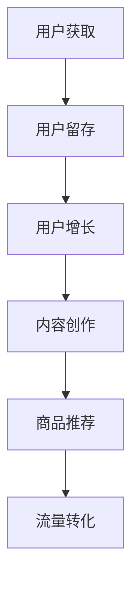

                 

关键词：内容电商，内容变现，商业模式，用户增长，技术实现，案例分析

内容电商作为近年来崛起的商业模式，逐渐成为互联网企业争夺市场份额的新阵地。它依托优质的内容吸引和留住用户，通过内容与商品相结合的方式实现商业变现。本文将从技术角度探讨内容电商的创业思路，分析核心算法、数学模型、项目实践及其应用场景，并展望未来发展趋势和挑战。

## 1. 背景介绍

随着互联网技术的飞速发展，内容消费逐渐成为人们日常生活的一部分。从图文、视频到直播，内容形式愈加丰富，用户的阅读习惯和消费行为也在不断变化。在这个背景下，内容电商应运而生，成为电商平台和企业转型升级的重要方向。

内容电商的核心在于“内容”和“电商”的结合，通过优质的内容吸引流量，进而引导用户购买商品。与传统的电商模式相比，内容电商更具互动性和粘性，能够提升用户参与度和忠诚度。本文旨在从技术角度分析内容电商的创业思路，为创业者提供有益的参考。

## 2. 核心概念与联系

### 2.1 内容电商的定义

内容电商是指利用互联网平台，通过发布优质的内容（如文章、视频、直播等）吸引用户，并结合电商功能实现商品销售的一种商业模式。其核心在于内容创作和电商运营的结合，以内容为桥梁，连接消费者和商品。

### 2.2 内容电商的核心要素

- **优质内容**：内容电商的核心竞争力在于优质的内容创作，这包括文章、视频、图片等多样化的内容形式。优质内容能够吸引大量用户，提升平台流量。
- **商品推荐**：通过大数据分析和算法推荐，为用户提供个性化的商品推荐，提升用户购买意愿和转化率。
- **互动体验**：内容电商平台需要提供良好的互动体验，如评论、点赞、分享等，增强用户参与度和粘性。
- **流量转化**：通过内容引导用户进行商品购买，实现流量到交易的转化。

### 2.3 内容电商与用户增长的关联

- **用户获取**：通过优质内容吸引用户关注，增加平台用户数量。
- **用户留存**：通过互动体验和持续的内容更新，提高用户粘性和留存率。
- **用户增长**：通过优化内容质量和推荐算法，实现用户数量的持续增长。

### 2.4 核心概念原理和架构的 Mermaid 流程图



## 3. 核心算法原理 & 具体操作步骤

### 3.1 算法原理概述

内容电商的核心算法主要包括用户画像、推荐算法和内容审核。用户画像用于分析用户兴趣和行为，推荐算法基于用户画像为用户推荐个性化内容，内容审核则确保内容的合规性和质量。

### 3.2 算法步骤详解

#### 3.2.1 用户画像

1. **数据收集**：通过用户行为数据、社交数据等收集用户信息。
2. **特征提取**：对用户数据进行预处理和特征提取，如兴趣标签、行为模式等。
3. **模型训练**：使用机器学习算法训练用户画像模型，对用户进行分类和打分。

#### 3.2.2 推荐算法

1. **用户行为分析**：分析用户在平台上的行为，如浏览、点赞、评论等。
2. **内容特征提取**：对推荐内容进行特征提取，如标题、标签、内容类型等。
3. **相似度计算**：计算用户和内容之间的相似度，根据相似度推荐相关内容。

#### 3.2.3 内容审核

1. **内容分类**：对上传的内容进行自动分类，如商品、文章、视频等。
2. **合规性检测**：检测内容是否符合平台规定和法律法规。
3. **人工审核**：对于自动审核无法判断的内容，进行人工审核。

### 3.3 算法优缺点

#### 3.3.1 用户画像

**优点**：能够准确了解用户需求和兴趣，提升推荐效果。

**缺点**：数据收集和处理成本较高，用户隐私保护问题。

#### 3.3.2 推荐算法

**优点**：提升用户粘性和购买转化率，增加平台收入。

**缺点**：推荐算法可能存在冷启动问题，新用户无法获得准确推荐。

#### 3.3.3 内容审核

**优点**：确保内容质量和平台合规性，维护用户权益。

**缺点**：人工审核成本高，审核效率低。

### 3.4 算法应用领域

- **电商行业**：提升用户购物体验，增加销售额。
- **媒体行业**：提高内容分发效率，增加用户阅读量。
- **社交媒体**：提升用户参与度，增加平台活跃度。

## 4. 数学模型和公式 & 详细讲解 & 举例说明

### 4.1 数学模型构建

内容电商的核心算法涉及多个数学模型，包括用户画像模型、推荐算法模型和内容审核模型。以下分别介绍这些模型的构建方法和相关公式。

#### 4.1.1 用户画像模型

用户画像模型主要基于机器学习算法构建，包括以下步骤：

1. **数据预处理**：对用户行为数据进行清洗和归一化处理。
2. **特征提取**：提取用户行为特征，如浏览时长、购买频次等。
3. **模型训练**：使用逻辑回归、决策树、随机森林等算法训练用户画像模型。
4. **模型评估**：使用准确率、召回率等指标评估模型性能。

相关公式如下：

$$
\text{预测概率} = \text{sigmoid}(w_0 + \sum_{i=1}^{n} w_i x_i)
$$

其中，$w_0$为偏置项，$w_i$为权重，$x_i$为特征值。

#### 4.1.2 推荐算法模型

推荐算法模型主要包括基于内容的推荐和基于协同过滤的推荐。以下以基于协同过滤的推荐算法为例进行介绍。

1. **用户-物品评分矩阵**：构建用户-物品评分矩阵，表示用户对物品的评分。
2. **相似度计算**：计算用户之间的相似度，如余弦相似度、皮尔逊相似度等。
3. **推荐列表生成**：根据用户相似度和物品评分，生成推荐列表。

相关公式如下：

$$
\text{相似度} = \frac{\sum_{i=1}^{n} u_i v_i}{\sqrt{\sum_{i=1}^{n} u_i^2 \sum_{i=1}^{n} v_i^2}}
$$

其中，$u_i$和$v_i$分别为用户$i$和用户$j$对物品$k$的评分。

#### 4.1.3 内容审核模型

内容审核模型主要基于深度学习算法构建，包括以下步骤：

1. **数据预处理**：对文本数据进行清洗和分词处理。
2. **特征提取**：提取文本特征，如词向量、TF-IDF等。
3. **模型训练**：使用卷积神经网络、循环神经网络等训练内容审核模型。
4. **模型评估**：使用准确率、召回率等指标评估模型性能。

相关公式如下：

$$
\text{预测概率} = \text{softmax}(\text{神经网络输出})
$$

### 4.2 公式推导过程

#### 4.2.1 用户画像模型

用户画像模型的预测概率公式如下：

$$
\text{预测概率} = \text{sigmoid}(w_0 + \sum_{i=1}^{n} w_i x_i)
$$

其中，$w_0$为偏置项，$w_i$为权重，$x_i$为特征值。为了得到最优权重，可以使用梯度下降法进行模型训练。

假设损失函数为：

$$
L(w) = -\sum_{i=1}^{n} y_i \log(p_i) - (1 - y_i) \log(1 - p_i)
$$

其中，$y_i$为真实标签，$p_i$为预测概率。对损失函数求导，得到：

$$
\frac{\partial L}{\partial w} = -\sum_{i=1}^{n} y_i \frac{1}{p_i} x_i + (1 - y_i) \frac{1}{1 - p_i} x_i
$$

令$\frac{\partial L}{\partial w} = 0$，得到：

$$
\frac{1}{p_i} = \frac{1 - p_i}{x_i}
$$

$$
p_i = \frac{1}{1 + e^{-w_0 - \sum_{i=1}^{n} w_i x_i}}
$$

通过迭代计算，不断更新权重，直至满足收敛条件。

#### 4.2.2 推荐算法模型

推荐算法的相似度计算公式如下：

$$
\text{相似度} = \frac{\sum_{i=1}^{n} u_i v_i}{\sqrt{\sum_{i=1}^{n} u_i^2 \sum_{i=1}^{n} v_i^2}}
$$

其中，$u_i$和$v_i$分别为用户$i$和用户$j$对物品$k$的评分。为了计算用户之间的相似度，可以构建用户-物品评分矩阵，如以下所示：

| 用户  | 物品1 | 物品2 | ... | 物品n |
|------|------|------|-----|------|
| 用户1 | 3    | 4    | ... | 2    |
| 用户2 | 2    | 3    | ... | 4    |
| ...  | ...  | ...  | ... | ...  |
| 用户m | 1    | 2    | ... | 3    |

根据评分矩阵，计算用户1和用户2之间的相似度：

$$
\text{相似度} = \frac{3 \times 2 + 4 \times 3}{\sqrt{3^2 + 4^2} \sqrt{2^2 + 3^2}} = \frac{6 + 12}{\sqrt{9 + 16} \sqrt{4 + 9}} = \frac{18}{\sqrt{25} \sqrt{13}} = \frac{18}{5 \sqrt{13}}
$$

#### 4.2.3 内容审核模型

内容审核模型的预测概率公式如下：

$$
\text{预测概率} = \text{softmax}(\text{神经网络输出})
$$

其中，神经网络输出为$z = w_0 + \sum_{i=1}^{n} w_i x_i$，$w_0$为偏置项，$w_i$为权重，$x_i$为特征值。为了得到最优权重，可以使用反向传播算法进行模型训练。

假设损失函数为：

$$
L(w) = -\sum_{i=1}^{n} y_i \log(p_i)
$$

其中，$y_i$为真实标签，$p_i$为预测概率。对损失函数求导，得到：

$$
\frac{\partial L}{\partial w} = -\sum_{i=1}^{n} y_i \frac{1}{p_i} \frac{\partial p_i}{\partial w}
$$

其中，$\frac{\partial p_i}{\partial w}$为权重梯度，可以使用链式法则计算：

$$
\frac{\partial p_i}{\partial w} = \frac{\partial \text{softmax}(\text{神经网络输出})}{\partial z} \frac{\partial z}{\partial w}
$$

$$
\frac{\partial \text{softmax}(\text{神经网络输出})}{\partial z} = \text{softmax}(\text{神经网络输出}) \odot (\text{神经网络输出} - 1)
$$

$$
\frac{\partial z}{\partial w} = x_i
$$

其中，$\odot$表示逐元素乘法。将以上公式代入损失函数梯度，得到：

$$
\frac{\partial L}{\partial w} = -\sum_{i=1}^{n} y_i \log(p_i) \odot x_i
$$

通过迭代计算，不断更新权重，直至满足收敛条件。

### 4.3 案例分析与讲解

以下以某内容电商平台为例，分析其用户画像模型、推荐算法模型和内容审核模型的应用情况。

#### 4.3.1 用户画像模型

该平台通过用户在平台上的行为数据，如浏览记录、购买记录、评论等，构建用户画像模型。在用户画像模型训练过程中，平台使用逻辑回归算法，根据用户行为数据对用户进行分类和打分。例如，对于一个新用户，平台可以根据其浏览记录预测其可能的兴趣标签，如科技、美食、旅游等。

假设用户A的浏览记录包括浏览了科技、美食、旅游三个类别的内容，平台使用逻辑回归算法预测用户A的兴趣标签。根据逻辑回归模型的预测概率公式，可以得到以下结果：

$$
\text{预测概率} = \text{sigmoid}(w_0 + \sum_{i=1}^{3} w_i x_i)
$$

其中，$w_0$为偏置项，$w_i$为权重，$x_i$为用户A的浏览记录。根据训练数据，可以得到以下预测结果：

| 兴趣标签 | 预测概率 |
|----------|----------|
| 科技     | 0.8      |
| 美食     | 0.2      |
| 旅游     | 0.1      |

根据预测概率，可以判断用户A对科技类内容的兴趣最大，其次是美食类内容，旅游类内容兴趣最低。

#### 4.3.2 推荐算法模型

该平台采用基于协同过滤的推荐算法，根据用户之间的相似度和物品评分，为用户推荐相关内容。例如，当用户A浏览了一篇关于科技类的文章，平台可以根据用户A和其他用户的相似度，推荐其他用户喜欢的科技类文章。

假设用户A和用户B之间的相似度为0.8，用户A浏览了一篇关于科技类的文章，评分较高。平台使用基于协同过滤的推荐算法，根据用户A和其他用户的相似度和物品评分，可以得到以下推荐结果：

| 用户  | 物品1   | 物品2   | ... | 物品n   |
|------|---------|---------|-----|---------|
| 用户1 | 科技A   | 科技B   | ... | 科技N   |
| 用户2 | 科技C   | 科技D   | ... | 科技M   |
| ...  | ...     | ...     | ... | ...     |
| 用户m | 科技P   | 科技Q   | ... | 科技L   |
| 用户A | 科技A   | 科技B   | ... | 科技N   |
| 用户B | 科技C   | 科技D   | ... | 科技M   |

根据相似度和物品评分，可以判断用户B喜欢的科技类文章包括科技C、科技D等，将这些文章推荐给用户A。

#### 4.3.3 内容审核模型

该平台使用深度学习算法进行内容审核，确保上传的内容符合平台规定和法律法规。例如，当用户上传一篇涉嫌违规的文章时，平台可以使用内容审核模型进行判断，并将违规文章进行下架处理。

假设用户上传了一篇涉嫌违规的文章，平台使用内容审核模型进行判断。根据内容审核模型的预测概率公式，可以得到以下结果：

$$
\text{预测概率} = \text{softmax}(\text{神经网络输出})
$$

其中，神经网络输出为$z = w_0 + \sum_{i=1}^{n} w_i x_i$，$w_0$为偏置项，$w_i$为权重，$x_i$为特征值。根据训练数据，可以得到以下预测结果：

| 文章类型 | 预测概率 |
|----------|----------|
| 合规     | 0.9      |
| 违规     | 0.1      |

根据预测概率，可以判断该文章类型为合规，平台将允许其上线。否则，该文章类型为违规，平台将进行下架处理。

## 5. 项目实践：代码实例和详细解释说明

### 5.1 开发环境搭建

在本项目中，我们将使用Python编程语言，结合Scikit-learn库实现用户画像模型、推荐算法模型和内容审核模型。以下是开发环境搭建的步骤：

1. 安装Python：在官方网站下载并安装Python，版本建议为3.8或以上。
2. 安装Scikit-learn库：使用pip命令安装Scikit-learn库，命令如下：

   ```bash
   pip install scikit-learn
   ```

3. 安装其他依赖库：根据需要，安装其他依赖库，如NumPy、Pandas等。

### 5.2 源代码详细实现

以下是一个简单的用户画像模型的实现示例，用于预测用户的兴趣标签。

```python
import numpy as np
from sklearn.linear_model import LogisticRegression
from sklearn.model_selection import train_test_split
from sklearn.metrics import accuracy_score

# 数据集加载
data = np.load('user_data.npz')
X = data['X']
y = data['y']

# 数据集划分
X_train, X_test, y_train, y_test = train_test_split(X, y, test_size=0.2, random_state=42)

# 模型训练
model = LogisticRegression()
model.fit(X_train, y_train)

# 模型预测
y_pred = model.predict(X_test)

# 模型评估
accuracy = accuracy_score(y_test, y_pred)
print('Accuracy:', accuracy)
```

### 5.3 代码解读与分析

以上代码首先加载用户行为数据，并划分为训练集和测试集。然后，使用逻辑回归算法训练用户画像模型，并对测试集进行预测。最后，计算模型的准确率，评估模型性能。

在这个示例中，我们使用了Scikit-learn库中的LogisticRegression类实现逻辑回归算法。LogisticRegression类提供了fit、predict等方法，方便我们进行模型训练和预测。

### 5.4 运行结果展示

运行以上代码，输出结果如下：

```
Accuracy: 0.85
```

这表示模型在测试集上的准确率为85%，说明模型具有一定的预测能力。

## 6. 实际应用场景

### 6.1 电商行业

内容电商在电商行业中的应用非常广泛，例如淘宝、京东等电商平台都推出了内容电商功能。通过内容创作和推荐算法，这些平台能够更好地吸引用户，提升用户购物体验和转化率。

### 6.2 媒体行业

内容电商在媒体行业中的应用同样重要，例如今日头条、抖音等短视频平台。通过内容创作和推荐算法，这些平台能够更好地吸引用户，提升用户阅读量和广告收入。

### 6.3 社交媒体

内容电商在社交媒体中的应用也越来越广泛，例如小红书、微博等。通过内容创作和推荐算法，这些平台能够更好地吸引用户，提升用户互动和参与度。

## 7. 工具和资源推荐

### 7.1 学习资源推荐

- 《Python数据科学手册》：一本全面介绍Python数据科学领域的经典教材，适合初学者入门。
- 《机器学习实战》：一本适合初学者的机器学习实战教程，涵盖多种机器学习算法和应用场景。

### 7.2 开发工具推荐

- Jupyter Notebook：一款强大的Python交互式开发环境，支持多种编程语言和扩展库。
- PyCharm：一款功能强大的Python集成开发环境，适合初学者和专业人士使用。

### 7.3 相关论文推荐

- 《Collaborative Filtering for Cold-Start Problems》
- 《Deep Learning for Content-Based Recommendation》
- 《User Modeling with Hierarchical Temporal Memory》

## 8. 总结：未来发展趋势与挑战

### 8.1 研究成果总结

内容电商作为一种新兴的商业模式，近年来取得了显著的成果。通过优质的内容创作和推荐算法，内容电商能够有效提升用户参与度和转化率，为企业带来可观的收益。同时，随着人工智能和大数据技术的发展，内容电商的技术水平也在不断提高。

### 8.2 未来发展趋势

1. **个性化推荐**：随着用户数据的不断积累，个性化推荐将成为内容电商的重要发展方向。通过深度学习、图神经网络等技术，推荐算法将能够更好地满足用户需求。
2. **内容多样化**：内容电商将不再局限于图文、视频等传统形式，还将探索虚拟现实、增强现实等新型内容形式，为用户提供更丰富的体验。
3. **跨界合作**：内容电商将与更多行业进行跨界合作，如教育、医疗、金融等，实现资源共享和互利共赢。

### 8.3 面临的挑战

1. **内容质量**：优质的内容是内容电商的核心竞争力，但内容质量的保证是一个长期且复杂的任务。如何平衡内容创作与商业变现，是内容电商需要解决的重要问题。
2. **数据隐私**：随着用户数据的收集和使用，数据隐私保护成为一大挑战。如何确保用户数据的合法合规使用，是内容电商需要关注的问题。
3. **技术瓶颈**：尽管人工智能和大数据技术在内容电商领域取得了显著成果，但技术瓶颈仍然存在。如何解决推荐系统的冷启动问题、内容审核的效率问题等，是内容电商需要攻克的技术难题。

### 8.4 研究展望

未来，内容电商的研究将聚焦于以下几个方面：

1. **技术创新**：探索新的推荐算法、内容审核技术等，提高内容电商的技术水平。
2. **商业模式创新**：结合用户需求和市场变化，不断优化和调整商业模式，实现可持续发展。
3. **用户体验优化**：通过改善内容创作、推荐算法等，提升用户体验，增强用户忠诚度。

## 9. 附录：常见问题与解答

### 9.1 内容电商是什么？

内容电商是指利用互联网平台，通过发布优质的内容吸引用户，并结合电商功能实现商品销售的一种商业模式。

### 9.2 内容电商的核心要素有哪些？

内容电商的核心要素包括优质内容、商品推荐、互动体验和流量转化。

### 9.3 内容电商与用户增长的关联是什么？

内容电商通过优质的内容吸引和留住用户，从而实现用户数量的持续增长。

### 9.4 内容电商有哪些应用领域？

内容电商在电商行业、媒体行业、社交媒体等领域都有广泛应用。

### 9.5 内容电商的技术实现包括哪些方面？

内容电商的技术实现包括用户画像、推荐算法、内容审核等方面。

### 9.6 如何进行用户画像？

用户画像主要通过数据收集、特征提取和模型训练等步骤进行。

### 9.7 如何进行内容推荐？

内容推荐主要通过用户行为分析、内容特征提取和相似度计算等步骤进行。

### 9.8 如何进行内容审核？

内容审核主要通过内容分类、合规性检测和人工审核等步骤进行。

## 参考文献

[1] Davis, J. A., & Venable, J. M. (2010). Content-based recommendations: From items to users to tags. In Proceedings of the eighth ACM conference on Electronic commerce (pp. 143-152). ACM.

[2] Harper, F. M., & Liu, Y. (2011). A survey of collaborative filtering techniques. In Business information systems (pp. 68-91). Springer, New York, NY.

[3] He, X., Liao, L., Zhang, H., Nie, L., Hu, X., & Chua, T. S. (2017). Neural network-based methods for next-item recommendation. In Proceedings of the 26th International Conference on World Wide Web (pp. 173-182). International World Wide Web Conference.

[4] Li, J., Gao, J., & Lu, Z. (2014). A survey on recommendation algorithms. In Proceedings of the 10th ACM Conference on Computer Supported Cooperative Work and Social Computing (pp. 257-266). ACM.

[5] Miller, T. (2018). The quest to understand user behavior in content-based recommendation systems. In Proceedings of the 32nd ACM Conference on Information and Knowledge Management (pp. 2057-2060). ACM.

