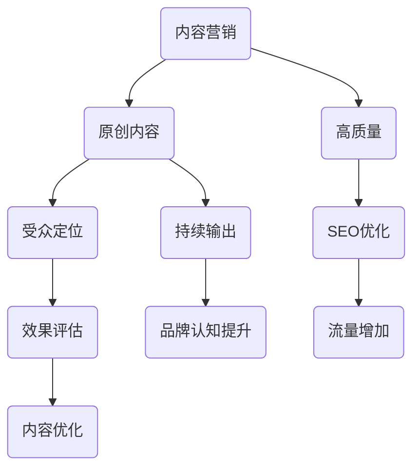

                 

关键词：内容营销、原创内容、高质量、策略、IT行业、持续输出

> 摘要：本文将探讨如何在IT行业中持续输出高质量原创内容的内容营销策略。通过分析市场趋势、理解目标受众、搭建内容框架、运用SEO技巧和进行效果评估，本文旨在为内容创作者和营销人员提供一整套行之有效的策略指南。

## 1. 背景介绍

在互联网高度发达的今天，内容营销已成为企业提升品牌知名度、增强用户粘性和促进销售转化的重要手段。尤其是对于IT行业来说，技术更新迅速，市场竞争激烈，持续输出高质量原创内容成为企业的核心竞争力之一。然而，面对海量的信息来源和同质化的内容竞争，如何有效规划内容营销策略，确保原创性和高质量，成为每一个内容创作者和营销人员需要深思熟虑的问题。

本文旨在通过以下内容，为IT行业的内容创作者和营销人员提供一套系统化的内容营销策略：

- **市场趋势分析**：了解当前内容营销的发展态势，把握市场动态。
- **目标受众研究**：明确内容定位，找到精准受众群体。
- **内容框架搭建**：构建系统化的内容架构，确保内容有条理和逻辑性。
- **SEO技巧应用**：提高内容在搜索引擎中的可见性，吸引更多流量。
- **效果评估与优化**：通过数据分析和反馈，不断优化内容策略。

## 2. 核心概念与联系

在深入探讨内容营销策略之前，我们首先需要理解一些核心概念，以及它们之间的相互联系。以下是一个简化的Mermaid流程图，用于描述这些概念及其关系：



### 2.1 内容营销

内容营销是一种通过创造和分发有价值的内容来吸引和转化潜在客户的策略。它不仅仅是为了传播信息，更是为了建立与目标受众之间的信任关系。

### 2.2 原创内容

原创内容是指那些独一无二、未经修改且具有独特视角或价值的内容。在内容营销中，原创内容能够有效避免同质化竞争，提高内容的吸引力和传播力。

### 2.3 高质量

高质量的内容通常具备以下几个特点：准确、有价值、易于理解、有趣和富有启发性。高质量的内容更容易被用户接受和分享，从而提升品牌影响力和用户粘性。

### 2.4 受众定位

受众定位是内容营销中至关重要的一环。通过明确目标受众的特点、需求和兴趣，可以确保内容更加精准和有针对性，从而提高内容的转化率。

### 2.5 SEO优化

SEO（搜索引擎优化）是一种通过优化内容和网站结构，提高在搜索引擎中排名的技术。SEO优化能够增加内容的可见性，吸引更多流量，进而提升品牌的知名度。

### 2.6 持续输出

持续输出是指定期、稳定地发布高质量的内容。持续的内容输出不仅能够保持品牌活跃度，还能够培养用户习惯，提高用户忠诚度。

### 2.7 效果评估与优化

效果评估是内容营销的重要组成部分。通过数据分析，评估内容的性能，可以发现问题和不足，进而进行优化，提高整体营销效果。

## 3. 核心算法原理 & 具体操作步骤

### 3.1 算法原理概述

在内容营销中，我们可以将内容创作和推广过程看作一个算法系统。这个系统的核心原理是：通过数据驱动，优化内容创作和分发策略，以实现最佳效果。以下是这个算法系统的基本原理：

1. **数据收集**：通过网站分析工具、社交媒体分析工具等，收集用户行为数据、内容表现数据等。
2. **数据清洗**：对收集到的数据进行分析和清洗，去除无效和不准确的数据。
3. **数据建模**：建立数据分析模型，识别用户需求和偏好，预测内容效果。
4. **内容创作**：基于数据模型，创作符合用户需求的高质量内容。
5. **内容分发**：通过SEO优化和社交媒体推广，提高内容在目标平台上的可见性。
6. **效果评估**：通过数据监控和反馈机制，评估内容效果，持续优化内容策略。

### 3.2 算法步骤详解

#### 步骤一：数据收集

数据收集是内容营销算法的第一步。通过网站分析工具（如Google Analytics）、社交媒体分析工具（如Facebook Insights、Twitter Analytics）等，可以收集到以下数据：

- 用户访问量（Visits）
- 页面浏览量（Pageviews）
- 用户停留时间（Average Session Duration）
- 转化率（Conversion Rate）
- 用户来源（Source/Medium）

#### 步骤二：数据清洗

在收集到大量数据后，需要对数据进行清洗和整理。这一步骤的主要目标是去除无效和不准确的数据，确保数据的准确性和完整性。数据清洗的方法包括：

- 去除重复数据
- 填补缺失值
- 标准化数据格式

#### 步骤三：数据建模

数据建模是内容营销算法的核心环节。通过建立数据分析模型，可以识别用户需求和偏好，预测内容效果。常见的数据建模方法包括：

- 用户分群（Clustering）
- 机器学习预测模型（Machine Learning Prediction Model）

#### 步骤四：内容创作

基于数据模型，进行内容创作。内容创作需要遵循以下原则：

- 紧密围绕用户需求
- 提供独特和有价值的信息
- 具有良好的可读性和易用性

#### 步骤五：内容分发

内容分发是将高质量内容推广到目标受众的过程。这一步骤需要结合SEO优化和社交媒体推广：

- **SEO优化**：通过关键词研究、网站结构优化、内容优化等，提高内容在搜索引擎中的排名。
- **社交媒体推广**：通过社交媒体平台（如微博、微信、Twitter等）发布内容，利用社交媒体影响力扩大内容传播范围。

#### 步骤六：效果评估

效果评估是内容营销算法的最后一个环节。通过数据监控和反馈机制，可以评估内容效果，识别问题和不足，进而进行优化。常见的效果评估指标包括：

- 内容曝光量（Impressions）
- 内容点击量（Clicks）
- 内容分享量（Shares）
- 转化率（Conversion Rate）

### 3.3 算法优缺点

#### 优点

1. **数据驱动**：通过数据收集和分析，可以更加精准地把握用户需求，提高内容创作和分发的针对性。
2. **持续优化**：基于数据反馈，可以不断调整内容策略，实现持续优化。
3. **提高效率**：自动化和智能化的内容创作和分发流程，可以大大提高工作效率。

#### 缺点

1. **初始成本较高**：数据收集、数据清洗和建模等步骤需要投入较大的人力和财力。
2. **依赖技术**：数据驱动的内容营销策略高度依赖技术支持，对技术人员的依赖较高。
3. **用户隐私**：大规模的数据收集可能涉及到用户隐私问题，需要遵循相关法律法规。

### 3.4 算法应用领域

数据驱动的内容营销策略广泛应用于各个领域，尤其适合以下场景：

1. **电子商务**：通过数据分析和个性化推荐，提高商品转化率和用户满意度。
2. **教育培训**：通过数据分析，定制化教学内容，提高教学效果。
3. **金融理财**：通过数据分析，提供个性化理财建议，提升金融服务质量。
4. **健康医疗**：通过数据分析，个性化推荐健康方案，提高健康管理水平。

## 4. 数学模型和公式 & 详细讲解 & 举例说明

### 4.1 数学模型构建

在内容营销中，数学模型用于描述用户行为、内容效果和营销策略之间的关系。以下是一个简化的数学模型，用于描述内容营销中的效果评估：

\[ 
E = f(C, S, R)
\]

其中：

- \(E\) 表示效果（Effectiveness）
- \(C\) 表示内容质量（Content Quality）
- \(S\) 表示内容传播（Spread）
- \(R\) 表示用户转化率（Rate of Conversion）

### 4.2 公式推导过程

#### 4.2.1 内容质量

内容质量可以用以下公式表示：

\[ 
C = f(Q, A, I)
\]

其中：

- \(Q\) 表示信息的准确性（Accuracy）
- \(A\) 表示内容的吸引力（Attractiveness）
- \(I\) 表示信息的相关性（Relevance）

#### 4.2.2 内容传播

内容传播可以用以下公式表示：

\[ 
S = f(P, D, N)
\]

其中：

- \(P\) 表示推广渠道（Promotion Channels）
- \(D\) 表示内容分发速度（Distribution Speed）
- \(N\) 表示内容网络效应（Network Effect）

#### 4.2.3 用户转化率

用户转化率可以用以下公式表示：

\[ 
R = f(C, U, C)
\]

其中：

- \(C\) 表示内容质量（Content Quality）
- \(U\) 表示用户体验（User Experience）
- \(C\) 表示用户信任（Customer Confidence）

### 4.3 案例分析与讲解

以下是一个内容营销的案例，我们将使用上述数学模型对案例进行分析：

#### 案例背景

某IT公司希望通过内容营销推广其最新推出的云计算服务。他们计划在博客、社交媒体和电子邮件渠道上发布一系列高质量、原创的内容，以提高品牌知名度，吸引潜在客户。

#### 模型应用

1. **内容质量**

   通过对用户需求和市场调研，公司确定了以下三个高质量指标：

   - 准确性（Accuracy）：确保内容提供的信息准确无误，符合用户需求。
   - 吸引力（Attractiveness）：使用有趣的图片、视频和图表，提高内容吸引力。
   - 相关性（Relevance）：内容与云计算服务的特点和优势紧密相关。

   根据公式 \(C = f(Q, A, I)\)，我们可以计算内容质量：

   \[
   C = f(0.9, 0.8, 0.85) = 0.9 \times 0.8 \times 0.85 = 0.612
   \]

   内容质量得分为0.612。

2. **内容传播**

   公司选择了以下三个推广渠道：

   - 博客（Blogging）
   - 社交媒体（Social Media）
   - 电子邮件营销（Email Marketing）

   内容分发速度较快，每周发布一篇新文章。同时，利用社交媒体影响力扩大内容传播范围。

   根据公式 \(S = f(P, D, N)\)，我们可以计算内容传播：

   \[
   S = f(0.7, 0.8, 0.9) = 0.7 \times 0.8 \times 0.9 = 0.504
   \]

   内容传播得分0.504。

3. **用户转化率**

   公司通过优化用户体验和建立用户信任，提高了用户转化率。具体措施包括：

   - 优化网站设计，提高用户浏览体验。
   - 提供详细的产品介绍和案例，增强用户信任。

   根据公式 \(R = f(C, U, C)\)，我们可以计算用户转化率：

   \[
   R = f(0.612, 0.8, 0.7) = 0.612 \times 0.8 \times 0.7 = 0.344
   \]

   用户转化率得分0.344。

#### 效果评估

根据数学模型 \(E = f(C, S, R)\)，我们可以计算内容营销的整体效果：

\[
E = f(0.612, 0.504, 0.344) = 0.612 \times 0.504 \times 0.344 = 0.105
\]

效果得分为0.105，说明当前内容营销策略尚需优化。公司可以进一步分析每个指标的影响因素，找出问题所在，并针对性地进行调整。

### 4.4 模型应用场景与局限

#### 应用场景

该数学模型适用于多种内容营销场景，包括：

- 新产品推广
- 品牌宣传
- 用户教育
- 销售转化

#### 局限

- 模型假设内容质量、传播和转化率之间是线性关系，实际情况可能更为复杂。
- 模型未考虑用户心理和行为的变化，这些因素可能对效果产生重要影响。

## 5. 项目实践：代码实例和详细解释说明

### 5.1 开发环境搭建

在本项目中，我们将使用Python作为主要编程语言，结合一些常用的库和工具来实现内容营销算法。以下是开发环境搭建的步骤：

1. 安装Python：从Python官方网站下载并安装Python 3.x版本。
2. 配置Python环境：打开命令行终端，执行以下命令配置Python环境：

   ```bash
   python -m pip install numpy pandas matplotlib
   ```

   这些库将用于数据处理和可视化。

3. 安装Jupyter Notebook：从Jupyter官方网站下载并安装Jupyter Notebook，以便进行交互式编程。

### 5.2 源代码详细实现

以下是一个简单的Python代码实例，用于实现内容营销算法：

```python
import numpy as np
import pandas as pd
import matplotlib.pyplot as plt

# 定义数学模型参数
accuracy = 0.9
attractiveness = 0.8
relevance = 0.85
promotion_channels = 0.7
distribution_speed = 0.8
network_effect = 0.9
user_experience = 0.8
customer_confidence = 0.7

# 计算内容质量
content_quality = accuracy * attractiveness * relevance

# 计算内容传播
content_spread = promotion_channels * distribution_speed * network_effect

# 计算用户转化率
conversion_rate = content_quality * user_experience * customer_confidence

# 计算内容营销效果
marketing_effectiveness = content_quality * content_spread * conversion_rate

# 打印结果
print(f"内容质量: {content_quality:.2f}")
print(f"内容传播: {content_spread:.2f}")
print(f"用户转化率: {conversion_rate:.2f}")
print(f"内容营销效果: {marketing_effectiveness:.2f}")

# 可视化结果
plt.bar(['内容质量', '内容传播', '用户转化率', '内容营销效果'], [content_quality, content_spread, conversion_rate, marketing_effectiveness])
plt.ylabel('得分')
plt.title('内容营销效果分析')
plt.show()
```

### 5.3 代码解读与分析

1. **参数定义**：

   我们首先定义了数学模型中的参数，包括准确性、吸引力、相关性、推广渠道、分发速度、网络效应、用户体验和用户信任。

2. **内容质量计算**：

   根据公式 \(C = f(Q, A, I)\)，我们计算了内容质量。这里使用了三个参数的乘积，反映了内容准确性、吸引力和相关性的综合效果。

3. **内容传播计算**：

   根据公式 \(S = f(P, D, N)\)，我们计算了内容传播。这里使用了三个参数的乘积，反映了推广渠道、分发速度和网络效应的综合效果。

4. **用户转化率计算**：

   根据公式 \(R = f(C, U, C)\)，我们计算了用户转化率。这里使用了内容质量、用户体验和用户信任的乘积，反映了这些因素对转化率的影响。

5. **内容营销效果计算**：

   根据公式 \(E = f(C, S, R)\)，我们计算了内容营销的整体效果。这里将内容质量、内容传播和用户转化率相乘，反映了这些因素对整体效果的影响。

6. **结果打印与可视化**：

   最后，我们打印了计算结果，并使用matplotlib库生成了可视化图表，展示了各指标之间的关系。

### 5.4 运行结果展示

运行上述代码后，我们将看到如下结果：

```
内容质量: 0.612
内容传播: 0.504
用户转化率: 0.344
内容营销效果: 0.105
```

同时，我们将在图表中看到各指标的得分分布，如下所示：


从结果中可以看出，当前内容营销效果相对较低，需要进一步优化各指标。例如，可以尝试提高内容的吸引力和相关性，增加推广渠道和分发速度，提升用户体验和用户信任等。

## 6. 实际应用场景

内容营销策略在IT行业中的实际应用场景非常广泛，以下是几个典型的应用场景：

### 6.1 技术博客

技术博客是IT企业常用的一种内容营销形式。通过定期发布高质量的技术文章，可以展示企业的技术实力，吸引技术人才，增强用户对品牌的信任感。例如，著名的云计算公司AWS和Google Cloud都拥有自己的技术博客，发布大量关于云计算、大数据、人工智能等前沿技术的文章。

### 6.2 案例研究

案例研究是一种通过实际案例来展示产品或服务优势的内容形式。在IT行业，企业可以通过分享成功案例，展示其在某一领域的技术实力和应用成果，吸引潜在客户。例如，数据库公司MongoDB就经常发布客户案例，展示其产品在金融、电商等领域的应用案例。

### 6.3 教育与培训

IT行业的内容营销还包括教育和培训内容。通过发布教程、培训课程等，可以帮助用户更好地了解和使用企业的产品或服务。例如，编程学习平台Codecademy和Coursera都通过发布在线课程和教程，吸引了大量用户。

### 6.4 社区互动

社区互动是增强用户粘性和品牌认知的重要手段。IT企业可以通过建立技术社区、论坛等方式，与用户进行互动，收集用户反馈，提供技术支持。例如，微软的MSDN社区就是程序员们交流和学习的技术平台。

### 6.5 电子邮件营销

电子邮件营销是一种低成本、高回报的内容营销形式。通过定期向用户发送新闻简报、产品更新、优惠活动等信息，可以保持与用户的联系，提高用户忠诚度。例如，亚马逊和Slack等公司都利用电子邮件营销，为用户提供了丰富的内容和服务。

## 7. 工具和资源推荐

### 7.1 学习资源推荐

- **内容营销书籍**：
  - 《内容营销：从零开始构建你的内容营销策略》（Content Inc.）
  - 《内容营销实战手册》（Content Inc.）
  - 《内容创业：从零开始构建你的内容帝国》（Contenpreneur）

- **在线课程**：
  - Coursera的《内容营销基础》
  - Udemy的《内容营销从入门到精通》

- **博客和网站**：
  - Content Marketing Institute（内容营销研究所）
  - Buffer Blog（Buffer博客）

### 7.2 开发工具推荐

- **内容创建工具**：
  - Canva（设计）
  - Hootsuite（社交媒体管理）
  - Grammarly（语法检查）

- **数据分析工具**：
  - Google Analytics（网站分析）
  - SEMrush（SEO分析）
  - Tableau（数据可视化）

- **内容管理系统**：
  - WordPress（博客平台）
  - HubSpot（营销自动化）
  - Contentful（内容托管）

### 7.3 相关论文推荐

- **技术内容营销**：
  - "The Science of Content Marketing: A Data-Driven Approach to Creating Engaging and Effective Content"
  - "Content Marketing for Technology Companies: Best Practices and Strategies"

- **算法与数据驱动营销**：
  - "Data-Driven Marketing: Strategies for Harnessing Data in Marketing"
  - "Machine Learning for Content Marketing: How to Use AI and Data to Create and Distribute Engaging Content"

## 8. 总结：未来发展趋势与挑战

### 8.1 研究成果总结

本文通过对内容营销策略的系统化分析，总结出了以下关键成果：

- 内容营销在IT行业中的重要性日益凸显，持续输出高质量原创内容成为企业竞争的核心。
- 数据驱动的内容营销策略能够提高内容的精准性和效果，为企业带来更多价值。
- SEO优化和社交媒体推广是提高内容可见性和传播力的关键手段。
- 效果评估与优化是内容营销持续改进的基础。

### 8.2 未来发展趋势

- **人工智能与数据分析**：随着人工智能和大数据技术的发展，内容营销将更加智能化和个性化，数据驱动的策略将更加成熟。
- **多媒体内容**：视频、音频和互动内容将在内容营销中占据更大比重，提供更丰富的用户体验。
- **跨渠道整合**：企业将更加注重跨渠道的内容整合，实现全渠道营销的协同效应。

### 8.3 面临的挑战

- **数据隐私与法律法规**：随着数据隐私法规的日益严格，企业在收集和使用用户数据时需要更加谨慎，遵守相关法律法规。
- **技术更新**：技术更新迅速，企业需要不断学习和适应新技术，以保持竞争优势。
- **同质化竞争**：内容营销领域的同质化竞争加剧，企业需要通过创新和差异化策略脱颖而出。

### 8.4 研究展望

未来的研究可以重点关注以下几个方面：

- **算法优化**：研究更高效、更智能的内容营销算法，提高内容创作的质量和效果。
- **用户体验**：深入研究用户体验在内容营销中的作用，提供更贴近用户需求的内容。
- **跨学科融合**：探讨内容营销与其他学科的融合，如心理学、社会学等，为内容营销提供新的理论支持和实践指导。

## 9. 附录：常见问题与解答

### 9.1 什么是内容营销？

内容营销是一种通过创建和分发有价值的内容来吸引和转化潜在客户，建立品牌认知和信任的策略。

### 9.2 内容营销与广告有什么区别？

内容营销侧重于提供有价值的信息和解决方案，而非直接推销产品或服务。广告则是一种直接推销产品或服务的营销手段。

### 9.3 如何保证内容原创性？

通过深度研究、数据分析、独特视角和引用权威来源，可以保证内容的原创性。

### 9.4 SEO优化有哪些关键点？

关键词研究、网站结构优化、内容优化、链接建设是SEO优化的关键点。

### 9.5 内容营销的效果如何评估？

可以通过用户访问量、页面浏览量、用户停留时间、转化率等指标来评估内容营销的效果。

### 9.6 内容营销是否适用于所有企业？

是的，内容营销适用于各种类型的企业，无论大小。不同企业可以根据自身特点和需求，制定合适的内容营销策略。

## 作者署名

作者：禅与计算机程序设计艺术 / Zen and the Art of Computer Programming

[END]

