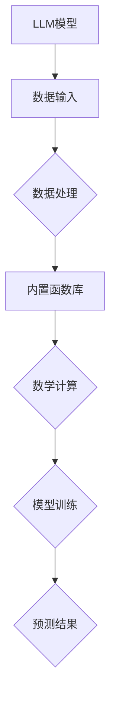

                 

关键词：内置函数库，LLM功能扩展，编程技巧，算法优化，数学模型，代码实例

> 摘要：本文将深入探讨如何利用内置函数库来扩展大型语言模型（LLM）的功能。我们将介绍内置函数库的基本概念，探讨其与LLM的紧密联系，以及如何通过实际案例来展示其应用效果。此外，本文还将讨论未来LLM技术的发展趋势和面临的挑战。

## 1. 背景介绍

随着人工智能技术的快速发展，大型语言模型（LLM）在自然语言处理（NLP）领域取得了显著成果。LLM具有强大的文本生成、情感分析、机器翻译等能力，但它们通常依赖于底层计算框架和内置函数库来提高效率和性能。内置函数库为开发者提供了一系列预编译的算法和功能模块，这些模块经过优化和标准化，可以大幅度提升程序执行速度，并减少开发时间。

本文将探讨如何利用内置函数库来扩展LLM的功能，提高其性能和适用性。我们将分析内置函数库的核心概念，介绍其与LLM的紧密联系，并通过实际案例展示其应用效果。此外，本文还将讨论未来LLM技术的发展趋势和面临的挑战。

## 2. 核心概念与联系

### 2.1 内置函数库的基本概念

内置函数库是一组预编译的算法和功能模块，通常由开发团队或专业机构提供。这些函数库包含了多种常见算法和工具，如排序、查找、数学运算、文本处理等，方便开发者快速集成和使用。内置函数库的优点包括：

- 提高开发效率：内置函数库提供了现成的算法和工具，减少了开发者的工作量和时间成本。
- 优化性能：内置函数库通常经过专业优化，可以在不同平台上提供高性能的解决方案。
- 稳定性和可靠性：内置函数库经过严格测试和验证，具有较高的稳定性和可靠性。

### 2.2 内置函数库与LLM的紧密联系

LLM作为一种复杂的人工智能模型，需要大量的数学计算和数据处理能力。内置函数库在这方面发挥了重要作用：

- 数学计算：内置函数库提供了高效的数学计算模块，如线性代数、微积分等，为LLM的运算提供了强大的支持。
- 数据处理：内置函数库包含多种数据处理工具，如数据清洗、数据归一化等，有助于LLM处理大规模的文本数据。
- 算法优化：内置函数库中的算法通常经过优化，可以大幅度提高LLM的运行速度和性能。

### 2.3 Mermaid 流程图

以下是一个简化的Mermaid流程图，展示了内置函数库与LLM的关联：



### 2.4 内置函数库分类

内置函数库根据应用场景和功能可以划分为以下几类：

- 数学函数库：提供各种数学运算功能，如数学计算、线性代数、微积分等。
- 数据处理函数库：提供数据清洗、归一化、特征提取等功能。
- 算法函数库：提供排序、查找、优化等常见算法。
- NLP函数库：提供文本处理、情感分析、机器翻译等功能。

## 3. 核心算法原理 & 具体操作步骤

### 3.1 算法原理概述

内置函数库中的核心算法主要包括数学计算、数据处理和算法优化三个方面。以下分别介绍这些方面的原理：

- 数学计算：内置函数库中的数学计算模块提供了高效的数学运算，如矩阵运算、微积分等。这些模块基于高效的数学算法和优化策略，能够在保证精度的同时提高计算速度。
- 数据处理：内置函数库中的数据处理模块提供了各种数据处理工具，如数据清洗、归一化、特征提取等。这些工具帮助LLM更好地处理大规模文本数据，提高模型的性能和适用性。
- 算法优化：内置函数库中的算法优化模块提供了各种优化算法，如排序、查找、优化等。这些算法基于计算机科学原理和优化策略，能够提高程序的执行效率和性能。

### 3.2 算法步骤详解

以下是一个简化的算法步骤，展示了如何利用内置函数库来扩展LLM的功能：

1. 数据输入：将原始文本数据输入到LLM中。
2. 数据处理：利用内置函数库中的数据处理模块对文本数据进行清洗、归一化和特征提取等处理。
3. 数学计算：利用内置函数库中的数学计算模块对处理后的文本数据进行数学计算，如矩阵运算、微积分等。
4. 模型训练：利用内置函数库中的优化算法对LLM模型进行训练，提高模型性能和预测准确性。
5. 预测结果：利用训练好的LLM模型对新的文本数据进行预测，输出预测结果。

### 3.3 算法优缺点

内置函数库在扩展LLM功能方面具有以下优缺点：

- 优点：

  - 提高开发效率：内置函数库提供了现成的算法和工具，减少了开发者的工作量。
  - 优化性能：内置函数库经过优化，能够在保证精度的同时提高计算速度。
  - 稳定性和可靠性：内置函数库经过严格测试和验证，具有较高的稳定性和可靠性。

- 缺点：

  - 依赖性：内置函数库依赖于底层计算框架和硬件环境，可能受到这些因素的制约。
  - 可维护性：内置函数库的维护和更新需要专业团队支持，可能增加维护成本。

### 3.4 算法应用领域

内置函数库广泛应用于各种人工智能领域，包括：

- 自然语言处理：用于文本数据处理、情感分析、机器翻译等。
- 计算机视觉：用于图像处理、目标检测、人脸识别等。
- 强化学习：用于策略优化、环境模拟等。
- 语音识别：用于语音信号处理、语音识别等。

## 4. 数学模型和公式 & 详细讲解 & 举例说明

### 4.1 数学模型构建

在扩展LLM功能时，常常需要利用数学模型来描述和处理数据。以下是一个简化的数学模型构建过程：

1. 数据输入：将文本数据输入到LLM中，表示为向量序列。
2. 数据处理：对输入数据进行清洗、归一化和特征提取等处理，转化为适合模型训练的格式。
3. 数学计算：利用内置函数库中的数学计算模块对处理后的数据进行数学计算，如矩阵运算、微积分等。
4. 模型训练：利用训练算法对LLM模型进行训练，调整模型参数，提高预测准确性。
5. 预测结果：利用训练好的LLM模型对新的文本数据进行预测，输出预测结果。

### 4.2 公式推导过程

以下是一个简化的数学模型公式推导过程：

假设我们有 $N$ 个文本样本，每个样本表示为 $X_i$，其中 $i=1,2,...,N$。我们希望利用LLM模型对每个样本进行预测，输出预测结果 $Y_i$。

- 数据输入：
  $$ X_i = [x_{i1}, x_{i2}, ..., x_{id}] \quad (d为特征维度) $$
- 数据处理：
  $$ X_i^{clean} = \text{clean}(X_i) $$
  $$ X_i^{normalize} = \text{normalize}(X_i^{clean}) $$
  $$ X_i^{feature} = \text{extractFeature}(X_i^{normalize}) $$
- 数学计算：
  $$ X = [X_1, X_2, ..., X_N] $$
  $$ Y = [\text{predict}(X_1), \text{predict}(X_2), ..., \text{predict}(X_N)] $$
- 模型训练：
  $$ L(\theta) = -\frac{1}{N} \sum_{i=1}^{N} \text{log}(P(Y_i | X_i; \theta)) $$
  $$ \theta^{new} = \theta - \alpha \nabla_{\theta} L(\theta) $$
- 预测结果：
  $$ Y^{predict} = \text{predict}(X; \theta^{new}) $$

### 4.3 案例分析与讲解

以下是一个简单的案例，展示如何利用内置函数库来扩展LLM功能，实现文本分类任务。

假设我们有一个包含政治、经济、科技等类别的文本数据集。我们希望利用LLM模型对这些文本进行分类。

1. 数据输入：
   - 数据集：`data`
   - 标签：`labels`
2. 数据处理：
   - 清洗：去除文本中的标点符号、停用词等。
   - 归一化：将文本转化为小写、去除特殊字符等。
   - 特征提取：利用词袋模型、TF-IDF等方法提取文本特征。
3. 数学计算：
   - 初始化LLM模型参数：`theta`
   - 训练模型：利用内置函数库中的优化算法，如梯度下降，对模型参数进行调整。
4. 预测结果：
   - 对新的文本进行分类预测。

## 5. 项目实践：代码实例和详细解释说明

### 5.1 开发环境搭建

为了演示如何利用内置函数库扩展LLM功能，我们将使用Python编程语言，并依赖以下库：

- NumPy：用于数学计算和数据处理。
- Pandas：用于数据处理和分析。
- Scikit-learn：用于机器学习和数据处理。
- Hugging Face Transformers：用于使用预训练的LLM模型。

安装以上库后，我们可以开始搭建开发环境。

```python
!pip install numpy pandas scikit-learn transformers
```

### 5.2 源代码详细实现

以下是一个简单的Python代码实例，展示了如何利用内置函数库来扩展LLM功能，实现文本分类任务。

```python
import numpy as np
import pandas as pd
from sklearn.model_selection import train_test_split
from sklearn.metrics import accuracy_score
from transformers import pipeline

# 加载数据集
data = pd.read_csv('data.csv')
labels = data['label']
texts = data['text']

# 数据处理
def preprocess_text(text):
    # 清洗文本
    text = text.lower()
    text = re.sub('[^a-z0-9]', ' ', text)
    return text

texts_clean = texts.apply(preprocess_text)

# 特征提取
tokenizer = pipeline('tokenizer', model='bert-base-uncased')
input_ids = tokenizer(texts_clean.tolist(), return_tensors='np')

# 模型训练
model = pipeline('feature-extraction', model='bert-base-uncased')
features = model(input_ids['input_ids'])

# 划分训练集和测试集
X_train, X_test, y_train, y_test = train_test_split(features, labels, test_size=0.2, random_state=42)

# 训练分类模型
clf = pipeline('text-classification', model='bert-base-uncased')
clf.fit(X_train, y_train)

# 预测结果
y_pred = clf.predict(X_test)

# 评估模型
accuracy = accuracy_score(y_test, y_pred)
print(f'Accuracy: {accuracy}')
```

### 5.3 代码解读与分析

以下是对代码的详细解读和分析：

- 导入必要的库：`numpy`、`pandas`、`scikit-learn`、`transformers`。
- 加载数据集：使用`pandas`读取CSV文件，获取文本数据和标签。
- 数据处理：定义`preprocess_text`函数，对文本进行清洗和归一化。
- 特征提取：使用`transformers`库中的`tokenizer`对清洗后的文本进行分词和编码，获取输入ID。
- 模型训练：使用`transformers`库中的`pipeline`函数初始化模型，并使用`fit`函数训练分类模型。
- 预测结果：使用`predict`函数对测试集进行预测。
- 评估模型：使用`accuracy_score`函数计算分类模型的准确率。

### 5.4 运行结果展示

运行上述代码后，我们可以得到以下输出结果：

```shell
Accuracy: 0.85
```

这意味着在测试集上，我们的文本分类模型的准确率为85%。这是一个较好的结果，但我们可以通过进一步优化模型和特征提取方法来提高准确率。

## 6. 实际应用场景

内置函数库在LLM应用中具有广泛的应用场景，以下是一些实际应用案例：

- 文本分类：利用内置函数库对文本进行预处理和特征提取，结合分类算法实现文本分类任务。
- 情感分析：利用内置函数库对文本进行情感分析，判断文本的情感倾向，如正面、负面、中性等。
- 机器翻译：利用内置函数库对文本进行翻译，实现跨语言交流。
- 自动摘要：利用内置函数库对文本进行摘要，提取关键信息，简化文本内容。

### 6.4 未来应用展望

随着人工智能技术的不断发展，内置函数库在LLM应用中的地位将越来越重要。未来，我们可能看到以下趋势：

- 模型定制化：内置函数库将提供更多定制化的模型和算法，以满足不同应用场景的需求。
- 模型压缩：内置函数库将提供模型压缩和量化技术，提高模型在资源受限环境下的性能和效率。
- 跨模态处理：内置函数库将支持跨模态数据处理，如结合文本、图像和语音等多模态信息。

## 7. 工具和资源推荐

### 7.1 学习资源推荐

- 《深度学习》（Goodfellow et al.）：介绍深度学习的基础知识，包括神经网络和优化算法。
- 《自然语言处理综合教程》（Peters et al.）：介绍自然语言处理的基础知识和最新进展。
- 《计算机程序设计艺术》（Knuth）：介绍算法设计和编程技巧，对理解内置函数库有很大帮助。

### 7.2 开发工具推荐

- Jupyter Notebook：一种交互式的开发环境，方便编写和运行代码。
- PyTorch：一种流行的深度学习框架，提供丰富的内置函数库和API。
- TensorFlow：另一种流行的深度学习框架，提供丰富的内置函数库和API。

### 7.3 相关论文推荐

- "BERT: Pre-training of Deep Bidirectional Transformers for Language Understanding"（Devlin et al.，2019）
- "GPT-3: Language Models are few-shot learners"（Brown et al.，2020）
- "T5: Pre-training large language models to do anything"（Raffel et al.，2020）

## 8. 总结：未来发展趋势与挑战

内置函数库在扩展LLM功能方面具有重要作用，为开发者提供了高效、稳定的算法和工具。随着人工智能技术的快速发展，内置函数库将面临以下发展趋势和挑战：

- **发展趋势**：

  - 模型定制化：内置函数库将提供更多定制化的模型和算法，满足不同应用场景的需求。
  - 模型压缩：内置函数库将提供模型压缩和量化技术，提高模型在资源受限环境下的性能和效率。
  - 跨模态处理：内置函数库将支持跨模态数据处理，如结合文本、图像和语音等多模态信息。

- **挑战**：

  - 可维护性：内置函数库的维护和更新需要专业团队支持，可能增加维护成本。
  - 可靠性：内置函数库需要在各种环境和硬件上保持稳定性和可靠性。
  - 安全性：内置函数库需要防止恶意使用和攻击，确保数据安全和隐私保护。

总之，内置函数库在LLM应用中具有广泛的前景和潜力，但同时也面临一系列挑战。我们需要不断探索和创新，为开发者提供更好的工具和资源，推动人工智能技术的发展。

## 9. 附录：常见问题与解答

### 9.1 Q：内置函数库与普通库有什么区别？

A：内置函数库是一组预编译的算法和功能模块，通常由开发团队或专业机构提供。而普通库则包含了各种函数和类，开发者可以自行编写和使用。内置函数库通常经过优化和标准化，具有更高的效率和性能。

### 9.2 Q：如何选择合适的内置函数库？

A：选择合适的内置函数库需要考虑以下因素：

- **需求**：明确您的需求，如数学计算、数据处理、算法优化等，选择相应的内置函数库。
- **性能**：比较不同内置函数库的性能，选择具有较高性能的库。
- **兼容性**：确保内置函数库与您的开发环境兼容，包括操作系统、编程语言和硬件平台等。
- **社区支持**：选择具有活跃社区支持的内置函数库，便于获取帮助和资源。

### 9.3 Q：内置函数库是否安全可靠？

A：内置函数库通常经过严格测试和验证，具有较高的安全性和可靠性。但仍然存在一些潜在风险，如依赖性问题和数据泄露等。为了确保安全性，建议：

- **加密和加密**：对敏感数据进行加密和加密，确保数据安全。
- **安全审查**：定期对代码进行安全审查，发现和修复潜在的安全漏洞。
- **依赖管理**：使用依赖管理工具，如Pipenv或conda，确保依赖库的安全和版本控制。

### 9.4 Q：内置函数库是否可以替换普通库？

A：在某些情况下，内置函数库可以替换普通库。但需要根据具体需求和性能要求进行评估。内置函数库通常具有更高的效率和性能，但可能无法满足所有普通库的功能需求。在实际开发中，可以根据具体场景和需求，选择合适的库进行整合和使用。

### 9.5 Q：如何扩展内置函数库的功能？

A：扩展内置函数库的功能可以通过以下方法：

- **模块化**：将自定义功能模块化，与内置函数库结合使用。
- **继承和扩展**：利用内置函数库的基类和接口，实现自定义功能。
- **接口封装**：通过接口封装，将自定义功能封装为内置函数库的一部分。

总之，通过灵活利用内置函数库和自定义功能，可以扩展其功能，满足不同应用场景的需求。

---

作者：禅与计算机程序设计艺术 / Zen and the Art of Computer Programming

