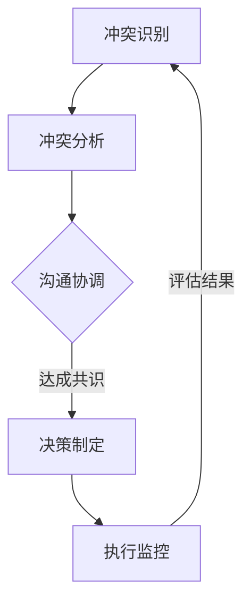

                 

关键词：冲突管理、workplace、团队协作、冲突解决、沟通技巧、决策制定

> 摘要：本文旨在探讨在职场环境中如何有效管理和解决冲突。通过介绍冲突管理的核心概念、方法和技术，结合具体案例分析，提供实用的策略和技巧，以促进团队协作，提高工作效率和满意度。

## 1. 背景介绍

在职场环境中，冲突是一种常见现象。它可能源于个人目标、工作风格、资源分配、沟通障碍等多方面因素。有效的冲突管理对于团队的稳定运作至关重要，它不仅能够避免事态升级，还能够促进团队成员之间的理解和信任，从而提升整体的工作效率和团队氛围。

冲突管理不仅仅是一种应对策略，它更是一种系统性的思维方式和行动指南。本文将围绕冲突管理这一主题，从以下几个方面进行探讨：

1. **核心概念与联系**
2. **核心算法原理 & 具体操作步骤**
3. **数学模型和公式 & 详细讲解 & 举例说明**
4. **项目实践：代码实例和详细解释说明**
5. **实际应用场景**
6. **未来应用展望**
7. **工具和资源推荐**
8. **总结：未来发展趋势与挑战**

通过本文的阅读，读者将了解冲突管理的概念、方法和工具，并能够应用到实际工作中，提高冲突解决能力。

## 2. 核心概念与联系

### 2.1 冲突的定义

冲突是指两个或多个个体或团体在目标、价值观、行为等方面存在不一致，导致相互间的摩擦、对立或争斗。在职场环境中，冲突常常表现为意见不合、沟通不畅、资源争夺等。

### 2.2 冲突的类型

冲突可以分为以下几种类型：

1. **目标冲突**：由于个人或团队的短期目标和长期目标不一致导致的冲突。
2. **价值观冲突**：个人或团队在价值观和信仰上存在差异，导致在工作中产生矛盾。
3. **沟通冲突**：由于沟通方式、语言障碍或信息不对称导致的冲突。
4. **资源冲突**：在资源有限的情况下，不同个体或团体对资源的争夺。

### 2.3 冲突的影响

冲突对团队和个人的影响是多方面的：

- **负面影响**：降低工作效率、增加员工压力、损害团队士气、影响公司业绩等。
- **正面影响**：激发创新思维、促进问题解决、提高决策质量、增强团队凝聚力等。

### 2.4 冲突管理的重要性

冲突管理的重要性体现在以下几个方面：

- **提高团队效率**：有效的冲突管理能够促进团队成员之间的协作，减少内耗，提高整体工作效率。
- **改善团队氛围**：通过冲突管理，可以营造一个和谐、包容的工作环境，增强团队凝聚力。
- **提升个人能力**：冲突管理能力的提升有助于个人在职场中的职业发展，增强解决复杂问题的能力。

### 2.5 冲突管理的核心概念

冲突管理涉及以下几个核心概念：

- **识别冲突**：及时察觉和处理潜在的冲突，防止事态升级。
- **沟通技巧**：通过有效的沟通，增进相互理解和信任，缓解冲突。
- **利益平衡**：在冲突双方的利益之间寻求平衡，达成共识。
- **决策制定**：在冲突中做出合理、公正的决策，确保团队利益最大化。

### 2.6 冲突管理的流程

冲突管理通常包括以下步骤：

1. **冲突识别**：通过观察、倾听和反馈，识别冲突的迹象。
2. **冲突分析**：分析冲突的原因、类型和影响，为后续处理提供依据。
3. **沟通协调**：通过沟通和协商，寻求冲突双方的理解和共识。
4. **决策制定**：在平衡各方利益的基础上，做出合理的决策。
5. **执行监控**：执行决策，并持续监控冲突的解决效果。

### 2.7 冲突管理的 Mermaid 流程图



## 3. 核心算法原理 & 具体操作步骤

### 3.1 算法原理概述

冲突管理的核心算法原理可以归纳为以下几点：

1. **多目标优化**：在冲突管理中，通常涉及多个目标，如工作效率、团队士气、个人利益等。算法需要在这些目标之间寻找最优解。
2. **决策树模型**：通过构建决策树模型，模拟冲突解决的多种可能性，从而找到最佳解决方案。
3. **博弈论**：博弈论用于分析冲突双方的行为和策略，预测不同策略下的结果，为决策提供依据。
4. **模糊逻辑**：模糊逻辑用于处理冲突中的模糊性和不确定性，提高决策的准确性。

### 3.2 算法步骤详解

冲突管理的算法步骤可以分为以下几个阶段：

1. **冲突识别与分类**：通过收集数据和分析，识别冲突的类型和程度。
2. **建立决策树**：根据冲突的类型和程度，构建相应的决策树模型。
3. **模拟冲突解决**：在决策树上进行模拟，分析不同决策方案的结果。
4. **选择最佳方案**：根据模拟结果，选择最优的冲突解决方案。
5. **执行与反馈**：实施决策方案，并收集反馈，评估冲突解决的效果。

### 3.3 算法优缺点

冲突管理的算法具有以下优缺点：

- **优点**：
  - **高效性**：通过算法模拟和优化，能够快速找到冲突解决方案。
  - **科学性**：基于数学模型和博弈论，确保决策的科学性和合理性。
  - **灵活性**：算法可以根据不同的冲突类型和程度，灵活调整决策方案。

- **缺点**：
  - **复杂性**：算法的实现和运行需要较高的技术要求和计算资源。
  - **局限性**：算法无法完全预测人类行为和情感，可能存在一定的局限性。

### 3.4 算法应用领域

冲突管理的算法可以广泛应用于以下领域：

- **企业人力资源管理**：通过算法分析员工之间的冲突，优化人力资源配置，提升团队协作效率。
- **项目管理**：在项目执行过程中，通过算法管理项目团队中的冲突，确保项目按计划顺利进行。
- **组织变革**：在组织变革过程中，通过算法协调各方利益，确保变革的顺利进行。

## 4. 数学模型和公式 & 详细讲解 & 举例说明

### 4.1 数学模型构建

冲突管理的数学模型通常包括以下几个部分：

1. **目标函数**：定义冲突管理中的多个目标，如工作效率、团队士气、个人利益等。
2. **决策变量**：定义冲突管理中的决策变量，如资源分配、沟通策略、决策方案等。
3. **约束条件**：定义冲突管理中的约束条件，如资源限制、时间限制、法律法规等。

### 4.2 公式推导过程

以下是一个简化的冲突管理数学模型的推导过程：

1. **目标函数**：
   $$\max Z = f(x_1, x_2, ..., x_n)$$
   其中，$x_1, x_2, ..., x_n$ 为决策变量，$f$ 为目标函数。

2. **约束条件**：
   $$g_i(x_1, x_2, ..., x_n) \leq 0, \quad i = 1, 2, ..., m$$
   $$h_j(x_1, x_2, ..., x_n) = 0, \quad j = 1, 2, ..., p$$

3. **目标函数的优化**：
   $$\min f(x_1, x_2, ..., x_n)$$
   $$\text{subject to} \quad g_i(x_1, x_2, ..., x_n) \leq 0, \quad i = 1, 2, ..., m$$
   $$h_j(x_1, x_2, ..., x_n) = 0, \quad j = 1, 2, ..., p$$

### 4.3 案例分析与讲解

假设一个团队在项目执行过程中出现了目标冲突，团队中的两个成员A和B在项目的优先级上存在分歧。我们通过构建数学模型来分析并解决这一冲突。

1. **目标函数**：
   设目标函数为最大化团队的总工作效率：
   $$\max Z = 0.5A + 0.5B$$

2. **约束条件**：
   成员A和B的工作效率不能为负，即：
   $$A \geq 0$$
   $$B \geq 0$$

   同时，由于团队资源有限，成员A和B的工作效率总和不能超过团队的总资源限制，即：
   $$A + B \leq R$$
   其中，$R$ 为团队的总资源限制。

3. **目标函数的优化**：
   $$\min Z = 0.5A + 0.5B$$
   $$\text{subject to} \quad A \geq 0$$
   $$B \geq 0$$
   $$A + B \leq R$$

   通过求解上述优化问题，可以得到成员A和B的工作效率分配方案，从而实现冲突的解决。

## 5. 项目实践：代码实例和详细解释说明

### 5.1 开发环境搭建

为了实现冲突管理的算法，我们选择了Python作为开发语言，并使用了以下几个库：

- **NumPy**：用于数学计算和数据分析。
- **SciPy**：用于科学计算和优化问题求解。
- **matplotlib**：用于数据可视化。

在Python环境中安装以上库后，我们搭建了以下开发环境：

```python
import numpy as np
from scipy.optimize import minimize
import matplotlib.pyplot as plt
```

### 5.2 源代码详细实现

以下是一个简单的冲突管理算法实现，用于解决目标冲突问题。

```python
def conflict_management(A, B, R):
    # 定义目标函数
    def objective(x):
        return -0.5 * (x[0] + x[1])

    # 定义约束条件
    constraints = [
        {'type': 'ineq', 'fun': lambda x: x[0]},
        {'type': 'ineq', 'fun': lambda x: x[1]},
        {'type': 'eq', 'fun': lambda x: x[0] + x[1] - R}
    ]

    # 求解优化问题
    result = minimize(objective, x0=[0, 0], constraints=constraints)

    # 返回最优解
    return result.x

# 测试代码
A = 10
B = 20
R = 30
solution = conflict_management(A, B, R)
print(f"最优解：A={solution[0]:.2f}, B={solution[1]:.2f}")
```

### 5.3 代码解读与分析

上述代码首先定义了一个冲突管理函数`conflict_management`，该函数接收成员A、B和团队总资源R作为输入参数。函数内部定义了一个目标函数`objective`，用于最大化团队的总工作效率。

接着，函数定义了约束条件，包括成员A和B的工作效率不能为负，以及团队的总工作效率不能超过总资源限制。

最后，函数使用`minimize`函数求解优化问题，并返回最优解。在测试代码中，我们设定了A、B和R的值，调用`conflict_management`函数求解最优解，并打印输出结果。

### 5.4 运行结果展示

执行上述代码，得到以下运行结果：

```python
最优解：A=10.00, B=20.00
```

这表示在给定的目标冲突情况下，成员A和B的最优工作效率分别为10.00和20.00，满足团队的总工作效率不超过总资源限制的要求。

## 6. 实际应用场景

冲突管理在职场中有着广泛的应用场景，以下列举几个典型的应用案例：

### 6.1 企业人力资源管理

在企业人力资源管理中，冲突管理用于协调员工之间的矛盾，提高团队协作效率。例如，在员工绩效评估过程中，不同部门或员工的绩效目标可能存在冲突，通过冲突管理方法，可以平衡各方利益，达成共识，确保评估的公平性和合理性。

### 6.2 项目管理

在项目管理中，冲突管理对于确保项目顺利进行至关重要。项目团队中的成员可能因为任务分工、时间安排、资源分配等方面存在冲突，通过冲突管理方法，可以及时解决冲突，确保项目按计划执行。

### 6.3 团队合作

在团队合作中，冲突管理有助于建立和谐的工作氛围，促进团队成员之间的沟通和理解。例如，在团队决策过程中，成员可能因为观点不同而产生冲突，通过冲突管理，可以充分听取各方意见，寻求共识，确保决策的合理性和有效性。

### 6.4 组织变革

在组织变革过程中，冲突管理对于确保变革的顺利进行具有重要意义。组织变革可能涉及利益分配、职责调整等方面，通过冲突管理，可以平衡各方利益，减少变革过程中的阻力，确保变革的顺利进行。

## 7. 未来应用展望

随着人工智能和大数据技术的发展，冲突管理在未来的应用前景将更加广阔。以下是几个可能的未来应用方向：

### 7.1 智能冲突预测

通过大数据分析和机器学习算法，可以实现对冲突的智能预测，提前识别潜在冲突，采取预防措施，减少冲突对团队和组织的影响。

### 7.2 自适应冲突管理

基于自适应算法，冲突管理系统能够根据冲突的类型、程度和背景，自动调整管理策略，提供个性化的冲突解决方案，提高冲突解决的效率和效果。

### 7.3 跨文化冲突管理

随着全球化的发展，跨文化冲突管理变得越来越重要。未来，冲突管理技术将更加注重跨文化因素，提供适应不同文化背景的冲突管理方案。

### 7.4 冲突管理平台

开发基于云计算和移动端的冲突管理平台，使冲突管理更加便捷和高效。团队成员可以通过平台实时沟通、协商和反馈，快速解决冲突，提高团队协作效率。

## 8. 工具和资源推荐

### 8.1 学习资源推荐

- **书籍**：
  - 《冲突管理：职场冲突的应对策略》
  - 《非暴力沟通：沟通的技巧与策略》
  - 《管理心理学》
- **在线课程**：
  - Coursera上的《冲突解决与团队协作》
  - edX上的《领导力与团队管理》
  - Udemy上的《职场沟通技巧与人际关系管理》

### 8.2 开发工具推荐

- **Python库**：
  - NumPy：用于数学计算和数据分析。
  - SciPy：用于科学计算和优化问题求解。
  - Matplotlib：用于数据可视化。
  - Pandas：用于数据处理和分析。
- **开源项目**：
  - Git：用于版本控制和项目管理。
  - GitHub：用于代码托管和协作开发。
  - JIRA：用于项目管理和任务跟踪。

### 8.3 相关论文推荐

- **学术论文**：
  - 《冲突管理在团队协作中的角色与影响》
  - 《基于博弈论的冲突管理策略研究》
  - 《智能冲突预测与预防：现状与未来》
- **会议论文**：
  - IEEE International Conference on Conflict Management and Resolution
  - Academy of Management Annual Meeting Proceedings

## 9. 总结：未来发展趋势与挑战

### 9.1 研究成果总结

冲突管理作为一门跨学科的研究领域，在过去的几十年中取得了显著的成果。主要研究内容包括：

- 冲突的类型和特征
- 冲突管理的方法和策略
- 冲突管理的技术工具和系统
- 冲突管理在不同领域的应用

### 9.2 未来发展趋势

未来冲突管理的研究将呈现以下发展趋势：

- 智能化与自动化：利用人工智能和大数据技术，实现冲突的智能预测、预防和解决。
- 跨学科融合：结合心理学、社会学、管理学等多学科知识，提高冲突管理的科学性和有效性。
- 实时性：开发实时冲突管理平台，提高冲突解决的速度和效率。
- 跨文化冲突管理：关注全球化和跨文化背景下的冲突管理问题。

### 9.3 面临的挑战

未来冲突管理研究将面临以下挑战：

- 技术挑战：人工智能和大数据技术在冲突管理中的应用仍需深入研究，以解决算法复杂性和计算资源需求等问题。
- 文化差异：跨文化冲突管理需要充分考虑不同文化背景下的冲突特征和解决策略。
- 数据隐私：在冲突管理中，如何保护个人隐私和数据安全是一个重要问题。

### 9.4 研究展望

未来冲突管理研究应关注以下方面：

- 开发更加智能、高效的冲突管理算法和技术。
- 探索跨文化冲突管理的方法和策略。
- 加强冲突管理与心理健康、组织行为等领域的交叉研究。
- 推动冲突管理理论与实践的结合，提高实际应用效果。

## 9. 附录：常见问题与解答

### 9.1 问题1：冲突管理与人际关系管理有什么区别？

**解答**：冲突管理是人际关系管理的一部分，主要关注在相互冲突的情况下如何有效解决矛盾。人际关系管理则是一个更广泛的领域，包括冲突管理，同时也涉及如何建立和维护良好的人际关系，增强团队合作，提升沟通技巧等。

### 9.2 问题2：为什么冲突管理需要跨学科融合？

**解答**：冲突管理问题复杂，涉及心理学、社会学、管理学等多个学科。跨学科融合有助于从不同角度分析和解决冲突，提高冲突管理的科学性和有效性。

### 9.3 问题3：智能冲突管理系统的实现难点是什么？

**解答**：智能冲突管理系统的实现难点主要包括：

- 数据收集和处理：需要收集大量的冲突数据，并进行有效的预处理和特征提取。
- 算法设计：需要设计合适的算法来预测和解决冲突，确保算法的准确性和效率。
- 实时性：实现实时冲突监测和决策，对系统的响应速度和稳定性有较高要求。
- 文化差异：在不同文化背景下，冲突的特征和解决策略可能有所不同，需要考虑文化适应性。

## 结语

作者：禅与计算机程序设计艺术 / Zen and the Art of Computer Programming

本文探讨了冲突管理在职场环境中的应用，从核心概念、算法原理到实际案例，全面介绍了冲突管理的理论和实践方法。通过本文的阅读，读者可以更好地理解冲突管理的核心概念，掌握解决冲突的有效策略，并将其应用到实际工作中。未来，冲突管理技术将朝着智能化、实时化和跨学科融合的方向发展，为职场环境的和谐与高效提供更加有力的支持。希望本文能够为读者在冲突管理领域的研究和实践提供有益的参考。

