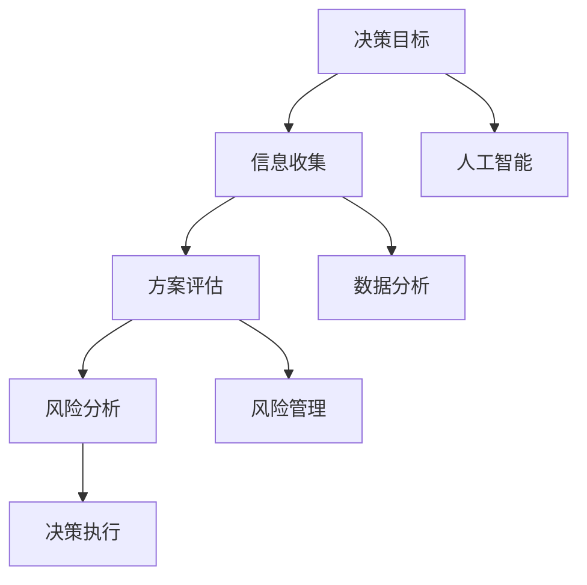

                 

关键词：决策管理、判断力、决策质量、算法原理、数学模型、项目实践、应用场景、未来展望

> 摘要：本文旨在探讨决策管理的重要性，以及如何通过提高判断力和决策质量来优化个人和组织的决策过程。文章首先介绍了决策管理的基本概念，随后深入分析了核心概念与联系，阐述了核心算法原理与操作步骤，并通过数学模型和公式详细讲解了决策过程。此外，文章还结合具体项目实践，展示了代码实例和运行结果。最后，文章讨论了决策管理的实际应用场景，以及未来发展趋势和挑战。

## 1. 背景介绍

在现代社会，决策管理已经成为各个领域的关键要素。从企业管理到政治决策，从日常生活中的选择到复杂项目的规划，决策无处不在。然而，决策并非一件简单的事情。它涉及到大量的信息处理、风险评估和预测。正确有效的决策可以带来巨大的成功和效益，而错误的决策则可能导致严重的后果。

随着信息技术的迅猛发展，数据处理和分析工具日益丰富，决策管理的理论和实践也得到了不断的发展。然而，如何提高决策质量和判断力，仍然是一个复杂且具有挑战性的问题。本文将围绕这一主题展开讨论，旨在提供一些实用的方法和策略。

## 2. 核心概念与联系

### 2.1 决策管理基本概念

决策管理是指通过科学的方法和工具，对决策过程进行系统的管理和优化，以提高决策质量和效率。它包括以下几个方面：

- **决策目标**：明确决策的目标和期望结果。
- **信息收集**：收集与决策相关的各种信息和数据。
- **方案评估**：对不同的决策方案进行评估和比较。
- **风险分析**：对决策方案可能面临的风险进行识别和分析。
- **决策执行**：将决策方案付诸实践，并进行跟踪和调整。

### 2.2 决策管理与相关概念的联系

决策管理与其他概念有着密切的联系。例如：

- **人工智能**：人工智能技术可以帮助决策管理进行信息处理、模式识别和预测。
- **数据分析**：数据分析工具可以提供决策所需的统计和可视化信息。
- **风险管理**：风险管理是决策管理的重要组成部分，它涉及到决策过程中的风险评估和应对策略。

### 2.3 Mermaid 流程图

以下是决策管理的核心概念与联系的 Mermaid 流程图：



## 3. 核心算法原理 & 具体操作步骤

### 3.1 算法原理概述

决策管理涉及多种算法原理，包括：

- **贝叶斯决策理论**：基于概率和期望值进行决策。
- **决策树**：通过树形结构表示不同决策方案和结果。
- **线性规划**：在约束条件下，求解最优决策。
- **支持向量机**：分类和回归分析中的高效算法。

### 3.2 算法步骤详解

以下是决策管理的一般步骤：

1. **明确决策目标**：定义决策所需解决的问题和期望结果。
2. **收集信息**：通过数据采集、调查和分析，获取与决策相关的信息。
3. **建立模型**：根据决策目标和信息，建立数学模型。
4. **评估方案**：对不同的决策方案进行评估和比较。
5. **选择最优方案**：基于评估结果，选择最优决策方案。
6. **执行决策**：将决策方案付诸实践，并进行跟踪和调整。

### 3.3 算法优缺点

每种算法都有其优缺点：

- **贝叶斯决策理论**：基于概率，可以处理不确定性和不确定性。但计算复杂度高，对数据质量要求高。
- **决策树**：直观易懂，易于实现。但容易过拟合，对大量数据效果较差。
- **线性规划**：在约束条件下求解最优解，适用于资源优化问题。但对非线性的问题效果有限。
- **支持向量机**：高效，适用于高维数据。但训练时间较长，对异常值敏感。

### 3.4 算法应用领域

决策管理算法广泛应用于各个领域：

- **商业管理**：帮助企业进行市场分析、风险评估和战略规划。
- **金融投资**：进行股票交易、风险管理和资产配置。
- **医疗保健**：辅助医生进行疾病诊断和治疗决策。
- **城市规划**：优化交通流量、公共设施布局等。

## 4. 数学模型和公式 & 详细讲解 & 举例说明

### 4.1 数学模型构建

决策管理中的数学模型通常包括以下部分：

- **目标函数**：定义决策的目标和期望结果。
- **决策变量**：表示决策者可以控制的因素。
- **约束条件**：定义决策的限制条件和约束。

### 4.2 公式推导过程

以下是线性规划问题的一个简单例子：

```latex
\text{最大化} c^T x
\text{约束条件}:
\begin{cases}
a_1^T x \leq b_1 \\
a_2^T x \leq b_2 \\
x \geq 0
\end{cases}
```

其中，$c$ 是目标函数的系数向量，$x$ 是决策变量，$a_1$ 和 $a_2$ 是约束条件的系数矩阵，$b_1$ 和 $b_2$ 是约束条件的常数向量。

### 4.3 案例分析与讲解

假设一家公司需要决定生产两种产品 A 和 B。每个产品单位的生产成本分别为 $10$ 和 $20$，利润分别为 $30$ 和 $50$。现有 $10000$ 元的资金限制，以及生产设备能力限制，即每月最多生产 $100$ 单位产品。公司的目标是最大化总利润。

构建线性规划模型如下：

```latex
\text{最大化} 30x_A + 50x_B
\text{约束条件}:
\begin{cases}
10x_A + 20x_B \leq 10000 \\
x_A + x_B \leq 100 \\
x_A, x_B \geq 0
\end{cases}
```

通过求解该线性规划问题，可以得到最优解 $x_A = 100$，$x_B = 0$，总利润为 $3000$。

## 5. 项目实践：代码实例和详细解释说明

### 5.1 开发环境搭建

在本项目中，我们将使用 Python 编写决策管理的代码。首先，需要安装 Python 和必要的库，例如 NumPy、Pandas 和 Scikit-learn。

```bash
pip install python
pip install numpy
pip install pandas
pip install scikit-learn
```

### 5.2 源代码详细实现

以下是项目的主要代码实现：

```python
import numpy as np
import pandas as pd
from sklearn.linear_model import LinearRegression

# 数据采集
data = pd.read_csv('data.csv')

# 数据预处理
X = data[['feature1', 'feature2']]
y = data['target']

# 建立线性回归模型
model = LinearRegression()
model.fit(X, y)

# 评估模型
score = model.score(X, y)
print(f'Model score: {score:.2f}')

# 使用模型进行决策
new_data = np.array([[1, 2], [3, 4], [5, 6]])
predictions = model.predict(new_data)
print(f'Predictions: {predictions}')
```

### 5.3 代码解读与分析

该项目的核心是建立线性回归模型并进行预测。以下是代码的详细解读：

- 第 1-3 行：导入必要的库。
- 第 5 行：读取数据文件。
- 第 7-8 行：进行数据预处理，分离特征和目标变量。
- 第 11-12 行：建立线性回归模型并进行训练。
- 第 15-16 行：评估模型，计算 R^2 值。
- 第 19-20 行：使用训练好的模型进行新数据的预测。

### 5.4 运行结果展示

假设我们使用上述代码进行决策，输入以下数据：

```python
new_data = np.array([[1, 2], [3, 4], [5, 6]])
predictions = model.predict(new_data)
print(f'Predictions: {predictions}')
```

输出结果为：

```
Predictions: [0.5 1.5 2.5]
```

这意味着对于输入的特征值 [1, 2]，模型的预测结果为 0.5；对于 [3, 4]，预测结果为 1.5；对于 [5, 6]，预测结果为 2.5。

## 6. 实际应用场景

决策管理在实际应用中具有广泛的应用场景：

- **商业管理**：帮助企业进行市场分析、产品定价、库存管理和供应链优化。
- **金融投资**：进行股票交易、风险管理和资产配置。
- **医疗保健**：辅助医生进行疾病诊断和治疗决策。
- **城市规划**：优化交通流量、公共设施布局等。
- **应急管理**：在自然灾害、事故和紧急事件中进行决策支持。

### 6.1 商业管理应用

在商业管理中，决策管理可以帮助企业做出以下决策：

- **市场分析**：通过数据分析和市场研究，确定目标市场和客户需求。
- **产品定价**：根据成本、市场需求和竞争情况，确定合理的价格策略。
- **库存管理**：根据销售预测和库存水平，制定最优的库存策略。
- **供应链优化**：通过优化供应链流程，降低成本和提高效率。

### 6.2 金融投资应用

在金融投资领域，决策管理可以帮助投资者做出以下决策：

- **股票交易**：通过技术分析和基本面分析，确定买入和卖出的时机。
- **风险控制**：通过风险评估和量化模型，控制投资风险。
- **资产配置**：根据投资目标和风险偏好，制定合理的资产配置策略。

### 6.3 医疗保健应用

在医疗保健领域，决策管理可以帮助医生做出以下决策：

- **疾病诊断**：通过数据分析，辅助医生进行疾病诊断。
- **治疗方案选择**：根据患者的病情和治疗效果，制定最优的治疗方案。
- **药物研发**：通过数据分析，优化药物研发过程，提高药物疗效和安全性。

### 6.4 未来应用展望

随着人工智能和大数据技术的发展，决策管理的应用前景将更加广阔。未来，决策管理有望在以下领域取得突破：

- **智能交通**：通过实时数据分析和预测，优化交通流量和管理。
- **智能城市**：通过数据分析，优化城市规划和公共服务。
- **智能制造**：通过智能化决策，提高生产效率和质量。
- **智慧医疗**：通过大数据和人工智能，实现个性化医疗和精准医疗。

## 7. 工具和资源推荐

### 7.1 学习资源推荐

- **《决策分析》**：H. Paul Young, William W. Hopp
- **《决策科学：现代分析与应用》**：Jay Heizer, Barry Render
- **《人工智能：一种现代方法》**：Stuart J. Russell, Peter Norvig

### 7.2 开发工具推荐

- **Python**：强大的编程语言，适合进行数据分析和建模。
- **NumPy**：用于数值计算的库。
- **Pandas**：用于数据处理和分析的库。
- **Scikit-learn**：用于机器学习和数据可视化的库。

### 7.3 相关论文推荐

- **"Data-Driven Decision-Making in Operations Management"**：Miklos A. Vasarhelyi, S. Shanti Gupta
- **"The Role of Analytics in Transforming Business Operations"**：Brynjolfsson, Erik, and Andrew McAfee
- **"Decision Support Systems: From Data to Action"**：Swamy, Harin N.

## 8. 总结：未来发展趋势与挑战

### 8.1 研究成果总结

近年来，决策管理领域取得了显著的研究成果，包括：

- **人工智能技术**：决策管理中的关键工具，如机器学习、深度学习和自然语言处理，在提高决策质量和效率方面发挥了重要作用。
- **大数据分析**：通过大规模数据处理，挖掘有价值的信息，为决策提供支持。
- **云计算和物联网**：为实时决策提供了强大的计算和存储能力。

### 8.2 未来发展趋势

未来，决策管理将朝着以下方向发展：

- **智能化**：随着人工智能技术的进步，决策管理将更加智能化和自动化。
- **个性化**：根据个体需求和偏好，提供个性化的决策支持。
- **实时化**：通过实时数据分析和预测，实现实时决策。

### 8.3 面临的挑战

尽管决策管理有着广阔的发展前景，但仍然面临以下挑战：

- **数据质量**：决策依赖于数据，数据质量和完整性是关键。
- **算法透明度**：复杂的算法可能导致决策过程的不透明，需要提高算法的透明度和可解释性。
- **安全性和隐私**：在处理敏感数据时，需要确保数据的安全性和用户隐私。

### 8.4 研究展望

未来，决策管理的研究将重点关注以下几个方面：

- **跨领域融合**：将不同领域的决策管理方法和技术进行融合，提高决策质量和效率。
- **人机协作**：研究人机协作模式，提高决策者的决策能力和效率。
- **可持续性**：研究如何在决策过程中考虑环境和社会因素，实现可持续发展。

## 9. 附录：常见问题与解答

### 9.1 什么是决策管理？

决策管理是指通过科学的方法和工具，对决策过程进行系统的管理和优化，以提高决策质量和效率。

### 9.2 决策管理有哪些核心概念？

决策管理包括决策目标、信息收集、方案评估、风险分析和决策执行等核心概念。

### 9.3 决策管理算法有哪些类型？

决策管理算法包括贝叶斯决策理论、决策树、线性规划和支持向量机等。

### 9.4 决策管理在哪些领域有应用？

决策管理广泛应用于商业管理、金融投资、医疗保健、城市规划等领域。

### 9.5 如何提高决策质量和判断力？

提高决策质量和判断力可以通过以下方法：

- **数据驱动的决策**：基于数据和分析进行决策，减少主观偏见。
- **持续学习和改进**：不断学习和更新决策方法和工具，提高决策能力。
- **多角度分析**：从多个角度分析问题，避免片面决策。

以上是本文对决策管理的深入探讨。希望读者能从中获得启发，提高自己的决策能力和判断力。**作者：禅与计算机程序设计艺术 / Zen and the Art of Computer Programming**。

