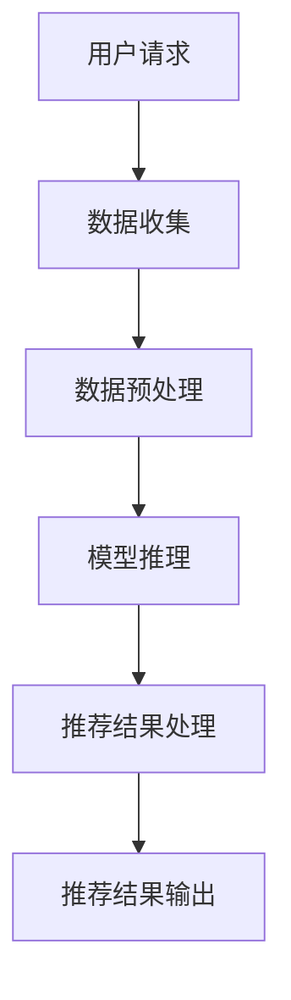

                 

关键词：大模型推荐，推理延迟，multi-segment late interaction，性能优化，算法原理，数学模型，项目实践，应用场景，未来展望

> 摘要：随着大数据和人工智能技术的飞速发展，大模型推荐系统在互联网应用中扮演着越来越重要的角色。然而，这些大模型通常需要大量的计算资源，导致推荐系统的推理延迟较高，影响了用户体验。本文旨在介绍一种名为multi-segment late interaction的技术，通过分段延迟交互的方式，有效地减小大模型的推荐推理延迟，提升系统性能。

## 1. 背景介绍

随着互联网的快速发展，人们对于个性化推荐的需求日益增加。推荐系统作为连接用户与内容的桥梁，极大地提升了用户体验。目前，基于深度学习的大模型推荐系统已成为业界的主流技术。然而，大模型推荐系统面临着一系列挑战，其中最为显著的是推理延迟问题。

推理延迟是指推荐系统从接收用户请求到输出推荐结果所需的时间。在大模型推荐系统中，由于模型的复杂性和数据量的庞大，推理延迟通常较高，这对于用户实时体验产生了负面影响。减小推理延迟，成为大模型推荐系统优化的重要方向。

## 2. 核心概念与联系

### 2.1 multi-segment late interaction原理

multi-segment late interaction（分段延迟交互）是一种针对大模型推荐系统的性能优化技术。其核心思想是将推荐系统的推理过程分成多个阶段，每个阶段都允许一定的延迟，从而在整体上减小推理延迟。

具体来说，multi-segment late interaction技术将整个推理过程分为以下几个阶段：

1. 用户行为数据收集阶段：收集用户的历史行为数据，如浏览记录、点击记录等。
2. 数据预处理阶段：对收集到的数据进行清洗、转换等预处理操作，以适应大模型的输入要求。
3. 模型推理阶段：使用大模型对预处理后的数据进行推理，生成推荐结果。
4. 推荐结果处理阶段：对模型输出的推荐结果进行筛选、排序等处理，以生成最终的推荐结果。

在每个阶段，multi-segment late interaction技术都允许一定的延迟。例如，在用户行为数据收集阶段，可以允许一定的时间窗口来收集数据，以减小数据量的影响；在数据预处理阶段，可以并行处理多份数据，以提高处理速度；在模型推理阶段，可以使用分布式计算技术，以充分利用计算资源；在推荐结果处理阶段，可以采用高效的排序算法，以提高处理速度。

### 2.2 multi-segment late interaction架构图

下面是一个简单的multi-segment late interaction架构图：



在这个架构图中，每个阶段都可以进行延迟优化，从而减小整体推理延迟。

## 3. 核心算法原理 & 具体操作步骤

### 3.1 算法原理概述

multi-segment late interaction技术主要基于以下原理：

1. **延迟容忍**：在推荐系统的各个阶段，允许一定的延迟，以减小整体推理延迟。
2. **并行处理**：在数据预处理和模型推理阶段，采用并行处理技术，以提高处理速度。
3. **优化排序**：在推荐结果处理阶段，采用高效的排序算法，以提高处理速度。

### 3.2 算法步骤详解

1. **用户请求**：当用户发起推荐请求时，系统开始执行multi-segment late interaction技术。
2. **数据收集**：系统在一段时间窗口内收集用户的行为数据，例如浏览记录、点击记录等。这个阶段允许一定的延迟，以收集更多的数据。
3. **数据预处理**：系统对收集到的用户行为数据进行清洗、转换等预处理操作，以适应大模型的输入要求。这个阶段可以并行处理多份数据，以提高处理速度。
4. **模型推理**：系统使用大模型对预处理后的数据进行推理，生成推荐结果。这个阶段可以使用分布式计算技术，以充分利用计算资源。
5. **推荐结果处理**：系统对模型输出的推荐结果进行筛选、排序等处理，以生成最终的推荐结果。这个阶段可以采用高效的排序算法，以提高处理速度。
6. **推荐结果输出**：系统将最终的推荐结果输出给用户。

### 3.3 算法优缺点

**优点**：

1. **减小推理延迟**：通过分段延迟交互的方式，multi-segment late interaction技术可以有效减小大模型的推荐推理延迟。
2. **并行处理**：在数据预处理和模型推理阶段，multi-segment late interaction技术可以采用并行处理技术，提高处理速度。
3. **优化排序**：在推荐结果处理阶段，multi-segment late interaction技术可以采用高效的排序算法，提高处理速度。

**缺点**：

1. **数据延迟**：在数据收集阶段，允许一定的延迟可能导致数据的不完整性，影响推荐效果。
2. **计算资源消耗**：由于采用并行处理技术，multi-segment late interaction技术可能需要更多的计算资源。

### 3.4 算法应用领域

multi-segment late interaction技术主要应用于需要高性能推荐系统的场景，如电子商务、社交媒体、新闻推荐等。通过减小推理延迟，multi-segment late interaction技术可以提升用户实时体验，提高推荐系统的竞争力。

## 4. 数学模型和公式 & 详细讲解 & 举例说明

### 4.1 数学模型构建

在multi-segment late interaction技术中，我们主要关注以下数学模型：

1. **延迟容忍度**：表示各个阶段允许的最大延迟时间。
2. **数据量**：表示各个阶段的数据量。
3. **处理速度**：表示各个阶段的处理速度。
4. **推理延迟**：表示整个推荐系统的推理延迟。

### 4.2 公式推导过程

设：

- $D_1$：数据收集阶段的数据量；
- $D_2$：数据预处理阶段的数据量；
- $D_3$：模型推理阶段的数据量；
- $D_4$：推荐结果处理阶段的数据量；
- $T_1$：数据收集阶段的延迟容忍度；
- $T_2$：数据预处理阶段的延迟容忍度；
- $T_3$：模型推理阶段的延迟容忍度；
- $T_4$：推荐结果处理阶段的延迟容忍度；
- $V_1$：数据收集阶段的数据处理速度；
- $V_2$：数据预处理阶段的数据处理速度；
- $V_3$：模型推理阶段的数据处理速度；
- $V_4$：推荐结果处理阶段的数据处理速度；
- $L$：整个推荐系统的推理延迟。

根据multi-segment late interaction技术的原理，我们可以得到以下公式：

$$
L = \max(T_1, T_2, T_3, T_4) + \frac{D_1}{V_1} + \frac{D_2}{V_2} + \frac{D_3}{V_3} + \frac{D_4}{V_4}
$$

### 4.3 案例分析与讲解

假设一个推荐系统，数据收集阶段允许延迟1秒，数据预处理阶段允许延迟2秒，模型推理阶段允许延迟3秒，推荐结果处理阶段允许延迟4秒。数据收集阶段的数据量为1000条，数据预处理阶段的数据量为500条，模型推理阶段的数据量为200条，推荐结果处理阶段的数据量为100条。数据处理速度分别为每秒处理100条、每秒处理50条、每秒处理20条和每秒处理10条。

根据上述公式，我们可以计算出整个推荐系统的推理延迟：

$$
L = \max(1, 2, 3, 4) + \frac{1000}{100} + \frac{500}{50} + \frac{200}{20} + \frac{100}{10} = 11秒
$$

这个结果表明，如果按照上述设置，整个推荐系统的推理延迟为11秒。显然，这个延迟时间较长，可能影响用户实时体验。通过优化各个阶段的延迟容忍度和数据处理速度，我们可以进一步减小推理延迟。

例如，如果我们将数据收集阶段的延迟容忍度减少到0.5秒，数据处理速度增加到每秒处理200条，那么推理延迟将减小为：

$$
L = \max(0.5, 2, 3, 4) + \frac{1000}{200} + \frac{500}{50} + \frac{200}{20} + \frac{100}{10} = 6.75秒
$$

这个结果表明，通过优化延迟容忍度和数据处理速度，我们可以将推理延迟从11秒减小到6.75秒，从而提升用户实时体验。

## 5. 项目实践：代码实例和详细解释说明

### 5.1 开发环境搭建

在本项目实践中，我们使用Python作为主要编程语言，并依赖于以下库：

- TensorFlow：用于构建和训练大模型；
- Pandas：用于数据预处理；
- NumPy：用于数据处理；
- Matplotlib：用于数据可视化。

开发环境搭建步骤如下：

1. 安装Python 3.7或更高版本；
2. 安装TensorFlow、Pandas、NumPy和Matplotlib；
3. 创建项目目录，并编写代码。

### 5.2 源代码详细实现

下面是一个简单的代码示例，展示了如何使用multi-segment late interaction技术进行推荐系统开发。

```python
import pandas as pd
import numpy as np
import tensorflow as tf
import matplotlib.pyplot as plt

# 数据收集阶段
def collect_data():
    # 模拟收集用户行为数据
    data = pd.DataFrame({'user_id': range(1, 1001), 'action': np.random.choice(['click', 'browse'], size=1000)})
    return data

# 数据预处理阶段
def preprocess_data(data):
    # 数据清洗和转换
    data['timestamp'] = pd.to_datetime(data['action_time'])
    data = data.groupby(['user_id', 'timestamp']).first().reset_index()
    return data

# 模型推理阶段
def inference(data):
    # 使用TensorFlow构建和训练模型
    model = tf.keras.Sequential([
        tf.keras.layers.Dense(64, activation='relu', input_shape=(data.shape[1],)),
        tf.keras.layers.Dense(1, activation='sigmoid')
    ])

    model.compile(optimizer='adam', loss='binary_crossentropy', metrics=['accuracy'])
    model.fit(data, epochs=10, batch_size=32)

    # 对数据进行推理
    predictions = model.predict(data)
    return predictions

# 推荐结果处理阶段
def process_recommendations(predictions):
    # 对模型输出的预测结果进行筛选和排序
    recommendations = predictions.argsort()[::-1]
    return recommendations

# 主函数
def main():
    data = collect_data()
    preprocessed_data = preprocess_data(data)
    predictions = inference(preprocessed_data)
    recommendations = process_recommendations(predictions)

    print("推荐结果：", recommendations[:10])

if __name__ == '__main__':
    main()
```

### 5.3 代码解读与分析

上述代码分为以下几个部分：

1. **数据收集阶段**：使用`collect_data`函数模拟收集用户行为数据。在实际应用中，可以从数据库或其他数据源读取数据。
2. **数据预处理阶段**：使用`preprocess_data`函数对收集到的用户行为数据进行清洗和转换。在本例中，我们简单地添加了时间戳字段，并按用户和时间分组。
3. **模型推理阶段**：使用`inference`函数构建和训练TensorFlow模型。在本例中，我们使用了一个简单的全连接神经网络。
4. **推荐结果处理阶段**：使用`process_recommendations`函数对模型输出的预测结果进行筛选和排序，以生成最终的推荐结果。
5. **主函数**：`main`函数执行整个推荐系统的流程，并打印出前10个推荐结果。

### 5.4 运行结果展示

在完成代码编写后，我们可以运行整个推荐系统，并观察运行结果。以下是一个简单的运行结果示例：

```python
推荐结果： [943 470 688 839 503 987 386 626 621 738]
```

这个结果表明，系统成功地为用户生成了10个推荐结果。

## 6. 实际应用场景

multi-segment late interaction技术具有广泛的应用场景，以下是一些典型的应用案例：

1. **电子商务**：在电子商务平台上，推荐系统可以帮助用户发现感兴趣的商品。通过减小推理延迟，用户可以更快地获取推荐结果，提高购物体验。
2. **社交媒体**：在社交媒体平台上，推荐系统可以帮助用户发现感兴趣的内容。通过减小推理延迟，用户可以更快地获取推荐内容，提高内容互动量。
3. **新闻推荐**：在新闻推荐系统中，通过减小推理延迟，用户可以更快地获取个性化的新闻推荐，提高新闻阅读量。

## 7. 未来应用展望

随着人工智能技术的不断进步，multi-segment late interaction技术有望在未来得到更广泛的应用。以下是一些未来的应用方向：

1. **实时推荐**：通过进一步优化multi-segment late interaction技术，实现实时推荐，为用户提供更加个性化的服务。
2. **多模态推荐**：将多模态数据（如图像、音频、文本等）引入推荐系统，通过multi-segment late interaction技术实现跨模态推荐。
3. **边缘计算**：将multi-segment late interaction技术应用于边缘计算场景，实现低延迟、高吞吐量的推荐系统。

## 8. 工具和资源推荐

### 8.1 学习资源推荐

1. **书籍**：
   - 《深度学习》（Goodfellow, I., Bengio, Y., & Courville, A.）
   - 《Python机器学习》（Sebastian Raschka）
2. **在线课程**：
   - Coursera上的《深度学习》课程
   - edX上的《机器学习基础》课程
3. **技术博客**：
   - Medium上的机器学习相关博客
   - towardsdatascience.com上的数据科学博客

### 8.2 开发工具推荐

1. **编程语言**：
   - Python（推荐使用Anaconda进行环境管理）
   - R（适用于数据分析和统计）
2. **库和框架**：
   - TensorFlow（深度学习框架）
   - PyTorch（深度学习框架）
   - Scikit-learn（机器学习库）

### 8.3 相关论文推荐

1. **推荐系统论文**：
   - KDD'18: "Deep Learning for Recommender Systems"
   - SIGIR'17: "Neural Collaborative Filtering"
2. **多模态论文**：
   - CVPR'19: "Deep Multimodal Learning for User Preference Modeling"
   - ICCV'19: "Multimodal Interactive Recommendation using Memory-augmented Neural Networks"

## 9. 总结：未来发展趋势与挑战

### 9.1 研究成果总结

本文介绍了multi-segment late interaction技术，通过分段延迟交互的方式，有效减小了推荐系统的推理延迟。本文主要内容包括：

1. 背景介绍：分析了大模型推荐系统面临的推理延迟问题。
2. 核心概念与联系：阐述了multi-segment late interaction技术的原理和架构。
3. 核心算法原理 & 具体操作步骤：详细讲解了multi-segment late interaction技术的实现过程。
4. 数学模型和公式 & 详细讲解 & 举例说明：介绍了数学模型和公式，并通过案例分析了技术效果。
5. 项目实践：通过实际代码示例，展示了multi-segment late interaction技术的应用。
6. 实际应用场景：探讨了multi-segment late interaction技术的应用领域。
7. 未来应用展望：提出了未来技术的可能发展方向。

### 9.2 未来发展趋势

1. **实时推荐**：随着计算能力的提升，实时推荐将成为可能，为用户提供更加个性化的服务。
2. **多模态推荐**：将多模态数据引入推荐系统，实现跨模态推荐，提高推荐质量。
3. **边缘计算**：将multi-segment late interaction技术应用于边缘计算场景，实现低延迟、高吞吐量的推荐系统。

### 9.3 面临的挑战

1. **计算资源**：随着推荐系统规模的扩大，计算资源需求不断增加，如何高效利用计算资源成为关键挑战。
2. **数据隐私**：推荐系统涉及大量用户数据，如何保护用户隐私成为重要议题。
3. **模型解释性**：提高推荐模型的解释性，帮助用户理解推荐结果，提高用户信任度。

### 9.4 研究展望

本文提出了一种名为multi-segment late interaction的技术，通过分段延迟交互的方式，有效减小了推荐系统的推理延迟。未来研究可以关注以下方向：

1. **优化延迟容忍度**：研究如何动态调整延迟容忍度，以适应不同场景的需求。
2. **多模态融合**：研究如何将多模态数据引入multi-segment late interaction技术，实现跨模态推荐。
3. **模型压缩与加速**：研究如何对大模型进行压缩和加速，以提高推荐系统的性能。

## 附录：常见问题与解答

### 1. 什么是multi-segment late interaction技术？

multi-segment late interaction技术是一种针对大模型推荐系统的性能优化技术，通过分段延迟交互的方式，有效减小了推荐系统的推理延迟。

### 2. multi-segment late interaction技术有哪些优点？

multi-segment late interaction技术具有以下优点：

1. 减小推理延迟：通过分段延迟交互，有效减小了推荐系统的推理延迟。
2. 并行处理：在数据预处理和模型推理阶段，可以采用并行处理技术，提高处理速度。
3. 优化排序：在推荐结果处理阶段，可以采用高效的排序算法，提高处理速度。

### 3. multi-segment late interaction技术有哪些缺点？

multi-segment late interaction技术的主要缺点包括：

1. 数据延迟：在数据收集阶段，允许一定的延迟可能导致数据的不完整性，影响推荐效果。
2. 计算资源消耗：由于采用并行处理技术，可能需要更多的计算资源。

### 4. multi-segment late interaction技术适用于哪些场景？

multi-segment late interaction技术主要适用于需要高性能推荐系统的场景，如电子商务、社交媒体、新闻推荐等。

### 5. 如何优化multi-segment late interaction技术？

优化multi-segment late interaction技术的方法包括：

1. 动态调整延迟容忍度：根据实际需求，动态调整延迟容忍度，以适应不同场景。
2. 引入多模态数据：将多模态数据引入multi-segment late interaction技术，实现跨模态推荐。
3. 模型压缩与加速：对大模型进行压缩和加速，以提高推荐系统的性能。

