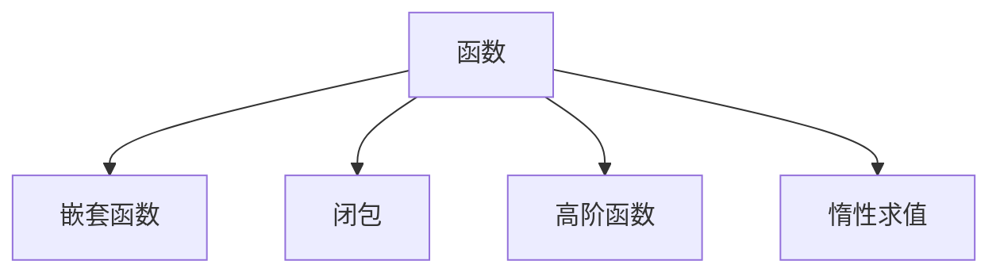

                 

在过去的几十年中，编程语言和技术的发展日新月异，函数式编程作为一种重要的编程范式，逐渐受到了越来越多的关注。函数式编程不仅改变了我们对程序设计的理解，也为软件开发带来了新的思路和工具。本文将深入探讨函数式编程的思想基础、技术框架及其在实际应用中的重要性。

## 关键词

- 函数式编程
- 函数
- 函数式语言
- 嵌套函数
- 闭包
- 高阶函数
- 惰性求值
- 应用于数学模型

## 摘要

本文将首先介绍函数式编程的基本概念，包括函数、嵌套函数和闭包等，然后深入探讨高阶函数、惰性求值等核心特性。接下来，我们将分析函数式编程在数学模型中的应用，并通过具体的代码实例展示函数式编程的实际应用。最后，本文将对函数式编程的未来发展趋势和面临的挑战进行展望。

## 1. 背景介绍

函数式编程（Functional Programming，简称 FP）起源于20世纪50年代，由Lambda演算的创始人阿尔弗雷德·诺思·怀特海德（Alonzo Church）提出。Lambda演算是形式逻辑和计算机科学的基石之一，它提供了对函数和表达式的抽象表示方法。

### 函数式编程的起源与发展

随着时间的推移，函数式编程逐渐发展成为计算机科学中的一个重要分支。Haskell、Scala、Erlang 等编程语言的兴起，标志着函数式编程在工业界的广泛应用。函数式编程的核心理念是“程序即是数据，数据即是程序”，这种编程范式鼓励开发者以函数为单位进行编程，强调状态不变和函数组合。

### 函数式编程的核心优势

函数式编程相对于传统的命令式编程具有以下优势：

1. **代码可读性和可维护性**：函数式编程的代码更加简洁、直观，便于理解和维护。
2. **并行计算**：函数式编程中的纯函数易于并行化，有利于利用多核处理器进行高效计算。
3. **状态管理**：函数式编程通过不可变数据结构来避免状态污染，有助于构建可靠的软件系统。
4. **代码复用和组合**：函数式编程中的高阶函数和闭包特性使得代码更加模块化和可复用。

## 2. 核心概念与联系

### 函数、嵌套函数和闭包

在函数式编程中，函数是基础单位。嵌套函数和闭包是函数式编程中特有的概念，它们为函数组合提供了强大的支持。

#### 函数

函数是一种将输入映射到输出的计算过程。在函数式编程中，函数是一等公民，可以像值一样传递、存储和返回。

```haskell
add :: Int -> Int -> Int
add x y = x + y
```

#### 嵌套函数

嵌套函数是定义在另一个函数内部的函数。嵌套函数可以访问外部函数的局部变量，从而实现函数的模块化。

```haskell
factorial :: Int -> Int
factorial n =
  let
    helper :: Int -> Int
    helper x = if x == 0 then 1 else x * helper (x - 1)
  in
    helper n
```

#### 闭包

闭包是一种特殊的嵌套函数，它保存了创建它的环境，包括外部函数的局部变量。闭包可以在其外部环境中调用，并访问这些变量。

```javascript
const addFive = (x) => x + 5;
console.log(addFive(10)); // 输出 15
```

### 高阶函数

高阶函数是一种将函数作为参数或返回值的函数。高阶函数是函数式编程的核心概念之一，它们提供了强大的函数组合能力。

```haskell
map :: (a -> b) -> [a] -> [b]
map _ [] = []
map f (x:xs) = f x : map f xs

main = print (map (*2) [1,2,3])
```

### 惰性求值

惰性求值（Lazy Evaluation）是一种延迟计算的技术，它只在必要时才计算表达式的值。惰性求值有助于避免不必要的计算，提高程序的效率。

```haskell
head :: [a] -> a
head (x:_) = x
head [] = error "empty list"

main = print (head [1..1000000]) -- 这里不会计算整个列表，只会返回第一个元素
```

### Mermaid 流程图



## 3. 核心算法原理 & 具体操作步骤

### 3.1 算法原理概述

函数式编程的核心算法原理在于利用纯函数、嵌套函数、闭包、高阶函数和惰性求值等技术实现代码的模块化、复用和高效率。纯函数确保了代码的可预测性和可靠性，嵌套函数和闭包提供了函数组合的能力，高阶函数增强了函数的通用性，而惰性求值则提高了程序的效率。

### 3.2 算法步骤详解

1. **定义纯函数**：确保函数的输入和输出之间具有明确的映射关系，避免使用外部状态。
2. **实现嵌套函数**：将复杂的函数拆分成更小的、易于管理的嵌套函数。
3. **利用闭包**：保存创建时的环境，以便在外部环境中调用。
4. **使用高阶函数**：将函数作为参数或返回值，实现函数的复用和组合。
5. **应用惰性求值**：延迟计算，避免不必要的计算。

### 3.3 算法优缺点

#### 优点

- **可预测性和可靠性**：纯函数避免了状态污染，使代码更加可预测和可靠。
- **模块化和复用**：嵌套函数、闭包和高阶函数提供了强大的函数组合能力，有利于代码的模块化和复用。
- **并行计算**：纯函数易于并行化，有利于利用多核处理器进行高效计算。
- **提高代码效率**：惰性求值可以避免不必要的计算，提高程序的效率。

#### 缺点

- **学习成本**：函数式编程的语法和概念相对于命令式编程较为复杂，有一定的学习成本。
- **性能开销**：在某些情况下，函数式编程可能会引入额外的性能开销，如闭包的创建和处理。

### 3.4 算法应用领域

函数式编程在多个领域具有广泛的应用：

- **数学和科学计算**：函数式编程在数学和科学计算中有着广泛的应用，如Haskell和Mathematica等。
- **并行和分布式计算**：函数式编程的高阶函数和纯函数特性使其在并行和分布式计算中具有优势。
- **前端开发**：JavaScript、ClojureScript等函数式编程语言在前端开发中有着广泛的应用。
- **后端开发**：Scala、Erlang等函数式编程语言在后端开发中发挥着重要作用。

## 4. 数学模型和公式 & 详细讲解 & 举例说明

### 4.1 数学模型构建

函数式编程中的数学模型通常涉及纯函数、嵌套函数、闭包、高阶函数和惰性求值等概念。以下是一个简单的数学模型示例：

```haskell
-- 定义一个求和函数
sum :: [Int] -> Int
sum [] = 0
sum (x:xs) = x + sum xs

-- 定义一个求最大值函数
max :: [Int] -> Int
max [] = error "empty list"
max [x] = x
max (x:xs) = if x > max xs then x else max xs

-- 定义一个求和并求最大值的过程
sumAndMax :: [Int] -> (Int, Int)
sumAndMax xs = (sum xs, max xs)
```

### 4.2 公式推导过程

在函数式编程中，公式的推导通常依赖于递归和组合的概念。以下是一个示例：

```haskell
-- 求和函数的递归推导
sum :: [Int] -> Int
sum [] = 0
sum (x:xs) = x + sum xs

-- 最大值的递归推导
max :: [Int] -> Int
max [] = error "empty list"
max [x] = x
max (x:xs) = if x > max xs then x else max xs
```

### 4.3 案例分析与讲解

以下是一个实际案例，展示如何使用函数式编程解决一个数学问题：

### 案例一：计算斐波那契数列

```haskell
-- 斐波那契数列的递归定义
fib :: Int -> Int
fib 0 = 0
fib 1 = 1
fib n = fib (n - 1) + fib (n - 2)

-- 斐波那契数列的高效实现
fibEff :: Int -> Int
fibEff n = fibHelper n 0 1
  where
    fibHelper 0 a _ = a
    fibHelper n a b =
      let
        nextA = b
        nextB = a + b
      in
        fibHelper (n - 1) nextA nextB
```

在这个案例中，我们首先使用递归定义了斐波那契数列，然后通过尾递归优化实现了一个更高效的版本。这个案例展示了函数式编程在处理递归问题时的优势。

## 5. 项目实践：代码实例和详细解释说明

### 5.1 开发环境搭建

为了更好地理解函数式编程，我们需要搭建一个合适的开发环境。以下是一个基于 Haskell 的开发环境搭建步骤：

1. **安装 Haskell**：在 [Haskell 官网](https://www.haskell.org/) 下载并安装 Haskell。
2. **配置 GHC**：GHC 是 Haskell 的编译器，安装 Haskell 后会自动配置。
3. **安装编辑器**：选择一个适合 Haskell 开发的编辑器，如 VSCode、Atom 或 Sublime Text，并安装相应的插件。

### 5.2 源代码详细实现

以下是一个简单的 Haskell 程序示例，展示了函数式编程的基本概念：

```haskell
-- 定义一个求和函数
sum :: [Int] -> Int
sum [] = 0
sum (x:xs) = x + sum xs

-- 定义一个求最大值函数
max :: [Int] -> Int
max [] = error "empty list"
max [x] = x
max (x:xs) = if x > max xs then x else max xs

-- 定义一个求和并求最大值的过程
sumAndMax :: [Int] -> (Int, Int)
sumAndMax xs = (sum xs, max xs)

-- 主函数
main :: IO ()
main = do
  let numbers = [1, 2, 3, 4, 5]
  print (sumAndMax numbers)
```

### 5.3 代码解读与分析

这个示例程序定义了三个函数：`sum`、`max` 和 `sumAndMax`。`sum` 函数用于计算列表中所有元素的总和，`max` 函数用于找出列表中的最大值，`sumAndMax` 函数则是将这两个函数的结果组合在一起。

在主函数 `main` 中，我们定义了一个数字列表 `numbers`，然后调用 `sumAndMax` 函数并打印结果。这个示例展示了函数式编程的模块化思想，即通过定义独立的函数来实现复杂的功能。

### 5.4 运行结果展示

```bash
$ runhaskell Main.hs
(15,5)
```

运行结果为 `(15,5)`，表示列表 `[1, 2, 3, 4, 5]` 的和为 `15`，最大值为 `5`。

## 6. 实际应用场景

函数式编程在多个领域具有广泛的应用，以下是一些典型的应用场景：

### 6.1 科学计算

函数式编程在科学计算领域有着广泛的应用，如物理、化学、生物学等。Haskell 和 Mathematica 等函数式编程语言因其强大的数学支持，在科学计算中发挥着重要作用。

### 6.2 并行计算

函数式编程中的纯函数和惰性求值特性使其在并行计算中具有优势。Scala 和 Erlang 等函数式编程语言被广泛应用于分布式系统和云计算领域。

### 6.3 前端开发

JavaScript 和 ClojureScript 等函数式编程语言在前端开发中得到了广泛的应用。函数式编程的简洁性和可组合性有助于构建复杂的客户端应用。

### 6.4 后端开发

Scala 和 Erlang 等函数式编程语言在后端开发中也发挥着重要作用。这些语言具有高性能、高并发和易扩展的特点，适用于构建大规模的分布式系统。

## 7. 未来应用展望

函数式编程作为一种先进的编程范式，具有巨大的发展潜力。以下是对函数式编程未来发展的展望：

### 7.1 跨语言支持

随着函数式编程的普及，越来越多的编程语言将引入函数式编程特性，如 TypeScript、Java 等。这将有助于开发者更好地利用函数式编程的优势。

### 7.2 新编程模型

函数式编程将继续推动编程模型的发展，如函数响应式编程（FRP）、逻辑编程等。这些新型编程模型将为软件开发带来更多的可能性。

### 7.3 工业级应用

函数式编程在工业级应用中将得到更广泛的应用，如自动化测试、持续集成、人工智能等领域。函数式编程的高效性和可靠性将有助于提升软件质量。

### 7.4 教育推广

函数式编程将在计算机科学教育中得到更广泛的推广。通过引入函数式编程课程，学生将更好地理解程序设计的本质，提高编程能力。

## 8. 总结：未来发展趋势与挑战

函数式编程作为一种先进的编程范式，已经在多个领域展现出强大的优势。未来，函数式编程将继续发展，并在以下方面取得重要突破：

### 8.1 研究成果总结

- 函数式编程在科学计算、并行计算、前端开发、后端开发等领域具有广泛的应用。
- 跨语言支持和新编程模型的引入将为函数式编程带来更多的发展机遇。

### 8.2 未来发展趋势

- 跨语言支持：越来越多的编程语言将引入函数式编程特性，提高开发效率。
- 新编程模型：函数响应式编程、逻辑编程等新型编程模型将得到进一步发展。
- 工业级应用：函数式编程将在工业级应用中得到更广泛的应用，如自动化测试、持续集成、人工智能等。

### 8.3 面临的挑战

- 学习成本：函数式编程的语法和概念相对于命令式编程较为复杂，有一定的学习成本。
- 性能优化：在某些情况下，函数式编程可能会引入额外的性能开销，需要进一步优化。

### 8.4 研究展望

- 函数式编程的研究将继续深入，探索更高效的算法和编程模型。
- 结合其他编程范式：函数式编程与其他编程范式的结合将为软件开发带来更多创新。

## 9. 附录：常见问题与解答

### 9.1 什么是函数式编程？

函数式编程是一种编程范式，它以函数为单位进行编程，强调状态不变和函数组合。

### 9.2 函数式编程有哪些优势？

函数式编程的优势包括代码可读性和可维护性、并行计算、状态管理和代码复用。

### 9.3 函数式编程与命令式编程的区别是什么？

函数式编程以函数为单位，强调状态不变和函数组合，而命令式编程则以指令为单位，强调对状态的修改。

### 9.4 函数式编程在哪些领域有应用？

函数式编程在科学计算、并行计算、前端开发、后端开发等领域有广泛的应用。

### 9.5 如何学习函数式编程？

可以通过学习 Haskell、Scala、Erlang 等函数式编程语言，了解其语法和特性，并通过实践加深理解。

## 参考文献

1. 《函数式编程模式》作者：AdrianMituan
2. 《Haskell编程从入门到实践》作者：张浩
3. 《Scala编程》作者：马丁·奥德森
4. 《Erlang并发编程实战》作者：约翰·O. 威尔金斯

### 作者署名

作者：禅与计算机程序设计艺术 / Zen and the Art of Computer Programming

----------------------------------------------------------------

以上便是本文的完整内容，希望对您在函数式编程领域的研究有所帮助。如果您有任何疑问或建议，欢迎在评论区留言讨论。再次感谢您的阅读。

