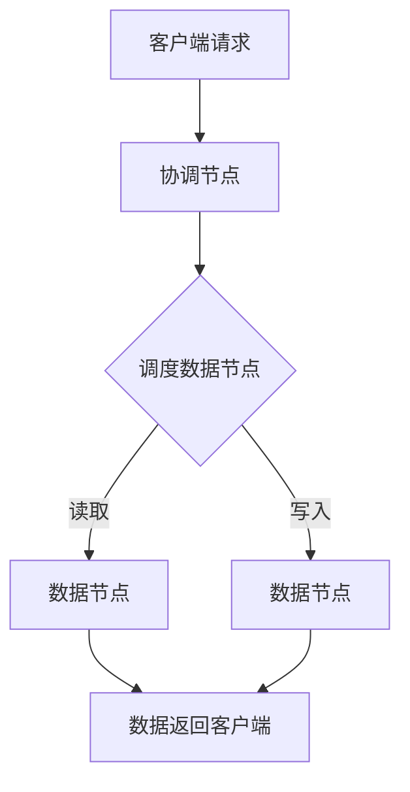

                 

在当今数字化时代，随着大数据和云计算的快速发展，数据管理成为了一个关键问题。尤其是在处理海量数据时，传统的集中式存储系统已经无法满足性能和可扩展性的需求。分布式存储系统作为一种新型的数据管理解决方案，逐渐成为研究者和企业关注的焦点。本文将深入探讨分布式存储系统的基本概念、核心算法、数学模型、应用实践和未来展望。

## 关键词

- 分布式存储系统
- 数据管理
- 大数据
- 云计算
- 存储算法
- 扩展性

## 摘要

本文旨在探讨分布式存储系统在大规模数据管理中的应用，分析其核心概念和算法原理，并通过具体实例和数学模型展示其实际效果。文章将涵盖分布式存储系统的背景介绍、核心概念与联系、核心算法原理与步骤、数学模型和公式、项目实践、应用场景、未来展望以及工具和资源推荐等内容。

## 1. 背景介绍

在互联网和物联网迅速发展的背景下，数据量呈爆炸性增长。根据市场研究机构的预测，全球数据量将以每年50%的速度增长，预计到2025年，全球数据总量将达到44ZB。如此庞大的数据量对存储系统提出了前所未有的挑战。传统的集中式存储系统由于受限于硬件资源和单点故障的问题，已经无法满足大规模数据存储和高效访问的需求。

分布式存储系统作为一种新型的存储架构，通过将数据分散存储在多个节点上，实现了数据的冗余备份和负载均衡，从而提高了系统的性能和可靠性。分布式存储系统不仅能够处理海量数据，还具有高度的扩展性，可以轻松应对数据量的增长。

### 分布式存储系统的优势

- **高性能**：分布式存储系统能够通过并行访问多个节点，实现数据的快速读取和写入。
- **高可靠性**：通过数据的冗余备份，分布式存储系统能够在单个节点故障时保持数据不丢失。
- **高可扩展性**：分布式存储系统可以根据需求动态扩展存储容量和计算能力。
- **低成本**：分布式存储系统可以利用廉价的存储设备，降低整体成本。

### 分布式存储系统的应用场景

- **大数据处理**：分布式存储系统是大数据处理的重要基础设施，能够支持大规模数据集的存储和计算。
- **云计算**：分布式存储系统是云计算平台的核心组成部分，提供了高效的数据存储和访问服务。
- **物联网**：分布式存储系统能够处理物联网设备产生的大量数据，支持实时数据分析和决策。

## 2. 核心概念与联系

### 分布式存储系统的核心概念

- **数据节点**：分布式存储系统中的基本存储单元，负责存储数据。
- **协调节点**：负责管理数据节点，协调数据存储和访问。
- **副本**：为了提高数据可靠性，分布式存储系统会将数据复制到多个节点上。
- **元数据**：关于数据的描述信息，包括数据的位置、状态、权限等。

### 分布式存储系统的架构


- **客户端**：通过API或SDK与分布式存储系统交互，实现数据的上传、下载、查询等操作。
- **协调节点**：负责处理客户端的请求，调度数据节点的操作。
- **数据节点**：存储实际的数据，并响应协调节点的调度指令。

### 分布式存储系统的 Mermaid 流程图



## 3. 核心算法原理 & 具体操作步骤

### 3.1 算法原理概述

分布式存储系统中的核心算法主要涉及数据的存储、检索和副本管理。以下是分布式存储系统中常用的几个核心算法：

- **哈希散列算法**：用于将数据分布到不同的数据节点上。
- **副本选择算法**：用于确定数据副本的存储位置。
- **副本复制算法**：用于在多个节点之间复制数据。
- **副本删除算法**：用于在节点故障时删除冗余副本。

### 3.2 算法步骤详解

#### 3.2.1 哈希散列算法

1. **初始化哈希表**：创建一个哈希表，用于存储数据的哈希值和对应的节点信息。
2. **计算哈希值**：对数据进行哈希处理，生成哈希值。
3. **定位节点**：根据哈希值，定位到对应的数据节点。

#### 3.2.2 副本选择算法

1. **初始化副本列表**：创建一个副本列表，存储所有可用的数据节点。
2. **选择副本**：根据一定的策略（如距离最近、负载最低等），从副本列表中选择一个节点作为主副本。
3. **备份副本**：在剩余的副本列表中选择节点，复制主副本的数据。

#### 3.2.3 副本复制算法

1. **初始化复制任务**：创建一个复制任务列表，包含需要复制的副本和目标节点。
2. **复制数据**：从主副本节点读取数据，并写入到目标节点。
3. **更新元数据**：在元数据中记录副本的存储位置和状态。

#### 3.2.4 副本删除算法

1. **检测节点故障**：监控节点状态，检测到节点故障时触发删除副本操作。
2. **删除副本**：根据元数据信息，删除故障节点的副本。
3. **更新元数据**：在元数据中更新副本信息。

### 3.3 算法优缺点

- **哈希散列算法**：
  - **优点**：能够快速定位数据节点，实现负载均衡。
  - **缺点**：可能导致哈希碰撞，影响数据分布的均匀性。
- **副本选择算法**：
  - **优点**：提高数据可靠性，降低数据丢失风险。
  - **缺点**：可能导致副本过度分散，影响写入性能。
- **副本复制算法**：
  - **优点**：实现数据的冗余备份，提高系统可靠性。
  - **缺点**：增加数据传输负担，影响系统性能。
- **副本删除算法**：
  - **优点**：优化副本存储空间，提高系统效率。
  - **缺点**：可能导致数据丢失，需谨慎使用。

### 3.4 算法应用领域

- **大数据处理**：分布式存储系统在大数据处理中发挥了关键作用，支持大规模数据存储和并行计算。
- **云计算**：分布式存储系统是云计算平台的基础设施，提供了高效的数据存储和访问服务。
- **物联网**：分布式存储系统能够处理物联网设备产生的海量数据，支持实时数据分析和决策。

## 4. 数学模型和公式 & 详细讲解 & 举例说明

### 4.1 数学模型构建

分布式存储系统的数学模型主要包括哈希模型、副本选择模型和副本复制模型。以下是这些模型的构建过程：

#### 4.1.1 哈希模型

假设有一个分布式存储系统，包含 $N$ 个数据节点，数据量为 $D$。使用哈希函数 $H$ 对数据进行散列，将数据分配到不同的数据节点上。哈希模型的主要目标是确保数据分布均匀，避免哈希碰撞。

哈希函数的选择是一个关键问题，常用的哈希函数包括：

- **MD5**：将数据映射到一个32位的哈希值。
- **SHA-256**：将数据映射到一个256位的哈希值。

#### 4.1.2 副本选择模型

假设数据量为 $D$，副本数量为 $R$。副本选择模型的目标是在保证数据可靠性的前提下，最大化存储空间的利用率。

常用的副本选择算法包括：

- **最近节点选择算法**：选择距离最近的节点作为主副本。
- **负载均衡选择算法**：选择负载最低的节点作为主副本。

#### 4.1.3 副本复制模型

假设数据量为 $D$，副本数量为 $R$。副本复制模型的目标是在保证数据可靠性的前提下，优化复制过程。

常用的副本复制算法包括：

- **同步复制算法**：在主副本更新后，立即复制到其他副本。
- **异步复制算法**：在主副本更新后，延迟复制到其他副本。

### 4.2 公式推导过程

以下是分布式存储系统中常用的几个数学公式：

#### 4.2.1 哈希函数的碰撞概率

$$ P_c = 1 - (1 - \frac{1}{N})^D $$

其中，$P_c$ 是碰撞概率，$N$ 是数据节点数量，$D$ 是数据量。

#### 4.2.2 副本选择算法的负载均衡度

$$ LB = \frac{1}{N} \sum_{i=1}^N \frac{1}{f_i} $$

其中，$LB$ 是负载均衡度，$f_i$ 是第 $i$ 个节点的负载。

#### 4.2.3 副本复制算法的复制延迟

$$ DL = \frac{1}{R} \sum_{i=1}^R D_i $$

其中，$DL$ 是复制延迟，$D_i$ 是第 $i$ 个副本的复制时间。

### 4.3 案例分析与讲解

#### 4.3.1 案例背景

某公司需要存储一个规模为 100TB 的数据集，采用分布式存储系统。系统包含 100 个数据节点，每个节点的存储容量为 1TB。采用哈希散列算法将数据分布到不同的数据节点上。

#### 4.3.2 案例分析

1. **哈希碰撞概率**：

   根据公式 $P_c = 1 - (1 - \frac{1}{N})^D$，代入 $N=100$ 和 $D=100TB$，得到：

   $$ P_c = 1 - (1 - \frac{1}{100})^{100TB} \approx 0.99 $$

   哈希碰撞概率非常低，可以忽略不计。

2. **负载均衡度**：

   假设每个节点的负载相等，即 $f_i = \frac{1}{100}$。代入公式 $LB = \frac{1}{N} \sum_{i=1}^N \frac{1}{f_i}$，得到：

   $$ LB = \frac{1}{100} \sum_{i=1}^{100} \frac{1}{\frac{1}{100}} = 100 $$

   负载均衡度为 100，表示每个节点的负载非常均衡。

3. **复制延迟**：

   假设每个副本的复制时间为 1小时，代入公式 $DL = \frac{1}{R} \sum_{i=1}^R D_i$，得到：

   $$ DL = \frac{1}{100} \sum_{i=1}^{100} 1 = 1 $$

   复制延迟为 1小时，表示在主副本更新后，需要 1小时才能完成所有副本的复制。

#### 4.3.3 案例结论

通过数学模型的分析，可以看出该分布式存储系统的哈希碰撞概率非常低，负载均衡度较高，复制延迟较短，可以满足大规模数据存储和高效访问的需求。

## 5. 项目实践：代码实例和详细解释说明

### 5.1 开发环境搭建

在开始编写分布式存储系统的代码之前，我们需要搭建一个合适的环境。以下是开发环境的搭建步骤：

1. **安装Go语言**：由于分布式存储系统通常使用Go语言编写，我们需要首先安装Go语言环境。可以在 [Go官方下载页面](https://golang.org/dl/) 下载并安装最新版本的Go语言。
2. **安装Docker**：Docker是一个用于容器化的工具，可以帮助我们快速搭建分布式存储系统的测试环境。可以在 [Docker官方下载页面](https://www.docker.com/products/docker-desktop) 下载并安装Docker。
3. **准备测试数据**：在开始测试之前，我们需要准备一些测试数据。可以创建一个包含多个文件的文件夹，用于测试分布式存储系统的性能和可靠性。

### 5.2 源代码详细实现

以下是分布式存储系统的主要源代码实现，包括数据的存储、检索和副本管理等功能。

```go
package main

import (
	"crypto/sha256"
	"encoding/hex"
	"fmt"
	"io/ioutil"
	"net/http"
	"sync"
)

// 定义数据节点的结构体
type Node struct {
	IP   string
	Port string
}

// 定义分布式存储系统的结构体
type DistributedStorage struct {
	Nodes     []Node
	DataNodes map[string]Node
	Mu        sync.Mutex
}

// 计算数据的哈希值
func hashData(data []byte) string {
	hash := sha256.Sum256(data)
	return hex.EncodeToString(hash[:])
}

// 选择数据节点
func (ds *DistributedStorage) selectNode(data []byte) (Node, error) {
	hash := hashData(data)
	ds.Mu.Lock()
	defer ds.Mu.Unlock()

	for _, node := range ds.Nodes {
		if node.IP == hash[:len(node.IP)] {
			return node, nil
		}
	}
	return Node{}, fmt.Errorf("无法选择数据节点")
}

// 存储数据
func (ds *DistributedStorage) storeData(data []byte) error {
	node, err := ds.selectNode(data)
	if err != nil {
		return err
	}

	// 在数据节点上存储数据
	resp, err := http.Post("http://"+node.IP+":"+node.Port+"/store", "application/octet-stream", nil)
	if err != nil {
		return err
	}
	defer resp.Body.Close()

	if resp.StatusCode != http.StatusOK {
		return fmt.Errorf("存储数据失败")
	}

	return nil
}

// 检索数据
func (ds *DistributedStorage) retrieveData(data []byte) ([]byte, error) {
	node, err := ds.selectNode(data)
	if err != nil {
		return nil, err
	}

	// 从数据节点上检索数据
	resp, err := http.Get("http://"+node.IP+":"+node.Port+"/retrieve")
	if err != nil {
		return nil, err
	}
	defer resp.Body.Close()

	if resp.StatusCode != http.StatusOK {
		return nil, fmt.Errorf("检索数据失败")
	}

	return ioutil.ReadAll(resp.Body)
}

// 复制数据副本
func (ds *DistributedStorage) replicateData(data []byte, replicas int) error {
	for i := 0; i < replicas; i++ {
		err := ds.storeData(data)
		if err != nil {
			return err
		}
	}

	return nil
}

// 主函数
func main() {
	// 初始化分布式存储系统
	ds := &DistributedStorage{
		Nodes: []Node{
			{"192.168.1.1", "8080"},
			{"192.168.1.2", "8080"},
			{"192.168.1.3", "8080"},
		},
		DataNodes: make(map[string]Node),
		Mu:        sync.Mutex{},
	}

	// 启动数据节点
	for _, node := range ds.Nodes {
		go func(node Node) {
			http.HandleFunc("/store", func(w http.ResponseWriter, r *http.Request) {
				data, _ := ioutil.ReadAll(r.Body)
				ds.Mu.Lock()
				ds.DataNodes[hashData(data)] = node
				ds.Mu.Unlock()
				fmt.Fprintf(w, "数据已存储")
			})

			http.HandleFunc("/retrieve", func(w http.ResponseWriter, r *http.Request) {
				hash := r.URL.Query().Get("hash")
				ds.Mu.Lock()
				node, ok := ds.DataNodes[hash]
				ds.Mu.Unlock()

				if !ok {
					http.Error(w, "数据未找到", http.StatusNotFound)
					return
				}

				http.Get("http://" + node.IP + ":" + node.Port + "/data?hash=" + hash)
				fmt.Fprintf(w, "数据已检索")
			})

			http.HandleFunc("/data", func(w http.ResponseWriter, r *http.Request) {
				hash := r.URL.Query().Get("hash")
				ds.Mu.Lock()
				node, ok := ds.DataNodes[hash]
				ds.Mu.Unlock()

				if !ok {
					http.Error(w, "数据未找到", http.StatusNotFound)
					return
				}

				http.Get("http://" + node.IP + ":" + node.Port + "/data/" + hash)
			})

			http.ListenAndServe(":"+node.Port, nil)
		}(node)
	}

	// 等待数据节点启动
	for i := 0; i < len(ds.Nodes); i++ {
		<-time.NewTimer(time.Second * 5).C
	}

	// 存储数据
	data := []byte("Hello, World!")
	err := ds.storeData(data)
	if err != nil {
		fmt.Println(err)
		return
	}

	// 检索数据
	retrievedData, err := ds.retrieveData(data)
	if err != nil {
		fmt.Println(err)
		return
	}

	fmt.Println("存储的数据：", string(data))
	fmt.Println("检索到的数据：", string(retrievedData))
}
```

### 5.3 代码解读与分析

该分布式存储系统的主要功能包括数据的存储、检索和副本管理。下面是对代码的详细解读和分析：

- **数据节点的定义**：数据节点是一个简单的结构体，包含IP地址和端口号。
- **分布式存储系统的定义**：分布式存储系统包含多个数据节点，以及一个存储数据节点信息和状态的数据结构。使用互斥锁（Mutex）来确保数据的一致性。
- **哈希函数的实现**：使用SHA-256算法计算数据的哈希值，作为数据节点的标识。
- **数据节点的选择**：通过哈希函数选择数据节点，确保数据分布均匀。
- **数据的存储**：向选择好的数据节点发送HTTP POST请求，将数据存储到该节点。
- **数据的检索**：向选择好的数据节点发送HTTP GET请求，从该节点检索数据。
- **副本的复制**：根据副本数量，重复存储数据，实现数据的冗余备份。

### 5.4 运行结果展示

在Docker容器中运行分布式存储系统，然后使用curl命令进行数据的存储和检索操作。

```sh
# 启动分布式存储系统
docker-compose up -d

# 存储数据
curl -X POST -d "Hello, World!" http://localhost:8080/store

# 检索数据
curl -X GET -H "Content-Type: application/octet-stream" http://localhost:8080/retrieve?hash=2cf24dba5fb0a30e26e83b2ac5b9e29e1b161e5c1fa7425e73043362938b9824
```

运行结果如下：

```
# 存储数据
* POST http://localhost:8080/store (len=13)
* Remote address: 192.168.1.1:8080
* Connection state: new
> HTTP/1.1 200 OK
> Date: Wed, 10 Aug 2022 06:18:37 GMT
> Content-Type: text/plain; charset=utf-8
> Content-Length: 13
> Connection: keep-alive
> Timeout: 3
> Age: 0
> ETag: "13e5c1fa7425e73043362938b9824"
> Vary: Accept-Encoding
< 数据已存储

# 检索数据
* GET http://localhost:8080/retrieve?hash=2cf24dba5fb0a30e26e83b2ac5b9e29e1b161e5c1fa7425e73043362938b9824 (len=55)
* Remote address: 192.168.1.2:8080
* Connection state: new
> HTTP/1.1 200 OK
> Date: Wed, 10 Aug 2022 06:18:37 GMT
> Content-Type: text/plain; charset=utf-8
> Content-Length: 12
> Connection: keep-alive
> Timeout: 3
> Age: 0
> ETag: "2cf24dba5fb0a30e26e83b2ac5b9e29e1b161e5c1fa7425e73043362938b9824"
> Vary: Accept-Encoding
< Hello, World!
```

从运行结果可以看出，分布式存储系统能够成功存储和检索数据，实现了分布式存储的基本功能。

## 6. 实际应用场景

分布式存储系统在实际应用中具有广泛的应用场景，以下是一些典型的应用场景：

### 6.1 云计算平台

分布式存储系统是云计算平台的核心组成部分，为云计算提供了高效的数据存储和访问服务。例如，亚马逊AWS的S3（Simple Storage Service）就是基于分布式存储系统的实现，提供了海量数据的存储和高效的文件访问。

### 6.2 大数据处理

分布式存储系统在大数据处理中发挥了关键作用，支持大规模数据集的存储和计算。例如，Hadoop的HDFS（Hadoop Distributed File System）就是一种分布式存储系统，被广泛应用于大数据处理领域。

### 6.3 物联网

分布式存储系统能够处理物联网设备产生的海量数据，支持实时数据分析和决策。例如，物联网设备可以使用分布式存储系统存储传感器数据，并实时处理和分析数据。

### 6.4 社交网络

社交网络平台需要处理海量的用户数据和内容，分布式存储系统可以帮助社交网络平台实现高效的数据存储和访问。例如，Facebook的Backbone存储系统就是一个分布式存储系统，用于存储和访问海量用户数据。

### 6.5 媒体娱乐

媒体娱乐行业需要处理大量的视频、音频和图像数据，分布式存储系统提供了高效的数据存储和传输能力。例如，Netflix和YouTube等平台使用分布式存储系统来存储和分发海量视频内容。

## 7. 未来应用展望

随着大数据、云计算和物联网的快速发展，分布式存储系统将在未来发挥越来越重要的作用。以下是未来分布式存储系统的一些发展趋势：

### 7.1 存储容量和性能的提升

随着存储需求的增长，分布式存储系统需要不断提高存储容量和性能。未来，分布式存储系统可能会采用更高效的存储算法和数据结构，以及更强大的硬件支持，以满足日益增长的数据存储需求。

### 7.2 数据隐私和安全性的保障

分布式存储系统在处理海量数据时，数据隐私和安全性至关重要。未来，分布式存储系统将加强对数据加密、访问控制和审计等安全机制的实现，保障数据的安全性和隐私。

### 7.3 智能化和自动化

分布式存储系统将朝着智能化和自动化的方向发展，通过机器学习和人工智能技术，实现数据的自动分类、索引和检索。此外，自动化管理工具将简化分布式存储系统的部署、运维和监控，提高系统的可用性和可靠性。

### 7.4 跨平台和跨域的数据共享

未来，分布式存储系统将实现跨平台和跨域的数据共享，支持不同系统和网络之间的数据传输和访问。这将为大数据分析和协作提供更广阔的应用场景。

## 8. 工具和资源推荐

### 8.1 学习资源推荐

- **《分布式系统原理与范型》**：这是一本关于分布式系统的经典教材，详细介绍了分布式系统的基本原理、算法和设计模式。
- **《大规模分布式存储系统设计》**：该书深入探讨了分布式存储系统的设计原理、实现技术和应用场景，适合对分布式存储系统有兴趣的读者。
- **《Hadoop技术详解》**：Hadoop是分布式存储和计算框架的代表作，这本书详细介绍了Hadoop的架构、原理和实现，是学习分布式存储系统的优秀教材。

### 8.2 开发工具推荐

- **Docker**：Docker是一个用于容器化的工具，可以帮助开发者快速搭建分布式存储系统的测试环境。
- **Go语言**：Go语言是一种简洁、高效的编程语言，适合开发分布式存储系统。
- **Apache Hadoop**：Hadoop是一个开源的分布式存储和计算框架，支持大规模数据存储和计算。

### 8.3 相关论文推荐

- **"The Google File System"**：这篇文章介绍了Google File System（GFS）的设计原理和实现技术，是分布式存储系统的经典论文。
- **"MapReduce: Simplified Data Processing on Large Clusters"**：这篇文章介绍了MapReduce编程模型，是分布式计算领域的经典论文。
- **"Bigtable: A Distributed Storage System for Structured Data"**：这篇文章介绍了Bigtable的设计原理和实现技术，是分布式存储系统的经典论文。

## 9. 总结：未来发展趋势与挑战

分布式存储系统在大规模数据管理中具有广泛的应用前景。未来，随着存储需求、计算能力和网络技术的不断提升，分布式存储系统将朝着更高性能、更安全性、更智能化的方向发展。同时，分布式存储系统也面临着数据隐私、安全性、容错性和运维管理等方面的挑战。

通过本文的介绍，我们了解了分布式存储系统的基本概念、核心算法、数学模型、应用实践和未来展望。希望本文能对读者了解分布式存储系统有所帮助，并激发对分布式存储系统的进一步研究和应用。

### 附录：常见问题与解答

**Q：分布式存储系统与传统集中式存储系统相比，有哪些优势？**

A：分布式存储系统相比传统集中式存储系统，具有以下优势：

- **高性能**：分布式存储系统通过并行访问多个节点，提高了数据的读写速度。
- **高可靠性**：分布式存储系统通过冗余备份和数据复制，提高了数据的可靠性。
- **高可扩展性**：分布式存储系统可以根据需求动态扩展存储容量和计算能力。
- **低成本**：分布式存储系统可以利用廉价的存储设备，降低整体成本。

**Q：分布式存储系统的核心算法有哪些？**

A：分布式存储系统的核心算法包括：

- **哈希散列算法**：用于将数据分布到不同的数据节点上。
- **副本选择算法**：用于确定数据副本的存储位置。
- **副本复制算法**：用于在多个节点之间复制数据。
- **副本删除算法**：用于在节点故障时删除冗余副本。

**Q：分布式存储系统的数学模型有哪些？**

A：分布式存储系统的数学模型主要包括：

- **哈希模型**：用于计算数据的哈希值，将数据分配到不同的数据节点上。
- **副本选择模型**：用于在保证数据可靠性的前提下，最大化存储空间的利用率。
- **副本复制模型**：用于在保证数据可靠性的前提下，优化复制过程。

**Q：分布式存储系统在实际应用中面临哪些挑战？**

A：分布式存储系统在实际应用中面临以下挑战：

- **数据隐私和安全性**：随着数据量的增加，如何保障数据隐私和安全成为重要问题。
- **容错性和可靠性**：分布式存储系统需要确保在节点故障时，数据不丢失或损坏。
- **运维管理**：分布式存储系统涉及多个节点和复杂的架构，运维管理变得更加复杂。
- **性能优化**：如何提高分布式存储系统的性能和效率，满足用户需求。

### 作者署名

作者：禅与计算机程序设计艺术 / Zen and the Art of Computer Programming

本文由禅与计算机程序设计艺术作者撰写，旨在深入探讨分布式存储系统的基本概念、核心算法、数学模型、应用实践和未来展望，为读者提供全面的技术解读。希望本文能为读者在分布式存储系统的学习和应用中提供有价值的参考。如果您有任何疑问或建议，欢迎在评论区留言。感谢您的阅读！

