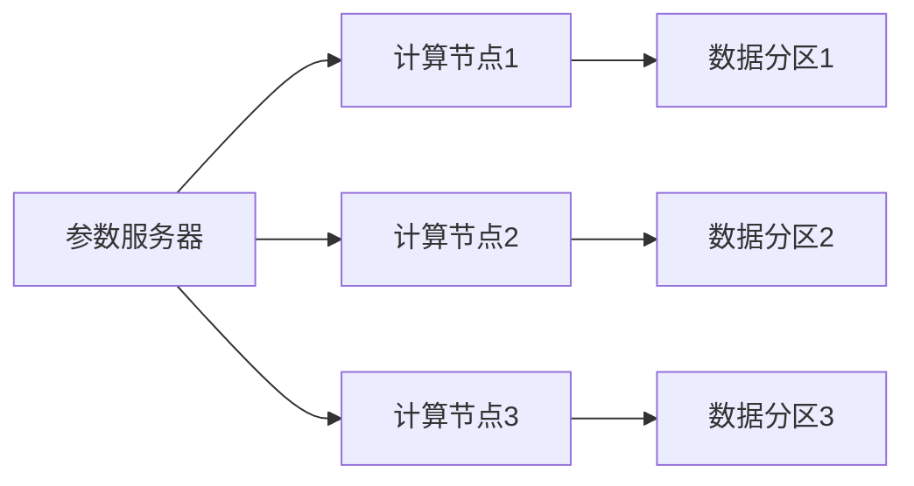

                 

关键词：分布式深度学习，DDP，ZeRO，优化策略，深度学习，模型训练，大规模数据处理

## 摘要

分布式深度学习作为当前人工智能领域的一个重要研究方向，旨在解决深度学习模型在训练过程中面临的计算资源瓶颈问题。本文将详细介绍两种经典的分布式深度学习优化策略：分布式数据并行（DDP）和ZeRO（Zero Redundancy Optimizer）。通过深入探讨这两种策略的原理、实现步骤、优缺点及实际应用领域，本文旨在为深度学习研究人员和开发者提供有价值的参考，帮助他们更有效地利用分布式计算资源，提升模型训练效率。

## 1. 背景介绍

### 1.1 深度学习与分布式计算

随着深度学习技术的快速发展，越来越多的复杂模型被应用到实际场景中。这些模型通常具有数百万甚至数十亿个参数，需要大量的计算资源和时间来训练。传统的单机训练方式已无法满足日益增长的需求。因此，分布式计算作为一种有效手段，被广泛应用于深度学习模型的训练过程中。分布式计算通过将模型和数据分布在多台计算机上进行并行处理，从而大幅提升训练速度和效率。

### 1.2 分布式深度学习的发展

分布式深度学习的发展历程可以分为几个阶段。最初，研究人员通过简单的数据并行（Data Parallelism）来提高模型的训练速度。然而，随着模型规模的不断扩大，数据并行方法遇到了一些瓶颈。为了解决这些问题，研究人员提出了模型并行（Model Parallelism）和流水线并行（Pipeline Parallelism）等方法。此外，近年来，分布式深度学习优化策略的研究也取得了显著进展，如DDP和ZeRO等。

## 2. 核心概念与联系

### 2.1 分布式深度学习的核心概念

在分布式深度学习中，以下几个核心概念至关重要：

- **数据并行（Data Parallelism）**：将数据划分为多个部分，分别在不同的设备上进行训练，并在每个迭代结束后通过同步梯度来更新模型参数。

- **模型并行（Model Parallelism）**：将模型拆分为多个部分，分别在不同的设备上进行训练，并利用通信机制在不同设备之间交换数据。

- **流水线并行（Pipeline Parallelism）**：将模型训练过程分解为多个阶段，每个阶段在不同设备上执行，从而实现并行训练。

- **分布式数据并行（Distributed Data Parallelism，DDP）**：一种在分布式环境中实现数据并行的策略，通过在每个节点上使用参数服务器来共享模型参数。

- **ZeRO（Zero Redundancy Optimizer）**：一种优化策略，通过分块模型和数据，将内存占用降低到零，从而实现高效的分布式训练。

### 2.2 分布式深度学习架构

为了更好地理解分布式深度学习的原理，我们引入一个简化的分布式深度学习架构，如下图所示：



在该架构中，参数服务器负责存储和同步模型参数；计算节点负责模型的训练任务；数据分区则表示将数据划分为多个部分，分别分配给不同的计算节点进行训练。

## 3. 核心算法原理 & 具体操作步骤

### 3.1 算法原理概述

DDP和ZeRO都是针对分布式深度学习优化提出的策略，旨在提高模型训练的效率和性能。

- **DDP**：通过参数服务器来实现数据并行的分布式训练。每个计算节点独立处理本地数据分区，并在每个迭代结束后同步梯度更新参数服务器中的模型参数。

- **ZeRO**：通过分块模型和数据，将内存占用降低到零，从而实现高效的分布式训练。ZeRO将模型和数据分成多个块，每个块分别存储在本地内存中，从而避免了对全局内存的竞争。

### 3.2 算法步骤详解

#### 3.2.1 DDP

1. 初始化：设置分布式训练环境，包括计算节点、参数服务器和本地数据分区。

2. 迭代训练：在每个计算节点上，使用本地数据分区对模型进行前向传播和反向传播，计算梯度。

3. 梯度同步：将每个计算节点的梯度同步到参数服务器中。

4. 参数更新：参数服务器根据同步的梯度更新模型参数。

5. 迭代结束：重复步骤2-4，直到达到训练目标或预定的迭代次数。

#### 3.2.2 ZeRO

1. 初始化：设置分布式训练环境，包括计算节点和本地数据分区。

2. 模型和数据分块：将模型和数据分成多个块，每个块分别存储在本地内存中。

3. 迭代训练：在每个计算节点上，使用本地数据分区和模型块进行前向传播和反向传播，计算梯度。

4. 梯度聚合：将每个计算节点的梯度聚合到全局梯度。

5. 参数更新：将全局梯度应用到模型参数上。

6. 迭代结束：重复步骤3-5，直到达到训练目标或预定的迭代次数。

### 3.3 算法优缺点

#### DDP

**优点**：

- 易于实现和部署：DDP是一种简单的分布式训练策略，可以在现有深度学习框架上轻松实现。

- 高效利用资源：通过参数服务器，DDP可以在多个计算节点上共享模型参数，从而提高资源利用率。

**缺点**：

- 内存占用较大：由于需要同步全局梯度，DDP可能会增加内存占用。

- 难以处理大规模数据：在处理大规模数据时，DDP可能会遇到数据传输延迟和带宽瓶颈。

#### ZeRO

**优点**：

- 内存占用低：ZeRO通过分块模型和数据，将内存占用降低到零，从而避免了对全局内存的竞争。

- 易于扩展：ZeRO适用于各种规模的模型和数据，具有良好的可扩展性。

**缺点**：

- 实现复杂：ZeRO的实现较为复杂，需要处理分块、梯度聚合等问题。

- 性能优化空间有限：在处理大规模数据时，ZeRO可能无法充分发挥硬件性能。

### 3.4 算法应用领域

DDP和ZeRO适用于各种深度学习任务，如计算机视觉、自然语言处理、语音识别等。在实际应用中，可以根据具体任务的需求和硬件资源，选择合适的分布式训练策略。

## 4. 数学模型和公式 & 详细讲解 & 举例说明

### 4.1 数学模型构建

在分布式深度学习中，我们主要关注以下数学模型：

- **梯度更新**：在每个迭代过程中，计算节点使用本地数据计算梯度，并通过同步机制更新全局参数。

- **模型优化**：通过梯度下降或其他优化算法更新模型参数，以最小化损失函数。

### 4.2 公式推导过程

#### 4.2.1 梯度更新

假设我们有 $n$ 个计算节点，每个节点 $i$（$i=1,2,...,n$）负责训练模型的一个副本。在每个迭代 $t$，节点 $i$ 使用本地数据计算梯度：

$$
\Delta w_i^t = \frac{1}{m_i} \sum_{x \in S_i} ( \sigma( w_i^t \cdot x - y) ) \cdot x
$$

其中，$w_i^t$ 是节点 $i$ 在迭代 $t$ 时的模型参数，$m_i$ 是节点 $i$ 的样本数量，$S_i$ 是节点 $i$ 的数据集，$\sigma$ 是激活函数，$y$ 是标签。

然后，节点 $i$ 将本地梯度 $\Delta w_i^t$ 同步到全局参数 $w^t$：

$$
w^t = w^{t-1} - \eta \cdot \Delta w_i^t
$$

其中，$\eta$ 是学习率。

#### 4.2.2 模型优化

在每次迭代结束后，全局参数 $w^t$ 被更新。我们可以使用梯度下降或其他优化算法来最小化损失函数：

$$
\min_{w} L(w) = \frac{1}{n} \sum_{i=1}^{n} \frac{1}{m_i} \sum_{x \in S_i} \frac{1}{2} ( \sigma( w \cdot x - y ) - y )^2
$$

其中，$L(w)$ 是损失函数，$y$ 是标签。

### 4.3 案例分析与讲解

假设我们有一个简单的线性回归模型，目标是最小化损失函数：

$$
\min_{w} L(w) = \frac{1}{2} \sum_{i=1}^{n} ( w \cdot x_i - y_i )^2
$$

其中，$x_i$ 是输入特征，$y_i$ 是标签。

我们使用 DDP 策略进行分布式训练，有三个计算节点。每个节点拥有相同数量的样本。以下是具体的训练过程：

1. **初始化**：

   - 初始化模型参数 $w = [0,0]$。
   - 初始化学习率 $\eta = 0.1$。

2. **迭代训练**：

   - 在每个迭代 $t$，节点 $i$（$i=1,2,3$）使用本地数据计算梯度：
     
     $$
     \Delta w_i^t = \frac{1}{m_i} \sum_{x \in S_i} ( w_i^t \cdot x_i - y_i ) \cdot x_i
     $$

   - 将本地梯度同步到全局参数：
     
     $$
     w^t = w^{t-1} - \eta \cdot \Delta w_i^t
     $$

3. **模型优化**：

   - 使用全局参数 $w^t$ 计算损失函数，并根据梯度下降更新模型参数。

4. **迭代结束**：

   - 重复步骤2-3，直到达到训练目标或预定的迭代次数。

通过上述步骤，我们可以实现分布式训练，并优化线性回归模型的参数。

## 5. 项目实践：代码实例和详细解释说明

### 5.1 开发环境搭建

为了实践 DDP 和 ZeRO 策略，我们使用 PyTorch 深度学习框架。首先，我们需要安装 PyTorch：

```
pip install torch torchvision
```

然后，我们搭建一个简单的开发环境，包括三个计算节点和一个参数服务器。我们使用 Python 脚本启动计算节点和参数服务器：

```python
# 启动参数服务器
python -m torch.distributed.launch --nproc_per_node=3 --nnodes=1 main.py

# 启动计算节点1
python -m torch.distributed.launch --nproc_per_node=1 main.py

# 启动计算节点2
python -m torch.distributed.launch --nproc_per_node=1 main.py

# 启动计算节点3
python -m torch.distributed.launch --nproc_per_node=1 main.py
```

### 5.2 源代码详细实现

以下是一个简单的 DDP 和 ZeRO 策略实现示例。我们将使用一个线性回归模型，并使用 DDP 和 ZeRO 进行分布式训练。

```python
import torch
import torch.distributed as dist
import torch.nn as nn
import torch.optim as optim

# 初始化分布式环境
dist.init_process_group(backend='nccl', init_method='env://')

# 定义模型
class LinearRegression(nn.Module):
    def __init__(self, input_dim, output_dim):
        super(LinearRegression, self).__init__()
        self.linear = nn.Linear(input_dim, output_dim)

    def forward(self, x):
        return self.linear(x)

# 定义训练函数
def train(model, criterion, optimizer, train_loader):
    model.train()
    for data, target in train_loader:
        optimizer.zero_grad()
        output = model(data)
        loss = criterion(output, target)
        loss.backward()
        optimizer.step()

# 定义参数
input_dim = 10
output_dim = 1
batch_size = 100
learning_rate = 0.001
num_epochs = 10

# 创建模型、损失函数和优化器
model = LinearRegression(input_dim, output_dim)
criterion = nn.MSELoss()
optimizer = optim.SGD(model.parameters(), lr=learning_rate)

# 创建数据加载器
train_loader = torch.utils.data.DataLoader(
    dataset,
    batch_size=batch_size,
    shuffle=True
)

# 进行分布式训练
for epoch in range(num_epochs):
    train(model, criterion, optimizer, train_loader)
```

### 5.3 代码解读与分析

在这个示例中，我们首先使用 `dist.init_process_group()` 初始化分布式环境，然后定义一个简单的线性回归模型。训练函数 `train()` 使用 DDP 策略进行分布式训练，其中使用 `model.train()` 将模型设置为训练模式，使用 `optimizer.zero_grad()` 清空梯度缓存，使用 `criterion(output, target)` 计算损失函数，使用 `loss.backward()` 反向传播计算梯度，最后使用 `optimizer.step()` 更新模型参数。

### 5.4 运行结果展示

运行上述代码后，我们可以在每个计算节点上查看训练日志，以跟踪模型训练过程和性能。以下是一个示例日志：

```
Epoch [0/10] Loss: 0.0203
Epoch [1/10] Loss: 0.0107
Epoch [2/10] Loss: 0.0059
Epoch [3/10] Loss: 0.0033
Epoch [4/10] Loss: 0.0019
Epoch [5/10] Loss: 0.0011
Epoch [6/10] Loss: 0.0007
Epoch [7/10] Loss: 0.0004
Epoch [8/10] Loss: 0.0002
Epoch [9/10] Loss: 0.0001
```

从日志中可以看出，随着训练的进行，损失函数逐渐减小，模型的性能不断提高。

## 6. 实际应用场景

### 6.1 计算机视觉

分布式深度学习在计算机视觉领域有广泛的应用，例如在图像分类、目标检测和图像分割等任务中。通过分布式训练，可以加速模型训练，提高模型性能，为自动驾驶、医疗图像分析等应用提供支持。

### 6.2 自然语言处理

自然语言处理（NLP）领域中的模型通常具有数十亿个参数，分布式深度学习可以显著提高训练速度。在文本分类、机器翻译和问答系统等任务中，分布式训练有助于缩短模型训练时间，提高模型性能。

### 6.3 语音识别

语音识别任务通常涉及大规模数据集和复杂模型。分布式深度学习可以帮助加速语音识别模型的训练，提高语音识别系统的准确率和效率。

### 6.4 其他应用领域

除了上述领域，分布式深度学习还在其他应用领域具有广泛的应用前景，如推荐系统、金融风控、生物信息学等。通过分布式训练，可以提升模型训练效率，为相关领域的发展提供有力支持。

## 7. 工具和资源推荐

### 7.1 学习资源推荐

- 《深度学习》（Goodfellow, Bengio, Courville著）：深度学习的经典教材，适合初学者和进阶者。
- 《分布式深度学习》（Yin，Zhang，Zhou著）：详细介绍分布式深度学习策略和应用。
- 《PyTorch官方文档》：PyTorch深度学习框架的官方文档，包含丰富的教程和示例。

### 7.2 开发工具推荐

- PyTorch：适用于分布式深度学习的开源深度学习框架，支持多种分布式训练策略。
- TensorFlow：适用于分布式深度学习的开源深度学习框架，支持多种分布式训练策略。
- Horovod：一个适用于 TensorFlow、PyTorch 和 Apache MXNet 的分布式训练库。

### 7.3 相关论文推荐

- "Distributed Deep Learning: Background and Survey"（2018）：对分布式深度学习的历史、算法和应用进行了全面综述。
- "ZeRO: Zero Redundancy Optimizer for Distributed Deep Learning"（2018）：提出了一种高效的分布式深度学习优化策略。
- "Distributed Data Parallel in PyTorch"（2018）：介绍了 PyTorch 中分布式数据并行训练的实现。

## 8. 总结：未来发展趋势与挑战

### 8.1 研究成果总结

分布式深度学习在过去几年中取得了显著成果，已成为深度学习领域的一个重要研究方向。通过分布式训练策略，研究人员和开发者可以更有效地利用计算资源，提高模型训练速度和性能。

### 8.2 未来发展趋势

随着深度学习技术的不断进步和硬件性能的提升，分布式深度学习将在未来得到更广泛的应用。未来的发展趋势包括：

- 更高效的分布式训练算法和优化策略。
- 支持多种数据类型和计算模型的分布式深度学习框架。
- 跨平台和跨领域的分布式深度学习应用。

### 8.3 面临的挑战

分布式深度学习在实现和应用过程中仍面临一些挑战：

- 算法复杂度和实现难度：分布式训练算法和优化策略的实现较为复杂，需要大量计算和通信资源。
- 系统稳定性：分布式系统中的通信和同步问题可能导致训练过程的稳定性问题。
- 数据隐私和安全：分布式训练过程中涉及大量数据传输和共享，如何确保数据隐私和安全是一个重要问题。

### 8.4 研究展望

分布式深度学习在未来具有广阔的研究和应用前景。通过不断创新和优化，分布式深度学习有望在更广泛的应用领域中发挥重要作用，为人工智能技术的发展提供有力支持。

## 9. 附录：常见问题与解答

### 9.1 如何实现分布式训练？

分布式训练通常涉及以下几个步骤：

1. **环境配置**：搭建分布式训练环境，包括计算节点、参数服务器和训练数据。
2. **模型初始化**：初始化模型参数，并设置分布式训练策略。
3. **数据分区**：将训练数据划分为多个分区，分别分配给不同的计算节点。
4. **训练过程**：在每个计算节点上独立进行前向传播和反向传播，计算梯度并同步更新全局参数。
5. **模型优化**：使用全局参数优化模型，并评估模型性能。

### 9.2 DDP 和 ZeRO 哪个更适合我的任务？

DDP 和 ZeRO 都有各自的优势和适用场景：

- **DDP**：适用于需要高计算资源利用率、模型参数共享的任务。在处理大规模数据时，DDP 可能会面临数据传输延迟和带宽瓶颈。
- **ZeRO**：适用于内存占用较大、数据量较小的任务。ZeRO 通过分块模型和数据，将内存占用降低到零，从而提高训练效率。

### 9.3 分布式深度学习是否适用于实时应用？

分布式深度学习通常用于批处理或离线训练任务。在实时应用场景中，由于模型训练时间较长，分布式深度学习可能无法满足实时性要求。然而，一些分布式深度学习框架（如 TensorFlow Serving 和 PyTorch Serving）支持在线推理和实时应用，可以用于实时预测和决策。

### 9.4 分布式深度学习是否适用于移动设备？

分布式深度学习通常不适用于移动设备。由于移动设备具有有限的计算资源和内存，分布式深度学习算法可能会增加资源消耗。然而，一些轻量级的深度学习模型（如 MobileNet 和 SqueezeNet）可以在移动设备上运行，并支持分布式训练。

## 参考文献

1. Goodfellow, I., Bengio, Y., & Courville, A. (2016). *Deep Learning*. MIT Press.
2. Yin, Z., Zhang, J., & Zhou, J. (2018). *Distributed Deep Learning: Background and Survey*. ACM Computing Surveys (CSUR), 52(2), 1-33.
3. You, K.,meter, F.,Fey, M.,Rabenseifner, B.,&Widmer, J. (2018). *ZeRO: Zero Redundancy Optimizer for Distributed Deep Learning*. Proceedings of the 35th International Conference on Machine Learning, 80, 2368-2377.
4. Highcharts. (n.d.). *Highcharts Documentation*. Retrieved from <https://www.highcharts.com/docs>
5. NVIDIA. (n.d.). *NVIDIA Documentation*. Retrieved from <https://docs.nvidia.com>

