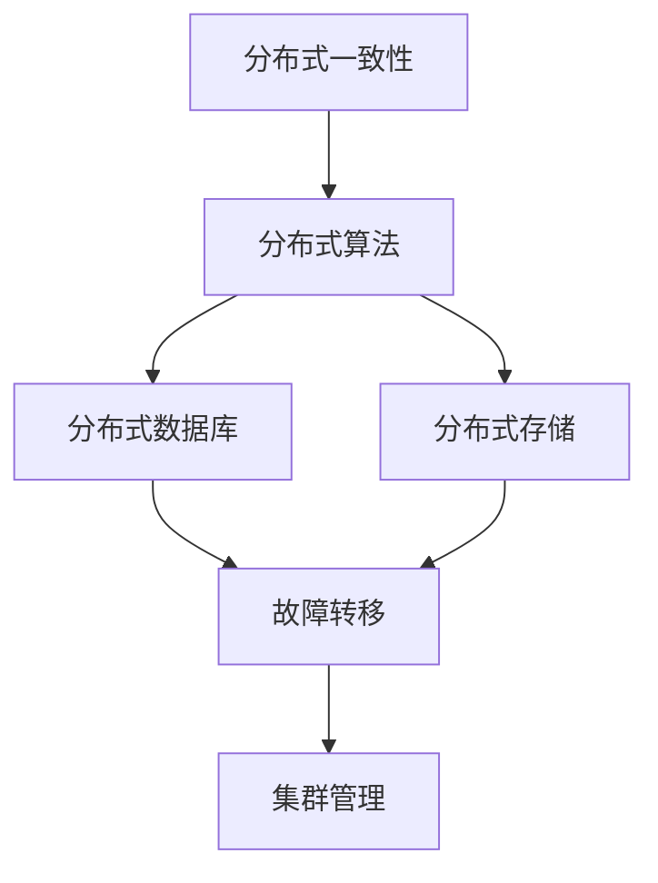

                 

关键词：分布式系统，一致性，容错性，CAP定理，一致性算法，分布式数据库，分布式存储，故障转移，集群管理，高可用性。

摘要：本文将深入探讨分布式系统的一致性和容错性，分析CAP定理，介绍一致性算法，讨论分布式数据库和分布式存储的挑战，阐述故障转移和集群管理的策略，并展望未来的发展趋势和面临的挑战。

## 1. 背景介绍

在当今快速发展的互联网时代，分布式系统已经成为企业构建大规模、高可用性应用的基础。随着云计算、大数据和物联网等技术的普及，分布式系统在处理海量数据和提供高并发服务方面展现出强大的优势。然而，分布式系统也带来了新的挑战，尤其是在一致性和容错性方面。

一致性指的是多个分布式节点在并发操作下，能够保持数据的一致状态。容错性则是指系统能够在发生故障时，通过一定的机制保证服务不中断。这两个特性对于分布式系统的可靠性至关重要。然而，在分布式环境中，一致性、可用性和分区容错性（CAP定理）通常是难以同时满足的，如何在三者之间取得平衡，成为分布式系统设计的关键问题。

## 2. 核心概念与联系

为了更好地理解分布式系统的一致性和容错性，我们首先需要了解几个核心概念：分布式一致性、分布式算法、分布式数据库、分布式存储和故障转移。

### 2.1 分布式一致性

分布式一致性是指多个分布式节点在并发操作下，能够保持数据的一致状态。这通常涉及到一系列的算法和协议，如Paxos、Raft和ZAB等。

### 2.2 分布式算法

分布式算法是确保分布式系统在并发操作下，数据能保持一致状态的关键。Paxos、Raft和ZAB是最常用的分布式一致性算法，它们在不同的场景下有不同的优势。

### 2.3 分布式数据库

分布式数据库是将数据分布到多个节点上进行存储和管理的系统。它提供了高可用性和高性能，但同时也引入了数据一致性的挑战。

### 2.4 分布式存储

分布式存储是将数据存储到多个节点上，以提供高可用性和高性能。它与分布式数据库类似，但在数据一致性和容错性方面面临不同的挑战。

### 2.5 故障转移

故障转移是一种容错机制，当主节点发生故障时，能够自动将服务切换到备用节点，保证系统的高可用性。

### 2.6 集群管理

集群管理是确保分布式系统正常运行的关键。它涉及到节点的添加、删除、故障检测和故障转移等操作。

以下是分布式系统核心概念和联系的一个简化版Mermaid流程图：



## 3. 核心算法原理 & 具体操作步骤

### 3.1 算法原理概述

在分布式系统中，一致性算法是确保多个节点在并发操作下保持数据一致性的关键。Paxos、Raft和ZAB是三种最常用的分布式一致性算法。

- **Paxos算法**：Paxos算法是由Lamport提出的一种分布式一致性算法，用于在分布式系统中达成共识。它的核心思想是通过提案-确认机制，确保多个节点能够在数据一致性上达成一致。

- **Raft算法**：Raft算法是由Ousterhout等人在2010年提出的一种分布式一致性算法，它通过简化Paxos算法的复杂性，使其更易于理解和实现。Raft算法通过日志复制和领导者选举机制，确保系统的一致性。

- **ZAB算法**：ZAB算法是ZooKeeper的原生子协议，它是一种基于Paxos算法的分布式一致性算法。ZAB算法通过保证原子性和持久性，确保分布式系统的数据一致性。

### 3.2 算法步骤详解

以下是Paxos算法的基本步骤：

1. **提议（Proposal）**：一个提议者（Proposer）生成一个提案，并将其发送给所有接受者（Acceptor）。
2. **接受（Accept）**：接受者收到提案后，会将其记录下来，并返回一个承诺（Promise）给提议者。
3. **学习（Learn）**：提议者收到足够多的承诺后，会向所有接受者发送一个决定（Decision），通知它们将提案的内容写入日志。
4. **确认（Commit）**：接受者在将提案内容写入日志后，会向客户端发送确认消息。

以下是Raft算法的基本步骤：

1. **领导选举（Leader Election）**：当当前领导者失败时，集群中的其他节点会通过随机等待时间开始领导选举。
2. **日志复制（Log Replication）**：领导者将日志条目发送给追随者（Follower），并等待其确认。
3. **状态转换（State Transition）**：当追随者接收到领导者的日志条目并确认后，它会执行这些日志条目，并更新其状态。

以下是ZAB算法的基本步骤：

1. **初始化（Initialize）**：ZooKeeper集群中的每个节点都会在启动时进入初始化状态。
2. **领导者选举（Leader Election）**：当当前领导者失败时，集群中的节点会通过ZAB协议进行领导者选举。
3. **同步（Sync）**：领导者将日志条目同步给追随者，并确保所有节点上的日志保持一致。
4. **持久化（Persist）**：领导者将同步后的日志条目持久化到存储中，以确保数据不会丢失。

### 3.3 算法优缺点

#### Paxos算法

- **优点**：Paxos算法具有较好的容错性和一致性保证，能够处理分布式系统中的各种故障情况。
- **缺点**：Paxos算法的复杂性较高，实现难度大，不易理解。

#### Raft算法

- **优点**：Raft算法相比Paxos算法更简单，易于实现和理解，同时具有较好的性能和可扩展性。
- **缺点**：Raft算法在某些极端情况下可能不如Paxos算法高效。

#### ZAB算法

- **优点**：ZAB算法是ZooKeeper的核心协议，具有较好的性能和可靠性，适用于分布式协调场景。
- **缺点**：ZAB算法的实现较为复杂，需要一定的技术积累。

### 3.4 算法应用领域

Paxos、Raft和ZAB算法广泛应用于分布式系统的一致性保证。例如：

- **分布式数据库**：如Cassandra和HBase等，使用Paxos算法或其变体来保证数据一致性。
- **分布式存储**：如ZooKeeper和etcd等，使用Raft或ZAB算法来实现分布式协调和配置管理。
- **分布式消息队列**：如RabbitMQ和Kafka等，使用分布式一致性算法来保证消息传递的一致性。

## 4. 数学模型和公式 & 详细讲解 & 举例说明

在分布式系统中，数学模型和公式是理解和设计一致性算法的重要工具。以下我们将介绍一些常用的数学模型和公式，并通过案例进行详细讲解。

### 4.1 数学模型构建

在分布式系统中，一致性算法通常涉及到多个节点之间的通信和协调。我们可以用图模型来表示分布式系统，其中节点表示分布式系统中的节点，边表示节点之间的通信路径。

定义：

- **节点集**：N = {n1, n2, ..., nk}，表示分布式系统中的所有节点。
- **通信图**：G = (N, E)，表示节点之间的通信路径，E表示边的集合。

### 4.2 公式推导过程

在分布式一致性算法中，常见的公式包括：

- **Lamport时钟**：用于记录事件发生的顺序。
- **复制状态机**：用于描述分布式系统的一致性状态。

Lamport时钟的推导过程如下：

1. **初始化**：每个节点都有一个初始时钟值，记为t。
2. **事件发生**：每当一个事件发生时，节点的时钟值会增加1，即t' = t + 1。
3. **消息传递**：当一个节点发送一个消息时，会将自己的时钟值附加到消息中。

假设有两个节点n1和n2，n1发送一个消息给n2，消息中的时钟值为t1，则n2在接收到消息后，将更新其时钟值为max(t2, t1)。

### 4.3 案例分析与讲解

以下是一个简单的分布式一致性算法案例，使用Lamport时钟来记录事件顺序。

假设有两个节点n1和n2，n1要执行一个更新操作，更新值为v。

1. **初始化**：n1的初始时钟值为t1，n2的初始时钟值为t2。
2. **发送请求**：n1向n2发送一个请求消息，消息中的时钟值为t1。
3. **接收请求**：n2接收到请求消息后，更新其时钟值为max(t2, t1) = t1，并将更新值v存储在本地状态机中。
4. **发送确认**：n2向n1发送确认消息，消息中的时钟值为t1。
5. **接收确认**：n1接收到确认消息后，更新其时钟值为max(t1, t1) = t1，并执行更新操作。

在这个案例中，通过使用Lamport时钟，n1和n2能够保持数据的一致性。如果n2在接收到请求消息后发生故障，n1在接收到确认消息后，可以重新发送请求，确保数据的一致性。

## 5. 项目实践：代码实例和详细解释说明

为了更好地理解分布式系统的一致性和容错性，我们将通过一个简单的分布式锁项目，展示如何使用Paxos算法实现分布式一致性。

### 5.1 开发环境搭建

- **操作系统**：Ubuntu 20.04
- **编程语言**：Go
- **Paxos算法库**：使用Go语言的Paxos实现库，如`go-paxos`。

### 5.2 源代码详细实现

以下是使用`go-paxos`库实现的Paxos算法的简单示例：

```go
package main

import (
	"fmt"
	"log"
	"net"
	"os"
	"sync"
	"time"

	"github.com/liyanan/gopaxos"
)

type PV struct {
	// 存储最新的日志条目
	value string
	// 锁状态：true表示锁被占用，false表示锁可用
	lock bool
	// 锁等待队列
	queue []string
	// 锁的访问锁
锁访问锁 sync.Mutex
}

func (pv *PV) Propose(value string) error {
	// 创建Paxos提议者
	paxosProposer := gopaxos.NewProposer(1, gopaxos.Config{})

	// 发送Paxos提议
	return paxosProposer.Propose(value, func(value string) error {
		// 更新状态机
		pv.锁访问锁.Lock()
		defer pv.锁访问锁.Unlock()
		pv.value = value
		fmt.Printf("Proposed value: %s\n", value)
		return nil
	})
}

func main() {
	// 创建PV实例
	pv := &PV{
		value: "",
		lock:  false,
		queue: []string{},
	}

	// 创建TCP服务器
	listener, err := net.Listen("tcp", ":8080")
	if err != nil {
		log.Fatalf("Listen failed: %v", err)
	}
	defer listener.Close()

	// 启动Paxos算法
	paxosRunner := gopaxos.NewRunner(gopaxos.Config{})
	paxosRunner.SetDecisionHandler(func(value string) {
		pv.锁访问锁.Lock()
		defer pv.锁访问锁.Unlock()
		pv.value = value
		fmt.Printf("Decision made: %s\n", value)
	})

	// 启动服务器
	for {
		conn, err := listener.Accept()
		if err != nil {
			log.Printf("Accept failed: %v", err)
			continue
		}
		go handleClient(conn, pv)
	}
}

func handleClient(conn net.Conn, pv *PV) {
	defer conn.Close()

	// 读取客户端请求
	request := make([]byte, 1024)
	_, err := conn.Read(request)
	if err != nil {
		log.Printf("Read failed: %v", err)
		return
	}

	// 解析请求
	value := string(request)

	// 提交请求
	err = pv.Propose(value)
	if err != nil {
		log.Printf("Propose failed: %v", err)
		return
	}

	// 等待决策结果
	time.Sleep(2 * time.Second)

	// 发送回复
	response := []byte(pv.value)
	_, err = conn.Write(response)
	if err != nil {
		log.Printf("Write failed: %v", err)
		return
	}
}
```

### 5.3 代码解读与分析

在这个示例中，我们首先创建了一个`PV`结构体，用于表示分布式锁的状态。`PV`结构体包含锁的值、锁的状态和锁的等待队列。我们还定义了一个`Propose`方法，用于向Paxos提议者发送提议。

接下来，我们创建了一个TCP服务器，用于处理客户端的请求。客户端通过发送请求来获取锁。服务器在接收到请求后，会调用`Propose`方法向Paxos提议者发送提议。Paxos提议者会根据提议的内容更新状态机，并在决策后通知服务器。

在主函数中，我们启动了Paxos算法的运行器，并设置了决策处理函数。决策处理函数会在Paxos提议被决策后更新`PV`结构体的值。

最后，我们实现了`handleClient`函数，用于处理客户端的连接。函数首先读取客户端的请求，然后调用`Propose`方法发送提议。在等待决策结果后，函数会发送回复给客户端。

### 5.4 运行结果展示

在运行此示例时，我们可以启动多个客户端来模拟并发访问。每个客户端会尝试获取锁，并在成功获取锁后执行相应的操作。

以下是一个简单的客户端示例：

```go
package main

import (
	"bytes"
	"fmt"
	"net"
)

func main() {
	// 连接服务器
	conn, err := net.Dial("tcp", "localhost:8080")
	if err != nil {
		log.Fatalf("Dial failed: %v", err)
	}
	defer conn.Close()

	// 构建请求
	value := "Client 1"
	request := []byte(value)

	// 发送请求
	_, err = conn.Write(request)
	if err != nil {
		log.Fatalf("Write failed: %v", err)
	}

	// 读取响应
	response := make([]byte, 1024)
	_, err = conn.Read(response)
	if err != nil {
		log.Fatalf("Read failed: %v", err)
	}

	// 解析响应
	reply := string(response)
	fmt.Printf("Received reply: %s\n", reply)
}
```

每次运行客户端，客户端都会发送一个请求到服务器，并在成功获取锁后打印收到的响应。通过多个客户端的并发访问，我们可以观察到Paxos算法的一致性保证。

## 6. 实际应用场景

分布式系统的一致性和容错性在许多实际应用场景中至关重要。以下是一些典型的应用场景：

### 6.1 分布式数据库

分布式数据库是分布式系统的一致性和容错性的重要应用场景。例如，Cassandra和HBase等分布式数据库系统，通过Paxos算法或其变体实现数据一致性。分布式数据库可以水平扩展，提供高可用性和高性能，广泛应用于大数据处理、实时分析和物联网等领域。

### 6.2 分布式存储

分布式存储系统，如ZooKeeper和etcd，通过Raft或ZAB算法实现分布式一致性。这些系统用于配置管理、分布式锁和分布式队列等场景，确保分布式系统中的不同组件协调一致地工作。

### 6.3 分布式消息队列

分布式消息队列系统，如RabbitMQ和Kafka，通过分布式一致性算法保证消息传递的一致性。分布式消息队列用于处理高并发消息传递，广泛应用于实时通信、在线交易和物流跟踪等领域。

### 6.4 云计算平台

云计算平台，如Amazon Web Services（AWS）和Microsoft Azure，通过分布式系统的一致性和容错性，提供可靠的服务。这些平台通过分布式一致性算法和故障转移机制，确保服务的高可用性和数据的一致性。

### 6.5 物联网（IoT）

物联网系统通过分布式系统的一致性和容错性，处理大量的设备和数据。分布式一致性算法和故障转移机制，确保物联网系统在设备故障和数据丢失时，仍能保持正常运行。

## 7. 工具和资源推荐

为了深入学习和实践分布式系统的一致性和容错性，以下是一些建议的学习资源、开发工具和论文推荐：

### 7.1 学习资源推荐

- **书籍**：
  - 《分布式系统原理与范型》
  - 《分布式算法与系统设计》
  - 《大规模分布式存储系统设计与实践》
- **在线课程**：
  - Coursera上的《分布式系统设计与实践》
  - edX上的《分布式系统导论》
- **博客和文档**：
  - Apache ZooKeeper官方文档
  - Apache Cassandra官方文档
  - Raft论文原文和解读

### 7.2 开发工具推荐

- **分布式一致性算法库**：
  - Go语言的`go-paxos`
  - Go语言的`go-raft`
  - Python语言的`python-raft`
- **分布式数据库**：
  - Apache Cassandra
  - Apache HBase
  - Amazon DynamoDB
- **分布式存储**：
  - Apache ZooKeeper
  - etcd
  - Redisson

### 7.3 相关论文推荐

- **Paxos算法**：
  - “Paxos made simple” by Leslie Lamport
  - “Practical Paxos” by Robbert van Renesse, Herwig Muntingh, and Johan van Leeuwen
- **Raft算法**：
  - “In Search of an Understandable Consensus Algorithm” by Diego Ongaro and John Ousterhout
- **分布式数据库**：
  - “The Google File System” by Sanjay Ghemawat, Shun-Tak Leung, Frank McPherson, Michael Burrows, and Sergey Spiridovsk
  - “Bigtable: A Distributed Storage System for Structured Data” by Sanjay Ghemawat, Howard G. Weed, and Shun-Tak Leung

## 8. 总结：未来发展趋势与挑战

分布式系统的一致性和容错性在未来将继续发展和演变，面临着一系列的挑战和机遇。

### 8.1 研究成果总结

近年来，分布式系统的研究取得了显著进展，包括一致性算法的优化、分布式数据库的创新和分布式存储系统的性能提升。Paxos、Raft和ZAB等算法被广泛应用，并在实际系统中取得了良好的效果。此外，分布式数据库和分布式存储系统在性能、可扩展性和可靠性方面也取得了重要突破。

### 8.2 未来发展趋势

未来，分布式系统的一致性和容错性将继续朝着以下几个方向发展：

1. **更高效的一致性算法**：研究者将继续探索更高效、更易于实现的分布式一致性算法，以满足大规模分布式系统的需求。
2. **自适应容错机制**：分布式系统将引入更智能的容错机制，根据系统负载和节点状态自动调整容错策略。
3. **跨云和混合云部署**：分布式系统将支持跨云和混合云部署，实现更高的灵活性和可扩展性。
4. **边缘计算与分布式系统融合**：随着边缘计算的兴起，分布式系统将逐步与边缘计算相结合，提供更高效、更可靠的边缘服务。

### 8.3 面临的挑战

尽管分布式系统的一致性和容错性取得了显著进展，但仍然面临一系列挑战：

1. **性能与一致性的权衡**：如何在保证一致性的同时，提高系统性能，仍是一个重要的研究课题。
2. **分布式数据安全**：随着分布式系统的广泛应用，数据安全和隐私保护成为日益重要的挑战。
3. **跨域协同**：在跨地域、跨网络的分布式环境中，如何实现高效的数据传输和协同工作，是一个重要的技术难题。
4. **复杂性和可运维性**：分布式系统的复杂性和可运维性，仍然是企业和开发者面临的重要挑战。

### 8.4 研究展望

未来，分布式系统的一致性和容错性研究将继续深入，探索更多创新性的解决方案。同时，随着人工智能和机器学习技术的发展，分布式系统也将逐渐融入这些新兴技术，为分布式系统的一致性和容错性提供新的思路和方法。

## 9. 附录：常见问题与解答

### 9.1 Paxos算法是如何工作的？

Paxos算法是一种分布式一致性算法，用于在分布式系统中达成共识。Paxos算法的核心思想是通过提议-确认机制，确保多个节点能够在数据一致性上达成一致。算法分为提议者（Proposer）、接受者（Acceptor）和学习者（Learner）三个角色。

### 9.2 什么是Raft算法？

Raft算法是一种分布式一致性算法，由Ousterhout等人提出。Raft算法通过简化Paxos算法的复杂性，使其更易于理解和实现。Raft算法通过日志复制和领导者选举机制，确保分布式系统的一致性。

### 9.3 什么是ZAB算法？

ZAB算法是ZooKeeper的原生子协议，是一种基于Paxos算法的分布式一致性算法。ZAB算法通过保证原子性和持久性，确保分布式系统的数据一致性。

### 9.4 分布式数据库的一致性问题有哪些？

分布式数据库的一致性问题主要包括以下几种：

1. **写一致性问题**：当多个节点同时写入数据时，如何保证数据的一致性。
2. **读一致性问题**：当多个节点同时读取数据时，如何保证读取到的数据是最新的一致状态。
3. **分区一致性**：在分布式系统中，如何保证不同分区之间的数据一致性。

### 9.5 如何提高分布式系统的容错性？

提高分布式系统的容错性可以通过以下方法实现：

1. **副本复制**：将数据复制到多个节点上，确保故障节点不会导致数据丢失。
2. **故障转移**：在主节点故障时，自动将服务切换到备用节点，确保系统的高可用性。
3. **自动修复**：在检测到故障时，自动进行修复，恢复系统的正常运行。

### 9.6 分布式存储和分布式数据库的区别是什么？

分布式存储和分布式数据库的主要区别在于：

- **数据存储方式**：分布式存储主要用于存储非结构化或半结构化数据，如文件和对象。分布式数据库主要用于存储结构化数据，如关系数据库。
- **一致性要求**：分布式存储通常对一致性要求较低，主要关注性能和可用性。分布式数据库则强调数据一致性和事务处理。
- **应用场景**：分布式存储广泛应用于大数据处理、对象存储和文件存储。分布式数据库则广泛应用于在线交易、实时分析和企业级应用。 

## 10. 结束语

本文深入探讨了分布式系统的一致性和容错性，分析了CAP定理，介绍了Paxos、Raft和ZAB等一致性算法，并探讨了分布式数据库和分布式存储的挑战。通过实际项目实践，展示了如何使用Paxos算法实现分布式一致性。展望未来，分布式系统的一致性和容错性将继续发展和演变，面临一系列的挑战和机遇。作者希望本文能为读者在分布式系统领域的研究和实践提供有益的参考和启示。作者：禅与计算机程序设计艺术 / Zen and the Art of Computer Programming。

