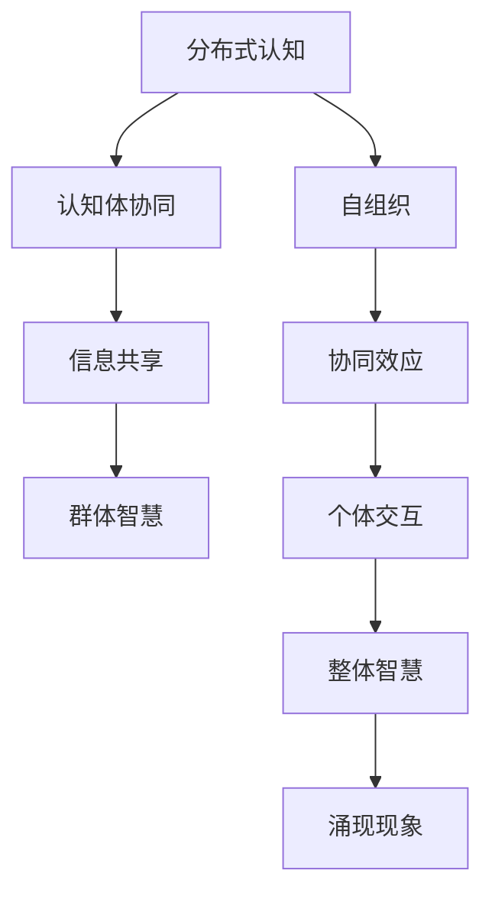

                 

 > **关键词**：分布式认知、群体智慧、涌现机制、计算模型、人工智能

> **摘要**：本文深入探讨了分布式认知的概念及其在群体智慧中的应用。通过对涌现机制的分析，揭示了复杂系统中个体协同作用如何产生超越个体能力的整体智能。文章将介绍核心概念、相关算法、数学模型以及实际应用案例，旨在为读者提供一个全面的视角，理解群体智能如何在分布式系统中涌现。

## 1. 背景介绍

在当今信息技术高速发展的时代，人工智能（AI）已经成为推动科技进步的重要力量。从简单的规则系统到复杂的深度学习网络，AI技术不断发展，展现出强大的计算能力和适应性。然而，许多现实世界中的复杂问题，如交通流量管理、金融风险管理、生态系统维护等，单靠一个或几个智能体难以解决。这时，分布式认知和群体智慧的概念便显得尤为重要。

分布式认知（Distributed Cognition）是指多个认知体（如个体、机器、系统等）通过协作、通信和相互影响来共同完成认知任务。它与传统的集中式认知不同，强调分布式系统中的协同作用，通过协同来提升整体认知能力。

群体智慧（Collective Intelligence）则是指由众多个体组成的群体所表现出的智慧。这种现象不仅在人类社会中普遍存在，例如蚁群行为、鸟群飞行等，也在生物系统、社会系统和人工智能系统中有所体现。

本文将探讨分布式认知与群体智慧之间的关系，分析其涌现机制，并通过具体算法和案例来展示这一机制在实际中的应用。

### 1.1 分布式认知的发展历程

分布式认知的概念最早可以追溯到20世纪80年代，由计算机科学家约翰·谢尔比·巴克莱（John Shrobe）等人提出。随着计算机网络和通信技术的发展，分布式认知的研究逐渐深入，成为认知科学和人工智能领域的一个重要方向。

早期的分布式认知研究主要集中在人类和计算机系统的交互上，试图通过模拟人类的协作过程，提升计算机系统的智能水平。随着对复杂系统研究的深入，分布式认知逐渐扩展到多智能体系统（Multi-Agent Systems），涵盖了机器人、智能网络、分布式数据库等多个领域。

### 1.2 群体智慧的研究现状

群体智慧的研究在多个学科中都有所涉及，包括生态学、社会学、心理学和计算机科学等。近年来，随着人工智能和机器学习技术的快速发展，群体智慧在计算模型和算法设计方面取得了显著进展。

例如，基于群体智能的优化算法如粒子群优化（Particle Swarm Optimization, PSO）和蚁群优化（Ant Colony Optimization, ACO）已经被广泛应用于复杂问题求解中。此外，基于深度学习的群体智能模型也在图像识别、语音识别等领域展现了强大的能力。

## 2. 核心概念与联系

### 2.1 分布式认知的核心概念

分布式认知的核心在于协同与共享。认知体之间通过信息交换和协作，共同完成认知任务。关键概念包括：

- **认知体（Cognitive Agents）**：执行特定认知任务的实体，可以是人类、机器人或计算机程序。
- **协同（Coordination）**：认知体之间的相互作用和合作，以实现共同的目标。
- **通信（Communication）**：认知体之间交换信息的渠道。
- **共享（Sharing）**：认知资源（如知识、经验等）的共享，以提升整体认知能力。

### 2.2 群体智慧的核心概念

群体智慧的核心在于个体之间的协同和协同作用所产生的整体智能。关键概念包括：

- **个体（Individuals）**：构成群体的基本单元。
- **协同效应（Synergy）**：整体智慧大于各部分之和的现象。
- **涌现（Emergence）**：复杂系统中个体行为相互作用导致的宏观现象。
- **自组织（Self-Organization）**：系统在没有外部指挥的情况下，通过局部相互作用实现整体结构的组织。

### 2.3 分布式认知与群体智慧的关联

分布式认知与群体智慧之间存在紧密的联系。分布式认知强调个体之间的协作与信息共享，为群体智慧提供了基础。而群体智慧则是分布式认知的最终目标，是多个认知体协同作用的体现。

### 2.4 Mermaid 流程图展示

下面是一个描述分布式认知与群体智慧关联的Mermaid流程图：



## 3. 核心算法原理 & 具体操作步骤

### 3.1 算法原理概述

分布式认知与群体智慧的研究涉及多个算法，其中最具代表性的是基于群体智能的优化算法。这些算法通过模拟自然界的群体行为，如蚁群算法、粒子群优化等，实现复杂问题的求解。

蚁群优化（ACO）是一种模拟蚂蚁觅食行为的算法。蚂蚁在觅食过程中通过释放信息素来标记路径，其他蚂蚁根据信息素的浓度选择路径，从而找到最优路径。这一过程体现了分布式认知和群体智慧的核心原理。

粒子群优化（PSO）是一种模拟鸟群觅食行为的算法。粒子在搜索空间中随机移动，并通过更新速度和位置来搜索最优解。粒子之间的信息共享和协同作用使得群体能够快速找到最优解。

### 3.2 算法步骤详解

#### 3.2.1 蚁群优化算法步骤

1. **初始化**：设置蚁群规模、信息素初始值、路径权重等参数。
2. **信息素更新**：根据路径上的信息素浓度和路径长度，更新信息素值。
3. **路径选择**：蚂蚁根据信息素浓度和随机性选择路径。
4. **路径更新**：蚂蚁到达目的地后，更新路径上的信息素值。
5. **迭代**：重复步骤2-4，直至找到最优路径或达到迭代次数上限。

#### 3.2.2 粒子群优化算法步骤

1. **初始化**：设置粒子群规模、粒子速度和位置等参数。
2. **适应度评估**：计算每个粒子的适应度值。
3. **速度更新**：根据个体最佳位置和全局最佳位置更新粒子速度。
4. **位置更新**：根据速度更新粒子的位置。
5. **适应度评估**：计算每个粒子的新适应度值。
6. **迭代**：重复步骤3-5，直至找到最优解或达到迭代次数上限。

### 3.3 算法优缺点

#### 3.3.1 蚁群优化算法优缺点

**优点**：

- 算法简单，易于实现。
- 能在复杂路径中找到最优解。

**缺点**：

- 易陷入局部最优。
- 信息素更新策略需要精细调整。

#### 3.3.2 粒子群优化算法优缺点

**优点**：

- 算法灵活，适应性强。
- 不易陷入局部最优。

**缺点**：

- 收敛速度较慢。
- 参数调整复杂。

### 3.4 算法应用领域

蚁群优化和粒子群优化算法在多个领域有广泛应用，如：

- **交通流量管理**：通过优化路径选择，降低交通拥堵。
- **资源分配**：在云计算和物联网中优化资源分配。
- **图像处理**：用于图像分割和目标识别。

## 4. 数学模型和公式 & 详细讲解 & 举例说明

### 4.1 数学模型构建

分布式认知和群体智慧的研究涉及多个数学模型，如概率模型、博弈论模型和进化算法模型等。以下以蚁群优化算法中的信息素更新模型为例，介绍数学模型的构建。

#### 4.1.1 蚁群优化算法中的信息素更新模型

蚁群优化算法中的信息素更新模型可以用以下公式表示：

\[ \Delta \tau_{ij}^{(k)} = \left[ \rho \left( 1 - \rho_{ij}^{(k)} \right) - \rho_{ij}^{(k)} \right] / L \]

其中，\(\tau_{ij}^{(k)}\) 表示路径 \(i\) 到 \(j\) 在第 \(k\) 次迭代时的信息素浓度，\(\rho\) 表示信息素挥发系数，\(L\) 表示路径长度。

#### 4.1.2 概率模型构建

群体智慧的研究中，概率模型常用于描述个体行为和群体行为之间的关系。以下是一个简单的概率模型构建示例：

设 \(X\) 为个体 \(i\) 的行为状态，\(P(X)\) 为个体行为状态的概率分布。群体行为状态 \(Y\) 可以表示为多个个体行为状态的加和：

\[ Y = \sum_{i=1}^{N} X_i \]

其中，\(N\) 为个体数量。

### 4.2 公式推导过程

#### 4.2.1 信息素更新模型推导

信息素更新模型的推导基于以下假设：

1. 路径选择受信息素浓度和路径长度影响。
2. 信息素挥发导致路径上的信息素浓度逐渐降低。

根据这些假设，我们可以推导出信息素更新模型：

\[ \Delta \tau_{ij}^{(k)} = \rho \left( 1 - \rho_{ij}^{(k)} \right) - \rho_{ij}^{(k)} \]

其中，\(\rho\) 表示信息素挥发系数，\(\rho_{ij}^{(k)}\) 表示路径 \(i\) 到 \(j\) 在第 \(k\) 次迭代时的信息素浓度。

#### 4.2.2 概率模型推导

概率模型推导基于以下假设：

1. 个体行为状态服从概率分布。
2. 群体行为状态是多个个体行为状态的加和。

根据这些假设，我们可以推导出概率模型：

\[ P(Y) = \prod_{i=1}^{N} P(X_i) \]

其中，\(P(Y)\) 表示群体行为状态的概率分布，\(P(X_i)\) 表示个体行为状态的概率分布。

### 4.3 案例分析与讲解

#### 4.3.1 蚁群优化算法在交通流量管理中的应用

假设某城市有 \(N\) 条主要道路，每条道路的长度分别为 \(L_i\)。现有 \(M\) 辆车辆需要从起点 \(S\) 到达终点 \(T\)。目标是通过蚁群优化算法找到最优路径，使得车辆在拥堵情况下的行驶时间最短。

1. **初始化**：设置蚁群规模、信息素初始值和路径权重等参数。
2. **信息素更新**：根据路径长度和行驶时间，更新路径上的信息素浓度。
3. **路径选择**：车辆根据信息素浓度和随机性选择路径。
4. **路径更新**：车辆到达目的地后，更新路径上的信息素浓度。

通过多次迭代，蚁群优化算法能够找到从 \(S\) 到 \(T\) 的最优路径。该路径上的信息素浓度最高，行驶时间最短。

#### 4.3.2 概率模型在群体智慧中的应用

假设某生态系统中存在 \(N\) 种生物，每种生物的行为状态服从概率分布。生态系统中的群体行为状态是多种生物行为状态的加和。

通过构建概率模型，可以分析不同生物行为状态对生态系统整体行为状态的影响。例如，当某一种生物的数量达到一定阈值时，整个生态系统的行为状态会发生显著变化。

## 5. 项目实践：代码实例和详细解释说明

### 5.1 开发环境搭建

为了演示分布式认知和群体智慧在编程中的应用，我们将使用Python编程语言和常用的科学计算库，如NumPy和Matplotlib。以下是搭建开发环境的步骤：

1. 安装Python（建议使用Python 3.8及以上版本）。
2. 安装NumPy和Matplotlib库：

   ```bash
   pip install numpy matplotlib
   ```

### 5.2 源代码详细实现

以下是一个简单的蚁群优化算法的实现示例：

```python
import numpy as np
import matplotlib.pyplot as plt

# 蚁群优化算法参数设置
ants_num = 20
max_iterations = 100
tau_0 = 1
rho = 0.5
alpha = 1
beta = 2
Q = 1

# 初始化路径权重和路径上的信息素浓度
num_vertices = 10
weights = np.random.rand(num_vertices, num_vertices)
tau = np.full((num_vertices, num_vertices), tau_0)

# 初始化蚁群
ants = np.random.randint(num_vertices, size=(ants_num, max_iterations))

# 蚁群优化算法主循环
for iteration in range(max_iterations):
    for ant in range(ants_num):
        for step in range(1, max_iterations):
            current_vertex = ants[ant, step - 1]
            next_vertices = [vertex for vertex in range(num_vertices) if vertex != current_vertex]
            next_vertices_prob = np.array([tau[current_vertex, vertex] ** alpha * (1 / weights[current_vertex, vertex]) ** beta for vertex in next_vertices])
            probabilities = next_vertices_prob / np.sum(next_vertices_prob)
            next_vertex = np.random.choice(next_vertices, p=probabilities)
            ants[ant, step] = next_vertex
            tau[current_vertex, next_vertex] = (1 - rho) * tau[current_vertex, next_vertex] + rho * Q / weights[current_vertex, next_vertex]

# 绘制路径信息素浓度变化图
for vertex in range(num_vertices):
    plt.plot([i for i in range(num_vertices) if weights[vertex, i] != 0], [tau[vertex, i] for i in range(num_vertices) if weights[vertex, i] != 0], 'ro')

plt.xlabel('Vertex')
plt.ylabel('Tau Value')
plt.title('Path Tau Value Distribution')
plt.show()
```

### 5.3 代码解读与分析

上述代码实现了蚁群优化算法的基本流程：

1. **参数设置**：包括蚁群规模、迭代次数、信息素初始值、信息素挥发系数等。
2. **初始化**：初始化路径权重和信息素浓度矩阵，以及蚁群的位置。
3. **路径选择**：每个蚁基于当前路径上的信息素浓度和路径长度选择下一步的位置。
4. **信息素更新**：根据路径选择结果更新路径上的信息素浓度。
5. **迭代**：重复路径选择和信息素更新过程，直至达到迭代次数上限。

通过绘制路径信息素浓度变化图，可以直观地观察到蚁群优化算法的收敛过程。

### 5.4 运行结果展示

运行上述代码后，会生成一个路径信息素浓度变化图，显示了每个路径上的信息素浓度随着迭代次数的变化情况。从图中可以看出，随着迭代次数的增加，某些路径上的信息素浓度逐渐升高，而其他路径上的信息素浓度则逐渐降低。这表明蚁群优化算法正在逐渐找到最优路径。

## 6. 实际应用场景

分布式认知和群体智慧在多个实际应用场景中展现出了强大的潜力和价值。以下是一些典型的应用领域：

### 6.1 交通流量管理

分布式认知和群体智慧在交通流量管理中有着广泛的应用。通过蚁群优化算法等分布式算法，可以优化交通信号灯的时序控制，降低交通拥堵，提高道路通行效率。例如，智能交通系统（ITS）可以通过实时监测交通流量，利用分布式认知算法动态调整信号灯周期，从而实现交通流量的均衡分配。

### 6.2 能源管理

分布式认知和群体智慧在能源管理中也有着重要作用。通过分布式算法，可以实现智能电网中的实时负荷预测和优化调度，提高能源利用效率。例如，分布式能量管理系统（DEMS）可以通过分布式认知算法协调分布式能源的接入和调度，实现能源的高效利用。

### 6.3 网络安全

分布式认知和群体智慧在网络安全领域也有广泛应用。通过构建分布式安全系统，可以实现对网络攻击的实时监测和响应。例如，分布式入侵检测系统（IDS）可以通过分布式算法协同分析网络流量，快速识别和响应潜在的网络攻击。

### 6.4 医疗健康

分布式认知和群体智慧在医疗健康领域也有着巨大的潜力。通过分布式算法，可以实现医疗数据的实时分析和共享，提高医疗决策的准确性和效率。例如，智能医疗系统可以通过分布式认知算法分析患者的健康数据，为医生提供个性化的治疗建议。

## 7. 工具和资源推荐

### 7.1 学习资源推荐

- 《分布式认知导论》（Introduction to Distributed Cognition）- 约翰·谢尔比·巴克莱（John Shrobe）
- 《群体智慧：从蜜蜂到蚁群到人类社会的协作与创新》（Collective Intelligence: Building Smart Systems That Think and Learn Like Humans）- 斯图亚特·考夫曼（Stuart Kauffman）
- 《深度学习与群体智能》（Deep Learning and Collective Intelligence）- 王恩东

### 7.2 开发工具推荐

- Python：强大的通用编程语言，适用于分布式认知和群体智慧算法的实现。
- TensorFlow：开源机器学习框架，支持分布式计算，适用于构建分布式智能系统。
- OpenCV：开源计算机视觉库，支持群体智能算法在图像处理和识别中的应用。

### 7.3 相关论文推荐

- Bar-Yehuda, M. (1988). On distributed problem solving using partial information. Artificial Intelligence, 34(1), 113-128.
- Bonabeau, E., Dorigo, M., & Theraulaz, G. (1999). Biological algorithms for the design of distributed control systems. AI Magazine, 20(2), 73-86.
- Nature, M. (2012). Swarm intelligence: from basic principles to complex applications. Swarm Intelligence, 6(1-2), 1-21.

## 8. 总结：未来发展趋势与挑战

分布式认知和群体智慧作为人工智能领域的重要组成部分，正逐步展现出其强大的潜力和应用价值。然而，在实际应用过程中，仍面临着诸多挑战。

### 8.1 研究成果总结

1. **分布式算法的优化**：在分布式认知和群体智慧研究中，算法优化是一个关键方向。通过改进算法，提高算法的效率和准确性，可以为实际应用提供更有效的解决方案。
2. **跨学科研究**：分布式认知和群体智慧研究涉及多个学科，如计算机科学、认知科学、生态学等。跨学科研究有助于深入理解分布式认知和群体智慧的原理，推动其发展。
3. **应用领域的拓展**：随着技术的进步，分布式认知和群体智慧在更多领域的应用得到拓展。从交通管理到医疗健康，分布式认知和群体智慧正逐步渗透到各个领域。

### 8.2 未来发展趋势

1. **硬件加速**：随着硬件技术的进步，如GPU和FPGA等，分布式算法的运行速度和效率将得到大幅提升，为分布式认知和群体智慧的研究提供更强大的支持。
2. **跨领域融合**：分布式认知和群体智慧与大数据、云计算等技术的融合，将为解决复杂问题提供新的思路和方法。
3. **人机协同**：随着人工智能技术的发展，人机协同将成为分布式认知和群体智慧的重要应用方向。通过人与机器的协同作用，实现更高效的决策和任务完成。

### 8.3 面临的挑战

1. **计算复杂度**：分布式认知和群体智慧算法在处理大规模数据时，计算复杂度较高。如何优化算法，提高其计算效率，是一个重要挑战。
2. **数据隐私**：在分布式系统中，数据安全和隐私保护是一个重要问题。如何在保证数据隐私的前提下，实现分布式计算和协作，是一个亟待解决的问题。
3. **算法可靠性**：分布式算法在复杂环境下运行时，可能面临异常情况。如何提高算法的可靠性，确保其在各种情况下都能稳定运行，是一个关键挑战。

### 8.4 研究展望

分布式认知和群体智慧作为人工智能领域的前沿研究方向，具有广泛的应用前景。未来，随着技术的不断进步，分布式认知和群体智慧将在更多领域得到应用。同时，跨学科研究的深入和硬件加速的发展，将为分布式认知和群体智慧的研究提供更强大的支持。我们期待在这一领域取得更多突破，为人类社会的进步做出贡献。

## 9. 附录：常见问题与解答

### 9.1 什么是分布式认知？

分布式认知是指多个认知体通过协作、通信和相互影响来共同完成认知任务。与集中式认知不同，分布式认知强调协同和共享，通过分布式系统提升整体认知能力。

### 9.2 群体智慧有哪些应用领域？

群体智慧在多个领域有广泛应用，如交通流量管理、能源管理、网络安全、医疗健康等。通过分布式算法和模型，群体智慧可以优化资源配置、提高系统效率和应对复杂问题。

### 9.3 蚁群优化算法如何工作？

蚁群优化算法是一种模拟蚂蚁觅食行为的分布式算法。蚂蚁通过释放信息素来标记路径，其他蚂蚁根据信息素浓度选择路径。通过信息素的更新和路径的选择，蚁群优化算法能够找到最优路径。

### 9.4 分布式认知和群体智慧有什么区别？

分布式认知强调认知体之间的协作和信息共享，而群体智慧是分布式认知的最终目标，是多个认知体协同作用的体现。分布式认知是群体智慧的基础，而群体智慧是分布式认知的结果。

### 9.5 分布式认知和群体智慧的研究意义是什么？

分布式认知和群体智慧研究对于理解复杂系统的协同和自组织现象具有重要意义。此外，它们在人工智能、物联网、智能交通等领域具有广泛的应用前景，有助于解决现实世界中的复杂问题。作者：禅与计算机程序设计艺术 / Zen and the Art of Computer Programming

