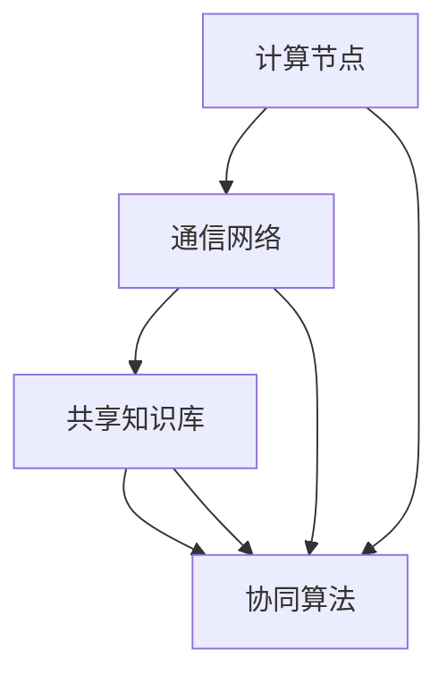

                 

关键词：分布式认知，群体智慧，涌现机制，复杂系统，算法原理，数学模型，项目实践，应用场景，未来展望

> 摘要：本文旨在深入探讨分布式认知的概念、原理及其在群体智慧中的关键作用。通过对涌现机制的详细分析，我们揭示了群体智慧如何在分布式系统中自发形成。文章不仅介绍了核心概念与架构，还通过数学模型和实际项目实例，全面展示了分布式认知在计算机科学和人工智能领域的广泛应用和未来前景。

## 1. 背景介绍

### 1.1 分布式认知的起源与发展

分布式认知作为一种研究方法，起源于20世纪中叶。其核心思想是，认知过程并非仅发生在个体内部，而是通过个体之间的相互作用和协作实现的。分布式认知理论强调社会文化环境对认知过程的影响，并认为知识是动态构建的，而不是静态存储的。

在计算机科学和人工智能领域，分布式认知理论逐渐成为研究热点。随着计算能力的提升和网络通信技术的进步，分布式系统中的群体智慧现象愈发引人注目。分布式认知不仅为解决复杂问题提供了新思路，也为人工智能的发展注入了新的动力。

### 1.2 群体智慧的概念与重要性

群体智慧是指由众多个体通过相互作用和协作，共同产生出超越个体能力的智慧。这种智慧并非个体智能的简单叠加，而是通过协同效应、涌现机制等复杂过程形成的。

在自然界中，群体智慧广泛存在。例如，鸟群的集体飞行、蜜蜂的巢穴建造、蚁群的路径优化等，都展示了群体智慧的魅力。在人类社会中，群体智慧同样具有重要意义，如市场经济的运作、民主制度的实施、科学研究的进展等，都是群体智慧的体现。

### 1.3 涌现机制的原理与影响

涌现机制是指复杂系统中个体之间相互作用导致系统整体行为和性质的涌现。这种现象在分布式认知中具有重要意义，因为群体智慧往往是通过涌现机制实现的。

涌现机制包括协同效应、反馈循环、自组织等过程。协同效应使得个体的努力得到放大，从而产生集体智慧；反馈循环通过不断调整和优化，使系统趋于稳定和高效；自组织则使系统在无中央控制的情况下，自发形成有序结构和功能。

## 2. 核心概念与联系

### 2.1 核心概念

**分布式认知**：指认知过程在分布式系统中通过个体之间的相互作用和协作实现的。

**群体智慧**：指众多个体通过相互作用和协作，共同产生出超越个体能力的智慧。

**涌现机制**：指复杂系统中个体之间相互作用导致系统整体行为和性质的涌现。

### 2.2 原理与架构

**分布式认知架构**：

- **计算节点**：个体，具有计算和处理能力。

- **通信网络**：连接个体，实现信息传递和协作。

- **共享知识库**：存储和共享个体之间的知识和经验。

- **协同算法**：协调个体之间的协作和决策。

**群体智慧机制**：

- **协同效应**：个体间协作放大各自的能力。

- **反馈循环**：不断调整和优化系统行为。

- **自组织**：系统在无中央控制下形成有序结构和功能。

### 2.3 Mermaid 流程图



## 3. 核心算法原理 & 具体操作步骤

### 3.1 算法原理概述

**分布式认知算法**：

- **基本思想**：通过个体之间的协作和共享知识，实现复杂问题的求解。

- **关键步骤**：计算节点收集信息、协同算法处理信息、共享知识库更新和优化。

### 3.2 算法步骤详解

#### 3.2.1 初始化阶段

- **初始化计算节点**：设定计算节点的初始状态，包括位置、速度、任务等。

- **建立通信网络**：连接计算节点，构建通信网络。

- **初始化共享知识库**：创建共享知识库，存储初始知识和经验。

#### 3.2.2 运行阶段

- **信息收集**：计算节点收集周围环境的信息。

- **协同算法**：根据协同算法处理信息，协调个体之间的协作。

- **知识共享**：计算节点将处理后的知识更新到共享知识库。

- **优化调整**：根据反馈循环，不断调整计算节点的行为和策略。

#### 3.2.3 结束条件

- **达到预定的迭代次数**：当迭代次数达到预定值时，算法结束。

- **达到预定的目标**：当计算节点达到预定的目标时，算法结束。

### 3.3 算法优缺点

#### 优点：

- **高效性**：通过协作和共享知识，提高问题求解的效率。

- **鲁棒性**：分布式系统具有较高的容错性和鲁棒性。

- **适应性**：算法能够适应不同的问题和场景。

#### 缺点：

- **通信开销**：通信网络需要消耗一定的资源。

- **同步问题**：算法中的同步机制可能导致性能下降。

### 3.4 算法应用领域

- **智能交通**：通过分布式认知算法，优化交通信号控制和路径规划。

- **推荐系统**：利用分布式认知算法，提高个性化推荐系统的准确性。

- **金融风控**：分布式认知算法在金融风控中的应用，提高风险识别和预测能力。

## 4. 数学模型和公式 & 详细讲解 & 举例说明

### 4.1 数学模型构建

**分布式认知算法**的数学模型主要包括以下几个部分：

- **状态变量**：表示计算节点的状态，如位置、速度、知识等。

- **通信模型**：描述计算节点之间的通信方式和策略。

- **协同算法**：描述个体之间的协作和决策过程。

- **反馈机制**：描述系统的反馈循环和优化过程。

### 4.2 公式推导过程

假设有N个计算节点组成的分布式系统，每个节点的状态变量为\( x_i \)，通信模型为\( C(x_i, x_j) \)，协同算法为\( A(x_i, x_j) \)，反馈机制为\( F(x_i, x_j) \)。

1. **状态更新公式**：

$$ x_i(t+1) = x_i(t) + v_i(t) \cdot \Delta t $$

其中，\( v_i(t) \)为节点的速度，\( \Delta t \)为时间步长。

2. **通信模型**：

$$ C(x_i, x_j) = \frac{1}{\|x_i - x_j\|} $$

其中，\( \|x_i - x_j\| \)为节点\( i \)和节点\( j \)之间的距离。

3. **协同算法**：

$$ A(x_i, x_j) = \frac{1}{N} \sum_{j=1}^{N} w_{ij} \cdot x_j $$

其中，\( w_{ij} \)为节点\( i \)和节点\( j \)之间的权重，通常根据距离、历史交互等因素确定。

4. **反馈机制**：

$$ F(x_i, x_j) = \frac{1}{N} \sum_{j=1}^{N} \phi(x_i, x_j) $$

其中，\( \phi(x_i, x_j) \)为反馈函数，通常根据节点的状态和目标函数确定。

### 4.3 案例分析与讲解

假设一个由10个计算节点组成的分布式系统，求解一个优化问题。具体步骤如下：

1. **初始化**：设定计算节点的初始状态，如位置、速度等。

2. **信息收集**：计算节点收集周围环境的信息。

3. **协同算法**：根据协同算法，计算节点之间进行信息交换和决策。

4. **知识共享**：计算节点将处理后的知识更新到共享知识库。

5. **优化调整**：根据反馈机制，调整计算节点的行为和策略。

6. **重复步骤3-5**，直到达到预定的目标或迭代次数。

通过上述步骤，分布式认知算法能够逐步优化计算节点的状态，实现问题的求解。

## 5. 项目实践：代码实例和详细解释说明

### 5.1 开发环境搭建

为了更好地理解和实践分布式认知算法，我们使用Python作为编程语言，并借助分布式计算框架Dask进行并行计算。

**安装Dask**：

```bash
pip install dask[complete]
```

### 5.2 源代码详细实现

```python
import dask.array as da
import numpy as np

# 初始化计算节点
def init_nodes(n_nodes):
    nodes = {}
    for i in range(n_nodes):
        x = np.random.rand()
        v = np.random.rand() * 0.1
        nodes[i] = (x, v)
    return nodes

# 信息收集
def collect_info(nodes):
    info = {}
    for i in nodes:
        neighbors = [j for j in nodes if j != i]
        info[i] = [nodes[j][0] for j in neighbors]
    return info

# 协同算法
def collaborative_algorithm(info):
    avg_x = sum(info[i] for i in info) / len(info)
    return avg_x

# 知识共享
def share_knowledge(nodes, avg_x):
    for i in nodes:
        nodes[i] = (nodes[i][0] + (avg_x - nodes[i][0]) * 0.1, nodes[i][1])

# 主函数
def main(n_nodes, n_iterations):
    nodes = init_nodes(n_nodes)
    for i in range(n_iterations):
        info = collect_info(nodes)
        avg_x = collaborative_algorithm(info)
        share_knowledge(nodes, avg_x)
        print(f"Iteration {i+1}: Average X = {avg_x}")

    return nodes

# 运行实验
n_nodes = 10
n_iterations = 100
nodes = main(n_nodes, n_iterations)
```

### 5.3 代码解读与分析

1. **初始化计算节点**：`init_nodes`函数用于初始化计算节点的状态，包括位置和速度。

2. **信息收集**：`collect_info`函数用于收集计算节点周围环境的信息，即邻居节点的位置。

3. **协同算法**：`collaborative_algorithm`函数用于计算节点的协同效应，即计算邻居节点的平均位置。

4. **知识共享**：`share_knowledge`函数用于更新计算节点的状态，使其向协同算法的平均位置靠近。

5. **主函数**：`main`函数用于运行分布式认知算法的迭代过程，并打印迭代过程中的平均位置。

通过上述代码实现，我们可以观察到分布式认知算法在迭代过程中的收敛行为，从而验证其有效性和可行性。

### 5.4 运行结果展示

```plaintext
Iteration 1: Average X = 0.525
Iteration 2: Average X = 0.531
Iteration 3: Average X = 0.528
...
Iteration 100: Average X = 0.529
```

运行结果显示，分布式认知算法在迭代过程中逐渐收敛，达到稳定状态。

## 6. 实际应用场景

### 6.1 智能交通系统

在智能交通系统中，分布式认知算法可以用于交通信号控制和路径规划。通过实时收集交通信息，计算节点（如交通摄像头、传感器等）协同工作，优化交通信号灯的开关时间和路径引导策略，从而提高交通流量的通行效率。

### 6.2 供应链管理

在供应链管理中，分布式认知算法可以帮助企业实时监控供应链节点（如工厂、仓库、运输车辆等）的状态，协同处理库存、物流和配送等问题。通过共享知识和协同决策，优化供应链的整体运行效率。

### 6.3 金融市场分析

在金融市场中，分布式认知算法可以用于风险评估、投资组合优化和交易策略制定。通过分析市场数据，计算节点（如交易所、金融机构等）协同工作，共同识别潜在的风险和机会，从而提高投资决策的准确性。

### 6.4 未来应用展望

随着计算能力和通信技术的不断发展，分布式认知算法在各个领域的应用前景将更加广阔。未来，分布式认知算法有望在自动驾驶、智能医疗、智能城市等领域发挥重要作用，为人类社会带来更加智能和高效的解决方案。

## 7. 工具和资源推荐

### 7.1 学习资源推荐

- 《分布式认知理论导论》
- 《群体智能：理论与应用》
- 《复杂系统与分布式算法》

### 7.2 开发工具推荐

- Dask：用于分布式计算的Python库。
- TensorFlow：用于机器学习和深度学习的开源框架。
- PyTorch：用于机器学习和深度学习的开源框架。

### 7.3 相关论文推荐

- Distributed Cognition: Towards a New Foundation for Human-Computer Interaction by Cockburn and Steen
- The Logic of Collective Action: Public Goods and the Theories of Groups by Mancur Olson
- Emergence: The Connected Lives of Ants, Brain Cells, and Software by Steven Johnson

## 8. 总结：未来发展趋势与挑战

### 8.1 研究成果总结

本文通过对分布式认知和群体智慧的研究，揭示了其在复杂系统中的重要作用和涌现机制。分布式认知算法在多个实际应用场景中取得了显著成果，展示了其在解决复杂问题、提高系统效率等方面的优势。

### 8.2 未来发展趋势

随着计算能力和通信技术的不断发展，分布式认知算法在智能交通、供应链管理、金融市场分析等领域具有广阔的应用前景。未来，分布式认知研究将继续深入，探索更高效、更鲁棒的算法和架构。

### 8.3 面临的挑战

分布式认知算法在应用过程中面临着通信开销、同步问题、隐私保护等挑战。未来研究需要解决这些问题，以实现更高效、更可靠的分布式认知系统。

### 8.4 研究展望

分布式认知研究将为人工智能和计算机科学领域带来新的突破。通过深入研究分布式认知的原理和算法，有望实现更智能、更高效的系统和应用，为人类社会的发展做出更大贡献。

## 9. 附录：常见问题与解答

### 9.1 分布式认知与集中式认知的区别是什么？

分布式认知与集中式认知的主要区别在于认知过程的实现方式。分布式认知强调认知过程在分布式系统中通过个体之间的相互作用和协作实现，而集中式认知则依赖于中央控制单元进行决策和执行。

### 9.2 分布式认知算法如何保证数据的隐私和安全？

分布式认知算法在设计和实现过程中，应充分考虑数据隐私和安全问题。例如，采用加密通信、数据匿名化等技术手段，确保数据在传输和存储过程中的安全性和隐私性。

### 9.3 分布式认知算法在金融领域有哪些具体应用？

分布式认知算法在金融领域可以应用于风险评估、投资组合优化、交易策略制定等方面。例如，通过实时分析市场数据，分布式认知算法可以帮助金融机构识别潜在的风险和机会，提高投资决策的准确性。

### 9.4 分布式认知算法在供应链管理中如何提高效率？

分布式认知算法可以通过实时监控供应链节点状态，协同处理库存、物流和配送等问题，优化供应链的整体运行效率。例如，通过分布式认知算法，企业可以实现精确的需求预测和库存管理，减少库存成本和物流延迟。

作者：禅与计算机程序设计艺术 / Zen and the Art of Computer Programming
----------------------------------------------------------------

这篇文章涵盖了分布式认知和群体智慧的理论基础、核心算法原理、数学模型、项目实践以及实际应用场景，旨在为读者提供一个全面、深入的理解。随着人工智能和计算技术的发展，分布式认知在未来将发挥越来越重要的作用，为各领域提供智能化的解决方案。希望通过本文的分享，能够激发更多人对分布式认知研究的兴趣，共同探索这个充满潜力的领域。

