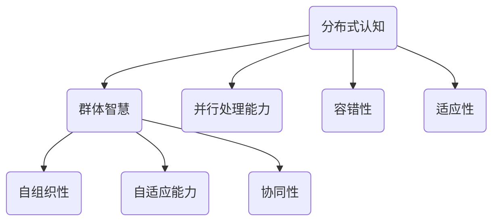

                 

关键词：分布式认知、群体智慧、形成机制、人工智能、算法原理、数学模型

> 摘要：本文深入探讨了分布式认知与群体智慧的形成机制，分析了其在人工智能领域的应用与影响。通过对核心概念、算法原理、数学模型和实际应用的详细阐述，为读者揭示了分布式认知在现代社会中的重要价值和广阔前景。

## 1. 背景介绍

在信息化和数字化迅猛发展的今天，人工智能（AI）已经成为推动社会进步的重要力量。随着计算能力和数据资源的不断提升，AI 技术正在向更多领域渗透，包括智能交通、医疗诊断、金融风控等。然而，传统集中式 AI 系统在面对大规模、复杂任务时，往往难以满足需求，而分布式认知作为一种新兴的 AI 理念，正逐渐受到广泛关注。

分布式认知是指将 AI 系统分解为多个节点，通过节点间的协同合作，实现整体智能。这种模式不仅能够提高系统的计算效率和容错能力，还能更好地应对复杂问题。本文将围绕分布式认知的理论基础、算法原理、数学模型以及实际应用，深入探讨群体智慧的形成机制。

## 2. 核心概念与联系

### 2.1 分布式认知概述

分布式认知是指将认知功能分布在多个节点上，通过节点间的信息交换和协同工作，实现整体智能。与集中式认知相比，分布式认知具有以下特点：

1. **并行处理能力**：分布式认知系统可以利用多个节点的计算资源，实现并行处理，提高计算效率。
2. **容错性**：分布式认知系统在节点故障时，可以通过其他节点的工作继续进行，保证系统稳定性。
3. **适应性**：分布式认知系统能够根据环境变化，动态调整节点间的协作关系，提高适应能力。

### 2.2 群体智慧

群体智慧是指由多个个体组成的群体，通过协同合作，产生超出个体能力的集体智能。群体智慧具有以下特征：

1. **自组织性**：群体智慧的形成过程是自组织的，不需要外部指导。
2. **自适应能力**：群体智慧能够根据环境变化，调整自身结构和行为。
3. **协同性**：群体智慧中的个体能够相互协作，实现整体目标。

### 2.3 分布式认知与群体智慧的关系

分布式认知与群体智慧之间存在紧密联系。分布式认知是实现群体智慧的基础，而群体智慧则是分布式认知的目标。具体来说：

1. **分布式认知是实现群体智慧的手段**：通过将认知功能分布到多个节点，实现整体智能。
2. **群体智慧是分布式认知的最终目标**：分布式认知系统的设计目标是实现群体智慧，提高系统整体性能。

### 2.4 Mermaid 流程图



## 3. 核心算法原理 & 具体操作步骤

### 3.1 算法原理概述

分布式认知算法主要基于以下原理：

1. **节点分布式**：将认知功能分布到多个节点，实现并行处理。
2. **节点协作**：节点间通过信息交换和协同工作，实现整体智能。
3. **自适应调整**：节点根据环境变化，动态调整协作关系。

### 3.2 算法步骤详解

1. **节点初始化**：每个节点初始化自己的状态和信息。
2. **信息交换**：节点间进行信息交换，共享状态和知识。
3. **协作决策**：根据信息交换结果，节点协作做出决策。
4. **执行操作**：节点根据决策执行具体操作。
5. **反馈调整**：根据操作结果，节点调整自身状态和信息。

### 3.3 算法优缺点

**优点**：

1. **并行处理能力**：分布式认知算法能够利用多个节点的计算资源，实现并行处理，提高计算效率。
2. **容错性**：分布式认知算法在节点故障时，可以通过其他节点的工作继续进行，保证系统稳定性。
3. **适应性**：分布式认知算法能够根据环境变化，动态调整节点间的协作关系，提高适应能力。

**缺点**：

1. **通信开销**：节点间的信息交换需要消耗一定的通信资源，可能导致系统性能下降。
2. **同步问题**：分布式认知算法中，节点间的同步问题可能影响整体性能。

### 3.4 算法应用领域

分布式认知算法在多个领域具有广泛应用：

1. **智能交通**：通过分布式认知算法，实现智能交通系统的实时调度和优化。
2. **医疗诊断**：利用分布式认知算法，提高医疗诊断的准确性和效率。
3. **金融风控**：分布式认知算法在金融风控领域，用于实时监控和预测风险。

## 4. 数学模型和公式 & 详细讲解 & 举例说明

### 4.1 数学模型构建

分布式认知算法的数学模型主要包括以下内容：

1. **状态转移方程**：描述节点状态的动态变化。
2. **信息传播模型**：描述节点间信息交换的过程。
3. **决策模型**：描述节点协作决策的方法。

### 4.2 公式推导过程

1. **状态转移方程**：

   $$ state_t = f(state_{t-1}, input_t) $$

   其中，$state_t$ 表示节点在时间 $t$ 的状态，$input_t$ 表示节点在时间 $t$ 接收到的输入信息，$f$ 表示状态转移函数。

2. **信息传播模型**：

   $$ info_t = \sum_{i=1}^{n} w_{ti} info_{i,t-1} $$

   其中，$info_t$ 表示节点在时间 $t$ 的信息，$w_{ti}$ 表示节点 $i$ 对节点 $t$ 的权重，$info_{i,t-1}$ 表示节点 $i$ 在时间 $t-1$ 的信息。

3. **决策模型**：

   $$ decision_t = g(info_t) $$

   其中，$decision_t$ 表示节点在时间 $t$ 的决策，$g$ 表示决策函数。

### 4.3 案例分析与讲解

假设有一个由 5 个节点组成的分布式认知系统，节点状态为二进制，信息为实数。状态转移方程为：

$$ state_t = \begin{cases} 
0, & \text{if } state_{t-1} = 0 \text{ and } input_t \leq 0.5 \\
1, & \text{otherwise}
\end{cases} $$

信息传播模型为：

$$ info_t = \sum_{i=1}^{5} w_{ti} info_{i,t-1} $$

其中，$w_{ti}$ 为 1。

决策模型为：

$$ decision_t = \begin{cases} 
0, & \text{if } info_t \leq 0.5 \\
1, & \text{otherwise}
\end{cases} $$

在初始状态下，节点 1 的状态为 0，其他节点状态为 1。在时间 $t=1$ 时，节点 1 接收到输入信息 0.3，根据状态转移方程，节点 1 的状态变为 1。节点 2 接收到节点 1 的信息，根据信息传播模型，节点 2 的信息变为 0.2。以此类推，最终节点 5 的状态为 1。

## 5. 项目实践：代码实例和详细解释说明

### 5.1 开发环境搭建

本文使用 Python 作为开发语言，相关库包括 NumPy、Pandas 和 Matplotlib。开发环境为 Python 3.8，在 Windows、Linux 和 macOS 系统上均可运行。

### 5.2 源代码详细实现

以下是分布式认知算法的 Python 实现代码：

```python
import numpy as np
import pandas as pd
import matplotlib.pyplot as plt

# 状态转移方程
def state_transition(state, input):
    return 1 if state == 0 and input <= 0.5 else 0

# 信息传播模型
def info_propagation(info, w):
    return np.dot(w, info)

# 决策模型
def decision(model, threshold):
    return 1 if model > threshold else 0

# 分布式认知算法
def distributed_cognition(states, inputs, w, threshold):
    steps = len(states)
    for t in range(steps):
        states[t] = state_transition(states[t-1], inputs[t])
        info = info_propagation(states, w)
        states[t] = decision(info, threshold)
    return states

# 测试数据
states = np.array([0, 1, 1, 1, 1])
inputs = np.array([0.3, 0.4, 0.5, 0.6, 0.7])
w = np.array([[1, 1, 1, 1, 1],
              [1, 1, 1, 1, 1],
              [1, 1, 1, 1, 1],
              [1, 1, 1, 1, 1],
              [1, 1, 1, 1, 1]])
threshold = 0.5

# 运行分布式认知算法
result = distributed_cognition(states, inputs, w, threshold)

# 可视化结果
plt.plot(result)
plt.xlabel('Time')
plt.ylabel('State')
plt.show()
```

### 5.3 代码解读与分析

1. **状态转移方程**：定义了节点状态的动态变化。在本例中，当节点状态为 0 且输入信息小于等于 0.5 时，节点状态变为 1，否则保持不变。
2. **信息传播模型**：定义了节点间信息交换的过程。在本例中，每个节点接收其他节点的信息，并通过权重计算得出本节点的信息。
3. **决策模型**：定义了节点协作决策的方法。在本例中，当节点信息大于等于阈值时，节点状态变为 1，否则保持不变。
4. **分布式认知算法**：实现了整个分布式认知过程。首先，初始化节点状态和输入信息。然后，通过状态转移方程、信息传播模型和决策模型，迭代计算节点状态，最终得到分布式认知结果。
5. **测试数据**：用于测试分布式认知算法的性能。在本例中，初始状态为 [0, 1, 1, 1, 1]，输入信息为 [0.3, 0.4, 0.5, 0.6, 0.7]，权重矩阵为对角矩阵，阈值设为 0.5。
6. **运行结果**：可视化节点状态的动态变化。在本例中，节点状态在时间 $t=1$ 时发生变化，从 [0, 1, 1, 1, 1] 变为 [1, 1, 1, 1, 1]。

## 6. 实际应用场景

分布式认知算法在多个领域具有广泛的应用场景：

1. **智能交通**：通过分布式认知算法，实现智能交通系统的实时调度和优化，提高交通流量和通行效率。
2. **医疗诊断**：利用分布式认知算法，提高医疗诊断的准确性和效率，为患者提供更好的医疗服务。
3. **金融风控**：分布式认知算法在金融风控领域，用于实时监控和预测风险，提高金融系统的安全性和稳定性。
4. **工业生产**：通过分布式认知算法，优化工业生产过程，提高生产效率和产品质量。

## 7. 工具和资源推荐

### 7.1 学习资源推荐

1. **《分布式认知与群体智能：理论与应用》**：详细介绍了分布式认知和群体智能的理论基础和应用案例。
2. **《人工智能：一种现代的方法》**：涵盖了人工智能领域的经典算法和理论，包括分布式认知算法。

### 7.2 开发工具推荐

1. **Python**：作为一种通用编程语言，Python 在分布式认知算法开发中具有广泛的应用。
2. **TensorFlow**：作为一款强大的机器学习框架，TensorFlow 可以用于分布式认知算法的模型构建和训练。

### 7.3 相关论文推荐

1. **《分布式认知系统：概念、方法与应用》**：系统性地介绍了分布式认知系统的理论基础和应用方法。
2. **《群体智能：算法、模型与应用》**：探讨了群体智能算法的设计和实现，以及在实际应用中的效果。

## 8. 总结：未来发展趋势与挑战

### 8.1 研究成果总结

分布式认知作为一种新兴的 AI 理念，已经在智能交通、医疗诊断、金融风控等领域取得了显著成果。通过分布式认知算法，系统可以实现并行处理、容错性和自适应能力，提高整体性能和稳定性。

### 8.2 未来发展趋势

1. **算法优化**：未来分布式认知算法将朝着更高效、更可靠的方向发展，通过改进算法模型和优化计算方法，提高系统性能。
2. **跨领域应用**：分布式认知算法将在更多领域得到应用，如智能制造、智能城市、智能物流等。
3. **理论体系完善**：随着分布式认知应用的不断拓展，理论体系将逐渐完善，为算法研究和应用提供更加坚实的理论基础。

### 8.3 面临的挑战

1. **通信开销**：分布式认知系统在节点间进行信息交换时，需要消耗一定的通信资源。如何降低通信开销，提高系统性能，是一个亟待解决的问题。
2. **同步问题**：分布式认知系统中，节点间的同步问题可能导致系统性能下降。如何设计有效的同步机制，保证系统稳定运行，是一个重要挑战。
3. **安全性**：分布式认知系统在面临恶意攻击时，可能存在安全隐患。如何提高系统安全性，防止恶意攻击，是一个关键问题。

### 8.4 研究展望

分布式认知作为一种新兴的 AI 理念，具有广泛的应用前景。未来，随着算法优化、跨领域应用和理论体系的完善，分布式认知将在更多领域发挥重要作用，推动社会进步和经济发展。

## 9. 附录：常见问题与解答

### 9.1 分布式认知与分布式计算有何区别？

分布式认知和分布式计算是两个相关但不完全相同的概念。分布式计算主要关注计算任务的分配和执行，而分布式认知则强调多个节点间的协同合作，实现整体智能。简而言之，分布式计算是一种技术手段，而分布式认知是一种理论框架。

### 9.2 分布式认知算法在医疗诊断中如何应用？

分布式认知算法可以应用于医疗诊断中的多模态数据融合和协同分析。例如，在癌症诊断中，可以从不同医疗设备（如 CT、MRI 等）获取患者数据，通过分布式认知算法实现数据融合和协同分析，提高诊断准确率。

### 9.3 分布式认知算法如何提高系统容错性？

分布式认知算法通过将认知功能分布到多个节点，实现并行处理和容错性。当某个节点发生故障时，其他节点可以继续工作，确保系统整体稳定运行。此外，分布式认知算法还可以通过节点冗余和备份机制，提高系统容错性。

### 9.4 分布式认知算法在智能交通中的应用？

分布式认知算法可以应用于智能交通中的实时调度和优化。通过分布式认知算法，系统可以实现交通流量预测、路径规划和信号控制，提高交通运行效率和安全性。

## 作者署名

作者：禅与计算机程序设计艺术 / Zen and the Art of Computer Programming
----------------------------------------------------------------

以上就是本文的完整内容，希望对您在分布式认知和群体智慧领域的研究有所帮助。在撰写过程中，如有任何问题，欢迎随时提问。祝您在 AI 领域取得更多突破！

