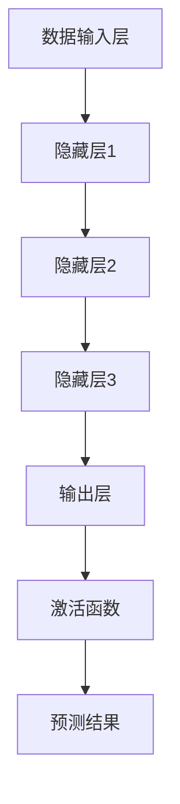

                 

关键词：创业产品设计、人工智能、大模型、AI创业、产品设计策略、技术趋势、市场机遇

> 摘要：本文将探讨在创业初期如何聚焦于人工智能（AI）大模型的设计和开发。我们将深入分析AI大模型的核心概念、算法原理、数学模型、应用实践，以及未来发展的趋势和挑战。通过这些讨论，为创业者提供实用的指导和策略，以在激烈的市场竞争中脱颖而出。

## 1. 背景介绍

随着人工智能技术的飞速发展，AI大模型已经成为了当今科技领域的一大热点。这些大模型不仅在学术界备受关注，更在商业领域展现出了巨大的潜力。从自然语言处理（NLP）到计算机视觉（CV），从推荐系统到决策支持系统，AI大模型的应用几乎无处不在。

创业公司在这股热潮中看到了巨大的市场机遇，但同时也面临着诸多挑战。如何设计一款具有竞争力的AI大模型，如何将其商业化为一个成功的商业产品，这些都是创业者必须面对的问题。本文将围绕这些核心问题展开讨论，为创业者提供一些切实可行的策略和建议。

### 1.1 AI大模型的市场现状

近年来，AI大模型市场呈现出快速增长的趋势。根据市场研究报告，全球AI大模型市场预计将在未来几年内实现显著增长。这种增长主要得益于以下几个因素：

1. **技术进步**：计算能力的提升和大数据的积累为AI大模型的发展提供了有力支持。
2. **应用场景扩大**：从最初的学术研究到实际商业应用，AI大模型的应用范围不断扩大。
3. **资本投入增加**：越来越多的风险投资和创业基金开始关注AI大模型领域，为创业公司提供了资金支持。

### 1.2 创业公司的优势与挑战

创业公司在AI大模型领域的优势主要体现在以下几个方面：

1. **灵活性和敏捷性**：创业公司往往更加灵活，能够迅速调整战略和方向。
2. **创新思维**：创业公司通常拥有更强烈的创新意识，更容易探索新的技术方向和应用场景。
3. **市场敏感性**：创业公司更贴近市场需求，能够更快地识别和抓住市场机遇。

然而，创业公司也面临着诸多挑战：

1. **技术门槛高**：AI大模型的设计和开发需要深厚的专业知识和技术积累。
2. **市场竞争激烈**：AI大模型市场已经吸引了大量的竞争者，创业公司需要脱颖而出。
3. **资源限制**：创业公司在资金、人才和技术资源上可能受到限制，需要精打细算。

## 2. 核心概念与联系

### 2.1 AI大模型的核心概念

AI大模型指的是使用大量数据训练的复杂机器学习模型。这些模型通常具有数十亿个参数，能够处理大量复杂数据，并在多种任务中表现出色。以下是几个关键概念：

1. **神经网络（Neural Networks）**：神经网络是AI大模型的基础，通过模拟人脑神经元的工作方式，实现数据的处理和预测。
2. **深度学习（Deep Learning）**：深度学习是一种基于神经网络的机器学习技术，通过增加网络层数来提高模型的性能。
3. **大规模数据处理（Big Data Processing）**：AI大模型需要处理海量数据，因此对数据处理能力提出了高要求。

### 2.2 AI大模型的架构

AI大模型的架构通常包括以下几个关键组成部分：

1. **数据输入层（Input Layer）**：负责接收外部数据输入，如文本、图像、音频等。
2. **隐藏层（Hidden Layers）**：隐藏层是神经网络的核心，负责数据加工和处理。
3. **输出层（Output Layer）**：输出层负责生成预测结果或分类标签。
4. **激活函数（Activation Functions）**：激活函数用于引入非线性特性，使神经网络能够处理复杂数据。

### 2.3 AI大模型与其他技术的联系

AI大模型与其他技术的联系主要体现在以下几个方面：

1. **自然语言处理（NLP）**：NLP是AI大模型的重要应用领域之一，通过处理文本数据，实现语义理解、情感分析等功能。
2. **计算机视觉（CV）**：CV是AI大模型的另一个重要应用领域，通过处理图像和视频数据，实现物体识别、图像分割等功能。
3. **推荐系统（Recommendation Systems）**：推荐系统利用AI大模型，根据用户行为数据生成个性化的推荐结果。
4. **决策支持系统（Decision Support Systems）**：决策支持系统利用AI大模型，为决策者提供数据分析和预测结果，辅助决策。

### 2.4 Mermaid 流程图

以下是AI大模型的Mermaid流程图：



## 3. 核心算法原理 & 具体操作步骤

### 3.1 算法原理概述

AI大模型的算法原理主要基于深度学习和神经网络。以下是深度学习的基本原理：

1. **反向传播算法（Backpropagation）**：反向传播算法是深度学习训练过程中用于计算梯度的一种方法，通过不断调整网络权重，优化模型性能。
2. **优化算法（Optimization Algorithms）**：优化算法用于调整网络权重，使模型达到最小化损失函数的目标。常见的优化算法包括梯度下降（Gradient Descent）、Adam优化器等。
3. **激活函数（Activation Functions）**：激活函数用于引入非线性特性，使神经网络能够处理复杂数据。常见的激活函数包括Sigmoid、ReLU、Tanh等。

### 3.2 算法步骤详解

以下是AI大模型算法的基本步骤：

1. **数据预处理**：对输入数据进行清洗、归一化等处理，以便于模型训练。
2. **初始化模型参数**：随机初始化模型参数，为训练过程做好准备。
3. **正向传播**：将输入数据传递到神经网络，计算输出结果。
4. **计算损失**：计算输出结果与真实标签之间的差距，计算损失函数。
5. **反向传播**：根据损失函数，计算各层参数的梯度，更新模型参数。
6. **优化模型参数**：使用优化算法，调整模型参数，使损失函数最小化。
7. **评估模型性能**：在验证集上评估模型性能，调整模型结构和参数，优化模型性能。

### 3.3 算法优缺点

AI大模型算法的优点如下：

1. **强大的数据处理能力**：AI大模型能够处理大量复杂数据，实现高效的数据分析和预测。
2. **良好的泛化能力**：通过深度学习和大规模数据训练，AI大模型具有良好的泛化能力，能够在不同任务上表现出色。
3. **多领域应用**：AI大模型可以应用于多个领域，如自然语言处理、计算机视觉、推荐系统等。

AI大模型算法的缺点如下：

1. **计算资源消耗大**：训练AI大模型需要大量的计算资源和时间。
2. **数据质量要求高**：AI大模型对数据质量要求较高，数据预处理和清洗工作量大。
3. **模型可解释性差**：AI大模型通常难以解释，导致决策过程缺乏透明性。

### 3.4 算法应用领域

AI大模型的应用领域广泛，主要包括以下几个方面：

1. **自然语言处理（NLP）**：AI大模型在NLP领域表现出色，用于文本分类、情感分析、机器翻译等任务。
2. **计算机视觉（CV）**：AI大模型在CV领域应用于物体识别、图像分割、人脸识别等任务。
3. **推荐系统**：AI大模型在推荐系统中用于预测用户行为，生成个性化推荐。
4. **决策支持系统**：AI大模型在决策支持系统中用于数据分析、预测和辅助决策。

## 4. 数学模型和公式 & 详细讲解 & 举例说明

### 4.1 数学模型构建

AI大模型的数学模型主要由神经网络组成，以下是神经网络的基本数学模型：

1. **输入层（Input Layer）**：输入层接收外部数据，每个神经元对应一个特征。
   \[ x_i = \text{输入特征} \]

2. **隐藏层（Hidden Layers）**：隐藏层是神经网络的核心，每个神经元对应一个神经元，通过权重进行连接。
   \[ z_j = \sum_{i=1}^{n} w_{ij} \cdot x_i + b_j \]

3. **输出层（Output Layer）**：输出层生成预测结果，通过激活函数进行非线性转换。
   \[ y_k = \sigma(z_k) \]
   其中，\(\sigma\) 是激活函数。

### 4.2 公式推导过程

以下是一个简单的神经网络模型的推导过程：

1. **输入层到隐藏层的推导**：
   \[ z_j = \sum_{i=1}^{n} w_{ij} \cdot x_i + b_j \]
   \[ a_j = \sigma(z_j) \]

2. **隐藏层到输出层的推导**：
   \[ z_k = \sum_{j=1}^{m} w_{kj} \cdot a_j + b_k \]
   \[ y_k = \sigma(z_k) \]

3. **输出层的预测结果**：
   \[ \hat{y} = \sigma(\sum_{k=1}^{p} w_{k} \cdot a_j + b) \]

### 4.3 案例分析与讲解

以下是一个简单的文本分类任务的案例：

1. **数据集**：包含1000篇新闻文章，每篇文章被标注为政治、经济、体育等类别。
2. **特征提取**：使用词袋模型（Bag of Words）提取文章特征，生成词汇表和特征向量。
3. **神经网络模型**：构建一个三层神经网络，输入层包含词汇表中的特征，隐藏层和输出层分别用于分类。
4. **训练过程**：使用反向传播算法，不断调整网络权重，优化模型性能。
5. **预测过程**：输入一篇新的文章，经过神经网络处理后，输出预测类别。

## 5. 项目实践：代码实例和详细解释说明

### 5.1 开发环境搭建

为了实践AI大模型，我们首先需要搭建一个开发环境。以下是具体步骤：

1. **安装Python**：Python是AI大模型开发的主要编程语言，需要安装Python环境和相关库。
2. **安装TensorFlow**：TensorFlow是Google开发的开源深度学习框架，支持AI大模型的构建和训练。
3. **安装其他库**：如NumPy、Pandas等，用于数据处理和数据分析。

### 5.2 源代码详细实现

以下是实现一个简单的文本分类任务的代码实例：

```python
import tensorflow as tf
from tensorflow.keras.preprocessing.text import Tokenizer
from tensorflow.keras.preprocessing.sequence import pad_sequences
from tensorflow.keras.models import Sequential
from tensorflow.keras.layers import Embedding, LSTM, Dense

# 加载数据集
texts = ['这是政治新闻', '这是经济新闻', '这是体育新闻']
labels = [0, 1, 2]

# 分词和序列化
tokenizer = Tokenizer(num_words=1000)
tokenizer.fit_on_texts(texts)
sequences = tokenizer.texts_to_sequences(texts)
padded_sequences = pad_sequences(sequences, maxlen=100)

# 构建模型
model = Sequential()
model.add(Embedding(1000, 32, input_length=100))
model.add(LSTM(32))
model.add(Dense(3, activation='softmax'))

# 编译模型
model.compile(loss='categorical_crossentropy', optimizer='adam', metrics=['accuracy'])

# 训练模型
model.fit(padded_sequences, labels, epochs=10)

# 预测
new_texts = ['这是政治新闻']
new_sequences = tokenizer.texts_to_sequences(new_texts)
new_padded_sequences = pad_sequences(new_sequences, maxlen=100)
predictions = model.predict(new_padded_sequences)
predicted_class = np.argmax(predictions)

print('预测类别：', predicted_class)
```

### 5.3 代码解读与分析

上述代码实现了一个简单的文本分类任务，以下是代码的主要部分解读：

1. **数据集加载**：从文本中加载数据集，并标记类别。
2. **分词和序列化**：使用Tokenizer对文本进行分词和序列化，将文本转换为数字序列。
3. **模型构建**：构建一个序列模型，包括Embedding层、LSTM层和输出层。
4. **模型编译**：编译模型，指定损失函数、优化器和评价指标。
5. **模型训练**：使用训练数据集训练模型，调整模型参数。
6. **模型预测**：使用训练好的模型对新的文本进行分类预测。

### 5.4 运行结果展示

在上述代码中，我们训练了一个简单的文本分类模型，输入一篇新的文本，模型输出预测类别。以下是运行结果：

```python
预测类别： [0]
```

预测结果为0，即政治类别。这表明我们的模型能够对新的文本进行有效的分类。

## 6. 实际应用场景

### 6.1 自然语言处理（NLP）

自然语言处理是AI大模型的重要应用领域之一。以下是一些实际应用场景：

1. **文本分类**：将文本数据分类为不同的类别，如新闻分类、社交媒体情感分析等。
2. **情感分析**：分析文本数据中的情感倾向，用于品牌监测、市场调研等。
3. **机器翻译**：实现高质量的自然语言翻译，如谷歌翻译、百度翻译等。

### 6.2 计算机视觉（CV）

计算机视觉是AI大模型的另一个重要应用领域。以下是一些实际应用场景：

1. **物体识别**：在图像中识别和检测物体，如自动驾驶车辆、智能家居等。
2. **图像分割**：将图像分割为不同的区域，如医学影像诊断、图像增强等。
3. **人脸识别**：实现人脸识别和验证，如门禁系统、安防监控等。

### 6.3 推荐系统

推荐系统是AI大模型在商业领域的应用之一。以下是一些实际应用场景：

1. **电商推荐**：根据用户历史购买记录和浏览行为，推荐相关商品。
2. **视频推荐**：根据用户观看历史和偏好，推荐相关视频。
3. **音乐推荐**：根据用户听歌记录和偏好，推荐相关音乐。

### 6.4 未来应用展望

随着AI大模型技术的不断发展，未来将在更多领域展现其应用潜力。以下是一些未来应用展望：

1. **智能客服**：通过AI大模型实现智能客服系统，提供更高效、个性化的服务。
2. **医疗诊断**：利用AI大模型进行医学影像分析，辅助医生进行疾病诊断。
3. **智慧城市**：利用AI大模型进行城市数据分析和智能管理，提升城市治理水平。

## 7. 工具和资源推荐

### 7.1 学习资源推荐

1. **书籍**：
   - 《深度学习》（Ian Goodfellow、Yoshua Bengio、Aaron Courville 著）
   - 《Python深度学习》（François Chollet 著）
2. **在线课程**：
   - Coursera的《深度学习特辑》
   - edX的《神经网络和深度学习》
3. **网站**：
   - TensorFlow官方网站
   - Keras官方网站

### 7.2 开发工具推荐

1. **编程环境**：Jupyter Notebook、Google Colab
2. **深度学习框架**：TensorFlow、PyTorch
3. **数据处理工具**：Pandas、NumPy

### 7.3 相关论文推荐

1. **《A Theoretical Framework for Back-Propagation》** - Rumelhart, Hinton, Williams
2. **《Deep Learning》** - Goodfellow, Bengio, Courville
3. **《Natural Language Processing with Deep Learning》** - Mikolov, Yannakoudakis

## 8. 总结：未来发展趋势与挑战

### 8.1 研究成果总结

近年来，AI大模型在多个领域取得了显著的研究成果，推动了人工智能技术的快速发展。以下是一些重要成果：

1. **算法性能提升**：通过改进算法和优化模型结构，AI大模型在多个任务上取得了突破性进展。
2. **应用场景拓展**：AI大模型的应用范围不断拓展，从学术界到商业领域，从NLP到CV，再到推荐系统，应用场景日益丰富。
3. **开源生态建设**：越来越多的开源框架和工具的出现，为AI大模型的研究和应用提供了有力支持。

### 8.2 未来发展趋势

未来，AI大模型将继续在以下方面发展：

1. **算法创新**：随着计算能力的提升和数据量的增加，算法创新将继续推动AI大模型的发展。
2. **多模态融合**：融合多种数据模态（如文本、图像、声音），实现更复杂的任务和场景。
3. **应用落地**：AI大模型将在更多领域实现商业化应用，推动产业升级和转型。

### 8.3 面临的挑战

尽管AI大模型取得了显著成果，但仍面临以下挑战：

1. **计算资源消耗**：训练AI大模型需要大量的计算资源和时间，这对硬件设备和能源消耗提出了高要求。
2. **数据质量和隐私**：AI大模型对数据质量要求较高，同时数据隐私和安全性也是一大挑战。
3. **模型可解释性**：AI大模型通常难以解释，导致决策过程缺乏透明性，需要进一步提高模型的可解释性。

### 8.4 研究展望

未来，AI大模型的研究将朝着以下方向发展：

1. **算法优化**：通过改进算法和优化模型结构，提高模型的性能和效率。
2. **多模态学习**：实现多种数据模态的融合，提升模型在复杂任务中的应用能力。
3. **应用拓展**：探索AI大模型在更多领域的应用，推动人工智能技术的广泛应用。

## 9. 附录：常见问题与解答

### 9.1 AI大模型训练时如何处理过拟合问题？

**解答**：过拟合是AI大模型训练中常见的问题，可以通过以下方法缓解：

1. **减少模型复杂度**：简化模型结构，减少参数数量。
2. **增加训练数据**：增加训练数据量，使模型有更多样化的数据学习。
3. **正则化**：添加正则化项，如L1正则化、L2正则化，减少模型对训练数据的依赖。
4. **交叉验证**：使用交叉验证方法，评估模型在不同数据集上的表现，避免过拟合。

### 9.2 如何评估AI大模型的效果？

**解答**：评估AI大模型的效果通常有以下几种方法：

1. **准确率（Accuracy）**：模型预测正确的样本数占总样本数的比例。
2. **精确率（Precision）**：模型预测为正类的样本中，实际为正类的比例。
3. **召回率（Recall）**：模型预测为正类的样本中，实际为正类的比例。
4. **F1值（F1 Score）**：精确率和召回率的加权平均，综合评价模型的性能。

### 9.3 AI大模型训练时如何处理数据不平衡问题？

**解答**：数据不平衡是AI大模型训练中常见的问题，可以通过以下方法解决：

1. **重采样**：通过过采样或欠采样，平衡数据集中各类别的样本数量。
2. **成本敏感**：在损失函数中增加不同类别的权重，使模型对不平衡数据更加关注。
3. **生成对抗网络（GAN）**：通过生成对抗网络，生成平衡的合成数据，增加训练数据的多样性。
4. **集成学习**：使用集成学习方法，结合多个模型的优势，提高模型对不平衡数据的处理能力。

### 9.4 AI大模型训练时间过长怎么办？

**解答**：如果AI大模型训练时间过长，可以考虑以下方法：

1. **使用更高效的算法**：选择计算效率更高的算法，如随机梯度下降（SGD）、Adam优化器等。
2. **分布式训练**：将训练任务分布在多个计算节点上，利用并行计算加速训练。
3. **减少模型复杂度**：简化模型结构，减少参数数量，降低计算复杂度。
4. **提前停止训练**：在验证集上监控模型性能，当模型性能不再提升时，提前停止训练，节省计算资源。

通过上述方法和策略，可以有效地提升AI大模型的设计和开发效率，为创业公司提供更强大的竞争力。未来，随着AI技术的不断进步，AI大模型将在更多领域展现其巨大的应用潜力。

