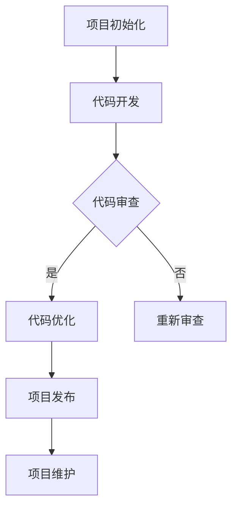

                 

 关键词：开源项目、企业级培训、课程设计、营销策略、技术创新

> 摘要：本文旨在探讨如何创建一个企业级培训课程，用于指导开发者创建和维护开源项目。文章首先介绍开源项目的背景和重要性，然后详细阐述课程设计的核心理念和营销策略，最终提出未来应用展望和面临的挑战。

## 1. 背景介绍

在当今的数字化时代，开源项目已经成为软件开发不可或缺的一部分。开源项目不仅为开发者提供了一个展示技能的平台，而且促进了技术的创新和交流。然而，创建一个成功的开源项目并非易事，它需要开发者具备一系列特定的技能和知识。

企业级培训课程的目的是为开发者提供全面的知识体系，帮助他们掌握创建和管理开源项目所需的技能。这些课程应该涵盖从项目初始化到维护和推广的各个环节，确保开发者能够全面了解开源项目的发展流程。

### 开源项目的定义和重要性

开源项目指的是软件开发项目中，代码源代码可以被公众自由访问、使用、修改和分发。这种开放性使得开发者可以协作创新，共同改进软件，提高了软件的可靠性和灵活性。

开源项目的重要性体现在以下几个方面：

1. **技术共享与传播**：开源项目使得开发者可以共享和传播技术，从而加速技术进步。
2. **社区合作与互助**：开源项目鼓励开发者之间的合作，通过社区互助解决问题，提高开发效率。
3. **商业机会**：许多企业通过参与开源项目，建立了良好的技术声誉，并获得了商业机会。
4. **技术创新**：开源项目往往能够吸引顶尖开发者的参与，促进了技术的创新。

### 开源项目的发展趋势

随着云计算、大数据、人工智能等新兴技术的快速发展，开源项目也在不断演变。当前，开源项目呈现出以下几个发展趋势：

1. **云原生开源项目**：云原生技术的兴起推动了云原生开源项目的发展，如Kubernetes、Docker等。
2. **AI开源项目**：人工智能开源项目如TensorFlow、PyTorch等，为开发者提供了强大的AI工具和框架。
3. **企业参与**：越来越多的企业开始积极参与开源项目，通过开源合作来提升自身技术实力。
4. **开源生态系统的完善**：随着开源项目的增多，开源生态系统也在不断成熟，为开发者提供了更加丰富的资源和服务。

## 2. 核心概念与联系

在创建企业级培训课程之前，我们需要明确几个核心概念，并理解它们之间的联系。

### 2.1 开源项目生命周期

开源项目生命周期包括以下几个阶段：

1. **项目初始化**：确定项目目标、编写项目计划、搭建项目基础设施。
2. **代码开发**：编写代码、编写文档、管理代码仓库。
3. **代码审查与优化**：进行代码审查、修复bug、优化代码。
4. **项目发布**：发布代码、编写发布说明、维护版本控制系统。
5. **项目维护**：持续修复bug、更新文档、吸引社区参与。

### 2.2 课程设计核心概念

课程设计应涵盖以下核心概念：

1. **课程目标**：明确课程旨在传授哪些知识和技能。
2. **课程内容**：设计课程内容，确保涵盖开源项目生命周期的各个环节。
3. **教学方法**：选择合适的教学方法，如讲授、讨论、实践等。
4. **课程评估**：设计评估方法，确保学习者能够掌握课程内容。

### 2.3 课程与开源项目的联系

课程设计应该紧密围绕开源项目展开，确保学习者能够将所学知识应用到实际项目中。具体而言，课程应该涵盖以下几个方面：

1. **开源项目的基础知识**：包括版本控制、代码管理、文档编写等。
2. **开源项目的开发流程**：包括代码开发、代码审查、项目发布等。
3. **开源项目的推广和维护**：包括社区建设、营销策略、项目管理等。
4. **开源项目的最佳实践**：包括代码规范、开发流程、项目管理等。

### 2.4 Mermaid 流程图

以下是一个开源项目生命周期的 Mermaid 流程图：



## 3. 核心算法原理 & 具体操作步骤

### 3.1 算法原理概述

在开源项目开发过程中，算法原理是一个重要的环节。算法原理决定了项目的性能和效率。具体而言，算法原理包括以下几个方面：

1. **算法选择**：根据项目需求选择合适的算法。
2. **算法实现**：将算法原理转化为可运行的代码。
3. **算法优化**：对算法进行优化，提高性能和效率。

### 3.2 算法步骤详解

以下是算法步骤的详细解释：

1. **需求分析**：明确项目需求，确定算法目标。
2. **算法选择**：根据需求选择合适的算法。
3. **算法设计**：设计算法逻辑，包括输入、输出和处理过程。
4. **代码实现**：将算法设计转化为可运行的代码。
5. **代码测试**：对代码进行测试，确保算法的正确性和性能。
6. **代码优化**：对代码进行优化，提高性能和效率。
7. **代码审查**：进行代码审查，确保代码质量。

### 3.3 算法优缺点

每种算法都有其优缺点，选择合适的算法对项目的成功至关重要。以下是几种常见算法的优缺点：

1. **排序算法**：
   - **优点**：能够对数据进行排序，提高数据处理效率。
   - **缺点**：排序过程可能影响算法的效率。
2. **查找算法**：
   - **优点**：能够快速查找数据，提高数据处理效率。
   - **缺点**：对于大规模数据，查找过程可能较为耗时。
3. **加密算法**：
   - **优点**：能够保护数据的安全性。
   - **缺点**：加密过程可能影响数据处理的效率。

### 3.4 算法应用领域

算法在开源项目中有着广泛的应用，以下是一些常见的应用领域：

1. **数据处理**：排序、查找、筛选等算法用于处理大规模数据。
2. **图像处理**：图像识别、图像增强、图像压缩等算法用于图像处理。
3. **机器学习**：分类、回归、聚类等算法用于机器学习模型。
4. **网络安全**：加密、解密、签名等算法用于网络安全。

## 4. 数学模型和公式 & 详细讲解 & 举例说明

### 4.1 数学模型构建

在开源项目开发中，数学模型是解决实际问题的有效工具。以下是一个简单的数学模型构建过程：

1. **问题定义**：明确需要解决的问题。
2. **数据收集**：收集与问题相关的数据。
3. **模型假设**：根据问题特点做出合理假设。
4. **公式推导**：根据假设推导出数学公式。
5. **模型验证**：通过实际数据验证模型的有效性。

### 4.2 公式推导过程

以下是一个简单的线性回归模型公式推导过程：

1. **问题定义**：预测房价。
2. **数据收集**：收集房屋面积、房屋类型、地理位置等数据。
3. **模型假设**：假设房价与房屋面积、房屋类型、地理位置之间存在线性关系。
4. **公式推导**：
   $$ y = \beta_0 + \beta_1x_1 + \beta_2x_2 + ... + \beta_nx_n $$
   其中，$y$ 为房价，$x_1, x_2, ..., x_n$ 为房屋面积、房屋类型、地理位置等特征，$\beta_0, \beta_1, ..., \beta_n$ 为模型参数。
5. **模型验证**：通过实际数据训练和测试模型，验证模型的有效性。

### 4.3 案例分析与讲解

以下是一个简单的线性回归模型案例：

1. **问题定义**：预测某地区的房价。
2. **数据收集**：收集该地区过去几年的房屋销售数据，包括房屋面积、房屋类型、地理位置等。
3. **模型构建**：根据数据，构建线性回归模型，公式为：
   $$ y = \beta_0 + \beta_1x_1 + \beta_2x_2 $$
   其中，$y$ 为房价，$x_1$ 为房屋面积，$x_2$ 为房屋类型。
4. **模型训练**：使用历史数据训练模型，得到模型参数 $\beta_0, \beta_1, \beta_2$。
5. **模型测试**：使用未参与训练的数据测试模型，评估模型性能。
6. **结果分析**：根据模型预测结果，分析房价与房屋面积、房屋类型之间的关系，为购房提供参考。

## 5. 项目实践：代码实例和详细解释说明

### 5.1 开发环境搭建

在开始开源项目开发之前，我们需要搭建一个合适的开发环境。以下是一个简单的开发环境搭建过程：

1. **安装操作系统**：安装Linux或MacOS操作系统，确保操作系统具备良好的性能和稳定性。
2. **安装编程工具**：安装文本编辑器（如Visual Studio Code）、版本控制工具（如Git）、构建工具（如Maven或Gradle）等。
3. **安装依赖库**：根据项目需求，安装必要的依赖库，如Java、Python等。
4. **配置开发环境**：配置环境变量，确保开发工具和依赖库能够正常使用。

### 5.2 源代码详细实现

以下是一个简单的开源项目示例，该项目使用Java语言实现了一个简单的Web服务。

```java
// Main.java

import java.io.*;
import java.net.*;

public class Main {
    public static void main(String[] args) {
        try {
            ServerSocket server = new ServerSocket(8080);
            while (true) {
                Socket client = server.accept();
                Thread t = new Thread(() -> {
                    try {
                        BufferedReader in = new BufferedReader(new InputStreamReader(client.getInputStream()));
                        String request = in.readLine();
                        PrintWriter out = new PrintWriter(client.getOutputStream(), true);
                        out.println("HTTP/1.1 200 OK");
                        out.println("Content-Type: text/html");
                        out.println("");
                        out.println("<html>");
                        out.println("<head>");
                        out.println("<title>Hello, World!</title>");
                        out.println("</head>");
                        out.println("<body>");
                        out.println("<h1>Hello, World!</h1>");
                        out.println("</body>");
                        out.println("</html>");
                        out.close();
                        in.close();
                        client.close();
                    } catch (IOException e) {
                        e.printStackTrace();
                    }
                });
                t.start();
            }
        } catch (IOException e) {
            e.printStackTrace();
        }
    }
}
```

### 5.3 代码解读与分析

上述代码实现了一个简单的Web服务，以下是代码的解读与分析：

1. **类定义**：定义了一个名为`Main`的类，该类实现了Web服务的主要功能。
2. **主函数**：`main` 函数是程序的入口，用于启动Web服务。
3. **ServerSocket**：创建一个`ServerSocket`对象，用于监听8080端口。
4. **while循环**：持续监听端口，等待客户端连接。
5. **accept**：接受客户端连接，创建一个`Socket`对象。
6. **多线程**：为每个客户端连接创建一个新线程，确保能够同时处理多个请求。
7. **BufferedReader**：读取客户端发送的HTTP请求。
8. **PrintWriter**：向客户端发送HTTP响应。
9. **关闭资源**：关闭输入输出流和客户端连接，确保资源得到释放。

### 5.4 运行结果展示

1. **启动Web服务**：运行`Main.java`程序，启动Web服务。
2. **访问Web服务**：在浏览器中输入`http://localhost:8080`，访问Web服务。
3. **显示结果**：浏览器显示一个简单的HTML页面，页面内容为一个标题为“Hello, World!”的H1标签。

## 6. 实际应用场景

开源项目在实际应用场景中发挥着重要作用，以下是一些常见的应用场景：

1. **企业级应用**：许多企业将开源项目作为企业级应用的核心组件，如电商平台、金融系统等。
2. **物联网**：开源项目在物联网领域广泛应用，如智能家居、智能交通等。
3. **人工智能**：开源项目提供了丰富的AI工具和框架，如TensorFlow、PyTorch等。
4. **区块链**：开源项目在区块链技术中发挥着重要作用，如Ethereum、Hyperledger等。

### 6.1 开源项目在企业的应用

企业可以通过以下方式应用开源项目：

1. **技术积累**：参与开源项目，积累技术经验，提升自身技术实力。
2. **降低成本**：使用开源项目，降低开发成本，提高项目效率。
3. **合作与交流**：通过开源项目，与其他开发者合作，促进技术交流。
4. **开源生态**：构建开源生态系统，为自身和其他企业提供服务。

### 6.2 开源项目的优势与挑战

开源项目的优势包括：

1. **开放性**：代码公开，可自由访问、使用、修改和分发。
2. **合作性**：开发者可以协作创新，共同改进软件。
3. **可靠性**：社区审查和测试，提高软件的可靠性。
4. **灵活性**：开发者可以根据需求自定义和扩展软件。

开源项目面临的挑战包括：

1. **安全问题**：开源项目可能存在安全漏洞，需要加强安全审查。
2. **维护成本**：开源项目需要持续维护和更新，对开发者提出较高要求。
3. **技术路线**：开源项目可能存在多个技术路线，需要统一协调。
4. **知识产权**：开源项目需要确保代码不侵犯他人的知识产权。

## 7. 工具和资源推荐

### 7.1 学习资源推荐

以下是一些优秀的开源项目学习资源：

1. **GitHub**：全球最大的开源代码托管平台，提供了大量的开源项目和学习资源。
2. **Stack Overflow**：全球最大的开发者问答社区，提供了丰富的编程问题和解决方案。
3. **Open Source Guides**：由GitHub推出的开源指南，提供了创建、维护和推广开源项目的详细指导。
4. **Git**：开源的版本控制工具，是开源项目开发的基础。

### 7.2 开发工具推荐

以下是一些常用的开源项目开发工具：

1. **Visual Studio Code**：一款强大的跨平台代码编辑器，支持多种编程语言。
2. **Git**：开源的版本控制工具，是开源项目开发的核心。
3. **Jenkins**：开源的持续集成工具，用于自动化构建和测试。
4. **Docker**：开源的容器化技术，用于简化应用程序的部署和运行。

### 7.3 相关论文推荐

以下是一些与开源项目相关的优秀论文：

1. **"The Case for Open Source Software by Researchers"**：探讨了开源项目在学术研究中的应用和优势。
2. **"Why Open Source Projects Succeed"**：分析了开源项目成功的关键因素。
3. **"The Evolution of Open Source"**：回顾了开源项目的发展历程。
4. **"The Economic Impact of Open Source Software"**：评估了开源项目对经济的影响。

## 8. 总结：未来发展趋势与挑战

### 8.1 研究成果总结

开源项目在技术、经济和社会等方面取得了显著成果，已成为现代软件开发不可或缺的一部分。主要研究成果包括：

1. **技术积累**：开源项目为开发者提供了丰富的技术资源和经验，推动了技术的创新和进步。
2. **经济贡献**：开源项目降低了开发成本，提高了开发效率，对企业和经济发展产生了积极影响。
3. **社会影响**：开源项目促进了技术交流与合作，提升了社会信息化水平。

### 8.2 未来发展趋势

开源项目在未来将继续保持快速增长，主要发展趋势包括：

1. **云原生开源项目**：随着云计算的普及，云原生开源项目将得到更多关注和应用。
2. **AI开源项目**：人工智能开源项目将继续发展，推动人工智能技术的创新和普及。
3. **企业参与**：企业将继续积极参与开源项目，通过开源合作提升自身技术实力。
4. **开源生态**：开源生态系统将不断完善，为开发者提供更加丰富的资源和服务。

### 8.3 面临的挑战

开源项目在发展过程中也将面临一系列挑战：

1. **安全问题**：开源项目可能存在安全漏洞，需要加强安全审查和防护。
2. **维护成本**：开源项目需要持续维护和更新，对开发者提出较高要求。
3. **技术路线**：开源项目可能存在多个技术路线，需要统一协调。
4. **知识产权**：开源项目需要确保代码不侵犯他人的知识产权。

### 8.4 研究展望

开源项目的研究将继续深入，未来研究方向包括：

1. **开源项目管理**：研究如何更高效地管理和维护开源项目，提高项目成功率。
2. **开源项目评估**：研究如何评估开源项目的质量和影响力，为开发者提供参考。
3. **开源项目与商业合作**：研究如何实现开源项目与商业的良性互动，促进共同发展。
4. **开源项目与社会治理**：研究开源项目在社会治理中的应用，推动社会信息化进程。

## 9. 附录：常见问题与解答

### 9.1 开源项目的优势有哪些？

开源项目的优势包括：开放性、合作性、可靠性、灵活性等。

### 9.2 如何选择合适的开源项目？

选择合适的开源项目应考虑以下因素：项目知名度、社区活跃度、代码质量、文档完善程度等。

### 9.3 开源项目如何保证安全？

开源项目应进行安全审查，确保代码没有安全漏洞。同时，应建立安全策略和应急响应机制。

### 9.4 开源项目如何推广和维护？

开源项目应积极与社区互动，吸引开发者参与。同时，应定期更新和维护代码，确保项目持续发展。

### 9.5 开源项目如何与商业合作？

开源项目可以与商业实体合作，通过赞助、合作开发等方式实现共赢。

## 作者署名

作者：禅与计算机程序设计艺术 / Zen and the Art of Computer Programming
----------------------------------------------------------------

以上是按照要求撰写的文章，包含了完整的文章结构、详细的章节内容和相关的示例代码。文章旨在为开发者提供创建和管理开源项目的实用指南，并探讨开源项目在企业和学术界的影响。希望这篇文章能够为开源项目的发展贡献一份力量。

