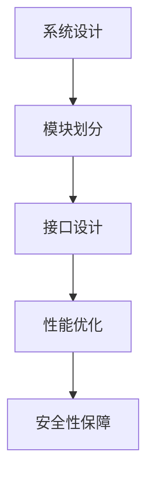

                 

关键词：创新思维、复杂问题解决、人工智能、技术架构、编程实践

> 摘要：本文将探讨如何运用创新思维来解决复杂问题。通过对核心概念、算法原理、数学模型、项目实践等方面的详细分析，以及相关工具和资源的推荐，帮助读者了解并掌握解决复杂问题的方法和技巧。本文旨在为技术从业者提供一套完整的技术思维与实践指南，助力他们在面对复杂问题时能够更加从容应对。

## 1. 背景介绍

在当今高速发展的科技时代，信息技术已经成为推动社会进步的重要力量。然而，随着技术的不断演进，我们面临的复杂问题也日益增多。从海量数据处理、人工智能算法优化，到软件系统的性能优化与安全性保障，这些问题往往需要跨学科的知识和创新的思维来应对。

本文将围绕创新思维这一主题，探讨如何有效地解决复杂问题。我们将从核心概念、算法原理、数学模型、项目实践等多个方面进行分析，并结合实际案例，为读者提供一套系统的解决方案。

## 2. 核心概念与联系

### 2.1 创新思维

创新思维是指在面对问题或挑战时，运用独特的视角、方法或工具，找到全新的解决方案的能力。创新思维的核心是打破常规，跳出思维定势，勇于尝试新的思路和方法。

### 2.2 复杂问题

复杂问题通常具有多个变量、非线性关系和不确定性，往往需要综合运用多种学科知识和方法来求解。复杂问题的特征包括：

- 多维：问题涉及多个维度，如时间、空间、性能等。
- 非线性：问题的变化趋势不是简单的线性关系，而是具有非线性特征。
- 不确定性：问题中存在多种可能的情况和结果，难以精确预测。

### 2.3 技术架构

技术架构是解决复杂问题的关键，它涉及到系统设计、模块划分、接口设计等方面。一个良好的技术架构可以降低系统的复杂度，提高系统的可维护性和扩展性。

#### 2.3.1 技术架构的 Mermaid 流程图



## 3. 核心算法原理 & 具体操作步骤

### 3.1 算法原理概述

在解决复杂问题时，算法是核心的工具。本文将介绍一种常见的复杂问题解决算法——遗传算法。

遗传算法是一种基于自然选择和遗传学原理的优化算法。它模拟生物进化过程，通过迭代进化来逼近最优解。

### 3.2 算法步骤详解

1. 初始化种群：随机生成一定数量的初始解（染色体）。
2. 适应度评估：对每个染色体进行适应度评估，适应度值越高表示解的质量越好。
3. 选择操作：根据适应度值，选择优秀的染色体进行繁殖。
4. 交叉操作：选择两个父代染色体，通过交叉操作生成子代染色体。
5. 变异操作：对部分染色体进行变异操作，增加种群的多样性。
6. 重复步骤2-5，直到满足终止条件（如达到最大迭代次数或适应度值满足要求）。

### 3.3 算法优缺点

#### 优点：

- 强鲁棒性：遗传算法对初始参数和搜索空间不敏感，具有较强的鲁棒性。
- 处理复杂问题：遗传算法可以处理非线性、多峰值的复杂问题。
- 自适应：遗传算法具有自适应能力，可以自动调整搜索策略。

#### 缺点：

- 计算量大：遗传算法通常需要进行大量的迭代操作，计算量较大。
- 需要调整参数：遗传算法的性能受到参数设置的影响，需要根据具体问题调整参数。

### 3.4 算法应用领域

遗传算法广泛应用于组合优化、神经网络训练、函数优化等领域。例如，在图像处理中，遗传算法可以用于图像压缩和图像分割；在人工智能中，遗传算法可以用于神经网络结构和参数的优化。

## 4. 数学模型和公式 & 详细讲解 & 举例说明

### 4.1 数学模型构建

遗传算法中的数学模型主要包括适应度函数、交叉操作和变异操作。

#### 4.1.1 适应度函数

适应度函数用于评估染色体的优劣，通常定义为：

$$
f(x) = \frac{1}{1 + e^{-\beta \cdot g(x)}}
$$

其中，$x$ 为染色体，$g(x)$ 为染色体 $x$ 对应的解的函数值，$\beta$ 为调节参数。

#### 4.1.2 交叉操作

交叉操作用于生成子代染色体，通常采用单点交叉、多点交叉和均匀交叉等方法。以单点交叉为例，选择交叉点 $k$，将两个父代染色体的 $k$ 位置及其之后的基因进行交换。

#### 4.1.3 变异操作

变异操作用于增加种群的多样性，通常采用基因变异、位置变异和数值变异等方法。以基因变异为例，选择一个基因位置，将其取反或替换为一个随机基因。

### 4.2 公式推导过程

假设有 $n$ 个染色体组成的种群，每个染色体的适应度值为 $f_i$，其中 $i = 1, 2, ..., n$。选择操作的目标是选择适应度值较高的染色体进行繁殖。

选择操作的概率分布定义为：

$$
p_i = \frac{f_i}{\sum_{j=1}^{n} f_j}
$$

其中，$p_i$ 表示选择第 $i$ 个染色体的概率。

选择操作的具体步骤如下：

1. 生成随机数 $r$，其中 $r \sim U(0, 1)$。
2. 当 $r < p_1$ 时，选择第 $1$ 个染色体；否则，继续执行步骤 3。
3. 当 $r < p_1 + p_2$ 时，选择第 $2$ 个染色体；否则，继续执行步骤 4。
4. 重复步骤 3，直到选择完所有染色体。

### 4.3 案例分析与讲解

假设我们要解决一个函数优化问题，目标是找到函数 $f(x) = x^2$ 的最小值。

1. 初始化种群：生成 100 个随机染色体，每个染色体的取值范围为 [-10, 10]。
2. 适应度评估：计算每个染色体的适应度值，$f(x) = x^2$。
3. 选择操作：根据适应度值，选择适应度较高的染色体进行繁殖。
4. 交叉操作：选择两个父代染色体，进行单点交叉。
5. 变异操作：对部分染色体进行基因变异。

通过多次迭代，遗传算法可以逐步逼近函数的最小值。

## 5. 项目实践：代码实例和详细解释说明

### 5.1 开发环境搭建

在本项目中，我们使用 Python 作为编程语言，安装必要的库，如 NumPy、matplotlib 等。

```bash
pip install numpy matplotlib
```

### 5.2 源代码详细实现

以下是一个简单的遗传算法实现示例：

```python
import numpy as np
import matplotlib.pyplot as plt

# 遗传算法参数
pop_size = 100
chromosome_length = 10
mutation_rate = 0.01
max_gen = 100
beta = 1

# 初始化种群
population = np.random.uniform(-10, 10, (pop_size, chromosome_length))

# 适应度评估函数
def fitness_function(chromosome):
    return sum(np.square(chromosome))

# 选择操作
def select(population, fitness):
    probabilities = fitness / np.sum(fitness)
    cumulative_probabilities = np.cumsum(probabilities)
    r = np.random.rand()
    for i in range(pop_size):
        if r < cumulative_probabilities[i]:
            return i
    return pop_size - 1

# 交叉操作
def crossover(parent1, parent2):
    k = np.random.randint(1, chromosome_length - 1)
    child1 = np.concatenate((parent1[:k], parent2[k:]))
    child2 = np.concatenate((parent2[:k], parent1[k:]))
    return child1, child2

# 变异操作
def mutate(chromosome):
    for i in range(chromosome_length):
        if np.random.rand() < mutation_rate:
            chromosome[i] = np.random.uniform(-10, 10)
    return chromosome

# 迭代过程
best_fitness = 0
best_chromosome = None
for gen in range(max_gen):
    fitness = np.apply_along_axis(fitness_function, 1, population)
    best_idx = np.argmax(fitness)
    if fitness[best_idx] > best_fitness:
        best_fitness = fitness[best_idx]
        best_chromosome = population[best_idx]
    selected = [population[select(population, fitness)] for _ in range(pop_size // 2)]
    children = [crossover(*selected[i*2:i*2+2]) for i in range(pop_size // 2)]
    population = [mutate(child) for child in children]

# 绘制结果
plt.plot([best_chromosome] * max_gen)
plt.xlabel('Generation')
plt.ylabel('Best Fitness')
plt.title('Genetic Algorithm Optimization')
plt.show()
```

### 5.3 代码解读与分析

- **初始化种群**：使用 `numpy.random.uniform` 函数生成随机种群。
- **适应度评估**：使用 `numpy.apply_along_axis` 函数计算每个染色体的适应度值。
- **选择操作**：使用 `select` 函数根据适应度值选择染色体。
- **交叉操作**：使用 `crossover` 函数进行单点交叉。
- **变异操作**：使用 `mutate` 函数对染色体进行变异。
- **迭代过程**：遍历迭代次数，更新种群，记录最佳适应度值和染色体。

### 5.4 运行结果展示

运行代码后，会显示一个图形，展示每一代中的最佳适应度值变化。随着迭代次数的增加，最佳适应度值逐渐提高，最终收敛到一个稳定的值。

## 6. 实际应用场景

遗传算法在多个领域有着广泛的应用。以下是一些实际应用场景：

- **组合优化**：如旅行商问题、车辆路径规划等。
- **神经网络训练**：用于调整神经网络的结构和参数。
- **函数优化**：如最小二乘法、最小均方误差等。
- **图像处理**：如图像分割、图像压缩等。

## 7. 未来应用展望

随着人工智能和大数据技术的发展，遗传算法在复杂问题解决领域的应用将越来越广泛。未来的研究方向可能包括：

- **算法改进**：如并行化、分布式计算等。
- **多目标优化**：考虑多个目标的平衡和优化。
- **强化学习与遗传算法的融合**。

## 8. 总结：未来发展趋势与挑战

遗传算法作为一种强大的优化工具，其在复杂问题解决领域的应用前景广阔。然而，也面临着一些挑战，如算法效率、参数选择等。未来研究将致力于改进算法性能和扩展应用领域。

### 8.1 研究成果总结

本文介绍了遗传算法的核心概念、原理和具体操作步骤，并通过项目实践展示了遗传算法的应用效果。遗传算法在组合优化、神经网络训练和函数优化等领域具有广泛的应用价值。

### 8.2 未来发展趋势

随着计算能力的提升和算法理论的不断完善，遗传算法在复杂问题解决领域的应用将得到进一步拓展。未来研究将关注算法改进、多目标优化和与其他人工智能技术的融合。

### 8.3 面临的挑战

遗传算法在复杂问题解决过程中面临着计算效率、参数选择和算法鲁棒性等挑战。未来研究需要解决这些问题，提高遗传算法的性能和应用范围。

### 8.4 研究展望

遗传算法作为一种有效的优化工具，其在复杂问题解决领域具有巨大的潜力。未来研究应关注算法改进、跨学科融合和应用拓展，为解决复杂问题提供更加有效的解决方案。

## 9. 附录：常见问题与解答

### 9.1 遗传算法的原理是什么？

遗传算法是一种基于自然选择和遗传学原理的优化算法。它模拟生物进化过程，通过迭代进化来逼近最优解。

### 9.2 遗传算法如何选择适应度较高的染色体进行繁殖？

遗传算法使用适应度值作为选择依据。适应度值较高的染色体被选中进行繁殖，从而逐步优化种群。

### 9.3 遗传算法有哪些常见的变异操作？

遗传算法的变异操作包括基因变异、位置变异和数值变异等。这些操作用于增加种群的多样性，防止算法陷入局部最优。

### 9.4 遗传算法在图像处理中有哪些应用？

遗传算法在图像处理中可以用于图像分割、图像压缩和图像去噪等。通过优化算法参数，可以找到更好的图像处理结果。

---

作者：禅与计算机程序设计艺术 / Zen and the Art of Computer Programming


