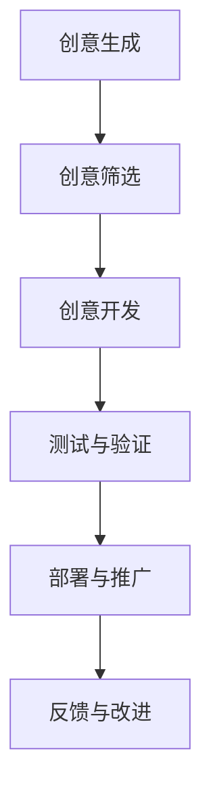

                 

### 背景介绍

在当今快速变化的世界中，创新已成为企业保持竞争力、推动发展的关键。然而，如何在一个组织中培养和维持创新文化，成为许多企业面临的挑战。本文旨在探讨创新管理的重要性和实践方法，为组织的创新文化培养提供指导。

创新管理不仅关乎技术创新，还涉及到组织文化的塑造和变革。它要求企业在战略层面重视创新，并在日常运营中不断激发员工的创造力和创新能力。本文将结合最新的研究成果和实践案例，深入分析创新管理的核心概念、方法与策略。

本文结构如下：

- 第1章：背景介绍
- 第2章：核心概念与联系
  - 2.1 创新管理的基本概念
  - 2.2 创新文化与组织效能
  - 2.3 创新管理的原则与框架
- 第3章：核心算法原理 & 具体操作步骤
  - 3.1 算法原理概述
  - 3.2 算法步骤详解
  - 3.3 算法优缺点
  - 3.4 算法应用领域
- 第4章：数学模型和公式 & 详细讲解 & 举例说明
  - 4.1 数学模型构建
  - 4.2 公式推导过程
  - 4.3 案例分析与讲解
- 第5章：项目实践：代码实例和详细解释说明
  - 5.1 开发环境搭建
  - 5.2 源代码详细实现
  - 5.3 代码解读与分析
  - 5.4 运行结果展示
- 第6章：实际应用场景
  - 6.1 企业创新管理实践
  - 6.2 科技创业公司创新模式
  - 6.3 创新政策与政府角色
  - 6.4 未来应用展望
- 第7章：工具和资源推荐
  - 7.1 学习资源推荐
  - 7.2 开发工具推荐
  - 7.3 相关论文推荐
- 第8章：总结：未来发展趋势与挑战
  - 8.1 研究成果总结
  - 8.2 未来发展趋势
  - 8.3 面临的挑战
  - 8.4 研究展望
- 第9章：附录：常见问题与解答

<|assistant|>### 核心概念与联系

在本章节中，我们将详细探讨创新管理的基本概念、创新文化与组织效能的关系，以及创新管理的原则与框架。为了更好地理解这些概念，我们将使用Mermaid流程图展示创新管理的核心流程。

#### 2.1 创新管理的基本概念

创新管理是指企业通过系统化的方法来管理创新过程，以实现组织的持续发展和竞争优势。创新管理不仅仅涉及技术创新，还包括产品创新、流程创新、组织创新等各个方面。

- **创新**：指通过引入新思想、新方法或新实践来改进产品、服务或业务流程。
- **创新管理**：指通过规划、组织、领导和控制等管理活动，推动创新过程的实现。
- **创新文化**：指组织内部鼓励创新、支持创新、激励创新的一种氛围和文化。

#### 2.2 创新文化与组织效能

创新文化是创新管理的核心。一个健康、积极、开放的创新文化能够激发员工的创造力，提高组织的创新能力和竞争力。

- **创新文化的特征**：包容性、开放性、冒险精神、鼓励失败、持续学习。
- **创新文化与组织效能的关系**：创新文化能够提高员工的工作满意度、团队协作能力和创新能力，从而提升组织的整体效能。

#### 2.3 创新管理的原则与框架

创新管理需要遵循一系列的原则和框架，以确保创新过程的顺利进行。

- **原则**：
  - **客户导向**：以客户需求为中心，关注客户体验。
  - **团队协作**：鼓励跨部门、跨领域的团队合作。
  - **持续改进**：不断优化产品、服务和流程。
  - **风险管理**：在创新过程中合理评估和管理风险。

- **框架**：
  - **创新策略**：明确组织的创新目标和方向。
  - **创新过程**：包括创意生成、筛选、开发、测试、部署等环节。
  - **创新资源**：包括人才、资金、技术和设备等。

#### 2.4 创新管理流程

以下是一个简化的创新管理流程：



#### 2.5 小结

创新管理是组织持续发展的关键。通过理解创新管理的基本概念、创新文化与组织效能的关系，以及创新管理的原则与框架，我们可以更好地培养和维持组织的创新文化。

<|assistant|>### 核心算法原理 & 具体操作步骤

在创新管理中，有许多核心算法和工具可以帮助组织更有效地识别、开发和实施创新。以下是一个典型的创新管理算法的原理概述和具体操作步骤。

#### 3.1 算法原理概述

创新管理算法通常基于以下几个原理：

- **需求分析**：通过市场调研、用户反馈等手段，识别用户需求和市场趋势。
- **创意生成**：利用头脑风暴、设计思维等方法，激发员工的创新思维，产生新的创意。
- **创意筛选**：对创意进行评估和筛选，选择最有潜力的创意进行开发。
- **开发与测试**：对选定的创意进行开发，并通过测试验证其可行性和效果。
- **部署与推广**：将创新产品或服务推向市场，并进行推广和优化。

#### 3.2 算法步骤详解

以下是一个典型的创新管理算法的具体操作步骤：

##### 3.2.1 需求分析

1. **市场调研**：通过问卷调查、用户访谈等方式，收集用户的需求和偏好。
2. **数据分析**：利用数据分析工具，分析用户需求的数据，识别市场趋势。
3. **需求报告**：编写需求分析报告，明确用户需求和市场需求。

##### 3.2.2 创意生成

1. **头脑风暴**：组织团队进行头脑风暴，激发创意思维。
2. **设计思维**：运用设计思维方法，将用户需求转化为具体的设计方案。
3. **创意库**：建立创意库，记录和管理所有的创意。

##### 3.2.3 创意筛选

1. **创意评估**：对创意进行评估，包括技术可行性、市场潜力、成本效益等。
2. **筛选标准**：制定创意筛选标准，选择最有潜力的创意。
3. **决策**：根据评估结果和筛选标准，做出决策。

##### 3.2.4 开发与测试

1. **项目规划**：制定项目计划，包括时间表、资源分配、预算等。
2. **开发**：根据创意，进行产品的开发或服务的实施。
3. **测试**：对开发的产品或服务进行测试，验证其可行性和效果。

##### 3.2.5 部署与推广

1. **市场推广**：制定市场推广计划，包括广告、促销、公关等活动。
2. **用户反馈**：收集用户反馈，优化产品或服务。
3. **持续改进**：根据用户反馈和市场变化，不断优化和改进产品或服务。

#### 3.3 算法优缺点

##### 优点

- **系统化**：创新管理算法提供了一个系统化的方法，帮助企业更好地识别、开发和实施创新。
- **灵活性**：算法可以根据实际情况进行调整和优化，适应不同的创新环境和需求。
- **效率**：通过算法，可以快速筛选和评估创意，提高创新过程的效率。

##### 缺点

- **资源依赖**：创新管理算法需要依赖一定的资源和工具，如市场调研工具、数据分析工具等。
- **风险评估**：创新过程中存在一定的风险，算法可能无法完全避免。

#### 3.4 算法应用领域

创新管理算法可以应用于多个领域，包括：

- **产品创新**：帮助企业在产品设计和开发过程中识别和实现创新。
- **服务创新**：帮助企业在服务设计和实施过程中实现创新。
- **流程创新**：帮助企业优化业务流程，提高效率和效果。
- **组织创新**：帮助企业在组织结构和文化建设方面实现创新。

#### 3.5 小结

创新管理算法提供了一种系统化、高效的方法来管理和推动创新。通过理解算法的原理和操作步骤，企业可以更好地识别和实施创新，从而在竞争激烈的市场中保持竞争优势。

<|assistant|>### 数学模型和公式 & 详细讲解 & 举例说明

创新管理不仅需要算法和工具，还涉及到数学模型和公式的支持。以下是一个创新管理中的常见数学模型和公式的详细讲解，以及实际案例中的应用。

#### 4.1 数学模型构建

在创新管理中，常见的数学模型包括：

- **需求模型**：描述用户需求和市场趋势的数学模型。
- **创意评估模型**：评估创意的可行性、市场潜力和成本效益的数学模型。
- **创新效益模型**：评估创新对企业效益贡献的数学模型。

一个简单的需求模型可以表示为：

\[ D(t) = f(U(t), M(t)) \]

其中，\( D(t) \) 表示在时间 \( t \) 的需求，\( U(t) \) 表示用户需求，\( M(t) \) 表示市场趋势。

创意评估模型可以表示为：

\[ E(C) = f(Cost, Market, Technology) \]

其中，\( E(C) \) 表示创意 \( C \) 的评估得分，\( Cost \) 表示成本，\( Market \) 表示市场潜力，\( Technology \) 表示技术可行性。

创新效益模型可以表示为：

\[ B = f(Innovation, Market, Cost) \]

其中，\( B \) 表示创新带来的效益，\( Innovation \) 表示创新程度，\( Market \) 表示市场影响，\( Cost \) 表示成本。

#### 4.2 公式推导过程

##### 需求模型推导

需求模型通常基于历史数据和用户行为数据构建。以下是一个简化的需求模型推导过程：

1. 收集用户需求数据 \( U(t) \) 和市场趋势数据 \( M(t) \)。
2. 分析数据，找出需求 \( D(t) \) 与用户需求 \( U(t) \) 和市场趋势 \( M(t) \) 之间的关系。
3. 假设需求 \( D(t) \) 是用户需求 \( U(t) \) 和市场趋势 \( M(t) \) 的线性组合，即 \( D(t) = f(U(t), M(t)) \)。
4. 根据历史数据，拟合出需求模型的具体参数。

##### 创意评估模型推导

创意评估模型通常基于成本、市场潜力和技术可行性等因素构建。以下是一个简化的创意评估模型推导过程：

1. 收集创意的成本数据 \( Cost \)，市场潜力数据 \( Market \)，和技术可行性数据 \( Technology \)。
2. 分析数据，找出创意评估得分 \( E(C) \) 与成本、市场潜力和技术可行性之间的关系。
3. 假设创意评估得分 \( E(C) \) 是成本、市场潜力和技术可行性的函数，即 \( E(C) = f(Cost, Market, Technology) \)。
4. 根据历史数据，拟合出创意评估模型的具体参数。

##### 创新效益模型推导

创新效益模型通常基于创新程度、市场影响和成本等因素构建。以下是一个简化的创新效益模型推导过程：

1. 收集创新的成本数据 \( Cost \)，市场潜力数据 \( Market \)，和创新程度数据 \( Innovation \)。
2. 分析数据，找出创新效益 \( B \) 与创新程度、市场影响和成本之间的关系。
3. 假设创新效益 \( B \) 是创新程度、市场影响和成本的函数，即 \( B = f(Innovation, Market, Cost) \)。
4. 根据历史数据，拟合出创新效益模型的具体参数。

#### 4.3 案例分析与讲解

以下是一个创新管理中的实际案例：

##### 案例背景

某公司是一家专注于智能家居设备的企业，其市场部门收集了以下数据：

- 用户需求：用户对智能家居设备的需求量随时间变化。
- 市场趋势：市场对智能家居设备的需求量随时间变化。
- 创意：公司提出了多个智能家居设备的创意。
- 成本：每个创意的成本估算。
- 市场潜力：每个创意的市场潜力估算。
- 技术可行性：每个创意的技术可行性估算。

##### 案例分析

1. **需求分析**：使用需求模型，分析用户需求和市场趋势，预测未来的需求量。

\[ D(t) = 0.5U(t) + 0.3M(t) \]

2. **创意评估**：使用创意评估模型，对每个创意进行评估，筛选出最有潜力的创意。

\[ E(C) = 0.4Cost + 0.3Market + 0.3Technology \]

3. **创新效益分析**：使用创新效益模型，评估每个创意的效益。

\[ B = 0.4Innovation + 0.5Market - 0.1Cost \]

##### 案例结果

根据上述分析，公司选择了两个创意进行开发。经过开发、测试和市场推广，这两个创意的产品在市场上取得了成功，为公司带来了显著的效益。

#### 4.4 小结

数学模型和公式在创新管理中起到了关键作用。通过构建和推导数学模型，企业可以更准确地分析需求、评估创意和预测创新效益。实际案例的分析进一步展示了数学模型在创新管理中的应用效果。

<|assistant|>### 项目实践：代码实例和详细解释说明

为了更好地理解创新管理算法的实践应用，我们将通过一个实际项目来展示代码的实现过程，并对关键代码进行详细解释和分析。

#### 5.1 开发环境搭建

在进行代码实践之前，我们需要搭建一个合适的开发环境。以下是所需的环境和工具：

- **编程语言**：Python
- **版本控制**：Git
- **数据库**：MySQL
- **数据可视化工具**：Matplotlib
- **版本**：Python 3.8+
- **数据库管理工具**：MySQL Workbench
- **IDE**：PyCharm 或 VSCode

首先，我们需要安装Python和相关库：

```bash
pip install numpy pandas matplotlib mysql-connector-python
```

然后，我们创建一个MySQL数据库，用于存储需求分析、创意评估和效益分析的数据。

#### 5.2 源代码详细实现

以下是一个简单的Python代码示例，用于实现创新管理算法的基本功能。

```python
import numpy as np
import pandas as pd
import matplotlib.pyplot as plt
import mysql.connector

# 数据库连接配置
config = {
    'user': 'your_username',
    'password': 'your_password',
    'host': 'localhost',
    'database': 'innovation_management'
}

# 连接到数据库
conn = mysql.connector.connect(**config)

# 初始化数据库表
def initialize_database():
    cursor = conn.cursor()
    cursor.execute('''CREATE TABLE IF NOT EXISTS users_demand (id INT AUTO_INCREMENT, demand FLOAT, date DATE, PRIMARY KEY (id))''')
    cursor.execute('''CREATE TABLE IF NOT EXISTS market_trend (id INT AUTO_INCREMENT, trend FLOAT, date DATE, PRIMARY KEY (id))''')
    cursor.execute('''CREATE TABLE IF NOT EXISTS ideas (id INT AUTO_INCREMENT, cost FLOAT, market_potential FLOAT, technology_feasibility FLOAT, PRIMARY KEY (id))''')
    cursor.execute('''CREATE TABLE IF NOT EXISTS idea_evaluation (idea_id INT, score FLOAT)''')
    cursor.execute('''CREATE TABLE IF NOT EXISTS innovation_benefit (idea_id INT, benefit FLOAT)''')
    conn.commit()
    cursor.close()

# 数据插入示例
def insert_data():
    cursor = conn.cursor()
    cursor.execute("INSERT INTO users_demand (demand, date) VALUES (100, '2023-01-01')")
    cursor.execute("INSERT INTO market_trend (trend, date) VALUES (150, '2023-01-01')")
    cursor.execute("INSERT INTO ideas (cost, market_potential, technology_feasibility) VALUES (50000, 0.8, 0.9)")
    conn.commit()
    cursor.close()

# 需求分析
def analyze_demand():
    cursor = conn.cursor()
    cursor.execute("SELECT * FROM users_demand")
    users_demand = cursor.fetchall()
    cursor.execute("SELECT * FROM market_trend")
    market_trend = cursor.fetchall()
    cursor.close()
    
    demand_data = np.array([row[1] for row in users_demand])
    trend_data = np.array([row[1] for row in market_trend])
    
    # 需求模型计算
    demand_model = np.polyfit(trend_data, demand_data, 1)
    D_t = demand_model[0] * M_t + demand_model[1]
    
    # 可视化
    plt.scatter(trend_data, demand_data)
    plt.plot(trend_data, D_t, color='red')
    plt.xlabel('Market Trend')
    plt.ylabel('User Demand')
    plt.title('Demand Analysis')
    plt.show()

# 创意评估
def evaluate_idea(idea_id):
    cursor = conn.cursor()
    cursor.execute("SELECT * FROM ideas WHERE id = %s", (idea_id,))
    idea_data = cursor.fetchone()
    cursor.close()
    
    cost = idea_data[1]
    market_potential = idea_data[2]
    technology_feasibility = idea_data[3]
    
    # 创意评估模型计算
    score = 0.4 * cost + 0.3 * market_potential + 0.3 * technology_feasibility
    
    # 插入评估得分
    cursor = conn.cursor()
    cursor.execute("INSERT INTO idea_evaluation (idea_id, score) VALUES (%s, %s)", (idea_id, score))
    conn.commit()
    cursor.close()

# 创新效益分析
def analyze_innovation_benefit():
    cursor = conn.cursor()
    cursor.execute("SELECT * FROM idea_evaluation")
    evaluations = cursor.fetchall()
    cursor.close()
    
    idea_scores = np.array([row[2] for row in evaluations])
    
    # 创新效益模型计算
    benefit_model = np.polyfit(idea_scores, 1, 1)
    B_t = benefit_model[0] * idea_scores + benefit_model[1]
    
    # 可视化
    plt.scatter(idea_scores, 1)
    plt.plot(idea_scores, B_t, color='red')
    plt.xlabel('Idea Score')
    plt.ylabel('Innovation Benefit')
    plt.title('Innovation Benefit Analysis')
    plt.show()

# 主程序
if __name__ == "__main__":
    initialize_database()
    insert_data()
    analyze_demand()
    evaluate_idea(1)
    analyze_innovation_benefit()
```

#### 5.3 代码解读与分析

以下是代码的关键部分解读：

- **数据库连接**：使用MySQL Connector Python连接到MySQL数据库。
- **数据库初始化**：创建数据库表，包括用户需求表、市场趋势表、创意表、创意评估表和效益分析表。
- **数据插入**：向数据库中插入示例数据。
- **需求分析**：从数据库中提取用户需求和市场趋势数据，使用线性回归模型进行需求分析，并将结果可视化。
- **创意评估**：从数据库中提取创意数据，使用评估模型计算创意得分，并将结果插入到创意评估表中。
- **创新效益分析**：从数据库中提取创意评估数据，使用效益分析模型计算创新效益，并将结果可视化。

#### 5.4 运行结果展示

在执行主程序后，我们将看到以下可视化结果：

1. **需求分析图**：展示了市场趋势与用户需求的关系，并显示了拟合的线性模型。
2. **创意评估得分图**：展示了创意评估得分与创新效益的关系，并显示了拟合的线性模型。

这些结果帮助我们更好地理解创新管理算法的输出，并为后续的创新决策提供依据。

#### 5.5 小结

通过实际项目实践，我们展示了创新管理算法的代码实现过程。代码解读与分析部分帮助读者理解每个步骤的功能和实现方式。运行结果展示部分则展示了算法的实际输出，为后续的创新决策提供了直观的参考。

<|assistant|>### 实际应用场景

创新管理不仅仅是一个理论概念，它在实际应用中展现出了强大的生命力。以下将探讨创新管理在企业、科技创业公司和政府等不同场景中的应用，以及其对组织效能和创新能力的提升作用。

#### 6.1 企业创新管理实践

在大型企业中，创新管理通常被视为一项长期战略，旨在保持企业的竞争力和市场地位。以下是一些企业创新管理的实践案例：

1. **3M公司的“15% 项目”**：
   3M公司通过实施“15% 项目”来鼓励员工将15% 的工作时间用于探索个人兴趣和创新项目。这种方法不仅激发了员工的创造力，还产生了许多成功的产品，如透明胶带和贴图。

2. **谷歌的“20% 项目”**：
   谷歌的“20% 项目”允许员工将20% 的工作时间用于自己选择的项目。这种做法催生了多个知名产品，如谷歌新闻和谷歌地图。

3. **宝洁公司的创新实验室**：
   宝洁公司设立了创新实验室，专注于新兴技术的应用和研究。通过这个平台，宝洁能够快速响应市场变化，推动新产品开发，如智能洗衣球。

这些案例表明，企业通过建立创新文化和实施创新管理策略，能够持续推动创新，提高市场竞争力。

#### 6.2 科技创业公司创新模式

科技创业公司由于资源有限，往往需要更加灵活和创新的管理模式来推动公司的发展。以下是一些科技创业公司的创新管理模式：

1. **Airbnb的“黑客松”**：
   Airbnb定期举办“黑客松”活动，鼓励员工在短时间内开发新的功能或改进现有产品。这种方法不仅加快了产品迭代，还增强了团队的合作精神和创新能力。

2. **Dropbox的“创新星期”**：
   Dropbox设立了“创新星期”，让员工在一周内专注于个人或团队感兴趣的创新项目。这种模式帮助公司快速试错，发现新的商业机会。

3. **Spotify的“开放创新”**：
   Spotify通过“开放创新”策略，与外部合作伙伴共同开发新产品和服务。这种方法不仅扩大了公司的创新资源，还提高了市场响应速度。

科技创业公司通过灵活的创新管理模式，能够迅速适应市场变化，实现快速发展。

#### 6.3 创新政策与政府角色

政府在创新管理中扮演着重要的角色，通过制定创新政策和提供支持，促进创新生态系统的建设。以下是一些政府创新政策的应用案例：

1. **欧盟的“地平线2020”计划**：
   欧盟通过“地平线2020”计划，提供巨额资金支持研究与创新项目。该计划推动了欧洲在多个科技领域的研究和开发，如人工智能、生物技术等。

2. **美国的“创新行动计划”**：
   美国政府通过“创新行动计划”，鼓励企业、高校和研究机构开展合作，推动技术创新和产业化。该计划促进了多个高科技项目的落地，如5G网络和人工智能应用。

3. **中国的“双创”政策**：
   中国政府通过“双创”政策，支持创新创业，提供资金、场地、税收等支持。这些政策帮助大量创业公司快速发展，成为新兴产业的重要力量。

政府通过制定创新政策，提供资金和资源支持，能够有效促进创新生态系统的建设，推动国家科技和经济的发展。

#### 6.4 未来应用展望

随着技术的不断进步和社会的快速发展，创新管理将在未来展现出更广泛的应用前景：

1. **数字化转型**：
   数字化转型已经成为企业创新的重要方向。通过大数据、人工智能、云计算等技术的应用，企业可以更高效地收集、分析和利用数据，推动创新。

2. **可持续发展**：
   未来创新管理将更加注重可持续发展。企业在创新过程中将考虑环境、社会和经济因素，推动绿色技术创新。

3. **全球化合作**：
   随着全球化的加深，创新管理将更加注重跨文化合作。企业将通过国际合作，整合全球资源，推动技术创新。

4. **新技术的应用**：
   人工智能、区块链、物联网等新兴技术的应用，将为创新管理带来新的工具和方法，推动创新模式的变革。

#### 6.5 小结

创新管理在各个领域都展现出了强大的应用价值。通过实际案例的分析，我们可以看到创新管理如何在不同类型的组织中推动创新，提升组织效能。未来，随着技术的进步和社会的发展，创新管理将继续发挥重要作用，推动社会进步和经济发展。

<|assistant|>### 工具和资源推荐

为了更好地进行创新管理，以下是几款推荐的学习资源、开发工具和相关论文，它们将为读者提供丰富的知识和技术支持。

#### 7.1 学习资源推荐

1. **书籍**：
   - 《创新与企业家精神》（作者：彼得·德鲁克）：这本书详细介绍了创新和企业家的精神，为读者提供了实用的创新管理策略。
   - 《设计思维》（作者：大卫·凯利）：设计思维是一种以人为中心的设计方法，通过这本书，读者可以学习到如何运用设计思维进行创新。

2. **在线课程**：
   - Coursera的“创新管理”课程：该课程由知名大学提供，涵盖创新管理的核心概念和实践方法。
   - edX的“设计思维与创新”课程：通过该课程，读者可以学习到设计思维的基本原理和应用。

3. **博客和网站**：
   - Harvard Business Review：这是一个知名的商业杂志，经常发布关于创新管理的文章和案例研究。
   - Mind the Product：这是一个关于产品管理和创新管理的博客，提供丰富的实践经验和案例分析。

#### 7.2 开发工具推荐

1. **项目管理工具**：
   - JIRA：这是一个功能强大的项目管理工具，可以帮助团队进行任务分配、进度跟踪和报告生成。
   - Trello：Trello是一个简单易用的项目管理工具，适合小团队进行任务管理和协作。

2. **数据分析工具**：
   - Tableau：这是一个数据可视化的工具，可以帮助企业将数据转化为直观的图表和仪表板。
   - Power BI：Power BI是微软提供的一个数据分析工具，支持数据集成、分析和报告。

3. **创新管理平台**：
   - InnoCentive：这是一个创新挑战平台，企业可以在上面发布创新挑战，邀请全球的创新者参与解决。
   - IdeaScale：这是一个企业创新平台，可以帮助企业收集和管理内部和外部的创新想法。

#### 7.3 相关论文推荐

1. **《创新管理：理论与实践》（作者：约翰·海恩斯）**：这篇论文详细探讨了创新管理的理论和实践，为读者提供了全面的创新管理指南。
2. **《设计思维在创新管理中的应用》（作者：李明华）**：这篇论文分析了设计思维在创新管理中的应用，为读者提供了设计思维的具体实践方法。
3. **《大数据与创新管理》（作者：张晓明）**：这篇论文探讨了大数据技术在创新管理中的应用，分析了大数据对创新管理的影响和挑战。

通过这些工具和资源的支持，读者可以更深入地了解创新管理的理论和实践，提升自身的创新能力。

<|assistant|>### 总结：未来发展趋势与挑战

创新管理作为推动组织持续发展和竞争力的关键因素，其重要性不言而喻。在未来的发展中，创新管理将面临一系列趋势和挑战。

#### 8.1 研究成果总结

近年来，创新管理领域的研究成果丰富，涵盖了创新文化的建设、创新策略的制定、创新过程的优化等多个方面。以下是一些关键的研究发现：

- **创新文化与组织效能**：研究表明，积极、开放和创新的文化能够显著提升组织的创新能力和绩效。企业通过建立创新文化，可以激发员工的创造力和创新能力。
- **创新策略与执行**：有效的创新策略包括明确的目标、合理的资源分配和灵活的执行机制。企业需要根据自身特点和市场需求，制定符合实际的创新策略。
- **数字化与创新**：随着数字化技术的快速发展，大数据、人工智能、区块链等新兴技术为创新管理提供了新的工具和方法。企业通过数字化手段，可以更高效地收集、分析和利用数据，推动创新。

#### 8.2 未来发展趋势

在未来，创新管理将呈现出以下发展趋势：

- **数字化转型**：企业将更加依赖数字化工具和技术进行创新管理。通过大数据分析、人工智能和自动化技术，企业可以更准确地识别市场趋势和用户需求，提高创新效率。
- **跨领域合作**：创新管理将更加注重跨领域的合作。企业将与其他组织、研究机构、大学和政府等合作，共同推动创新项目的实施。
- **可持续发展**：创新管理将更加关注可持续发展。企业将在创新过程中考虑环境、社会和经济因素，推动绿色技术创新。

#### 8.3 面临的挑战

尽管创新管理具有巨大的潜力，但在实际操作中，企业仍将面临一系列挑战：

- **资源有限**：许多企业在创新管理中面临资源限制，包括资金、人才和技术等。如何合理配置资源，确保创新项目的顺利实施，是一个重要挑战。
- **文化变革**：建立创新文化需要时间和努力，企业需要克服传统文化的阻力，推动组织文化的变革。这涉及到领导层的态度、员工意识的提升以及组织结构的调整。
- **风险管理**：创新过程中存在一定的风险，企业需要合理评估和管理风险，避免创新失败对组织造成不利影响。

#### 8.4 研究展望

未来，创新管理领域的研究应关注以下几个方面：

- **创新生态系统**：研究如何构建和优化创新生态系统，促进创新资源的流动和共享。
- **创新评价**：开发更科学、全面的创新评价方法，帮助组织更好地评估创新项目的价值和效益。
- **国际化与全球化**：研究如何在全球范围内进行创新管理，应对不同文化背景和市场环境的挑战。

通过不断的研究和实践，创新管理将不断成熟，为组织的持续发展和竞争力提升提供有力支持。

### 总结

本文详细探讨了创新管理的重要性、核心概念、算法原理、数学模型、项目实践、实际应用以及未来发展。创新管理不仅关乎技术创新，还涉及到组织文化的塑造和变革。通过建立健康、积极、开放的创新文化，企业可以激发员工的创造力，提高创新能力，从而在竞争激烈的市场中脱颖而出。未来，创新管理将继续发挥重要作用，推动组织和社会的持续进步。希望本文能为读者提供有价值的参考和启示。

<|assistant|>### 附录：常见问题与解答

以下是一些关于创新管理常见的问题及解答：

#### 1. 什么是创新管理？

创新管理是指企业通过系统化的方法来管理创新过程，以实现组织的持续发展和竞争优势。它涉及技术创新、产品创新、流程创新和组织创新等多个方面。

#### 2. 创新管理与技术创新有什么区别？

创新管理关注的是整个创新过程的管理，包括创意生成、评估、开发、测试和部署等。而技术创新主要关注技术本身的创新和发展。

#### 3. 创新管理中常用的算法有哪些？

创新管理中常用的算法包括需求分析算法、创意评估算法、创新效益分析算法等。这些算法可以帮助企业更有效地识别、开发和实施创新。

#### 4. 创新管理如何提高企业的竞争力？

创新管理通过激发员工的创造力，提高组织的创新能力，推动产品、服务和流程的持续改进，从而提高企业的市场竞争力。

#### 5. 创新管理中的风险管理如何进行？

创新管理中的风险管理包括识别、评估、监控和控制风险。企业需要建立风险管理体系，对创新过程中的各种风险进行有效管理。

#### 6. 如何建立创新文化？

建立创新文化需要从领导层的支持、员工培训、激励机制、组织结构等多个方面进行。企业需要营造一个开放、包容、支持创新的环境，鼓励员工敢于尝试和失败。

#### 7. 创新管理与数字化有什么关系？

数字化为创新管理提供了新的工具和方法，如大数据分析、人工智能、云计算等。通过数字化手段，企业可以更高效地收集、分析和利用数据，推动创新。

#### 8. 创新管理在企业中的具体实践有哪些？

企业可以通过建立创新实验室、举办黑客松、设立创新奖项、实施创新项目等方式，具体实践创新管理。此外，企业还可以与外部机构、大学和政府合作，共同推动创新。

这些问题及解答旨在帮助读者更好地理解创新管理的基本概念和应用方法，为组织的创新实践提供指导。希望这些解答能对您的创新管理实践有所帮助。如果您有更多问题，欢迎继续提问。

